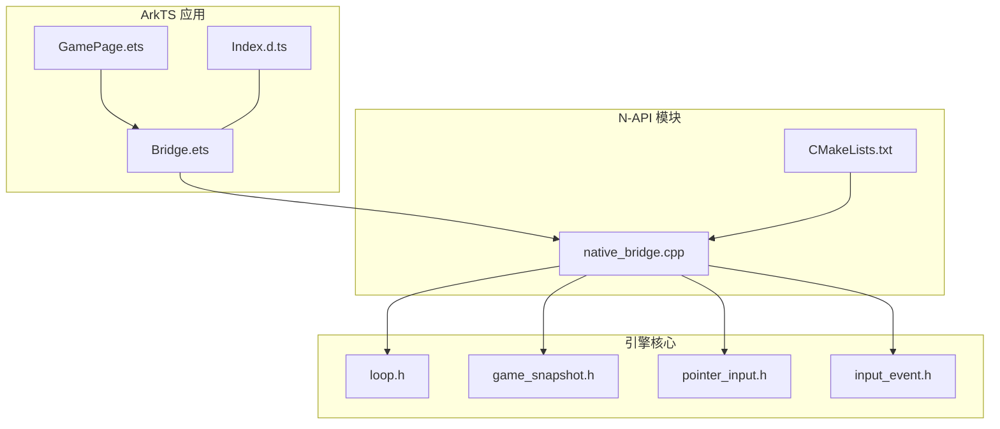
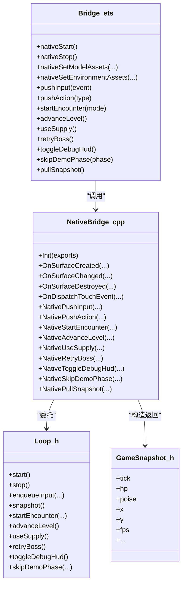

# NAPI 桥接层

<cite>
**本文引用的文件**   
- [Bridge.ets](file://entry/src/main/ets/napi/Bridge.ets)
- [native_bridge.cpp](file://entry/src/main/cpp/native_bridge.cpp)
- [Index.d.ts](file://entry/src/main/cpp/types/libnative_game/Index.d.ts)
- [CMakeLists.txt](file://entry/src/main/cpp/CMakeLists.txt)
- [loop.h](file://native/engine/core/loop.h)
- [game_snapshot.h](file://native/engine/core/game_snapshot.h)
- [pointer_input.h](file://native/engine/input/pointer_input.h)
- [input_event.h](file://native/engine/input/input_event.h)
- [GamePage.ets](file://entry/src/main/ets/pages/GamePage.ets)
- [test_bridge_contract.mjs](file://tests/test_bridge_contract.mjs)
</cite>

## 目录
1. [简介](#简介)
2. [项目结构](#项目结构)
3. [核心组件](#核心组件)
4. [架构总览](#架构总览)
5. [详细组件分析](#详细组件分析)
6. [依赖关系分析](#依赖关系分析)
7. [性能考量](#性能考量)
8. [故障排查指南](#故障排查指南)
9. [结论](#结论)
10. [附录：API 参考与调用示例](#附录api-参考与调用示例)

## 简介
本文件为 my-world 的 NAPI 桥接层提供完整技术文档，聚焦 JavaScript（ArkTS）与 C++ 之间的通信机制。内容涵盖 Bridge.ets 中的接口定义、native_bridge.cpp 中的实现细节、数据类型转换、内存管理、错误处理策略、暴露给 JS 层的 API、参数验证、返回值处理、异步支持、原生异常与 JS 错误的处理方式、调试工具与常见问题排查方法，以及性能优化建议。

## 项目结构
NAPI 桥接层由三部分构成：
- ArkTS 侧接口封装：entry/src/main/ets/napi/Bridge.ets
- C++ 侧 N-API 实现：entry/src/main/cpp/native_bridge.cpp
- TypeScript 类型声明：entry/src/main/cpp/types/libnative_game/Index.d.ts

构建与链接通过 entry/src/main/cpp/CMakeLists.txt 完成，将 native_bridge.cpp 与引擎核心（Loop、Input、Render、Gameplay 等）链接为 libnative_game.so，供 ArkTS 通过 XComponent 加载。



**图表来源** 
- [Bridge.ets:1-94](file://entry/src/main/ets/napi/Bridge.ets#L1-L94)
- [native_bridge.cpp:518-576](file://entry/src/main/cpp/native_bridge.cpp#L518-L576)
- [Index.d.ts:1-81](file://entry/src/main/cpp/types/libnative_game/Index.d.ts#L1-L81)
- [CMakeLists.txt:26-135](file://entry/src/main/cpp/CMakeLists.txt#L26-L135)
- [loop.h:26-104](file://native/engine/core/loop.h#L26-L104)
- [game_snapshot.h:7-74](file://native/engine/core/game_snapshot.h#L7-L74)
- [pointer_input.h:7-36](file://native/engine/input/pointer_input.h#L7-L36)
- [input_event.h:4-24](file://native/engine/input/input_event.h#L4-L24)

**章节来源**
- [Bridge.ets:1-94](file://entry/src/main/ets/napi/Bridge.ets#L1-L94)
- [native_bridge.cpp:518-576](file://entry/src/main/cpp/native_bridge.cpp#L518-L576)
- [Index.d.ts:1-81](file://entry/src/main/cpp/types/libnative_game/Index.d.ts#L1-L81)
- [CMakeLists.txt:26-135](file://entry/src/main/cpp/CMakeLists.txt#L26-L135)

## 核心组件
- Bridge.ets：导出所有 N-API 函数与 Snapshot 类型，作为 ArkTS 调用原生能力的统一入口。
- native_bridge.cpp：实现 N-API 回调、参数校验、数据拷贝、生命周期控制、输入事件转发、快照构造与返回。
- Index.d.ts：为 ArkTS 提供强类型签名，保证编译期一致性。
- Loop（loop.h）：游戏主循环、输入队列、渲染表面、状态快照等核心运行时。
- GameSnapshot（game_snapshot.h）：跨语言传递的游戏帧快照数据结构。
- InputEvent/PointerInput（input_event.h, pointer_input.h）：输入动作枚举与坐标/类型转换工具。

**章节来源**
- [Bridge.ets:1-94](file://entry/src/main/ets/napi/Bridge.ets#L1-L94)
- [native_bridge.cpp:1-577](file://entry/src/main/cpp/native_bridge.cpp#L1-L577)
- [Index.d.ts:1-81](file://entry/src/main/cpp/types/libnative_game/Index.d.ts#L1-L81)
- [loop.h:26-104](file://native/engine/core/loop.h#L26-L104)
- [game_snapshot.h:7-74](file://native/engine/core/game_snapshot.h#L7-L74)
- [pointer_input.h:7-36](file://native/engine/input/pointer_input.h#L7-L36)
- [input_event.h:4-24](file://native/engine/input/input_event.h#L4-L24)

## 架构总览
NAPI 桥接层采用“ArkTS 调用 -> N-API 回调 -> 引擎核心”的单向同步调用模式，配合 XComponent 的生命周期回调进行渲染与输入事件分发。

```mermaid
sequenceDiagram
participant UI as "ArkTS(GamePage)"
participant Bridge as "Bridge.ets"
participant NAPI as "native_bridge.cpp"
participant Loop as "Loop(引擎)"
participant Surface as "Surface(渲染)"
UI->>Bridge : pullSnapshot()
Bridge->>NAPI : napi_pullSnapshot()
NAPI->>Loop : snapshot()
Loop-->>NAPI : GameSnapshot
NAPI-->>Bridge : JS Object
Bridge-->>UI : Snapshot 对象
UI->>Bridge : pushInput(event)/pushAction(type)
Bridge->>NAPI : napi_pushInput()/napi_pushAction()
NAPI->>Loop : enqueueInput(...)
Note over NAPI,Loop : 输入事件入队，后续 tick 消费
XComp->>NAPI : OnSurfaceCreated/Changed/Destroyed
NAPI->>Loop : start()/stop()
NAPI->>Surface : surface_init/resize
```

**图表来源** 
- [native_bridge.cpp:59-111](file://entry/src/main/cpp/native_bridge.cpp#L59-L111)
- [native_bridge.cpp:360-516](file://entry/src/main/cpp/native_bridge.cpp#L360-L516)
- [loop.h:69-98](file://native/engine/core/loop.h#L69-L98)

## 详细组件分析

### ArkTS 接口封装（Bridge.ets）
- 定义 InputEvent 与 Snapshot 接口，确保字段与原生一致。
- 导出所有原生函数：生命周期控制、资源提交、输入推送、关卡/战斗控制、调试开关、演示阶段跳转、快照拉取。
- 使用 ArrayBuffer 向原生传递二进制模型与环境资源。

关键点：
- 所有函数均为同步调用，无 Promise/回调包装。
- Snapshot 字段顺序与原生保持一致，便于测试断言。

**章节来源**
- [Bridge.ets:1-94](file://entry/src/main/ets/napi/Bridge.ets#L1-L94)

### N-API 实现（native_bridge.cpp）
- 模块注册与属性导出：在 Init 中定义 napi_property_descriptor，将各函数绑定到 exports。
- 生命周期回调：OnSurfaceCreated/Changed/Destroyed 负责 surface 初始化/调整/销毁，并驱动 Loop 的 start/stop。
- 输入事件：OnDispatchTouchEvent 读取 OH_NativeXComponent_TouchEvent，转换为 InputAction 并通过 Loop::enqueueInput 入队。
- 参数校验：对数字型参数进行 isfinite、整数范围、类型检查；对对象参数进行字段存在性与类型检查。
- 内存拷贝：CopyArrayBuffer 从 ArrayBuffer 复制字节到 std::vector<uint8_t>，再提交给资源系统。
- 快照构造：NativePullSnapshot 将 GameSnapshot 字段逐一创建为 JS 值并设置到对象。

错误处理：
- 参数非法时抛出 napi_throw_type_error，避免进入引擎逻辑。
- 资源提交失败返回 false，由上层决定回退策略。
- 渲染不可用时发布停止信号，JS 层显示不支持提示。

**章节来源**
- [native_bridge.cpp:130-358](file://entry/src/main/cpp/native_bridge.cpp#L130-L358)
- [native_bridge.cpp:360-516](file://entry/src/main/cpp/native_bridge.cpp#L360-L516)
- [native_bridge.cpp:518-576](file://entry/src/main/cpp/native_bridge.cpp#L518-L576)

### 类型声明（Index.d.ts）
- 为每个导出函数提供精确的参数与返回类型。
- 明确 pullSnapshot 返回的对象字段类型，包括数组与字符串。

**章节来源**
- [Index.d.ts:1-81](file://entry/src/main/cpp/types/libnative_game/Index.d.ts#L1-L81)

### 引擎核心（loop.h, game_snapshot.h）
- Loop：维护输入队列、触摸路由、虚拟摇杆、相机、玩家控制器、战斗控制器、遭遇战控制器、演示导演、VFX、性能守卫、音频桥、固定步长、快照存储、生命周期状态等。
- GameSnapshot：包含玩家状态、目标信息、Boss 信息、环境渲染统计、调试标志、时间窗口等。

**章节来源**
- [loop.h:26-104](file://native/engine/core/loop.h#L26-L104)
- [game_snapshot.h:7-74](file://native/engine/core/game_snapshot.h#L7-L74)

### 输入系统（pointer_input.h, input_event.h）
- InputAction 枚举：指针事件与游戏动作（攻击、闪避、辉印、脉流、蚀质、终结）。
- TryConvertInt32/TryConvertFloat：安全地将 double 转为 int32/float，拒绝非有限值与溢出。
- TryMapPointerAction：将 0..3 映射为 PointerDown/Move/Up/Cancel。

**章节来源**
- [pointer_input.h:7-36](file://native/engine/input/pointer_input.h#L7-L36)
- [input_event.h:4-24](file://native/engine/input/input_event.h#L4-L24)

### ArkTS 页面集成（GamePage.ets）
- 启动流程：加载模型与环境资源后调用 nativeStartIfForeground，确保 XComponent 就绪后再启动原生循环。
- 数据轮询：每 100ms 调用 pullSnapshot，将字段赋值到 @State，驱动 UI 更新。
- 生命周期：页面销毁时调用 nativeStop 停止原生循环。

**章节来源**
- [GamePage.ets:103-152](file://entry/src/main/ets/pages/GamePage.ets#L103-L152)
- [GamePage.ets:219-303](file://entry/src/main/ets/pages/GamePage.ets#L219-L303)

## 依赖关系分析
- ArkTS 层依赖 Bridge.ets 导出的函数与类型。
- native_bridge.cpp 依赖引擎核心（Loop、Input、Render）、平台回调（OH_NativeXComponent）、日志（hilog）。
- CMakeLists.txt 指定 include 路径与链接库，确保符号可解析。



**图表来源** 
- [Bridge.ets:77-94](file://entry/src/main/ets/napi/Bridge.ets#L77-L94)
- [native_bridge.cpp:518-576](file://entry/src/main/cpp/native_bridge.cpp#L518-L576)
- [loop.h:69-98](file://native/engine/core/loop.h#L69-L98)
- [game_snapshot.h:7-74](file://native/engine/core/game_snapshot.h#L7-L74)

**章节来源**
- [CMakeLists.txt:26-135](file://entry/src/main/cpp/CMakeLists.txt#L26-L135)

## 性能考量
- 同步调用开销：pullSnapshot 每 100ms 一次，字段较多，建议在 UI 层合并更新或按需订阅关键字段。
- 内存拷贝：模型与环境资源以 ArrayBuffer 传递，CopyArrayBuffer 会复制字节，建议批量提交与复用缓冲区。
- 输入事件：高频触摸事件通过 enqueueInput 入队，避免阻塞 UI 线程。
- 渲染准备：surface 未就绪时不应启动 Loop，避免无效计算。
- 调试 HUD：可通过 toggleDebugHud 开启额外统计，但应仅在调试时使用。

[本节为通用指导，不直接分析具体文件]

## 故障排查指南
常见问题与定位方法：
- 参数类型错误：检查 pushInput/pushAction/startEncounter/skipDemoPhase 的参数类型与范围，确认是有限数且符合枚举范围。
- 资源提交失败：nativeSetModelAssets/nativeSetEnvironmentAssets 返回 false，需检查 ArrayBuffer 内容与大小，必要时回退到程序化生成。
- 渲染不可用：rendererReady 为 false 时，检查 XComponent 生命周期与 surface 初始化是否成功。
- 输入无响应：确认 OnDispatchTouchEvent 已注册，且 OH_NativeXComponent_GetTouchEvent 成功获取事件。
- 崩溃与异常：查看日志输出（LOGI/LOGE），关注 surface_init/resize 失败与空指针场景。

**章节来源**
- [native_bridge.cpp:25-57](file://entry/src/main/cpp/native_bridge.cpp#L25-L57)
- [native_bridge.cpp:59-111](file://entry/src/main/cpp/native_bridge.cpp#L59-L111)
- [native_bridge.cpp:151-210](file://entry/src/main/cpp/native_bridge.cpp#L151-L210)
- [native_bridge.cpp:212-275](file://entry/src/main/cpp/native_bridge.cpp#L212-L275)
- [native_bridge.cpp:277-358](file://entry/src/main/cpp/native_bridge.cpp#L277-L358)

## 结论
NAPI 桥接层通过严格的参数校验、安全的内存拷贝与清晰的职责划分，实现了 ArkTS 与 C++ 引擎之间的高效、稳定通信。Bridge.ets 与 Index.d.ts 保证了类型一致性，native_bridge.cpp 提供了完整的生命周期与输入处理，Loop 与 GameSnapshot 构成了数据与控制的核心。遵循本文的性能与排错建议，可进一步提升稳定性与用户体验。

[本节为总结性内容，不直接分析具体文件]

## 附录：API 参考与调用示例

### 暴露给 JavaScript 的 API
- nativeStart(): void
- nativeStop(): void
- nativeStartIfForeground(): void
- nativeSetModelAssets(player: ArrayBuffer, enemy: ArrayBuffer, boss: ArrayBuffer): boolean
- nativeSetEnvironmentAssets(outer: ArrayBuffer, center: ArrayBuffer, backdrop: ArrayBuffer, decoration: ArrayBuffer): boolean
- pushInput(event: {type: number, pointerId: number, x: number, y: number}): void
- pushAction(type: number): void
- startEncounter(mode: number): boolean
- advanceLevel(): boolean
- useSupply(): boolean
- retryBoss(): boolean
- toggleDebugHud(): void
- skipDemoPhase(phase: number): void
- pullSnapshot(): Snapshot

参数与返回说明：
- 数字型参数必须为有限数且为整数，范围受枚举限制（如 type 0..5，mode 0..5，phase 0..6）。
- pushInput 要求 event 对象包含 type、pointerId、x、y 四个数值字段。
- 资源提交函数返回布尔值表示是否成功提交。
- pullSnapshot 返回包含大量游戏状态的 Snapshot 对象。

**章节来源**
- [Bridge.ets:77-94](file://entry/src/main/ets/napi/Bridge.ets#L77-L94)
- [Index.d.ts:1-81](file://entry/src/main/cpp/types/libnative_game/Index.d.ts#L1-L81)

### 调用示例（概念性）
- 启动与停止：
  - 在页面出现时加载资源后调用 nativeStartIfForeground。
  - 页面销毁时调用 nativeStop。
- 输入推送：
  - 通过 pushInput 推送触摸事件（仅用于测试/外部桥接）。
  - 通过 pushAction 推送游戏动作（攻击、闪避等）。
- 资源提交：
  - 将模型与环境资源的 ArrayBuffer 传入对应函数，根据返回值决定是否回退。
- 快照轮询：
  - 定时调用 pullSnapshot，将字段赋值到 UI 状态变量。

[本节为概念性示例，不直接分析具体文件]

### 测试与契约校验
- test_bridge_contract.mjs 对 Bridge.ets、Index.d.ts、native_bridge.cpp、GamePage.ets、loop.cpp 等进行契约断言，确保字段顺序、参数校验、回调注册、生命周期行为一致。

**章节来源**
- [test_bridge_contract.mjs:1-324](file://tests/test_bridge_contract.mjs#L1-L324)