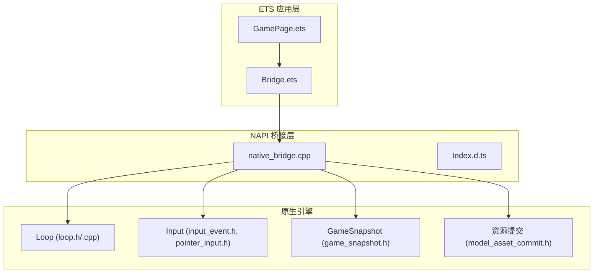
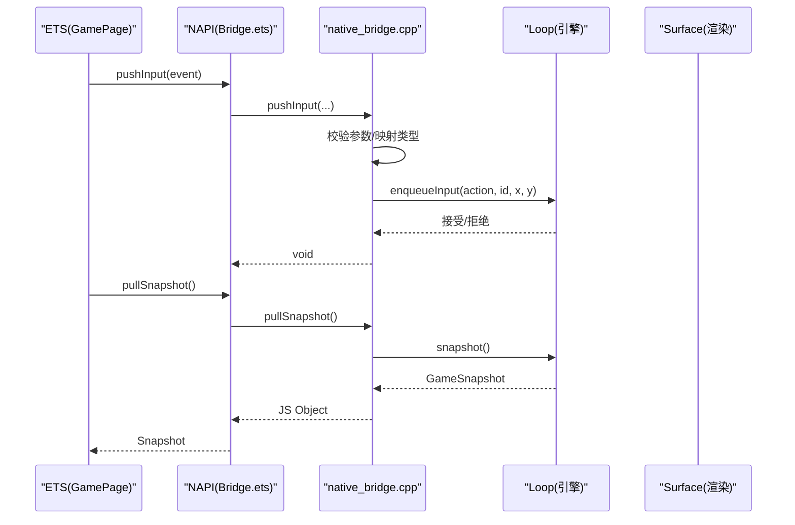
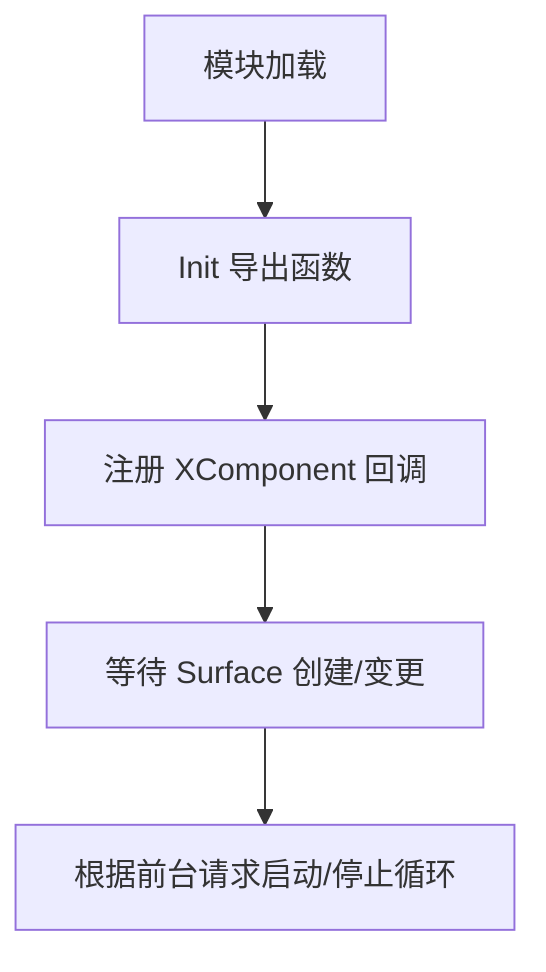
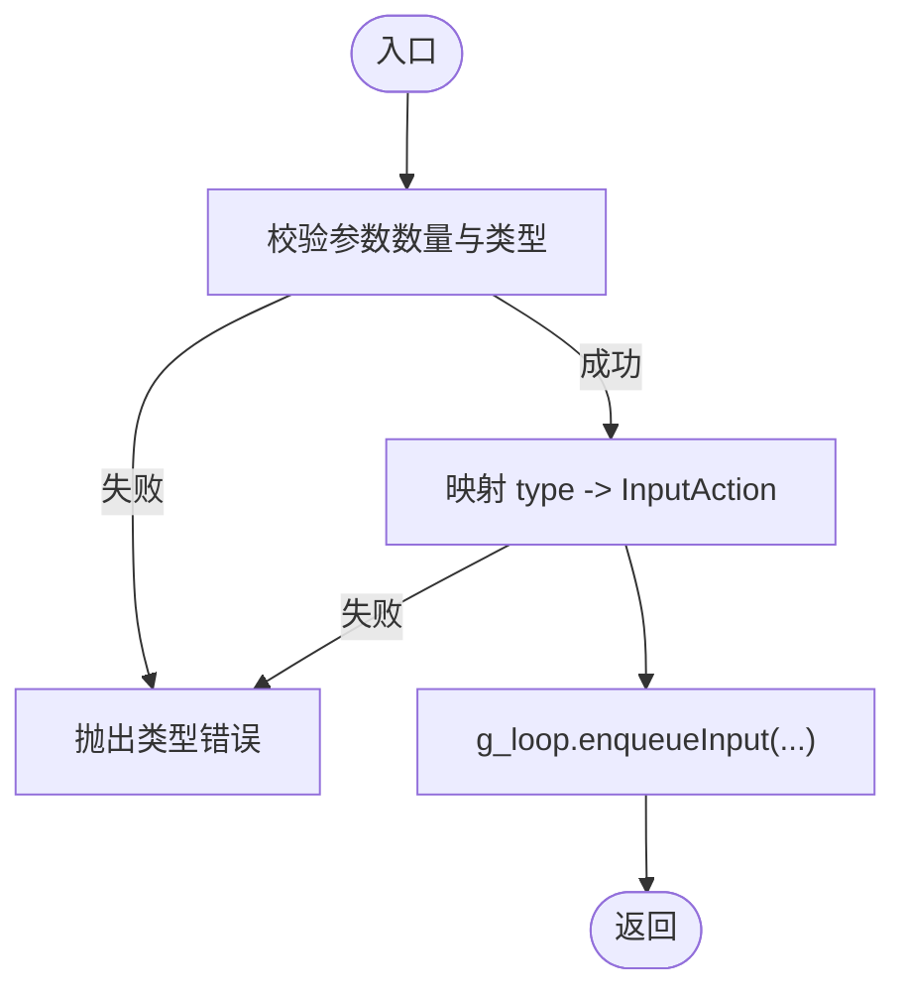
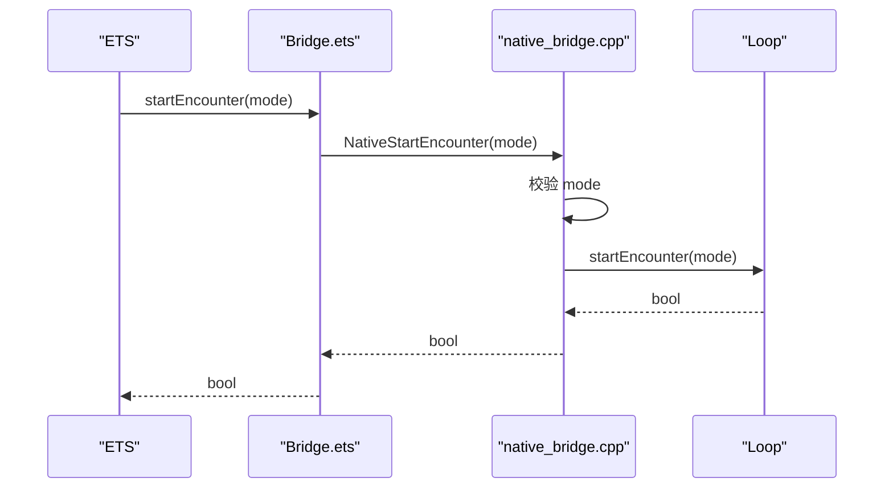
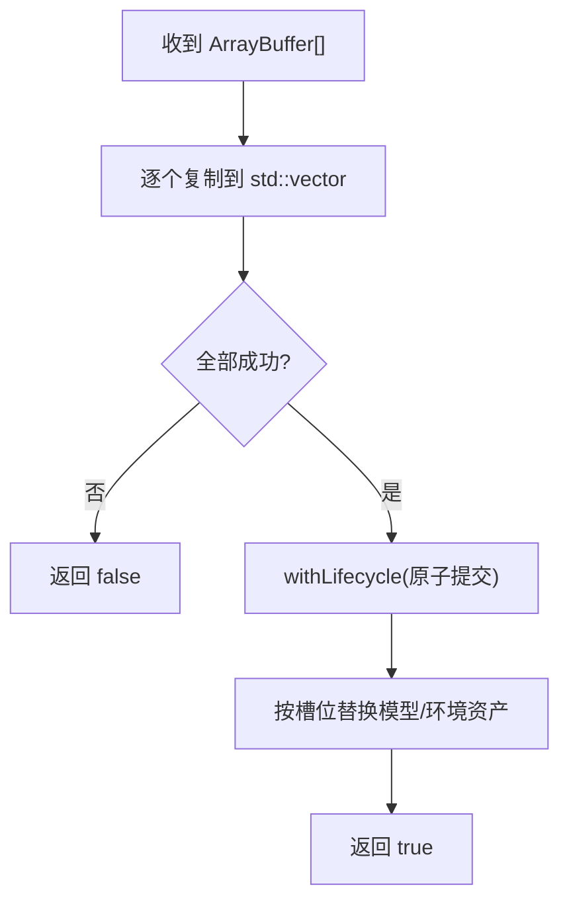
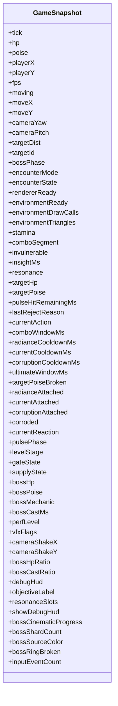
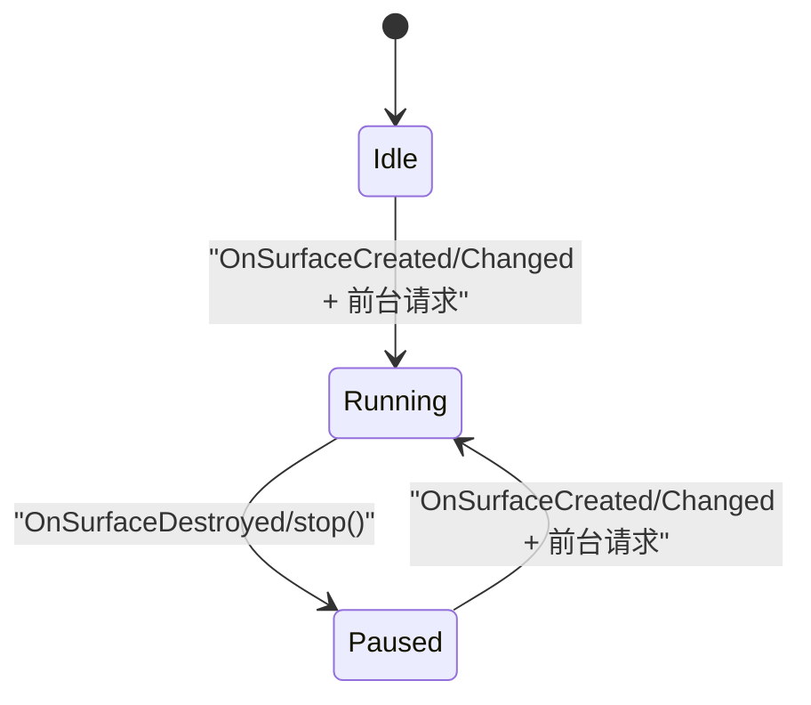
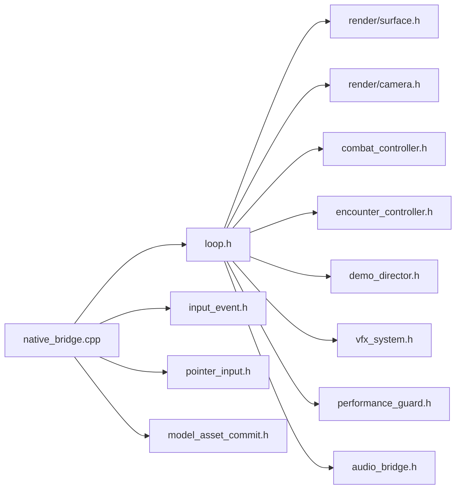

# 原生桥接实现

<cite>
**本文引用的文件**   
- [native_bridge.cpp](file://entry/src/main/cpp/native_bridge.cpp)
- [Bridge.ets](file://entry/src/main/ets/napi/Bridge.ets)
- [Index.d.ts](file://entry/src/main/cpp/types/libnative_game/Index.d.ts)
- [CMakeLists.txt](file://entry/src/main/cpp/CMakeLists.txt)
- [loop.h](file://native/engine/core/loop.h)
- [loop.cpp](file://native/engine/core/loop.cpp)
- [game_snapshot.h](file://native/engine/core/game_snapshot.h)
- [input_event.h](file://native/engine/input/input_event.h)
- [pointer_input.h](file://native/engine/input/pointer_input.h)
- [model_asset_commit.h](file://native/platform/harmony/model_asset_commit.h)
- [GamePage.ets](file://entry/src/main/ets/pages/GamePage.ets)
</cite>

## 目录
1. [简介](#简介)
2. [项目结构](#项目结构)
3. [核心组件](#核心组件)
4. [架构总览](#架构总览)
5. [详细组件分析](#详细组件分析)
6. [依赖关系分析](#依赖关系分析)
7. [性能考虑](#性能考虑)
8. [故障排查指南](#故障排查指南)
9. [结论](#结论)
10. [附录](#附录)

## 简介
本技术文档聚焦于 NAPI 桥接层的核心实现，围绕 native_bridge.cpp 的 C++ 代码展开，系统阐述：
- NAPI 接口注册与函数绑定机制
- 输入事件处理（pushInput、pushAction）如何进入游戏逻辑
- 游戏控制函数（startEncounter、advanceLevel、useSupply 等）如何调用底层引擎
- 快照系统 pullSnapshot 的数据收集与序列化过程
- 错误处理策略、异常捕获与调试输出
- 性能优化建议与内存管理最佳实践

## 项目结构
本项目采用“前端 ETS + NAPI 桥接 + 原生引擎”的分层架构：
- ETS 层负责 UI 渲染与用户交互，通过 Bridge.ets 暴露 NAPI 方法
- NAPI 桥接层（native_bridge.cpp）将 JS/ETS 调用映射到 C++ 引擎 API
- 原生引擎（engine/*, gameplay/*, platform/harmony/*）提供循环、输入、渲染、AI、战斗等能力

图表来源
- [Bridge.ets:1-94](file://entry/src/main/ets/napi/Bridge.ets#L1-L94)
- [native_bridge.cpp:518-561](file://entry/src/main/cpp/native_bridge.cpp#L518-L561)
- [loop.h:26-104](file://native/engine/core/loop.h#L26-L104)
- [game_snapshot.h:7-74](file://native/engine/core/game_snapshot.h#L7-L74)
- [input_event.h:4-24](file://native/engine/input/input_event.h#L4-L24)
- [pointer_input.h:7-36](file://native/engine/input/pointer_input.h#L7-L36)
- [model_asset_commit.h:15-30](file://native/platform/harmony/model_asset_commit.h#L15-L30)

章节来源
- [CMakeLists.txt:1-135](file://entry/src/main/cpp/CMakeLists.txt#L1-L135)
- [Bridge.ets:1-94](file://entry/src/main/ets/napi/Bridge.ets#L1-L94)
- [Index.d.ts:1-81](file://entry/src/main/cpp/types/libnative_game/Index.d.ts#L1-L81)

## 核心组件
- NAPI 模块初始化与导出：在 Init 中定义属性描述符数组，批量注册所有导出函数；同时注册 XComponent 回调以接入生命周期与触摸事件。
- 全局运行期 Loop：单例 g_loop 持有渲染表面、输入队列、相机、战斗控制器、遭遇控制器、演示导演、VFX、音频桥等子系统。
- 输入与动作：pushInput 解析指针事件并入队；pushAction 将动作类型映射为 InputAction 并直接入队。
- 资源提交：模型与环境资产通过 CopyAndCommitModelAssets / CopyAndCommitEnvironmentAssets 原子提交，避免部分更新导致的中间态。
- 快照拉取：pullSnapshot 从 GameSnapshot 构建 JS 对象，包含玩家状态、目标信息、战斗状态、环境指标、调试信息等。

章节来源
- [native_bridge.cpp:518-561](file://entry/src/main/cpp/native_bridge.cpp#L518-L561)
- [native_bridge.cpp:212-275](file://entry/src/main/cpp/native_bridge.cpp#L212-L275)
- [native_bridge.cpp:151-210](file://entry/src/main/cpp/native_bridge.cpp#L151-L210)
- [native_bridge.cpp:360-516](file://entry/src/main/cpp/native_bridge.cpp#L360-L516)
- [loop.h:26-104](file://native/engine/core/loop.h#L26-L104)

## 架构总览
NAPI 桥接层作为 ETS 与原生引擎之间的契约层，承担以下职责：
- 参数校验与类型转换
- 线程安全的事件入队
- 生命周期与渲染表面的协调
- 数据序列化与反序列化

图表来源
- [native_bridge.cpp:212-275](file://entry/src/main/cpp/native_bridge.cpp#L212-L275)
- [native_bridge.cpp:360-516](file://entry/src/main/cpp/native_bridge.cpp#L360-L516)
- [loop.h:88-98](file://native/engine/core/loop.h#L88-L98)

## 详细组件分析

### NAPI 接口注册与绑定
- 使用 napi_property_descriptor 数组集中声明所有导出函数，包括启动/停止、资源设置、输入、游戏控制、调试与快照等。
- 通过 OH_NativeXComponent_RegisterCallback 注册 OnSurfaceCreated/Changed/Destroyed 与 DispatchTouchEvent，完成平台生命周期与输入事件的桥接。
- 模块通过 __attribute__((constructor)) 自动注册，确保加载时即建立导出表。

图表来源
- [native_bridge.cpp:518-561](file://entry/src/main/cpp/native_bridge.cpp#L518-L561)
- [native_bridge.cpp:59-111](file://entry/src/main/cpp/native_bridge.cpp#L59-L111)

章节来源
- [native_bridge.cpp:518-561](file://entry/src/main/cpp/native_bridge.cpp#L518-L561)

### 输入事件处理：pushInput 与 pushAction
- pushInput：接收一个包含 type、pointerId、x、y 的对象，严格校验数值范围与类型，将 type 映射为 InputAction（PointerDown/Move/Up/Cancel），随后调用 g_loop.enqueueInput 入队。
- pushAction：接收一个 0..5 的整数，映射为 Attack/Dodge/Radiance/Current/Corruption/Ultimate，并以固定坐标入队。
- 两者均返回 void，失败路径通过 napi_throw_type_error 抛出类型错误，保证上层可感知参数问题。

图表来源
- [native_bridge.cpp:212-275](file://entry/src/main/cpp/native_bridge.cpp#L212-L275)
- [pointer_input.h:27-35](file://native/engine/input/pointer_input.h#L27-L35)
- [input_event.h:4-24](file://native/engine/input/input_event.h#L4-L24)

章节来源
- [native_bridge.cpp:212-275](file://entry/src/main/cpp/native_bridge.cpp#L212-L275)
- [pointer_input.h:7-36](file://native/engine/input/pointer_input.h#L7-L36)
- [input_event.h:4-24](file://native/engine/input/input_event.h#L4-L24)

### 游戏控制函数：startEncounter、advanceLevel、useSupply、retryBoss、toggleDebugHud、skipDemoPhase
- startEncounter(mode)：校验 mode 为 0..5 的有限整数，转换为 EncounterMode 后调用 g_loop.startEncounter，返回布尔表示是否成功启动。
- advanceLevel()：调用 g_loop.advanceLevel，返回是否推进成功。
- useSupply()：调用 g_loop.useSupply，返回是否使用补给成功。
- retryBoss()：调用 g_loop.retryBoss，返回是否重试首领成功。
- toggleDebugHud()：切换调试 HUD。
- skipDemoPhase(phase)：校验 phase 为 0..6 的有限整数，调用 demoDirector.skipTo(phase)。

图表来源
- [native_bridge.cpp:277-324](file://entry/src/main/cpp/native_bridge.cpp#L277-L324)
- [loop.h:76-81](file://native/engine/core/loop.h#L76-L81)

章节来源
- [native_bridge.cpp:277-358](file://entry/src/main/cpp/native_bridge.cpp#L277-L358)
- [loop.h:76-81](file://native/engine/core/loop.h#L76-L81)

### 资源提交：模型与环境资产
- nativeSetModelAssets(player, enemy, boss)：通过 CopyAndCommitModelAssets 依次复制三个 ArrayBuffer，全部成功后在生命周期锁内替换对应 ModelKind 的模型资产。
- nativeSetEnvironmentAssets(outer, center, backdrop, decoration)：类似地复制四份环境资产并在生命周期保护下提交。
- 该设计保证“全有或全无”的原子性，避免部分更新导致渲染不一致。

图表来源
- [native_bridge.cpp:151-210](file://entry/src/main/cpp/native_bridge.cpp#L151-L210)
- [model_asset_commit.h:15-30](file://native/platform/harmony/model_asset_commit.h#L15-L30)

章节来源
- [native_bridge.cpp:151-210](file://entry/src/main/cpp/native_bridge.cpp#L151-L210)
- [model_asset_commit.h:15-30](file://native/platform/harmony/model_asset_commit.h#L15-L30)

### 快照系统：pullSnapshot 的数据收集与传输
- 调用 g_loop.snapshot() 获取 GameSnapshot，然后逐项创建 JS 属性：tick、hp/poise/stamina/resonance（定点数转浮点）、位置与相机角度、FPS、移动向量、目标信息、战斗阶段、环境就绪与绘制统计、调试标志、组合窗口与冷却时间、首领相关状态、输入事件计数等。
- 对于字符串与数组字段（如 objectiveLabel、resonanceSlots），分别创建字符串与数组并填充元素。
- 最终返回完整的 JS 对象供 ETS 消费。

图表来源
- [game_snapshot.h:7-74](file://native/engine/core/game_snapshot.h#L7-L74)
- [native_bridge.cpp:360-516](file://entry/src/main/cpp/native_bridge.cpp#L360-L516)

章节来源
- [native_bridge.cpp:360-516](file://entry/src/main/cpp/native_bridge.cpp#L360-L516)
- [game_snapshot.h:7-74](file://native/engine/core/game_snapshot.h#L7-L74)

### 生命周期与渲染表面
- OnSurfaceCreated/Changed/Destroyed：根据窗口句柄初始化或调整 surface，必要时停止/重启循环，确保渲染一致性。
- NativeStart/NativeStop/NativeStartIfForeground：控制前台请求与循环启停，避免后台误启动。

图表来源
- [native_bridge.cpp:59-111](file://entry/src/main/cpp/native_bridge.cpp#L59-L111)
- [native_bridge.cpp:130-149](file://entry/src/main/cpp/native_bridge.cpp#L130-L149)
- [loop.cpp:131-174](file://native/engine/core/loop.cpp#L131-L174)

章节来源
- [native_bridge.cpp:59-111](file://entry/src/main/cpp/native_bridge.cpp#L59-L111)
- [native_bridge.cpp:130-149](file://entry/src/main/cpp/native_bridge.cpp#L130-L149)
- [loop.cpp:131-174](file://native/engine/core/loop.cpp#L131-L174)

## 依赖关系分析
- 编译与链接：CMakeLists.txt 明确列出桥接源、引擎核心、输入、渲染、展示、资源、玩法、AI、实体、玩家、目标、平台 Harmony 等源码，并链接 ACE NAPI、Native Window、EGL/GLES、日志库等。
- 头文件包含：native_bridge.cpp 引入 loop.h、input 子模块、platform/harmony 资源提交头，形成清晰的依赖边界。
- 运行时依赖：Loop 聚合了 Surface、InputQueue、TouchRouter、PlayerController、Camera、CombatController、EncounterController、DemoDirector、VfxSystem、PerformanceGuard、AudioBridge 等子系统。

图表来源
- [CMakeLists.txt:26-118](file://entry/src/main/cpp/CMakeLists.txt#L26-L118)
- [loop.h:26-54](file://native/engine/core/loop.h#L26-L54)

章节来源
- [CMakeLists.txt:1-135](file://entry/src/main/cpp/CMakeLists.txt#L1-L135)
- [loop.h:26-54](file://native/engine/core/loop.h#L26-L54)

## 性能考虑
- 输入入队加锁：enqueueInput 使用互斥锁保护 input.push，避免多线程竞争；序列号递增用于事件顺序性。
- 固定步长与帧率：Loop 使用 FixedStep 与 ~60fps 睡眠策略，限制每帧最大耗时，防止卡顿放大。
- 资源提交原子化：CopyAndCommit* 先复制再提交，减少跨线程共享大对象的拷贝次数与锁竞争。
- 快照构造开销：pullSnapshot 逐字段创建 JS 值，建议在 ETS 侧按需读取关键属性，降低频繁 GC 压力。
- 渲染准备检查：rendererReady/environmentReady 可用于 ETS 侧延迟 UI 更新，避免无效刷新。

[本节为通用指导，不直接分析具体文件]

## 故障排查指南
- 参数类型错误：pushInput/pushAction/startEncounter/skipDemoPhase 等对参数进行严格校验，失败时抛出类型错误；ETS 侧应捕获并提示用户。
- Surface 初始化失败：OnSurfaceChanged/OnSurfaceCreated 中若 surface_init/resize 失败，会记录日志并触发 InvalidateSurfaceSnapshot，需检查窗口句柄有效性。
- 前台请求时序：NativeStartIfForeground 仅在已标记前台时启动，避免后台误启动；若页面加载晚于 EntryAbility 发送 stop，需要确保再次调用 start。
- 资源加载失败：当 ArrayBuffer 复制或内容校验失败时，返回 false；ETS 侧应回退到默认网格或程序化环境。
- 日志定位：使用 LOGI/LOGE 宏输出关键路径，结合 OHOS 日志工具查看 Ethelan 标签日志。

章节来源
- [native_bridge.cpp:212-275](file://entry/src/main/cpp/native_bridge.cpp#L212-L275)
- [native_bridge.cpp:59-111](file://entry/src/main/cpp/native_bridge.cpp#L59-L111)
- [native_bridge.cpp:151-210](file://entry/src/main/cpp/native_bridge.cpp#L151-L210)

## 结论
NAPI 桥接层通过严格的参数校验、线程安全的输入入队、原子化的资源提交以及完备的快照序列化，实现了 ETS 与原生引擎之间稳定高效的通信。其模块化设计与清晰的依赖边界便于扩展与维护。在生产环境中，建议结合性能监控与日志采集，持续优化快照体积与输入吞吐，确保流畅的用户体验。

[本节为总结性内容，不直接分析具体文件]

## 附录
- 类型契约：Index.d.ts 定义了所有导出函数的签名与 Snapshot 结构，便于 ETS 侧静态检查与开发体验提升。
- 构建配置：CMakeLists.txt 汇总了所有源文件与依赖库，确保跨平台一致构建。

章节来源
- [Index.d.ts:1-81](file://entry/src/main/cpp/types/libnative_game/Index.d.ts#L1-L81)
- [CMakeLists.txt:1-135](file://entry/src/main/cpp/CMakeLists.txt#L1-L135)