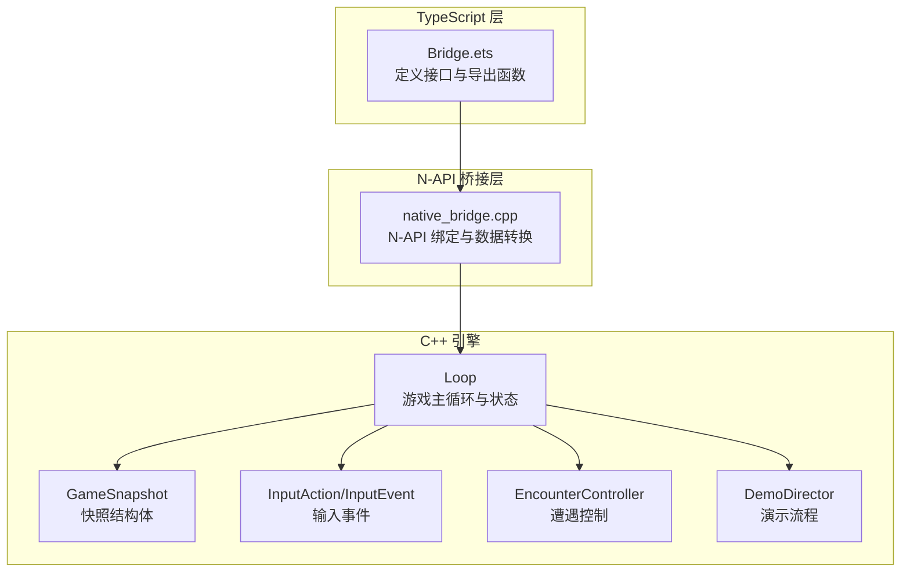
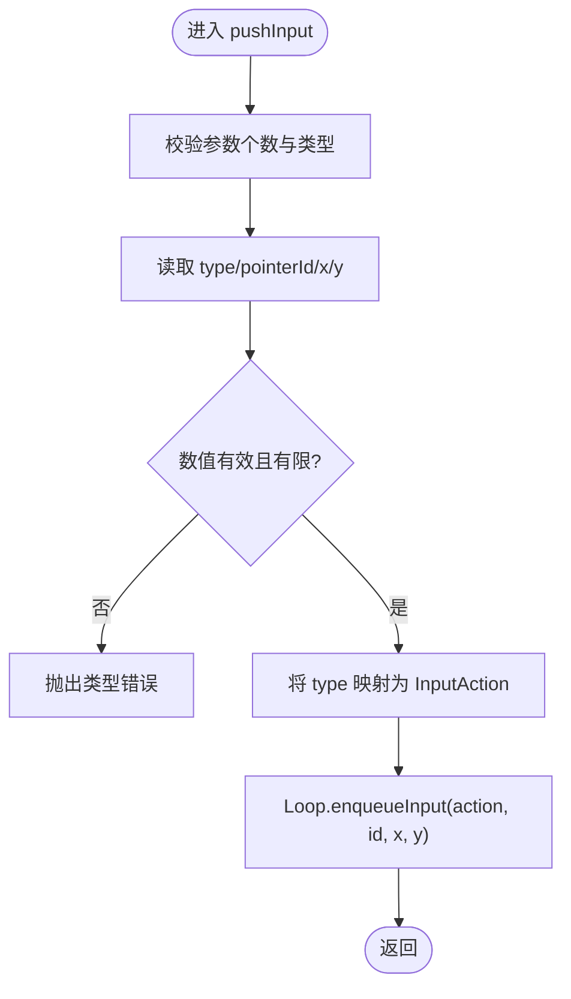
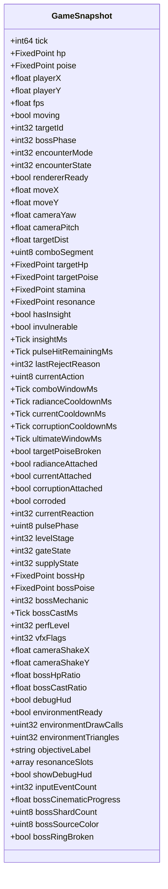
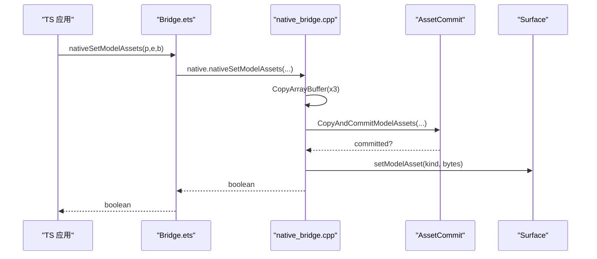
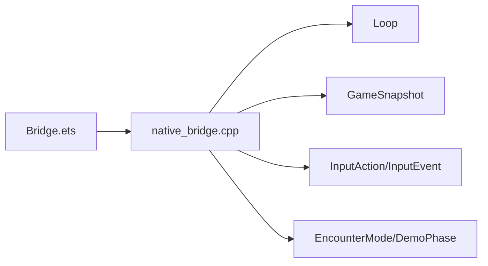

# 接口定义与类型映射

<cite>
**本文引用的文件**
- [Bridge.ets](file://entry/src/main/ets/napi/Bridge.ets)
- [native_bridge.cpp](file://entry/src/main/cpp/native_bridge.cpp)
- [Index.d.ts](file://entry/src/main/cpp/types/libnative_game/Index.d.ts)
- [game_snapshot.h](file://native/engine/core/game_snapshot.h)
- [input_event.h](file://native/engine/input/input_event.h)
- [loop.h](file://native/engine/core/loop.h)
- [encounter_controller.h](file://native/gameplay/ai/encounter_controller.h)
- [demo_director.h](file://native/gameplay/flow/demo_director.h)
- [tick_clock.h](file://native/engine/core/tick_clock.h)
</cite>

## 目录
1. [简介](#简介)
2. [项目结构](#项目结构)
3. [核心组件](#核心组件)
4. [架构总览](#架构总览)
5. [详细组件分析](#详细组件分析)
6. [依赖关系分析](#依赖关系分析)
7. [性能考量](#性能考量)
8. [故障排查指南](#故障排查指南)
9. [结论](#结论)
10. [附录](#附录)

## 简介
本文件面向 NAPI 桥接层，系统化梳理 TypeScript 侧接口与 C++ 侧实现之间的类型映射、数据结构语义以及 API 行为。重点覆盖：
- Bridge.ets 中定义的 TypeScript 接口（如 InputEvent、Snapshot）字段含义与用途
- C++ 数据类型到 JavaScript 类型的映射规则（基本类型、数组、对象、缓冲区）
- 所有暴露的 API（nativeStart、nativeStop、pushInput、pullSnapshot 等）的参数类型、返回值与处理逻辑
- 复杂数据结构与内存管理最佳实践
- 使用示例与常见问题排查

## 项目结构
NAPI 桥接由两部分组成：
- TypeScript 侧：entry/src/main/ets/napi/Bridge.ets 定义对外暴露的接口与类型
- C++ 侧：entry/src/main/cpp/native_bridge.cpp 通过 N-API 将 C++ 函数注册为 JS 可调用方法，并负责数据转换与生命周期回调



图表来源
- [Bridge.ets:1-94](file://entry/src/main/ets/napi/Bridge.ets#L1-L94)
- [native_bridge.cpp:518-561](file://entry/src/main/cpp/native_bridge.cpp#L518-L561)
- [loop.h:26-104](file://native/engine/core/loop.h#L26-L104)
- [game_snapshot.h:7-74](file://native/engine/core/game_snapshot.h#L7-L74)
- [input_event.h:4-24](file://native/engine/input/input_event.h#L4-L24)
- [encounter_controller.h:13-41](file://native/gameplay/ai/encounter_controller.h#L13-L41)
- [demo_director.h:7-22](file://native/gameplay/flow/demo_director.h#L7-L22)

章节来源
- [Bridge.ets:1-94](file://entry/src/main/ets/napi/Bridge.ets#L1-L94)
- [native_bridge.cpp:518-561](file://entry/src/main/cpp/native_bridge.cpp#L518-L561)

## 核心组件
- TypeScript 接口
  - InputEvent：描述一次指针输入事件，包含 type、pointerId、x、y
  - Snapshot：每帧从 C++ 拉取的完整游戏快照，包含玩家状态、目标信息、渲染与环境指标、战斗与演示阶段信息等
- C++ 数据结构
  - GameSnapshot：C++ 侧快照结构体，字段与 TS 的 Snapshot 一一对应
  - InputAction/InputEvent：C++ 侧输入动作枚举与事件结构体
  - Loop：封装了渲染表面、输入队列、相机、战斗、遭遇、演示、音频、性能等子系统，并提供 start/stop/snapshot 等方法
  - EncounterMode/DemoPhase 等枚举：用于模式切换与演示阶段跳转

章节来源
- [Bridge.ets:3-75](file://entry/src/main/ets/napi/Bridge.ets#L3-L75)
- [game_snapshot.h:7-74](file://native/engine/core/game_snapshot.h#L7-L74)
- [input_event.h:4-24](file://native/engine/input/input_event.h#L4-L24)
- [loop.h:26-104](file://native/engine/core/loop.h#L26-L104)
- [encounter_controller.h:13-41](file://native/gameplay/ai/encounter_controller.h#L13-L41)
- [demo_director.h:7-22](file://native/gameplay/flow/demo_director.h#L7-L22)

## 架构总览
NAPI 桥接层在 JS 与 C++ 之间承担以下职责：
- 参数校验与类型转换：确保 JS 传入的数据符合 C++ 期望的类型与范围
- 生命周期回调：对接 XComponent 的生命周期，驱动 Loop 的启动/停止与 Surface 初始化
- 数据序列化：将 C++ 的 GameSnapshot 转换为 JS 对象，供 UI 消费
- 资源提交：接收 ArrayBuffer 形式的模型与环境资源，提交给渲染管线

```mermaid
sequenceDiagram
participant TS as "TS 应用"
participant BR as "Bridge.ets"
participant NAPI as "native_bridge.cpp"
participant LOOP as "Loop"
participant SNAP as "GameSnapshot"
TS->>BR : pullSnapshot()
BR->>NAPI : native.pullSnapshot()
NAPI->>LOOP : snapshot()
LOOP-->>NAPI : GameSnapshot
NAPI->>NAPI : 构造 JS 对象并填充字段
NAPI-->>BR : 返回 Snapshot 对象
BR-->>TS : 返回 Snapshot
```

图表来源
- [Bridge.ets:93](file://entry/src/main/ets/napi/Bridge.ets#L93)
- [native_bridge.cpp:360-516](file://entry/src/main/cpp/native_bridge.cpp#L360-L516)
- [loop.h:97](file://native/engine/core/loop.h#L97)
- [game_snapshot.h:7-74](file://native/engine/core/game_snapshot.h#L7-L74)

## 详细组件分析

### 输入事件与 Action 映射
- TS 侧 InputEvent 字段
  - type：指针动作编号（0~3），对应 PointerDown/Move/Up/Cancel
  - pointerId：指针标识
  - x/y：坐标（浮点）
- C++ 侧 InputAction 枚举
  - 包含指针动作与技能动作（Attack/Dodge/Radiance/Current/Corruption/Ultimate）
- pushInput 处理流程
  - 校验参数数量与类型
  - 读取 type/pointerId/x/y，进行数值范围与有限性检查
  - 将 type 映射为 InputAction，并调用 Loop.enqueueInput
- pushAction 处理流程
  - 校验 action 类型（0~5），映射为具体 InputAction
  - 以固定坐标 (-1, 0, 0) 入队，表示非指针类动作



图表来源
- [native_bridge.cpp:212-250](file://entry/src/main/cpp/native_bridge.cpp#L212-L250)
- [input_event.h:4-24](file://native/engine/input/input_event.h#L4-L24)
- [loop.h:88-95](file://native/engine/core/loop.h#L88-L95)

章节来源
- [Bridge.ets:3-8](file://entry/src/main/ets/napi/Bridge.ets#L3-L8)
- [native_bridge.cpp:212-275](file://entry/src/main/cpp/native_bridge.cpp#L212-L275)
- [input_event.h:4-24](file://native/engine/input/input_event.h#L4-L24)
- [loop.h:88-95](file://native/engine/core/loop.h#L88-L95)

### 快照结构与字段说明
- Snapshot 字段分类
  - 基础状态：tick、hp、poise、x、y、fps、moving、moveX、moveY
  - 相机与目标：cameraYaw、cameraPitch、targetDist、targetId
  - 渲染与环境：rendererReady、environmentReady、environmentDrawCalls、environmentTriangles
  - 战斗与连击：stamina、comboSegment、invulnerable、insightMs、resonance、targetHp、targetPoise、pulseHitRemainingMs、lastRejectReason
  - 技能与冷却：currentAction、comboWindowMs、radianceCooldownMs、currentCooldownMs、corruptionCooldownMs、ultimateWindowMs
  - 状态标志：targetPoiseBroken、radianceAttached、currentAttached、corruptionAttached、corroded、currentReaction、pulsePhase
  - 关卡与门：levelStage、gateState、supplyState
  - Boss 相关：bossHp、bossPoise、bossMechanic、bossCastMs、perfLevel、vfxFlags、cameraShakeX/Y、bossHpRatio、bossCastRatio、debugHud、objectiveLabel、resonanceSlots[]、showDebugHud、bossCinematicProgress、bossShardCount、bossSourceColor、bossRingBroken、inputEventCount
- 定点数与浮点数
  - hp/poise/stamina/resonance/targetHp/targetPoise/bossHp/bossPoise 在 C++ 中以定点数存储，JS 侧除以 FP_ONE 得到浮点值
- 字符串与数组
  - objectiveLabel 为 UTF-8 字符串；resonanceSlots 为 uint32 数组



图表来源
- [game_snapshot.h:7-74](file://native/engine/core/game_snapshot.h#L7-L74)
- [tick_clock.h:1-7](file://native/engine/core/tick_clock.h#L1-L7)

章节来源
- [Bridge.ets:10-75](file://entry/src/main/ets/napi/Bridge.ets#L10-L75)
- [Index.d.ts:15-80](file://entry/src/main/cpp/types/libnative_game/Index.d.ts#L15-L80)
- [game_snapshot.h:7-74](file://native/engine/core/game_snapshot.h#L7-L74)
- [native_bridge.cpp:360-516](file://entry/src/main/cpp/native_bridge.cpp#L360-L516)

### 资源提交与 ArrayBuffer 处理
- nativeSetModelAssets(player, enemy, boss)
  - 三个 ArrayBuffer 分别对应 Player/Enemy/Boss 模型资源
  - 内部复制并 Commit，成功后返回 true
- nativeSetEnvironmentAssets(outer, center, backdrop, decoration)
  - 四个 ArrayBuffer 对应环境批次
  - 内部复制并 Commit，成功后返回 true
- CopyArrayBuffer 工具
  - 校验是否为 ArrayBuffer，提取指针与长度，复制到 std::vector<uint8_t>



图表来源
- [native_bridge.cpp:151-210](file://entry/src/main/cpp/native_bridge.cpp#L151-L210)
- [native_bridge.cpp:30-42](file://entry/src/main/cpp/native_bridge.cpp#L30-L42)

章节来源
- [Bridge.ets:80-84](file://entry/src/main/ets/napi/Bridge.ets#L80-L84)
- [native_bridge.cpp:151-210](file://entry/src/main/cpp/native_bridge.cpp#L151-L210)

### 生命周期与渲染回调
- nativeStart/nativeStop/nativeStartIfForeground
  - 设置前台请求标志并启动/停止 Loop
- XComponent 回调
  - OnSurfaceCreated/Changed/Destroyed：初始化或调整 Surface，必要时触发 publishRendererStopped
  - DispatchTouchEvent：将原生触摸事件转发为输入动作并入队

```mermaid
sequenceDiagram
participant XComp as "XComponent"
participant NAPI as "native_bridge.cpp"
participant LOOP as "Loop"
XComp->>NAPI : OnSurfaceCreated(window)
NAPI->>LOOP : withLifecycle(surface_init/start?)
XComp->>NAPI : OnSurfaceChanged(window)
NAPI->>LOOP : stop()/surface_resize()/start?
XComp->>NAPI : OnSurfaceDestroyed(window)
NAPI->>LOOP : stop()/publishRendererStopped()
XComp->>NAPI : DispatchTouchEvent(event)
NAPI->>LOOP : enqueueInput(action,id,x,y)
```

图表来源
- [native_bridge.cpp:59-111](file://entry/src/main/cpp/native_bridge.cpp#L59-L111)
- [native_bridge.cpp:130-149](file://entry/src/main/cpp/native_bridge.cpp#L130-L149)
- [loop.h:69-75](file://native/engine/core/loop.h#L69-L75)

章节来源
- [native_bridge.cpp:59-111](file://entry/src/main/cpp/native_bridge.cpp#L59-L111)
- [native_bridge.cpp:130-149](file://entry/src/main/cpp/native_bridge.cpp#L130-L149)

### 游戏控制 API
- startEncounter(mode)：启动指定模式的遭遇战，返回是否成功
- advanceLevel()：推进关卡阶段
- useSupply()：使用补给
- retryBoss()：重试 Boss
- toggleDebugHud()：切换调试 HUD
- skipDemoPhase(phase)：跳过演示阶段（0~6）

```mermaid
sequenceDiagram
participant TS as "TS 应用"
participant BR as "Bridge.ets"
participant NAPI as "native_bridge.cpp"
participant LOOP as "Loop"
TS->>BR : startEncounter(mode)
BR->>NAPI : native.startEncounter(mode)
NAPI->>LOOP : startEncounter(mode)
LOOP-->>NAPI : bool
NAPI-->>BR : bool
BR-->>TS : bool
```

图表来源
- [native_bridge.cpp:277-298](file://entry/src/main/cpp/native_bridge.cpp#L277-L298)
- [loop.h:76-81](file://native/engine/core/loop.h#L76-L81)

章节来源
- [Bridge.ets:87-92](file://entry/src/main/ets/napi/Bridge.ets#L87-L92)
- [native_bridge.cpp:277-358](file://entry/src/main/cpp/native_bridge.cpp#L277-L358)

## 依赖关系分析
- TS 接口与 C++ 实现的绑定关系
  - Bridge.ets 导出的函数直接调用 libnative_game.so 中的 N-API 方法
  - Index.d.ts 提供 TS 类型声明，保证编译期类型安全
- C++ 模块注册
  - Init 函数定义属性描述符，将 C++ 函数注册为 exports 的属性
  - 同时注册 XComponent 回调，完成平台集成



图表来源
- [Bridge.ets:77-94](file://entry/src/main/ets/napi/Bridge.ets#L77-L94)
- [Index.d.ts:1-15](file://entry/src/main/cpp/types/libnative_game/Index.d.ts#L1-L15)
- [native_bridge.cpp:518-561](file://entry/src/main/cpp/native_bridge.cpp#L518-L561)

章节来源
- [Bridge.ets:77-94](file://entry/src/main/ets/napi/Bridge.ets#L77-L94)
- [Index.d.ts:1-15](file://entry/src/main/cpp/types/libnative_game/Index.d.ts#L1-L15)
- [native_bridge.cpp:518-561](file://entry/src/main/cpp/native_bridge.cpp#L518-L561)

## 性能考量
- 快照构建开销
  - 每帧创建大量 JS 对象与属性，建议在 UI 层按需读取字段，避免全量拷贝
- 资源提交
  - ArrayBuffer 复制发生在 C++ 侧，注意资源大小与提交频率，避免阻塞主循环
- 输入入队
  - 高频输入建议批量处理，减少锁竞争与上下文切换
- 渲染就绪
  - 关注 rendererReady/environmentReady 标志，在未就绪时避免执行渲染相关逻辑

[本节为通用指导，不直接分析具体文件]

## 故障排查指南
- pushInput 参数错误
  - 现象：抛出类型错误
  - 原因：缺少字段、类型非数字、数值非有限、type 不在 0~3
  - 解决：确保传入对象包含 type/pointerId/x/y，且均为有限数字
- pushAction 越界
  - 现象：抛出类型错误
  - 原因：type 非整数或不在 0~5
  - 解决：传入 0~5 的整数
- startEncounter/skipDemoPhase 越界
  - 现象：抛出类型错误
  - 原因：mode/phase 超出允许范围
  - 解决：确认枚举取值范围
- 资源提交失败
  - 现象：nativeSetModelAssets/nativeSetEnvironmentAssets 返回 false
  - 原因：参数不是 ArrayBuffer 或长度为 0
  - 解决：确保传入有效的 ArrayBuffer

章节来源
- [native_bridge.cpp:212-275](file://entry/src/main/cpp/native_bridge.cpp#L212-L275)
- [native_bridge.cpp:277-358](file://entry/src/main/cpp/native_bridge.cpp#L277-L358)
- [native_bridge.cpp:151-210](file://entry/src/main/cpp/native_bridge.cpp#L151-L210)

## 结论
本桥接层通过严格的类型校验与清晰的映射规则，将 C++ 游戏状态稳定地暴露给 TS 层。开发者在使用时应：
- 严格遵循 InputEvent/Snapshot 的字段约定
- 合理管理 ArrayBuffer 资源与提交时机
- 依据渲染与环境就绪标志组织 UI 更新
- 谨慎处理输入与控制的边界条件

[本节为总结，不直接分析具体文件]

## 附录

### 类型映射总表
- 基本类型
  - int64 -> number（tick、insightMs、pulseHitRemainingMs、bossCastMs）
  - double/float -> number（坐标、角度、比率、FPS、相机抖动）
  - int32/uint32 -> number（ID、阶段、计数、标志位）
  - bool -> boolean（各种开关状态）
  - string -> string（objectiveLabel）
- 复合类型
  - std::vector<uint8_t> -> ArrayBuffer（模型与环境资源）
  - std::array<uint8_t,3> -> number[]（resonanceSlots）
- 定点数
  - FixedPoint -> number（需除以 FP_ONE）

章节来源
- [native_bridge.cpp:360-516](file://entry/src/main/cpp/native_bridge.cpp#L360-L516)
- [tick_clock.h:1-7](file://native/engine/core/tick_clock.h#L1-L7)

### 使用示例与最佳实践
- 启动与停止
  - 在页面可见时调用 nativeStart；隐藏或销毁时调用 nativeStop
- 输入处理
  - 将触摸事件转换为 InputEvent 后调用 pushInput；技能按键使用 pushAction
- 资源加载
  - 先调用 nativeSetModelAssets/nativeSetEnvironmentAssets，再开始渲染
- 快照消费
  - 每帧调用 pullSnapshot，仅读取所需字段；根据 rendererReady/environmentReady 决定是否绘制

[本节为通用指导，不直接分析具体文件]