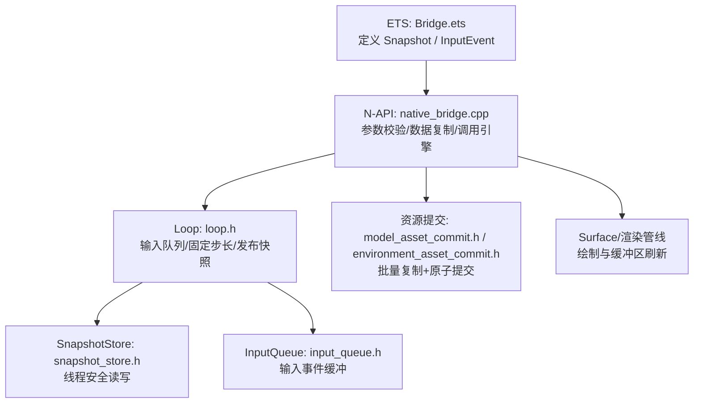
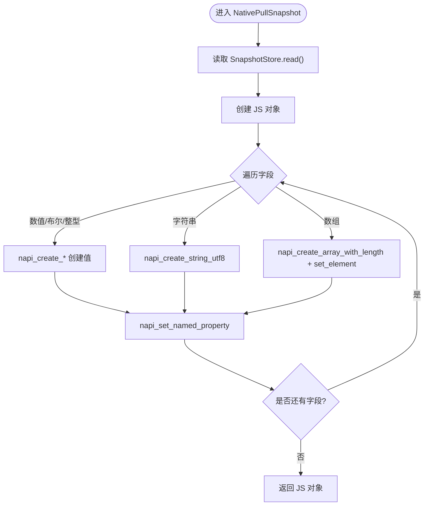
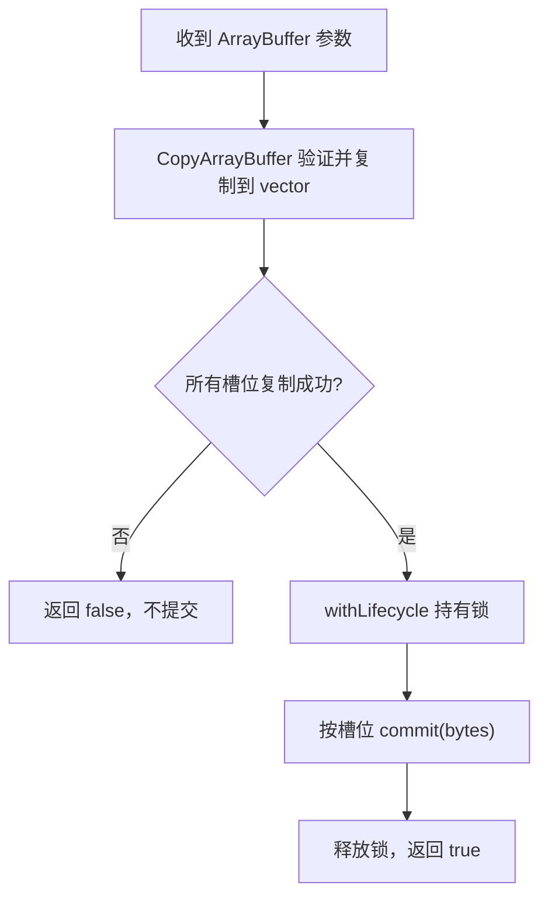
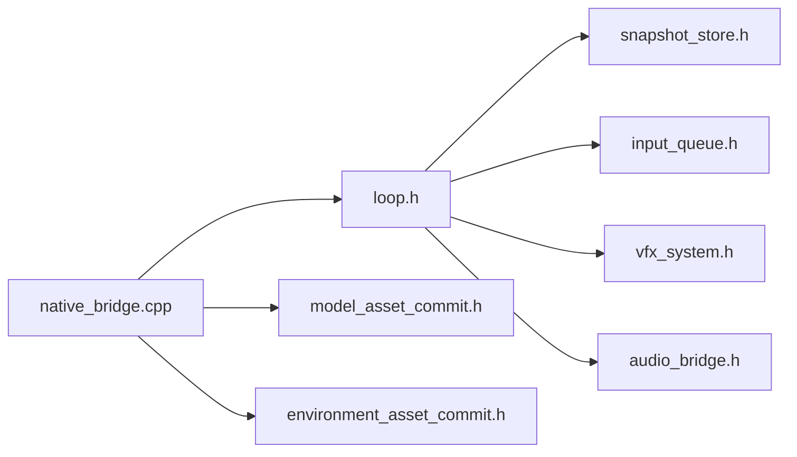

# 数据序列化与内存管理

<cite>
**本文引用的文件**   
- [native_bridge.cpp](file://entry/src/main/cpp/native_bridge.cpp)
- [Bridge.ets](file://entry/src/main/ets/napi/Bridge.ets)
- [game_snapshot.h](file://native/engine/core/game_snapshot.h)
- [snapshot_store.h](file://native/engine/core/snapshot_store.h)
- [loop.h](file://native/engine/core/loop.h)
- [input_event.h](file://native/engine/input/input_event.h)
- [input_queue.h](file://native/engine/input/input_queue.h)
- [model_asset_commit.h](file://native/platform/harmony/model_asset_commit.h)
- [environment_asset_commit.h](file://native/platform/harmony/environment_asset_commit.h)
- [performance_guard.h](file://native/engine/presentation/performance_guard.h)
- [performance_guard.cpp](file://native/engine/presentation/performance_guard.cpp)
- [test_bridge_contract.mjs](file://tests/test_bridge_contract.mjs)
</cite>

## 目录
1. [简介](#简介)
2. [项目结构](#项目结构)
3. [核心组件](#核心组件)
4. [架构总览](#架构总览)
5. [详细组件分析](#详细组件分析)
6. [依赖关系分析](#依赖关系分析)
7. [性能考量](#性能考量)
8. [故障排查指南](#故障排查指南)
9. [结论](#结论)
10. [附录](#附录)

## 简介
本文件聚焦 NAPI 桥接层的数据序列化与内存管理机制，围绕以下关键点展开：
- Snapshot 结构体在 C++ 与 JavaScript 之间的数据传输流程
- ArrayBuffer 的使用与零拷贝优化策略
- InputEvent 等小型数据结构的传递机制
- 原生内存与 JavaScript 堆内存的分配与释放策略
- 大数据传输的性能优化（批量处理、流式传输）
- 内存泄漏检测与调试工具使用方法
- 常见内存问题的排查与解决方案

## 项目结构
本项目采用“前端 ETS + N-API C++ 桥接 + 原生引擎”的分层架构。关键路径包括：
- ETS 侧通过 Bridge.ets 暴露接口并定义 Snapshot/InputEvent 类型
- C++ 侧 native_bridge.cpp 实现 N-API 方法，负责参数校验、数据复制、状态同步与渲染生命周期控制
- 原生引擎 core 层提供 GameSnapshot、InputQueue、Loop、SnapshotStore 等核心数据结构与循环调度
- Harmony 平台适配层提供模型与环境资源的原子提交模板



图表来源 
- [Bridge.ets:1-94](file://entry/src/main/ets/napi/Bridge.ets#L1-L94)
- [native_bridge.cpp:1-577](file://entry/src/main/cpp/native_bridge.cpp#L1-L577)
- [loop.h:1-104](file://native/engine/core/loop.h#L1-L104)
- [snapshot_store.h:1-21](file://native/engine/core/snapshot_store.h#L1-L21)
- [input_queue.h:1-47](file://native/engine/input/input_queue.h#L1-L47)
- [model_asset_commit.h:1-30](file://native/platform/harmony/model_asset_commit.h#L1-L30)
- [environment_asset_commit.h:1-36](file://native/platform/harmony/environment_asset_commit.h#L1-L36)

章节来源
- [Bridge.ets:1-94](file://entry/src/main/ets/napi/Bridge.ets#L1-L94)
- [native_bridge.cpp:1-577](file://entry/src/main/cpp/native_bridge.cpp#L1-L577)
- [loop.h:1-104](file://native/engine/core/loop.h#L1-L104)
- [snapshot_store.h:1-21](file://native/engine/core/snapshot_store.h#L1-L21)
- [input_queue.h:1-47](file://native/engine/input/input_queue.h#L1-L47)
- [model_asset_commit.h:1-30](file://native/platform/harmony/model_asset_commit.h#L1-L30)
- [environment_asset_commit.h:1-36](file://native/platform/harmony/environment_asset_commit.h#L1-L36)

## 核心组件
- Snapshot 数据结构：C++ 端 GameSnapshot 包含大量游戏状态字段；JS 端 Bridge.ets 定义同名接口，确保字段一致
- 输入事件：InputEvent 为轻量结构，包含动作类型、指针 ID、坐标与序列号
- 输入队列：InputQueue 以有界队列承载高频输入，支持丢弃计数与清空
- 快照存储：SnapshotStore 使用互斥锁保护单份快照的并发读写
- 循环与调度：Loop 聚合输入、相机、战斗、VFX、音频等子系统，并以固定步长推进
- 资源提交：CopyAndCommitModelAssets/CopyAndCommitEnvironmentAssets 保证多份 ArrayBuffer 全部复制成功后再原子提交

章节来源
- [game_snapshot.h:1-74](file://native/engine/core/game_snapshot.h#L1-L74)
- [input_event.h:1-24](file://native/engine/input/input_event.h#L1-L24)
- [input_queue.h:1-47](file://native/engine/input/input_queue.h#L1-L47)
- [snapshot_store.h:1-21](file://native/engine/core/snapshot_store.h#L1-L21)
- [loop.h:1-104](file://native/engine/core/loop.h#L1-L104)
- [model_asset_commit.h:1-30](file://native/platform/harmony/model_asset_commit.h#L1-L30)
- [environment_asset_commit.h:1-36](file://native/platform/harmony/environment_asset_commit.h#L1-L36)

## 架构总览
下图展示从 ETS 到 C++ 再到引擎核心的完整数据流与内存边界。

```mermaid
sequenceDiagram
participant UI as "ETS : Bridge.ets"
participant NAPI as "C++ : native_bridge.cpp"
participant LOOP as "C++ : Loop"
participant STORE as "C++ : SnapshotStore"
participant RES as "C++ : 资源提交模板"
UI->>NAPI : pullSnapshot()
NAPI->>LOOP : snapshot()
LOOP->>STORE : read()
STORE-->>LOOP : GameSnapshot
LOOP-->>NAPI : GameSnapshot
NAPI-->>UI : 构建 JS 对象(字段映射)
UI->>NAPI : pushInput(InputEvent)
NAPI->>LOOP : enqueueInput(action, pointerId, x, y)
LOOP->>LOOP : InputQueue.push()
UI->>NAPI : nativeSetModelAssets(ArrayBuffer...)
NAPI->>RES : CopyAndCommitModelAssets(...)
RES-->>NAPI : 成功/失败
NAPI-->>UI : boolean
UI->>NAPI : nativeSetEnvironmentAssets(ArrayBuffer...)
NAPI->>RES : CopyAndCommitEnvironmentAssets(...)
RES-->>NAPI : 成功/失败
NAPI-->>UI : boolean
```

图表来源 
- [native_bridge.cpp:360-516](file://entry/src/main/cpp/native_bridge.cpp#L360-L516)
- [native_bridge.cpp:212-275](file://entry/src/main/cpp/native_bridge.cpp#L212-L275)
- [native_bridge.cpp:151-210](file://entry/src/main/cpp/native_bridge.cpp#L151-L210)
- [loop.h:88-97](file://native/engine/core/loop.h#L88-L97)
- [snapshot_store.h:7-15](file://native/engine/core/snapshot_store.h#L7-L15)
- [model_asset_commit.h:15-29](file://native/platform/harmony/model_asset_commit.h#L15-L29)
- [environment_asset_commit.h:18-35](file://native/platform/harmony/environment_asset_commit.h#L18-L35)

## 详细组件分析

### Snapshot 序列化与反序列化
- C++ 端 GameSnapshot 是单一结构体，包含数值、布尔、字符串与数组字段
- N-API 层 NativePullSnapshot 将每个字段逐一创建 JS 值并设置属性，形成 JS 对象
- 字段映射严格遵循 Bridge.ets 中 Snapshot 接口顺序，测试用例强制一致性



图表来源 
- [native_bridge.cpp:360-516](file://entry/src/main/cpp/native_bridge.cpp#L360-L516)
- [Bridge.ets:10-75](file://entry/src/main/ets/napi/Bridge.ets#L10-L75)
- [game_snapshot.h:7-73](file://native/engine/core/game_snapshot.h#L7-L73)

章节来源
- [native_bridge.cpp:360-516](file://entry/src/main/cpp/native_bridge.cpp#L360-L516)
- [Bridge.ets:10-75](file://entry/src/main/ets/napi/Bridge.ets#L10-L75)
- [game_snapshot.h:7-73](file://native/engine/core/game_snapshot.h#L7-L73)
- [test_bridge_contract.mjs:153-178](file://tests/test_bridge_contract.mjs#L153-L178)

### 输入事件传递与队列化
- ETS 侧定义 InputEvent 接口，包含 type、pointerId、x、y
- N-API 层对参数进行强类型校验，转换为内部 InputAction 与浮点坐标
- Loop::enqueueInput 将事件推入 InputQueue，并维护序列号与计数

```mermaid
sequenceDiagram
participant UI as "ETS : Bridge.ets"
participant NAPI as "C++ : native_bridge.cpp"
participant LOOP as "C++ : Loop"
participant Q as "C++ : InputQueue"
UI->>NAPI : pushInput({type, pointerId, x, y})
NAPI->>NAPI : 参数校验/类型转换
NAPI->>LOOP : enqueueInput(action, pointerId, x, y)
LOOP->>Q : push(InputEvent{action, id, x, y, seq})
Q-->>LOOP : 成功/丢弃计数+1
LOOP-->>NAPI : 接受结果
NAPI-->>UI : 无返回值
```

图表来源 
- [native_bridge.cpp:212-250](file://entry/src/main/cpp/native_bridge.cpp#L212-L250)
- [input_event.h:17-23](file://native/engine/input/input_event.h#L17-L23)
- [input_queue.h:12-28](file://native/engine/input/input_queue.h#L12-L28)
- [loop.h:88-95](file://native/engine/core/loop.h#L88-L95)

章节来源
- [Bridge.ets:3-8](file://entry/src/main/ets/napi/Bridge.ets#L3-L8)
- [native_bridge.cpp:212-250](file://entry/src/main/cpp/native_bridge.cpp#L212-L250)
- [input_event.h:17-23](file://native/engine/input/input_event.h#L17-L23)
- [input_queue.h:12-28](file://native/engine/input/input_queue.h#L12-L28)
- [loop.h:88-95](file://native/engine/core/loop.h#L88-L95)

### 资源传输与零拷贝优化
- 模型与环境资源通过 ArrayBuffer 传入，N-API 层使用 CopyArrayBuffer 复制到 std::vector<uint8_t>
- 使用 CopyAndCommitModelAssets/CopyAndCommitEnvironmentAssets 模板：
  - 先对所有槽位完成复制，任一失败则整体回滚
  - 在生命周期锁内一次性提交所有资源，避免部分更新导致的中间态
- 当前实现为“复制后提交”，并非真正的零拷贝；如需零拷贝可考虑基于外部 ArrayBuffer 的直接视图绑定，但需严格生命周期对齐



图表来源 
- [native_bridge.cpp:30-42](file://entry/src/main/cpp/native_bridge.cpp#L30-L42)
- [model_asset_commit.h:15-29](file://native/platform/harmony/model_asset_commit.h#L15-L29)
- [environment_asset_commit.h:18-35](file://native/platform/harmony/environment_asset_commit.h#L18-L35)

章节来源
- [native_bridge.cpp:30-42](file://entry/src/main/cpp/native_bridge.cpp#L30-L42)
- [model_asset_commit.h:15-29](file://native/platform/harmony/model_asset_commit.h#L15-L29)
- [environment_asset_commit.h:18-35](file://native/platform/harmony/environment_asset_commit.h#L18-L35)
- [test_bridge_contract.mjs:344-433](file://tests/test_bridge_contract.mjs#L344-L433)

### 内存分配与释放策略
- 原生内存：
  - 输入事件：InputQueue 内部 queue_ 持有 InputEvent，容量上限触发丢弃计数
  - 快照：SnapshotStore 持有单份 GameSnapshot，读写均加锁
  - 资源：std::vector<uint8_t> 临时持有 ArrayBuffer 副本，提交后由 RAII 自动释放
- JavaScript 堆内存：
  - Snapshot 对象每帧创建，频繁 GC 可能带来抖动；可考虑复用对象或降低频率
  - 大对象（如 ArrayBuffer）应避免重复分配，尽量复用或延迟释放
- 生命周期：
  - Surface 初始化/重绘失败会触发 InvalidateSurfaceSnapshot，停止渲染并清理状态
  - 前台请求 g_foregroundRequested 控制 start/stop 行为，避免后台启动

章节来源
- [input_queue.h:12-28](file://native/engine/input/input_queue.h#L12-L28)
- [snapshot_store.h:7-15](file://native/engine/core/snapshot_store.h#L7-L15)
- [native_bridge.cpp:20-23](file://entry/src/main/cpp/native_bridge.cpp#L20-L23)
- [native_bridge.cpp:130-149](file://entry/src/main/cpp/native_bridge.cpp#L130-L149)

### 大数据传输优化建议
- 批量处理：
  - 当前已实现三槽/四槽批量复制与原子提交，减少跨边界次数
- 流式传输：
  - 对于超大资源（如纹理/网格），可分块传输并在接收端重建，避免单次大分配
- 零拷贝探索：
  - 若 JS 侧持有持久 ArrayBuffer，可在 C++ 侧直接绑定其底层指针，但需确保生命周期与访问权限一致
  - 注意跨线程访问与内存可见性，必要时使用屏障或共享内存

[本节为通用指导，不直接分析具体文件]

### 内存泄漏检测与调试工具
- 日志定位：
  - 使用 OH_LOG_Print 输出关键路径信息，如 surface 初始化失败、触摸事件获取失败
- 断言与守卫：
  - FixedStep 使用 assert 约束步长与最大步数，防止累积溢出
  - PerformanceGuard 记录 FPS 样本并计算降级级别，辅助定位卡顿
- 测试契约：
  - test_bridge_contract.mjs 强制检查字段一致性、函数签名与调用路径，提前发现接口漂移

章节来源
- [native_bridge.cpp:14-15](file://entry/src/main/cpp/native_bridge.cpp#L14-L15)
- [fixed_step.h:10-14](file://native/engine/core/fixed_step.h#L10-L14)
- [performance_guard.h:21-44](file://native/engine/presentation/performance_guard.h#L21-L44)
- [performance_guard.cpp:18-68](file://native/engine/presentation/performance_guard.cpp#L18-L68)
- [test_bridge_contract.mjs:153-178](file://tests/test_bridge_contract.mjs#L153-L178)

## 依赖关系分析
- native_bridge.cpp 依赖 Loop、InputQueue、SnapshotStore、资源提交模板
- Bridge.ets 仅依赖 N-API 导出接口，不直接访问原生内存
- Loop 聚合多个子系统，并通过 SnapshotStore 对外发布快照



图表来源 
- [native_bridge.cpp:1-12](file://entry/src/main/cpp/native_bridge.cpp#L1-L12)
- [loop.h:1-25](file://native/engine/core/loop.h#L1-L25)
- [model_asset_commit.h:1-13](file://native/platform/harmony/model_asset_commit.h#L1-L13)
- [environment_asset_commit.h:1-16](file://native/platform/harmony/environment_asset_commit.h#L1-L16)
- [snapshot_store.h:1-6](file://native/engine/core/snapshot_store.h#L1-L6)
- [input_queue.h:1-6](file://native/engine/input/input_queue.h#L1-L6)

章节来源
- [native_bridge.cpp:1-12](file://entry/src/main/cpp/native_bridge.cpp#L1-L12)
- [loop.h:1-25](file://native/engine/core/loop.h#L1-L25)
- [model_asset_commit.h:1-13](file://native/platform/harmony/model_asset_commit.h#L1-L13)
- [environment_asset_commit.h:1-16](file://native/platform/harmony/environment_asset_commit.h#L1-L16)
- [snapshot_store.h:1-6](file://native/engine/core/snapshot_store.h#L1-L6)
- [input_queue.h:1-6](file://native/engine/input/input_queue.h#L1-L6)

## 性能考量
- 快照频率：每帧创建 JS 对象开销较大，建议按需采样或合并字段
- 输入队列容量：容量过小导致丢弃增多，过大增加内存占用；根据设备调整
- 资源提交：批量复制+原子提交减少跨边界次数，避免中间态
- 性能降级：PerformanceGuard 基于滑动窗口平均 FPS 动态调整质量等级

章节来源
- [performance_guard.h:21-44](file://native/engine/presentation/performance_guard.h#L21-L44)
- [performance_guard.cpp:18-68](file://native/engine/presentation/performance_guard.cpp#L18-L68)
- [input_queue.h:10-20](file://native/engine/input/input_queue.h#L10-L20)

## 故障排查指南
- 常见问题
  - 触摸事件丢失：检查 OnDispatchTouchEvent 是否正确获取事件并转发
  - 资源加载失败：确认 ArrayBuffer 非空且长度正确，复制阶段未失败
  - 渲染崩溃：Surface 初始化/重绘失败会触发 InvalidateSurfaceSnapshot，检查 window 有效性
  - 内存泄漏：检查 InputQueue.clear、SnapshotStore 生命周期、临时 vector 释放
- 诊断步骤
  - 启用日志输出，定位关键路径错误码
  - 使用测试契约验证字段与接口一致性
  - 监控 droppedCount 与 FPS 变化，判断瓶颈位置

章节来源
- [native_bridge.cpp:113-128](file://entry/src/main/cpp/native_bridge.cpp#L113-L128)
- [native_bridge.cpp:151-210](file://entry/src/main/cpp/native_bridge.cpp#L151-L210)
- [input_queue.h:30-39](file://native/engine/input/input_queue.h#L30-L39)
- [test_bridge_contract.mjs:202-233](file://tests/test_bridge_contract.mjs#L202-L233)

## 结论
本项目在 NAPI 桥接层实现了稳定高效的数据序列化与内存管理：
- Snapshot 字段映射严格一致，便于前后端协同
- 输入事件通过有界队列与序列号保障有序性与可观测性
- 资源传输采用批量复制与原子提交，避免部分更新风险
- 性能监控与测试契约共同保障运行时稳定性与接口一致性

未来可进一步优化方向：
- 探索零拷贝传输以降低内存带宽压力
- 按需采样快照以减少 GC 压力
- 流式传输超大资源以提升加载体验

## 附录
- 字段对照表：Bridge.ets 中的 Snapshot 接口与 native_bridge.cpp 中的 napi_set_named_property 字段顺序必须一致，测试用例强制校验
- 输入动作映射：pushAction 的类型到 InputAction 的映射顺序固定，测试覆盖

章节来源
- [Bridge.ets:10-75](file://entry/src/main/ets/napi/Bridge.ets#L10-L75)
- [native_bridge.cpp:252-275](file://entry/src/main/cpp/native_bridge.cpp#L252-L275)
- [test_bridge_contract.mjs:86-117](file://tests/test_bridge_contract.mjs#L86-L117)