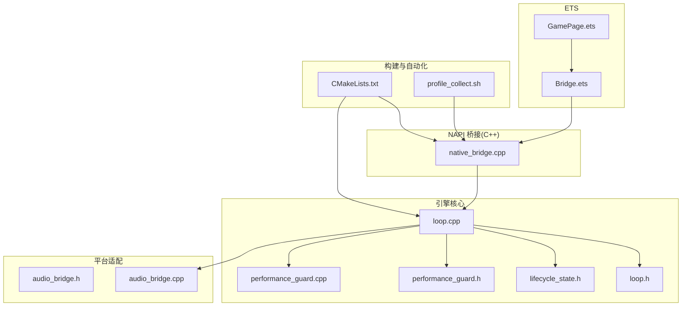
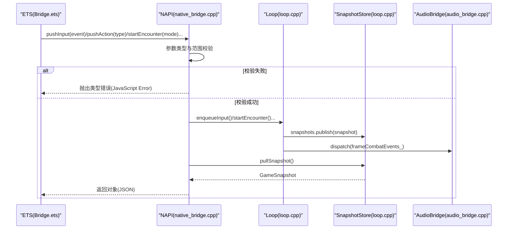
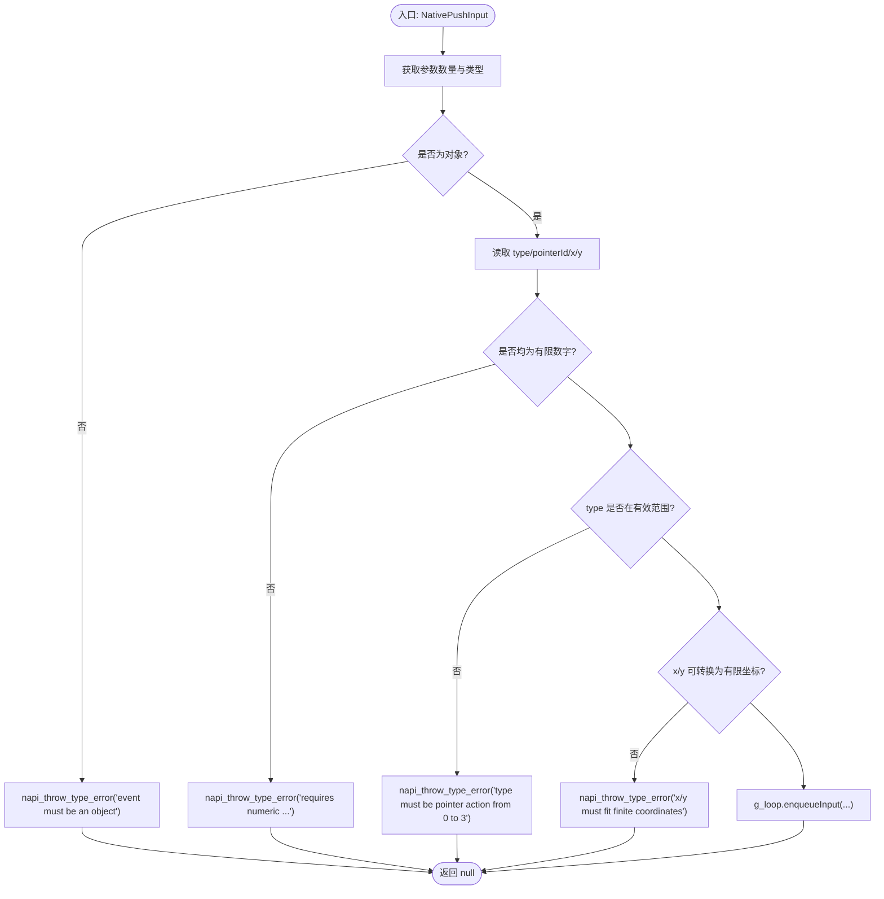
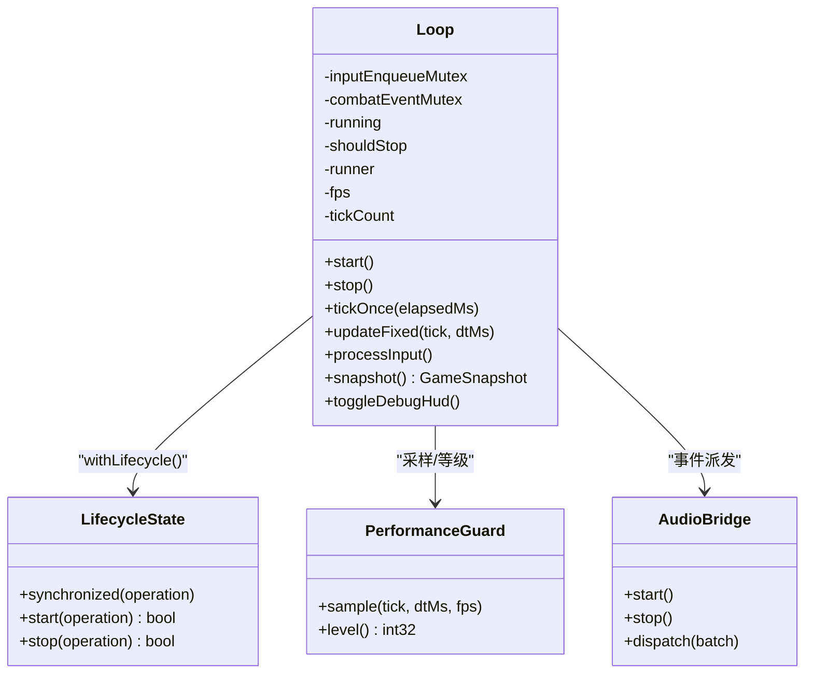
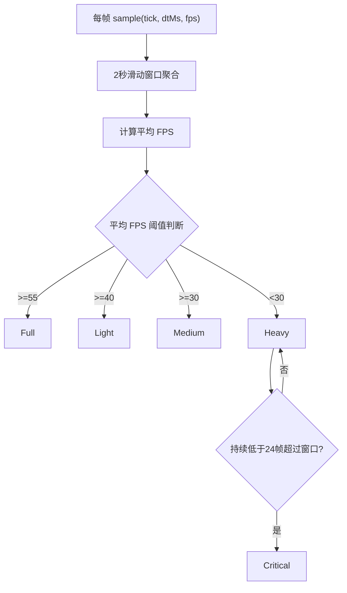
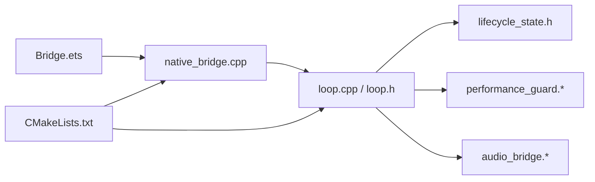

# 错误处理与调试

<cite>
**本文引用的文件**   
- [native_bridge.cpp](file://entry/src/main/cpp/native_bridge.cpp)
- [Bridge.ets](file://entry/src/main/ets/napi/Bridge.ets)
- [loop.h](file://native/engine/core/loop.h)
- [loop.cpp](file://native/engine/core/loop.cpp)
- [lifecycle_state.h](file://native/engine/core/lifecycle_state.h)
- [performance_guard.h](file://native/engine/presentation/performance_guard.h)
- [performance_guard.cpp](file://native/engine/presentation/performance_guard.cpp)
- [audio_bridge.h](file://native/platform/harmony/audio_bridge.h)
- [audio_bridge.cpp](file://native/platform/harmony/audio_bridge.cpp)
- [CMakeLists.txt](file://entry/src/main/cpp/CMakeLists.txt)
- [profile_collect.sh](file://automation/perf/profile_collect.sh)
</cite>

## 目录
1. [简介](#简介)
2. [项目结构](#项目结构)
3. [核心组件](#核心组件)
4. [架构总览](#架构总览)
5. [详细组件分析](#详细组件分析)
6. [依赖关系分析](#依赖关系分析)
7. [性能考量](#性能考量)
8. [故障排查指南](#故障排查指南)
9. [结论](#结论)
10. [附录](#附录)

## 简介
本文件聚焦于 NAPI 桥接层的错误处理与调试机制，系统性说明跨语言异常从 C++ 到 JavaScript 的转换策略、错误码与消息格式、日志与调试工具集成、以及使用 HarmonyOS 调试器进行桥接层调试的方法。同时给出常见错误的诊断与解决方案（类型不匹配、内存访问违规、异步操作超时等），并推荐调试配置与性能分析工具的使用方式。

## 项目结构
本项目采用“ETS + NAPI + C++”的分层架构：
- ETS 侧通过 Bridge.ets 暴露统一的 JS API，调用 native_game.so 中的 NAPI 导出函数。
- C++ 侧在 native_bridge.cpp 中实现 NAPI 回调，负责参数校验、错误抛出、状态同步与渲染生命周期对接。
- 引擎核心 loop.h/loop.cpp 管理游戏循环、输入处理、快照发布、性能监控与音频桥接。
- 平台适配层 audio_bridge.* 提供音频事件派发与降级策略。
- 构建脚本 CMakeLists.txt 统一编译与链接依赖。
- 自动化脚本 profile_collect.sh 用于采集 HiLog 并检测致命渲染错误。

**图表来源** 
- [native_bridge.cpp:518-561](file://entry/src/main/cpp/native_bridge.cpp#L518-L561)
- [Bridge.ets:77-94](file://entry/src/main/ets/napi/Bridge.ets#L77-L94)
- [loop.h:26-103](file://native/engine/core/loop.h#L26-L103)
- [loop.cpp:131-174](file://native/engine/core/loop.cpp#L131-L174)
- [lifecycle_state.h:6-37](file://native/engine/core/lifecycle_state.h#L6-L37)
- [performance_guard.h:21-44](file://native/engine/presentation/performance_guard.h#L21-L44)
- [performance_guard.cpp:18-24](file://native/engine/presentation/performance_guard.cpp#L18-L24)
- [audio_bridge.h:7-26](file://native/platform/harmony/audio_bridge.h#L7-L26)
- [audio_bridge.cpp:1-46](file://native/platform/harmony/audio_bridge.cpp#L1-L46)
- [CMakeLists.txt:26-134](file://entry/src/main/cpp/CMakeLists.txt#L26-L134)
- [profile_collect.sh:38-53](file://automation/perf/profile_collect.sh#L38-L53)

**章节来源**
- [native_bridge.cpp:518-561](file://entry/src/main/cpp/native_bridge.cpp#L518-L561)
- [Bridge.ets:77-94](file://entry/src/main/ets/napi/Bridge.ets#L77-L94)
- [loop.h:26-103](file://native/engine/core/loop.h#L26-L103)
- [loop.cpp:131-174](file://native/engine/core/loop.cpp#L131-L174)
- [lifecycle_state.h:6-37](file://native/engine/core/lifecycle_state.h#L6-L37)
- [performance_guard.h:21-44](file://native/engine/presentation/performance_guard.h#L21-L44)
- [performance_guard.cpp:18-24](file://native/engine/presentation/performance_guard.cpp#L18-L24)
- [audio_bridge.h:7-26](file://native/platform/harmony/audio_bridge.h#L7-L26)
- [audio_bridge.cpp:1-46](file://native/platform/harmony/audio_bridge.cpp#L1-L46)
- [CMakeLists.txt:26-134](file://entry/src/main/cpp/CMakeLists.txt#L26-L134)
- [profile_collect.sh:38-53](file://automation/perf/profile_collect.sh#L38-L53)

## 核心组件
- NAPI 导出与参数校验：native_bridge.cpp 集中定义所有导出函数，对入参进行类型与范围校验，失败时通过 napi_throw_type_error 抛出类型错误。
- 游戏循环与状态快照：loop.cpp 维护固定步长更新、输入处理、VFX/Audio 分发、FPS 统计与快照发布；loop.h 声明接口与成员。
- 生命周期与线程安全：lifecycle_state.h 提供 synchronized 包装与 start/stop 原子控制，避免竞态。
- 性能监控：performance_guard.* 基于滑动窗口计算平均 FPS，输出多级性能等级。
- 音频桥接：audio_bridge.* 将战斗/表现事件映射为声音，不支持时静默降级。
- 构建与日志：CMakeLists.txt 统一头文件路径与库链接；HiLog 宏用于关键路径打印。

**章节来源**
- [native_bridge.cpp:25-28](file://entry/src/main/cpp/native_bridge.cpp#L25-L28)
- [native_bridge.cpp:130-149](file://entry/src/main/cpp/native_bridge.cpp#L130-L149)
- [native_bridge.cpp:212-250](file://entry/src/main/cpp/native_bridge.cpp#L212-L250)
- [native_bridge.cpp:252-275](file://entry/src/main/cpp/native_bridge.cpp#L252-L275)
- [native_bridge.cpp:277-298](file://entry/src/main/cpp/native_bridge.cpp#L277-L298)
- [native_bridge.cpp:321-358](file://entry/src/main/cpp/native_bridge.cpp#L321-L358)
- [native_bridge.cpp:360-516](file://entry/src/main/cpp/native_bridge.cpp#L360-L516)
- [loop.h:26-103](file://native/engine/core/loop.h#L26-L103)
- [loop.cpp:131-174](file://native/engine/core/loop.cpp#L131-L174)
- [lifecycle_state.h:6-37](file://native/engine/core/lifecycle_state.h#L6-L37)
- [performance_guard.h:21-44](file://native/engine/presentation/performance_guard.h#L21-L44)
- [performance_guard.cpp:18-24](file://native/engine/presentation/performance_guard.cpp#L18-L24)
- [audio_bridge.h:7-26](file://native/platform/harmony/audio_bridge.h#L7-L26)
- [audio_bridge.cpp:1-46](file://native/platform/harmony/audio_bridge.cpp#L1-L46)
- [CMakeLists.txt:26-134](file://entry/src/main/cpp/CMakeLists.txt#L26-L134)

## 架构总览
下图展示从 ETS 调用到 C++ 引擎的关键流程，包括参数校验、错误抛出、游戏循环与快照返回。

**图表来源** 
- [native_bridge.cpp:212-250](file://entry/src/main/cpp/native_bridge.cpp#L212-L250)
- [native_bridge.cpp:252-275](file://entry/src/main/cpp/native_bridge.cpp#L252-L275)
- [native_bridge.cpp:277-298](file://entry/src/main/cpp/native_bridge.cpp#L277-L298)
- [native_bridge.cpp:360-516](file://entry/src/main/cpp/native_bridge.cpp#L360-L516)
- [loop.cpp:131-174](file://native/engine/core/loop.cpp#L131-L174)
- [audio_bridge.cpp:26-45](file://native/platform/harmony/audio_bridge.cpp#L26-L45)

## 详细组件分析

### NAPI 参数校验与错误抛出
- 类型检查：使用 napi_typeof 与 napi_get_value_* 系列确保参数类型正确。
- 数值范围：对 type/pointerId/x/y 等字段进行整数/浮点合法性校验，拒绝非有限值。
- 错误抛出：统一通过 ThrowInputTypeError 或 napi_throw_type_error 抛出 JavaScript 类型错误，便于上层捕获与提示。
- 返回值约定：布尔型接口返回 true/false，void 型接口返回 nullptr。

**图表来源** 
- [native_bridge.cpp:212-250](file://entry/src/main/cpp/native_bridge.cpp#L212-L250)

**章节来源**
- [native_bridge.cpp:25-28](file://entry/src/main/cpp/native_bridge.cpp#L25-L28)
- [native_bridge.cpp:212-250](file://entry/src/main/cpp/native_bridge.cpp#L212-L250)
- [native_bridge.cpp:252-275](file://entry/src/main/cpp/native_bridge.cpp#L252-L275)
- [native_bridge.cpp:277-298](file://entry/src/main/cpp/native_bridge.cpp#L277-L298)
- [native_bridge.cpp:321-358](file://entry/src/main/cpp/native_bridge.cpp#L321-L358)

### 游戏循环与快照发布
- 固定步长更新：FixedStep 保证逻辑稳定，tickOnce 内完成输入处理、相机更新、粒子与目标选择、战斗/AI/VFX/Audio 更新。
- 快照聚合：每帧生成 GameSnapshot，包含渲染就绪、环境指标、战斗状态、性能等级、VFX 标志等。
- 生命周期保护：withLifecycle 确保 start/stop/tick 在互斥上下文中执行，避免并发问题。

**图表来源** 
- [loop.h:26-103](file://native/engine/core/loop.h#L26-L103)
- [loop.cpp:131-174](file://native/engine/core/loop.cpp#L131-L174)
- [lifecycle_state.h:6-37](file://native/engine/core/lifecycle_state.h#L6-L37)
- [performance_guard.h:21-44](file://native/engine/presentation/performance_guard.h#L21-L44)
- [audio_bridge.h:7-26](file://native/platform/harmony/audio_bridge.h#L7-L26)

**章节来源**
- [loop.h:26-103](file://native/engine/core/loop.h#L26-L103)
- [loop.cpp:311-417](file://native/engine/core/loop.cpp#L311-L417)
- [lifecycle_state.h:6-37](file://native/engine/core/lifecycle_state.h#L6-L37)

### 性能监控与调试 HUD
- 性能等级：PerformanceGuard 基于 2 秒滑动窗口计算平均 FPS，输出 Full/Light/Medium/Heavy/Critical 等级。
- 日志输出：每秒打印 PROFILE 日志，包含 FPS、性能等级、环境就绪、绘制调用、三角面数、纹理档位、遭遇模式等。
- 调试开关：toggleDebugHud 切换 debugHud_ 标志，影响快照中的 showDebugHud 与 UI 显示。

**图表来源** 
- [performance_guard.cpp:18-24](file://native/engine/presentation/performance_guard.cpp#L18-L24)
- [performance_guard.cpp:26-68](file://native/engine/presentation/performance_guard.cpp#L26-L68)
- [loop.cpp:339-354](file://native/engine/core/loop.cpp#L339-L354)

**章节来源**
- [performance_guard.h:21-44](file://native/engine/presentation/performance_guard.h#L21-L44)
- [performance_guard.cpp:18-24](file://native/engine/presentation/performance_guard.cpp#L18-L24)
- [performance_guard.cpp:26-68](file://native/engine/presentation/performance_guard.cpp#L26-L68)
- [loop.cpp:339-354](file://native/engine/core/loop.cpp#L339-L354)

### 音频桥接与事件派发
- 初始化与停止：start/stop 封装 OHAudioRenderer 的创建与释放，不支持时静默降级。
- 事件映射：dispatch 将 Combat/Presentation 事件映射为合成音效（正弦/方波），避免资源文件依赖。
- 无设备兼容：非 OHOS_PLATFORM 分支直接忽略，保证跨平台稳定性。

**章节来源**
- [audio_bridge.h:7-26](file://native/platform/harmony/audio_bridge.h#L7-L26)
- [audio_bridge.cpp:1-46](file://native/platform/harmony/audio_bridge.cpp#L1-L46)
- [loop.cpp:514-516](file://native/engine/core/loop.cpp#L514-L516)

### 构建与日志集成
- 构建：CMakeLists.txt 指定头文件路径、源文件集合、编译特性与链接库（ACE NAPI、EGL/GLES、HiLog）。
- 日志：OH_LOG_Print 宏用于关键路径打印，便于 HiLog 抓取与分析。

**章节来源**
- [CMakeLists.txt:26-134](file://entry/src/main/cpp/CMakeLists.txt#L26-L134)
- [native_bridge.cpp:14-15](file://entry/src/main/cpp/native_bridge.cpp#L14-L15)
- [loop.cpp:12-16](file://native/engine/core/loop.cpp#L12-L16)

## 依赖关系分析
- ETS 依赖 NAPI 模块：Bridge.ets 导入 libnative_game.so 并暴露方法。
- NAPI 依赖引擎核心：native_bridge.cpp 调用 Loop 的生命周期与输入队列。
- 引擎核心依赖平台适配：Loop 调用 AudioBridge 与 PerformanceGuard。
- 构建系统统一依赖：CMakeLists.txt 汇总所有头文件与库依赖。

**图表来源** 
- [Bridge.ets:1-94](file://entry/src/main/ets/napi/Bridge.ets#L1-L94)
- [native_bridge.cpp:518-561](file://entry/src/main/cpp/native_bridge.cpp#L518-L561)
- [loop.h:26-103](file://native/engine/core/loop.h#L26-L103)
- [lifecycle_state.h:6-37](file://native/engine/core/lifecycle_state.h#L6-L37)
- [performance_guard.h:21-44](file://native/engine/presentation/performance_guard.h#L21-L44)
- [audio_bridge.h:7-26](file://native/platform/harmony/audio_bridge.h#L7-L26)
- [CMakeLists.txt:26-134](file://entry/src/main/cpp/CMakeLists.txt#L26-L134)

**章节来源**
- [Bridge.ets:1-94](file://entry/src/main/ets/napi/Bridge.ets#L1-L94)
- [native_bridge.cpp:518-561](file://entry/src/main/cpp/native_bridge.cpp#L518-L561)
- [loop.h:26-103](file://native/engine/core/loop.h#L26-L103)
- [CMakeLists.txt:26-134](file://entry/src/main/cpp/CMakeLists.txt#L26-L134)

## 性能考量
- 固定步长与帧率：FixedStep 保证逻辑稳定，tickOnce 内限制最大 dtMs 防止跳帧放大。
- 性能等级自适应：PerformanceGuard 动态调整渲染质量与特效强度（由 vfxFlags 与 perfLevel 驱动）。
- 日志采样：每秒 PROFILE 日志避免高频 I/O 开销，仅记录关键指标。
- 资源提交：模型与环境资产提交在 withLifecycle 中执行，避免渲染线程竞争。

[本节为通用指导，无需特定文件引用]

## 故障排查指南
- 类型不匹配
  - 现象：JS 端抛 TypeError，如 pushInput/pushAction/skipDemoPhase 的参数类型或范围不符。
  - 定位：检查 native_bridge.cpp 中的参数校验与 napi_throw_type_error 调用位置。
  - 解决：确保传入对象字段齐全且类型为有限数字，范围符合接口约定。
  - 参考路径：
    - [native_bridge.cpp:212-250](file://entry/src/main/cpp/native_bridge.cpp#L212-L250)
    - [native_bridge.cpp:252-275](file://entry/src/main/cpp/native_bridge.cpp#L252-L275)
    - [native_bridge.cpp:321-358](file://entry/src/main/cpp/native_bridge.cpp#L321-L358)

- 内存访问违规
  - 现象：崩溃、SIGSEGV、glGetString invalid、RequestBuffer fail、EGL error。
  - 定位：使用 HiLog 抓取日志，结合 profile_collect.sh 自动检测致命渲染签名。
  - 解决：检查 surface_init/resize、资产拷贝 CopyArrayBuffer、生命周期 stop/start 顺序。
  - 参考路径：
    - [native_bridge.cpp:59-111](file://entry/src/main/cpp/native_bridge.cpp#L59-L111)
    - [native_bridge.cpp:30-42](file://entry/src/main/cpp/native_bridge.cpp#L30-L42)
    - [profile_collect.sh:38-53](file://automation/perf/profile_collect.sh#L38-L53)

- 异步操作超时
  - 现象：startIfForeground 未启动、渲染未就绪、环境加载慢导致卡顿。
  - 定位：查看 lifecycle.start/stop 与 withLifecycle 保护，确认 g_foregroundRequested 状态。
  - 解决：确保 OnSurfaceCreated/Changed 后调用 start，必要时增加重试与超时回退。
  - 参考路径：
    - [native_bridge.cpp:130-149](file://entry/src/main/cpp/native_bridge.cpp#L130-L149)
    - [lifecycle_state.h:6-37](file://native/engine/core/lifecycle_state.h#L6-L37)
    - [loop.cpp:131-174](file://native/engine/core/loop.cpp#L131-L174)

- 输入事件丢失或错乱
  - 现象：pushInput/pushAction 无效或重复触发。
  - 定位：检查 input queue 与 TouchRouter 路由，确认序列号递增与角色分配。
  - 解决：确保每次 pop 后正确处理 Down/Move/Up/Cancel，重置摇杆与手势状态。
  - 参考路径：
    - [loop.cpp:240-292](file://native/engine/core/loop.cpp#L240-L292)

- 性能下降与掉帧
  - 现象：FPS 降低、perfLevel 升高、vfx 效果减少。
  - 定位：查看 PROFILE 日志与 performanceGuard.level()，确认环境就绪与绘制指标。
  - 解决：降低 VFX 强度、减少 draw calls、优化纹理层级。
  - 参考路径：
    - [loop.cpp:339-354](file://native/engine/core/loop.cpp#L339-L354)
    - [performance_guard.cpp:26-68](file://native/engine/presentation/performance_guard.cpp#L26-L68)

**章节来源**
- [native_bridge.cpp:212-250](file://entry/src/main/cpp/native_bridge.cpp#L212-L250)
- [native_bridge.cpp:252-275](file://entry/src/main/cpp/native_bridge.cpp#L252-L275)
- [native_bridge.cpp:321-358](file://entry/src/main/cpp/native_bridge.cpp#L321-L358)
- [native_bridge.cpp:59-111](file://entry/src/main/cpp/native_bridge.cpp#L59-L111)
- [native_bridge.cpp:30-42](file://entry/src/main/cpp/native_bridge.cpp#L30-L42)
- [profile_collect.sh:38-53](file://automation/perf/profile_collect.sh#L38-L53)
- [lifecycle_state.h:6-37](file://native/engine/core/lifecycle_state.h#L6-L37)
- [loop.cpp:131-174](file://native/engine/core/loop.cpp#L131-L174)
- [loop.cpp:240-292](file://native/engine/core/loop.cpp#L240-L292)
- [loop.cpp:339-354](file://native/engine/core/loop.cpp#L339-L354)
- [performance_guard.cpp:26-68](file://native/engine/presentation/performance_guard.cpp#L26-L68)

## 结论
本项目在 NAPI 桥接层实现了严格的参数校验与一致的 JavaScript 错误抛出机制，配合生命周期保护与固定步长更新，保证了跨语言调用的稳定性与可预测性。性能监控与调试 HUD 提供了运行时洞察，HiLog 与自动化脚本辅助快速定位致命错误。通过上述机制与指南，开发者可有效诊断与修复常见问题，提升桥接层健壮性与用户体验。

[本节为总结性内容，无需特定文件引用]

## 附录
- 调试配置建议
  - 启用 HiLog 输出：确保 OH_LOG_Print 宏生效，使用 hdc shell hilog 抓取日志。
  - 开启调试 HUD：调用 toggleDebugHud 并在 UI 层展示 showDebugHud 字段。
  - 性能分析：观察 PROFILE 日志与 perfLevel/vfxFlags，结合 draw calls/triangles 指标优化。
- 常用命令
  - 抓取日志并检测致命错误：运行 automation/perf/profile_collect.sh，自动过滤 SIGSEGV/EGL 错误。
  - 查看应用 PID 与进程存活：脚本内通过 pidof 监测进程变化。

**章节来源**
- [native_bridge.cpp:14-15](file://entry/src/main/cpp/native_bridge.cpp#L14-L15)
- [loop.cpp:339-354](file://native/engine/core/loop.cpp#L339-L354)
- [profile_collect.sh:38-53](file://automation/perf/profile_collect.sh#L38-L53)