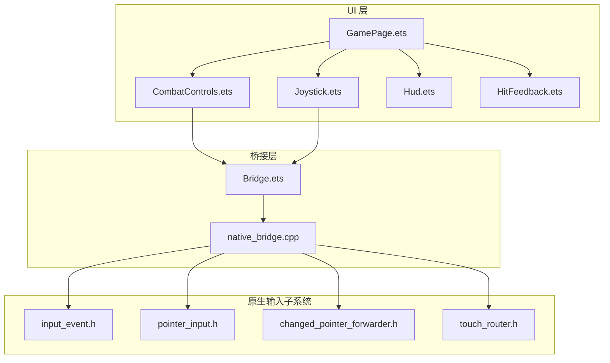
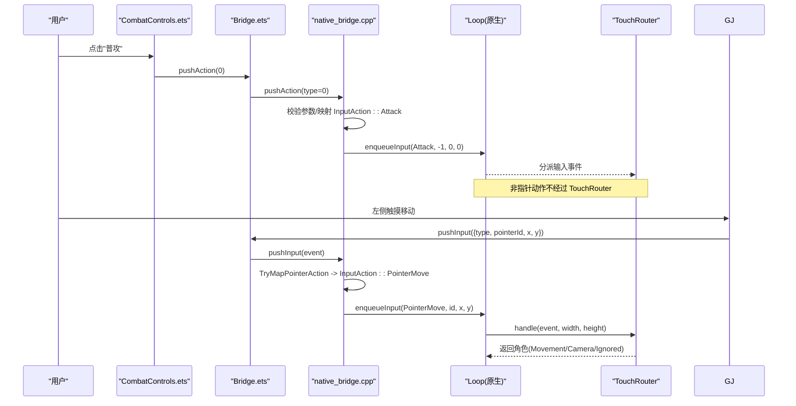
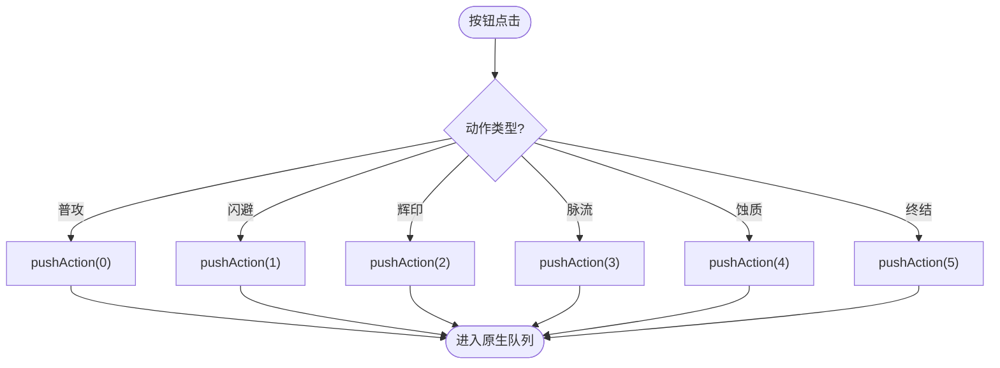
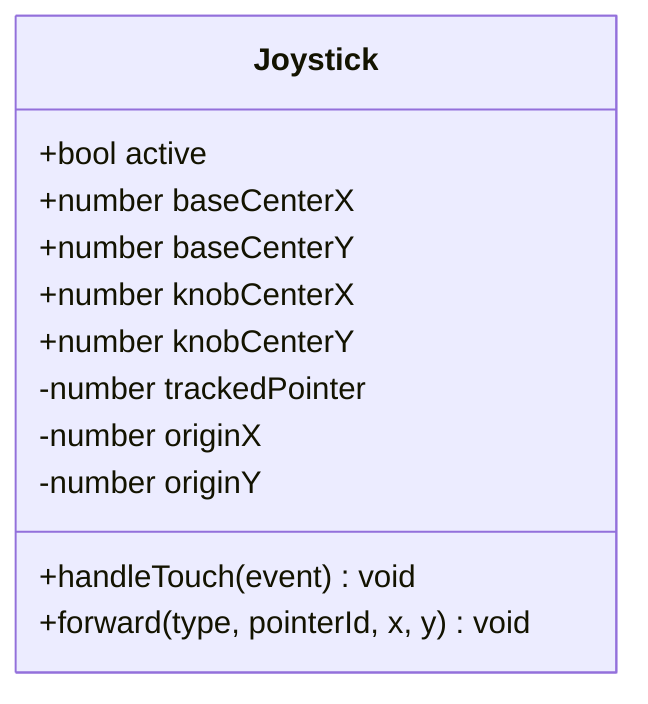
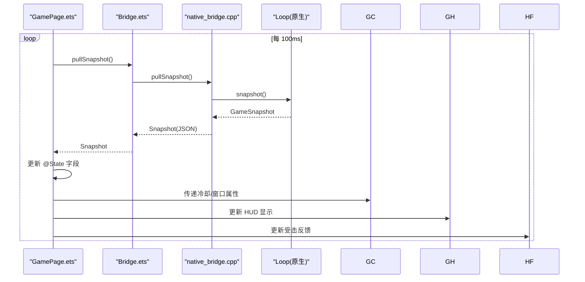
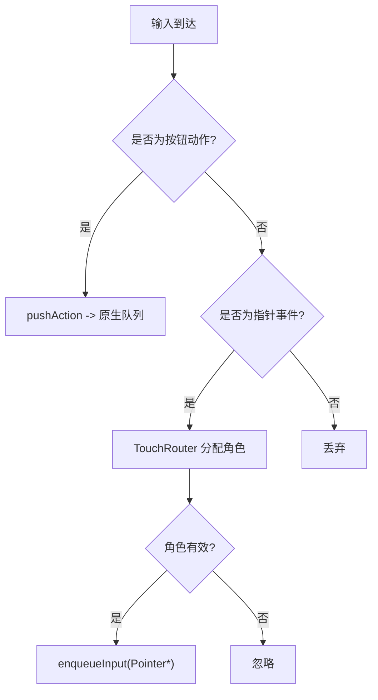
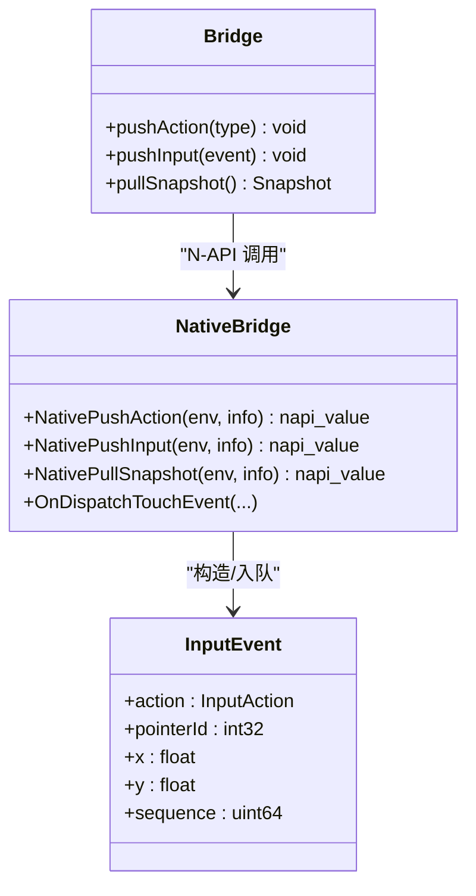
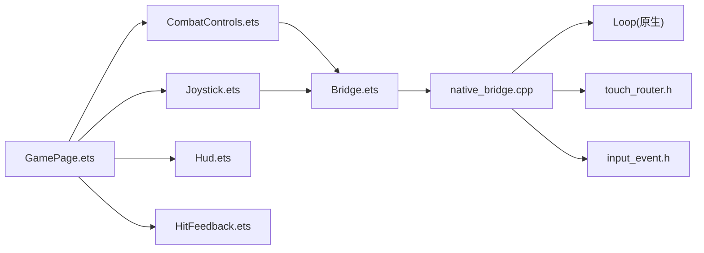

# CombatControls 战斗控制组件

<cite>
**本文引用的文件**   
- [CombatControls.ets](file://entry/src/main/ets/ui/CombatControls.ets)
- [Joystick.ets](file://entry/src/main/ets/ui/Joystick.ets)
- [GamePage.ets](file://entry/src/main/ets/pages/GamePage.ets)
- [Bridge.ets](file://entry/src/main/ets/napi/Bridge.ets)
- [native_bridge.cpp](file://entry/src/main/cpp/native_bridge.cpp)
- [Hud.ets](file://entry/src/main/ets/ui/Hud.ets)
- [HitFeedback.ets](file://entry/src/main/ets/ui/HitFeedback.ets)
- [input_event.h](file://native/engine/input/input_event.h)
- [pointer_input.h](file://native/engine/input/pointer_input.h)
- [changed_pointer_forwarder.h](file://native/engine/input/changed_pointer_forwarder.h)
- [touch_router.h](file://native/engine/input/touch_router.h)
</cite>

## 更新摘要
**变更内容**   
- **全面视觉增强**：所有动作按钮添加了135度渐变背景、增强的状态响应阴影、基于冷却状态的边框宽度变化
- **Block模式命中测试**：改进了触摸交互体验，使用 HitTestMode.Block 优化按钮响应
- **主题化技能按钮**：终结技按钮在可用时获得金色渐变，其他技能按钮（辉印、脉流、蚀质）各自获得主题色渐变和相应的光晕效果
- **源就绪脉冲动画**：新增 animateTo 交替播放模式为可用技能创建呼吸效果，提升视觉反馈
- **冷却状态视觉反馈**：基于冷却状态动态调整边框宽度和阴影强度

## 目录
1. [简介](#简介)
2. [项目结构](#项目结构)
3. [核心组件](#核心组件)
4. [架构总览](#架构总览)
5. [详细组件分析](#详细组件分析)
6. [依赖关系分析](#依赖关系分析)
7. [性能考量](#性能考量)
8. [故障排查指南](#故障排查指南)
9. [结论](#结论)
10. [附录：集成与配置示例](#附录集成与配置示例)

## 简介
本技术文档围绕 my-world 的 CombatControls 战斗控制组件，系统阐述其商业化重塑后的触摸交互实现、事件处理机制、与 C++ 引擎的 NAPI 桥接通信、设备适配策略，以及在 GamePage 中的集成方式。该组件现已完全重写为商业手游标准，包含弧形圆形技能按钮布局、动态冷却环动画、终结技高亮效果和侧拉调试面板，配合独立的虚拟摇杆组件完成移动输入，并通过 NAPI 将用户操作传递给原生游戏逻辑层。

**最新更新**：CombatControls 组件获得了全面的视觉增强，所有动作按钮都添加了135度渐变背景、增强的状态响应阴影、基于冷却状态的边框宽度变化，以及Block模式的命中测试行为以改善触摸交互。终结技按钮在可用时获得金色渐变，其他技能按钮（辉印、脉流、蚀质）各自获得主题色渐变和相应的光晕效果。新增了源就绪脉冲动画，使用animateTo交替播放模式为可用技能创建呼吸效果。

## 项目结构
- UI 层
  - CombatControls.ets：右下角弧形技能按钮簇，包含普攻、闪避、辉印、脉流、蚀质、终结技；提供冷却环遮罩与呼吸动画；右上角调试入口，展开后提供多种测试功能。
  - Joystick.ets：左侧半屏虚拟摇杆，捕获触摸并转发坐标到原生，支持动态浮出显示和空闲提示。
  - Hud.ets：HUD 信息展示，包含状态条、目标信息、调试信息等。
  - HitFeedback.ets：受击视觉反馈层，提供屏幕边缘红色暗角闪烁和低血量脉冲效果。
  - GamePage.ets：页面容器，承载 XComponent 渲染面、Joystick、Hud、CombatControls，并定时拉取快照驱动 UI 更新。
- 桥接层
  - Bridge.ets：NAPI 接口封装，暴露 pushAction/pushInput/pullSnapshot 等方法。
  - native_bridge.cpp：N-API 绑定，接收 JS 调用，校验参数，入队输入或触发游戏流程控制。
- 原生输入子系统
  - input_event.h：定义 InputAction 枚举与 InputEvent 结构体。
  - pointer_input.h：类型转换与 PointerAction 映射。
  - changed_pointer_forwarder.h：通用指针事件转发器。
  - touch_router.h：多点触控角色分配（左屏移动、右屏相机）。

**图表来源** 
- [CombatControls.ets:1-301](file://entry/src/main/ets/ui/CombatControls.ets#L1-L301)
- [Joystick.ets:1-175](file://entry/src/main/ets/ui/Joystick.ets#L1-L175)
- [Hud.ets:1-217](file://entry/src/main/ets/ui/Hud.ets#L1-L217)
- [HitFeedback.ets:1-94](file://entry/src/main/ets/ui/HitFeedback.ets#L1-L94)
- [GamePage.ets:1-411](file://entry/src/main/ets/pages/GamePage.ets#L1-L411)
- [Bridge.ets:1-100](file://entry/src/main/ets/napi/Bridge.ets#L1-L100)
- [native_bridge.cpp:1-577](file://entry/src/main/cpp/native_bridge.cpp#L1-L577)
- [input_event.h:1-24](file://native/engine/input/input_event.h#L1-L24)
- [pointer_input.h:1-36](file://native/engine/input/pointer_input.h#L1-L36)
- [changed_pointer_forwarder.h:1-12](file://native/engine/input/changed_pointer_forwarder.h#L1-L12)
- [touch_router.h:1-59](file://native/engine/input/touch_router.h#L1-L59)

**章节来源**
- [CombatControls.ets:1-301](file://entry/src/main/ets/ui/CombatControls.ets#L1-L301)
- [Joystick.ets:1-175](file://entry/src/main/ets/ui/Joystick.ets#L1-L175)
- [Hud.ets:1-217](file://entry/src/main/ets/ui/Hud.ets#L1-L217)
- [HitFeedback.ets:1-94](file://entry/src/main/ets/ui/HitFeedback.ets#L1-L94)
- [GamePage.ets:1-411](file://entry/src/main/ets/pages/GamePage.ets#L1-L411)
- [Bridge.ets:1-100](file://entry/src/main/ets/napi/Bridge.ets#L1-L100)
- [native_bridge.cpp:1-577](file://entry/src/main/cpp/native_bridge.cpp#L1-L577)

## 核心组件
- **CombatControls**：右下角弧形技能按钮簇，采用圆形按钮布局，包含普攻（76vp主按钮）、闪避（56vp）、终结技（56vp，金色高亮呼吸）、辉印/脉流/蚀质（48vp扇形排列）；每个技能按钮带有圆形样式、边框、字体颜色与状态效果；冷却环遮罩使用 Progress(Ring) 组件，支持动态冷却总时长；右上角调试入口，点击展开侧拉面板。
- **Joystick**：独立的虚拟摇杆组件，左侧半屏透明 Stack 捕获 onTouch，按下生成底盘与旋钮，移动时计算位移并转换为原生半径下的满量程值，通过 pushInput 转发；支持空闲提示淡出和视觉跟随效果。
- **HitFeedback**：受击视觉反馈组件，提供屏幕边缘红色暗角闪烁效果，低血量时持续脉冲提示危险状态。
- **GamePage**：页面容器，使用 XComponent 作为渲染面，叠加 Joystick、Hud、CombatControls、HitFeedback，并以固定间隔拉取快照驱动 UI 状态同步。
- **Bridge**：NAPI 方法封装，统一暴露 pushAction/pushInput/pullSnapshot 等能力。
- **native_bridge.cpp**：N-API 绑定，负责参数校验、类型转换、事件入队、资源提交、生命周期回调注册。

**章节来源**
- [CombatControls.ets:1-301](file://entry/src/main/ets/ui/CombatControls.ets#L1-L301)
- [Joystick.ets:1-175](file://entry/src/main/ets/ui/Joystick.ets#L1-L175)
- [HitFeedback.ets:1-94](file://entry/src/main/ets/ui/HitFeedback.ets#L1-L94)
- [GamePage.ets:1-411](file://entry/src/main/ets/pages/GamePage.ets#L1-L411)
- [Bridge.ets:1-100](file://entry/src/main/ets/napi/Bridge.ets#L1-L100)
- [native_bridge.cpp:1-577](file://entry/src/main/cpp/native_bridge.cpp#L1-L577)

## 架构总览
CombatControls 与 Joystick 通过 Bridge 调用 N-API 方法，将用户输入事件推送到 native_bridge.cpp，再由 Loop 入队至原生输入子系统。TouchRouter 根据屏幕左右侧分配指针角色（移动/相机），避免手势冲突。GamePage 定时 pullSnapshot 获取原生状态，驱动 HUD 与控制按钮的视觉反馈（如冷却时间、终结窗口）。

**图表来源** 
- [CombatControls.ets:74-167](file://entry/src/main/ets/ui/CombatControls.ets#L74-L167)
- [Joystick.ets:24-86](file://entry/src/main/ets/ui/Joystick.ets#L24-L86)
- [Bridge.ets:85-94](file://entry/src/main/ets/napi/Bridge.ets#L85-L94)
- [native_bridge.cpp:252-275](file://entry/src/main/cpp/native_bridge.cpp#L252-L275)
- [native_bridge.cpp:212-250](file://entry/src/main/cpp/native_bridge.cpp#L212-L250)
- [pointer_input.h:27-35](file://native/engine/input/pointer_input.h#L27-L35)
- [touch_router.h:17-36](file://native/engine/input/touch_router.h#L17-L36)

## 详细组件分析

### CombatControls 组件（商业化重塑版）
- **布局与交互**
  - 右下角弧形按钮簇：普攻（76vp主按钮，最右贴近底角）、闪避（56vp，普攻左侧）、终结技（56vp，普攻上方）、辉印/脉流/蚀质（48vp三按钮弧形排列）。
  - 每个技能按钮带有圆形样式、边框、字体颜色与状态效果；点击时调用 pushAction 传入对应动作类型。
  - **冷却环遮罩**：当剩余冷却时间大于 0 时，以环形进度覆盖按钮，显示倒计时秒数，颜色与技能主题一致（辉 `#D9A145`、流 `#43CDB5`、蚀 `#AB4F92`）。
  - **终结技呼吸动画**：当终结窗口开启时，按钮按周期缩放（1.08倍），金色高亮提示可用。
  - **调试面板收纳**：右上角小圆钮切换，展开后可快速启动不同遭遇模式、推进关卡、补给、重试首领、切换调试 HUD。
- **数据绑定**
  - 通过 @Prop 接收 radianceCooldownMs、currentCooldownMs、corruptionCooldownMs、ultimateWindowMs，以及冷却总时长 radianceCooldownTotalMs、currentCooldownTotalMs、corruptionCooldownTotalMs。
  - 内部 @State debugOpen 控制调试面板显隐；@State ultimatePulse 控制呼吸动画开关；@State sourceReadyPulse 控制源技能呼吸动画。
- **事件处理**
  - 所有按钮 onClick 直接调用 pushAction(type)，由 Bridge 转交 N-API 层。
  - 冷却环使用 Progress(Ring) 与 animation 线性过渡，保证平滑收缩。
  - **Block模式命中测试**：所有按钮使用 hitTestBehavior(HitTestMode.Block) 确保精确的触摸响应。
- **可访问性与命中测试**
  - 外层 Stack 设置 hitTestBehavior(HitTestMode.Transparent)，确保按钮区域不被遮挡影响命中。

**更新**：所有按钮现在都具备135度渐变背景、增强的状态响应阴影、基于冷却状态的边框宽度变化。终结技按钮在可用时获得金色渐变（#E5B84A → #C89B3C → #A67D2F），其他技能按钮各自获得主题色渐变和光晕效果。新增了源就绪脉冲动画，使用 animateTo 交替播放模式为可用技能创建呼吸效果。

**图表来源** 
- [CombatControls.ets:74-167](file://entry/src/main/ets/ui/CombatControls.ets#L74-L167)

**章节来源**
- [CombatControls.ets:1-301](file://entry/src/main/ets/ui/CombatControls.ets#L1-L301)

### 虚拟摇杆（Joystick）组件
- **触摸捕获**
  - 左侧半屏透明 Stack 捕获 onTouch，Down/Move/Up/Cancel 均被处理。
  - Down：记录 trackedPointer、originX/Y，初始化底盘与旋钮位置，active=true，并 forward(DOWN)。
  - Move：计算 dx/dy 与长度，限制在 KNOB_TRAVEL 内，换算为原生半径 NATIVE_RADIUS 下的坐标，forward(MOVE)。
  - Up/Cancel：forward(UP/CANCEL)，重置 trackedPointer 与 active。
- **数值映射**
  - 视觉行程 KNOB_TRAVEL=50vp，原生半径 NATIVE_RADIUS=100，确保旋钮拉满即原生满速。
  - 死区：原生 VirtualJoystickConfig.deadZone=0.1f，小于死区则输出空值。
- **事件转发**
  - ArkUI TouchType(0=Down/1=Up/2=Move/3=Cancel) 与原生 InputAction 序号一致，直接 pushInput。
- **视觉表现**
  - 空闲提示淡出，底盘与旋钮跟随手指移动，带阴影与渐变填充。
  - 底盘尺寸 BASE_SIZE=120vp，旋钮尺寸 KNOB_SIZE=52vp，刻度点 TICK_SIZE=6vp。

**图表来源** 
- [Joystick.ets:14-86](file://entry/src/main/ets/ui/Joystick.ets#L14-L86)

**章节来源**
- [Joystick.ets:1-175](file://entry/src/main/ets/ui/Joystick.ets#L1-L175)
- [pointer_input.h:27-35](file://native/engine/input/pointer_input.h#L27-L35)

### HitFeedback 受击反馈组件
- **视觉效果**
  - 受到伤害时屏幕边缘红色暗角闪烁，强度随伤害量缩放。
  - 低血量（≤30）时暗角持续呼吸脉冲，提示危险状态。
- **动画机制**
  - 闪烁峰值随伤害量缩放：小伤轻闪，重击强闪。
  - 低血量脉冲在透明度 0.35 ~ 0.6 之间往复。
- **径向渐变更新**
  - 径向渐变参数已从对象表示法更新为数组表示法，提供更好的兼容性和性能。
  - 中心点使用数组格式 `['50%', '50%']`，颜色数组格式优化。

**更新**：HitFeedback 组件的径向渐变参数已从对象表示法更新为数组表示法，提升了编译稳定性和运行时性能。

**章节来源**
- [HitFeedback.ets:1-94](file://entry/src/main/ets/ui/HitFeedback.ets#L1-L94)

### GamePage 集成与快照驱动
- **渲染面**
  - XComponent(id='gameSurface', type='surface', libraryname='native_game') 作为原生渲染面。
- **组件叠加**
  - Joystick、Hud、CombatControls、HitFeedback 均以 HitTestMode.Transparent 叠加于渲染面之上，互不拦截。
- **快照驱动**
  - setInterval 每 100ms 调用 pullSnapshot()，将原生状态映射到 @State 字段，驱动 HUD 与控制按钮的视觉反馈。
  - 关键字段包括 radianceCooldownMs、currentCooldownMs、corruptionCooldownMs、ultimateWindowMs 等，用于 CombatControls 的冷却与终结窗显示。
  - 新增冷却总时长字段 radianceCooldownTotalMs、currentCooldownTotalMs、corruptionCooldownTotalMs。

**图表来源** 
- [GamePage.ets:226-312](file://entry/src/main/ets/pages/GamePage.ets#L226-L312)
- [Bridge.ets:93-94](file://entry/src/main/ets/napi/Bridge.ets#L93-L94)
- [native_bridge.cpp:360-516](file://entry/src/main/cpp/native_bridge.cpp#L360-L516)

**章节来源**
- [GamePage.ets:1-411](file://entry/src/main/ets/pages/GamePage.ets#L1-L411)

### 事件处理机制与优先级管理
- **多点触控识别**
  - Joystick 仅处理 trackedPointer 对应的触摸，忽略其他指针，避免多指干扰。
  - TouchRouter 维护 roles_ 映射，按屏幕左右侧分配 Movement/Camera 角色，若已有相同角色则返回 Ignored，防止冲突。
- **手势冲突处理**
  - 左侧半屏透明 Stack 捕获移动触摸，右侧透传到 XComponent 原生回调，相机控制不受影响。
  - 非指针动作（攻击/闪避/技能）通过 pushAction 直接入队，不经过 TouchRouter，优先级高于指针事件。
- **输入优先级**
  - 按钮动作 > 指针移动（因为按钮动作不依赖 TouchRouter，且直接入队）。
  - 指针移动中，TouchRouter 决定是否接受该指针（Movement/Camera），否则忽略。

**图表来源** 
- [touch_router.h:17-36](file://native/engine/input/touch_router.h#L17-36)
- [native_bridge.cpp:252-275](file://entry/src/main/cpp/native_bridge.cpp#L252-L275)
- [native_bridge.cpp:212-250](file://entry/src/main/cpp/native_bridge.cpp#L212-L250)

**章节来源**
- [Joystick.ets:24-86](file://entry/src/main/ets/ui/Joystick.ets#L24-L86)
- [touch_router.h:1-59](file://native/engine/input/touch_router.h#L1-L59)
- [native_bridge.cpp:212-275](file://entry/src/main/cpp/native_bridge.cpp#L212-L275)

### 与 C++ 引擎的通信（NAPI 桥接）
- **接口封装**
  - Bridge.ets 导出 pushAction、pushInput、pullSnapshot 等函数，供 UI 调用。
- **参数校验与映射**
  - native_bridge.cpp 对 pushAction 的类型进行范围校验（0~5），映射为 InputAction 枚举。
  - pushInput 要求对象包含 type/pointerId/x/y，并进行类型转换与有限性检查。
- **事件入队**
  - 按钮动作：enqueueInput(action, -1, 0.0f, 0.0f)。
  - 指针事件：ForwardChangedPointer -> TryMapPointerAction -> enqueueInput(action, pointerId, x, y)。
- **资源与生命周期**
  - nativeSetModelAssets/nativeSetEnvironmentAssets 提交模型与环境资源。
  - OnSurfaceCreated/OnSurfaceChanged/OnSurfaceDestroyed 管理渲染面生命周期。

**图表来源** 
- [Bridge.ets:85-94](file://entry/src/main/ets/napi/Bridge.ets#L85-L94)
- [native_bridge.cpp:252-275](file://entry/src/main/cpp/native_bridge.cpp#L252-L275)
- [native_bridge.cpp:212-250](file://entry/src/main/cpp/native_bridge.cpp#L212-L250)
- [input_event.h:1-24](file://native/engine/input/input_event.h#L1-L24)

**章节来源**
- [Bridge.ets:1-100](file://entry/src/main/ets/napi/Bridge.ets#L1-L100)
- [native_bridge.cpp:1-577](file://entry/src/main/cpp/native_bridge.cpp#L1-L577)
- [input_event.h:1-24](file://native/engine/input/input_event.h#L1-L24)

### 设备适配策略
- **屏幕尺寸适配**
  - CombatControls 使用百分比定位与 markAnchor，确保在不同分辨率下按钮相对位置稳定。
  - Joystick 使用 vp 单位与固定比例（KNOB_TRAVEL/NATIVE_RADIUS），保证视觉与原生速度一致。
- **触摸区域优化**
  - 左侧半屏透明 Stack 捕获移动触摸，右侧透传相机控制，避免重叠冲突。
  - 按钮区域通过 hitTestBehavior(HitTestMode.Transparent) 提升命中容错。
  - **Block模式优化**：所有按钮使用 HitTestMode.Block 确保精确的触摸响应，避免误触。
- **响应式设计**
  - 冷却环与呼吸动画基于 CSS-like 动画，随状态变化平滑过渡。
  - HUD 与调试面板采用自适应布局，文本与进度条宽度百分比化。

**章节来源**
- [CombatControls.ets:53-177](file://entry/src/main/ets/ui/CombatControls.ets#L53-L177)
- [Joystick.ets:117-126](file://entry/src/main/ets/ui/Joystick.ets#L117-L126)
- [Hud.ets:57-145](file://entry/src/main/ets/ui/Hud.ets#L57-L145)

## 依赖关系分析
- UI 层依赖 Bridge 暴露的 N-API 方法。
- Bridge 依赖 libnative_game.so 提供的原生函数。
- native_bridge.cpp 依赖 Loop、Surface、Input 子系统。
- TouchRouter 依赖 InputEvent 与屏幕尺寸，负责指针角色分配。
- GamePage 依赖所有 UI 组件与 Bridge，承担状态同步职责。

**图表来源** 
- [CombatControls.ets:1-301](file://entry/src/main/ets/ui/CombatControls.ets#L1-L301)
- [Joystick.ets:1-175](file://entry/src/main/ets/ui/Joystick.ets#L1-L175)
- [GamePage.ets:1-411](file://entry/src/main/ets/pages/GamePage.ets#L1-L411)
- [Bridge.ets:1-100](file://entry/src/main/ets/napi/Bridge.ets#L1-L100)
- [native_bridge.cpp:1-577](file://entry/src/main/cpp/native_bridge.cpp#L1-L577)
- [touch_router.h:1-59](file://native/engine/input/touch_router.h#L1-L59)
- [input_event.h:1-24](file://native/engine/input/input_event.h#L1-L24)

**章节来源**
- [GamePage.ets:1-411](file://entry/src/main/ets/pages/GamePage.ets#L1-L411)
- [Bridge.ets:1-100](file://entry/src/main/ets/napi/Bridge.ets#L1-L100)
- [native_bridge.cpp:1-577](file://entry/src/main/cpp/native_bridge.cpp#L1-L577)

## 性能考量
- **快照频率**：GamePage 每 100ms 拉取一次快照，平衡刷新率与 CPU 占用。
- **动画开销**：冷却环与呼吸动画使用轻量级 CSS-like 动画，避免复杂计算。
- **输入路径**：按钮动作直接入队，指针事件经 ForwardChangedPointer 与 TouchRouter，路径短且无额外拷贝。
- **内存与资源**：模型与环境资源通过 ArrayBuffer 提交，避免频繁分配。
- **组件独立性**：Joystick 组件独立化，减少不必要的重渲染。
- **视觉优化**：135度渐变背景和 Block模式命中测试提升了渲染性能和触摸响应精度。
- **动画性能**：animateTo 交替播放模式为呼吸效果提供了高效的动画执行。

## 故障排查指南
- **按钮无响应**
  - 检查 pushAction 调用是否正确传入类型（0~5）。
  - 确认 Bridge 已正确导入并加载 libnative_game.so。
  - 验证按钮样式方法是否正确使用 `.type(ButtonType.Circle)`。
  - 检查 hitTestBehavior(HitTestMode.Block) 是否正确设置。
- **摇杆无效**
  - 确认左侧半屏透明 Stack 未被遮挡。
  - 检查 TouchType 与 InputAction 映射是否一致（0=Down/1=Up/2=Move/3=Cancel）。
- **快照未更新**
  - 检查 setInterval 是否正常运行。
  - 确认 pullSnapshot 返回值字段完整。
- **原生崩溃**
  - 查看 OH_LOG_Print 日志，关注 surface_init/resize 失败与参数校验错误。
- **冷却环异常**
  - 检查冷却总时长属性是否正确传递。
  - 确认 Progress(Ring) 组件的 value 计算逻辑。
- **受击反馈问题**
  - 检查径向渐变参数格式是否正确更新为数组表示法。
  - 验证 HP 阈值和动画参数配置。
- **视觉增强问题**
  - 检查 135度渐变背景是否正确应用。
  - 确认 Block模式命中测试是否正常工作。
  - 验证源就绪脉冲动画是否正常播放。

**更新**：新增了关于视觉增强相关的故障排查项，确保新功能的正确使用。

**章节来源**
- [native_bridge.cpp:252-275](file://entry/src/main/cpp/native_bridge.cpp#L252-L275)
- [native_bridge.cpp:212-250](file://entry/src/main/cpp/native_bridge.cpp#L212-L250)
- [GamePage.ets:226-312](file://entry/src/main/ets/pages/GamePage.ets#L226-L312)
- [HitFeedback.ets:44-61](file://entry/src/main/ets/ui/HitFeedback.ets#L44-L61)

## 结论
CombatControls 组件经过商业化重塑后，通过清晰的 UI 分层、稳健的 NAPI 桥接与原生输入子系统协作，实现了移动端战斗控制的完整闭环。新的弧形圆形按钮布局、冷却环动画系统和侧拉调试面板设计，显著提升了用户体验。其事件处理机制兼顾多点触控识别与手势冲突处理，设备适配策略确保在不同屏幕尺寸下的一致体验。结合 GamePage 的快照驱动，UI 能够实时反映游戏状态，提供流畅的用户交互。

**最新更新**：CombatControls 组件获得了全面的视觉增强，所有动作按钮都添加了135度渐变背景、增强的状态响应阴影、基于冷却状态的边框宽度变化，以及Block模式的命中测试行为以改善触摸交互。终结技按钮在可用时获得金色渐变，其他技能按钮（辉印、脉流、蚀质）各自获得主题色渐变和相应的光晕效果。新增了源就绪脉冲动画，使用animateTo交替播放模式为可用技能创建呼吸效果。这些改进显著提升了用户的视觉体验和触摸交互的精准度。

## 附录：集成与配置示例
- **在 GamePage 中使用 CombatControls**
  - 引入 CombatControls 组件，传入 radianceCooldownMs、currentCooldownMs、corruptionCooldownMs、ultimateWindowMs 等属性。
  - 设置 hitTestBehavior(HitTestMode.Transparent) 避免遮挡。
- **自定义按键映射**
  - 修改 CombatControls 中各按钮 onClick 调用的 pushAction(type)，确保与原生 InputAction 映射一致。
  - 使用新的 `.type(ButtonType.Circle)` API 替代旧的 `.buttonStyle(ButtonStyleType.Circle)`。
- **布局调整**
  - 调整按钮 position 与 markAnchor，适应不同屏幕比例。
  - 调整 Joystick 的 BASE_SIZE/KNOB_TRAVEL/NATIVE_RADIUS 以匹配手感。
- **冷却配置**
  - 从快照中获取冷却总时长，不再硬编码常量。
  - 支持动态调整技能冷却时间。
- **受击反馈配置**
  - 使用数组格式的径向渐变参数，确保更好的兼容性。
  - 调整 HP 阈值和动画参数以获得理想的视觉效果。
- **视觉增强配置**
  - 自定义 135度渐变背景的颜色和角度。
  - 调整 Block模式命中测试的行为。
  - 配置源就绪脉冲动画的参数和效果。

**更新**：新增了关于视觉增强配置的说明，确保开发者能够正确使用新功能。

**章节来源**
- [GamePage.ets:276-284](file://entry/src/main/ets/pages/GamePage.ets#L276-L284)
- [CombatControls.ets:74-167](file://entry/src/main/ets/ui/CombatControls.ets#L74-L167)
- [Joystick.ets:6-12](file://entry/src/main/ets/ui/Joystick.ets#L6-L12)
- [HitFeedback.ets:44-61](file://entry/src/main/ets/ui/HitFeedback.ets#L44-L61)