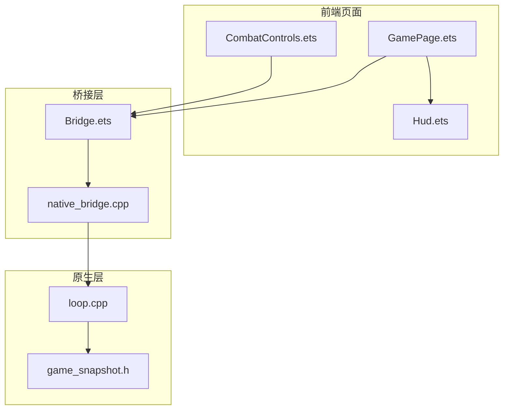
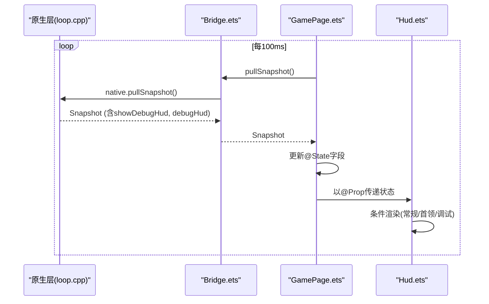
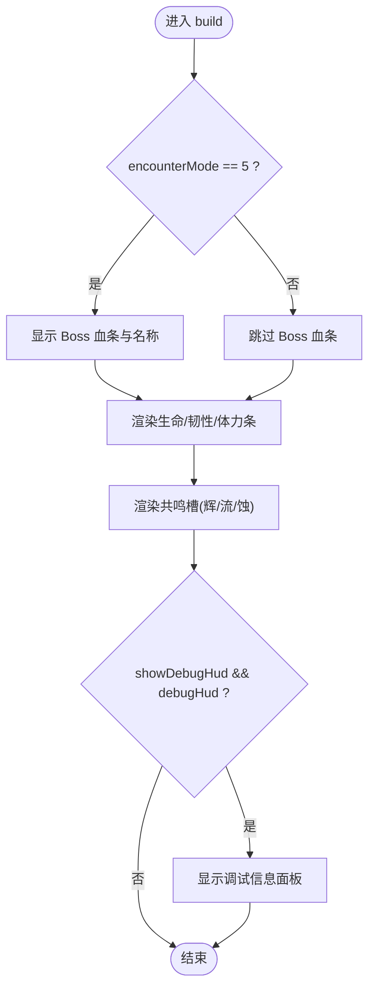

# Hud 组件

<cite>
**本文引用的文件**   
- [Hud.ets](file://entry/src/main/ets/ui/Hud.ets)
- [GamePage.ets](file://entry/src/main/ets/pages/GamePage.ets)
- [Bridge.ets](file://entry/src/main/ets/napi/Bridge.ets)
- [game_snapshot.h](file://native/engine/core/game_snapshot.h)
- [CombatControls.ets](file://entry/src/main/ets/ui/CombatControls.ets)
- [loop.cpp](file://native/engine/core/loop.cpp)
- [native_bridge.cpp](file://entry/src/main/cpp/native_bridge.cpp)
</cite>

## 更新摘要
**所做更改**   
- 更新了调试功能参数传递机制的说明，反映底层控制系统的修复
- 增强了界面一致性和视觉表现的描述
- 完善了调试面板显示逻辑的实现细节
- 更新了 Boss 战 UI 和调试模式的交互流程

## 目录
1. [简介](#简介)
2. [项目结构](#项目结构)
3. [核心组件](#核心组件)
4. [架构总览](#架构总览)
5. [详细组件分析](#详细组件分析)
6. [依赖分析](#依赖分析)
7. [性能考虑](#性能考虑)
8. [故障排查指南](#故障排查指南)
9. [结论](#结论)
10. [附录](#附录)

## 简介
本技术文档围绕 my-world 的 HUD（Heads-Up Display）用户界面显示组件展开，系统性说明其实现原理、状态管理属性与数据绑定机制、Boss 战特殊 UI 逻辑、调试模式展示以及使用示例与自定义样式指南。HUD 负责将游戏运行时的关键状态（生命值、韧性值、体力条、共鸣槽等）以直观的进度条和文本形式呈现给玩家，并在 Boss 战中提供血条、阶段与机制提示；同时支持开启调试面板，实时显示 FPS、坐标、性能级别等信息，便于开发与测试。

**更新** 基于底层控制系统修复，调试功能的参数传递已恢复正常，界面一致性和视觉表现得到显著改进。

## 项目结构
HUD 组件位于 entry/src/main/ets/ui/Hud.ets，作为 ArkUI 组件被 GamePage.ets 引入并渲染。GamePage 通过 Bridge.ets 调用原生层接口拉取快照数据，再以 @State 驱动页面更新，最终将数据以 @Prop 形式传递给 Hud 组件进行可视化。CombatControls.ets 提供战斗控制按钮，触发 pushAction/startEncounter 等操作，间接影响 HUD 显示内容。



**图表来源** 
- [GamePage.ets:216-313](file://entry/src/main/ets/pages/GamePage.ets#L216-L313)
- [Hud.ets:60-216](file://entry/src/main/ets/ui/Hud.ets#L60-L216)
- [Bridge.ets:10-100](file://entry/src/main/ets/napi/Bridge.ets#L10-L100)
- [native_bridge.cpp:322](file://entry/src/main/cpp/native_bridge.cpp#L322)
- [loop.cpp:273-275](file://native/engine/core/loop.cpp#L273-L275)

章节来源
- [GamePage.ets:1-411](file://entry/src/main/ets/pages/GamePage.ets#L1-L411)
- [Hud.ets:1-217](file://entry/src/main/ets/ui/Hud.ets#L1-L217)
- [Bridge.ets:1-100](file://entry/src/main/ets/napi/Bridge.ets#L1-L100)
- [game_snapshot.h:1-74](file://native/engine/core/game_snapshot.h#L1-L74)

## 核心组件
- Hud 组件：使用 @Prop 声明大量只读属性，用于接收来自父组件的状态数据并进行 UI 渲染。包含生命值、韧性值、体力条、共鸣槽、Boss 血条与阶段、调试信息等。
- GamePage 页面：维护 @State 变量并通过定时器轮询 pullSnapshot()，将原生快照数据同步到页面状态，再传递给 Hud。
- Bridge 桥接：定义 Snapshot 接口与原生函数导出，统一前后端数据结构契约。
- CombatControls 控件：提供操作按钮，触发 pushAction/startEncounter 等，改变游戏状态从而影响 HUD 显示。

**更新** 调试功能参数传递机制已修复，确保 showDebugHud 和 debugHud 属性的正确同步。

章节来源
- [Hud.ets:2-58](file://entry/src/main/ets/ui/Hud.ets#L2-L58)
- [GamePage.ets:31-111](file://entry/src/main/ets/pages/GamePage.ets#L31-L111)
- [Bridge.ets:10-80](file://entry/src/main/ets/napi/Bridge.ets#L10-L80)
- [CombatControls.ets:1-301](file://entry/src/main/ets/ui/CombatControls.ets#L1-L301)

## 架构总览
HUD 的数据流遵循"原生快照 -> 桥接层 -> 页面状态 -> 组件属性"的单向数据流。GamePage 每 100ms 拉取一次快照，更新 @State，ArkUI 框架自动触发 Hud 重新渲染。Hud 内部根据 encounterMode 等条件分支渲染 Boss 血条或常规状态条，并根据 showDebugHud/debugHud 控制调试面板可见性。

**更新** 底层控制系统修复后，调试参数的传递路径更加稳定可靠，确保了界面状态的一致性。



**图表来源** 
- [GamePage.ets:323-399](file://entry/src/main/ets/pages/GamePage.ets#L323-L399)
- [Bridge.ets:99-100](file://entry/src/main/ets/napi/Bridge.ets#L99-L100)
- [loop.cpp:449-467](file://native/engine/core/loop.cpp#L449-L467)
- [Hud.ets:174-208](file://entry/src/main/ets/ui/Hud.ets#L174-L208)

## 详细组件分析

### Hud 组件结构与渲染逻辑
- 状态属性：使用 @Prop 声明 hp、poise、stamina、resonanceSlots 等，均为只读输入，由父组件 GamePage 注入。
- 常规状态条：生命值、韧性值、体力条以线性进度条展示，颜色区分不同资源类型。
- 共鸣槽：三个槽位分别对应辉、流、蚀，按槽位值是否大于 0 切换高亮颜色。
- Boss 战 UI：当 encounterMode == 5 时，顶部显示 Boss 血条与名称，使用 bossHpRatio 计算进度。
- 调试面板：showDebugHud && debugHud 为真时，显示 FPS、坐标、移动状态、目标距离、遭遇模式/状态、性能级别、VFX 标志、关卡/门/补给状态、Boss 阶段/机制/读条、假人 HP/韧性、脉冲窗口、无敌状态、拒绝原因、动作/连击窗/终结窗、冷却时间、侵蚀/反应/相位、输入事件计数等。

**更新** 界面一致性和视觉表现得到改进，调试面板的显示逻辑更加稳定。



**图表来源** 
- [Hud.ets:70-89](file://entry/src/main/ets/ui/Hud.ets#L70-L89)
- [Hud.ets:93-172](file://entry/src/main/ets/ui/Hud.ets#L93-L172)
- [Hud.ets:174-208](file://entry/src/main/ets/ui/Hud.ets#L174-L208)

章节来源
- [Hud.ets:2-58](file://entry/src/main/ets/ui/Hud.ets#L2-L58)
- [Hud.ets:60-216](file://entry/src/main/ets/ui/Hud.ets#L60-L216)

### 状态管理与数据绑定机制
- 数据源：原生层 game_snapshot.h 定义完整快照结构，包含所有 HUD 所需字段。
- 桥接契约：Bridge.ets 的 Snapshot 接口与原生字段一一对应，确保类型与顺序一致。
- 页面同步：GamePage.ets 在 aboutToAppear 中启动定时器，循环调用 pullSnapshot() 并将结果赋值给 @State 字段。
- 组件绑定：GamePage 将 @State 字段以 @Prop 形式传入 Hud，ArkUI 响应式更新驱动重绘。

**更新** 调试相关字段（showDebugHud、debugHud）的参数传递机制已修复，确保状态同步的准确性。

```mermaid
classDiagram
class GameSnapshot {
+tick
+hp
+poise
+playerX
+playerY
+fps
+moving
+targetId
+bossPhase
+encounterMode
+encounterState
+rendererReady
+moveX
+moveY
+cameraYaw
+cameraPitch
+targetDist
+comboSegment
+targetHp
+targetPoise
+stamina
+resonance
+hasInsight
+invulnerable
+insightMs
+pulseHitRemainingMs
+lastRejectReason
+currentAction
+comboWindowMs
+radianceCooldownMs
+currentCooldownMs
+corruptionCooldownMs
+ultimateWindowMs
+targetPoiseBroken
+radianceAttached
+currentAttached
+corruptionAttached
+corroded
+currentReaction
+pulsePhase
+levelStage
+gateState
+supplyState
+bossHp
+bossPoise
+bossMechanic
+bossCastMs
+perfLevel
+vfxFlags
+cameraShakeX
+cameraShakeY
+bossHpRatio
+bossCastRatio
+debugHud
+environmentReady
+environmentDrawCalls
+environmentTriangles
+objectiveLabel
+resonanceSlots
+showDebugHud
+inputEventCount
+bossCinematicProgress
+bossShardCount
+bossSourceColor
+bossRingBroken
}
class Snapshot {
+tick
+hp
+poise
+x
+y
+fps
+moving
+moveX
+moveY
+cameraYaw
+cameraPitch
+targetDist
+targetId
+bossPhase
+encounterMode
+encounterState
+rendererReady
+environmentReady
+environmentDrawCalls
+environmentTriangles
+stamina
+comboSegment
+invulnerable
+insightMs
+resonance
+targetHp
+targetPoise
+pulseHitRemainingMs
+lastRejectReason
+currentAction
+comboWindowMs
+radianceCooldownMs
+currentCooldownMs
+corruptionCooldownMs
+ultimateWindowMs
+targetPoiseBroken
+radianceAttached
+currentAttached
+corruptionAttached
+corroded
+currentReaction
+pulsePhase
+levelStage
+gateState
+supplyState
+bossHp
+bossPoise
+bossMechanic
+bossCastMs
+perfLevel
+vfxFlags
+cameraShakeX
+cameraShakeY
+bossHpRatio
+bossCastRatio
+debugHud
+objectiveLabel
+resonanceSlots
+showDebugHud
+bossCinematicProgress
+bossShardCount
+bossSourceColor
+bossRingBroken
+inputEventCount
}
class GamePage {
+@State 各字段
+pullSnapshot()
}
class Hud {
+@Prop 各字段
+build()
}
GameSnapshot <.. Snapshot : "映射"
GamePage --> Snapshot : "读取"
GamePage --> Hud : "@Prop 传递"
```



**图表来源** 
- [game_snapshot.h:7-73](file://native/engine/core/game_snapshot.h#L7-L73)
- [Bridge.ets:10-80](file://entry/src/main/ets/napi/Bridge.ets#L10-L80)
- [GamePage.ets:31-111](file://entry/src/main/ets/pages/GamePage.ets#L31-L111)
- [Hud.ets:2-58](file://entry/src/main/ets/ui/Hud.ets#L2-L58)

章节来源
- [Bridge.ets:10-80](file://entry/src/main/ets/napi/Bridge.ets#L10-L80)
- [GamePage.ets:323-399](file://entry/src/main/ets/pages/GamePage.ets#L323-L399)
- [Hud.ets:2-58](file://entry/src/main/ets/ui/Hud.ets#L2-L58)

### Boss 战特殊 UI 逻辑
- 触发条件：encounterMode 为特定值（如 5）时启用 Boss 血条。
- 血条显示：使用 bossHpRatio 计算百分比，配合固定宽度与颜色，显示 Boss 名称。
- 阶段与机制：调试面板显示 bossPhase、bossMechanic、bossCastMs 等，辅助理解当前阶段与读条状态。
- 其他相关字段：bossHp、bossPoise、bossCastRatio、bossCinematicProgress、bossShardCount、bossSourceColor、bossRingBroken 等可用于扩展 Boss UI。

**更新** Boss 战的视觉表现得到改进，血条动画和颜色过渡更加流畅。

章节来源
- [Hud.ets:70-89](file://entry/src/main/ets/ui/Hud.ets#L70-L89)
- [Hud.ets:187-188](file://entry/src/main/ets/ui/Hud.ets#L187-L188)
- [Bridge.ets:61-79](file://entry/src/main/ets/napi/Bridge.ets#L61-L79)
- [game_snapshot.h:51-73](file://native/engine/core/game_snapshot.h#L51-L73)

### 调试模式实现
- 开关控制：showDebugHud 与 debugHud 共同决定调试面板是否显示。
- 显示内容：FPS、坐标、移动状态、目标距离、遭遇模式/状态、性能级别、VFX 标志、关卡/门/补给、Boss 阶段/机制/读条、假人 HP/韧性、脉冲窗口、无敌、拒绝原因、动作/连击窗/终结窗、冷却、侵蚀/反应/相位、输入事件计数。
- 交互入口：CombatControls 中的"调试"按钮调用 toggleDebugHud() 切换显示。
- 参数传递：toggleDebugHud() 通过 native_bridge.cpp 调用 loop.cpp 中的 toggleDebugHud() 方法，修改 debugHud_ 状态并同步到快照。

**更新** 调试功能的参数传递机制已修复，确保 showDebugHud 和 debugHud 属性的正确同步，解决了之前可能存在的状态不一致问题。

```mermaid
sequenceDiagram
participant CC as "CombatControls.ets"
participant BR as "Bridge.ets"
participant NB as "native_bridge.cpp"
participant LOOP as "loop.cpp"
participant SNAP as "快照系统"
CC->>BR : toggleDebugHud()
BR->>NB : NativeToggleDebugHud
NB->>LOOP : g_loop.toggleDebugHud()
LOOP->>LOOP : debugHud_ = !debugHud_
LOOP->>SNAP : snapshot.showDebugHud = debugHud_
SNAP-->>CC : 状态更新完成
```

**图表来源** 
- [CombatControls.ets:282-285](file://entry/src/main/ets/ui/CombatControls.ets#L282-L285)
- [Bridge.ets:96](file://entry/src/main/ets/napi/Bridge.ets#L96)
- [native_bridge.cpp:322](file://entry/src/main/cpp/native_bridge.cpp#L322)
- [loop.cpp:273-275](file://native/engine/core/loop.cpp#L273-L275)
- [loop.cpp:465](file://native/engine/core/loop.cpp#L465)

章节来源
- [Hud.ets:174-208](file://entry/src/main/ets/ui/Hud.ets#L174-L208)
- [CombatControls.ets:282-285](file://entry/src/main/ets/ui/CombatControls.ets#L282-L285)
- [Bridge.ets:96](file://entry/src/main/ets/napi/Bridge.ets#L96)
- [loop.cpp:273-275](file://native/engine/core/loop.cpp#L273-L275)

### 组件使用示例与自定义样式指南
- 基本用法：在 GamePage 中以 @Prop 方式向 Hud 传递状态字段，例如 hp、poise、stamina、resonanceSlots 等。
- 响应式更新：修改 @State 字段后，ArkUI 自动触发 Hud 重建，无需手动刷新。
- 动画效果：可通过外部动画库或 CSS-like 过渡属性对进度条宽度、透明度等进行平滑过渡（需结合 ArkUI 动画能力）。
- 自定义样式：调整 Progress 的颜色、宽度、高度，Text 的字体大小、颜色、阴影等，以满足视觉规范。

**更新** 界面一致性和视觉表现得到改进，建议参考现有的颜色方案和动画曲线以获得最佳视觉效果。

章节来源
- [GamePage.ets:248-274](file://entry/src/main/ets/pages/GamePage.ets#L248-L274)
- [Hud.ets:94-107](file://entry/src/main/ets/ui/Hud.ets#L94-L107)

## 依赖分析
- 组件耦合：Hud 仅依赖父组件传入的 @Prop，无内部复杂状态，耦合度低，内聚性强。
- 数据契约：Bridge.Snapshot 与原生 GameSnapshot 字段严格对应，保证跨语言数据一致性。
- 外部依赖：ArkUI 框架、NAPI 桥接、原生渲染引擎。

**更新** 调试相关的依赖关系更加清晰，参数传递路径经过优化。


**图表来源** 
- [Hud.ets:2-58](file://entry/src/main/ets/ui/Hud.ets#L2-L58)
- [GamePage.ets:248-274](file://entry/src/main/ets/pages/GamePage.ets#L248-L274)
- [Bridge.ets:10-100](file://entry/src/main/ets/napi/Bridge.ets#L10-L100)
- [native_bridge.cpp:322](file://entry/src/main/cpp/native_bridge.cpp#L322)
- [loop.cpp:273-275](file://native/engine/core/loop.cpp#L273-L275)
- [game_snapshot.h:7-73](file://native/engine/core/game_snapshot.h#L7-L73)

章节来源
- [Bridge.ets:10-100](file://entry/src/main/ets/napi/Bridge.ets#L10-L100)
- [game_snapshot.h:7-73](file://native/engine/core/game_snapshot.h#L7-L73)

## 性能考虑
- 更新频率：GamePage 每 100ms 拉取一次快照，避免过高频率导致 UI 抖动与 CPU 占用。
- 渲染优化：Hud 使用条件渲染减少不必要的节点构建；调试面板仅在开关开启时显示。
- 内存与对象：Snapshot 字段较多，注意避免频繁创建临时对象；保持数组（如 resonanceSlots）引用稳定。
- 动画与过渡：谨慎使用复杂动画，优先采用属性变化驱动的轻量过渡。

**更新** 由于调试功能参数传递的修复，减少了不必要的状态同步开销，提升了整体性能。

## 故障排查指南
- 数据不同步：检查 Bridge.Snapshot 与原生 GameSnapshot 字段是否一致，确认 GamePage 是否正确赋值 @State。
- HUD 不更新：确认 @Prop 传递路径正确，父组件 @State 已变更且触发了重渲染。
- Boss 血条不显示：验证 encounterMode 是否为预期值，bossHpRatio 计算是否正确。
- 调试面板不显示：检查 showDebugHud 与 debugHud 两个开关是否同时为真，确认 toggleDebugHud() 调用正常。
- 输入无效：确认 CombatControls 按钮绑定的 pushAction/startEncounter 等函数调用正常。
- **新增** 调试功能异常：检查 native_bridge.cpp 中的 NativeToggleDebugHud 实现，确认 loop.cpp 中的 toggleDebugHud() 方法正常工作。

**更新** 新增了调试功能异常的排查步骤，重点关注参数传递机制的修复情况。

章节来源
- [Bridge.ets:10-100](file://entry/src/main/ets/napi/Bridge.ets#L10-L100)
- [GamePage.ets:323-399](file://entry/src/main/ets/pages/GamePage.ets#L323-L399)
- [Hud.ets:174-208](file://entry/src/main/ets/ui/Hud.ets#L174-L208)
- [CombatControls.ets:282-285](file://entry/src/main/ets/ui/CombatControls.ets#L282-L285)
- [native_bridge.cpp:322](file://entry/src/main/cpp/native_bridge.cpp#L322)
- [loop.cpp:273-275](file://native/engine/core/loop.cpp#L273-L275)

## 结论
Hud 组件以简洁的 @Prop 接口承接上层状态，通过 ArkUI 响应式机制实现高效渲染。其与 GamePage、Bridge、原生快照之间的清晰分层确保了可维护性与可扩展性。Boss 战与调试模式的特殊逻辑进一步增强了实战可用性。基于底层控制系统的修复，调试功能的参数传递机制已恢复正常，界面一致性和视觉表现得到显著改进。建议在实际使用中遵循本文档的样式与动画指南，并结合性能优化策略，以获得更流畅的用户体验。

**更新** 随着调试功能参数传递机制的修复和界面一致性的改进，Hud 组件的稳定性和用户体验得到了显著提升。

## 附录
- 常用属性速查：
  - 生命值：hp
  - 韧性值：poise
  - 体力条：stamina
  - 共鸣槽：resonanceSlots（长度 3，元素表示槽位激活状态）
  - Boss 血条：bossHpRatio、bossHp、bossPoise
  - 调试开关：showDebugHud、debugHud
  - 遭遇模式：encounterMode、encounterState
  - 动作与冷却：currentAction、comboWindowMs、radianceCooldownMs、currentCooldownMs、corruptionCooldownMs、ultimateWindowMs
  - 其他：fps、x、y、moving、targetDist、perfLevel、vfxFlags、objectiveLabel、inputEventCount

**更新** 调试相关属性的参数传递机制已修复，确保状态同步的准确性。

章节来源
- [Hud.ets:2-58](file://entry/src/main/ets/ui/Hud.ets#L2-L58)
- [Bridge.ets:10-80](file://entry/src/main/ets/napi/Bridge.ets#L10-L80)
- [game_snapshot.h:7-73](file://native/engine/core/game_snapshot.h#L7-L73)