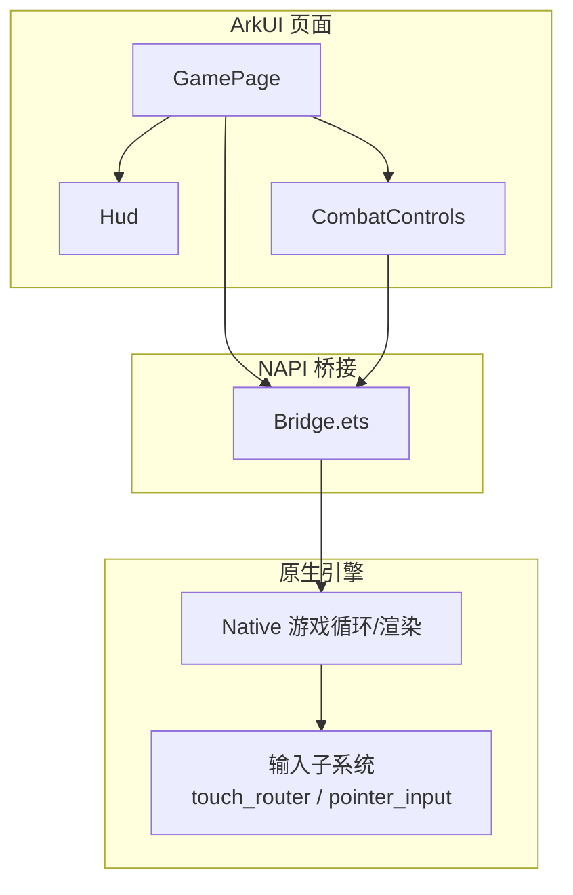
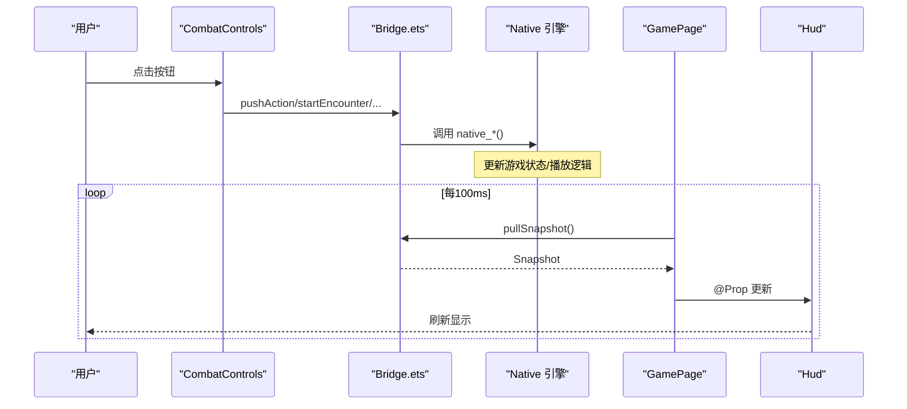
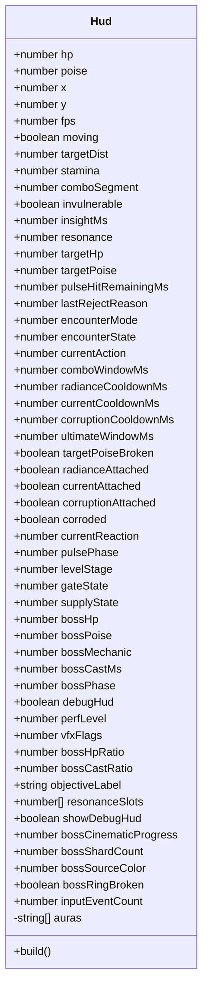
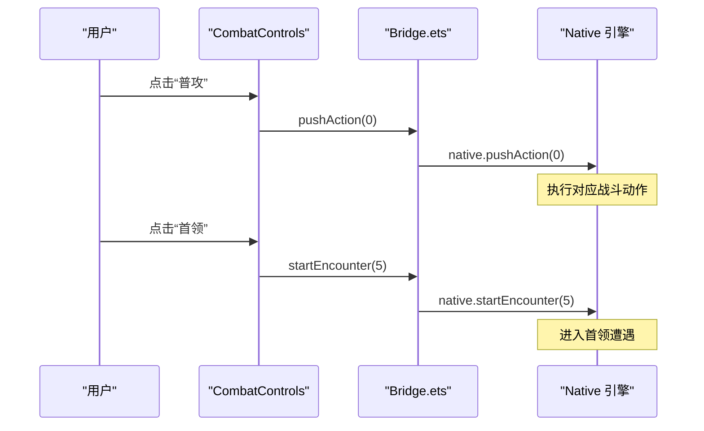
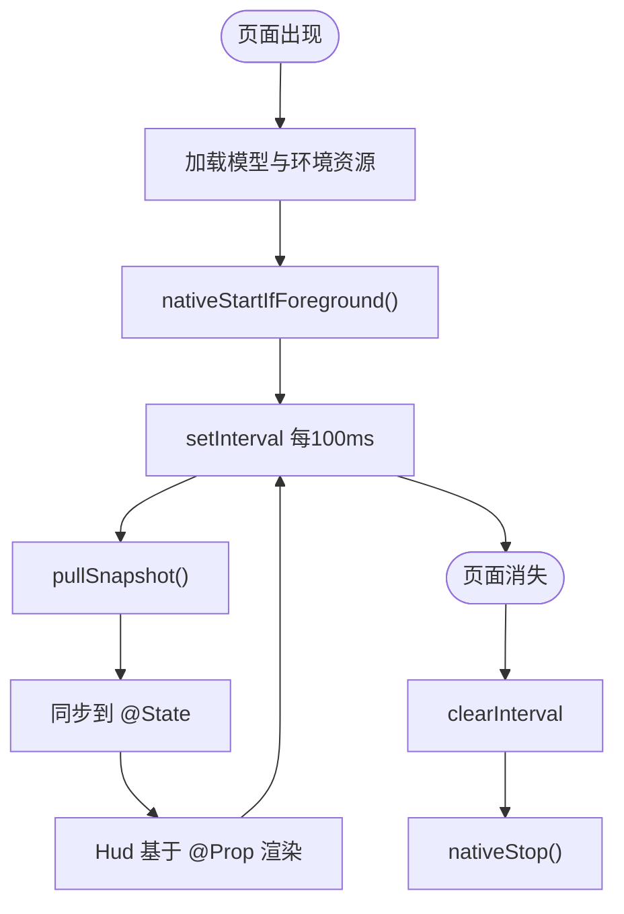
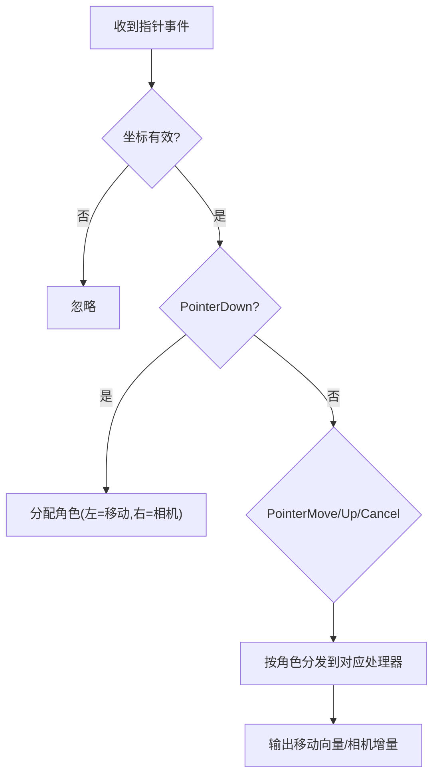

# UI 组件系统

<cite>
**本文引用的文件**   
- [entry/src/main/ets/ui/Hud.ets](file://entry/src/main/ets/ui/Hud.ets)
- [entry/src/main/ets/ui/CombatControls.ets](file://entry/src/main/ets/ui/CombatControls.ets)
- [entry/src/main/ets/pages/GamePage.ets](file://entry/src/main/ets/pages/GamePage.ets)
- [entry/src/main/ets/napi/Bridge.ets](file://entry/src/main/ets/napi/Bridge.ets)
- [native/engine/input/touch_router.h](file://native/engine/input/touch_router.h)
- [native/engine/input/pointer_input.h](file://native/engine/input/pointer_input.h)
- [tests/test_touch_controls.cpp](file://tests/test_touch_controls.cpp)
</cite>

## 目录
1. [简介](#简介)
2. [项目结构](#项目结构)
3. [核心组件](#核心组件)
4. [架构总览](#架构总览)
5. [详细组件分析](#详细组件分析)
6. [依赖关系分析](#依赖关系分析)
7. [性能考量](#性能考量)
8. [故障排查指南](#故障排查指南)
9. [结论](#结论)
10. [附录：使用与定制指南](#附录使用与定制指南)

## 简介
本技术文档聚焦 my-world 的 UI 组件系统，重点解析 Hud（用户界面显示）与 CombatControls（战斗控制）两个 ArkUI 组件的实现原理、状态管理、事件处理与样式定制。同时说明它们如何与 NAPI 桥接层交互，完成数据拉取与指令下发；并补充原生输入子系统（触摸路由、虚拟摇杆、相机手势）在移动端多指交互中的角色。文档提供组件属性与方法清单、数据绑定与响应式更新机制、动画与样式建议、复用模式与性能优化技巧，以及常见问题的排查方法。

## 项目结构
UI 层由 ArkUI 页面与组件构成，GamePage 作为入口承载 XComponent（渲染表面）、Hud 与 CombatControls 两个 UI 组件；NAPI Bridge 负责与原生引擎通信；原生输入子系统处理触摸与手势。



图表来源
- [entry/src/main/ets/pages/GamePage.ets:154-217](file://entry/src/main/ets/pages/GamePage.ets#L154-L217)
- [entry/src/main/ets/ui/Hud.ets:57-143](file://entry/src/main/ets/ui/Hud.ets#L57-L143)
- [entry/src/main/ets/ui/CombatControls.ets:5-40](file://entry/src/main/ets/ui/CombatControls.ets#L5-L40)
- [entry/src/main/ets/napi/Bridge.ets:77-94](file://entry/src/main/ets/napi/Bridge.ets#L77-L94)
- [native/engine/input/touch_router.h:15-58](file://native/engine/input/touch_router.h#L15-L58)
- [native/engine/input/pointer_input.h:27-35](file://native/engine/input/pointer_input.h#L27-L35)

章节来源
- [entry/src/main/ets/pages/GamePage.ets:154-217](file://entry/src/main/ets/pages/GamePage.ets#L154-L217)
- [entry/src/main/ets/ui/Hud.ets:1-145](file://entry/src/main/ets/ui/Hud.ets#L1-L145)
- [entry/src/main/ets/ui/CombatControls.ets:1-42](file://entry/src/main/ets/ui/CombatControls.ets#L1-L42)
- [entry/src/main/ets/napi/Bridge.ets:1-94](file://entry/src/main/ets/napi/Bridge.ets#L1-L94)

## 核心组件
- Hud：只读展示型组件，通过 @Prop 接收大量运行时状态，用于绘制血条、精力条、共鸣槽、Boss 进度、调试信息等。内部使用 @State auras 维护本地 UI 状态（当前未使用）。
- CombatControls：动作触发型组件，将按钮点击映射为 NAPI 调用，驱动原生侧的战斗行为与流程控制。

关键要点
- 数据流：原生 → pullSnapshot → GamePage 状态 → @Prop 传递给 Hud。
- 事件流：CombatControls → pushAction/startEncounter/... → Native。
- 样式：使用 ArkUI 内置 Progress、Text、Row/Column、阴影、圆角等；HitTestMode.Transparent 避免遮挡底层渲染。

章节来源
- [entry/src/main/ets/ui/Hud.ets:1-145](file://entry/src/main/ets/ui/Hud.ets#L1-L145)
- [entry/src/main/ets/ui/CombatControls.ets:1-42](file://entry/src/main/ets/ui/CombatControls.ets#L1-L42)
- [entry/src/main/ets/pages/GamePage.ets:183-214](file://entry/src/main/ets/pages/GamePage.ets#L183-L214)
- [entry/src/main/ets/napi/Bridge.ets:85-94](file://entry/src/main/ets/napi/Bridge.ets#L85-L94)

## 架构总览
UI 与原生通过快照拉取与指令下发解耦，形成“单向数据流 + 事件驱动”的架构。



图表来源
- [entry/src/main/ets/ui/CombatControls.ets:5-40](file://entry/src/main/ets/ui/CombatControls.ets#L5-L40)
- [entry/src/main/ets/napi/Bridge.ets:85-94](file://entry/src/main/ets/napi/Bridge.ets#L85-L94)
- [entry/src/main/ets/pages/GamePage.ets:219-293](file://entry/src/main/ets/pages/GamePage.ets#L219-L293)
- [entry/src/main/ets/ui/Hud.ets:57-143](file://entry/src/main/ets/ui/Hud.ets#L57-L143)

## 详细组件分析

### Hud 组件
职责
- 展示玩家状态（HP、Poise、Stamina）、共鸣槽、目标信息、Boss 阶段与读条、调试面板等。
- 根据 encounterMode 动态显示 Boss 进度条。
- 支持调试开关 showDebugHud/debugHud 切换详细统计。

状态与属性
- @Prop 接收来自 GamePage 的大量字段，涵盖战斗窗口、冷却、附着状态、反应、相位、关卡门/补给、Boss 数值与比例、VFX 标志、输入事件计数等。
- @State auras：预留的本地 UI 状态数组（当前未参与渲染）。

布局与样式
- 使用 Column/Row/Blank 组合布局，Progress 线性进度条，Text 文本标签，阴影与圆角增强可读性。
- HitTestMode.Transparent 确保不拦截底层触摸事件。

响应式更新
- 所有 @Prop 变化触发重新构建；由于仅做展示，无复杂计算，开销较低。

可定制点
- 颜色主题、字体大小、间距、边框圆角、阴影半径等均可按品牌规范调整。
- 调试面板可按 perfLevel/vfxFlags 选择性显示。



图表来源
- [entry/src/main/ets/ui/Hud.ets:1-145](file://entry/src/main/ets/ui/Hud.ets#L1-L145)

章节来源
- [entry/src/main/ets/ui/Hud.ets:1-145](file://entry/src/main/ets/ui/Hud.ets#L1-L145)

### CombatControls 组件
职责
- 提供训练、兽群、混战、守卫、流程、首领等遭遇模式入口。
- 提供推进、补给、重试等操作按钮。
- 提供普攻、闪避、辉印、脉流、蚀质、终结等动作按钮。
- 提供调试开关。

事件处理
- 每个 Button.onClick 直接调用 Bridge 暴露的方法，如 startEncounter(mode)、pushAction(type)、advanceLevel()、useSupply()、retryBoss()、toggleDebugHud()。

布局与样式
- 多行 Row 排列按钮，统一 padding/margin，右下角对齐，透明命中区域避免遮挡渲染。



图表来源
- [entry/src/main/ets/ui/CombatControls.ets:5-40](file://entry/src/main/ets/ui/CombatControls.ets#L5-L40)
- [entry/src/main/ets/napi/Bridge.ets:85-94](file://entry/src/main/ets/napi/Bridge.ets#L85-L94)

章节来源
- [entry/src/main/ets/ui/CombatControls.ets:1-42](file://entry/src/main/ets/ui/CombatControls.ets#L1-L42)
- [entry/src/main/ets/napi/Bridge.ets:85-94](file://entry/src/main/ets/napi/Bridge.ets#L85-L94)

### GamePage 与数据绑定
职责
- 加载模型与环境资源，启动/停止原生渲染。
- 定时拉取 Snapshot，同步到 @State，再透传给 Hud。
- 管理生命周期（aboutToAppear/aboutToDisappear），清理定时器与资源。

数据绑定与响应式更新
- 使用 setInterval 每 100ms 拉取一次快照，批量赋值给 @State，触发 Hud 的 @Prop 更新。
- 对渲染能力与环境就绪状态进行判断，必要时显示错误提示。



图表来源
- [entry/src/main/ets/pages/GamePage.ets:103-152](file://entry/src/main/ets/pages/GamePage.ets#L103-L152)
- [entry/src/main/ets/pages/GamePage.ets:219-293](file://entry/src/main/ets/pages/GamePage.ets#L219-L293)
- [entry/src/main/ets/napi/Bridge.ets:77-94](file://entry/src/main/ets/napi/Bridge.ets#L77-L94)

章节来源
- [entry/src/main/ets/pages/GamePage.ets:1-305](file://entry/src/main/ets/pages/GamePage.ets#L1-L305)
- [entry/src/main/ets/napi/Bridge.ets:1-94](file://entry/src/main/ets/napi/Bridge.ets#L1-L94)

### 触摸交互与手势识别（原生侧）
- TouchRouter：根据屏幕左右半区分配指针角色（移动/相机），拒绝重复或非法指针，支持 PointerDown/Move/Up/Cancel。
- VirtualJoystick：将拖拽位移转换为归一化向量，支持死区与最大半径配置。
- CameraGesture：累积滑动增量，按帧消费，支持顺序开始/结束。
- 输入转换：TryMapPointerAction 将上层类型映射为 InputAction，TryConvertFloat/Int32 保证数值安全。



图表来源
- [native/engine/input/touch_router.h:15-58](file://native/engine/input/touch_router.h#L15-L58)
- [native/engine/input/pointer_input.h:27-35](file://native/engine/input/pointer_input.h#L27-L35)
- [tests/test_touch_controls.cpp:8-110](file://tests/test_touch_controls.cpp#L8-L110)

章节来源
- [native/engine/input/touch_router.h:1-59](file://native/engine/input/touch_router.h#L1-L59)
- [native/engine/input/pointer_input.h:1-36](file://native/engine/input/pointer_input.h#L1-L36)
- [tests/test_touch_controls.cpp:1-111](file://tests/test_touch_controls.cpp#L1-L111)

## 依赖关系分析
- GamePage 依赖 Bridge 提供的 NAPI 接口，负责资源加载与快照拉取。
- Hud 与 CombatControls 均被 GamePage 组合使用，前者只读，后者写操作。
- 原生输入子系统独立于 UI，通过 NAPI 暴露 pushInput/pushAction 等方法供上层调用。

```mermaid
graph LR
GP["GamePage"] --> |调用| BR["Bridge.ets"]
CC["CombatControls"] --> |调用| BR
GP --> |传递@Prop| HUD["Hud"]
BR --> |native_*| NATIVE["Native 引擎"]
NATIVE --> |输入事件| INP["输入子系统"]
```

图表来源
- [entry/src/main/ets/pages/GamePage.ets:154-217](file://entry/src/main/ets/pages/GamePage.ets#L154-L217)
- [entry/src/main/ets/ui/CombatControls.ets:5-40](file://entry/src/main/ets/ui/CombatControls.ets#L5-L40)
- [entry/src/main/ets/napi/Bridge.ets:77-94](file://entry/src/main/ets/napi/Bridge.ets#L77-L94)
- [native/engine/input/touch_router.h:15-58](file://native/engine/input/touch_router.h#L15-L58)

章节来源
- [entry/src/main/ets/pages/GamePage.ets:154-217](file://entry/src/main/ets/pages/GamePage.ets#L154-L217)
- [entry/src/main/ets/ui/CombatControls.ets:1-42](file://entry/src/main/ets/ui/CombatControls.ets#L1-L42)
- [entry/src/main/ets/napi/Bridge.ets:1-94](file://entry/src/main/ets/napi/Bridge.ets#L1-L94)
- [native/engine/input/touch_router.h:1-59](file://native/engine/input/touch_router.h#L1-L59)

## 性能考量
- 快照频率：默认 100ms 拉取一次，平衡了实时性与 CPU 占用。可根据设备性能调高间隔或采用增量更新策略。
- 渲染开销：Hud 仅做轻量展示，避免在 build 中进行复杂计算；条件渲染（如 debugHud）减少不必要的节点。
- 命中测试：HitTestMode.Transparent 避免 UI 层拦截触摸，降低额外事件处理成本。
- 资源加载：异步并行加载模型与环境资源，失败回退到程序化网格，保障稳定性。
- 内存与 GC：避免在高频回调中创建临时对象；尽量复用数组与对象。

[本节为通用指导，无需引用具体文件]

## 故障排查指南
- 渲染不可用：当 rendererReady=false 时，GamePage 显示 GLES 不支持提示，需重建模拟器或使用真机。
- 资源加载失败：若 nativeSetModelAssets/nativeSetEnvironmentAssets 返回 false，将记录错误日志并使用回退资源。
- 输入异常：TouchRouter 对非法坐标/无穷值进行过滤；检查指针 ID 是否已存在，避免重复分配角色。
- 调试面板：开启 showDebugHud/debugHud 后，观察 FPS、坐标、遭遇模式、冷却、窗口时间等指标定位问题。

章节来源
- [entry/src/main/ets/pages/GamePage.ets:168-181](file://entry/src/main/ets/pages/GamePage.ets#L168-L181)
- [entry/src/main/ets/pages/GamePage.ets:112-151](file://entry/src/main/ets/pages/GamePage.ets#L112-L151)
- [native/engine/input/touch_router.h:17-36](file://native/engine/input/touch_router.h#L17-L36)
- [entry/src/main/ets/ui/Hud.ets:104-136](file://entry/src/main/ets/ui/Hud.ets#L104-L136)

## 结论
Hud 与 CombatControls 以 ArkUI 组件形态实现清晰的职责分离：前者专注状态展示，后者专注动作触发。通过 Bridge 与原生引擎解耦，配合稳定的快照拉取机制，实现了高效、可扩展的 UI 系统。原生输入子系统提供了健壮的触摸与手势处理能力，满足移动端多指交互需求。遵循本文的定制与优化建议，可在不同设备上获得一致的体验与良好的性能表现。

[本节为总结性内容，无需引用具体文件]

## 附录：使用与定制指南

### 组件使用示例
- 在 GamePage 中引入并实例化 Hud 与 CombatControls，设置 hitTestBehavior 为 Transparent，避免遮挡渲染。
- 将 GamePage 的 @State 字段逐一赋给 Hud 的 @Prop，保持数据一致性。
- 在 CombatControls 中按需扩展按钮，调用 Bridge 暴露的方法驱动原生逻辑。

章节来源
- [entry/src/main/ets/pages/GamePage.ets:183-214](file://entry/src/main/ets/pages/GamePage.ets#L183-L214)
- [entry/src/main/ets/ui/CombatControls.ets:5-40](file://entry/src/main/ets/ui/CombatControls.ets#L5-L40)

### 自定义开发指南
- 新增 HUD 字段：在 Hud.ets 添加 @Prop，并在 GamePage 中同步快照字段，确保类型一致。
- 新增动作按钮：在 CombatControls.ets 添加 Button，并在 Bridge.ets 暴露对应的 native_* 方法。
- 样式主题：集中定义颜色与尺寸常量，替换硬编码值，便于全局换肤。
- 动画效果：可使用 ArkUI 的 Transition/Animation API 对进度条、文字淡入淡出等进行平滑过渡。

章节来源
- [entry/src/main/ets/ui/Hud.ets:1-145](file://entry/src/main/ets/ui/Hud.ets#L1-L145)
- [entry/src/main/ets/ui/CombatControls.ets:1-42](file://entry/src/main/ets/ui/CombatControls.ets#L1-L42)
- [entry/src/main/ets/napi/Bridge.ets:77-94](file://entry/src/main/ets/napi/Bridge.ets#L77-L94)

### 触摸交互与多设备适配
- 左侧半屏优先分配移动角色，右侧半屏分配相机角色，避免冲突。
- 虚拟摇杆支持死区与最大半径配置，适配不同手指力度与设备精度。
- 相机手势按帧消费增量，保证平滑旋转与缩放。
- 针对小屏设备可适当增大按钮尺寸与间距，提升触控可用性。

章节来源
- [native/engine/input/touch_router.h:15-58](file://native/engine/input/touch_router.h#L15-L58)
- [tests/test_touch_controls.cpp:8-110](file://tests/test_touch_controls.cpp#L8-L110)

### 性能优化技巧
- 降低快照频率或采用增量更新，减少主线程压力。
- 合并 HUD 更新：仅在必要字段变化时触发重绘。
- 预编译样式与资源，减少运行时开销。
- 使用条件渲染隐藏调试面板，生产环境关闭非必要信息。

[本节为通用指导，无需引用具体文件]