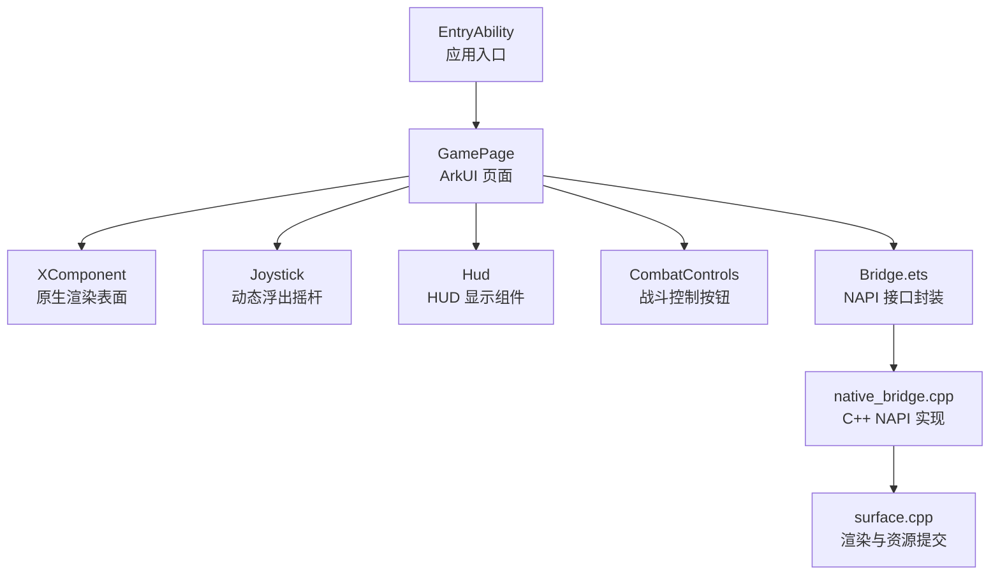
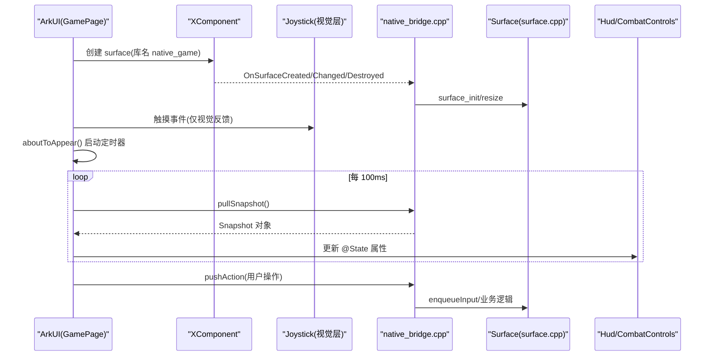
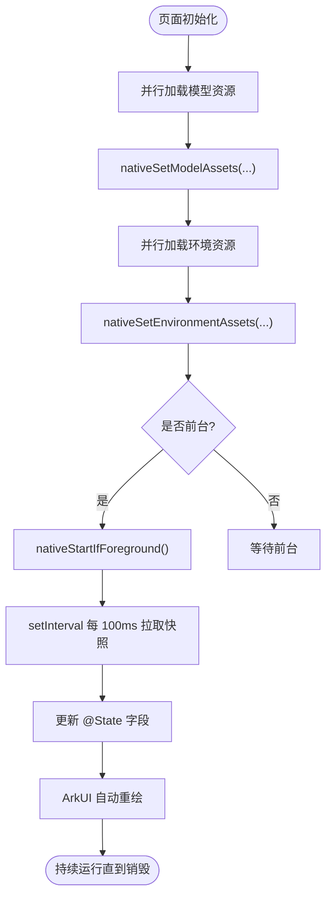
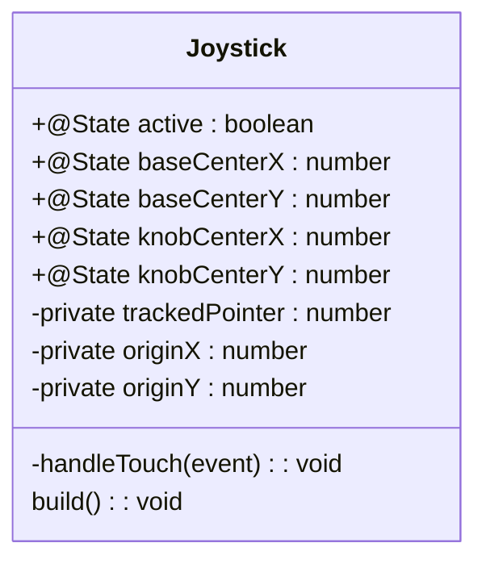
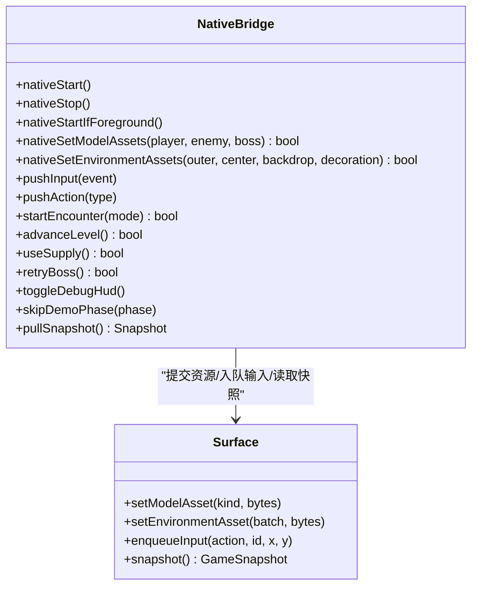
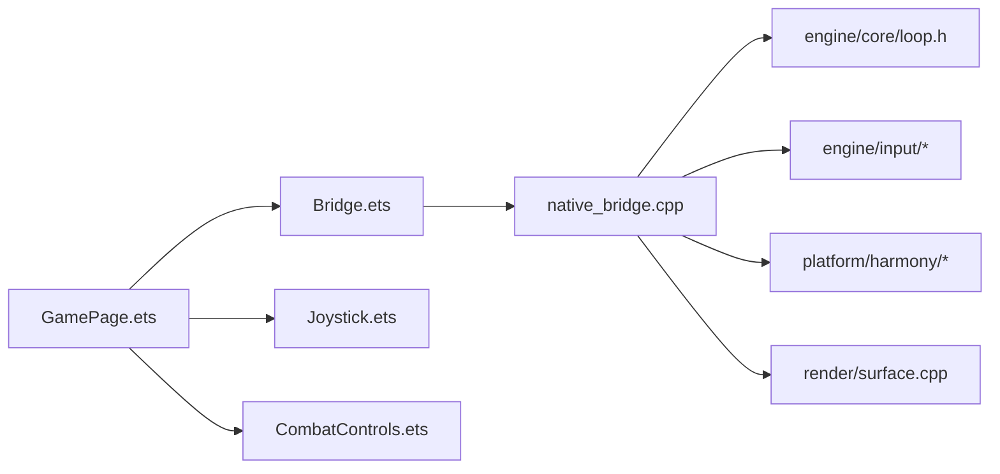

# 主界面与页面管理

<cite>
**本文引用的文件**   
- [entry/src/main/ets/pages/GamePage.ets](file://entry/src/main/ets/pages/GamePage.ets)
- [entry/src/main/ets/ui/Joystick.ets](file://entry/src/main/ets/ui/Joystick.ets)
- [entry/src/main/ets/ui/CombatControls.ets](file://entry/src/main/ets/ui/CombatControls.ets)
- [entry/src/main/ets/napi/Bridge.ets](file://entry/src/main/ets/napi/Bridge.ets)
- [entry/src/main/cpp/native_bridge.cpp](file://entry/src/main/cpp/native_bridge.cpp)
- [entry/src/main/ets/ui/Hud.ets](file://entry/src/main/ets/ui/Hud.ets)
- [entry/src/main/ets/EntryAbility.ets](file://entry/src/main/ets/EntryAbility.ets)
- [entry/src/main/resources/base/profile/main_pages.json](file://entry/src/main/resources/base/profile/main_pages.json)
- [native/engine/render/surface.cpp](file://native/engine/render/surface.cpp)
</cite>

## 更新摘要
**所做更改**   
- 新增 Joystick 组件章节，详细说明动态浮出摇杆的实现机制
- 更新 GamePage 章节，反映新的组件层级结构和触摸路由设计
- 更新 CombatControls 章节，说明冷却/终结窗口参数的传入和调试面板收纳
- 更新架构总览图，展示新的组件层次关系
- 更新性能考虑部分，包含新的命中测试策略

## 目录
1. [简介](#简介)
2. [项目结构](#项目结构)
3. [核心组件](#核心组件)
4. [架构总览](#架构总览)
5. [详细组件分析](#详细组件分析)
6. [依赖关系分析](#依赖关系分析)
7. [性能考虑](#性能考虑)
8. [故障排查指南](#故障排查指南)
9. [结论](#结论)
10. [附录](#附录)

## 简介
本技术文档聚焦 my-world 的 GamePage 主界面，系统性阐述 ArkUI 页面组件的组织方式、状态管理与数据绑定机制、渲染优化策略，以及与 NAPI 桥接层交互获取游戏数据并更新界面的完整流程。同时覆盖页面生命周期方法的使用（加载、销毁、数据更新）、UI 布局示例与响应式设计实现、触摸事件与用户输入处理、以及性能优化与调试方法。

**最新更新**：GamePage 已集成新的 Joystick 组件层，位于 XComponent 之上、Hud 之下，实现了商业手游标准的动态浮出可视化摇杆体验。移除了全局 HitTestMode.Transparent 覆盖，允许各个按钮级别的命中测试生效。向 CombatControls 传入了 4 个冷却/终结窗口 @Prop 参数，支持冷却环显示和终结技高亮效果。

## 项目结构
GamePage 作为应用入口页面，通过 EntryAbility 加载，使用 XComponent 承载原生渲染表面，并通过 NAPI 桥接层与 C++ 引擎通信。UI 层由 HUD、Joystick 摇杆和控制面板组成，采用 ArkUI 声明式构建。

**图表来源**
- [entry/src/main/ets/EntryAbility.ets:14-23](file://entry/src/main/ets/EntryAbility.ets#L14-L23)
- [entry/src/main/ets/pages/GamePage.ets:216-313](file://entry/src/main/ets/pages/GamePage.ets#L216-L313)
- [entry/src/main/ets/napi/Bridge.ets:77-94](file://entry/src/main/ets/napi/Bridge.ets#L77-L94)
- [entry/src/main/cpp/native_bridge.cpp:518-561](file://entry/src/main/cpp/native_bridge.cpp#L518-L561)
- [native/engine/render/surface.cpp:618-637](file://native/engine/render/surface.cpp#L618-L637)

**章节来源**
- [entry/src/main/resources/base/profile/main_pages.json:1-6](file://entry/src/main/resources/base/profile/main_pages.json#L1-L6)
- [entry/src/main/ets/EntryAbility.ets:14-23](file://entry/src/main/ets/EntryAbility.ets#L14-L23)

## 核心组件
- **GamePage**：页面主体，负责状态管理、资源加载、定时器拉取快照、XComponent 生命周期回调、UI 组合与渲染。
- **Joystick**：新增的动态浮出摇杆组件，提供视觉反馈但不处理实际输入逻辑。
- **Bridge.ets**：NAPI 接口封装，定义 Snapshot 数据结构与导出函数，供 ArkUI 调用。
- **native_bridge.cpp**：C++ NAPI 实现，注册 XComponent 回调、处理输入、提交模型与环境资源、暴露 pullSnapshot 等。
- **Hud.ets**：HUD 显示组件，展示生命值、精力、共鸣槽、Boss 进度条与调试信息。
- **CombatControls.ets**：战斗控制按钮组，触发 encounter、推进关卡、补给、重试、切换调试 HUD 及动作输入，支持冷却环和终结技高亮。
- **EntryAbility.ets**：应用入口，加载 GamePage，并在前台/后台时启动/停止原生循环。

**章节来源**
- [entry/src/main/ets/pages/GamePage.ets:8-98](file://entry/src/main/ets/pages/GamePage.ets#L8-L98)
- [entry/src/main/ets/ui/Joystick.ets:1-175](file://entry/src/main/ets/ui/Joystick.ets#L1-175)
- [entry/src/main/ets/napi/Bridge.ets:10-94](file://entry/src/main/ets/napi/Bridge.ets#L10-L94)
- [entry/src/main/cpp/native_bridge.cpp:130-149](file://entry/src/main/cpp/native_bridge.cpp#L130-L149)
- [entry/src/main/ets/ui/Hud.ets:1-55](file://entry/src/main/ets/ui/Hud.ets#L1-L55)
- [entry/src/main/ets/ui/CombatControls.ets:1-42](file://entry/src/main/ets/ui/CombatControls.ets#L1-L42)
- [entry/src/main/ets/EntryAbility.ets:29-37](file://entry/src/main/ets/EntryAbility.ets#L29-L37)

## 架构总览
GamePage 通过 XComponent 将渲染交给原生 surface，ArkUI 仅负责 UI 叠加层。每 100ms 拉取一次 Snapshot，更新 @State 驱动 UI 刷新。输入事件通过 XComponent 回调进入 C++，再入队到游戏循环。Joystick 组件仅提供视觉反馈，实际输入由下层 XComponent 处理。

**图表来源**
- [entry/src/main/ets/pages/GamePage.ets:216-313](file://entry/src/main/ets/pages/GamePage.ets#L216-L313)
- [entry/src/main/ets/pages/GamePage.ets:315-399](file://entry/src/main/ets/pages/GamePage.ets#L315-L399)
- [entry/src/main/ets/ui/Joystick.ets:19-71](file://entry/src/main/ets/ui/Joystick.ets#L19-L71)
- [entry/src/main/cpp/native_bridge.cpp:59-111](file://entry/src/main/cpp/native_bridge.cpp#L59-L111)
- [entry/src/main/cpp/native_bridge.cpp:212-275](file://entry/src/main/cpp/native_bridge.cpp#L212-L275)
- [entry/src/main/ets/napi/Bridge.ets:85-94](file://entry/src/main/ets/napi/Bridge.ets#L85-L94)

## 详细组件分析

### GamePage 页面组件
- **状态管理**：大量 @State 字段对应 Snapshot 的键，用于驱动 UI 更新；private snapshot 作为初始默认值。
- **资源加载**：异步读取 models 与 environment GLB，提交给 nativeSetModelAssets/nativeSetEnvironmentAssets，完成后调用 nativeStartIfForeground。
- **渲染表面**：XComponent 指定 libraryname 为 native_game，onDestroy 中调用 nativeStop。
- **生命周期**：aboutToAppear 启动定时器拉取快照；aboutToDisappear 清理定时器并停止原生循环。
- **渲染优化**：rendererReady/environmentReady 控制错误提示与条件渲染；移除全局 HitTestMode.Transparent 覆盖，允许各组件独立控制命中测试。

**更新**：现在在 Stack 中按顺序插入 Joystick() 层（XComponent 之上、Hud 之下），并向 CombatControls 传入 4 个冷却/终结窗口 @Prop 参数。

**图表来源**
- [entry/src/main/ets/pages/GamePage.ets:165-214](file://entry/src/main/ets/pages/GamePage.ets#L165-L214)
- [entry/src/main/ets/pages/GamePage.ets:315-399](file://entry/src/main/ets/pages/GamePage.ets#L315-L399)

**章节来源**
- [entry/src/main/ets/pages/GamePage.ets:8-98](file://entry/src/main/ets/pages/GamePage.ets#L8-L98)
- [entry/src/main/ets/pages/GamePage.ets:216-313](file://entry/src/main/ets/pages/GamePage.ets#L216-L313)
- [entry/src/main/ets/pages/GamePage.ets:315-411](file://entry/src/main/ets/pages/GamePage.ets#L315-L411)

### Joystick 摇杆组件（新增）
- **功能定位**：仅负责摇杆视觉反馈，生产输入由下层 XComponent 的 native 回调统一处理。
- **触摸处理**：左半屏触摸捕获，记录原点与 pointerId，显示底盘（120vp 圆环）+ 旋钮（52vp）于触点。
- **位移计算**：TouchType.Move 时计算位移 d，m = min(|d|, 50)，旋钮置于 origin + d/|d| * m。
- **视觉设计**：底盘半透明描边圆 + 四向刻度点，旋钮渐变实心圆，按下时底盘亮度提升。
- **空闲提示**：无触摸时在左下固定位置显示 20% 透明度的底盘虚影（"滑动移动"暗示），触摸出现后淡出。
- **命中测试**：使用 HitTestMode.Transparent 确保事件透传到 XComponent。

**图表来源**
- [entry/src/main/ets/ui/Joystick.ets:8-17](file://entry/src/main/ets/ui/Joystick.ets#L8-L17)
- [entry/src/main/ets/ui/Joystick.ets:19-71](file://entry/src/main/ets/ui/Joystick.ets#L19-L71)

**章节来源**
- [entry/src/main/ets/ui/Joystick.ets:1-175](file://entry/src/main/ets/ui/Joystick.ets#L1-175)

### NAPI 桥接层（Bridge.ets）
- **数据类型**：Snapshot 接口定义了所有从 C++ 返回的字段类型，包括数值、布尔、字符串与数组。
- **导出函数**：提供 nativeStart/Stop/StartIfForeground、资源设置、输入推送、玩法控制、调试开关、快照拉取等。
- **调用约定**：ArkUI 侧直接调用这些函数，底层由 libnative_game.so 实现。

**章节来源**
- [entry/src/main/ets/napi/Bridge.ets:10-94](file://entry/src/main/ets/napi/Bridge.ets#L10-L94)

### C++ NAPI 实现（native_bridge.cpp）
- **XComponent 回调**：OnSurfaceCreated/Changed/Destroyed 管理 surface 初始化与尺寸变化；DispatchTouchEvent 转发触摸事件。
- **资源提交**：CopyAndCommitModelAssets/CopyAndCommitEnvironmentAssets 安全拷贝 ArrayBuffer 并提交到 Surface。
- **输入处理**：pushInput/pushAction 校验参数后入队 InputAction。
- **快照输出**：pullSnapshot 构造 JS 对象，包含玩家状态、Boss 信息、性能指标、调试信息等。
- **模块注册**：Init 中定义导出函数并注册 XComponent 回调。

**图表来源**
- [entry/src/main/cpp/native_bridge.cpp:151-210](file://entry/src/main/cpp/native_bridge.cpp#L151-L210)
- [entry/src/main/cpp/native_bridge.cpp:212-358](file://entry/src/main/cpp/native_bridge.cpp#L212-L358)
- [entry/src/main/cpp/native_bridge.cpp:360-516](file://entry/src/main/cpp/native_bridge.cpp#L360-L516)
- [entry/src/main/cpp/native_bridge.cpp:518-561](file://entry/src/main/cpp/native_bridge.cpp#L518-L561)

**章节来源**
- [entry/src/main/cpp/native_bridge.cpp:59-111](file://entry/src/main/cpp/native_bridge.cpp#L59-L111)
- [entry/src/main/cpp/native_bridge.cpp:130-149](file://entry/src/main/cpp/native_bridge.cpp#L130-L149)
- [entry/src/main/cpp/native_bridge.cpp:212-275](file://entry/src/main/cpp/native_bridge.cpp#L212-L275)
- [entry/src/main/cpp/native_bridge.cpp:360-516](file://entry/src/main/cpp/native_bridge.cpp#L360-L516)

### HUD 组件（Hud.ets）
- **数据绑定**：@Prop 接收来自 GamePage 的状态，如 hp、poise、stamina、resonanceSlots、bossHpRatio 等。
- **布局结构**：顶部目标标签、Boss 进度条（遭遇模式 5）、底部状态栏（HP/Poise/Stamina、共鸣槽）。
- **调试模式**：showDebugHud 控制调试 HUD 显示，包含 FPS、坐标、遭遇模式、性能等级、VFX 标志、输入事件计数等。

**章节来源**
- [entry/src/main/ets/ui/Hud.ets:1-55](file://entry/src/main/ets/ui/Hud.ets#L1-L55)
- [entry/src/main/ets/ui/Hud.ets:57-145](file://entry/src/main/ets/ui/Hud.ets#L57-L145)

### 战斗控制（CombatControls.ets）
- **功能按钮**：训练/兽群/混战/守卫/流程/首领（startEncounter），推进（advanceLevel），补给（useSupply），重试（retryBoss），调试（toggleDebugHud）。
- **动作输入**：普攻/闪避/辉印/脉流/蚀质/终结（pushAction 0-5）。
- **冷却系统**：支持辉印/脉流/蚀质三个技能的冷却环显示，冷却总时长由快照下发。
- **终结技高亮**：当 ultimateWindowMs > 0 时金色高亮呼吸动画，否则置灰。
- **调试面板收纳**：右上角小型半透明"菜单"圆钮，点击展开/收起侧拉面板。
- **布局**：多行 Row 排列，右下角对齐，每个按钮独立控制命中测试。

**更新**：新增了 4 个 @Prop 参数：radianceCooldownMs、currentCooldownMs、corruptionCooldownMs、ultimateWindowMs，以及对应的冷却总时长参数。

**章节来源**
- [entry/src/main/ets/ui/CombatControls.ets:1-301](file://entry/src/main/ets/ui/CombatControls.ets#L1-301)

### 应用入口（EntryAbility.ets）
- **页面加载**：onWindowStageCreate 加载 pages/GamePage。
- **前台/后台**：onForeground 启动原生循环，onBackground 停止原生循环。

**章节来源**
- [entry/src/main/ets/EntryAbility.ets:14-23](file://entry/src/main/ets/EntryAbility.ets#L14-L23)
- [entry/src/main/ets/EntryAbility.ets:29-37](file://entry/src/main/ets/EntryAbility.ets#L29-L37)

## 依赖关系分析
- **ArkUI 层**依赖 Bridge.ets 导出的 NAPI 函数。
- **Bridge.ets**依赖 libnative_game.so。
- **native_bridge.cpp**依赖 engine/core/loop.h、engine/input/*、platform/harmony/* 与 render/surface.cpp。
- **surface.cpp**负责 3D 渲染管线、环境模型绘制、回退网格与 VFX 叠加。

**图表来源**
- [entry/src/main/ets/pages/GamePage.ets:1-13](file://entry/src/main/ets/pages/GamePage.ets#L1-L13)
- [entry/src/main/ets/napi/Bridge.ets:1](file://entry/src/main/ets/napi/Bridge.ets#L1)
- [entry/src/main/cpp/native_bridge.cpp:1-12](file://entry/src/main/cpp/native_bridge.cpp#L1-L12)
- [native/engine/render/surface.cpp:618-637](file://native/engine/render/surface.cpp#L618-L637)

**章节来源**
- [entry/src/main/ets/pages/GamePage.ets:1-13](file://entry/src/main/ets/pages/GamePage.ets#L1-L13)
- [entry/src/main/ets/napi/Bridge.ets:1](file://entry/src/main/ets/napi/Bridge.ets#L1)
- [entry/src/main/cpp/native_bridge.cpp:1-12](file://entry/src/main/cpp/native_bridge.cpp#L1-L12)

## 性能考虑
- **快照频率**：100ms 拉取一次，平衡实时性与 CPU 开销。可根据设备能力调整间隔。
- **资源加载**：并行加载模型与环境资源，失败回退到程序化网格，保证可用性。
- **渲染路径**：surface.cpp 根据环境纹理层级与性能等级动态选择材质与绘制调用，统计 drawCalls/triangles。
- **UI 层优化**：移除全局 HitTestMode.Transparent 覆盖，改为各组件独立控制命中测试，减少不必要的命中计算；条件渲染 rendererReady/environmentReady 避免无效绘制。
- **Joystick 优化**：仅在触摸激活时渲染视觉元素，空闲时显示低透明度提示，减少渲染开销。
- **调试指标**：debugHud 显示 FPS、perfLevel、vfxFlags、inputEventCount，便于定位瓶颈。

**更新**：新的命中测试策略允许各个按钮级别的命中测试生效，提高了触摸响应的精确性。

**章节来源**
- [entry/src/main/ets/pages/GamePage.ets:315-399](file://entry/src/main/ets/pages/GamePage.ets#L315-L399)
- [native/engine/render/surface.cpp:618-637](file://native/engine/render/surface.cpp#L618-L637)
- [entry/src/main/ets/ui/Hud.ets:104-136](file://entry/src/main/ets/ui/Hud.ets#L104-L136)
- [entry/src/main/ets/ui/Joystick.ets:73-175](file://entry/src/main/ets/ui/Joystick.ets#L73-L175)

## 故障排查指南
- **图形环境不支持 GLES**：当 rendererReady=false 时显示提示信息，建议重建模拟器或改用真机运行。
- **资源加载失败**：控制台打印错误日志，自动回退到程序化网格；检查 rawfile 路径与权限。
- **输入无响应**：确认 pushInput/pushAction 参数类型与范围；查看 inputEventCount 是否增长。
- **页面销毁未停止循环**：确保 aboutToDisappear 清理定时器并调用 nativeStop。
- **Joystick 不显示**：检查左半屏触摸事件是否正确捕获，active 状态是否正常切换。
- **冷却环不更新**：确认 GamePage 正确传入 radianceCooldownMs、currentCooldownMs、corruptionCooldownMs 参数。
- **调试 HUD**：使用 toggleDebugHud 打开调试信息，观察关键指标定位问题。

**更新**：新增 Joystick 相关故障排查项，确保摇杆组件正常工作。

**章节来源**
- [entry/src/main/ets/pages/GamePage.ets:395-411](file://entry/src/main/ets/pages/GamePage.ets#L395-L411)
- [entry/src/main/ets/ui/Joystick.ets:19-71](file://entry/src/main/ets/ui/Joystick.ets#L19-L71)
- [entry/src/main/ets/ui/Hud.ets:104-136](file://entry/src/main/ets/ui/Hud.ets#L104-L136)

## 结论
GamePage 通过 ArkUI 与 NAPI 桥接层协同工作，实现了高效的资源加载、稳定的渲染表面与实时的状态同步。新增的 Joystick 组件提供了商业手游标准的动态浮出摇杆体验，而改进的命中测试策略确保了触摸响应的精确性。合理的生命周期管理、输入处理与性能监控使得主界面具备良好的可维护性与可扩展性。结合调试 HUD 与回退机制，可在不同设备上稳定运行并提供一致的体验。

## 附录
- **页面配置**：main_pages.json 指定 src 为 pages/GamePage。
- **资源路径**：models/player.glb、models/enemy.glb、models/boss.glb；environment/outer_ring.glb、center_rift.glb、backdrop.glb、decoration.glb。
- **关键 API**：pullSnapshot、pushInput、pushAction、startEncounter、advanceLevel、useSupply、retryBoss、toggleDebugHud。
- **新组件 API**：Joystick 组件无需额外 API，纯视觉反馈；CombatControls 支持冷却环和终结技高亮。

**更新**：新增 Joystick 组件和 CombatControls 冷却系统的 API 说明。

**章节来源**
- [entry/src/main/resources/base/profile/main_pages.json:1-6](file://entry/src/main/resources/base/profile/main_pages.json#L1-L6)
- [entry/src/main/ets/pages/GamePage.ets:165-214](file://entry/src/main/ets/pages/GamePage.ets#L165-L214)
- [entry/src/main/ets/napi/Bridge.ets:85-94](file://entry/src/main/ets/napi/Bridge.ets#L85-L94)
- [entry/src/main/ets/ui/Joystick.ets:1-175](file://entry/src/main/ets/ui/Joystick.ets#L1-175)
- [entry/src/main/ets/ui/CombatControls.ets:1-301](file://entry/src/main/ets/ui/CombatControls.ets#L1-301)