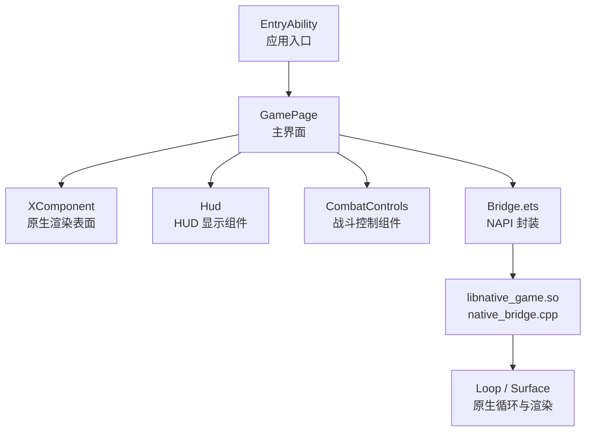
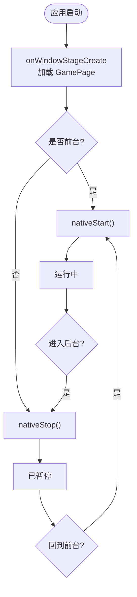
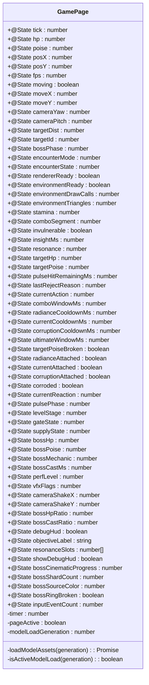
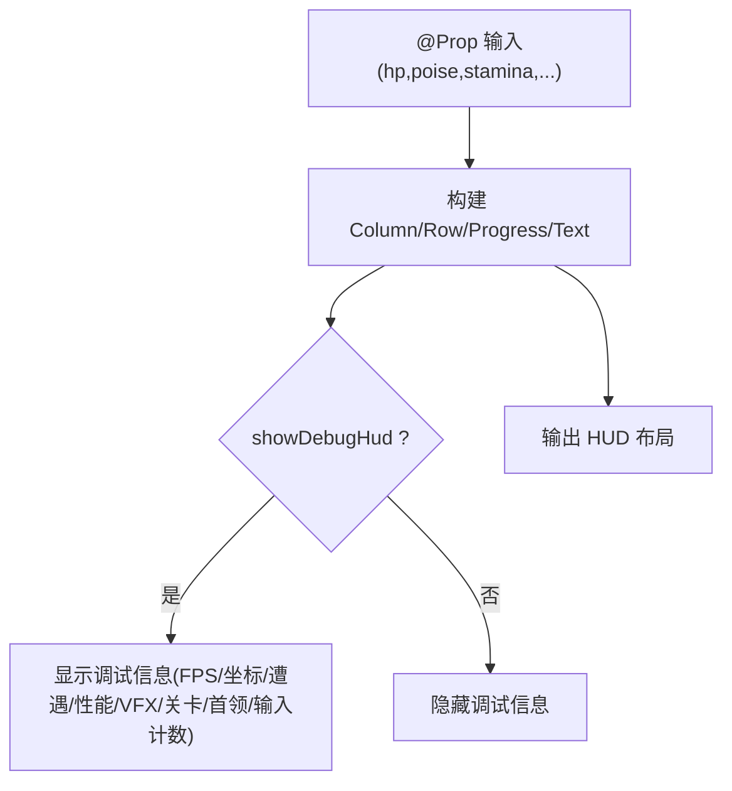
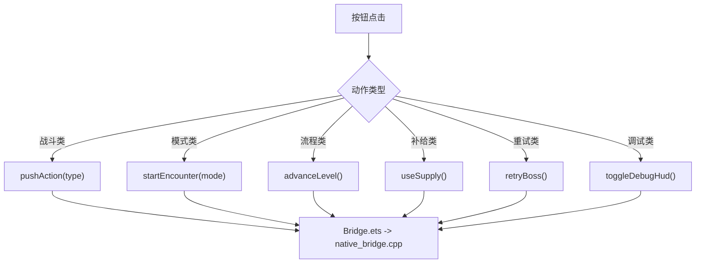
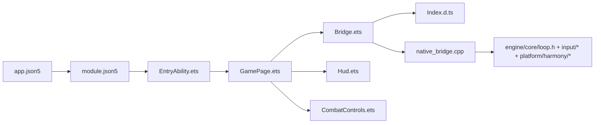

# 前端界面系统

<cite>
**本文引用的文件**   
- [EntryAbility.ets](file://entry/src/main/ets/EntryAbility.ets)
- [GamePage.ets](file://entry/src/main/ets/pages/GamePage.ets)
- [Bridge.ets](file://entry/src/main/ets/napi/Bridge.ets)
- [Hud.ets](file://entry/src/main/ets/ui/Hud.ets)
- [CombatControls.ets](file://entry/src/main/ets/ui/CombatControls.ets)
- [native_bridge.cpp](file://entry/src/main/cpp/native_bridge.cpp)
- [Index.d.ts](file://entry/src/main/cpp/types/libnative_game/Index.d.ts)
- [module.json5](file://entry/src/main/module.json5)
- [app.json5](file://AppScope/app.json5)
</cite>

## 目录
1. [简介](#简介)
2. [项目结构](#项目结构)
3. [核心组件](#核心组件)
4. [架构总览](#架构总览)
5. [详细组件分析](#详细组件分析)
6. [依赖关系分析](#依赖关系分析)
7. [性能与优化](#性能与优化)
8. [故障排查指南](#故障排查指南)
9. [结论](#结论)
10. [附录：UI 开发示例与最佳实践](#附录ui-开发示例与最佳实践)

## 简介
本文件面向 my-world 的前端界面系统，聚焦 ArkUI 界面架构、应用入口 EntryAbility、主界面 GamePage、NAPI 桥接机制（Bridge.ets 与 native_bridge.cpp）、以及 UI 组件 Hud 与 CombatControls。文档将详细说明状态管理方案、数据绑定机制、前后端数据同步、事件传递路径、响应式设计与移动端适配策略，并给出可复用的组件模式、调试技巧与性能优化建议。

## 项目结构
- 应用入口与页面
  - EntryAbility：应用生命周期入口，负责加载 GamePage 并在前台/后台时启动/停止原生循环。
  - GamePage：主界面，使用 XComponent 承载原生渲染表面，轮询快照驱动 UI 更新，并挂载 HUD 与控制面板。
- NAPI 桥接
  - Bridge.ets：ArkTS 侧对 libnative_game.so 的函数声明与导出封装。
  - Index.d.ts：C++ 暴露给 JS 的类型声明，保证 TS 类型安全。
  - native_bridge.cpp：C++ 实现 N-API 接口，注册 XComponent 回调，处理输入、资源提交、游戏循环控制与快照拉取。
- UI 组件
  - Hud：只读展示层，接收大量 @Prop 属性，呈现血条、耐力、连击、Boss 进度等。
  - CombatControls：右下角操作区，通过 pushAction/startEncounter/advanceLevel/useSupply/retryBoss/toggleDebugHud 等调用触发后端逻辑。
- 配置
  - module.json5：模块与 Ability 定义，指定入口与权限。
  - app.json5：应用包名、版本、API 级别等。



**图表来源** 
- [EntryAbility.ets:1-44](file://entry/src/main/ets/EntryAbility.ets#L1-L44)
- [GamePage.ets:154-217](file://entry/src/main/ets/pages/GamePage.ets#L154-L217)
- [Bridge.ets:77-94](file://entry/src/main/ets/napi/Bridge.ets#L77-L94)
- [native_bridge.cpp:518-561](file://entry/src/main/cpp/native_bridge.cpp#L518-L561)

**章节来源**
- [EntryAbility.ets:1-44](file://entry/src/main/ets/EntryAbility.ets#L1-L44)
- [GamePage.ets:1-305](file://entry/src/main/ets/pages/GamePage.ets#L1-L305)
- [Bridge.ets:1-94](file://entry/src/main/ets/napi/Bridge.ets#L1-L94)
- [native_bridge.cpp:1-577](file://entry/src/main/cpp/native_bridge.cpp#L1-L577)
- [module.json5:1-43](file://entry/src/main/module.json5#L1-L43)
- [app.json5:1-13](file://AppScope/app.json5#L1-L13)

## 核心组件
- EntryAbility
  - 职责：创建窗口阶段、加载 GamePage；在前台/后台切换时调用 nativeStart/nativeStop。
  - 关键点：onForeground/onBackground 中直接调用 NAPI 控制原生循环。
- GamePage
  - 职责：初始化模型与环境资源、启动原生渲染、定时拉取 Snapshot 并映射到 @State 字段驱动 UI。
  - 关键点：使用 setInterval 每 100ms 拉取快照；使用 generation 防止异步资源加载竞态；XComponent.onDestroy 中调用 nativeStop。
- Bridge.ets
  - 职责：统一导出 NAPI 方法，定义 InputEvent 与 Snapshot 类型，供 Page 与 UI 组件调用。
- Hud
  - 职责：纯展示组件，接收大量 @Prop，渲染进度条、文本、调试信息等。
- CombatControls
  - 职责：提供按钮触发 pushAction/startEncounter/advanceLevel/useSupply/retryBoss/toggleDebugHud 等动作。

**章节来源**
- [EntryAbility.ets:14-37](file://entry/src/main/ets/EntryAbility.ets#L14-L37)
- [GamePage.ets:99-152](file://entry/src/main/ets/pages/GamePage.ets#L99-L152)
- [GamePage.ets:219-303](file://entry/src/main/ets/pages/GamePage.ets#L219-L303)
- [Bridge.ets:10-94](file://entry/src/main/ets/napi/Bridge.ets#L10-L94)
- [Hud.ets:1-145](file://entry/src/main/ets/ui/Hud.ets#L1-L145)
- [CombatControls.ets:1-42](file://entry/src/main/ets/ui/CombatControls.ets#L1-L42)

## 架构总览
整体采用“ArkUI + XComponent + NAPI”的分层架构：
- ArkUI 层：EntryAbility -> GamePage -> (Hud, CombatControls)
- 渲染层：XComponent 绑定原生 surface，由 native_bridge.cpp 注册回调，驱动 Loop/Surface 渲染
- 桥接层：Bridge.ets 暴露 NAPI 方法，C++ 侧 native_bridge.cpp 实现具体逻辑
- 数据流：C++ 周期性生成 Snapshot，ArkTS 定时 pullSnapshot 并映射到 @State，触发 UI 重绘

```mermaid
sequenceDiagram
participant UI as "ArkUI(GamePage)"
participant XComp as "XComponent"
participant NAPI as "Bridge.ets"
participant Native as "native_bridge.cpp"
participant Loop as "Loop/Surface"
UI->>XComp : 创建 surface(libraryname='native_game')
XComp-->>Native : OnSurfaceCreated/Changed
Native->>Loop : surface_init/resize
UI->>NAPI : setInterval(pullSnapshot)
NAPI->>Native : pullSnapshot()
Native->>Loop : snapshot()
Loop-->>Native : GameSnapshot
Native-->>NAPI : JS 对象
NAPI-->>UI : Snapshot
UI->>UI : 赋值 @State 字段 -> 触发重绘
UI->>NAPI : pushAction/startEncounter/...
NAPI->>Native : 对应 N-API 方法
Native->>Loop : enqueueInput/startEncounter/...
```

**图表来源** 
- [GamePage.ets:154-217](file://entry/src/main/ets/pages/GamePage.ets#L154-L217)
- [Bridge.ets:77-94](file://entry/src/main/ets/napi/Bridge.ets#L77-L94)
- [native_bridge.cpp:518-561](file://entry/src/main/cpp/native_bridge.cpp#L518-L561)
- [native_bridge.cpp:360-516](file://entry/src/main/cpp/native_bridge.cpp#L360-L516)

## 详细组件分析

### EntryAbility 应用入口
- 生命周期
  - onCreate/onDestroy：日志记录
  - onWindowStageCreate：加载 pages/GamePage
  - onForeground/onBackground：调用 nativeStart/nativeStop 控制原生循环
- 设计要点
  - 仅做入口与生命周期桥接，不持有业务状态
  - 确保前台恢复、后台暂停与 XComponent 生命周期一致



**图表来源** 
- [EntryAbility.ets:14-37](file://entry/src/main/ets/EntryAbility.ets#L14-L37)

**章节来源**
- [EntryAbility.ets:1-44](file://entry/src/main/ets/EntryAbility.ets#L1-L44)

### GamePage 主界面与状态管理
- 资源加载
  - loadModelAssets：并发读取 rawfile 中的 glb 模型与环境资源，提交至 nativeSetModelAssets/nativeSetEnvironmentAssets，失败回退到程序化网格
  - 使用 generation 标记避免旧异步任务覆盖新状态
- 渲染与交互
  - XComponent：width/height 100%，背景色深色系，onDestroy 调用 nativeStop
  - 定时器：setInterval 每 100ms 拉取 Snapshot，逐一赋值 @State 字段，触发 UI 更新
- 错误与健壮性
  - try/catch 捕获资源加载异常，记录日志并回退
  - isActiveModelLoad(generation) 保证只有当前页有效且最新代次的加载结果生效



**图表来源** 
- [GamePage.ets:9-94](file://entry/src/main/ets/pages/GamePage.ets#L9-L94)
- [GamePage.ets:99-152](file://entry/src/main/ets/pages/GamePage.ets#L99-L152)
- [GamePage.ets:219-303](file://entry/src/main/ets/pages/GamePage.ets#L219-L303)

**章节来源**
- [GamePage.ets:1-305](file://entry/src/main/ets/pages/GamePage.ets#L1-L305)

### NAPI 桥接机制（Bridge.ets 与 native_bridge.cpp）
- Bridge.ets
  - 导出 nativeStart/nativeStop/nativeStartIfForeground
  - 导出资源提交：nativeSetModelAssets/nativeSetEnvironmentAssets
  - 导出输入与玩法控制：pushInput/pushAction/startEncounter/advanceLevel/useSupply/retryBoss/toggleDebugHud/skipDemoPhase
  - 导出快照拉取：pullSnapshot，返回 Snapshot 接口
- native_bridge.cpp
  - 注册 XComponent 回调：OnSurfaceCreated/Changed/Destroyed、DispatchTouchEvent
  - 输入处理：OnDispatchTouchEvent 解析触摸事件，转发为 ChangedPointer，入队 Loop
  - 资源提交：CopyAndCommitModelAssets/CopyAndCommitEnvironmentAssets 原子批量提交
  - 快照构建：NativePullSnapshot 将 GameSnapshot 转为 JS 对象，包含全部字段
  - 生命周期：g_foregroundRequested 控制前台请求，start/stop/startIfForeground 组合保证安全

```mermaid
sequenceDiagram
participant UI as "ArkTS(Bridge.ets)"
participant NAPI as "native_bridge.cpp"
participant Loop as "Loop"
UI->>NAPI : pushAction(type)
NAPI->>NAPI : 校验参数(整数0..5)
NAPI->>Loop : enqueueInput(InputAction, -1, 0, 0)
UI->>NAPI : startEncounter(mode)
NAPI->>NAPI : 校验参数(整数0..5)
NAPI->>Loop : startEncounter(mode)
UI->>NAPI : pullSnapshot()
NAPI->>Loop : snapshot()
Loop-->>NAPI : GameSnapshot
NAPI-->>UI : JS 对象(Snapshot)
```

**图表来源** 
- [Bridge.ets:77-94](file://entry/src/main/ets/napi/Bridge.ets#L77-L94)
- [native_bridge.cpp:252-324](file://entry/src/main/cpp/native_bridge.cpp#L252-L324)
- [native_bridge.cpp:360-516](file://entry/src/main/cpp/native_bridge.cpp#L360-L516)

**章节来源**
- [Bridge.ets:1-94](file://entry/src/main/ets/napi/Bridge.ets#L1-L94)
- [native_bridge.cpp:1-577](file://entry/src/main/cpp/native_bridge.cpp#L1-L577)
- [Index.d.ts:1-81](file://entry/src/main/cpp/types/libnative_game/Index.d.ts#L1-L81)

### Hud 用户界面显示
- 设计原则
  - 纯展示组件，所有数据通过 @Prop 传入，内部无副作用
  - 使用 Progress 组件绘制 HP/Poise/Stamina/Boss 进度条
  - 支持调试信息开关 showDebugHud，按需显示 FPS、坐标、遭遇模式、性能等级、VFX 标志等
- 关键特性
  - 精准窗口高亮：当 pulseHitRemainingMs 在 100..500ms 区间内时以红色提示
  - 三槽共鸣指示：resonanceSlots[0..2] 非零时高亮对应文字颜色
  - Boss 阶段与读条：bossPhase/bossMechanic/bossCastMs 等信息展示



**图表来源** 
- [Hud.ets:1-145](file://entry/src/main/ets/ui/Hud.ets#L1-L145)

**章节来源**
- [Hud.ets:1-145](file://entry/src/main/ets/ui/Hud.ets#L1-L145)

### CombatControls 战斗控制组件
- 功能
  - 训练/兽群/混战/守卫/流程/首领：startEncounter(mode)
  - 推进/补给/重试：advanceLevel()/useSupply()/retryBoss()
  - 调试：toggleDebugHud()
  - 普攻/闪避/辉印/脉流/蚀质/终结：pushAction(type)
- 交互
  - 按钮点击直接调用 Bridge.ets 导出的 NAPI 方法，无中间状态
  - hitTestBehavior=Transparent 避免遮挡下层 XComponent



**图表来源** 
- [CombatControls.ets:1-42](file://entry/src/main/ets/ui/CombatControls.ets#L1-L42)
- [Bridge.ets:77-94](file://entry/src/main/ets/napi/Bridge.ets#L77-L94)

**章节来源**
- [CombatControls.ets:1-42](file://entry/src/main/ets/ui/CombatControls.ets#L1-L42)

## 依赖关系分析
- 模块与入口
  - module.json5 指定 entry 模块与 EntryAbility 入口
  - app.json5 定义 bundleName、版本与 API 级别
- 组件耦合
  - GamePage 依赖 Bridge.ets 进行 NAPI 调用，依赖 Hud/CombatControls 作为子组件
  - Bridge.ets 依赖 libnative_game.so，类型由 Index.d.ts 约束
  - native_bridge.cpp 依赖 engine/core/loop.h、input/*、platform/harmony/* 等原生子系统



**图表来源** 
- [app.json5:1-13](file://AppScope/app.json5#L1-L13)
- [module.json5:1-43](file://entry/src/main/module.json5#L1-L43)
- [EntryAbility.ets:1-44](file://entry/src/main/ets/EntryAbility.ets#L1-L44)
- [GamePage.ets:1-305](file://entry/src/main/ets/pages/GamePage.ets#L1-L305)
- [Bridge.ets:1-94](file://entry/src/main/ets/napi/Bridge.ets#L1-L94)
- [Index.d.ts:1-81](file://entry/src/main/cpp/types/libnative_game/Index.d.ts#L1-L81)
- [native_bridge.cpp:1-577](file://entry/src/main/cpp/native_bridge.cpp#L1-L577)

**章节来源**
- [module.json5:1-43](file://entry/src/main/module.json5#L1-L43)
- [app.json5:1-13](file://AppScope/app.json5#L1-L13)

## 性能与优化
- 渲染与刷新
  - GamePage 使用 setInterval 100ms 拉取快照，避免每帧频繁跨语言调用；@State 字段粒度合理，减少不必要的重绘
  - XComponent 全屏渲染，背景色固定，降低 UI 层开销
- 资源加载
  - 并发读取多个 glb，Promise.all 提升加载速度；失败回退到程序化网格，保证可用性
  - generation 机制避免旧异步任务覆盖新状态，防止重复提交
- 输入与事件
  - 触摸事件由 native_bridge.cpp 统一处理，避免 ArkTS 侧重复注册 onTouch，减少桥接开销
  - pushAction/pushInput 参数严格校验，减少无效调用
- 调试与监控
  - debugHud/showDebugHud 控制调试信息可见性，生产环境默认关闭
  - perfLevel/vfxFlags/inputEventCount 便于定位性能瓶颈与输入问题

[本节为通用指导，无需特定文件引用]

## 故障排查指南
- 无法加载模型或环境资源
  - 检查 rawfile 路径与文件名是否正确；查看控制台错误日志；确认 nativeSetModelAssets/nativeSetEnvironmentAssets 返回值
- 原生循环未启动或崩溃
  - 确认 EntryAbility.onForeground 调用了 nativeStart；XComponent.onDestroy 会调用 nativeStop
  - 检查 OnSurfaceCreated/Changed 是否成功初始化 surface
- 输入无响应
  - 确认 DispatchTouchEvent 已注册；检查 pushInput/pushAction 的参数类型与范围
- HUD 不更新
  - 确认 setInterval 仍在运行；检查 pullSnapshot 返回字段是否与 @State 字段一一对应
- 调试信息缺失
  - 确认 toggleDebugHud 被调用；showDebugHud 与 debugHud 字段正确设置

**章节来源**
- [native_bridge.cpp:59-111](file://entry/src/main/cpp/native_bridge.cpp#L59-L111)
- [native_bridge.cpp:212-250](file://entry/src/main/cpp/native_bridge.cpp#L212-L250)
- [GamePage.ets:219-303](file://entry/src/main/ets/pages/GamePage.ets#L219-L303)

## 结论
my-world 的前端界面系统基于 ArkUI + XComponent + NAPI 分层架构，实现了清晰的生命周期管理、稳定的资源加载与回退机制、高效的快照驱动 UI 更新与安全的输入处理。Hud 与 CombatControls 组件职责单一、复用性强，配合 Bridge.ets 与 native_bridge.cpp 形成完整的桥接链路。通过合理的状态管理与性能优化策略，系统在移动端具备良好的可用性与扩展性。

[本节为总结，无需特定文件引用]

## 附录：UI 开发示例与最佳实践
- 组件复用模式
  - 只读展示组件：如 Hud，仅通过 @Prop 接收数据，内部无副作用，便于在不同页面复用
  - 行为组件：如 CombatControls，集中处理用户输入，直接调用 Bridge.ets 暴露的方法
- 数据绑定与更新策略
  - 使用 @State 字段驱动 UI，避免手动 DOM 操作；通过 Snapshot 一次性赋值，减少多次重绘
  - 使用 generation 标记保护异步任务，避免竞态条件
- 响应式设计与移动端适配
  - XComponent 全屏渲染，HUD 与控件使用相对布局与透明命中测试，避免遮挡
  - 按钮尺寸与间距适合手指触控，右下角对齐便于右手操作
- 调试技巧
  - 开启 toggleDebugHud 查看 FPS、坐标、遭遇模式、性能等级、VFX 标志、输入计数等
  - 利用控制台日志定位资源加载失败与 NAPI 调用异常

[本节为通用指导，无需特定文件引用]