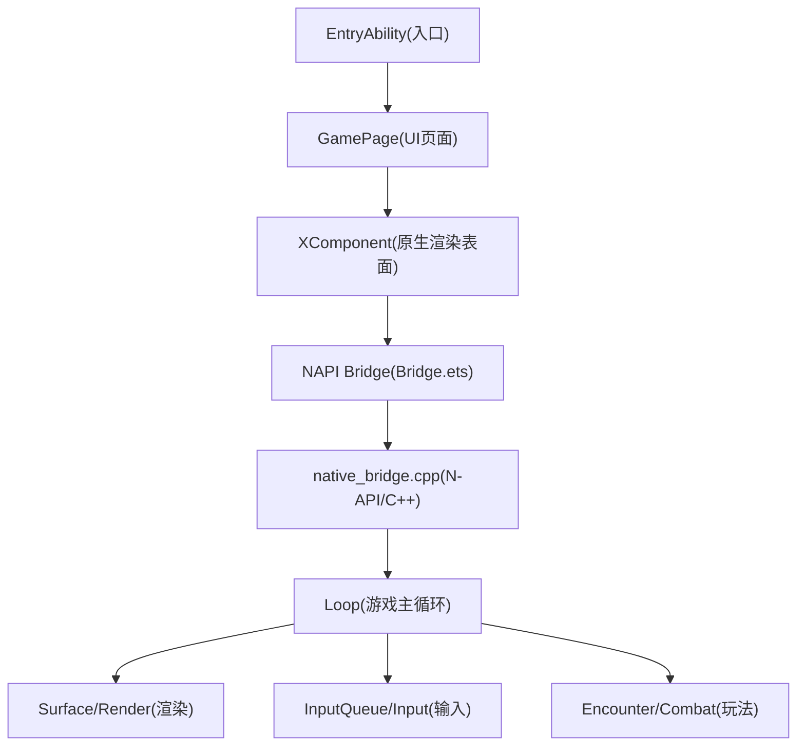
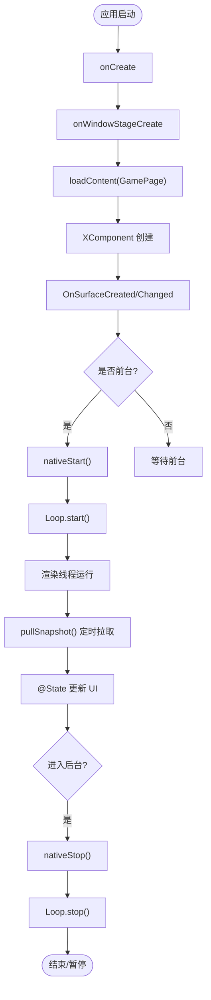
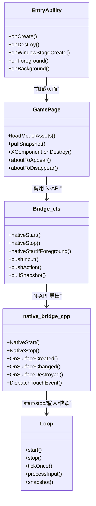

# 应用入口与生命周期

<cite>
**本文引用的文件**   
- [EntryAbility.ets](file://entry/src/main/ets/EntryAbility.ets)
- [Bridge.ets](file://entry/src/main/ets/napi/Bridge.ets)
- [native_bridge.cpp](file://entry/src/main/cpp/native_bridge.cpp)
- [GamePage.ets](file://entry/src/main/ets/pages/GamePage.ets)
- [loop.h](file://native/engine/core/loop.h)
- [loop.cpp](file://native/engine/core/loop.cpp)
- [lifecycle_state.h](file://native/engine/core/lifecycle_state.h)
- [module.json5](file://entry/src/main/module.json5)
- [app.json5](file://AppScope/app.json5)
</cite>

## 目录
1. [简介](#简介)
2. [项目结构](#项目结构)
3. [核心组件](#核心组件)
4. [架构总览](#架构总览)
5. [详细组件分析](#详细组件分析)
6. [依赖关系分析](#依赖关系分析)
7. [性能考量](#性能考量)
8. [故障排查指南](#故障排查指南)
9. [结论](#结论)
10. [附录](#附录)

## 简介
本文件围绕 my-world 的 ArkUI 应用入口 EntryAbility，系统阐述 UIAbility 生命周期管理、窗口阶段管理与前后台切换处理，并深入解释 nativeStart/nativeStop 调用时机以及与游戏引擎循环的生命周期同步机制。文档同时给出资源初始化流程、调试技巧与常见问题解决方案，帮助开发者快速定位问题并优化启动与渲染体验。

## 项目结构
my-world 采用“ArkUI + NAPI + C++ 游戏引擎”的分层架构：
- ArkUI 层：EntryAbility 作为应用入口，加载 GamePage；GamePage 通过 XComponent 承载原生渲染表面。
- NAPI 桥接层：Bridge.ets 暴露 native 方法供 ArkTS 调用；native_bridge.cpp 实现 N-API 导出与 XComponent 回调注册。
- 引擎层：Loop 为核心运行循环，负责输入、逻辑更新、渲染与状态快照发布。



图表来源
- [EntryAbility.ets:1-44](file://entry/src/main/ets/EntryAbility.ets#L1-L44)
- [GamePage.ets:154-166](file://entry/src/main/ets/pages/GamePage.ets#L154-L166)
- [Bridge.ets:77-94](file://entry/src/main/ets/napi/Bridge.ets#L77-L94)
- [native_bridge.cpp:518-561](file://entry/src/main/cpp/native_bridge.cpp#L518-L561)
- [loop.h:26-104](file://native/engine/core/loop.h#L26-L104)

章节来源
- [module.json5:1-43](file://entry/src/main/module.json5#L1-L43)
- [app.json5:1-13](file://AppScope/app.json5#L1-L13)

## 核心组件
- EntryAbility：应用入口，定义 onCreate/onDestroy/onWindowStageCreate/onForeground/onBackground 等生命周期钩子，负责加载页面与前后端生命周期同步。
- GamePage：ArkUI 页面，使用 XComponent 承载原生渲染，异步加载模型与环境资源，定时拉取引擎快照驱动 UI。
- Bridge.ets：N-API 接口封装，将 nativeStart/nativeStop/pullSnapshot 等方法暴露给 ArkTS。
- native_bridge.cpp：N-API 模块实现，注册 XComponent 回调（OnSurfaceCreated/Changed/Destroyed），提供 start/stop/输入推送/快照读取等能力。
- Loop：C++ 游戏主循环，维护运行状态、线程、输入队列、渲染与逻辑更新、性能监控与快照发布。

章节来源
- [EntryAbility.ets:1-44](file://entry/src/main/ets/EntryAbility.ets#L1-L44)
- [GamePage.ets:1-305](file://entry/src/main/ets/pages/GamePage.ets#L1-L305)
- [Bridge.ets:1-94](file://entry/src/main/ets/napi/Bridge.ets#L1-L94)
- [native_bridge.cpp:1-577](file://entry/src/main/cpp/native_bridge.cpp#L1-L577)
- [loop.h:26-104](file://native/engine/core/loop.h#L26-L104)
- [loop.cpp:131-203](file://native/engine/core/loop.cpp#L131-L203)

## 架构总览
下图展示从应用启动到渲染运行的关键路径，以及前后台切换时的生命周期同步。

```mermaid
sequenceDiagram
participant OS as "系统"
participant Ability as "EntryAbility"
participant Page as "GamePage"
participant XComp as "XComponent"
participant NAPI as "native_bridge.cpp"
participant Loop as "Loop"
OS->>Ability : 创建进程并调用 onCreate
Ability->>Ability : onWindowStageCreate
Ability->>Page : loadContent("pages/GamePage")
Page->>XComp : 创建 XComponent(surface)
XComp-->>NAPI : OnSurfaceCreated/Changed
Note over NAPI,Loop : surface_init / resize<br/>必要时 g_loop.start()
Ability->>Ability : onForeground
Ability->>NAPI : nativeStart()
NAPI->>Loop : start()
Loop-->>Loop : 启动渲染线程/固定步长更新
Page->>NAPI : pullSnapshot() 定时轮询
NAPI-->>Page : 返回快照对象
Page-->>Page : 更新 @State 驱动 UI
OS->>Ability : 进入后台
Ability->>Ability : onBackground
Ability->>NAPI : nativeStop()
NAPI->>Loop : stop()
Loop-->>Loop : 停止线程/清理状态并发布暂停快照
```

图表来源
- [EntryAbility.ets:6-37](file://entry/src/main/ets/EntryAbility.ets#L6-L37)
- [GamePage.ets:154-166](file://entry/src/main/ets/pages/GamePage.ets#L154-L166)
- [native_bridge.cpp:59-111](file://entry/src/main/cpp/native_bridge.cpp#L59-L111)
- [native_bridge.cpp:130-140](file://entry/src/main/cpp/native_bridge.cpp#L130-L140)
- [loop.cpp:131-203](file://native/engine/core/loop.cpp#L131-L203)

## 详细组件分析

### EntryAbility 生命周期与窗口阶段管理
- onCreate：应用首次创建时触发，适合做全局初始化（本项目仅记录日志）。
- onDestroy：应用销毁时触发，用于释放资源（本项目仅记录日志）。
- onWindowStageCreate：窗口阶段创建后加载 GamePage，确保 XComponent 在页面内正确初始化。
- onForeground：应用回到前台时调用 nativeStart，通知引擎恢复运行。
- onBackground：应用进入后台时调用 nativeStop，通知引擎暂停运行。
- onWindowStageDestroy：窗口销毁时清理（本项目仅记录日志）。

最佳实践
- 在前台回调中统一启动引擎，避免重复启动；在后台回调中统一停止引擎，避免后台继续消耗资源。
- 页面级生命周期（aboutToAppear/aboutToDisappear）与引擎生命周期解耦，由 GamePage 控制资源加载与定时器。

章节来源
- [EntryAbility.ets:6-37](file://entry/src/main/ets/EntryAbility.ets#L6-L37)
- [module.json5:14-34](file://entry/src/main/module.json5#L14-L34)

### GamePage 资源初始化与渲染绑定
- 使用 XComponent 指定 libraryname 为 native_game，建立 ArkUI 与原生渲染表面的绑定。
- 异步加载模型与环境资源，成功后通过 nativeSetModelAssets/nativeSetEnvironmentAssets 提交至引擎。
- 资源加载完成后调用 nativeStartIfForeground，仅在仍处于前台时启动引擎，避免后台启动。
- 每 100ms 调用 pullSnapshot 获取引擎快照，映射到 @State 驱动 UI 更新。
- aboutToDisappear 中清理定时器并调用 nativeStop，保证页面退出时引擎停止。

注意
- 若图形环境不支持 GLES，显示错误提示并安全停止渲染。
- 资源加载失败时使用回退网格或程序化场景，保证可运行性。

章节来源
- [GamePage.ets:154-166](file://entry/src/main/ets/pages/GamePage.ets#L154-L166)
- [GamePage.ets:103-152](file://entry/src/main/ets/pages/GamePage.ets#L103-L152)
- [GamePage.ets:219-303](file://entry/src/main/ets/pages/GamePage.ets#L219-L303)

### NAPI 桥接与原生回调
- Bridge.ets 暴露 nativeStart/nativeStop/nativeStartIfForeground/pullSnapshot 等方法。
- native_bridge.cpp 注册 N-API 模块，导出上述方法，并在 Init 中注册 XComponent 回调：
  - OnSurfaceCreated：初始化 surface，必要时启动 Loop。
  - OnSurfaceChanged：resize 或重新初始化 surface，必要时启动 Loop。
  - OnSurfaceDestroyed：停止 Loop 并失效快照。
  - DispatchTouchEvent：将触摸事件转发到输入队列。

章节来源
- [Bridge.ets:77-94](file://entry/src/main/ets/napi/Bridge.ets#L77-L94)
- [native_bridge.cpp:518-561](file://entry/src/main/cpp/native_bridge.cpp#L518-L561)
- [native_bridge.cpp:59-111](file://entry/src/main/cpp/native_bridge.cpp#L59-L111)

### 游戏引擎循环 Loop 与生命周期同步
- Loop::start：检查 surface.ready，若未就绪则重置状态并跳过；否则通过 LifecycleState.start 保护启动逻辑，创建渲染线程，固定步长更新，约 60fps。
- Loop::stop：设置 shouldStop 并 join 线程，重置输入、战斗、音频与状态，发布暂停快照。
- withLifecycle：所有跨生命周期操作均通过 LifecycleState.synchronized 保护，避免并发冲突。
- publishRendererStopped：当渲染不可用时，重置状态并发布 rendererReady=false 的快照。

章节来源
- [loop.h:26-104](file://native/engine/core/loop.h#L26-L104)
- [loop.cpp:131-203](file://native/engine/core/loop.cpp#L131-L203)
- [lifecycle_state.h:6-37](file://native/engine/core/lifecycle_state.h#L6-L37)

### 前后台切换时序与 nativeStart/nativeStop 调用时机
- 应用进入前台：EntryAbility.onForeground → nativeStart → Loop.start。
- 应用进入后台：EntryAbility.onBackground → nativeStop → Loop.stop。
- 页面级 XComponent 销毁：GamePage.XComponent.onDestroy → nativeStop。
- 页面离开：GamePage.aboutToDisappear → nativeStop。



图表来源
- [EntryAbility.ets:29-37](file://entry/src/main/ets/EntryAbility.ets#L29-L37)
- [native_bridge.cpp:130-140](file://entry/src/main/cpp/native_bridge.cpp#L130-L140)
- [loop.cpp:131-203](file://native/engine/core/loop.cpp#L131-L203)

### 输入事件与交互链路
- 触摸事件通过 OH_NativeXComponent 回调分发，转换为 InputAction 并入队。
- Loop.processInput 消费输入队列，分派到摇杆、相机手势与战斗动作。
- GamePage 可通过 pushInput/pushAction 主动注入输入事件。

章节来源
- [native_bridge.cpp:113-128](file://entry/src/main/cpp/native_bridge.cpp#L113-L128)
- [loop.cpp:240-292](file://native/engine/core/loop.cpp#L240-L292)
- [Bridge.ets:85-87](file://entry/src/main/ets/napi/Bridge.ets#L85-L87)

### 资源提交与回退策略
- 模型与环境资源以 ArrayBuffer 形式提交，失败时打印错误并使用回退网格或程序化场景。
- 资源加载完成后调用 nativeStartIfForeground，确保仅在处于前台时启动引擎。

章节来源
- [GamePage.ets:103-152](file://entry/src/main/ets/pages/GamePage.ets#L103-L152)
- [native_bridge.cpp:151-210](file://entry/src/main/cpp/native_bridge.cpp#L151-L210)

## 依赖关系分析
- EntryAbility 依赖 UIAbilityKit 与 ArkUI window，加载 GamePage。
- GamePage 依赖 Bridge.ets 暴露的 N-API 方法，并通过 XComponent 绑定 native_game.so。
- native_bridge.cpp 依赖 engine/core/loop 与平台相关头文件，注册 XComponent 回调。
- Loop 依赖 render/surface、input/*、gameplay/* 等子系统，统一管理运行状态与快照。



图表来源
- [EntryAbility.ets:1-44](file://entry/src/main/ets/EntryAbility.ets#L1-L44)
- [GamePage.ets:1-305](file://entry/src/main/ets/pages/GamePage.ets#L1-L305)
- [Bridge.ets:1-94](file://entry/src/main/ets/napi/Bridge.ets#L1-L94)
- [native_bridge.cpp:518-561](file://entry/src/main/cpp/native_bridge.cpp#L518-L561)
- [loop.h:26-104](file://native/engine/core/loop.h#L26-L104)

章节来源
- [module.json5:14-34](file://entry/src/main/module.json5#L14-L34)
- [app.json5:1-13](file://AppScope/app.json5#L1-L13)

## 性能考量
- 固定步长更新：Loop 使用 FixedStep 保证逻辑稳定，渲染线程约 60fps。
- 性能监控：PerformanceGuard 采样 FPS 与渲染指标，定期输出日志。
- 资源加载：异步并行加载模型与环境资源，减少首帧延迟。
- 前后台切换：后台立即停止渲染线程，降低功耗与内存占用。

建议
- 避免在主循环中进行阻塞 IO，所有耗时操作应异步执行。
- 合理设置快照拉取频率（当前 100ms），平衡 UI 刷新与性能。
- 对大资源进行分包与按需加载，提升冷启动速度。

[本节为通用指导，不直接分析具体文件]

## 故障排查指南
常见问题与解决思路
- 无法启动渲染：检查 OnSurfaceCreated/Changed 是否成功初始化 surface；确认 surface.ready 为真后再启动 Loop。
- 前台无响应：确认 EntryAbility.onForeground 调用了 nativeStart；检查 Loop.start 是否被重复调用或被提前阻止。
- 后台仍运行：确认 EntryAbility.onBackground 与 GamePage.aboutToDisappear/XComponent.onDestroy 都调用了 nativeStop。
- 资源加载失败：查看错误日志，确认资源路径与权限；启用回退网格保证可运行。
- 输入无效：检查 DispatchTouchEvent 是否正确转换输入类型与坐标；确认 input.push 接受事件。
- 快照为空或字段异常：确认 pullSnapshot 返回值结构与 GamePage 映射一致；关注 rendererReady/environmentReady 标志位。

调试技巧
- 使用 OH_LOG_Print 输出关键路径日志（如 surface_init、start/stop、touch 事件）。
- 在 Loop.tickOnce 中输出 FPS 与渲染指标，观察性能波动。
- 在 GamePage 中增加断点与日志，跟踪资源加载与快照更新流程。

章节来源
- [native_bridge.cpp:59-111](file://entry/src/main/cpp/native_bridge.cpp#L59-L111)
- [loop.cpp:332-354](file://native/engine/core/loop.cpp#L332-L354)
- [GamePage.ets:103-152](file://entry/src/main/ets/pages/GamePage.ets#L103-L152)

## 结论
EntryAbility 作为 my-world 的应用入口，通过规范化的生命周期管理与窗口阶段控制，确保了 ArkUI 与原生渲染的正确衔接。结合 GamePage 的资源加载策略与 Bridge/NAPI 的桥接能力，实现了稳定的前后台切换与渲染循环。Loop 的核心职责清晰，配合 LifecycleState 保证了多线程安全与状态一致性。遵循本文的最佳实践与排查指南，可有效提升应用的稳定性与性能。

[本节为总结，不直接分析具体文件]

## 附录
- 配置项说明
  - module.json5：定义 entry 模块、入口 Ability、设备类型与权限请求。
  - app.json5：定义应用包名、版本信息与 API 级别。

章节来源
- [module.json5:1-43](file://entry/src/main/module.json5#L1-L43)
- [app.json5:1-13](file://AppScope/app.json5#L1-L13)