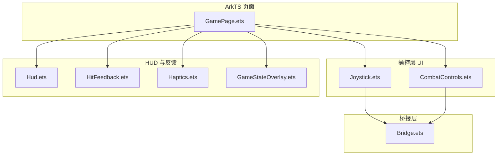
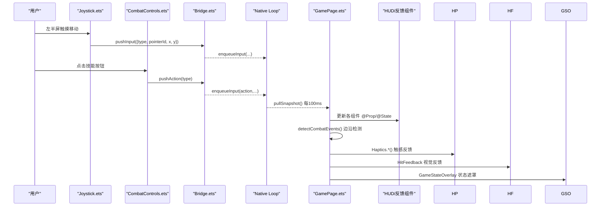
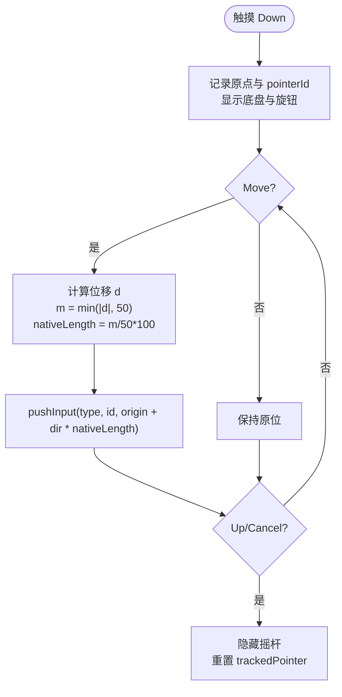
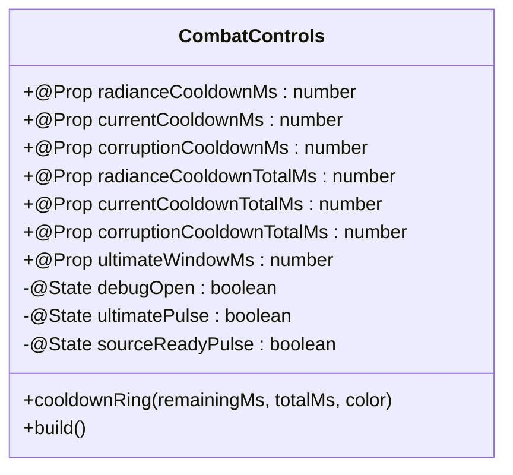
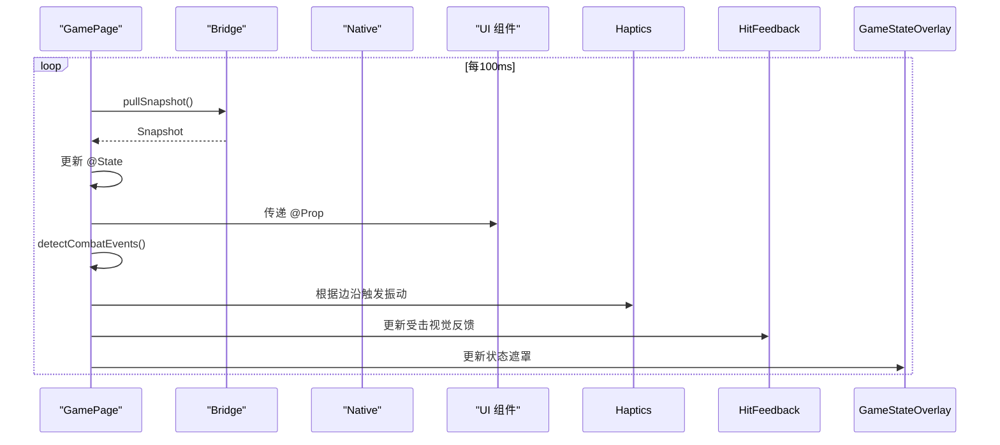
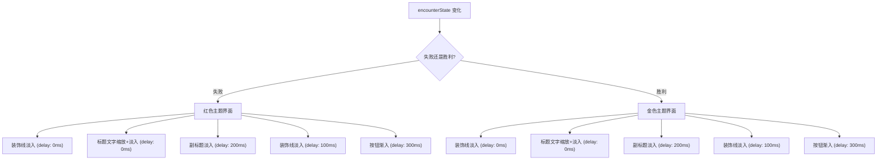
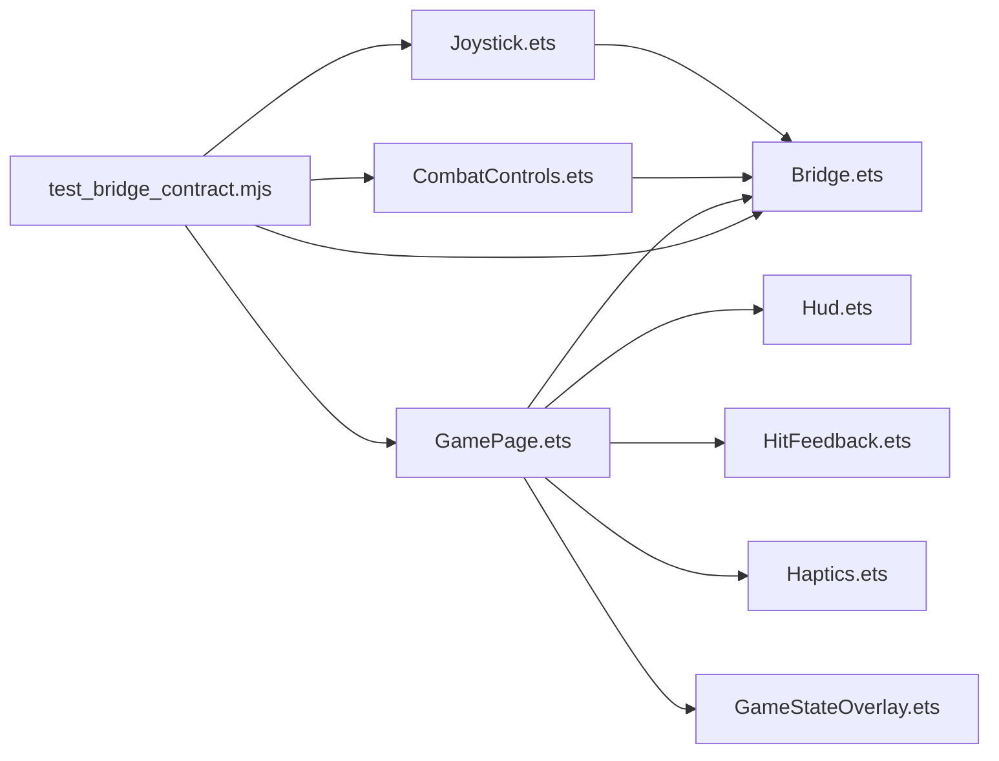

# 战斗视觉反馈系统

<cite>
**本文引用的文件**   
- [entry/src/main/ets/ui/Joystick.ets](file://entry/src/main/ets/ui/Joystick.ets)
- [entry/src/main/ets/ui/CombatControls.ets](file://entry/src/main/ets/ui/CombatControls.ets)
- [entry/src/main/ets/pages/GamePage.ets](file://entry/src/main/ets/pages/GamePage.ets)
- [entry/src/main/ets/napi/Bridge.ets](file://entry/src/main/ets/napi/Bridge.ets)
- [tests/test_bridge_contract.mjs](file://tests/test_bridge_contract.mjs)
- [entry/src/main/ets/ui/Hud.ets](file://entry/src/main/ets/ui/Hud.ets)
- [entry/src/main/ets/ui/Haptics.ets](file://entry/src/main/ets/ui/Haptics.ets)
- [entry/src/main/ets/ui/HitFeedback.ets](file://entry/src/main/ets/ui/HitFeedback.ets)
- [entry/src/main/ets/ui/GameStateOverlay.ets](file://entry/src/main/ets/ui/GameStateOverlay.ets)
</cite>

## 更新摘要
**变更内容**   
- HitFeedback.ets 重大升级：新增 >=15 伤害阈值的白色闪光效果、改进的红色暗角强度缩放算法、更平滑的低血量脉冲动画
- GameStateOverlay.ets 全面视觉升级：带交错延迟的入场动画、装饰线条元素的不透明度动画、与主题颜色匹配的彩色发光文本阴影、按钮渐变背景
- 多个UI组件的动画和视觉效果改进，提升整体打击感和视觉反馈质量

## 目录
1. [简介](#简介)
2. [项目结构](#项目结构)
3. [核心组件](#核心组件)
4. [架构总览](#架构总览)
5. [详细组件分析](#详细组件分析)
6. [依赖关系分析](#依赖关系分析)
7. [性能考量](#性能考量)
8. [故障排查指南](#故障排查指南)
9. [结论](#结论)

## 简介
本文件围绕"战斗视觉反馈系统"的 ArkTS 层实现进行系统化说明，重点覆盖：
- 动态浮出可视化摇杆（Joystick）与触摸路由设计
- 弧形圆形技能按钮（冷却环+终结技高亮+按压反馈）的 CombatControls 重写
- 调试面板收纳为侧拉面板
- 触感反馈（Haptics）与受击视觉反馈（HitFeedback）在 GamePage 中的集成
- 游戏状态遮罩层（GameStateOverlay）的全面视觉升级
- 快照驱动的数据流与 UI 渲染链路

本系统遵循"纯 ArkTS 改造、不动 native 逻辑"的原则，所有输入经现有 pushInput/pushAction 桥接转发至 native。

## 项目结构
- 页面入口与数据轮询：GamePage.ets
- 操控层 UI：Joystick.ets、CombatControls.ets
- HUD 与辅助反馈：Hud.ets、Haptics.ets、HitFeedback.ets
- 游戏状态遮罩：GameStateOverlay.ets
- N-API 桥接口定义：Bridge.ets
- 契约测试：test_bridge_contract.mjs

**图表来源**
- [entry/src/main/ets/pages/GamePage.ets:216-313](file://entry/src/main/ets/pages/GamePage.ets#L216-L313)
- [entry/src/main/ets/ui/Joystick.ets:1-174](file://entry/src/main/ets/ui/Joystick.ets#L1-L174)
- [entry/src/main/ets/ui/CombatControls.ets:1-301](file://entry/src/main/ets/ui/CombatControls.ets#L1-L301)
- [entry/src/main/ets/ui/Hud.ets:1-217](file://entry/src/main/ets/ui/Hud.ets#L1-L217)
- [entry/src/main/ets/ui/Haptics.ets:1-60](file://entry/src/main/ets/ui/Haptics.ets#L1-L60)
- [entry/src/main/ets/ui/HitFeedback.ets:1-94](file://entry/src/main/ets/ui/HitFeedback.ets#L1-L94)
- [entry/src/main/ets/ui/GameStateOverlay.ets:1-177](file://entry/src/main/ets/ui/GameStateOverlay.ets#L1-L177)
- [entry/src/main/ets/napi/Bridge.ets:1-100](file://entry/src/main/ets/napi/Bridge.ets#L1-L100)

## 核心组件
- Joystick：左半屏触摸捕获，按原生 VirtualJoystick 半径换算位移，统一通过 pushInput 转发；空闲提示淡入淡出，按下时显示底盘与旋钮。
- CombatControls：右下角弧形布局的技能按钮区，包含普攻、闪避、终结及三源技能；每个技能叠加冷却环与剩余秒数文本；终结技窗口开启时金色呼吸高亮；右上角菜单圆钮展开/收起调试面板。
- GamePage：XComponent 之上插入 Joystick 层，向 CombatControls 传入冷却与终结窗口 @Prop；每 100ms 拉取快照并分发到各 UI 组件；检测边沿变化触发 Haptics 触感反馈。
- Hud：展示生命、韧性、体力、连击、共鸣槽、目标状态、Boss 信息、关卡门与补给等；支持 debugHud 开关。
- Haptics：封装 vibrator API，提供轻/利落/受击/重振/终结就绪等触感类型，含最小间隔防抖与设置开关。
- **HitFeedback**：**重大升级** - 屏幕边缘红色暗角闪烁，强度随伤害量缩放；>=15 伤害阈值叠加白色闪光冲击效果；低血量 <=30 持续呼吸脉冲，动画更加平滑流畅。
- **GameStateOverlay**：**全面视觉升级** - 遭遇结算界面，失败时提供重试，胜利时提供继续/推进；带交错延迟的入场动画、装饰线条元素的不透明度动画、与主题颜色匹配的彩色发光文本阴影、按钮渐变背景。

**章节来源**
- [entry/src/main/ets/ui/Joystick.ets:1-174](file://entry/src/main/ets/ui/Joystick.ets#L1-L174)
- [entry/src/main/ets/ui/CombatControls.ets:1-301](file://entry/src/main/ets/ui/CombatControls.ets#L1-L301)
- [entry/src/main/ets/pages/GamePage.ets:216-313](file://entry/src/main/ets/pages/GamePage.ets#L216-L313)
- [entry/src/main/ets/ui/Hud.ets:1-217](file://entry/src/main/ets/ui/Hud.ets#L1-L217)
- [entry/src/main/ets/ui/Haptics.ets:1-60](file://entry/src/main/ets/ui/Haptics.ets#L1-L60)
- [entry/src/main/ets/ui/HitFeedback.ets:1-94](file://entry/src/main/ets/ui/HitFeedback.ets#L1-L94)
- [entry/src/main/ets/ui/GameStateOverlay.ets:1-177](file://entry/src/main/ets/ui/GameStateOverlay.ets#L1-L177)

## 架构总览
整体数据流采用"Native 固定步长 + ArkTS 快照轮询"的模式：
- Native 以固定 tick 推进游戏状态，暴露 Snapshot
- ArkTS 每 100ms pullSnapshot，更新 @State 并驱动 UI
- 用户输入经 ArkTS 调用 Bridge 的 pushInput/pushAction，进入 Native Loop 队列处理

**图表来源**
- [entry/src/main/ets/ui/Joystick.ets:24-90](file://entry/src/main/ets/ui/Joystick.ets#L24-L90)
- [entry/src/main/ets/ui/CombatControls.ets:51-175](file://entry/src/main/ets/ui/CombatControls.ets#L51-L175)
- [entry/src/main/ets/napi/Bridge.ets:90-99](file://entry/src/main/ets/napi/Bridge.ets#L90-L99)
- [entry/src/main/ets/pages/GamePage.ets:315-399](file://entry/src/main/ets/pages/GamePage.ets#L315-L399)

## 详细组件分析

### 摇杆组件（Joystick）
- 触摸路由：根 Stack hitTestBehavior(Transparent)，左半宽面板捕获 TouchType.Down/Move/Up/Cancel；右半屏透传相机手势。
- 数值对齐：视觉行程 KNOB_TRAVEL=50vp，换算为 native 半径 100，保证旋钮拉满=满速。
- 事件转发：forward() 将 type、pointerId、x、y 通过 pushInput 下发。
- 视觉：底盘半透明描边圆 + 四向刻度点；旋钮渐变实心圆；空闲提示左下角虚影淡出。

**图表来源**
- [entry/src/main/ets/ui/Joystick.ets:24-90](file://entry/src/main/ets/ui/Joystick.ets#L24-L90)
- [entry/src/main/ets/ui/Joystick.ets:92-173](file://entry/src/main/ets/ui/Joystick.ets#L92-L173)

**章节来源**
- [entry/src/main/ets/ui/Joystick.ets:1-174](file://entry/src/main/ets/ui/Joystick.ets#L1-L174)

### 技能控制（CombatControls）
- 弧形布局：普攻主按钮贴底角，闪避左侧，终结上方；辉印/脉流/蚀质三按钮弧形排列。
- 冷却环：Progress(Ring) 叠加于按钮上，剩余时间 > 0 时遮罩按钮并显示倒计时；动画 duration 80ms 平滑。
- 终结技高亮：当 ultimateWindowMs > 0 时金色呼吸动画，否则置灰。
- 调试面板：右上角菜单圆钮展开/收起，内含训练/兽群/混战/守卫/流程/首领/推进/补给/重试/调试按钮。

**图表来源**
- [entry/src/main/ets/ui/CombatControls.ets:1-301](file://entry/src/main/ets/ui/CombatControls.ets#L1-L301)

**章节来源**
- [entry/src/main/ets/ui/CombatControls.ets:1-301](file://entry/src/main/ets/ui/CombatControls.ets#L1-L301)

### 页面与数据流（GamePage）
- 层级顺序：XComponent -> Joystick -> Hud -> CombatControls -> HitFeedback -> ActionToast -> ComboCounter -> Tutorial -> GameStateOverlay -> TargetFrame -> PauseMenu
- 快照轮询：每 100ms pullSnapshot，赋值到 @State，并传递给各组件 @Prop。
- 触感反馈：detectCombatEvents() 检测 HP 下降、洞察上升沿、源技能命中、破韧、终结就绪等边沿，调用 Haptics.*()。
- 资源加载：异步并发加载模型与环境 GLB，成功后 nativeStartIfForeground()。

**图表来源**
- [entry/src/main/ets/pages/GamePage.ets:315-399](file://entry/src/main/ets/pages/GamePage.ets#L315-L399)
- [entry/src/main/ets/napi/Bridge.ets:99-100](file://entry/src/main/ets/napi/Bridge.ets#L99-L100)

**章节来源**
- [entry/src/main/ets/pages/GamePage.ets:1-411](file://entry/src/main/ets/pages/GamePage.ets#L1-L411)

### HUD 与反馈（Hud、Haptics、HitFeedback）
- Hud：线性进度条展示 HP/Poise/Stamina，低体力变红预警；显示 Boss 阶段/机制/读条；支持 debugHud 开关。
- Haptics：封装 vibrator，提供 light/sharp/hit/heavy/ultimateReady 五种触感；最小间隔 40ms 防抖；AppStorage.hapticsEnabled 开关。
- **HitFeedback**：**重大升级** - 径向渐变暗角，受击闪烁强度随伤害量缩放；>=15 伤害阈值叠加白色闪光冲击效果；低血量 <=30 持续呼吸脉冲，使用更平滑的动画曲线和透明度范围（0.35 ~ 0.6）。

**章节来源**
- [entry/src/main/ets/ui/Hud.ets:1-217](file://entry/src/main/ets/ui/Hud.ets#L1-L217)
- [entry/src/main/ets/ui/Haptics.ets:1-60](file://entry/src/main/ets/ui/Haptics.ets#L1-L60)
- [entry/src/main/ets/ui/HitFeedback.ets:1-94](file://entry/src/main/ets/ui/HitFeedback.ets#L1-L94)

### 游戏状态遮罩（GameStateOverlay）
- **全面视觉升级** - 遭遇结算界面，失败时提供重试，胜利时提供继续/推进；遮罩阻断下层交互，构成完整的战斗闭环。
- **交错延迟动画** - 装饰线条、标题文字、副标题、按钮等元素依次出现，每个元素都有独立的延迟时间（0ms、100ms、200ms、300ms）。
- **主题化视觉设计** - 失败界面使用红色调（#E06A5E），胜利界面使用金色调（#F2D9A8），与游戏主题保持一致。
- **彩色发光文本阴影** - 标题文字带有与主题颜色匹配的 textShadow，增强视觉层次感。
- **渐变按钮背景** - 按钮使用 linearGradient 实现渐变效果，边框颜色与主题协调。

**图表来源**
- [entry/src/main/ets/ui/GameStateOverlay.ets:16-21](file://entry/src/main/ets/ui/GameStateOverlay.ets#L16-L21)
- [entry/src/main/ets/ui/GameStateOverlay.ets:48-98](file://entry/src/main/ets/ui/GameStateOverlay.ets#L48-L98)
- [entry/src/main/ets/ui/GameStateOverlay.ets:112-162](file://entry/src/main/ets/ui/GameStateOverlay.ets#L112-L162)

**章节来源**
- [entry/src/main/ets/ui/GameStateOverlay.ets:1-177](file://entry/src/main/ets/ui/GameStateOverlay.ets#L1-L177)

## 依赖关系分析
- Joystick 依赖 Bridge.pushInput 发送触摸事件
- CombatControls 依赖 Bridge.pushAction/startEncounter/advanceLevel/useSupply/retryBoss/toggleDebugHud
- GamePage 依赖 Bridge.pullSnapshot/nativeSetModelAssets/nativeSetEnvironmentAssets/nativeStartIfForeground
- 契约测试断言各组件存在性与字段一致性

**图表来源**
- [entry/src/main/ets/ui/Joystick.ets:1-2](file://entry/src/main/ets/ui/Joystick.ets#L1-L2)
- [entry/src/main/ets/ui/CombatControls.ets:1-2](file://entry/src/main/ets/ui/CombatControls.ets#L1-L2)
- [entry/src/main/ets/pages/GamePage.ets:1-12](file://entry/src/main/ets/pages/GamePage.ets#L1-L12)
- [entry/src/main/ets/napi/Bridge.ets:1-100](file://entry/src/main/ets/napi/Bridge.ets#L1-L100)
- [tests/test_bridge_contract.mjs:1-647](file://tests/test_bridge_contract.mjs#L1-L647)

**章节来源**
- [tests/test_bridge_contract.mjs:1-647](file://tests/test_bridge_contract.mjs#L1-L647)

## 性能考量
- 摇杆坐标换算仅在 Move 事件中执行，使用 Math.min/Math.sqrt 限制开销
- 冷却环动画使用 80ms 平滑过渡，避免频繁重绘
- 触感反馈最小间隔 40ms，防止高频振动导致卡顿
- 快照轮询 100ms，平衡响应与刷新频率
- 资源加载并发 Promise.all，失败域隔离，避免阻塞渲染启动
- **HitFeedback 优化** - 白色闪光效果仅在 >=15 伤害时触发，减少不必要的渲染开销；低血量脉冲使用交替播放模式，避免频繁状态切换
- **GameStateOverlay 优化** - 交错延迟动画减少同时渲染压力；透明度动画使用硬件加速

## 故障排查指南
- 摇杆无响应：检查 Joystick.onTouch 是否被调用；确认 left-half 面板 width('50%') 未被遮挡；验证 pushInput 参数 type/pointerId/x/y 是否符合 Bridge.InputEvent
- 技能按钮无效：确认 CombatControls 中 Button.onClick 调用 pushAction(type) 且 type 范围 0..5；检查 Bridge 导出与 Index.d.ts 声明一致
- 冷却环不更新：确保 GamePage 推送 radiance/current/corruption 冷却毫秒与总时长 @Prop；检查 cooldownRing 的 remainingMs/totalMs 计算
- 触感无反馈：检查 AppStorage.hapticsEnabled 是否为 true；确认设备权限 VIBRATE；查看 Haptics.buzz 的最小间隔与 try/catch 降级
- **受击暗角异常**：确认 HitFeedback.hp 变化监听 onHpChanged；检查 LOW_HP_THRESHOLD 阈值与径向渐变颜色配置；验证 HEAVY_HIT_THRESHOLD 阈值（>=15）是否正确触发白色闪光效果
- **GameStateOverlay 动画问题**：检查 appeared 状态初始化；确认 setTimeout 延迟是否正确；验证各元素的 opacity 动画延迟设置

**章节来源**
- [entry/src/main/ets/ui/Joystick.ets:24-90](file://entry/src/main/ets/ui/Joystick.ets#L24-L90)
- [entry/src/main/ets/ui/CombatControls.ets:51-175](file://entry/src/main/ets/ui/CombatControls.ets#L51-L175)
- [entry/src/main/ets/pages/GamePage.ets:315-399](file://entry/src/main/ets/pages/GamePage.ets#L315-L399)
- [entry/src/main/ets/ui/Haptics.ets:1-60](file://entry/src/main/ets/ui/Haptics.ets#L1-L60)
- [entry/src/main/ets/ui/HitFeedback.ets:1-94](file://entry/src/main/ets/ui/HitFeedback.ets#L1-L94)
- [entry/src/main/ets/ui/GameStateOverlay.ets:1-177](file://entry/src/main/ets/ui/GameStateOverlay.ets#L1-L177)

## 结论
本系统以 ArkTS 层为核心，实现了商业化手游标准的操控体验：动态浮出摇杆、弧形技能按钮（冷却环+终结技高亮）、调试面板收纳、触感反馈与受击视觉包装。**最新的重大升级包括 HitFeedback.ets 的白色闪光效果和增强的暗角缩放算法，以及 GameStateOverlay.ets 的全面视觉重构，带来了更加流畅和沉浸的战斗反馈体验**。通过严格的桥接契约与快照驱动，保证了 UI 与 native 状态的强一致性，同时保持扩展性与可维护性。后续可在下一轮引入更丰富的打击感包装与配置下沉优化。