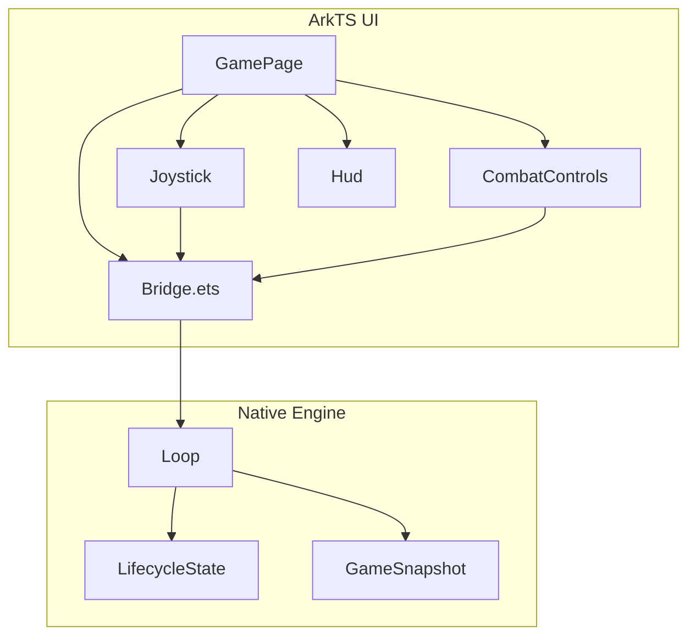
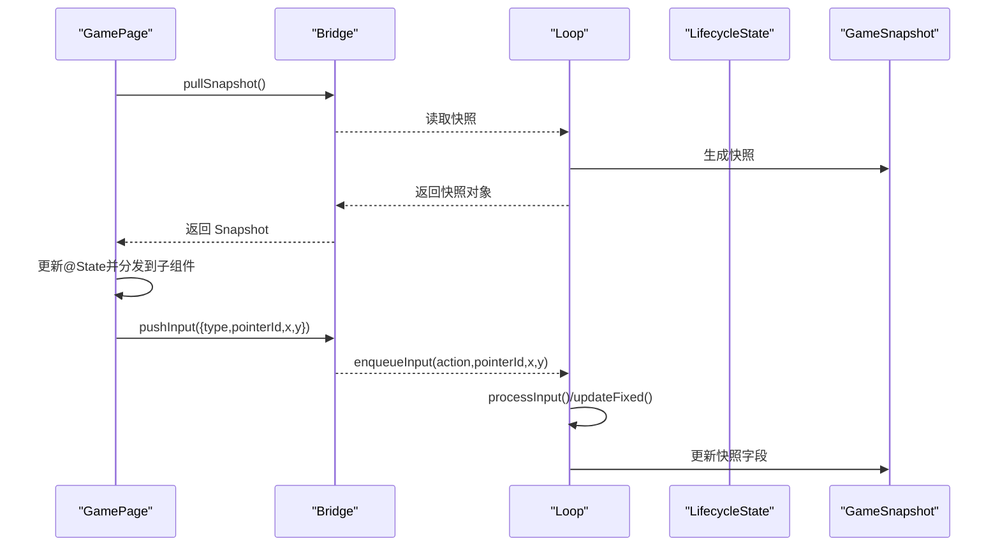
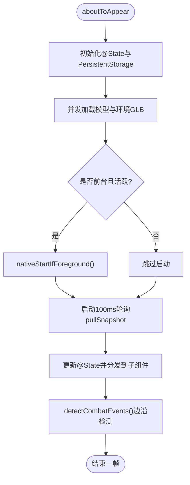
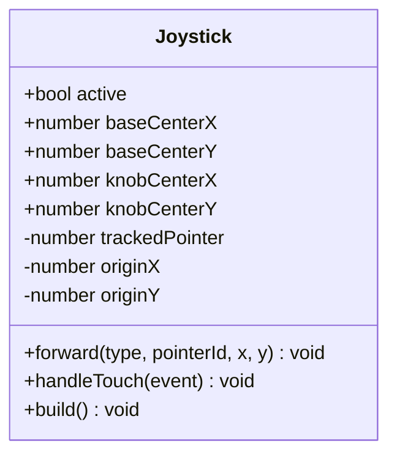
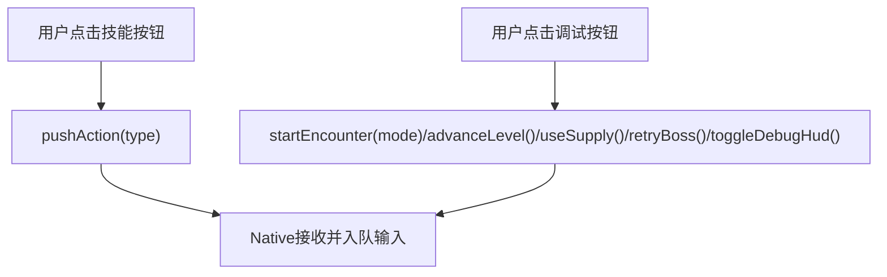
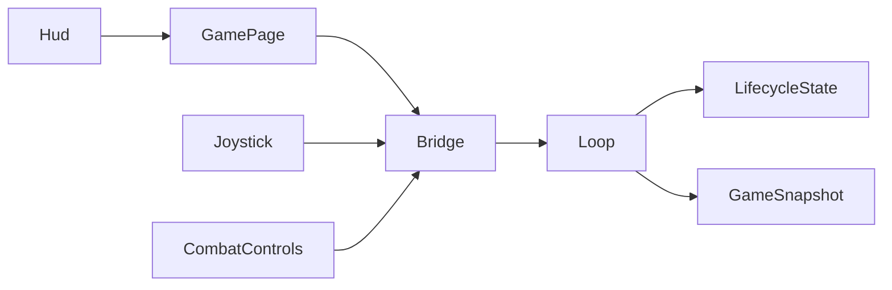

# 游戏状态管理系统

<cite>
**本文引用的文件**   
- [GamePage.ets](file://entry/src/main/ets/pages/GamePage.ets)
- [Bridge.ets](file://entry/src/main/ets/napi/Bridge.ets)
- [Joystick.ets](file://entry/src/main/ets/ui/Joystick.ets)
- [CombatControls.ets](file://entry/src/main/ets/ui/CombatControls.ets)
- [Hud.ets](file://entry/src/main/ets/ui/Hud.ets)
- [loop.h](file://native/engine/core/loop.h)
- [lifecycle_state.h](file://native/engine/core/lifecycle_state.h)
- [game_snapshot.h](file://native/engine/core/game_snapshot.h)
- [test_bridge_contract.mjs](file://tests/test_bridge_contract.mjs)
</cite>

## 目录
1. [简介](#简介)
2. [项目结构](#项目结构)
3. [核心组件](#核心组件)
4. [架构总览](#架构总览)
5. [详细组件分析](#详细组件分析)
6. [依赖关系分析](#依赖关系分析)
7. [性能考量](#性能考量)
8. [故障排查指南](#故障排查指南)
9. [结论](#结论)
10. [附录](#附录)

## 简介
本文件围绕“游戏状态管理系统”展开，聚焦 ArkTS 操控层与 Native 引擎之间的状态同步、输入路由与渲染生命周期。系统以 GamePage 为 UI 入口，通过 Bridge 暴露 N-API 接口；Native 侧由 Loop 驱动固定步长更新，输出快照供 UI 轮询；UI 层将触摸与动作事件经 Bridge 回传至 Native，形成闭环。本轮重点实现：动态浮出摇杆、弧形圆形技能按钮（冷却环+终结技高亮+按压反馈）、调试面板收纳，全部在 ArkTS 完成，不改动 Native 逻辑。

## 项目结构
- UI 层（ArkTS）
  - entry/src/main/ets/pages/GamePage.ets：页面级状态管理、快照轮询、组件装配
  - entry/src/main/ets/ui/Joystick.ets：虚拟摇杆交互与输入转发
  - entry/src/main/ets/ui/CombatControls.ets：技能按钮布局、冷却环、调试面板
  - entry/src/main/ets/ui/Hud.ets：HUD 展示（血条、韧性、体力、目标信息等）
  - entry/src/main/ets/napi/Bridge.ets：N-API 桥接定义与导出
- 引擎层（C++）
  - native/engine/core/loop.h：主循环、输入队列、子系统聚合、快照发布
  - native/engine/core/lifecycle_state.h：生命周期封装与渲染停止快照
  - native/engine/core/game_snapshot.h：快照数据结构定义
- 测试契约
  - tests/test_bridge_contract.mjs：跨语言契约断言（字段一致性、调用顺序、行为约束）

图表来源
- [GamePage.ets:216-313](file://entry/src/main/ets/pages/GamePage.ets#L216-L313)
- [Bridge.ets:90-100](file://entry/src/main/ets/napi/Bridge.ets#L90-L100)
- [loop.h:27-111](file://native/engine/core/loop.h#L27-L111)
- [lifecycle_state.h:6-51](file://native/engine/core/lifecycle_state.h#L6-L51)
- [game_snapshot.h:7-80](file://native/engine/core/game_snapshot.h#L7-L80)

章节来源
- [GamePage.ets:1-411](file://entry/src/main/ets/pages/GamePage.ets#L1-L411)
- [Bridge.ets:1-100](file://entry/src/main/ets/napi/Bridge.ets#L1-L100)
- [loop.h:1-111](file://native/engine/core/loop.h#L1-L111)
- [lifecycle_state.h:1-51](file://native/engine/core/lifecycle_state.h#L1-L51)
- [game_snapshot.h:1-80](file://native/engine/core/game_snapshot.h#L1-L80)

## 核心组件
- GamePage：维护 @State 与初始 Snapshot，定时拉取快照并分发到各 UI 组件；检测边沿变化触发触感反馈；加载资源后启动原生渲染。
- Joystick：左半屏捕获触摸，计算旋钮位移并换算为 native 半径下的速度向量，通过 pushInput 转发；空闲提示淡入淡出。
- CombatControls：右下角弧形技能按钮组，叠加 Progress(Ring) 冷却环与文本倒计时；终结技窗口开启时金色呼吸动画；右上角菜单按钮收起/展开调试面板。
- Hud：顶部任务标签、Boss 进度条、HP/Poise/Stamina 进度条、共鸣槽位、调试信息开关等。
- Bridge：定义 InputEvent/Snapshot 接口，导出 pushInput/pushAction/startEncounter/advanceLevel/useSupply/retryBoss/toggleDebugHud/setPaused/skipDemoPhase/pullSnapshot 等函数。
- Loop：聚合输入、相机、玩家、战斗、遭遇、演示、VFX、伤害数字、性能守护、音频桥等子系统；提供 enqueueInput、snapshot、setPaused、startEncounter 等方法。
- LifecycleState：封装 start/stop 的互斥访问，并提供 RendererStoppedSnapshot 用于渲染不可用时的安全快照。
- GameSnapshot：统一快照字段，包含角色、目标、战斗、关卡、表现、调试等所有 UI 所需数据。

章节来源
- [GamePage.ets:18-111](file://entry/src/main/ets/pages/GamePage.ets#L18-L111)
- [Joystick.ets:1-174](file://entry/src/main/ets/ui/Joystick.ets#L1-L174)
- [CombatControls.ets:1-246](file://entry/src/main/ets/ui/CombatControls.ets#L1-L246)
- [Hud.ets:1-148](file://entry/src/main/ets/ui/Hud.ets#L1-L148)
- [Bridge.ets:1-100](file://entry/src/main/ets/napi/Bridge.ets#L1-L100)
- [loop.h:27-111](file://native/engine/core/loop.h#L27-L111)
- [lifecycle_state.h:6-51](file://native/engine/core/lifecycle_state.h#L6-L51)
- [game_snapshot.h:7-80](file://native/engine/core/game_snapshot.h#L7-L80)

## 架构总览
系统采用“UI 轮询 + Native 固定步长”的双端协作模式：
- UI 每 100ms 调用 pullSnapshot 获取最新快照，映射到 @State，驱动 UI 重绘。
- 输入事件由 ArkTS 捕获并通过 pushInput/pushAction 进入 Native 的 InputQueue，Loop 消费并驱动子系统更新。
- 渲染生命周期由 LifecycleState 保护，避免在 surface 未就绪时运行；渲染不可用时返回安全快照。

图表来源
- [GamePage.ets:323-398](file://entry/src/main/ets/pages/GamePage.ets#L323-L398)
- [Bridge.ets:90-100](file://entry/src/main/ets/napi/Bridge.ets#L90-L100)
- [loop.h:95-111](file://native/engine/core/loop.h#L95-L111)
- [lifecycle_state.h:39-51](file://native/engine/core/lifecycle_state.h#L39-L51)
- [game_snapshot.h:7-80](file://native/engine/core/game_snapshot.h#L7-L80)

## 详细组件分析

### GamePage：状态管理与资源加载
- 初始化 Snapshot 默认值，声明大量 @State 字段对应快照字段。
- aboutToAppear 中启动定时器，每 100ms 拉取快照并赋值给 @State，同时执行 detectCombatEvents 进行边沿检测触发触感反馈。
- loadModelAssets 并发加载模型与环境 GLB，成功后调用 nativeStartIfForeground 启动原生渲染。
- build 中按层级装配 XComponent、Joystick、Hud、CombatControls、HitFeedback、ActionToast、ComboCounter、Tutorial、GameStateOverlay、TargetFrame、PauseMenu。

图表来源
- [GamePage.ets:315-411](file://entry/src/main/ets/pages/GamePage.ets#L315-L411)

章节来源
- [GamePage.ets:18-111](file://entry/src/main/ets/pages/GamePage.ets#L18-L111)
- [GamePage.ets:315-411](file://entry/src/main/ets/pages/GamePage.ets#L315-L411)

### Joystick：虚拟摇杆与输入转换
- 左半屏 Stack 捕获触摸，Down/Move/Up/Cancel 分别处理原点记录、位移计算与坐标转发。
- 视觉行程 KNOB_TRAVEL=50vp，换算为 native 半径 NATIVE_RADIUS=100，保证旋钮拉满即满速。
- active 控制底盘与旋钮显示，空闲时在左下角显示虚影提示。

图表来源
- [Joystick.ets:13-90](file://entry/src/main/ets/ui/Joystick.ets#L13-L90)
- [Joystick.ets:92-174](file://entry/src/main/ets/ui/Joystick.ets#L92-L174)

章节来源
- [Joystick.ets:1-174](file://entry/src/main/ets/ui/Joystick.ets#L1-L174)

### CombatControls：技能按钮与冷却环
- 弧形布局：普攻（76vp）、闪避（56vp）、终结（56vp，金色呼吸）、辉印/脉流/蚀质（48vp，各自带冷却环）。
- 冷却环使用 Progress(Ring)，剩余时间来自快照 radianceCooldownMs/currentCooldownMs/corruptionCooldownMs，总时长来自 radianceCooldownTotalMs/currentCooldownTotalMs/corruptionCooldownTotalMs。
- 右上角菜单按钮切换 debugOpen，展开/收起调试面板，内含训练/兽群/混战/守卫/流程/首领/推进/补给/重试/调试按钮。

图表来源
- [CombatControls.ets:51-246](file://entry/src/main/ets/ui/CombatControls.ets#L51-L246)
- [Bridge.ets:91-99](file://entry/src/main/ets/napi/Bridge.ets#L91-L99)

章节来源
- [CombatControls.ets:1-246](file://entry/src/main/ets/ui/CombatControls.ets#L1-L246)

### Hud：状态展示与调试开关
- 顶部 objectiveLabel、Boss 阶段进度条。
- HP/Poise/Stamina 进度条，Stamina 低于阈值变红预警。
- 共鸣槽位颜色指示。
- showDebugHud 控制调试信息可见性。

章节来源
- [Hud.ets:1-148](file://entry/src/main/ets/ui/Hud.ets#L1-L148)

### Bridge：N-API 契约与类型定义
- InputEvent：{type, pointerId, x, y}
- Snapshot：完整字段集合，涵盖角色、目标、战斗、关卡、表现、调试等。
- 导出函数：pushInput、pushAction、startEncounter、advanceLevel、useSupply、retryBoss、toggleDebugHud、setPaused、skipDemoPhase、pullSnapshot、nativeSetModelAssets、nativeSetEnvironmentAssets、nativeStart、nativeStop、nativeStartIfForeground。

章节来源
- [Bridge.ets:1-100](file://entry/src/main/ets/napi/Bridge.ets#L1-L100)

### Loop：主循环与子系统聚合
- 持有 Surface、InputQueue、TouchRouter、VirtualJoystick、CameraGesture、PlayerIntent、PlayerController、ThirdPersonCamera、SoftTargeting、CombatController、EncounterController、DemoDirector、VfxSystem、DamageNumberSystem、PerformanceGuard、AudioBridge。
- 提供 enqueueInput、snapshot、setPaused、startEncounter、advanceLevel、useSupply、retryBoss、toggleDebugHud、skipDemoPhase。
- withLifecycle 提供线程安全的操作封装。

章节来源
- [loop.h:27-111](file://native/engine/core/loop.h#L27-L111)

### LifecycleState：生命周期保护
- synchronized 提供递归锁保护。
- start/stop 确保运行态切换原子性。
- RendererStoppedSnapshot 在渲染不可用时返回安全快照。

章节来源
- [lifecycle_state.h:6-51](file://native/engine/core/lifecycle_state.h#L6-L51)

### GameSnapshot：快照数据结构
- 包含 tick、hp、poise、playerX/Y、fps、moving、targetId、bossPhase、encounterMode/state、rendererReady、moveX/Y、cameraYaw/Pitch、targetDist、targetArchetype/targetHpRatio、comboSegment、targetHp/Poise、stamina、resonance、hasInsight、invulnerable、insightMs、pulseHitRemainingMs、lastRejectReason、currentAction、comboWindowMs、radiance/current/corruption CooldownMs/TotalMs、ultimateWindowMs、targetPoiseBroken、attached flags、corroded、currentReaction、pulsePhase、levelStage/gateState/supplyState、bossHp/Poise/Mechanic/CastMs、perfLevel/vfxFlags、cameraShakeX/Y、bossHpRatio/CastRatio、debugHud/environmentReady/drawCalls/triangles、objectiveLabel、resonanceSlots、showDebugHud、inputEventCount、bossCinematicProgress/ShardCount/SourceColor/RingBroken。

章节来源
- [game_snapshot.h:7-80](file://native/engine/core/game_snapshot.h#L7-L80)

## 依赖关系分析
- UI 层依赖 Bridge 提供的 N-API 接口，向 Native 发送输入与动作，从 Native 拉取快照。
- Native 侧 Loop 依赖输入队列、触摸路由、虚拟摇杆、相机手势、玩家控制器、战斗控制器、遭遇控制器、演示导演、VFX、伤害数字、性能守护、音频桥等子系统。
- LifecycleState 保护渲染生命周期，避免在 surface 未就绪时运行。
- GameSnapshot 作为 UI 与 Native 的状态契约，Bridge 与 Index.d.ts 需保持一致。

图表来源
- [GamePage.ets:216-313](file://entry/src/main/ets/pages/GamePage.ets#L216-L313)
- [Bridge.ets:90-100](file://entry/src/main/ets/napi/Bridge.ets#L90-L100)
- [loop.h:27-111](file://native/engine/core/loop.h#L27-L111)
- [lifecycle_state.h:6-51](file://native/engine/core/lifecycle_state.h#L6-L51)
- [game_snapshot.h:7-80](file://native/engine/core/game_snapshot.h#L7-L80)

章节来源
- [test_bridge_contract.mjs:1-647](file://tests/test_bridge_contract.mjs#L1-L647)

## 性能考量
- UI 轮询间隔 100ms，平衡了响应性与刷新开销。
- 冷却环动画使用 100ms 平滑过渡，减少频繁重绘。
- 资源加载使用 Promise.all 并发，缩短等待时间。
- Native 固定步长 16ms，保证稳定更新频率。
- 渲染不可用时返回安全快照，避免 UI 异常。

[本节为通用指导，无需引用具体文件]

## 故障排查指南
- 若摇杆无响应：检查 Joystick.onTouch 是否正确转发 pushInput，确认 left-half 触摸区域未被覆盖。
- 若技能按钮无效：确认 CombatControls 的 onClick 调用 pushAction 参数正确，Bridge 导出存在。
- 若快照字段缺失：核对 Bridge Snapshot 与 Index.d.ts 字段一致，GamePage 是否赋值对应 @State。
- 若渲染崩溃：检查 lifecycle_state 的 RendererStoppedSnapshot 是否生效，确认 surface.ready 状态。
- 若触感反馈异常：查看 detectCombatEvents 边沿检测逻辑与 Haptics 权限配置。

章节来源
- [test_bridge_contract.mjs:1-647](file://tests/test_bridge_contract.mjs#L1-L647)

## 结论
本状态管理系统通过 ArkTS 与 C++ 的清晰分层，实现了稳定的输入-状态-渲染闭环。UI 层专注交互与展示，Native 层负责逻辑与仿真，Bridge 作为契约保障一致性。Joystick 与 CombatControls 的商业化重塑提升了操控体验，调试面板收纳保持界面整洁。整体架构可扩展性强，便于后续添加更多 UI 反馈与玩法模块。

[本节为总结性内容，无需引用具体文件]

## 附录
- 关键常量：NATIVE_RADIUS=100，KNOB_TRAVEL=50vp，BASE_SIZE=120，KNOB_SIZE=52，TICK_SIZE=6。
- 技能按钮映射：普攻(0)、闪避(1)、辉印(2)、脉流(3)、蚀质(4)、终结(5)。
- 调试模式：toggleDebugHud 控制 HUD 调试信息显示。
- 暂停系统：setPaused(true/false) 冻结/恢复帧循环。

章节来源
- [Joystick.ets:6-12](file://entry/src/main/ets/ui/Joystick.ets#L6-L12)
- [CombatControls.ets:51-170](file://entry/src/main/ets/ui/CombatControls.ets#L51-L170)
- [Bridge.ets:96-99](file://entry/src/main/ets/napi/Bridge.ets#L96-L99)