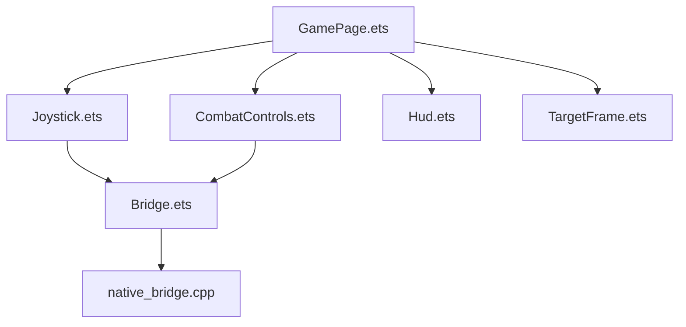
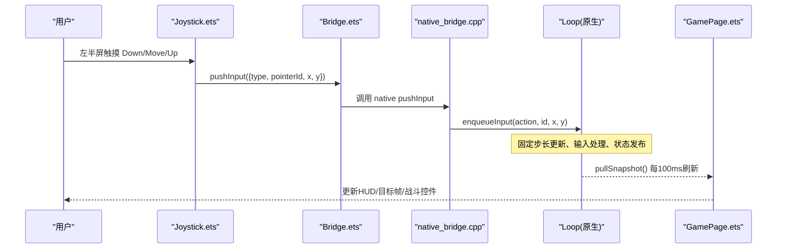
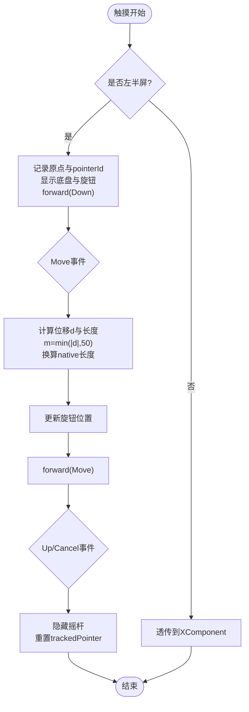
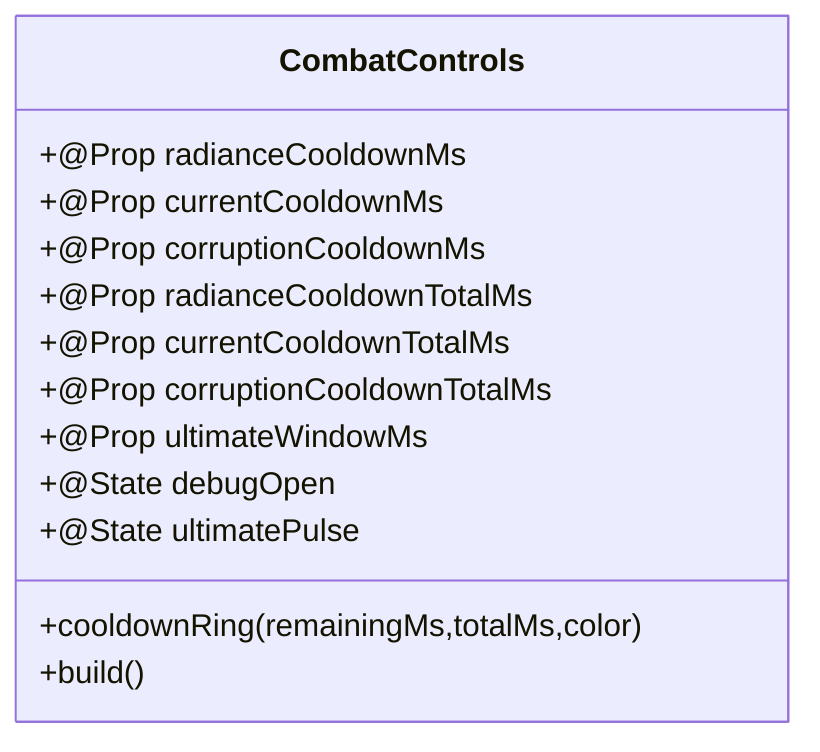
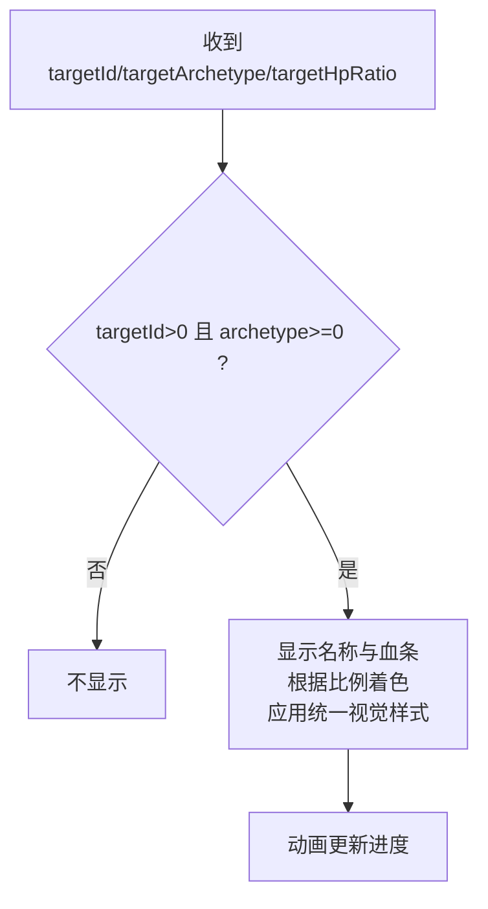
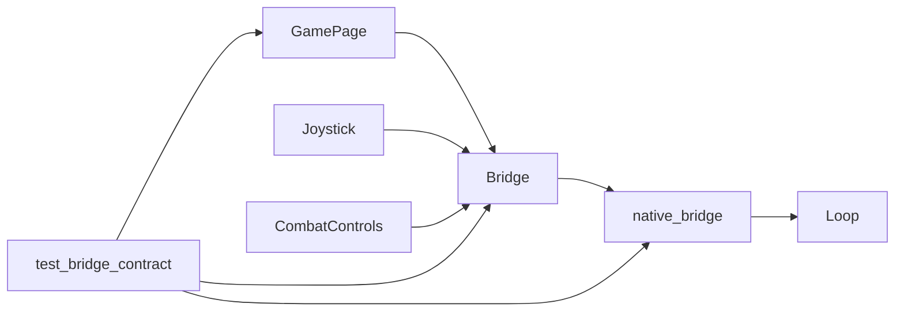

# 目标帧系统

<cite>
**本文引用的文件**   
- [Joystick.ets](file://entry/src/main/ets/ui/Joystick.ets)
- [CombatControls.ets](file://entry/src/main/ets/ui/CombatControls.ets)
- [GamePage.ets](file://entry/src/main/ets/pages/GamePage.ets)
- [Bridge.ets](file://entry/src/main/ets/napi/Bridge.ets)
- [native_bridge.cpp](file://entry/src/main/cpp/native_bridge.cpp)
- [Hud.ets](file://entry/src/main/ets/ui/Hud.ets)
- [TargetFrame.ets](file://entry/src/main/ets/ui/TargetFrame.ets)
- [ActionToast.ets](file://entry/src/main/ets/ui/ActionToast.ets)
- [Tutorial.ets](file://entry/src/main/ets/ui/Tutorial.ets)
- [ComboCounter.ets](file://entry/src/main/ets/ui/ComboCounter.ets)
- [HitFeedback.ets](file://entry/src/main/ets/ui/HitFeedback.ets)
- [test_bridge_contract.mjs](file://tests/test_bridge_contract.mjs)
</cite>

## 更新摘要
**变更内容**   
- TargetFrame组件进行了视觉样式优化，与其他UI组件保持统一的视觉风格
- 更新了边框、阴影、背景色等视觉元素的一致性
- 改进了动画过渡效果和视觉反馈

## 目录
1. [简介](#简介)
2. [项目结构](#项目结构)
3. [核心组件](#核心组件)
4. [架构总览](#架构总览)
5. [详细组件分析](#详细组件分析)
6. [依赖关系分析](#依赖关系分析)
7. [性能考量](#性能考量)
8. [故障排查指南](#故障排查指南)
9. [结论](#结论)
10. [附录](#附录)

## 简介
本文件围绕"目标帧系统"与"操控层商业化重塑"展开，聚焦 ArkTS 侧的可视化操控与目标反馈：动态浮出摇杆、弧形圆形技能按钮（冷却环+终结技高亮+按压反馈）、调试面板收纳为侧拉面板；同时通过桥接将触摸与动作事件稳定转发至 native，保证原生 TouchRouter/VirtualJoystick 等逻辑不变。目标帧 UI 包括顶部锁定目标名称与血条，配合 HUD、战斗控制与输入桥接形成完整的目标交互闭环。

**更新** TargetFrame组件经过视觉一致性优化，与其他UI组件保持统一的视觉风格，提升了整体界面的一致性和美观度。

## 项目结构
- ArkTS UI 层：GamePage 作为入口，组合 Joystick、Hud、CombatControls、TargetFrame 等组件，统一渲染层级与数据绑定。
- N-API 桥接：Bridge.ets 暴露 pushInput/pushAction 等接口；native_bridge.cpp 实现事件入队、生命周期与资源注入。
- 测试契约：test_bridge_contract.mjs 校验 ArkTS 与 native 的契约一致性（字段顺序、方法签名、行为约束）。



**图表来源** 
- [GamePage.ets](file://entry/src/main/ets/pages/GamePage.ets)
- [Joystick.ets](file://entry/src/main/ets/ui/Joystick.ets)
- [CombatControls.ets](file://entry/src/main/ets/ui/CombatControls.ets)
- [Bridge.ets](file://entry/src/main/ets/napi/Bridge.ets)
- [native_bridge.cpp](file://entry/src/main/cpp/native_bridge.cpp)

**章节来源**
- [GamePage.ets](file://entry/src/main/ets/pages/GamePage.ets)
- [Bridge.ets](file://entry/src/main/ets/napi/Bridge.ets)
- [native_bridge.cpp](file://entry/src/main/cpp/native_bridge.cpp)

## 核心组件
- 摇杆组件（Joystick）：左半屏触摸捕获，视觉行程与 native 半径严格换算，确保旋钮拉满=满速；空闲提示淡入淡出。
- 战斗控制（CombatControls）：右下角弧形布局，普攻/闪避/终结/三源技能按钮叠加冷却环与呼吸高亮；右上角调试入口折叠面板。
- 目标帧（TargetFrame）：锁定普通敌人时显示名称与血条，颜色随血量比例变化，具有统一的视觉风格。
- 桥接（Bridge + native_bridge）：pushInput/pushAction 入队，startEncounter/advanceLevel/useSupply/retryBoss/toggleDebugHud/setPaused/skipDemoPhase 等流程控制。

**更新** TargetFrame组件现已采用与其他UI组件一致的视觉设计语言，包括统一的边框样式、阴影效果和背景透明度。

**章节来源**
- [Joystick.ets](file://entry/src/main/ets/ui/Joystick.ets)
- [CombatControls.ets](file://entry/src/main/ets/ui/CombatControls.ets)
- [TargetFrame.ets](file://entry/src/main/ets/ui/TargetFrame.ets)
- [Bridge.ets](file://entry/src/main/ets/napi/Bridge.ets)
- [native_bridge.cpp](file://entry/src/main/cpp/native_bridge.cpp)

## 架构总览
ArkTS 层通过 XComponent 承载原生渲染，UI 层以透明 HitTest 分层：XComponent 处理相机手势，Joystick 捕获移动触摸，CombatControls 处理技能与调试。所有输入经 Bridge 进入 native，Loop 统一调度并回推快照到 GamePage 驱动 UI。



**图表来源** 
- [Joystick.ets](file://entry/src/main/ets/ui/Joystick.ets)
- [Bridge.ets](file://entry/src/main/ets/napi/Bridge.ets)
- [native_bridge.cpp](file://entry/src/main/cpp/native_bridge.cpp)
- [GamePage.ets](file://entry/src/main/ets/pages/GamePage.ets)

## 详细组件分析

### 摇杆组件（Joystick）
- 触摸路由：仅左半屏捕获，右半屏透传至 XComponent 原生回调，避免干扰相机手势。
- 数值对齐：NATIVE_RADIUS=100，KNOB_TRAVEL=50vp；位移按 m=min(|d|,50) 缩放为 native 长度，保证旋钮拉满=满速。
- 视觉反馈：底盘圆环+四向刻度点，旋钮渐变实心圆；按下提升亮度；空闲提示左下角虚影淡出。
- 事件转发：Down/Move/Up/Cancel 均通过 pushInput 转发原始坐标或换算坐标。



**图表来源** 
- [Joystick.ets](file://entry/src/main/ets/ui/Joystick.ets)

**章节来源**
- [Joystick.ets](file://entry/src/main/ets/ui/Joystick.ets)

### 战斗控制（CombatControls）
- 弧形布局：普攻主钮贴角，闪避在左侧，终结在上方，辉印/脉流/蚀质弧形排列。
- 冷却环：Progress(Ring) 叠加于按钮上，剩余秒数文本居中；冷却总时长由快照下发，非硬编码。
- 终结技高亮：当 ultimateWindowMs > 0 时金色呼吸动画，否则置灰。
- 调试面板：右上角菜单圆钮展开/收起，内含训练/兽群/混战/守卫/流程/首领/推进/补给/重试/调试按钮。



**图表来源** 
- [CombatControls.ets](file://entry/src/main/ets/ui/CombatControls.ets)

**章节来源**
- [CombatControls.ets](file://entry/src/main/ets/ui/CombatControls.ets)

### 目标帧（TargetFrame）
- 触发条件：targetId > 0 且 targetArchetype >= 0 时显示。
- 名称映射：裂隙之爪/辉光祭司/蚀壳守卫对应 archetype 0/1/2。
- 血条颜色：>50% 青绿，>25% 金黄，<=25% 红色。
- 动画：进度条线性动画平滑过渡。

**更新** TargetFrame组件现已采用统一的视觉设计风格：
- 背景色：`#8A11181D`（半透明深色背景）
- 边框：1px宽度，`rgba(199, 208, 206, 0.25)` 浅灰色边框
- 圆角：14px圆角设计
- 阴影：8px半径，根据血量比例变化的彩色阴影效果
- 内边距：左右18px，顶部8px，底部10px
- 文字样式：13px字号，Medium字重，2px字间距
- 血条样式：5px高度，180px宽度，带120ms动画过渡



**图表来源** 
- [TargetFrame.ets](file://entry/src/main/ets/ui/TargetFrame.ets)

**章节来源**
- [TargetFrame.ets](file://entry/src/main/ets/ui/TargetFrame.ets)

### 桥接与原生交互（Bridge + native_bridge）
- pushInput：ArkTS 侧构造 InputEvent，native 侧校验字段类型与范围后入队。
- pushAction：动作类型 0..5 映射 Attack/Dodge/Radiance/Current/Corruption/Ultimate。
- 生命周期：OnSurfaceCreated/Changed/Destroyed 管理 surface 初始化与循环启停；foregroundRequested 原子标志控制 start/stop。
- 资源注入：nativeSetModelAssets/nativeSetEnvironmentAssets 批量拷贝 ArrayBuffer 并在生命周期保护下提交。

```mermaid
sequenceDiagram
participant UI as "ArkTS UI"
participant Bridge as "Bridge.ets"
participant NB as "native_bridge.cpp"
participant Loop as "Loop"
UI->>Bridge : pushInput(InputEvent)
Bridge->>NB : napi pushInput
NB->>NB : 校验参数(type,x,y,pointerId)
NB->>Loop : enqueueInput(action,id,x,y)
UI->>Bridge : pushAction(type)
Bridge->>NB : napi pushAction
NB->>NB : 校验type∈[0,5]
NB->>Loop : enqueueInput(action,-1,0,0)
```

**图表来源** 
- [Bridge.ets](file://entry/src/main/ets/napi/Bridge.ets)
- [native_bridge.cpp](file://entry/src/main/cpp/native_bridge.cpp)

**章节来源**
- [Bridge.ets](file://entry/src/main/ets/napi/Bridge.ets)
- [native_bridge.cpp](file://entry/src/main/cpp/native_bridge.cpp)

## 依赖关系分析
- GamePage 聚合 UI 组件并维护 @State 快照字段，定时 pullSnapshot 驱动 UI 更新。
- Joystick 依赖 Bridge.pushInput；CombatControls 依赖 Bridge.pushAction 及流程控制方法。
- native_bridge 依赖 Loop 进行输入入队与状态发布，并通过 withLifecycle 保证资源提交安全。
- test_bridge_contract.mjs 断言 ArkTS 与 native 的契约一致性（字段顺序、方法导出、行为约束）。



**图表来源** 
- [GamePage.ets](file://entry/src/main/ets/pages/GamePage.ets)
- [Bridge.ets](file://entry/src/main/ets/napi/Bridge.ets)
- [native_bridge.cpp](file://entry/src/main/cpp/native_bridge.cpp)
- [test_bridge_contract.mjs](file://tests/test_bridge_contract.mjs)

**章节来源**
- [GamePage.ets](file://entry/src/main/ets/pages/GamePage.ets)
- [test_bridge_contract.mjs](file://tests/test_bridge_contract.mjs)

## 性能考量
- 摇杆视觉行程与 native 半径换算避免多余计算，Move 事件仅在有效位移时 forward。
- 冷却环使用 Progress(Ring) 与 100ms 动画间隔，减少频繁重绘。
- GamePage 每 100ms 拉取一次快照，降低 UI 刷新频率。
- 资源加载采用 Promise.all 并发读取 GLB，失败域分离（模型与环境），避免阻塞。
- **更新** TargetFrame组件的动画过渡设置为120ms，平衡了流畅性和性能表现。

## 故障排查指南
- 触摸无响应：确认 Joystick 仅捕获左半屏，右半屏透传；检查 pushInput 字段是否齐全（type/x/y/pointerId）。
- 摇杆速度异常：核对 NATIVE_RADIUS 与 KNOB_TRAVEL 换算逻辑，确保旋钮拉满=满速。
- 技能按钮无效：检查 pushAction 类型是否在 0..5 范围内，native 映射顺序是否正确。
- 目标帧不显示：确认 targetId>0 且 targetArchetype>=0；检查快照字段是否同步。
- 调试面板无法打开：确认 debugOpen 状态切换与按钮 onClick 绑定。
- **更新** 目标帧视觉问题：检查边框、阴影和背景色是否正确应用，确认动画过渡效果正常。

**章节来源**
- [Joystick.ets](file://entry/src/main/ets/ui/Joystick.ets)
- [CombatControls.ets](file://entry/src/main/ets/ui/CombatControls.ets)
- [TargetFrame.ets](file://entry/src/main/ets/ui/TargetFrame.ets)
- [Bridge.ets](file://entry/src/main/ets/napi/Bridge.ets)
- [native_bridge.cpp](file://entry/src/main/cpp/native_bridge.cpp)

## 结论
目标帧系统与操控层商业化重塑通过 ArkTS 纯前端改造实现了商业手游水准的交互体验：动态摇杆、弧形技能按钮、冷却环与终结技高亮、调试面板收纳，以及稳定的输入桥接与目标反馈。该设计在不改动 native 逻辑的前提下，提升了操控直观性与可玩性，并为后续振动反馈、伤害飘字等打击感包装奠定基础。

**更新** TargetFrame组件的视觉一致性优化进一步提升了整体界面的美观度和专业感，使目标反馈更加清晰醒目，增强了游戏的视觉连贯性。

## 附录
- 契约测试要点：
  - Joystick 必须 import pushInput 并转发原始坐标。
  - GamePage 必须引入并挂载 Joystick。
  - CombatControls 必须接受冷却与终结窗口 @Prop，并按标签配对 pushAction。
  - Bridge 与 native_bridge 必须导出并正确声明相关方法。
  - 快照字段顺序与命名需保持一致。
- **更新** 视觉设计规范：
  - 统一使用半透明深色背景（#8A11181D）
  - 边框颜色统一为 rgba(199, 208, 206, 0.25)
  - 圆角半径统一为14px
  - 阴影效果根据功能状态动态调整颜色
  - 动画过渡时间统一为120ms

**章节来源**
- [test_bridge_contract.mjs](file://tests/test_bridge_contract.mjs)
- [TargetFrame.ets](file://entry/src/main/ets/ui/TargetFrame.ets)
- [ActionToast.ets](file://entry/src/main/ets/ui/ActionToast.ets)
- [Tutorial.ets](file://entry/src/main/ets/ui/Tutorial.ets)
- [ComboCounter.ets](file://entry/src/main/ets/ui/ComboCounter.ets)
- [HitFeedback.ets](file://entry/src/main/ets/ui/HitFeedback.ets)