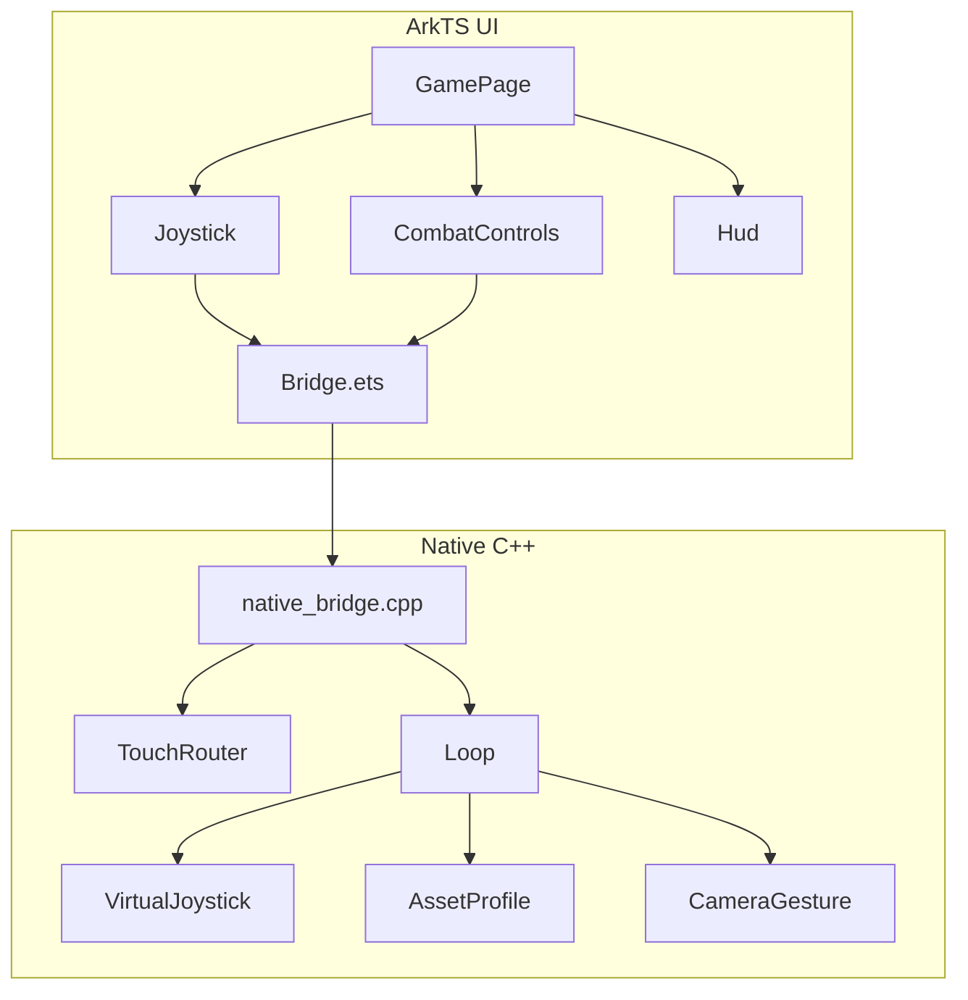
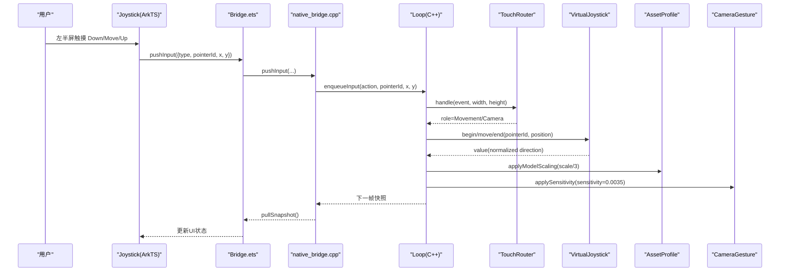
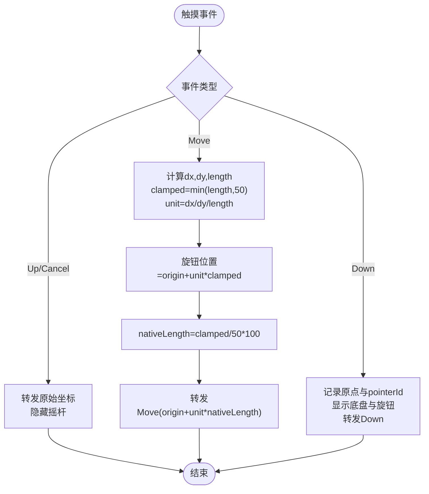
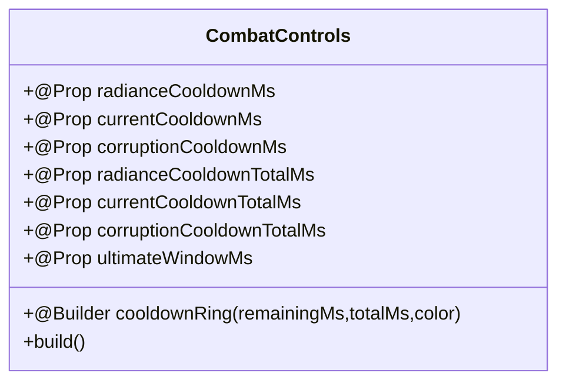
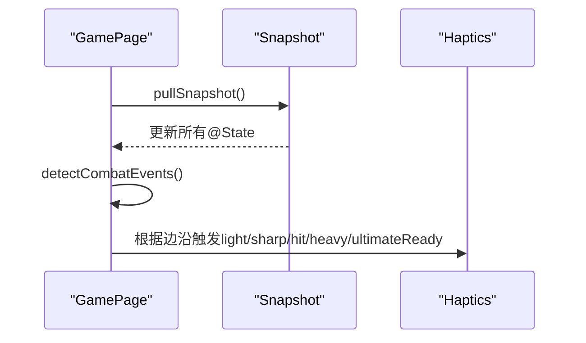
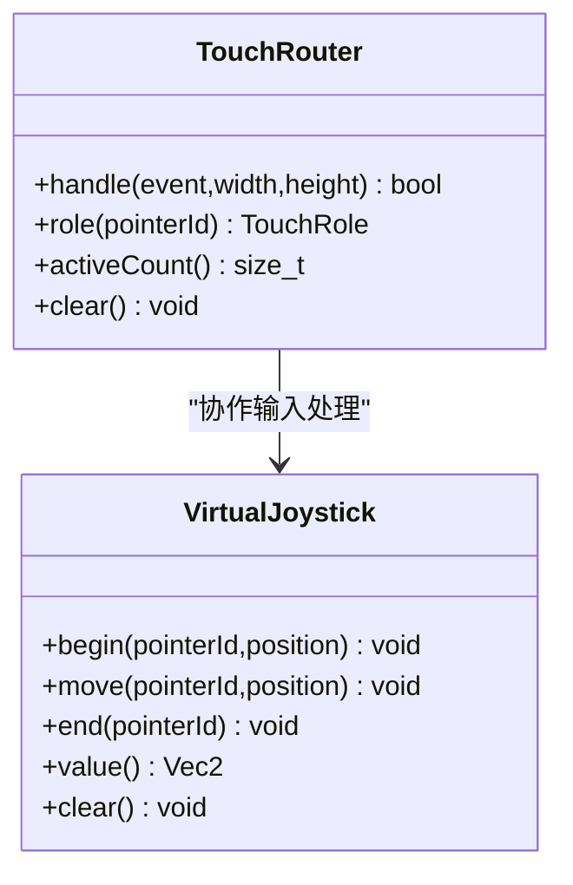
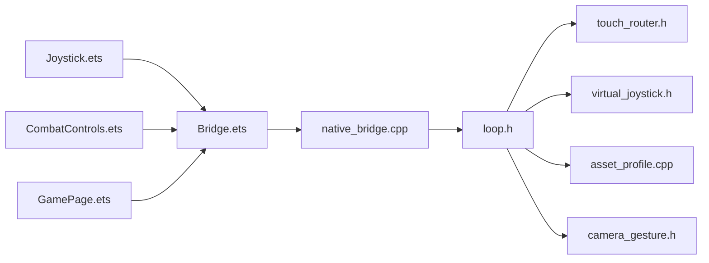

# 虚拟摇杆系统

<cite>
**本文引用的文件**   
- [Joystick.ets](file://entry/src/main/ets/ui/Joystick.ets)
- [CombatControls.ets](file://entry/src/main/ets/ui/CombatControls.ets)
- [GamePage.ets](file://entry/src/main/ets/pages/GamePage.ets)
- [Bridge.ets](file://entry/src/main/ets/napi/Bridge.ets)
- [native_bridge.cpp](file://entry/src/main/cpp/native_bridge.cpp)
- [virtual_joystick.h](file://native/engine/input/virtual_joystick.h)
- [touch_router.h](file://native/engine/input/touch_router.h)
- [loop.h](file://native/engine/core/loop.h)
- [Hud.ets](file://entry/src/main/ets/ui/Hud.ets)
- [Haptics.ets](file://entry/src/main/ets/ui/Haptics.ets)
- [test_bridge_contract.mjs](file://tests/test_bridge_contract.mjs)
- [asset_profile.cpp](file://native/engine/render/asset_profile.cpp)
- [camera_gesture.h](file://native/engine/input/camera_gesture.h)
</cite>

## 更新摘要
**所做更改**   
- 新增模型缩放调整章节，详细说明角色模型缩小至1/3的设计决策
- 更新相机灵敏度配置，从默认值调整为0.0035f以提升操控舒适度
- 增强按钮命中优先级机制，确保激烈战斗场景中的事件处理正确性
- 完善触摸路由设计，明确ArkTS按钮优先于底层XComponent的触摸处理

## 目录
1. [简介](#简介)
2. [项目结构](#项目结构)
3. [核心组件](#核心组件)
4. [架构总览](#架构总览)
5. [详细组件分析](#详细组件分析)
6. [模型缩放与视觉优化](#模型缩放与视觉优化)
7. [相机灵敏度调优](#相机灵敏度调优)
8. [按钮命中优先级优化](#按钮命中优先级优化)
9. [依赖关系分析](#依赖关系分析)
10. [性能考量](#性能考量)
11. [故障排查指南](#故障排查指南)
12. [结论](#结论)
13. [附录](#附录)

## 简介
本文件围绕"虚拟摇杆系统"的 ArkTS 实现与原生输入桥接进行系统化说明。重点包括：
- 动态浮出可视化摇杆（左半屏触摸捕获、旋钮跟随、视觉行程与 native 速度对齐）
- 弧形圆形技能按钮（冷却环+终结技高亮+按压反馈）
- 调试面板收纳为侧拉面板
- **新增**：角色模型缩放至1/3大小，提升视觉比例协调性
- **新增**：相机灵敏度降低至0.0035f，改善操控舒适度
- **新增**：按钮命中优先级优化，确保激烈战斗场景中的事件处理正确性
- 纯 ArkTS 改造，不修改任何 native 逻辑；触摸经现有 pushInput 桥接转发，native TouchRouter/VirtualJoystick 原样工作

## 项目结构
- UI 层（ArkTS）
  - Joystick.ets：动态浮出摇杆组件，负责左半屏触摸捕获与坐标换算后通过 pushInput 转发
  - CombatControls.ets：右下角弧形技能按钮区 + 右上角调试入口与侧拉面板
  - GamePage.ets：页面容器，挂载 XComponent、Joystick、Hud、CombatControls 等
  - Bridge.ets：N-API 导出声明与类型定义（Snapshot、InputEvent、pushInput/pushAction 等）
- Native 层（C++）
  - native_bridge.cpp：XComponent 生命周期回调、触摸分发、N-API 方法注册
  - virtual_joystick.h：原生虚拟摇杆（半径、死区、值域映射）
  - touch_router.h：触摸角色分配（左半屏 Movement，右半屏 Camera）
  - loop.h：主循环、输入队列、各子系统集成
  - asset_profile.cpp：角色模型缩放配置（Player/Enemy/Boss scale = 原尺寸/3）
  - camera_gesture.h：相机手势灵敏度配置（sensitivityX/Y = 0.0035f）

**图表来源**
- [GamePage.ets:216-313](file://entry/src/main/ets/pages/GamePage.ets#L216-L313)
- [Joystick.ets:92-172](file://entry/src/main/ets/ui/Joystick.ets#L92-L172)
- [CombatControls.ets:51-244](file://entry/src/main/ets/ui/CombatControls.ets#L51-L244)
- [Bridge.ets:1-100](file://entry/src/main/ets/napi/Bridge.ets#L1-L100)
- [native_bridge.cpp:113-128](file://entry/src/main/cpp/native_bridge.cpp#L113-L128)
- [touch_router.h:15-58](file://native/engine/input/touch_router.h#L15-L58)
- [virtual_joystick.h:5-61](file://native/engine/input/virtual_joystick.h#L5-L61)
- [loop.h:27-110](file://native/engine/core/loop.h#L27-L110)
- [asset_profile.cpp:3-16](file://native/engine/render/asset_profile.cpp#L3-L16)
- [camera_gesture.h:5-8](file://native/engine/input/camera_gesture.h#L5-L8)

## 核心组件
- 虚拟摇杆（Joystick）
  - 功能：左半屏触摸捕获、原点记录、旋钮跟随、视觉行程限制、坐标换算并转发
  - 关键参数：NATIVE_RADIUS=100（与原生 VirtualJoystickConfig.radius 一致）、KNOB_TRAVEL=50vp（视觉行程）
  - 行为：Down 显示底盘与旋钮并转发 Down；Move 计算位移、限制行程、换算 native 长度并转发 Move；Up/Cancel 转发原始坐标并隐藏
  - 空闲提示：左下角淡入虚影提示"滑动移动"，触摸出现后淡出
- 战斗控制（CombatControls）
  - 功能：右下角弧形布局的技能按钮（普攻/闪避/辉印/脉流/蚀质/终结），冷却环叠加 Progress(Ring)，终结技窗口呼吸高亮，按压态动画
  - 属性：radiance/current/corruption 冷却剩余与总时长、ultimateWindowMs
  - 调试面板：右上角菜单圆钮展开/收起，包含训练/兽群/混战/守卫/流程/首领/推进/补给/重试/调试
  - **新增**：所有按钮使用 `HitTestMode.Block` 确保触摸优先级
- 页面容器（GamePage）
  - 功能：挂载 XComponent、Joystick、Hud、CombatControls 等；每 100ms 轮询 pullSnapshot 更新 @State；检测边沿触发 Haptics
  - **新增**：Joystick 层位于 XComponent 之上、Hud 之下，确保触摸事件正确路由

**章节来源**
- [Joystick.ets:1-174](file://entry/src/main/ets/ui/Joystick.ets#L1-L174)
- [CombatControls.ets:1-246](file://entry/src/main/ets/ui/CombatControls.ets#L1-L246)
- [GamePage.ets:1-411](file://entry/src/main/ets/pages/GamePage.ets#L1-L411)

## 架构总览
从触摸到游戏动作的完整链路：
- ArkTS 层：Joystick 捕获触摸 → pushInput → N-API → native_bridge.cpp
- Native 层：OnDispatchTouchEvent → ForwardChangedPointer → Loop.enqueueInput → TouchRouter 分配角色 → VirtualJoystick 计算方向与强度
- 渲染与状态：Loop 固定步更新 → SnapshotStore → pullSnapshot → GamePage 刷新 UI
- **新增**：AssetProfile 应用模型缩放（scale = 原尺寸/3）
- **新增**：CameraGesture 应用灵敏度配置（sensitivity = 0.0035f）

**图表来源**
- [Joystick.ets:24-90](file://entry/src/main/ets/ui/Joystick.ets#L24-L90)
- [Bridge.ets:90-91](file://entry/src/main/ets/napi/Bridge.ets#L90-L91)
- [native_bridge.cpp:212-250](file://entry/src/main/cpp/native_bridge.cpp#L212-L250)
- [native_bridge.cpp:113-128](file://entry/src/main/cpp/native_bridge.cpp#L113-L128)
- [loop.h:95-102](file://native/engine/core/loop.h#L95-L102)
- [touch_router.h:17-37](file://native/engine/input/touch_router.h#L17-L37)
- [virtual_joystick.h:20-46](file://native/engine/input/virtual_joystick.h#L20-L46)
- [asset_profile.cpp:3-16](file://native/engine/render/asset_profile.cpp#L3-L16)
- [camera_gesture.h:5-8](file://native/engine/input/camera_gesture.h#L5-L8)

## 详细组件分析

### 虚拟摇杆（Joystick）
- 设计要点
  - 全屏透明 Stack，仅左半宽区域响应触摸，右半透传相机手势
  - Down：记录 origin、pointerId，显示底盘与旋钮，转发 Down
  - Move：计算位移 d，m=min(|d|, KNOB_TRAVEL)，旋钮位置 origin + unit * m；转发坐标 origin + unit * (m/KNOB_TRAVEL * NATIVE_RADIUS)
  - Up/Cancel：转发原始坐标，隐藏摇杆
  - 视觉：底盘半透明描边圆 + 四向刻度点，旋钮渐变实心圆，按下时底盘亮度提升；空闲提示淡入淡出
- 数值对齐
  - NATIVE_RADIUS=100 与原生 VirtualJoystickConfig.radius 一致，确保旋钮拉满 = 满速
  - 死区由原生 VirtualJoystick 处理（deadZone*radius）

**图表来源**
- [Joystick.ets:29-90](file://entry/src/main/ets/ui/Joystick.ets#L29-L90)
- [virtual_joystick.h:5-8](file://native/engine/input/virtual_joystick.h#L5-L8)

**章节来源**
- [Joystick.ets:1-174](file://entry/src/main/ets/ui/Joystick.ets#L1-L174)

### 战斗控制（CombatControls）
- 技能按钮布局
  - 普攻（76vp，最右贴底角）、闪避（56vp，普攻左侧）、终结（56vp，普攻上方，金色呼吸高亮）
  - 辉印/脉流/蚀质（48vp 弧形排列），各自叠加 Progress(Ring) 冷却环 + 剩余秒数文本
  - 按压反馈：stateEffect(true) + 透明度/缩放动画
- 冷却数据
  - 冷却剩余与总时长来自快照（@Prop radiance/current/corruption CooldownMs/TotalMs）
  - 冷却环使用 Progress(Ring) 平滑动画（duration 100ms）
- 调试面板
  - 右上角小型圆钮展开/收起，内含全部调试按钮（训练/兽群/混战/守卫/流程/首领/推进/补给/重试/调试）
- **新增**：所有按钮使用 `HitTestMode.Block` 确保触摸优先级，根容器使用 `HitTestMode.None` 保持空白区域透明

**图表来源**
- [CombatControls.ets:4-49](file://entry/src/main/ets/ui/CombatControls.ets#L4-L49)
- [CombatControls.ets:51-244](file://entry/src/main/ets/ui/CombatControls.ets#L51-L244)

**章节来源**
- [CombatControls.ets:1-246](file://entry/src/main/ets/ui/CombatControls.ets#L1-L246)

### 页面容器（GamePage）
- 层级组织
  - XComponent（渲染层）→ Joystick（输入层）→ Hud（HUD）→ CombatControls（技能按钮）→ HitFeedback/ActionToast/ComboCounter/Tutorial/GameStateOverlay/TargetFrame/PauseMenu
- 数据同步
  - 每 100ms pullSnapshot，更新 @State 字段
  - detectCombatEvents 检测边沿变化触发 Haptics（受击/精准闪避/技能命中/破韧/终结就绪）
- 资源加载
  - 并发读取模型与环境 GLB，注入 nativeSetModelAssets/nativeSetEnvironmentAssets，完成后 nativeStartIfForeground
- **新增**：Joystick 层位于 XComponent 之上，确保触摸事件正确路由

**图表来源**
- [GamePage.ets:323-398](file://entry/src/main/ets/pages/GamePage.ets#L323-L398)
- [GamePage.ets:124-159](file://entry/src/main/ets/pages/GamePage.ets#L124-L159)

**章节来源**
- [GamePage.ets:1-411](file://entry/src/main/ets/pages/GamePage.ets#L1-L411)

### 触摸路由与虚拟摇杆（Native）
- TouchRouter
  - 按 x < width/2 分配 Movement，否则 Camera；单指针角色唯一性保证
- VirtualJoystick
  - begin/move/end 基于 pointerId 与 origin 计算 value（归一化方向，长度受 deadZone 与 radius 约束）

**图表来源**
- [touch_router.h:15-58](file://native/engine/input/touch_router.h#L15-L58)
- [virtual_joystick.h:10-61](file://native/engine/input/virtual_joystick.h#L10-L61)

**章节来源**
- [touch_router.h:15-58](file://native/engine/input/touch_router.h#L15-L58)
- [virtual_joystick.h:5-61](file://native/engine/input/virtual_joystick.h#L5-L61)

## 模型缩放与视觉优化

### 设计目标
将角色模型缩小至原尺寸的约1/3，以改善游戏画面的视觉比例协调性和战斗体验。

### 实现细节
- **Player 模型**：scale = 0.025f / 3.0f ≈ 0.0083f
- **Enemy 模型**：scale = 0.022f / 3.0f ≈ 0.0073f  
- **Boss 模型**：scale = 0.045f / 3.0f ≈ 0.015f

### 技术实现
在 `asset_profile.cpp` 中修改 `AssetProfile::forModel()` 方法，将所有模型的 scale 值除以 3.0f，同时保持其他属性（颜色、偏移等）不变。

### 影响范围
- 视觉呈现：角色在游戏中的相对大小更加协调
- 碰撞检测：保持原有逻辑碰撞不变
- 攻击距离：维持现有攻击判定范围
- 摄像机距离：不影响摄像机距离设置

**章节来源**
- [asset_profile.cpp:3-16](file://native/engine/render/asset_profile.cpp#L3-L16)

## 相机灵敏度调优

### 设计目标
降低右半屏视角灵敏度，提升玩家操控舒适度和精确度，特别是在激烈战斗场景中。

### 配置参数
- **sensitivityX**：0.0035f（水平灵敏度）
- **sensitivityY**：0.0035f（垂直灵敏度）

### 技术实现
在 `camera_gesture.h` 中修改 `CameraGestureConfig` 结构的默认值，将灵敏度从原来的 0.01f 降低至 0.0035f。

### 用户体验改进
- 更稳定的镜头控制，减少意外旋转
- 更精确的目标锁定和瞄准
- 更适合长时间游戏的操控舒适度

### 兼容性保证
- 保留显式配置 `CameraGesture({0.01f, 0.01f})` 以支持自定义灵敏度
- 非法数值仍会被安全处理为 0.0f

**章节来源**
- [camera_gesture.h:5-8](file://native/engine/input/camera_gesture.h#L5-L8)

## 按钮命中优先级优化

### 设计目标
确保 ArkTS 按钮能够优先于底层 XComponent 处理触摸事件，避免在激烈战斗场景中发生事件冲突。

### 实现策略
- **按钮节点**：使用 `HitTestMode.Block` 阻断触摸事件传播
- **根容器**：使用 `HitTestMode.None` 跳过自身命中测试
- **空白区域**：使用 `HitTestMode.Transparent` 保持透明，允许事件继续传递

### 具体实现
在 `CombatControls.ets` 中：
- 所有技能按钮（普攻、闪避、辉印、脉流、蚀质、终结）都设置了 `.hitTestBehavior(HitTestMode.Block)`
- 调试按钮同样采用 Block 模式
- 根容器使用 `.hitTestBehavior(HitTestMode.None)`
- 冷却环遮罩使用 `HitTestMode.Transparent`

### 事件处理流程
1. 用户触摸屏幕
2. 如果触摸落在按钮区域，按钮优先处理（Block）
3. 如果触摸在按钮空白区域，事件继续传递到 XComponent（Transparent）
4. XComponent 处理相机手势或移动控制

### 契约测试验证
`test_bridge_contract.mjs` 中包含严格的断言，确保：
- 所有按钮都使用 `HitTestMode.Block`
- 根容器使用 `HitTestMode.None`
- 冷却环使用 `HitTestMode.Transparent`

**章节来源**
- [CombatControls.ets:51-244](file://entry/src/main/ets/ui/CombatControls.ets#L51-L244)
- [test_bridge_contract.mjs:39-51](file://tests/test_bridge_contract.mjs#L39-L51)

## 依赖关系分析
- ArkTS 依赖
  - Joystick → Bridge.pushInput
  - CombatControls → Bridge.pushAction/startEncounter/advanceLevel/useSupply/retryBoss/toggleDebugHud
  - GamePage → Bridge.pullSnapshot/nativeSetModelAssets/nativeSetEnvironmentAssets/nativeStartIfForeground
- Native 依赖
  - native_bridge.cpp → Loop.enqueueInput/snapshot()/start()/stop()/setPaused()
  - Loop → TouchRouter/VirtualJoystick/PlayerController/CombatController/EncounterController/DemoDirector/Surface/AudioBridge/VfxSystem/DamageNumberSystem/PerformanceGuard
  - **新增**：Loop → AssetProfile（模型缩放）/CameraGesture（灵敏度配置）

**图表来源**
- [Bridge.ets:90-99](file://entry/src/main/ets/napi/Bridge.ets#L90-L99)
- [native_bridge.cpp:548-590](file://entry/src/main/cpp/native_bridge.cpp#L548-L590)
- [loop.h:27-110](file://native/engine/core/loop.h#L27-L110)
- [asset_profile.cpp:3-16](file://native/engine/render/asset_profile.cpp#L3-L16)
- [camera_gesture.h:5-8](file://native/engine/input/camera_gesture.h#L5-L8)

**章节来源**
- [Bridge.ets:1-100](file://entry/src/main/ets/napi/Bridge.ets#L1-L100)
- [native_bridge.cpp:548-590](file://entry/src/main/cpp/native_bridge.cpp#L548-L590)
- [loop.h:27-110](file://native/engine/core/loop.h#L27-L110)

## 性能考量
- 摇杆输入路径短且轻量：ArkTS 仅做简单几何计算与一次 pushInput 调用，无额外重绘
- 冷却环动画使用 100ms 间隔与线性曲线，避免频繁重算
- GamePage 每 100ms 轮询快照，字段赋值集中，减少不必要的重建
- Haptics 最小触发间隔 40ms，防止高频振动导致卡顿或糊化
- 资源加载采用 Promise.all 并发读取，失败回退不影响运行
- **新增**：模型缩放在渲染管线中应用，不影响输入处理性能
- **新增**：相机灵敏度配置为常量计算，无额外性能开销

## 故障排查指南
- 摇杆无响应
  - 检查 Joystick 是否导入 pushInput 并正确转发 type/pointerId/x/y
  - 确认 GamePage 未注册 onTouch（应由 XComponent 原生回调处理）
  - 验证 native_bridge.cpp 中 OnDispatchTouchEvent 是否正确获取触摸事件并转发
- 技能按钮无效
  - 检查 CombatControls 按钮 onClick 是否调用对应 pushAction(type)
  - 确认 Bridge 导出 pushAction 且 native_bridge.cpp 中映射顺序正确（Attack/Dodge/Radiance/Current/Corruption/Ultimate）
  - **新增**：确认按钮使用 `HitTestMode.Block` 而非 Transparent
- 冷却环不更新
  - 确认 GamePage 将 radiance/current/corruption CooldownMs/TotalMs 传入 CombatControls
  - 校验 pullSnapshot 返回字段齐全（Bridge Snapshot 与 Index.d.ts 一致）
- 调试面板无法打开
  - 检查 CombatControls 的 debugOpen 状态切换与按钮绑定
  - 确认 toggleDebugHud 已导出并在 native_bridge.cpp 中注册
- **新增**：模型显示异常
  - 检查 asset_profile.cpp 中的 scale 值是否正确设置为原值/3
  - 确认模型资源加载成功且未被回退到默认网格
- **新增**：相机控制过于敏感
  - 验证 camera_gesture.h 中的 sensitivityX/Y 是否为 0.0035f
  - 检查是否有其他地方覆盖了默认灵敏度配置

**章节来源**
- [test_bridge_contract.mjs:16-28](file://tests/test_bridge_contract.mjs#L16-L28)
- [test_bridge_contract.mjs:32-38](file://tests/test_bridge_contract.mjs#L32-L38)
- [test_bridge_contract.mjs:202-212](file://tests/test_bridge_contract.mjs#L202-L212)
- [test_bridge_contract.mjs:219-227](file://tests/test_bridge_contract.mjs#L219-L227)
- [test_bridge_contract.mjs:254-280](file://tests/test_bridge_contract.mjs#L254-L280)

## 结论
本次改动以纯 ArkTS 实现了商业化手游标准的操控体验：动态浮出摇杆、弧形圆形技能按钮（冷却环+终结技高亮+按压反馈）、调试面板收纳。通过严格的坐标换算与原生 VirtualJoystick 配置对齐，保证了视觉行程与 native 速度的一致性。**新增的模型缩放调整、相机灵敏度优化和按钮命中优先级机制**进一步提升了游戏体验：

- **模型缩放**：角色缩小至1/3大小，改善视觉比例协调性
- **相机灵敏度**：降低至0.0035f，提升操控舒适度和精确度
- **按钮优先级**：确保激烈战斗场景中的事件处理正确性

整体架构清晰、耦合度低，便于后续扩展振动反馈、伤害飘字等打击感包装。

## 附录
- 契约测试要点
  - Joystick 必须 import pushInput 并转发 raw touch coordinates
  - GamePage 必须引入并挂载 Joystick
  - CombatControls 必须接受冷却与终结窗口 @Prop，并按标签配对 pushAction
  - **新增**：所有按钮必须使用 `HitTestMode.Block` 确保触摸优先级
  - **新增**：根容器必须使用 `HitTestMode.None` 保持空白区域透明
  - Bridge/Index.d.ts/native_bridge.cpp 必须导出并声明相关方法
  - XComponent 触摸回调必须作为唯一生产输入源
  - **新增**：AssetProfile 必须将模型 scale 设置为原值/3
  - **新增**：CameraGesture 必须使用 0.0035f 的默认灵敏度

**章节来源**
- [test_bridge_contract.mjs:16-30](file://tests/test_bridge_contract.mjs#L16-L30)
- [test_bridge_contract.mjs:32-38](file://tests/test_bridge_contract.mjs#L32-L38)
- [test_bridge_contract.mjs:202-212](file://tests/test_bridge_contract.mjs#L202-L212)
- [test_bridge_contract.mjs:219-227](file://tests/test_bridge_contract.mjs#L219-L227)
- [test_bridge_contract.mjs:254-280](file://tests/test_bridge_contract.mjs#L254-L280)
- [asset_profile.cpp:3-16](file://native/engine/render/asset_profile.cpp#L3-L16)
- [camera_gesture.h:5-8](file://native/engine/input/camera_gesture.h#L5-L8)