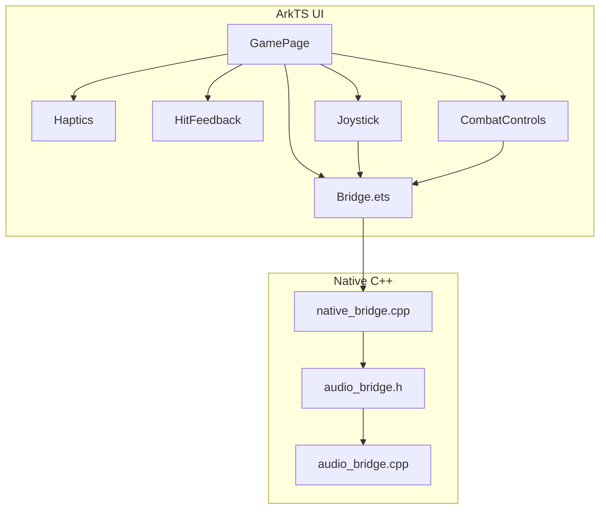
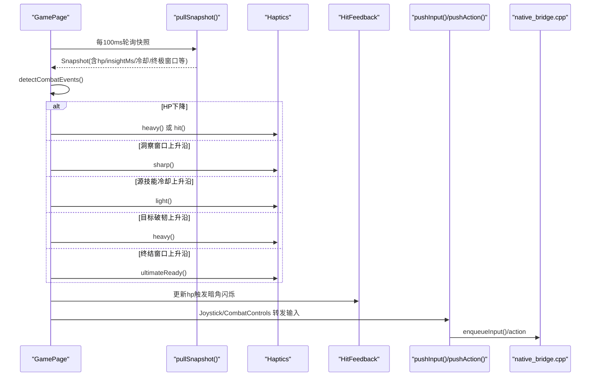
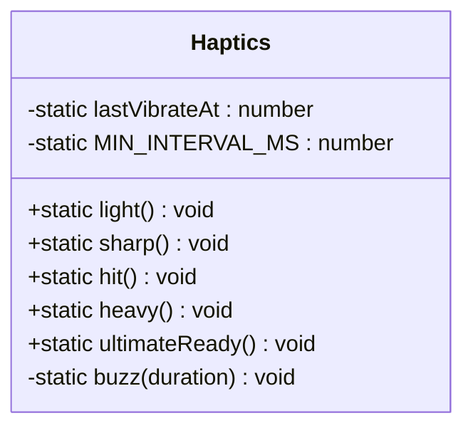
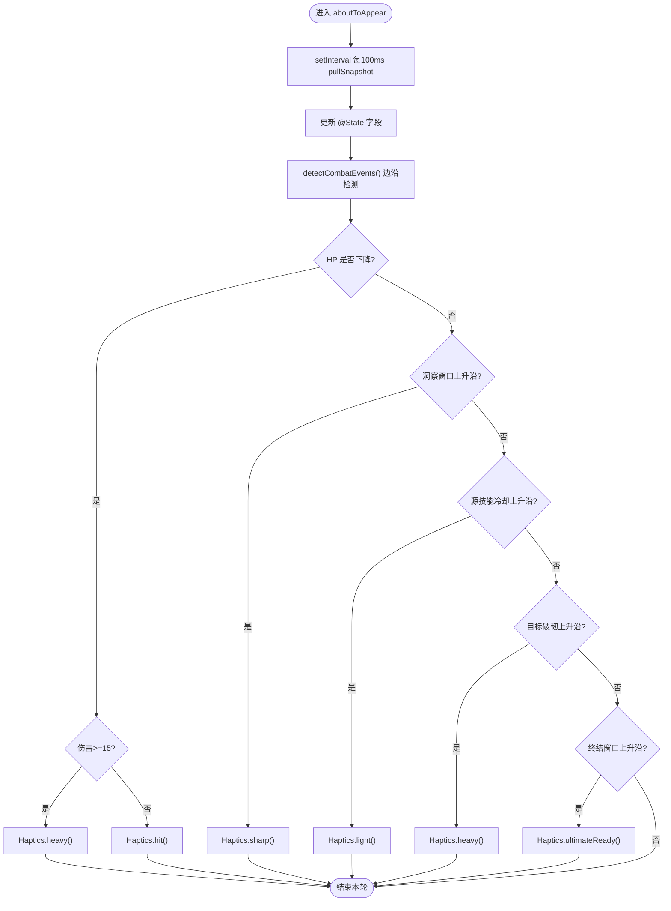
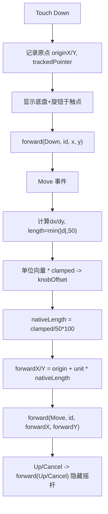
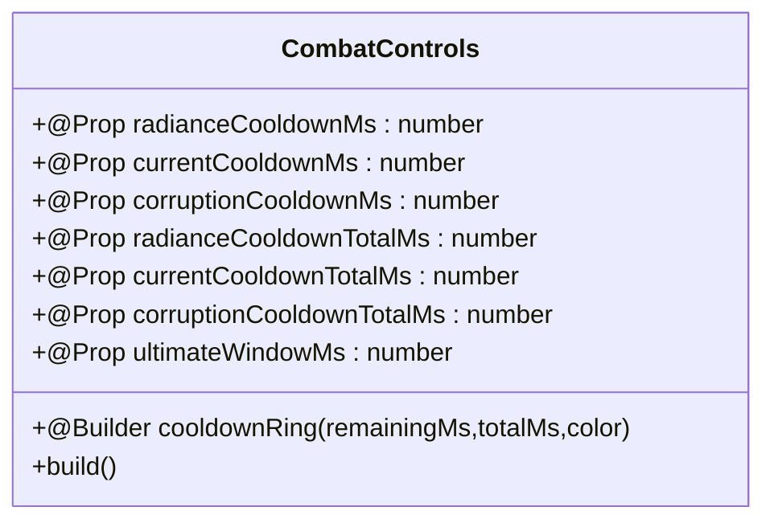
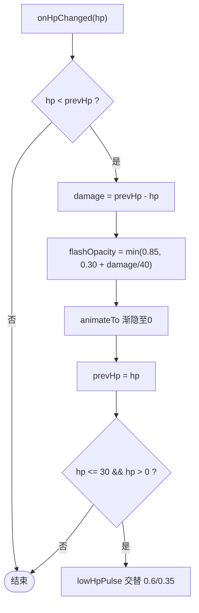
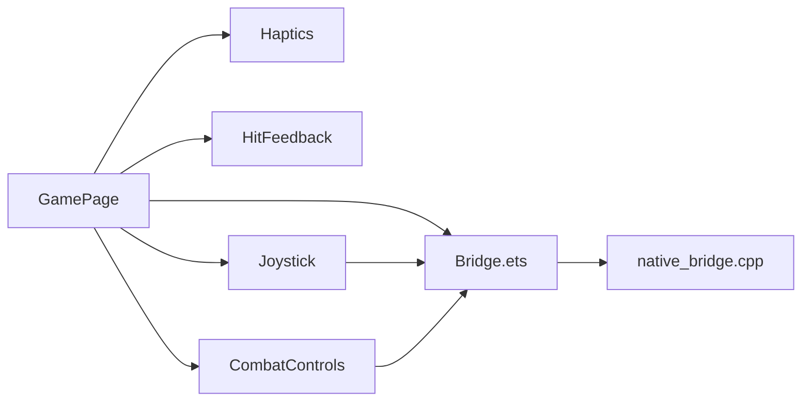

# 震动反馈系统

<cite>
**本文引用的文件**   
- [Haptics.ets](file://entry/src/main/ets/ui/Haptics.ets)
- [GamePage.ets](file://entry/src/main/ets/pages/GamePage.ets)
- [Bridge.ets](file://entry/src/main/ets/napi/Bridge.ets)
- [native_bridge.cpp](file://entry/src/main/cpp/native_bridge.cpp)
- [Joystick.ets](file://entry/src/main/ets/ui/Joystick.ets)
- [CombatControls.ets](file://entry/src/main/ets/ui/CombatControls.ets)
- [HitFeedback.ets](file://entry/src/main/ets/ui/HitFeedback.ets)
- [audio_bridge.h](file://native/platform/harmony/audio_bridge.h)
- [audio_bridge.cpp](file://native/platform/harmony/audio_bridge.cpp)
- [test_bridge_contract.mjs](file://tests/test_bridge_contract.mjs)
</cite>

## 目录
1. [简介](#简介)
2. [项目结构](#项目结构)
3. [核心组件](#核心组件)
4. [架构总览](#架构总览)
5. [详细组件分析](#详细组件分析)
6. [依赖关系分析](#依赖关系分析)
7. [性能考量](#性能考量)
8. [故障排查指南](#故障排查指南)
9. [结论](#结论)
10. [附录](#附录)

## 简介
本文件围绕“震动反馈系统”展开，聚焦 ArkTS 层的触感（振动）与受击视觉反馈，以及操控层（摇杆、技能按钮、调试面板）的商业化重塑。系统以 GamePage 为中枢，通过快照轮询检测战斗事件边沿，驱动 Haptics 触发不同强度的振动；同时 HitFeedback 提供屏幕边缘受击暗角与低血量脉冲提示。操控层采用纯 ArkTS 实现：动态浮出摇杆、弧形圆形技能按钮（冷却环+终结技高亮+按压反馈）、调试按钮收纳为侧拉面板，不改动 native 逻辑。

## 项目结构
- UI 层（ArkTS）
  - 震动与受击反馈：Haptics.ets、HitFeedback.ets
  - 页面编排：GamePage.ets
  - 操控交互：Joystick.ets、CombatControls.ets
  - NAPI 桥接声明：Bridge.ets
- Native 层（C++/NAPI）
  - 输入与渲染桥接：native_bridge.cpp
  - 音频占位桥接：audio_bridge.h/.cpp（预留音效分发）
- 测试与契约校验
  - test_bridge_contract.mjs：断言权限、API 使用、组件挂载等

**图表来源** 
- [GamePage.ets:1-411](file://entry/src/main/ets/pages/GamePage.ets#L1-L411)
- [Haptics.ets:1-60](file://entry/src/main/ets/ui/Haptics.ets#L1-L60)
- [HitFeedback.ets:1-71](file://entry/src/main/ets/ui/HitFeedback.ets#L1-L71)
- [Joystick.ets:1-174](file://entry/src/main/ets/ui/Joystick.ets#L1-L174)
- [CombatControls.ets:1-246](file://entry/src/main/ets/ui/CombatControls.ets#L1-L246)
- [Bridge.ets:1-100](file://entry/src/main/ets/napi/Bridge.ets#L1-L100)
- [native_bridge.cpp:1-607](file://entry/src/main/cpp/native_bridge.cpp#L1-L607)
- [audio_bridge.h:1-27](file://native/platform/harmony/audio_bridge.h#L1-L27)
- [audio_bridge.cpp:1-46](file://native/platform/harmony/audio_bridge.cpp#L1-L46)

**章节来源**
- [GamePage.ets:1-411](file://entry/src/main/ets/pages/GamePage.ets#L1-L411)
- [Bridge.ets:1-100](file://entry/src/main/ets/napi/Bridge.ets#L1-L100)
- [native_bridge.cpp:1-607](file://entry/src/main/cpp/native_bridge.cpp#L1-L607)

## 核心组件
- Haptics：封装鸿蒙 vibrator API，提供轻触/利落短振/受击/重振/终结技就绪五种触感模式，内置最小间隔防抖与全局开关 hapticsEnabled。
- GamePage：每 100ms 轮询快照，比较相邻帧边沿变化，触发对应 Haptics 方法；同时挂载 HitFeedback、Joystick、CombatControls 等 UI。
- Joystick：左半屏触摸捕获，计算旋钮位移并换算为 native 半径下的满量程值，经 pushInput 转发给 native VirtualJoystick。
- CombatControls：右下角弧形技能按钮，带冷却环、终结技呼吸高亮、按压反馈；右上角菜单按钮收纳调试面板。
- HitFeedback：受击时屏幕边缘红色暗角闪烁，低血量持续脉冲提示危险状态。
- Bridge/Native：统一暴露 pushInput/pushAction/pullSnapshot 等接口，将 ArkTS 调用映射到 native 输入队列与游戏循环。

**章节来源**
- [Haptics.ets:1-60](file://entry/src/main/ets/ui/Haptics.ets#L1-L60)
- [GamePage.ets:120-160](file://entry/src/main/ets/pages/GamePage.ets#L120-L160)
- [Joystick.ets:1-174](file://entry/src/main/ets/ui/Joystick.ets#L1-L174)
- [CombatControls.ets:1-246](file://entry/src/main/ets/ui/CombatControls.ets#L1-L246)
- [HitFeedback.ets:1-71](file://entry/src/main/ets/ui/HitFeedback.ets#L1-L71)
- [Bridge.ets:1-100](file://entry/src/main/ets/napi/Bridge.ets#L1-L100)
- [native_bridge.cpp:212-275](file://entry/src/main/cpp/native_bridge.cpp#L212-L275)

## 架构总览
震动反馈系统的控制流从 GamePage 的快照轮询开始，检测 HP、洞察窗口、源技能冷却、破韧、终结窗口的上升沿，调用 Haptics 的不同方法；UI 层通过 Bridge 与 native 通信，Joystick 与 CombatControls 分别处理移动与动作输入。

**图表来源** 
- [GamePage.ets:323-398](file://entry/src/main/ets/pages/GamePage.ets#L323-L398)
- [Haptics.ets:1-60](file://entry/src/main/ets/ui/Haptics.ets#L1-L60)
- [HitFeedback.ets:1-71](file://entry/src/main/ets/ui/HitFeedback.ets#L1-L71)
- [Joystick.ets:24-90](file://entry/src/main/ets/ui/Joystick.ets#L24-L90)
- [CombatControls.ets:72-166](file://entry/src/main/ets/ui/CombatControls.ets#L72-L166)
- [native_bridge.cpp:212-275](file://entry/src/main/cpp/native_bridge.cpp#L212-L275)

## 详细组件分析

### Haptics 组件分析
- 设计要点
  - 基于 @kit.SensorServiceKit 的 vibrator.startVibration，按 duration 区分触感强度。
  - MIN_INTERVAL_MS=40ms 防止高频事件导致振动糊化。
  - 全局开关 AppStorage('hapticsEnabled') 支持用户关闭触感。
  - 失败静默降级（设备不支持/权限缺失），不影响游戏运行。
- 对外方法
  - light/sharp/hit/heavy/ultimateReady 对应不同战斗事件。
- 复杂度与性能
  - O(1) 调用，内部仅时间戳比较与一次系统调用，开销极低。

**图表来源** 
- [Haptics.ets:1-60](file://entry/src/main/ets/ui/Haptics.ets#L1-L60)

**章节来源**
- [Haptics.ets:1-60](file://entry/src/main/ets/ui/Haptics.ets#L1-L60)

### GamePage 震动触发流程
- 快照轮询：每 100ms pullSnapshot，赋值各 @State。
- 边沿检测：compare 上一帧与当前帧，识别 HP 下降、洞察窗口上升沿、源技能冷却上升沿、目标破韧上升沿、终结窗口上升沿。
- 触发 Haptics：根据事件类型选择 light/sharp/hit/heavy/ultimateReady。
- UI 联动：同步更新 HitFeedback、Joystick、CombatControls 等组件。

**图表来源** 
- [GamePage.ets:323-398](file://entry/src/main/ets/pages/GamePage.ets#L323-L398)
- [GamePage.ets:124-159](file://entry/src/main/ets/pages/GamePage.ets#L124-L159)

**章节来源**
- [GamePage.ets:120-160](file://entry/src/main/ets/pages/GamePage.ets#L120-L160)
- [GamePage.ets:323-398](file://entry/src/main/ets/pages/GamePage.ets#L323-L398)

### Joystick 触摸路由与坐标换算
- 触摸捕获：左半屏 Stack 捕获 TouchType Down/Move/Up/Cancel。
- 坐标换算：视觉行程 KNOB_TRAVEL=50vp，换算为 native 半径 NATIVE_RADIUS=100，保证旋钮拉满=满速。
- 输入转发：forward(type, pointerId, x, y) -> pushInput -> native enqueueInput。
- 视觉反馈：底盘圆环+四向刻度点，旋钮渐变实心圆，按下亮度提升；空闲提示淡入淡出。

**图表来源** 
- [Joystick.ets:24-90](file://entry/src/main/ets/ui/Joystick.ets#L24-L90)

**章节来源**
- [Joystick.ets:1-174](file://entry/src/main/ets/ui/Joystick.ets#L1-L174)
- [native_bridge.cpp:212-250](file://entry/src/main/cpp/native_bridge.cpp#L212-L250)

### CombatControls 技能按钮与冷却环
- 布局：右下角弧形布局，普攻主钮贴角，闪避左侧，终结上方，辉印/脉流/蚀质弧形排列。
- 冷却环：Progress(Ring) 叠加在按钮上，剩余秒数文本居中，动画平滑 100ms。
- 终结技高亮：当 ultimateWindowMs > 0 时金色呼吸动画，否则置灰。
- 调试面板：右上角菜单按钮展开/收起，包含训练/兽群/混战/守卫/流程/首领/推进/补给/重试/调试。

**图表来源** 
- [CombatControls.ets:1-246](file://entry/src/main/ets/ui/CombatControls.ets#L1-L246)

**章节来源**
- [CombatControls.ets:1-246](file://entry/src/main/ets/ui/CombatControls.ets#L1-L246)

### HitFeedback 受击视觉反馈
- 机制：HP 下降时计算 damage，设置 flashOpacity 峰值随伤害缩放，随后渐隐。
- 低血量：<=30 时持续脉冲暗角，透明度在 0.35~0.6 之间交替。
- 渲染：径向渐变实现暗角效果，hitTestBehavior 透明透传。

**图表来源** 
- [HitFeedback.ets:1-71](file://entry/src/main/ets/ui/HitFeedback.ets#L1-L71)

**章节来源**
- [HitFeedback.ets:1-71](file://entry/src/main/ets/ui/HitFeedback.ets#L1-L71)

### 音频占位桥接（预留）
- AudioBridge 提供 start/stop/dispatch 接口，当前为占位实现，未来可接入 OHAudioRenderer 进行程序化 PCM 合成音效。

**章节来源**
- [audio_bridge.h:1-27](file://native/platform/harmony/audio_bridge.h#L1-L27)
- [audio_bridge.cpp:1-46](file://native/platform/harmony/audio_bridge.cpp#L1-L46)

## 依赖关系分析
- ArkTS 层依赖
  - GamePage 依赖 Bridge（NAPI 导出）、Haptics、HitFeedback、Joystick、CombatControls。
  - Joystick/CombatControls 依赖 Bridge 的 pushInput/pushAction。
- Native 层依赖
  - native_bridge.cpp 暴露 pushInput/pushAction/pullSnapshot 等，将输入入队到 Loop。
  - audio_bridge 作为占位，未参与当前震动链路。

**图表来源** 
- [GamePage.ets:1-411](file://entry/src/main/ets/pages/GamePage.ets#L1-L411)
- [Bridge.ets:1-100](file://entry/src/main/ets/napi/Bridge.ets#L1-L100)
- [native_bridge.cpp:1-607](file://entry/src/main/cpp/native_bridge.cpp#L1-L607)

**章节来源**
- [GamePage.ets:1-411](file://entry/src/main/ets/pages/GamePage.ets#L1-L411)
- [Bridge.ets:1-100](file://entry/src/main/ets/napi/Bridge.ets#L1-L100)
- [native_bridge.cpp:1-607](file://entry/src/main/cpp/native_bridge.cpp#L1-L607)

## 性能考量
- 震动频率限制：MIN_INTERVAL_MS=40ms 避免连续高频振动造成糊化与卡顿。
- 快照轮询：100ms 间隔平衡了响应性与刷新开销，适合移动端。
- UI 动画：冷却环与受击暗角使用轻量 animateTo，避免复杂计算。
- 输入转换：Joystick 的坐标换算为 O(1)，无额外内存分配。

[本节为通用指导，无需特定文件引用]

## 故障排查指南
- 无振动输出
  - 检查模块权限是否包含 VIBRATE（测试断言要求）。
  - 确认 AppStorage('hapticsEnabled') 未被设置为 false。
  - 查看 Haptics.buzz 的 catch 分支是否被触发（静默降级）。
- 受击暗角不闪烁
  - 确认 HitFeedback.onHpChanged 被调用且 hp 确实下降。
  - 检查 LOW_HP_THRESHOLD 阈值与 pulse 动画是否生效。
- 摇杆无效
  - 确认 Joystick 的 onTouch 已捕获 Down/Move/Up。
  - 核对 pushInput 参数 type/pointerId/x/y 是否符合 native 期望。
- 技能按钮无反馈
  - 检查 CombatControls 的 onClick 是否调用 pushAction。
  - 确认冷却环与终结高亮状态由快照正确驱动。

**章节来源**
- [test_bridge_contract.mjs:467-486](file://tests/test_bridge_contract.mjs#L467-L486)
- [Haptics.ets:1-60](file://entry/src/main/ets/ui/Haptics.ets#L1-L60)
- [HitFeedback.ets:1-71](file://entry/src/main/ets/ui/HitFeedback.ets#L1-L71)
- [Joystick.ets:24-90](file://entry/src/main/ets/ui/Joystick.ets#L24-L90)
- [CombatControls.ets:72-166](file://entry/src/main/ets/ui/CombatControls.ets#L72-L166)

## 结论
震动反馈系统以 GamePage 为中心，通过快照边沿检测精准触发不同强度的振动，配合 HitFeedback 的受击暗角与低血量脉冲，形成完整的“触觉+视觉”打击感闭环。操控层商业化重塑在纯 ArkTS 层面完成，摇杆与技能按钮具备跟手性、冷却可视化与调试面板收纳能力，满足正式上架手游标准。后续可扩展音频占位桥接与更多打击感包装（飘字、边缘泛红等）。

[本节为总结性内容，无需特定文件引用]

## 附录
- 关键常量与配置
  - NATIVE_RADIUS=100，KNOB_TRAVEL=50vp，BASE_SIZE=120，KNOB_SIZE=52，TICK_SIZE=6（摇杆）
  - LOW_HP_THRESHOLD=30（受击暗角）
  - MIN_INTERVAL_MS=40ms（震动最小间隔）
- 测试断言要点
  - module.json5 需请求 ohos.permission.VIBRATE
  - Haptics 必须使用 SensorServiceKit 的 vibrator API，并暴露 light/sharp/hit/heavy/ultimateReady
  - GamePage 必须导入 Haptics 并在每轮 poll 中执行 detectCombatEvents
  - CombatControls 必须接受冷却总时长 @Prop，并使用冷却环而非硬编码常量

**章节来源**
- [Joystick.ets:1-174](file://entry/src/main/ets/ui/Joystick.ets#L1-L174)
- [HitFeedback.ets:1-71](file://entry/src/main/ets/ui/HitFeedback.ets#L1-L71)
- [Haptics.ets:1-60](file://entry/src/main/ets/ui/Haptics.ets#L1-L60)
- [test_bridge_contract.mjs:467-486](file://tests/test_bridge_contract.mjs#L467-L486)
- [CombatControls.ets:1-246](file://entry/src/main/ets/ui/CombatControls.ets#L1-L246)