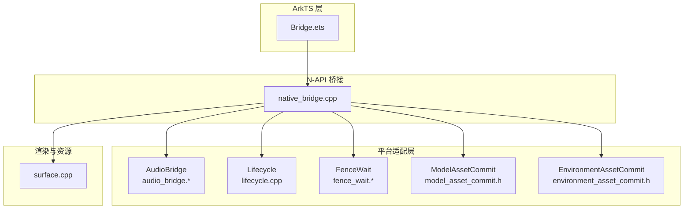
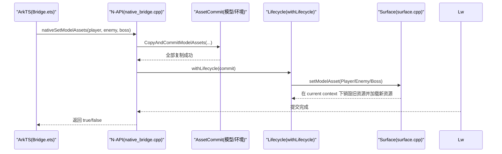
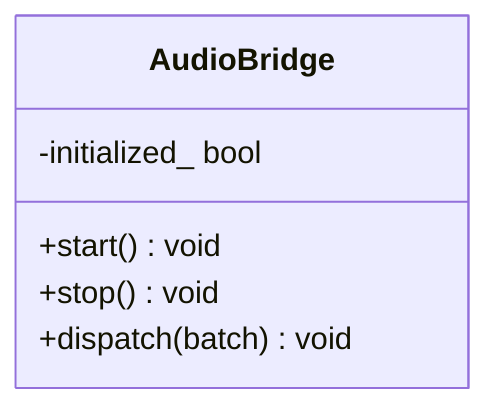
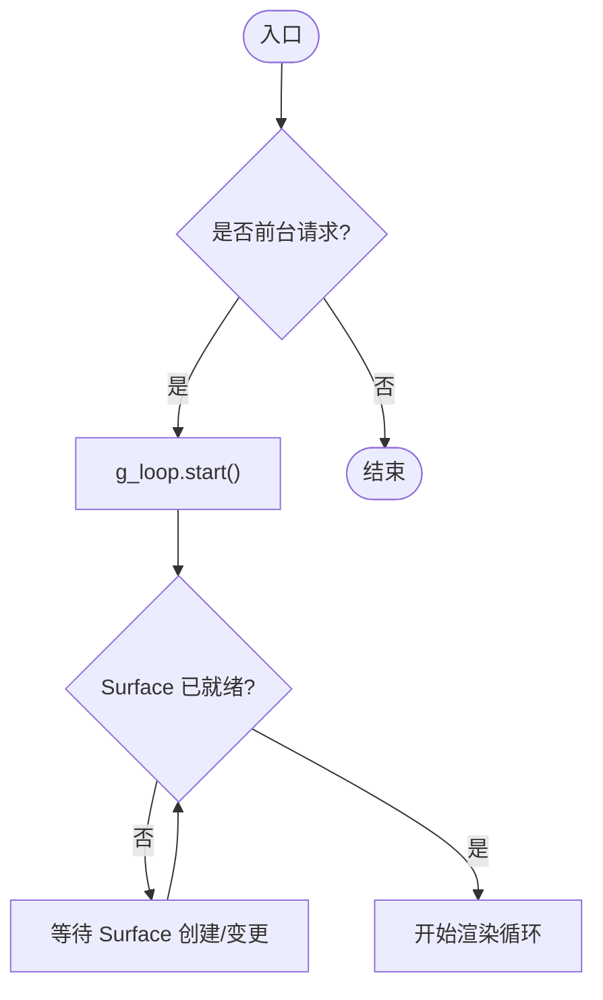
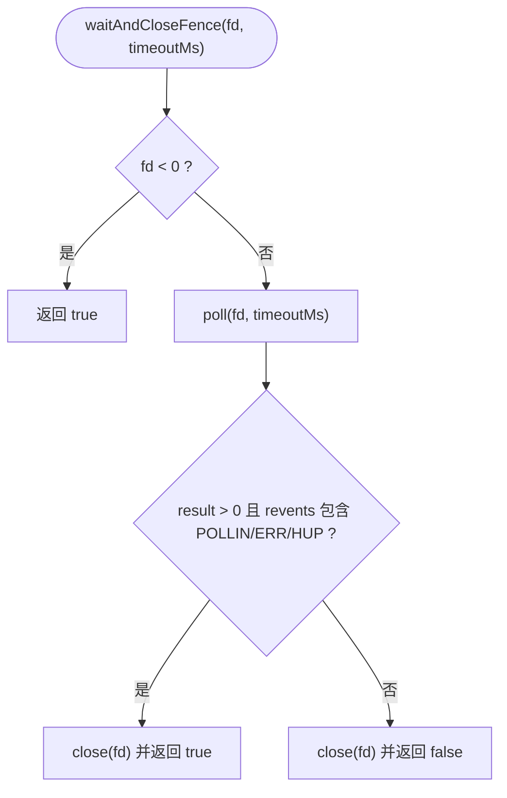
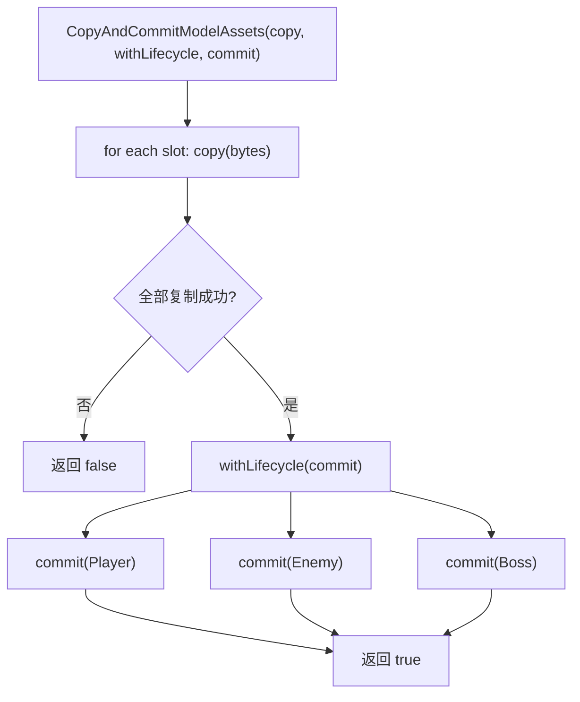
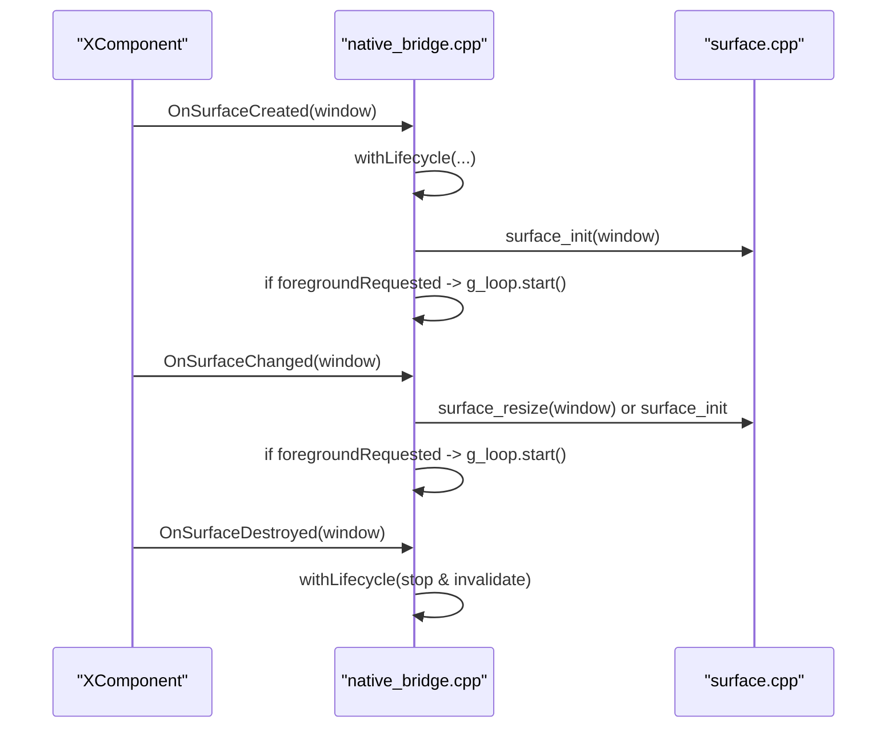
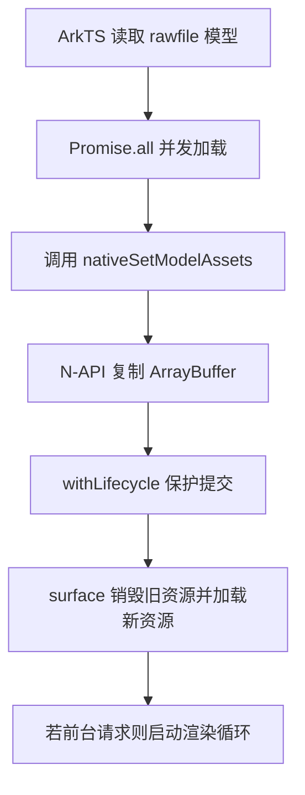
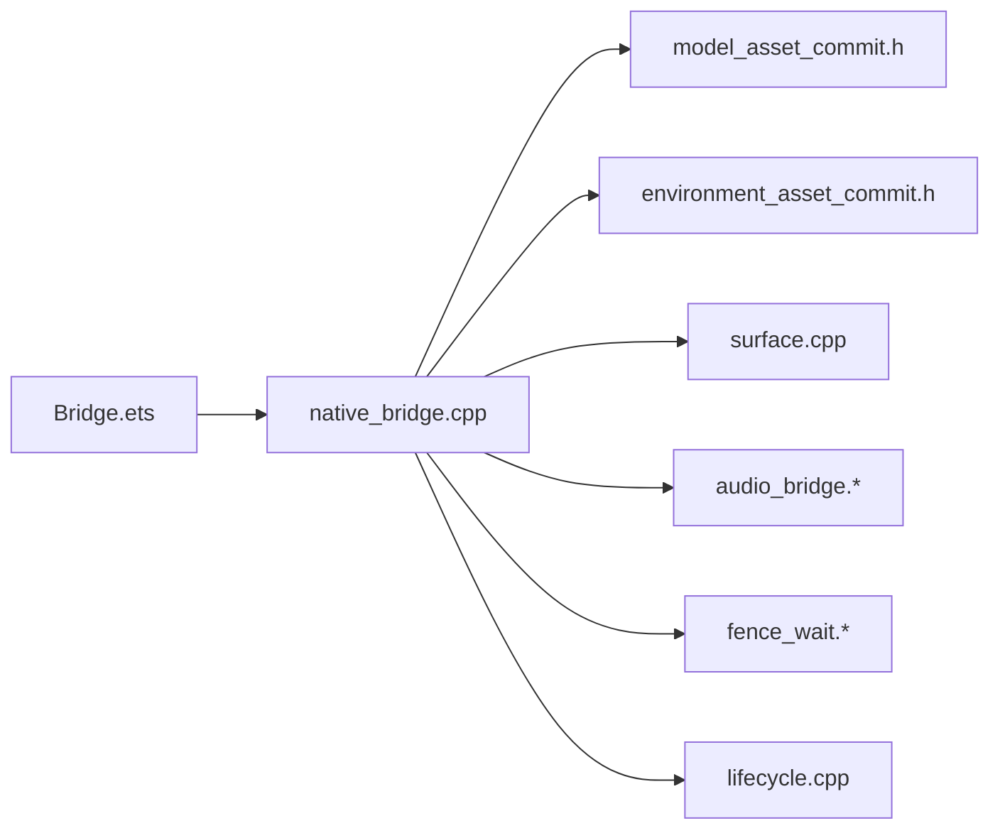

# 平台适配层

<cite>
**本文引用的文件**
- [native_bridge.cpp](file://entry/src/main/cpp/native_bridge.cpp)
- [Bridge.ets](file://entry/src/main/ets/napi/Bridge.ets)
- [audio_bridge.h](file://native/platform/harmony/audio_bridge.h)
- [audio_bridge.cpp](file://native/platform/harmony/audio_bridge.cpp)
- [lifecycle.cpp](file://native/platform/harmony/lifecycle.cpp)
- [fence_wait.h](file://native/platform/harmony/fence_wait.h)
- [fence_wait.cpp](file://native/platform/harmony/fence_wait.cpp)
- [model_asset_commit.h](file://native/platform/harmony/model_asset_commit.h)
- [environment_asset_commit.h](file://native/platform/harmony/environment_asset_commit.h)
- [surface.cpp](file://native/engine/render/surface.cpp)
- [test_bridge_contract.mjs](file://tests/test_bridge_contract.mjs)
</cite>

## 目录
1. [简介](#简介)
2. [项目结构](#项目结构)
3. [核心组件](#核心组件)
4. [架构总览](#架构总览)
5. [详细组件分析](#详细组件分析)
6. [依赖关系分析](#依赖关系分析)
7. [性能考量](#性能考量)
8. [故障排查指南](#故障排查指南)
9. [结论](#结论)
10. [附录](#附录)

## 简介
本技术文档聚焦 my-world 在 HarmonyOS 上的平台适配层，系统性阐述音频桥接、生命周期管理、GPU 同步与资源提交机制的设计与实现。重点覆盖：
- AudioBridge 的音频系统封装与降级策略
- Lifecycle 的生命周期协调（前台/后台、Surface 生命周期）
- FenceWait 的 GPU 同步原语
- AssetCommit 的资源批量复制与原子提交
- 平台 API 抽象设计与跨平台兼容性处理
- 平台特定性能优化与内存管理
- HarmonyOS 特有的限制与要求
- 开发与调试指南

## 项目结构
平台适配层位于 native/platform/harmony 与 entry/src/main/cpp 的 N-API 桥接中，渲染与资源管理由 engine/render/surface.cpp 承载，ETS 侧通过 Bridge.ets 暴露统一接口。

图表来源
- [Bridge.ets:1-94](file://entry/src/main/ets/napi/Bridge.ets#L1-L94)
- [native_bridge.cpp:1-577](file://entry/src/main/cpp/native_bridge.cpp#L1-L577)
- [audio_bridge.h:1-27](file://native/platform/harmony/audio_bridge.h#L1-L27)
- [audio_bridge.cpp:1-46](file://native/platform/harmony/audio_bridge.cpp#L1-L46)
- [lifecycle.cpp:1-5](file://native/platform/harmony/lifecycle.cpp#L1-L5)
- [fence_wait.h:1-5](file://native/platform/harmony/fence_wait.h#L1-L5)
- [fence_wait.cpp:1-23](file://native/platform/harmony/fence_wait.cpp#L1-L23)
- [model_asset_commit.h:1-30](file://native/platform/harmony/model_asset_commit.h#L1-L30)
- [environment_asset_commit.h:1-36](file://native/platform/harmony/environment_asset_commit.h#L1-L36)
- [surface.cpp:481-503](file://native/engine/render/surface.cpp#L481-L503)

章节来源
- [Bridge.ets:1-94](file://entry/src/main/ets/napi/Bridge.ets#L1-L94)
- [native_bridge.cpp:1-577](file://entry/src/main/cpp/native_bridge.cpp#L1-L577)

## 核心组件
- AudioBridge：对 OHAudioRenderer 的轻量封装，提供 start/stop/dispatch，无能力时静默降级为静音 no-op。
- Lifecycle：监听应用与 Surface 生命周期，协调 Loop::start()/stop()，并在进入后台前保存状态（预留接口）。
- FenceWait：基于 poll 等待 producer fence fd 就绪并安全关闭，保证 GPU 同步与句柄释放。
- ModelAssetCommit / EnvironmentAssetCommit：将多份 ArrayBuffer 复制到内部存储后，在生命周期锁内一次性提交，避免部分更新导致的中间态。
- N-API 桥接：暴露 nativeStart/Stop/SetModelAssets/SetEnvironmentAssets/PushInput/PushAction/Snapshot 等接口，统一 ArkTS 与 C++ 交互。
- Surface：GL/EGL 初始化、模型与环境资产替换、回退渲染、环境绘制统计与准备状态。

章节来源
- [audio_bridge.h:1-27](file://native/platform/harmony/audio_bridge.h#L1-L27)
- [audio_bridge.cpp:1-46](file://native/platform/harmony/audio_bridge.cpp#L1-L46)
- [lifecycle.cpp:1-5](file://native/platform/harmony/lifecycle.cpp#L1-L5)
- [fence_wait.h:1-5](file://native/platform/harmony/fence_wait.h#L1-L5)
- [fence_wait.cpp:1-23](file://native/platform/harmony/fence_wait.cpp#L1-L23)
- [model_asset_commit.h:1-30](file://native/platform/harmony/model_asset_commit.h#L1-L30)
- [environment_asset_commit.h:1-36](file://native/platform/harmony/environment_asset_commit.h#L1-L36)
- [native_bridge.cpp:151-210](file://entry/src/main/cpp/native_bridge.cpp#L151-L210)
- [surface.cpp:481-503](file://native/engine/render/surface.cpp#L481-L503)

## 架构总览
整体数据流从 ArkTS 发起调用，经 N-API 进入 C++ 层，平台适配层完成资源复制、生命周期保护与提交，最终由 surface.cpp 在 GL 上下文内执行资源替换与渲染。

图表来源
- [native_bridge.cpp:151-185](file://entry/src/main/cpp/native_bridge.cpp#L151-L185)
- [model_asset_commit.h:15-29](file://native/platform/harmony/model_asset_commit.h#L15-L29)
- [surface.cpp:481-497](file://native/engine/render/surface.cpp#L481-L497)

## 详细组件分析

### AudioBridge：音频系统封装
- 设计要点
  - 仅在有 OHAudioRenderer 支持时启用；否则 start/dispatch 均为 no-op。
  - dispatch 根据 CombatEventBatch 映射到程序化 PCM 合成音效（占位实现）。
- 关键方法
  - start：初始化音频渲染器（当前为占位）。
  - stop：释放音频资源（当前为占位）。
  - dispatch：事件到音效的映射（当前为占位）。
- 错误与降级
  - 不支持时不抛错，保持静音运行，确保游戏逻辑不受影响。

图表来源
- [audio_bridge.h:7-26](file://native/platform/harmony/audio_bridge.h#L7-L26)
- [audio_bridge.cpp:7-45](file://native/platform/harmony/audio_bridge.cpp#L7-L45)

章节来源
- [audio_bridge.h:1-27](file://native/platform/harmony/audio_bridge.h#L1-L27)
- [audio_bridge.cpp:1-46](file://native/platform/harmony/audio_bridge.cpp#L1-L46)

### Lifecycle：生命周期协调
- 职责
  - 监听 OH_Application_* / ability 前后台切换。
  - 暂停时调用 Loop::stop()，恢复时调用 Loop::start()。
  - 进入后台前触发 Save::write（预留接口，M3 接入真机回调）。
- 与 N-API 集成
  - OnSurfaceCreated/Changed/Destroyed 均包裹 in withLifecycle，确保在正确线程/上下文执行。
  - NativeStart/Stop/StartIfForeground 使用 g_foregroundRequested 控制前台请求，避免后台覆盖。

图表来源
- [native_bridge.cpp:130-149](file://entry/src/main/cpp/native_bridge.cpp#L130-L149)
- [native_bridge.cpp:59-111](file://entry/src/main/cpp/native_bridge.cpp#L59-L111)
- [lifecycle.cpp:1-5](file://native/platform/harmony/lifecycle.cpp#L1-L5)

章节来源
- [lifecycle.cpp:1-5](file://native/platform/harmony/lifecycle.cpp#L1-L5)
- [native_bridge.cpp:59-111](file://entry/src/main/cpp/native_bridge.cpp#L59-L111)
- [native_bridge.cpp:130-149](file://entry/src/main/cpp/native_bridge.cpp#L130-L149)

### FenceWait：GPU 同步
- 功能
  - 等待 producer fence fd 就绪，支持超时，确保非负 fd 被安全关闭。
  - 使用 poll 轮询，兼容 EINTR/EAGAIN。
- 适用场景
  - 在 GPU 命令队列或外部生产者完成信号到达后，安全推进后续 CPU/GPU 操作。

图表来源
- [fence_wait.cpp:7-22](file://native/platform/harmony/fence_wait.cpp#L7-L22)

章节来源
- [fence_wait.h:1-5](file://native/platform/harmony/fence_wait.h#L1-L5)
- [fence_wait.cpp:1-23](file://native/platform/harmony/fence_wait.cpp#L1-L23)

### AssetCommit：资源管理与原子提交
- 模型资产提交
  - CopyAndCommitModelAssets：先复制三份 ArrayBuffer，成功后在 withLifecycle 保护的临界区内依次提交 Player/Enemy/Boss。
  - 失败路径：任一复制失败直接返回 false，不进入生命周期锁。
- 环境资产提交
  - CopyAndCommitEnvironmentAssets：复制 OuterRing/CenterRift/Backdrop/Decoration 四份数据，再在生命周期锁内提交。
- 优势
  - 避免部分更新导致的中间态不一致。
  - 与 surface.cpp 的“current context 下销毁旧资源再加载”流程配合，保证线程安全。

图表来源
- [model_asset_commit.h:15-29](file://native/platform/harmony/model_asset_commit.h#L15-L29)
- [environment_asset_commit.h:18-35](file://native/platform/harmony/environment_asset_commit.h#L18-L35)
- [native_bridge.cpp:151-210](file://entry/src/main/cpp/native_bridge.cpp#L151-L210)

章节来源
- [model_asset_commit.h:1-30](file://native/platform/harmony/model_asset_commit.h#L1-L30)
- [environment_asset_commit.h:1-36](file://native/platform/harmony/environment_asset_commit.h#L1-L36)
- [native_bridge.cpp:151-210](file://entry/src/main/cpp/native_bridge.cpp#L151-L210)

### N-API 桥接与 Surface 集成
- 主要接口
  - nativeStart/nativeStop/nativeStartIfForeground：控制渲染循环前台状态。
  - nativeSetModelAssets/nativeSetEnvironmentAssets：批量注入资源。
  - pushInput/pushAction：输入事件入队。
  - pullSnapshot：拉取游戏快照供 UI 消费。
- Surface 集成
  - OnSurfaceCreated/Changed/Destroyed 中调用 surface_init/resize，必要时停止循环并清理。
  - 资源替换在 withLifecycle 保护下进行，确保在 GL current context 内释放旧资源并加载新资源。

图表来源
- [native_bridge.cpp:59-111](file://entry/src/main/cpp/native_bridge.cpp#L59-L111)
- [surface.cpp:1355-1362](file://native/engine/render/surface.cpp#L1355-L1362)

章节来源
- [native_bridge.cpp:1-577](file://entry/src/main/cpp/native_bridge.cpp#L1-L577)
- [surface.cpp:1355-1362](file://native/engine/render/surface.cpp#L1355-L1362)

### 概念性概览
以下流程图展示一次完整的模型资源注入与渲染启动过程（概念示意，不绑定具体代码行号）：

[本图为概念流程，无需图表来源]

## 依赖关系分析
- 模块耦合
  - N-API 桥接依赖 platform/harmony 的 AssetCommit 与 lifecycle 工具，以及 engine/render/surface 的 API。
  - AudioBridge 与 FenceWait 作为独立工具，按需引入。
- 外部依赖
  - OH_NativeXComponent：Surface 生命周期与触摸事件。
  - EGL/GL：图形后端初始化与渲染。
  - N-API：ArkTS 与 C++ 互操作。

图表来源
- [Bridge.ets:1-94](file://entry/src/main/ets/napi/Bridge.ets#L1-L94)
- [native_bridge.cpp:1-577](file://entry/src/main/cpp/native_bridge.cpp#L1-L577)
- [model_asset_commit.h:1-30](file://native/platform/harmony/model_asset_commit.h#L1-L30)
- [environment_asset_commit.h:1-36](file://native/platform/harmony/environment_asset_commit.h#L1-L36)
- [audio_bridge.h:1-27](file://native/platform/harmony/audio_bridge.h#L1-L27)
- [fence_wait.h:1-5](file://native/platform/harmony/fence_wait.h#L1-L5)
- [lifecycle.cpp:1-5](file://native/platform/harmony/lifecycle.cpp#L1-L5)
- [surface.cpp:481-503](file://native/engine/render/surface.cpp#L481-L503)

章节来源
- [native_bridge.cpp:1-577](file://entry/src/main/cpp/native_bridge.cpp#L1-L577)
- [surface.cpp:481-503](file://native/engine/render/surface.cpp#L481-L503)

## 性能考量
- 资源提交原子性
  - 通过 CopyAndCommit* 模板函数确保所有数据复制完成后才进入生命周期锁提交，避免中间态与重复重建。
- 线程与上下文安全
  - withLifecycle 保证在正确的线程/上下文内执行资源销毁与加载，减少跨线程访问风险。
- 渲染回退
  - 当 GLES 初始化失败时，禁用软件渲染路径，保持 ArkUI 可用并呈现可恢复状态，避免模拟器崩溃。
- 输入与事件
  - 输入事件通过 enqueueInput 入队，避免阻塞主线程；pushInput/pushAction 严格校验参数类型与范围。
- 内存管理
  - ArrayBuffer 拷贝至 std::vector<uint8_t> 并由 surface 接管生命周期；clearModelAssets 负责清空与重置状态。

章节来源
- [model_asset_commit.h:15-29](file://native/platform/harmony/model_asset_commit.h#L15-L29)
- [environment_asset_commit.h:18-35](file://native/platform/harmony/environment_asset_commit.h#L18-L35)
- [native_bridge.cpp:212-250](file://entry/src/main/cpp/native_bridge.cpp#L212-L250)
- [surface.cpp:1207-1225](file://native/engine/render/surface.cpp#L1207-L1225)
- [surface.cpp:1332-1353](file://native/engine/render/surface.cpp#L1332-L1353)
- [surface.cpp:1192-1205](file://native/engine/render/surface.cpp#L1192-L1205)

## 故障排查指南
- 常见问题
  - Surface 未就绪导致 start 无效：检查 OnSurfaceCreated/Changed 是否成功调用 surface_init/resize。
  - 资源替换失败：确认 CopyArrayBuffer 校验通过，bytes 非空；查看 lastError 日志。
  - 模拟器 GLES 不可用：日志提示“Native software rendering disabled”，需回退到 ArkUI 展示不可用状态。
  - 前台/后台状态冲突：NativeStartIfForeground 不会覆盖 background 请求，确保 g_foregroundRequested 状态正确。
- 定位手段
  - 使用 OH_LOG_Print 输出关键路径日志（如 surface_init、setModelAsset、poll fence）。
  - 通过 pullSnapshot 获取 rendererReady/environmentReady 等状态字段辅助判断。
  - 使用 test_bridge_contract.mjs 断言关键行为是否符合预期。

章节来源
- [native_bridge.cpp:67-75](file://entry/src/main/cpp/native_bridge.cpp#L67-L75)
- [surface.cpp:481-497](file://native/engine/render/surface.cpp#L481-L497)
- [surface.cpp:1332-1353](file://native/engine/render/surface.cpp#L1332-L1353)
- [test_bridge_contract.mjs:223-242](file://tests/test_bridge_contract.mjs#L223-L242)
- [test_bridge_contract.mjs:352-393](file://tests/test_bridge_contract.mjs#L352-L393)

## 结论
my-world 的平台适配层以清晰的模块化与强约束的原子提交机制，实现了在 HarmonyOS 上稳定可靠的音频、生命周期、GPU 同步与资源管理。通过 N-API 桥接与 Surface 集成，既保证了跨平台兼容性，又充分利用了平台特性。未来可在 AudioBridge 与 Lifecycle 中逐步完善真实实现，进一步提升性能与用户体验。

## 附录
- 平台 API 摘要（ArkTS 侧导出）
  - nativeStart/nativeStop/nativeStartIfForeground：控制渲染循环前台状态。
  - nativeSetModelAssets/nativeSetEnvironmentAssets：批量注入模型与环境资源。
  - pushInput/pushAction：输入事件与动作入队。
  - startEncounter/advanceLevel/useSupply/retryBoss/toggleDebugHud/skipDemoPhase：游戏流程控制。
  - pullSnapshot：拉取快照用于 UI 渲染。

章节来源
- [Bridge.ets:77-94](file://entry/src/main/ets/napi/Bridge.ets#L77-L94)
- [native_bridge.cpp:518-561](file://entry/src/main/cpp/native_bridge.cpp#L518-L561)