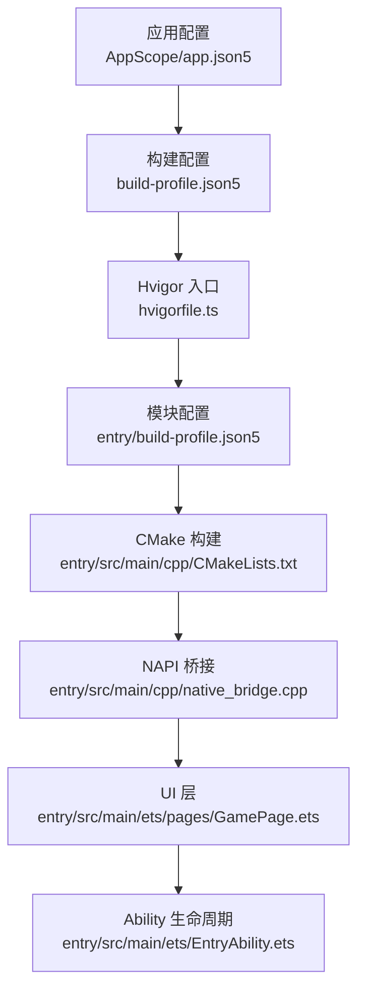
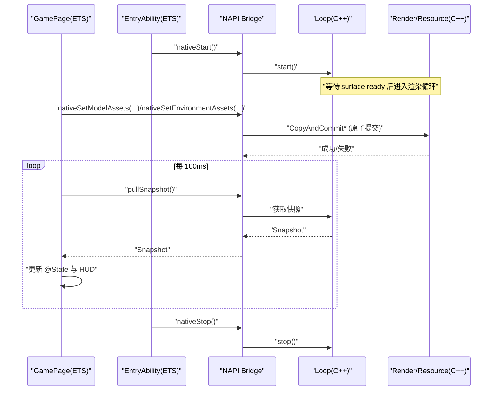
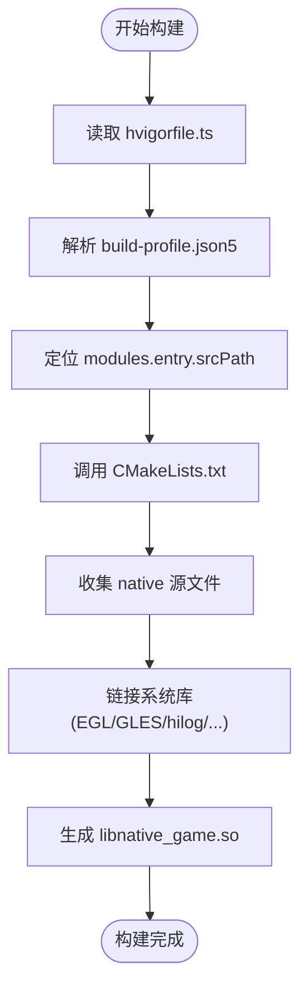
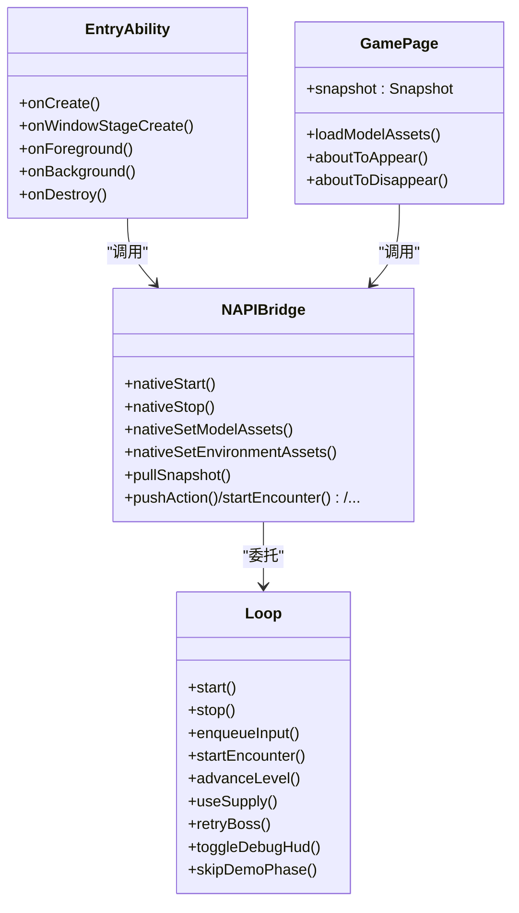
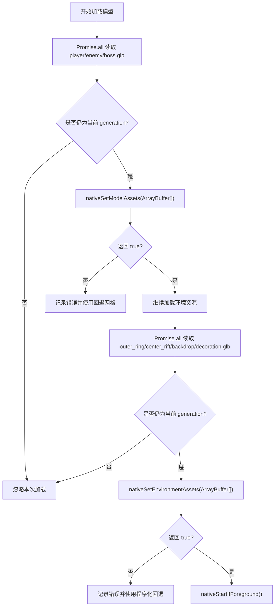
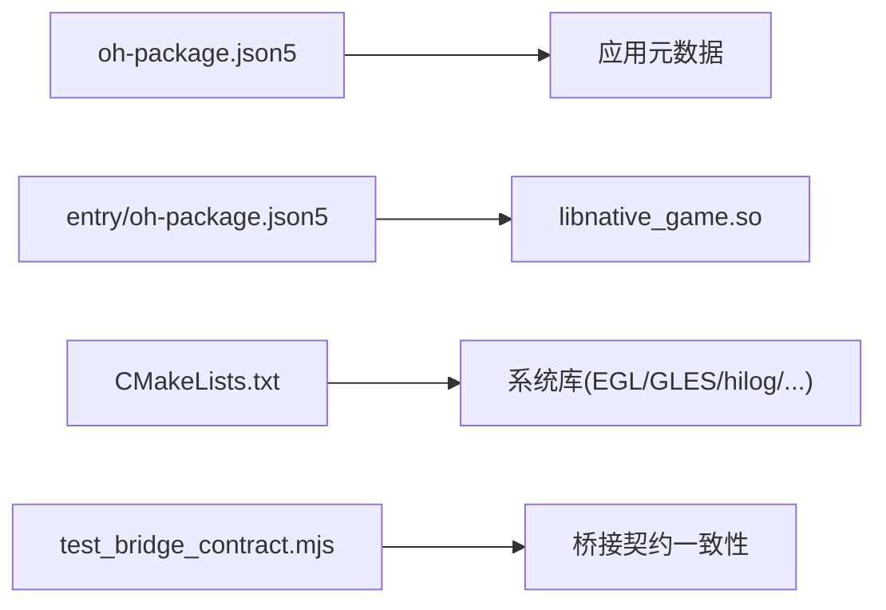

# 开发者指南

<cite>
**本文引用的文件**
- [oh-package.json5](file://oh-package.json5)
- [build-profile.json5](file://build-profile.json5)
- [hvigorfile.ts](file://hvigorfile.ts)
- [.gitignore](file://.gitignore)
- [entry/oh-package.json5](file://entry/oh-package.json5)
- [entry/build-profile.json5](file://entry/build-profile.json5)
- [entry/src/main/module.json5](file://entry/src/main/module.json5)
- [AppScope/app.json5](file://AppScope/app.json5)
- [entry/src/main/cpp/CMakeLists.txt](file://entry/src/main/cpp/CMakeLists.txt)
- [entry/src/main/ets/EntryAbility.ets](file://entry/src/main/ets/EntryAbility.ets)
- [entry/src/main/ets/pages/GamePage.ets](file://entry/src/main/ets/pages/GamePage.ets)
- [tests/test_bridge_contract.mjs](file://tests/test_bridge_contract.mjs)
</cite>

## 目录
1. [简介](#简介)
2. [项目结构](#项目结构)
3. [核心组件](#核心组件)
4. [架构总览](#架构总览)
5. [详细组件分析](#详细组件分析)
6. [依赖分析](#依赖分析)
7. [性能考虑](#性能考虑)
8. [故障排查指南](#故障排查指南)
9. [结论](#结论)
10. [附录](#附录)

## 简介
本指南面向 my-world（HarmonyOS 原生开放世界 RPG）的开发者，涵盖开发环境搭建、代码规范、贡献流程与常见问题解答。文档基于仓库现有配置与源码进行说明，帮助新成员快速上手并高效协作。

## 项目结构
my-world 采用 HarmonyOS Stage 模式工程组织：应用级配置在根目录，入口模块 entry 包含 UI 与 NAPI 桥接，C++ 引擎与游戏逻辑位于 native 目录，构建系统使用 Hvigor + CMake。

- 应用与模块配置
  - AppScope/app.json5：应用包名、版本、最小/目标 API 版本等
  - build-profile.json5：签名、产品、构建模式、ABI 过滤、外部 Native 选项
  - hvigorfile.ts：Hvigor 插件与任务系统入口
  - oh-package.json5：项目元数据与许可证信息
  - entry/build-profile.json5：entry 模块构建选项与 ABI 过滤
  - entry/oh-package.json5：entry 模块对 libnative_game.so 的依赖声明
  - entry/src/main/module.json5：模块类型、入口 Ability、页面路由、权限声明

- 原生与渲染
  - entry/src/main/cpp/CMakeLists.txt：C++ 库 native_game 的源文件集合、头文件路径、编译特性与链接库
  - native/：引擎核心、输入、数学、渲染、表现层、资源加载、平台适配、玩法逻辑等

- 测试与自动化
  - tests/：大量 C++ 与 MJS 测试，覆盖桥接契约、AI、战斗、渲染、资源等
  - automation/：资源拉取与校验脚本、性能采集脚本、规则检查

**图示来源**
- [AppScope/app.json5:1-13](file://AppScope/app.json5#L1-L13)
- [build-profile.json5:1-69](file://build-profile.json5#L1-L69)
- [hvigorfile.ts:1-7](file://hvigorfile.ts#L1-L7)
- [entry/build-profile.json5:1-17](file://entry/build-profile.json5#L1-L17)
- [entry/src/main/cpp/CMakeLists.txt:1-135](file://entry/src/main/cpp/CMakeLists.txt#L1-L135)

**章节来源**
- [AppScope/app.json5:1-13](file://AppScope/app.json5#L1-L13)
- [build-profile.json5:1-69](file://build-profile.json5#L1-L69)
- [hvigorfile.ts:1-7](file://hvigorfile.ts#L1-L7)
- [entry/build-profile.json5:1-17](file://entry/build-profile.json5#L1-L17)
- [entry/src/main/module.json5:1-43](file://entry/src/main/module.json5#L1-L43)
- [entry/src/main/cpp/CMakeLists.txt:1-135](file://entry/src/main/cpp/CMakeLists.txt#L1-L135)

## 核心组件
- EntryAbility：应用生命周期管理，前台/后台时启动/停止原生循环
- GamePage：主页面，负责资源加载、XComponent 渲染、快照轮询与 UI 更新
- NAPI Bridge：ETS 与 C++ 之间的接口封装，暴露 start/stop/pullSnapshot/动作控制等方法
- CMake 构建：聚合 native 目录下的引擎与玩法代码，链接系统库，输出 libnative_game.so
- 测试契约：MJS 测试确保 Bridge、Index.d.ts 与 native_bridge.cpp 的一致性

**章节来源**
- [entry/src/main/ets/EntryAbility.ets:1-44](file://entry/src/main/ets/EntryAbility.ets#L1-L44)
- [entry/src/main/ets/pages/GamePage.ets:1-305](file://entry/src/main/ets/pages/GamePage.ets#L1-L305)
- [entry/src/main/cpp/CMakeLists.txt:1-135](file://entry/src/main/cpp/CMakeLists.txt#L1-L135)
- [tests/test_bridge_contract.mjs:1-414](file://tests/test_bridge_contract.mjs#L1-L414)

## 架构总览
my-world 采用“UI 层（ArkTS）—NAPI 桥接—C++ 引擎”的分层架构。UI 层通过 XComponent 提供渲染表面，NAPI 桥接负责事件与数据交换，C++ 引擎负责游戏循环、渲染、输入处理与玩法逻辑。

**图示来源**
- [entry/src/main/ets/EntryAbility.ets:1-44](file://entry/src/main/ets/EntryAbility.ets#L1-L44)
- [entry/src/main/ets/pages/GamePage.ets:1-305](file://entry/src/main/ets/pages/GamePage.ets#L1-L305)
- [tests/test_bridge_contract.mjs:223-235](file://tests/test_bridge_contract.mjs#L223-L235)

## 详细组件分析

### 构建系统与 ABI/编译器
- 构建工具链：Hvigor + CMake
- ABI 过滤：arm64-v8a、x86_64
- 编译器：BiSheng（HarmonyOS 原生编译器）
- 模块：entry，srcPath 指向 ./entry
- 构建模式：debug/release，debug 开启可调试与外部 Native 选项

**图示来源**
- [hvigorfile.ts:1-7](file://hvigorfile.ts#L1-L7)
- [build-profile.json5:1-69](file://build-profile.json5#L1-L69)
- [entry/build-profile.json5:1-17](file://entry/build-profile.json5#L1-L17)
- [entry/src/main/cpp/CMakeLists.txt:1-135](file://entry/src/main/cpp/CMakeLists.txt#L1-L135)

**章节来源**
- [build-profile.json5:1-69](file://build-profile.json5#L1-L69)
- [entry/build-profile.json5:1-17](file://entry/build-profile.json5#L1-L17)
- [entry/src/main/cpp/CMakeLists.txt:1-135](file://entry/src/main/cpp/CMakeLists.txt#L1-L135)

### 应用与模块配置
- AppScope/app.json5：bundleName、vendor、versionCode/Name、min/target API
- entry/src/main/module.json5：module.type=entry、mainElement=EntryAbility、pages、abilities、权限请求
- entry/oh-package.json5：依赖 libnative_game.so（本地文件引用）

**章节来源**
- [AppScope/app.json5:1-13](file://AppScope/app.json5#L1-L13)
- [entry/src/main/module.json5:1-43](file://entry/src/main/module.json5#L1-L43)
- [entry/oh-package.json5:1-12](file://entry/oh-package.json5#L1-L12)

### 运行时生命周期与 NAPI 桥接
- EntryAbility：onForeground/onBackground 调用 nativeStart/nativeStop
- GamePage：XComponent 绑定 native_game；异步加载 GLB 模型与环境资源；定时 pullSnapshot 驱动 UI
- NAPI Bridge：导出 start/stop/pushInput/startEncounter/advanceLevel/useSupply/retryBoss/toggleDebugHud/skipDemoPhase 等；Index.d.ts 定义 TS 类型；C++ 侧实现参数校验与委托 Loop

**图示来源**
- [entry/src/main/ets/EntryAbility.ets:1-44](file://entry/src/main/ets/EntryAbility.ets#L1-L44)
- [entry/src/main/ets/pages/GamePage.ets:1-305](file://entry/src/main/ets/pages/GamePage.ets#L1-L305)
- [tests/test_bridge_contract.mjs:223-235](file://tests/test_bridge_contract.mjs#L223-L235)

**章节来源**
- [entry/src/main/ets/EntryAbility.ets:1-44](file://entry/src/main/ets/EntryAbility.ets#L1-L44)
- [entry/src/main/ets/pages/GamePage.ets:1-305](file://entry/src/main/ets/pages/GamePage.ets#L1-L305)
- [tests/test_bridge_contract.mjs:1-414](file://tests/test_bridge_contract.mjs#L1-L414)

### 资源加载与原子提交
- GamePage 并行加载角色/敌人/首领 GLB 与环境四批次 GLB
- NAPI 侧 CopyArrayBuffer 校验 ArrayBuffer，CopyAndCommit* 原子提交，避免中间态
- 失败域分离：模型与环境资源分别 try/catch，互不影响

**图示来源**
- [entry/src/main/ets/pages/GamePage.ets:103-152](file://entry/src/main/ets/pages/GamePage.ets#L103-L152)
- [tests/test_bridge_contract.mjs:326-414](file://tests/test_bridge_contract.mjs#L326-L414)

**章节来源**
- [entry/src/main/ets/pages/GamePage.ets:103-152](file://entry/src/main/ets/pages/GamePage.ets#L103-L152)
- [tests/test_bridge_contract.mjs:326-414](file://tests/test_bridge_contract.mjs#L326-L414)

### 输入与触摸事件
- OnDispatchTouchEvent 仅转发顶层 changed pointer 字段，不将 active-point 快照误认为 changed pointers
- pushInput 要求对象类型且包含 type/x/y/pointerId 数值字段，否则抛出类型错误
- GamePage 未直接调用 pushInput，但保留该桥接用于外部/测试注入

**章节来源**
- [tests/test_bridge_contract.mjs:184-210](file://tests/test_bridge_contract.mjs#L184-L210)

### 快照与 UI 同步
- GamePage 每 100ms 调用 pullSnapshot，将 Snapshot 字段映射到 @State，驱动 HUD 与控件
- Index.d.ts 与 Bridge Snapshot 字段顺序一致，C++ 侧按序设置属性

**章节来源**
- [entry/src/main/ets/pages/GamePage.ets:219-293](file://entry/src/main/ets/pages/GamePage.ets#L219-L293)
- [tests/test_bridge_contract.mjs:135-148](file://tests/test_bridge_contract.mjs#L135-L148)

## 依赖分析
- 应用元数据：oh-package.json5 定义名称、版本、作者、许可证（UNLICENSED）
- 模块依赖：entry/oh-package.json5 依赖 libnative_game.so（本地文件）
- 构建依赖：CMake 链接 EGL/GLES/hilog/ace_napi/ndk 等系统库
- 测试依赖：Node.js assert/fs 用于契约测试

**图示来源**
- [oh-package.json5:1-10](file://oh-package.json5#L1-L10)
- [entry/oh-package.json5:1-12](file://entry/oh-package.json5#L1-L12)
- [entry/src/main/cpp/CMakeLists.txt:126-134](file://entry/src/main/cpp/CMakeLists.txt#L126-L134)
- [tests/test_bridge_contract.mjs:1-10](file://tests/test_bridge_contract.mjs#L1-L10)

**章节来源**
- [oh-package.json5:1-10](file://oh-package.json5#L1-L10)
- [entry/oh-package.json5:1-12](file://entry/oh-package.json5#L1-L12)
- [entry/src/main/cpp/CMakeLists.txt:126-134](file://entry/src/main/cpp/CMakeLists.txt#L126-L134)
- [tests/test_bridge_contract.mjs:1-10](file://tests/test_bridge_contract.mjs#L1-L10)

## 性能考虑
- 固定步长与帧率：Loop 内部使用固定步长与 tick clock，保证模拟稳定性
- 渲染准备：Loop::start 在 surface 未就绪时安全跳过，避免空指针或无效绘制
- 资源加载：并行读取 GLB，失败回退，避免阻塞主线程
- 性能指标：Snapshot 包含 perfLevel/vfxFlags/cameraShake 等，便于 UI 展示与调优
- 输入队列：pushInput 入队而非立即处理，降低主循环抖动

[本节为通用指导，无需特定文件来源]

## 故障排查指南
- 图形环境不支持 GLES：GamePage 显示提示并安全停止渲染
- 资源加载失败：控制台打印错误并回退到程序化/默认网格
- Surface 初始化/调整失败：OnSurfaceChanged 会失效渲染快照，需重建模拟器或真机运行
- 桥接参数错误：NativePushInput 等函数会抛类型错误或拒绝非法值
- 前台/后台状态不一致：g_foregroundRequested 跟踪请求状态，start/stop 前后正确设置

**章节来源**
- [entry/src/main/ets/pages/GamePage.ets:168-181](file://entry/src/main/ets/pages/GamePage.ets#L168-L181)
- [entry/src/main/ets/pages/GamePage.ets:119-144](file://entry/src/main/ets/pages/GamePage.ets#L119-L144)
- [tests/test_bridge_contract.mjs:211-214](file://tests/test_bridge_contract.mjs#L211-L214)
- [tests/test_bridge_contract.mjs:223-235](file://tests/test_bridge_contract.mjs#L223-L235)
- [tests/test_bridge_contract.mjs:201-210](file://tests/test_bridge_contract.mjs#L201-L210)

## 结论
my-world 以清晰的分层架构与严格的桥接契约保障跨语言交互的稳定性和可维护性。通过规范的构建配置、资源加载策略与完善的测试覆盖，团队可在 HarmonyOS 平台上高效迭代开放世界 RPG 的核心玩法与表现。

[本节为总结，无需特定文件来源]

## 附录

### 开发环境搭建
- 安装 DevEco Studio（支持 HarmonyOS 6.1 SDK）
- 导入项目根目录，确认 build-profile.json5 中 signingConfigs 与 abiFilters
- 首次构建会自动下载依赖并生成 .cxx 缓存

**章节来源**
- [build-profile.json5:1-69](file://build-profile.json5#L1-L69)

### 代码规范与命名约定
- ArkTS：组件使用 @Entry/@Component，状态使用 @State，属性使用 @Prop
- C++：统一 cxx_std_17，公共符号前缀清晰，错误处理明确
- 资源：GLB 分批次命名（outer_ring/center_rift/backdrop/decoration），模型命名（player/enemy/boss）

**章节来源**
- [entry/src/main/ets/pages/GamePage.ets:1-305](file://entry/src/main/ets/pages/GamePage.ets#L1-L305)
- [entry/src/main/cpp/CMakeLists.txt:122-124](file://entry/src/main/cpp/CMakeLists.txt#L122-L124)

### 贡献流程与分支策略
- 建议分支：feature/*、fix/*、release/*，PR 描述包含变更动机与影响范围
- 提交前运行测试：C++ 单元测试与 test_bridge_contract.mjs 契约测试必须通过
- 代码审查：关注桥接契约一致性、资源加载失败域隔离、输入事件转发正确性

[本节为通用指导，无需特定文件来源]

### 调试技巧
- 日志：EntryAbility/GamePage 使用 console.info/error 输出关键生命周期与错误
- 快照：观察 Snapshot 中的 fps/perfLevel/vfxFlags/debugHud 辅助定位问题
- 输入：通过 pushInput 注入测试事件验证行为

**章节来源**
- [entry/src/main/ets/EntryAbility.ets:1-44](file://entry/src/main/ets/EntryAbility.ets#L1-L44)
- [entry/src/main/ets/pages/GamePage.ets:219-293](file://entry/src/main/ets/pages/GamePage.ets#L219-L293)
- [tests/test_bridge_contract.mjs:233-235](file://tests/test_bridge_contract.mjs#L233-L235)

### 许可证与第三方依赖
- 许可证：oh-package.json5 中 license 为 UNLICENSED
- 第三方：CMake 链接系统库（EGL/GLES/hilog/ace_napi/ndk），无额外 JS 依赖

**章节来源**
- [oh-package.json5:1-10](file://oh-package.json5#L1-L10)
- [entry/src/main/cpp/CMakeLists.txt:126-134](file://entry/src/main/cpp/CMakeLists.txt#L126-L134)

### IDE 设置与插件推荐
- DevEco Studio：启用 ArkTS 语法检查与格式化
- C/C++：启用 clangd/clang-tidy（已被 .gitignore 忽略本地配置）
- 忽略项：oh_modules、entry/build、entry/.cxx、local.properties、*.log、hilog*.txt、ps*.txt、screen*.png、layout.json

**章节来源**
- [.gitignore:1-20](file://.gitignore#L1-L20)

### 新成员入职与团队协作最佳实践
- 阅读测试契约：test_bridge_contract.mjs 确保理解 Bridge/Index.d.ts/native_bridge.cpp 的一致性要求
- 熟悉资源加载流程：GamePage.loadModelAssets 的失败域隔离与回退策略
- 遵循生命周期：EntryAbility.onForeground/onBackground 与 Loop.start/stop 的对应关系

**章节来源**
- [tests/test_bridge_contract.mjs:1-414](file://tests/test_bridge_contract.mjs#L1-L414)
- [entry/src/main/ets/pages/GamePage.ets:103-152](file://entry/src/main/ets/pages/GamePage.ets#L103-L152)
- [entry/src/main/ets/EntryAbility.ets:29-37](file://entry/src/main/ets/EntryAbility.ets#L29-L37)