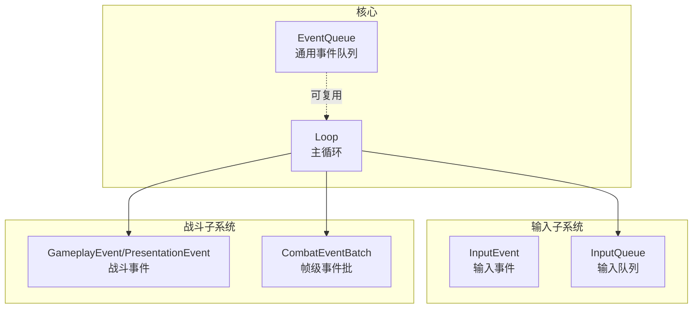
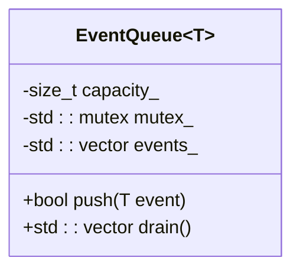
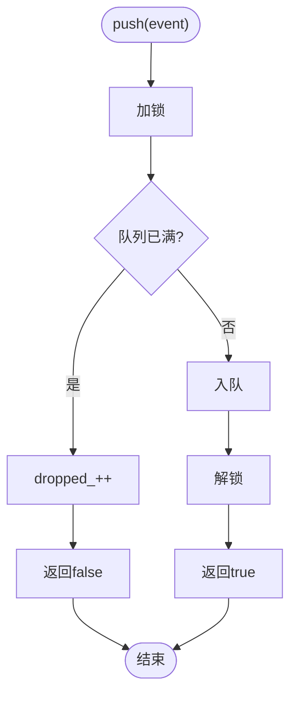
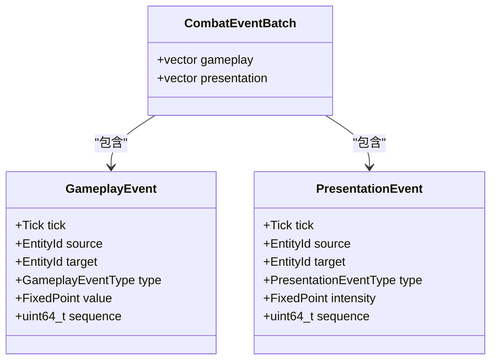
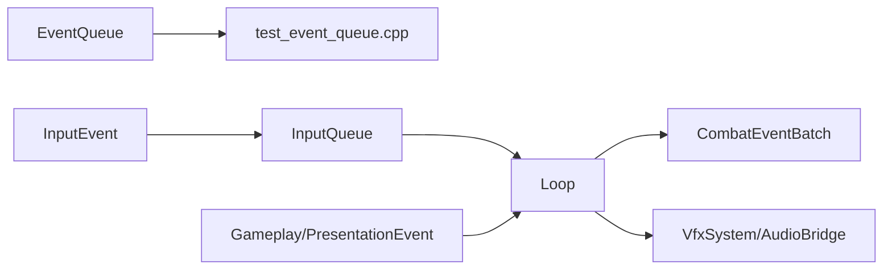

# 事件队列系统

<cite>
**本文引用的文件**   
- [event_queue.h](file://native/engine/core/event_queue.h)
- [input_event.h](file://native/engine/input/input_event.h)
- [input_queue.h](file://native/engine/input/input_queue.h)
- [event.h](file://native/gameplay/combat/event.h)
- [loop.h](file://native/engine/core/loop.h)
- [loop.cpp](file://native/engine/core/loop.cpp)
- [test_event_queue.cpp](file://tests/test_event_queue.cpp)
- [test_event_order.cpp](file://tests/test_event_order.cpp)
</cite>

## 目录
1. [简介](#简介)
2. [项目结构](#项目结构)
3. [核心组件](#核心组件)
4. [架构总览](#架构总览)
5. [详细组件分析](#详细组件分析)
6. [依赖关系分析](#依赖关系分析)
7. [性能考量](#性能考量)
8. [故障排查指南](#故障排查指南)
9. [结论](#结论)
10. [附录：自定义事件与使用示例](#附录自定义事件与使用示例)

## 简介
本文件围绕 my-world 游戏引擎的事件队列系统，系统性阐述 EventQueue 的设计原理与实现细节，包括事件入队、出队、优先级处理、批量处理等核心能力；同时覆盖事件类型定义、消息传递机制与异步处理模式。文档还给出线程安全实现、内存池优化与性能调优策略，并通过具体代码路径展示如何定义自定义事件和处理事件流。最后，解释事件系统在解耦模块、实现观察者模式中的作用，并给出事件丢失、重复处理、死锁等问题的预防与解决方法，以及在游戏逻辑、UI交互、网络通信等不同场景的应用模式。

## 项目结构
事件相关的关键位置如下：
- 通用事件队列模板：native/engine/core/event_queue.h
- 输入事件与输入队列：native/engine/input/input_event.h、native/engine/input/input_queue.h
- 战斗领域事件类型与批量事件：native/gameplay/combat/event.h
- 主循环与事件消费流程：native/engine/core/loop.h、native/engine/core/loop.cpp
- 单元测试：tests/test_event_queue.cpp、tests/test_event_order.cpp



图表来源
- [event_queue.h:1-31](file://native/engine/core/event_queue.h#L1-L31)
- [input_event.h:1-24](file://native/engine/input/input_event.h#L1-L24)
- [input_queue.h:1-47](file://native/engine/input/input_queue.h#L1-L47)
- [event.h:1-96](file://native/gameplay/combat/event.h#L1-L96)
- [loop.h:1-104](file://native/engine/core/loop.h#L1-L104)
- [loop.cpp:1-614](file://native/engine/core/loop.cpp#L1-L614)

章节来源
- [event_queue.h:1-31](file://native/engine/core/event_queue.h#L1-L31)
- [input_event.h:1-24](file://native/engine/input/input_event.h#L1-L24)
- [input_queue.h:1-47](file://native/engine/input/input_queue.h#L1-L47)
- [event.h:1-96](file://native/gameplay/combat/event.h#L1-L96)
- [loop.h:1-104](file://native/engine/core/loop.h#L1-L104)
- [loop.cpp:1-614](file://native/engine/core/loop.cpp#L1-L614)

## 核心组件
- EventQueue<T>：线程安全的固定容量事件队列，提供 push/drain 接口，适合生产者-消费者模型下的批量出队。
- InputEvent/InputQueue：输入事件结构与有界队列，支持丢弃计数与单元素出队。
- GameplayEvent/PresentationEvent：战斗与表现层事件类型，包含 tick、source/target、type、value/intensity、sequence 等字段，用于跨子系统传播。
- CombatEventBatch：帧级事件批，聚合 gameplay/presentation 两类事件，供 VFX/Audio 等订阅者消费。
- Loop：主循环负责输入入队、事件消费、固定步长更新、事件排序与分发。

章节来源
- [event_queue.h:1-31](file://native/engine/core/event_queue.h#L1-L31)
- [input_event.h:1-24](file://native/engine/input/input_event.h#L1-L24)
- [input_queue.h:1-47](file://native/engine/input/input_queue.h#L1-L47)
- [event.h:1-96](file://native/gameplay/combat/event.h#L1-L96)
- [loop.h:1-104](file://native/engine/core/loop.h#L1-L104)
- [loop.cpp:1-614](file://native/engine/core/loop.cpp#L1-L614)

## 架构总览
事件驱动的主循环流程（简化）：
- 输入线程/平台回调将 InputEvent 推入 InputQueue。
- Loop::processInput 从 InputQueue 弹出事件，转换为 ActionRequest 并入队到战斗控制器。
- 固定步长更新时，Encounter/Combat 产生 GameplayEvent/PresentationEvent，写入 frame 级 CombatEventBatch。
- Loop 对批次内事件按 tick/source/target/sequence 稳定排序后，分发给 VFX/Audio 等订阅者。

```mermaid
sequenceDiagram
participant UI as "输入源"
participant IQ as "InputQueue"
participant Loop as "Loop"
participant Combat as "CombatController"
participant Batch as "CombatEventBatch"
participant VFX as "VfxSystem/AudioBridge"
UI->>IQ : push(InputEvent)
Loop->>IQ : pop()
Loop->>Loop : processInput()<br/>映射为ActionRequest
Loop->>Combat : enqueue(ActionRequest)
Combat-->>Loop : 生成Gameplay/Presentation事件
Loop->>Batch : 合并并排序(frame级)
Loop->>VFX : consume(Batch)
Loop->>VFX : update(tick, dtMs)
VFX-->>Loop : 副作用(相机抖动/闪光等)
```

图表来源
- [input_queue.h:1-47](file://native/engine/input/input_queue.h#L1-L47)
- [loop.cpp:240-310](file://native/engine/core/loop.cpp#L240-L310)
- [loop.cpp:419-598](file://native/engine/core/loop.cpp#L419-L598)
- [event.h:1-96](file://native/gameplay/combat/event.h#L1-L96)

章节来源
- [loop.cpp:240-310](file://native/engine/core/loop.cpp#L240-L310)
- [loop.cpp:419-598](file://native/engine/core/loop.cpp#L419-L598)

## 详细组件分析

### EventQueue<T> 设计与实现
- 设计要点
  - 固定容量 capacity_，push 满时返回失败，避免无界增长。
  - drain 以 swap 方式一次性清空内部容器，减少拷贝与锁竞争。
  - 使用互斥量保证多线程安全，适用于“生产者-消费者”模型。
- 复杂度
  - push: O(1)（均摊），容量检查+尾插。
  - drain: O(1)（交换指针），后续处理在调用方进行。
- 扩展建议
  - 引入内存池或对象池以减少频繁分配。
  - 增加优先级队列变体（如 std::priority_queue）支持优先级事件。
  - 增加统计信息（入队/出队/丢弃计数）。



图表来源
- [event_queue.h:1-31](file://native/engine/core/event_queue.h#L1-L31)

章节来源
- [event_queue.h:1-31](file://native/engine/core/event_queue.h#L1-L31)

### InputEvent 与 InputQueue
- InputEvent：包含 action、pointerId、x/y、sequence，用于描述一次输入动作。
- InputQueue：有界队列，push 满时递增 dropped_ 并返回 false；pop 单元素出队；clear 快速清空；droppedCount 暴露丢弃计数。
- 线程安全：每个方法持锁，确保并发访问安全。



图表来源
- [input_event.h:1-24](file://native/engine/input/input_event.h#L1-L24)
- [input_queue.h:1-47](file://native/engine/input/input_queue.h#L1-L47)

章节来源
- [input_event.h:1-24](file://native/engine/input/input_event.h#L1-L24)
- [input_queue.h:1-47](file://native/engine/input/input_queue.h#L1-L47)

### 战斗事件类型与批量处理
- 事件类型
  - GameplayEventType：Hit/Damage/Dodge/Interrupt/PoiseBreak/AuraApplied/Resonance/PhaseChanged/Death/EncounterReset 等。
  - PresentationEventType：HitFlash/CameraShake/DodgeFlash/CastBarBroken/PoiseBreakBurst/ResonanceBurst/PhaseTransition 等。
- 事件结构
  - GameplayEvent/PresentationEvent：包含 tick、source、target、type、value/intensity、sequence，便于排序与去重。
- 批量处理
  - CombatEventBatch 聚合 gameplay 与 presentation 两类事件，Loop 每帧合并、排序后统一分发。



图表来源
- [event.h:1-96](file://native/gameplay/combat/event.h#L1-L96)

章节来源
- [event.h:1-96](file://native/gameplay/combat/event.h#L1-L96)

### Loop 中的事件消费与排序
- 输入处理：processInput 从 InputQueue 弹出入队，映射为 ActionRequest 并入队至 combat。
- 事件收集：updateFixed 中读取 encounter.events().combat，合并到 frameCombatEvents_。
- 排序规则：按 tick、source、target、sequence 稳定排序，保证时序一致性。
- 分发消费：vfxSystem.consume(frameCombatEvents_) 与 audioBridge.dispatch(frameCombatEvents_) 消费事件。

```mermaid
sequenceDiagram
participant Loop as "Loop"
participant Encounter as "EncounterController"
participant Batch as "frameCombatEvents_"
participant VFX as "VfxSystem"
participant Audio as "AudioBridge"
Loop->>Encounter : update(tick, dtMs, ...)
Encounter-->>Loop : events().combat(gameplay/presentation)
Loop->>Batch : 合并(stepEvents -> frame)
Loop->>Batch : 稳定排序(tick/source/target/sequence)
Loop->>VFX : consume(Batch)
Loop->>Audio : dispatch(Batch)
```

图表来源
- [loop.cpp:419-598](file://native/engine/core/loop.cpp#L419-L598)

章节来源
- [loop.cpp:419-598](file://native/engine/core/loop.cpp#L419-L598)

## 依赖关系分析
- EventQueue<T> 被测试用例直接引用，作为通用队列模板可复用于其他子系统。
- InputQueue 依赖 InputEvent，Loop 依赖 InputQueue 进行输入入队与处理。
- Loop 依赖 CombatEventBatch 与事件类型，完成帧级事件聚合与分发。
- 战斗事件类型由 combat/event.h 统一定义，确保跨子系统一致。



图表来源
- [event_queue.h:1-31](file://native/engine/core/event_queue.h#L1-L31)
- [input_event.h:1-24](file://native/engine/input/input_event.h#L1-L24)
- [input_queue.h:1-47](file://native/engine/input/input_queue.h#L1-L47)
- [event.h:1-96](file://native/gameplay/combat/event.h#L1-L96)
- [loop.h:1-104](file://native/engine/core/loop.h#L1-L104)
- [loop.cpp:1-614](file://native/engine/core/loop.cpp#L1-L614)
- [test_event_queue.cpp:1-20](file://tests/test_event_queue.cpp#L1-L20)

章节来源
- [test_event_queue.cpp:1-20](file://tests/test_event_queue.cpp#L1-L20)
- [loop.h:1-104](file://native/engine/core/loop.h#L1-L104)
- [loop.cpp:1-614](file://native/engine/core/loop.cpp#L1-L614)

## 性能考量
- 队列容量与丢弃策略
  - InputQueue 设置容量上限，满则丢弃并计数，避免阻塞与内存膨胀。
  - EventQueue<T> 同样采用固定容量，push 失败需在上层处理（重试/降级/丢弃）。
- 批量出队与排序
  - drain 通过 swap 零拷贝清空，降低锁持有时间。
  - 帧级事件排序采用稳定排序，保证相同 tick 下顺序确定性。
- 线程安全与锁粒度
  - 各队列方法独立加锁，避免跨操作长时间持锁。
  - Loop 中对 frameCombatEvents_ 的读写使用互斥保护，减少竞争。
- 内存与缓存友好
  - 事件结构紧凑，利于 CPU 缓存命中。
  - 建议引入对象池减少频繁分配，尤其在高频事件路径。
- 监控与诊断
  - 通过 droppedCount、fps、inputEventCount 等指标定位瓶颈。
  - 日志输出关键路径（如 start/stop/tickOnce）辅助调试。

[本节为通用性能讨论，不直接分析具体文件]

## 故障排查指南
- 事件丢失
  - 现象：push 返回 false 且 droppedCount 上升。
  - 排查：增大队列容量或提高消费频率；检查上层是否忽略返回值。
  - 参考：InputQueue::push 与 droppedCount。
- 重复处理
  - 现象：同一事件被多次消费。
  - 排查：确认消费端未重复遍历；检查序列号 sequence 是否唯一。
  - 参考：Loop 中 frameCombatEvents_ 的合并与排序。
- 死锁与竞态
  - 现象：主循环卡顿或崩溃。
  - 排查：检查多锁嵌套顺序；确保短临界区；避免在锁内执行耗时操作。
  - 参考：Loop 中 combatEventMutex 的使用。
- 事件顺序错乱
  - 现象：表现层动画或音效顺序异常。
  - 排查：确认排序键 tick/source/target/sequence 正确；检查上游事件生成顺序。
  - 参考：test_event_order.cpp 的排序断言。

章节来源
- [input_queue.h:1-47](file://native/engine/input/input_queue.h#L1-L47)
- [loop.cpp:419-598](file://native/engine/core/loop.cpp#L419-L598)
- [test_event_order.cpp:1-13](file://tests/test_event_order.cpp#L1-L13)

## 结论
my-world 的事件队列系统以 EventQueue<T> 为核心抽象，结合 InputQueue 与战斗事件类型，构建了高内聚、低耦合的消息总线。Loop 作为调度中心，负责输入入队、事件聚合、排序与分发，确保时序一致性与线程安全。通过固定容量、批量处理与稳定排序，系统在性能与稳定性之间取得平衡。未来可扩展优先级队列、内存池与更丰富的监控指标，以满足更高吞吐与更低延迟的需求。

[本节为总结性内容，不直接分析具体文件]

## 附录：自定义事件与使用示例
- 定义自定义事件
  - 在 native/gameplay/combat/event.h 风格下新增枚举与结构体，包含 tick、source、target、type、value/intensity、sequence。
  - 若需要优先级，可在 EventQueue 基础上封装优先级队列（如 std::priority_queue）。
- 入队与出队
  - 使用 EventQueue<T>::push 入队，容量不足时返回 false，需在上层处理。
  - 使用 drain 批量取出，随后在调用方进行处理与排序。
- 帧级事件批处理
  - 在 Loop::updateFixed 中将 step 事件合并到 frameCombatEvents_，并按 tick/source/target/sequence 稳定排序。
  - 通过 vfxSystem.consume 与 audioBridge.dispatch 消费事件。
- 参考测试用例
  - test_event_queue.cpp：演示 EventQueue 的基本用法与容量限制。
  - test_event_order.cpp：验证事件排序的正确性。

章节来源
- [event.h:1-96](file://native/gameplay/combat/event.h#L1-L96)
- [event_queue.h:1-31](file://native/engine/core/event_queue.h#L1-L31)
- [loop.cpp:419-598](file://native/engine/core/loop.cpp#L419-L598)
- [test_event_queue.cpp:1-20](file://tests/test_event_queue.cpp#L1-L20)
- [test_event_order.cpp:1-13](file://tests/test_event_order.cpp#L1-L13)