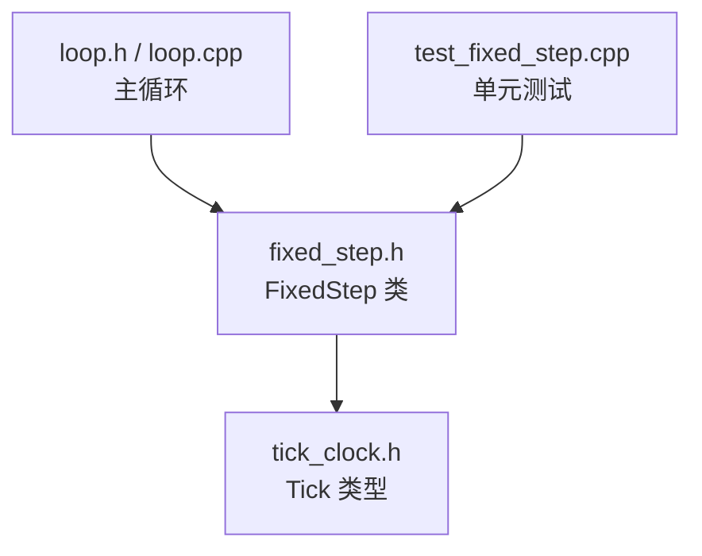
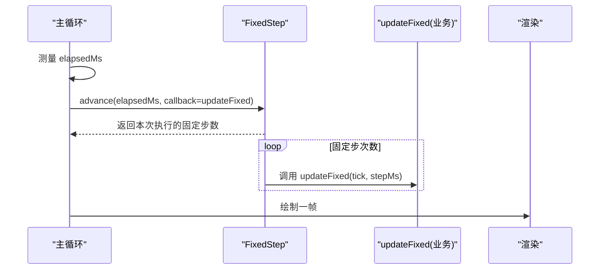
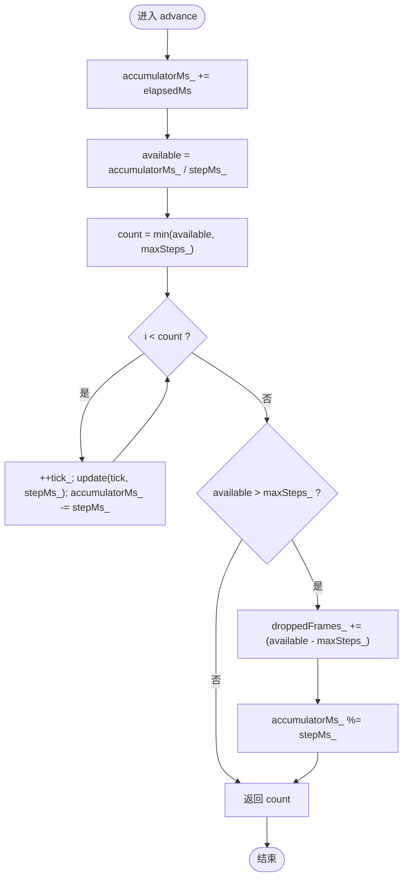
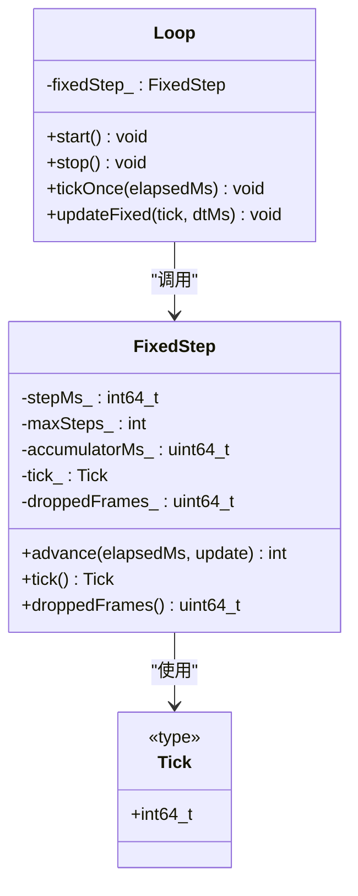

# 固定时间步长

<cite>
**本文引用的文件**   
- [native/engine/core/fixed_step.h](file://native/engine/core/fixed_step.h)
- [tests/test_fixed_step.cpp](file://tests/test_fixed_step.cpp)
- [native/engine/core/loop.h](file://native/engine/core/loop.h)
- [native/engine/core/loop.cpp](file://native/engine/core/loop.cpp)
- [native/engine/core/tick_clock.h](file://native/engine/core/tick_clock.h)
</cite>

## 目录
1. [简介](#简介)
2. [项目结构](#项目结构)
3. [核心组件](#核心组件)
4. [架构总览](#架构总览)
5. [详细组件分析](#详细组件分析)
6. [依赖关系分析](#依赖关系分析)
7. [性能考量](#性能考量)
8. [故障排查指南](#故障排查指南)
9. [结论](#结论)
10. [附录](#附录)

## 简介
本章节面向 my-world 游戏引擎的“固定时间步长”系统，系统性阐述 FixedStep 类的设计原理与实现细节。内容涵盖：
- 时间累积算法、步进计算逻辑与精度控制机制
- 如何通过固定时间步长确保游戏逻辑的一致性与可重现性
- 构造函数参数（目标帧间隔、最大步数限制）的含义与影响
- 在不同场景下的配置与优化示例
- 与渲染帧率的解耦机制及性能平衡策略
- 时间漂移补偿、步长溢出等边界情况的处理方法
- 为初学者提供游戏时间管理概念，为高级开发者提供扩展方案

## 项目结构
固定时间步长相关代码位于 native/engine/core 目录下，主要包含：
- fixed_step.h：FixedStep 类的声明与实现
- tick_clock.h：Tick 类型定义与定点数工具
- loop.h / loop.cpp：主循环集成点，调用 FixedStep.advance 驱动固定步更新



图表来源 
- [native/engine/core/fixed_step.h:1-49](file://native/engine/core/fixed_step.h#L1-L49)
- [native/engine/core/tick_clock.h:1-7](file://native/engine/core/tick_clock.h#L1-L7)
- [native/engine/core/loop.h:1-104](file://native/engine/core/loop.h#L1-L104)
- [native/engine/core/loop.cpp:311-354](file://native/engine/core/loop.cpp#L311-L354)
- [tests/test_fixed_step.cpp:1-68](file://tests/test_fixed_step.cpp#L1-68)

章节来源
- [native/engine/core/fixed_step.h:1-49](file://native/engine/core/fixed_step.h#L1-L49)
- [native/engine/core/loop.h:1-104](file://native/engine/core/loop.h#L1-L104)
- [native/engine/core/loop.cpp:311-354](file://native/engine/core/loop.cpp#L311-L354)
- [native/engine/core/tick_clock.h:1-7](file://native/engine/core/tick_clock.h#L1-L7)
- [tests/test_fixed_step.cpp:1-68](file://tests/test_fixed_step.cpp#L1-68)

## 核心组件
- FixedStep：固定时间步长控制器，负责将不稳定的 elapsedMs 转换为固定 dt 的游戏逻辑步进，维护 tick 计数、丢弃帧统计与时间累积器。
- Tick：用于表示逻辑帧序号的类型（int64_t），保证长时间运行下不会回绕。
- Loop：主循环，每帧测量 elapsedMs 并调用 FixedStep.advance，将 updateFixed 作为固定步回调执行。

关键职责划分：
- FixedStep：纯时间管理与步进调度，不包含业务逻辑
- Loop：采集时间、驱动 FixedStep、协调渲染与业务更新

章节来源
- [native/engine/core/fixed_step.h:8-48](file://native/engine/core/fixed_step.h#L8-L48)
- [native/engine/core/tick_clock.h:1-7](file://native/engine/core/tick_clock.h#L1-L7)
- [native/engine/core/loop.h:52](file://native/engine/core/loop.h#L52)
- [native/engine/core/loop.cpp:329-331](file://native/engine/core/loop.cpp#L329-L331)

## 架构总览
下图展示主循环与固定时间步长的交互流程：主循环每帧获取 elapsedMs，交由 FixedStep 累积并计算应执行的固定步数量；每个固定步调用 updateFixed 进行确定性更新；渲染在固定步之后进行，从而解耦逻辑与渲染帧率。



图表来源 
- [native/engine/core/loop.cpp:311-354](file://native/engine/core/loop.cpp#L311-L354)
- [native/engine/core/fixed_step.h:16-37](file://native/engine/core/fixed_step.h#L16-L37)

章节来源
- [native/engine/core/loop.cpp:311-354](file://native/engine/core/loop.cpp#L311-L354)
- [native/engine/core/fixed_step.h:16-37](file://native/engine/core/fixed_step.h#L16-L37)

## 详细组件分析

### FixedStep 类设计与算法
FixedStep 的核心是“时间累积 + 固定步长切分”的算法：
- 时间累积：将每帧 elapsedMs 累加到 accumulatorMs_
- 步进计算：available = accumulatorMs_ / stepMs_，得到可执行的固定步数量
- 上限保护：count = min(available, maxSteps_)，防止卡顿导致单帧过多更新
- 步进执行：每次执行 update(tick, stepMs_)，并将 accumulatorMs_ 减去 stepMs_
- 溢出处理：当 available > maxSteps_ 时，记录 droppedFrames_ 并修正 accumulatorMs_ 为余数，避免累积误差放大



图表来源 
- [native/engine/core/fixed_step.h:16-37](file://native/engine/core/fixed_step.h#L16-L37)

章节来源
- [native/engine/core/fixed_step.h:8-48](file://native/engine/core/fixed_step.h#L8-L48)

#### 时间累积与精度控制
- 使用 uint64_t 存储 accumulatorMs_，避免负值与符号问题
- 通过 modulo 操作修正累积器，确保跨帧累积误差不会无限增长
- 对极端输入（如 int64_t::max）进行防护，避免溢出或错误计数

章节来源
- [native/engine/core/fixed_step.h:18-35](file://native/engine/core/fixed_step.h#L18-L35)

#### 步进计算与上限保护
- maxSteps_ 限制单帧最大更新次数，防止“卡顿追赶”导致 CPU 占用飙升
- 当 elapsedMs 极大时，仅执行 maxSteps_ 次更新，剩余时间被丢弃并记录到 droppedFrames_

章节来源
- [native/engine/core/fixed_step.h:21-35](file://native/engine/core/fixed_step.h#L21-L35)

#### 边界情况与健壮性
- 构造断言：stepMs_ > 0，maxSteps_ >= 0，确保合法配置
- 负 elapsedMs：视为 0，不触发更新
- 超大 elapsedMs：按 maxSteps_ 限制执行，droppedFrames_ 记录丢弃步数
- 累积器溢出：通过 modulo 修正，避免长期累积误差

章节来源
- [native/engine/core/fixed_step.h:10-14](file://native/engine/core/fixed_step.h#L10-L14)
- [tests/test_fixed_step.cpp:22-24](file://tests/test_fixed_step.cpp#L22-L24)
- [tests/test_fixed_step.cpp:41-51](file://tests/test_fixed_step.cpp#L41-L51)
- [tests/test_fixed_step.cpp:53-62](file://tests/test_fixed_step.cpp#L53-L62)

### 与主循环的集成
Loop 在 tickOnce 中：
- 读取 elapsedMs（限制最大 250ms，避免极端卡顿）
- 调用 fixedStep.advance(elapsedMs, updateFixed)
- 渲染前更新 3D 相机与状态，然后绘制与交换缓冲区

```mermaid
sequenceDiagram
participant Loop as "Loop.tickOnce"
participant FS as "FixedStep.advance"
participant Update as "updateFixed"
participant Render as "surface_draw/swap"
Loop->>Loop : 测量 elapsedMs<=250
Loop->>FS : advance(elapsedMs, Update)
FS-->>Loop : 返回 count
loop count 次
FS->>Update : updateFixed(tick, stepMs)
end
Loop->>Render : 更新相机与渲染
Render-->>Loop : 完成一帧
```

图表来源 
- [native/engine/core/loop.cpp:311-354](file://native/engine/core/loop.cpp#L311-L354)
- [native/engine/core/fixed_step.h:16-37](file://native/engine/core/fixed_step.h#L16-L37)

章节来源
- [native/engine/core/loop.cpp:311-354](file://native/engine/core/loop.cpp#L311-L354)
- [native/engine/core/loop.h:52](file://native/engine/core/loop.h#L52)

### 使用示例与配置建议
- 基础配置：FixedStep step(16, 4) 表示目标 60Hz（16ms/步），单帧最多 4 步
- 低延迟场景：step(8, 6) 提高响应速度，但增加 CPU 负载
- 高稳定场景：step(33, 3) 降低更新频率，提升稳定性
- 动态调整：根据 PerformanceGuard.level() 或 FPS 动态调整 stepMs 与 maxSteps_

章节来源
- [native/engine/core/loop.h:52](file://native/engine/core/loop.h#L52)
- [native/engine/core/loop.cpp:354](file://native/engine/core/loop.cpp#L354)

## 依赖关系分析
FixedStep 依赖 Tick 类型，Loop 依赖 FixedStep 进行时间驱动。测试用例验证了边界条件与异常路径。



图表来源 
- [native/engine/core/fixed_step.h:8-48](file://native/engine/core/fixed_step.h#L8-L48)
- [native/engine/core/tick_clock.h:1-7](file://native/engine/core/tick_clock.h#L1-L7)
- [native/engine/core/loop.h:26-104](file://native/engine/core/loop.h#L26-L104)

章节来源
- [native/engine/core/fixed_step.h:8-48](file://native/engine/core/fixed_step.h#L8-L48)
- [native/engine/core/tick_clock.h:1-7](file://native/engine/core/tick_clock.h#L1-L7)
- [native/engine/core/loop.h:26-104](file://native/engine/core/loop.h#L26-L104)

## 性能考量
- 固定步长 vs 渲染帧率：逻辑更新与渲染分离，允许渲染帧率波动而不影响游戏一致性
- 最大步数限制：防止卡顿后“追赶”导致 CPU 峰值，保障帧时间稳定
- 时间累积精度：uint64_t 与 modulo 操作避免长期累积误差
- 自适应策略：结合 PerformanceGuard 与 FPS 监控动态调整 stepMs 与 maxSteps_

[本节为通用指导，不直接分析具体文件]

## 故障排查指南
- 构造断言失败：检查 stepMs_ > 0 与 maxSteps_ >= 0
- 无更新发生：确认 elapsedMs > 0 且 accumulatorMs_ >= stepMs_
- 卡顿后行为异常：检查 droppedFrames_ 是否激增，适当增大 maxSteps_
- 累积器溢出：验证极端输入路径，确保 modulo 修正生效

章节来源
- [tests/test_fixed_step.cpp:22-24](file://tests/test_fixed_step.cpp#L22-L24)
- [tests/test_fixed_step.cpp:41-51](file://tests/test_fixed_step.cpp#L41-L51)
- [tests/test_fixed_step.cpp:53-62](file://tests/test_fixed_step.cpp#L53-L62)

## 结论
FixedStep 通过时间累积与固定步长切分，实现了游戏逻辑的稳定与可重现性。其设计简洁、边界处理完善，并与主循环良好解耦。通过合理配置 stepMs 与 maxSteps_，可在不同平台与场景下取得性能与稳定性的平衡。

[本节为总结，不直接分析具体文件]

## 附录
- 时间管理概念：固定时间步长是游戏引擎中常见的确定性模拟方法，确保在不同硬件上行为一致
- 自定义扩展：可基于 FixedStep 的模板接口扩展更复杂的步进策略（如可变步长、优先级调度）

[本节为概念介绍，不直接分析具体文件]