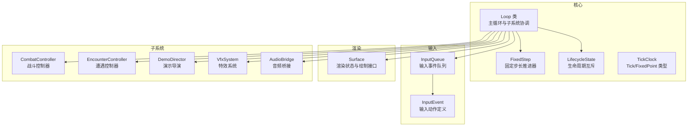
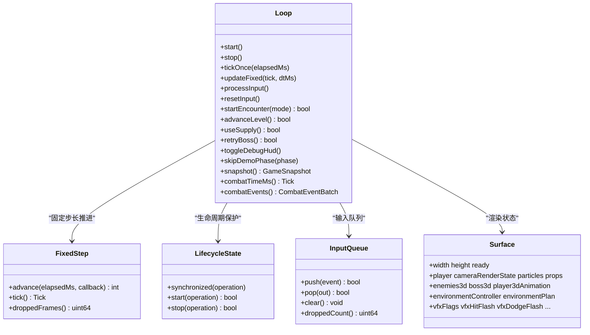
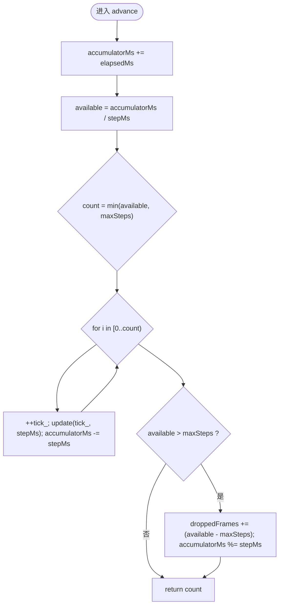
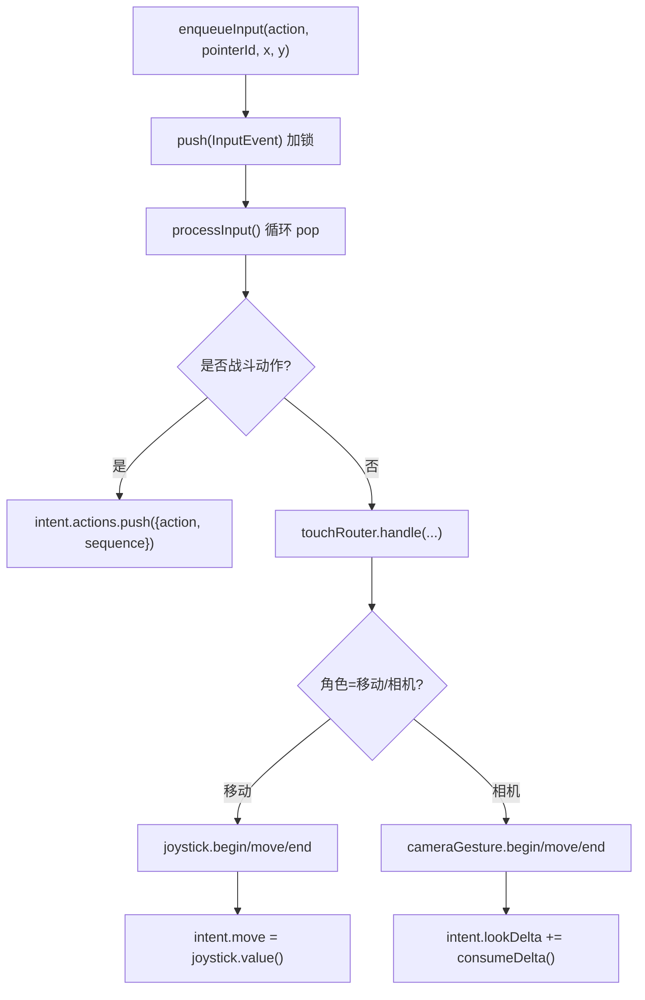
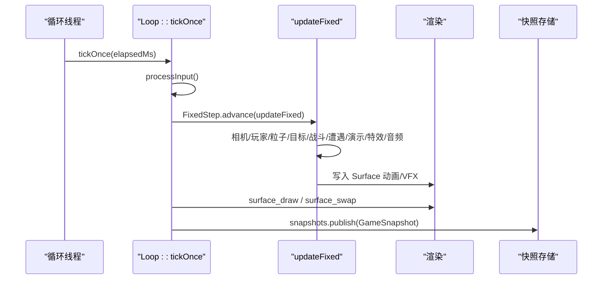
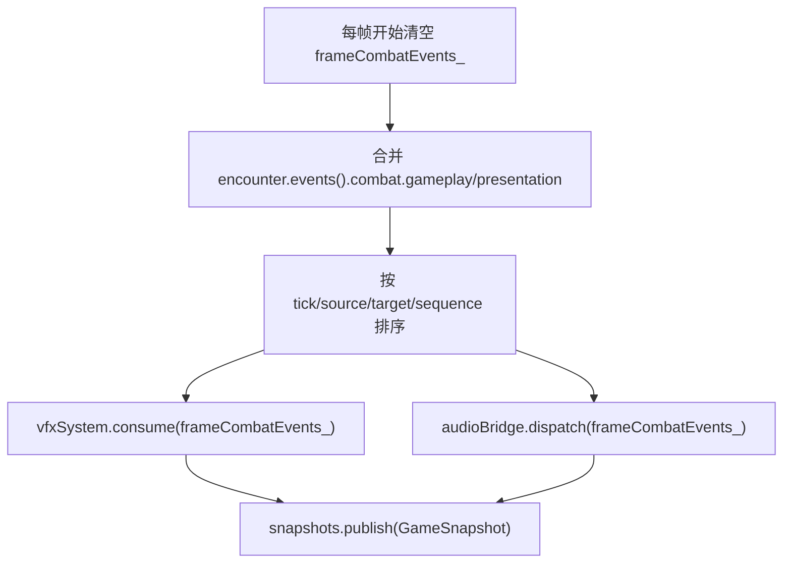
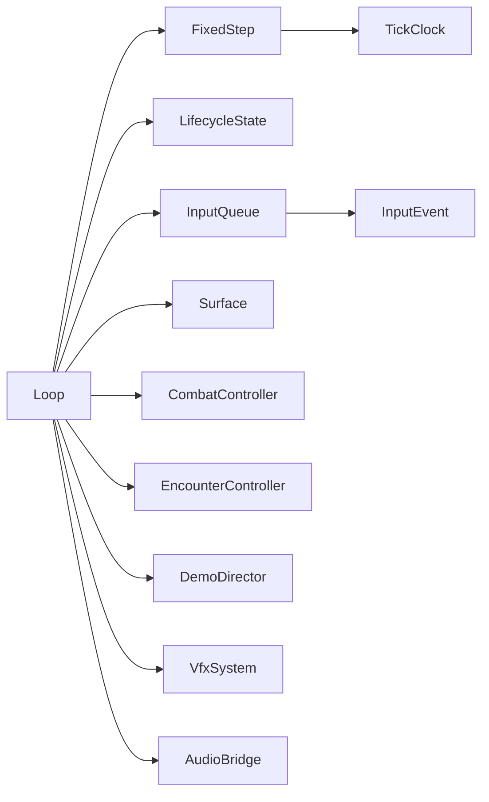

# 游戏循环系统

<cite>
**本文引用的文件**   
- [loop.h](file://native/engine/core/loop.h)
- [loop.cpp](file://native/engine/core/loop.cpp)
- [fixed_step.h](file://native/engine/core/fixed_step.h)
- [tick_clock.h](file://native/engine/core/tick_clock.h)
- [lifecycle_state.h](file://native/engine/core/lifecycle_state.h)
- [event_queue.h](file://native/engine/core/event_queue.h)
- [input_event.h](file://native/engine/input/input_event.h)
- [input_queue.h](file://native/engine/input/input_queue.h)
- [surface.h](file://native/engine/render/surface.h)
- [test_loop_integration.cpp](file://tests/test_loop_integration.cpp)
- [test_loop_lifecycle.cpp](file://tests/test_loop_lifecycle.cpp)
</cite>

## 目录
1. [简介](#简介)
2. [项目结构](#项目结构)
3. [核心组件](#核心组件)
4. [架构总览](#架构总览)
5. [详细组件分析](#详细组件分析)
6. [依赖关系分析](#依赖关系分析)
7. [性能考量](#性能考量)
8. [故障排查指南](#故障排查指南)
9. [结论](#结论)
10. [附录：使用示例与最佳实践](#附录使用示例与最佳实践)

## 简介
本章节面向 my-world 游戏引擎的游戏循环系统，围绕 Loop 类展开，解释其设计理念与实现机制。内容涵盖主循环线程管理、固定步长时间推进、帧率控制、子系统协调（输入、渲染、战斗、特效、音频）、事件分发与快照发布等。文档同时为初学者提供游戏循环概念入门，并为有经验的开发者给出底层实现细节、多线程同步策略与扩展建议。

## 项目结构
游戏循环位于 native/engine/core 目录下，核心由 Loop 类驱动，配合 FixedStep 固定步长推进器、LifecycleState 生命周期锁、InputQueue 输入队列、Surface 渲染状态以及各子系统（战斗、遭遇、演示导演、特效、音频）协同工作。测试用例位于 tests 目录，覆盖集成与生命周期行为。



**图表来源** 
- [loop.h:26-104](file://native/engine/core/loop.h#L26-L104)
- [fixed_step.h:8-49](file://native/engine/core/fixed_step.h#L8-L49)
- [lifecycle_state.h:6-37](file://native/engine/core/lifecycle_state.h#L6-L37)
- [tick_clock.h:1-7](file://native/engine/core/tick_clock.h#L1-L7)
- [input_queue.h:8-47](file://native/engine/input/input_queue.h#L8-L47)
- [input_event.h:4-24](file://native/engine/input/input_event.h#L4-L24)
- [surface.h:98-252](file://native/engine/render/surface.h#L98-L252)

**章节来源**
- [loop.h:26-104](file://native/engine/core/loop.h#L26-L104)
- [fixed_step.h:8-49](file://native/engine/core/fixed_step.h#L8-L49)
- [lifecycle_state.h:6-37](file://native/engine/core/lifecycle_state.h#L6-L37)
- [tick_clock.h:1-7](file://native/engine/core/tick_clock.h#L1-L7)
- [input_queue.h:8-47](file://native/engine/input/input_queue.h#L8-L47)
- [input_event.h:4-24](file://native/engine/input/input_event.h#L4-L24)
- [surface.h:98-252](file://native/engine/render/surface.h#L98-L252)

## 核心组件
- Loop：游戏循环主体，负责启动/停止、单帧推进、输入处理、固定步长更新、渲染与快照发布、子系统协调。
- FixedStep：固定步长推进器，将可变帧间隔累积并拆分为多个固定 dt 的步进，防止掉帧导致的逻辑漂移。
- LifecycleState：递归互斥的生命周期管理器，保证 start/stop 与操作在单线程内串行执行。
- InputQueue/InputEvent：线程安全的输入事件队列与输入动作定义，支持多指针与序列号。
- Surface：渲染层状态载体，包含相机、粒子、模型、环境资源、VFX 标志等，供绘制函数消费。
- 子系统：CombatController、EncounterController、DemoDirector、VfxSystem、AudioBridge 等，按顺序被 tickOnce/updateFixed 调用。

**章节来源**
- [loop.h:26-104](file://native/engine/core/loop.h#L26-L104)
- [fixed_step.h:8-49](file://native/engine/core/fixed_step.h#L8-L49)
- [lifecycle_state.h:6-37](file://native/engine/core/lifecycle_state.h#L6-L37)
- [input_queue.h:8-47](file://native/engine/input/input_queue.h#L8-L47)
- [input_event.h:4-24](file://native/engine/input/input_event.h#L4-L24)
- [surface.h:98-252](file://native/engine/render/surface.h#L98-L252)

## 架构总览
下图展示 Loop 主循环线程与子系统的交互时序，包括输入入队、固定步长推进、子系统更新、渲染与快照发布。

```mermaid
sequenceDiagram
participant Main as "主线程"
participant Runner as "循环线程"
participant Loop as "Loop : : tickOnce"
participant FS as "FixedStep"
participant Sub as "子系统(战斗/遭遇/演示/特效/音频)"
participant Render as "渲染(surface_draw/swap)"
participant Snap as "SnapshotStore"
Main->>Runner : start() 启动循环线程
loop 每帧
Runner->>Loop : tickOnce(elapsedMs)
Loop->>Loop : processInput()
Loop->>FS : advance(elapsedMs, updateFixed)
FS-->>Loop : 多次调用 updateFixed(tick, dtMs)
Loop->>Sub : 更新战斗/遭遇/演示/特效/音频
Loop->>Render : surface_draw / surface_swap
Loop->>Snap : publish(GameSnapshot)
end
Main->>Runner : stop() 终止循环线程
```

**图表来源** 
- [loop.cpp:131-174](file://native/engine/core/loop.cpp#L131-L174)
- [loop.cpp:311-417](file://native/engine/core/loop.cpp#L311-L417)
- [fixed_step.h:16-37](file://native/engine/core/fixed_step.h#L16-L37)

## 详细组件分析

### Loop 类设计与实现
- 设计目标
  - 统一入口：start()/stop() 管理生命周期与线程。
  - 稳定逻辑：FixedStep 确保固定 dt 的逻辑步进，避免卡顿导致的时间跳跃。
  - 清晰数据流：processInput -> updateFixed -> 渲染 -> 快照发布。
  - 安全并发：输入入队与战斗事件批处理通过互斥保护；生命周期通过递归互斥串行化。
- 关键方法
  - start(): 初始化输入、遭遇、战斗、音频，设置运行标志，创建循环线程。
  - stop(): 设置停止标志，join 线程，重置状态并发布暂停快照。
  - tickOnce(elapsedMs): 单帧推进，处理输入、固定步长更新、渲染、FPS 统计与快照发布。
  - updateFixed(tick, dtMs): 固定步长回调，更新相机、玩家、粒子、目标选择、战斗、遭遇、演示、特效、音频，并写入 Surface 动画与 VFX 标志。
  - processInput()/resetInput(): 解析输入事件，映射战斗动作，更新摇杆与相机手势，清空状态。
  - 其他：startEncounter/advanceLevel/useSupply/retryBoss/toggleDebugHud/skipDemoPhase。
- 线程与同步
  - 循环线程：std::thread runner，sleep_for 控制约 60fps。
  - 输入队列：enqueueInput 加锁 push，pop 在 processInput 中消费。
  - 战斗事件：frameCombatEvents_ 通过 combatEventMutex 保护。
  - 生命周期：withLifecycle 使用递归互斥保证 start/stop 与内部操作的原子性。



**图表来源** 
- [loop.h:26-104](file://native/engine/core/loop.h#L26-L104)
- [fixed_step.h:8-49](file://native/engine/core/fixed_step.h#L8-L49)
- [lifecycle_state.h:6-37](file://native/engine/core/lifecycle_state.h#L6-L37)
- [input_queue.h:8-47](file://native/engine/input/input_queue.h#L8-L47)
- [surface.h:98-252](file://native/engine/render/surface.h#L98-L252)

**章节来源**
- [loop.h:26-104](file://native/engine/core/loop.h#L26-L104)
- [loop.cpp:131-174](file://native/engine/core/loop.cpp#L131-L174)
- [loop.cpp:311-417](file://native/engine/core/loop.cpp#L311-L417)
- [loop.cpp:419-598](file://native/engine/core/loop.cpp#L419-L598)

### 固定步长与时间推进（FixedStep）
- 原理：累积 elapsedMs，按 stepMs 拆分出多个固定 dt 的步进，最多 maxSteps，超出部分记录 droppedFrames 并回滚 accumulator。
- 作用：保证逻辑稳定性，避免大帧导致的多步丢失或时间膨胀。
- 复杂度：每次 advance O(k)，k 为实际执行的固定步数，通常很小。



**图表来源** 
- [fixed_step.h:16-37](file://native/engine/core/fixed_step.h#L16-L37)

**章节来源**
- [fixed_step.h:8-49](file://native/engine/core/fixed_step.h#L8-L49)

### 输入处理流程
- 入队：enqueueInput 加锁 push，递增 sequence 与 inputEventCount_。
- 处理：processInput 循环 pop，优先映射战斗动作到 intent.actions；其余 PointerDown/Move/Up/Cancel 交由 touchRouter 分配角色（移动/相机），驱动 VirtualJoystick 与 CameraGesture。
- 输出：intent.move、intent.lookDelta、intent.actions 在 updateFixed 中被消费。



**图表来源** 
- [loop.cpp:240-292](file://native/engine/core/loop.cpp#L240-L292)
- [input_queue.h:12-28](file://native/engine/input/input_queue.h#L12-L28)
- [input_event.h:4-24](file://native/engine/input/input_event.h#L4-L24)

**章节来源**
- [loop.cpp:240-292](file://native/engine/core/loop.cpp#L240-L292)
- [input_queue.h:8-47](file://native/engine/input/input_queue.h#L8-L47)
- [input_event.h:4-24](file://native/engine/input/input_event.h#L4-L24)

### 渲染与更新顺序
- 顺序：processInput -> FixedStep.advance(updateFixed) -> 更新3D相机与环境性能级别 -> surface_draw -> surface_swap -> FPS统计 -> snapshots.publish。
- updateFixed 内部：相机更新 -> 玩家移动 -> 粒子发射与清理 -> 软锁定目标选择 -> 战斗入队与时间推进 -> 遭遇更新 -> 演示信号 -> 动画意图投影 -> 特效与音频分发 -> 写入 Surface 动画与 VFX 标志 -> 发布快照。



**图表来源** 
- [loop.cpp:311-417](file://native/engine/core/loop.cpp#L311-L417)
- [loop.cpp:419-598](file://native/engine/core/loop.cpp#L419-L598)

**章节来源**
- [loop.cpp:311-417](file://native/engine/core/loop.cpp#L311-L417)
- [loop.cpp:419-598](file://native/engine/core/loop.cpp#L419-L598)

### 事件分发机制
- 战斗事件批：frameCombatEvents_ 在每帧开始时清空，updateFixed 中从 encounter.events().combat 合并 gameplay/presentation 两类事件，并按 tick/source/target/sequence 排序后交给 vfxSystem.consume 与 audioBridge.dispatch。
- 快照发布：GameSnapshot 聚合当前 tick、玩家位置、FPS、环境指标、战斗状态、遭遇状态、VFX 标志、演示阶段标签等，通过 SnapshotStore 发布。



**图表来源** 
- [loop.cpp:311-315](file://native/engine/core/loop.cpp#L311-L315)
- [loop.cpp:488-516](file://native/engine/core/loop.cpp#L488-L516)
- [loop.cpp:514-516](file://native/engine/core/loop.cpp#L514-L516)
- [loop.cpp:356-412](file://native/engine/core/loop.cpp#L356-L412)

**章节来源**
- [loop.cpp:311-315](file://native/engine/core/loop.cpp#L311-L315)
- [loop.cpp:488-516](file://native/engine/core/loop.cpp#L488-L516)
- [loop.cpp:514-516](file://native/engine/core/loop.cpp#L514-L516)
- [loop.cpp:356-412](file://native/engine/core/loop.cpp#L356-L412)

### 多线程环境与同步机制
- 循环线程：runner 持有主循环，shouldStop 原子变量控制退出，running 标记运行状态。
- 输入队列：enqueueInput 使用 inputEnqueueMutex 保护 push，保证 sequence 单调递增。
- 战斗事件：combatEventMutex 保护 frameCombatEvents_ 的读写。
- 生命周期：LifecycleState.synchronized 使用递归互斥，start/stop 与内部操作串行化，避免重入竞争。
- 快照读取：SnapshotStore.read 加锁返回副本，避免外部修改。

**章节来源**
- [loop.cpp:131-174](file://native/engine/core/loop.cpp#L131-L174)
- [loop.cpp:176-203](file://native/engine/core/loop.cpp#L176-L203)
- [loop.h:55-63](file://native/engine/core/loop.h#L55-L63)
- [lifecycle_state.h:6-37](file://native/engine/core/lifecycle_state.h#L6-L37)
- [snapshot_store.h:5-21](file://native/engine/core/snapshot_store.h#L5-L21)

## 依赖关系分析
Loop 依赖 FixedStep、LifecycleState、InputQueue、Surface 与各子系统。FixedStep 依赖 TickClock 类型。InputQueue 依赖 InputEvent。Surface 依赖渲染相关头文件与模型/着色器。



**图表来源** 
- [loop.h:26-104](file://native/engine/core/loop.h#L26-L104)
- [fixed_step.h:1-6](file://native/engine/core/fixed_step.h#L1-L6)
- [input_queue.h:1-6](file://native/engine/input/input_queue.h#L1-L6)
- [input_event.h:1-24](file://native/engine/input/input_event.h#L1-L24)

**章节来源**
- [loop.h:26-104](file://native/engine/core/loop.h#L26-L104)
- [fixed_step.h:1-6](file://native/engine/core/fixed_step.h#L1-L6)
- [input_queue.h:1-6](file://native/engine/input/input_queue.h#L1-L6)
- [input_event.h:1-24](file://native/engine/input/input_event.h#L1-L24)

## 性能考量
- 帧率控制：循环线程 sleep_for(16ms) 近似 60fps；tickOnce 内每秒统计 fps 并打印日志。
- 固定步长上限：maxSteps 限制每帧最大逻辑步进，防止卡顿堆积导致 CPU 峰值。
- 事件批处理：combat 事件排序与批量分发减少锁竞争与重复计算。
- 渲染优化：performanceGuard.level() 影响环境渲染质量；VFX 标志与相机抖动通过 Surface 字段传递，避免额外开销。
- I/O 与日志：仅在必要时打印日志（如前几帧或每 60 帧），降低 IO 压力。

[本节为通用指导，不直接分析具体文件]

## 故障排查指南
- 卡顿与掉帧
  - 检查 FixedStep.droppedFrames() 是否增长，确认 maxSteps 是否过小。
  - 观察 FPS 日志与 performanceGuard.level()，适当降低环境渲染质量。
  - 确认 render 路径未阻塞（surface_draw/swap）。
- 输入丢失
  - 检查 InputQueue 容量与 droppedCount()，必要时增大容量或提高消费频率。
  - 确认 enqueueInput 的 sequence 单调递增，避免重复或乱序。
- 状态不一致
  - 使用 withLifecycle 包裹 start/stop 与关键操作，避免并发修改。
  - 快照读取使用 SnapshotStore.read() 获取一致视图。
- 渲染异常
  - 当 surface.ready=false 时，tickOnce 会重置输入与遭遇并发布 RendererStoppedSnapshot，需确保上层正确恢复。

**章节来源**
- [fixed_step.h:16-37](file://native/engine/core/fixed_step.h#L16-L37)
- [loop.cpp:340-354](file://native/engine/core/loop.cpp#L340-L354)
- [input_queue.h:30-39](file://native/engine/input/input_queue.h#L30-L39)
- [lifecycle_state.h:6-37](file://native/engine/core/lifecycle_state.h#L6-L37)
- [loop.cpp:311-324](file://native/engine/core/loop.cpp#L311-L324)

## 结论
Loop 类作为 my-world 引擎的核心调度器，通过 FixedStep 保障逻辑稳定性，结合 LifecycleState 与互斥量实现安全的多线程协作。其清晰的输入处理、渲染更新顺序与事件分发机制，使得子系统间解耦且易于扩展。通过合理的帧率控制与性能优化策略，可在不同设备上保持稳定的游戏体验。

[本节为总结，不直接分析具体文件]

## 附录：使用示例与最佳实践
- 基本用法
  - 构造 Loop，设置 surface.width/height，调用 start() 启动循环，stop() 停止。
  - 通过 enqueueInput 推送输入事件，processInput 消费。
  - 使用 tickOnce(elapsedMs) 手动推进一帧（测试常用）。
- 遭遇与演示
  - startEncounter(mode) 启动特定模式；advanceLevel()/useSupply()/retryBoss() 控制关卡流程。
  - skipDemoPhase(phase) 跳过演示阶段，便于调试。
- 快照与事件
  - snapshot() 获取当前 GameSnapshot；combatEvents() 获取本帧战斗事件批。
  - 订阅 SnapshotStore 发布的快照以驱动 UI。
- 最佳实践
  - 始终在 withLifecycle 中调用 start/stop 与关键状态变更。
  - 合理设置 FixedStep.stepMs 与 maxSteps，平衡稳定性与响应性。
  - 监控 FPS 与 droppedFrames，动态调整渲染质量。
  - 避免在主循环中进行阻塞 I/O，必要时异步处理。

**章节来源**
- [test_loop_integration.cpp:15-375](file://tests/test_loop_integration.cpp#L15-L375)
- [test_loop_lifecycle.cpp:9-80](file://tests/test_loop_lifecycle.cpp#L9-L80)
- [loop.h:69-81](file://native/engine/core/loop.h#L69-L81)
- [loop.cpp:131-174](file://native/engine/core/loop.cpp#L131-L174)
- [loop.cpp:311-417](file://native/engine/core/loop.cpp#L311-L417)