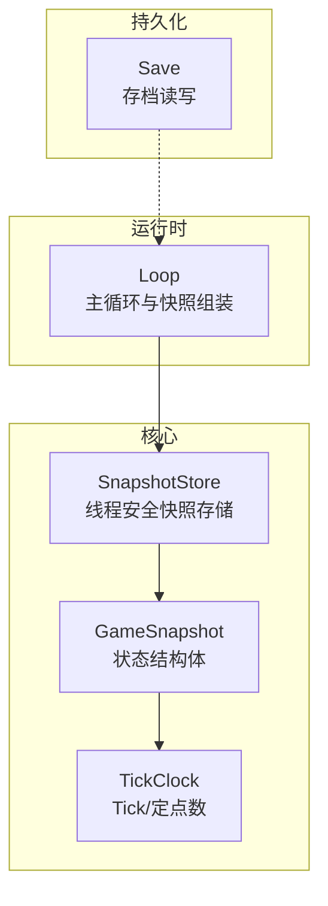
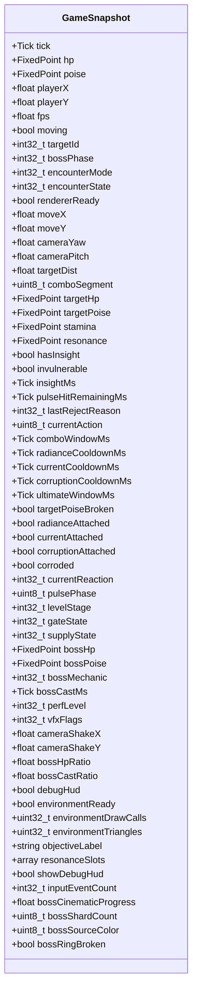
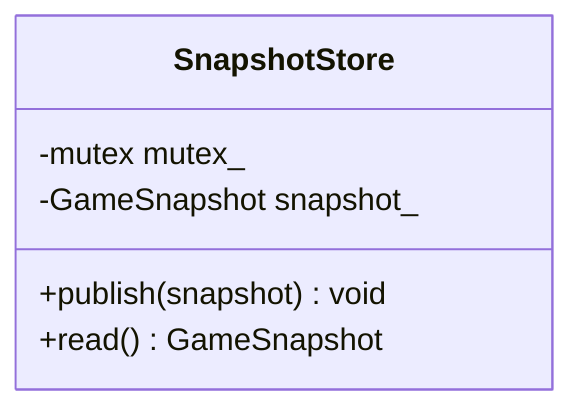
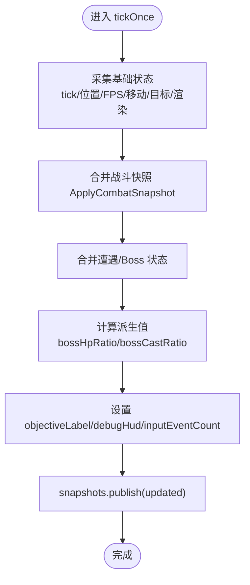

# 状态快照系统

<cite>
**本文引用的文件**
- [game_snapshot.h](file://native/engine/core/game_snapshot.h)
- [snapshot_store.h](file://native/engine/core/snapshot_store.h)
- [tick_clock.h](file://native/engine/core/tick_clock.h)
- [loop.h](file://native/engine/core/loop.h)
- [loop.cpp](file://native/engine/core/loop.cpp)
- [test_snapshot_store.cpp](file://tests/test_snapshot_store.cpp)
- [save.h](file://native/engine/resource/save.h)
- [save.cpp](file://native/engine/resource/save.cpp)
</cite>

## 目录
1. [简介](#简介)
2. [项目结构](#项目结构)
3. [核心组件](#核心组件)
4. [架构总览](#架构总览)
5. [详细组件分析](#详细组件分析)
6. [依赖关系分析](#依赖关系分析)
7. [性能与优化](#性能与优化)
8. [故障排查指南](#故障排查指南)
9. [结论](#结论)
10. [附录：使用示例与扩展指南](#附录使用示例与扩展指南)

## 简介
本文件系统化阐述 my-world 游戏引擎的状态快照系统，围绕 SnapshotStore 的架构设计、GameSnapshot 数据结构与序列化机制、版本管理、并发访问控制、内存优化策略，以及在多人/网络同步、调试回放、存档等场景中的应用展开。文档兼顾初学者入门与高级定制需求，提供清晰的架构图、时序图与流程图，并给出可操作的扩展建议。

## 项目结构
快照系统位于 native/engine/core 目录下，核心由以下文件构成：
- GameSnapshot：定义全局游戏状态的扁平化快照结构体
- SnapshotStore：线程安全的单帧快照发布/读取容器
- TickClock：时间基准（Tick）与定点数类型定义
- Loop：主循环，负责每帧组装 GameSnapshot 并发布到 SnapshotStore
- 测试用例：验证 SnapshotStore 的并发读写正确性
- 存档模块：轻量级持久化接口（Save），用于长期存档



图表来源
- [game_snapshot.h:7-73](file://native/engine/core/game_snapshot.h#L7-L73)
- [snapshot_store.h:5-20](file://native/engine/core/snapshot_store.h#L5-L20)
- [tick_clock.h:1-7](file://native/engine/core/tick_clock.h#L1-L7)
- [loop.h:26-53](file://native/engine/core/loop.h#L26-L53)
- [loop.cpp:356-412](file://native/engine/core/loop.cpp#L356-L412)
- [save.h:1-5](file://native/engine/resource/save.h#L1-L5)

章节来源
- [game_snapshot.h:7-73](file://native/engine/core/game_snapshot.h#L7-L73)
- [snapshot_store.h:5-20](file://native/engine/core/snapshot_store.h#L5-L20)
- [tick_clock.h:1-7](file://native/engine/core/tick_clock.h#L1-L7)
- [loop.h:26-53](file://native/engine/core/loop.h#L26-L53)
- [loop.cpp:356-412](file://native/engine/core/loop.cpp#L356-L412)
- [save.h:1-5](file://native/engine/resource/save.h#L1-L5)

## 核心组件
- GameSnapshot：包含玩家、目标、战斗、遭遇战、渲染与性能指标等全量状态字段，采用紧凑布局与定点数提升精度与序列化效率。
- SnapshotStore：提供 publish/read 两个方法，内部以互斥锁保护单一快照实例，确保多线程环境下的原子可见性。
- TickClock：定义 Tick（int64_t）与 FixedPoint（定点数），并提供 fp() 转换工具，统一时间步长与数值精度。
- Loop：每帧收集各子系统状态，构造 GameSnapshot 并通过 SnapshotStore.publish 发布；同时提供 snapshot() 便捷读取。
- Save：轻量存档接口，支持原子写入与读取，用于长期存档（非实时快照）。

章节来源
- [game_snapshot.h:7-73](file://native/engine/core/game_snapshot.h#L7-L73)
- [snapshot_store.h:5-20](file://native/engine/core/snapshot_store.h#L5-L20)
- [tick_clock.h:1-7](file://native/engine/core/tick_clock.h#L1-L7)
- [loop.h:26-53](file://native/engine/core/loop.h#L26-L53)
- [loop.cpp:356-412](file://native/engine/core/loop.cpp#L356-L412)
- [save.h:1-5](file://native/engine/resource/save.h#L1-L5)

## 架构总览
快照系统在运行时的数据流如下：
- 主循环 Loop 在固定时间步内更新各子系统（输入、相机、玩家、战斗、遭遇、特效、音频）。
- 每帧末尾组装 GameSnapshot，调用 SnapshotStore.publish 发布最新快照。
- UI/网络/调试等消费者通过 SnapshotStore.read 获取当前快照，进行渲染、同步或回放。

```mermaid
sequenceDiagram
participant Loop as "Loop(主循环)"
participant Store as "SnapshotStore"
participant Consumer as "消费者(UI/网络/调试)"
Note over Loop : 每帧结束前组装快照
Loop->>Store : publish(GameSnapshot)
Consumer->>Store : read()
Store-->>Consumer : GameSnapshot
Note over Consumer : 消费快照用于渲染/同步/回放
```

图表来源
- [loop.cpp:356-412](file://native/engine/core/loop.cpp#L356-L412)
- [snapshot_store.h:7-15](file://native/engine/core/snapshot_store.h#L7-L15)

章节来源
- [loop.cpp:356-412](file://native/engine/core/loop.cpp#L356-L412)
- [snapshot_store.h:7-15](file://native/engine/core/snapshot_store.h#L7-L15)

## 详细组件分析

### GameSnapshot 数据结构与序列化
- 字段组织：将玩家位置、移动方向、相机角度、战斗状态、遭遇战阶段、Boss 信息、VFX 标志、性能指标等集中到一个结构体中，便于一次性序列化与跨进程传输。
- 数值类型：使用 FixedPoint 表示需要高精度但无需浮点运算的状态（如 HP/Poise/Stamina），配合 fp() 工具函数进行 double 到定点数的转换。
- 布尔与枚举：大量 bool/int32_t 字段承载离散状态，利于压缩与快速比较。
- 字符串字段：objectiveLabel 用于 UI 提示，可在序列化时按需编码（例如 UTF-8）。
- 数组与位域：resonanceSlots 使用 uint8_t 数组，适合后续位打包压缩。



图表来源
- [game_snapshot.h:7-73](file://native/engine/core/game_snapshot.h#L7-L73)

章节来源
- [game_snapshot.h:7-73](file://native/engine/core/game_snapshot.h#L7-L73)

### SnapshotStore 并发与一致性
- 设计要点：单一快照实例 + 互斥锁保护，publish 写操作与 read 读操作均加锁，保证消费者读到完整一致的快照。
- 复杂度：O(1) 时间与空间，锁粒度小，仅保护单个结构体赋值与拷贝。
- 适用场景：UI 轮询、网络广播、调试记录等高频读取。



图表来源
- [snapshot_store.h:5-20](file://native/engine/core/snapshot_store.h#L5-L20)

章节来源
- [snapshot_store.h:5-20](file://native/engine/core/snapshot_store.h#L5-L20)

### Loop 中的快照组装与发布
- 每帧在 updateFixed 后构建 GameSnapshot，填充来自 Surface、CombatController、EncounterController、VfxSystem、PerformanceGuard 等子系统的状态。
- 关键流程：
  - 采集基础状态（tick、位置、FPS、移动、目标、渲染就绪）
  - 合并战斗快照（ApplyCombatSnapshot）
  - 合并遭遇战与 Boss 状态
  - 计算派生值（如 bossHpRatio、bossCastRatio）
  - 设置 UI 标签与调试开关
  - 最终 snapshots.publish(updated)



图表来源
- [loop.cpp:356-412](file://native/engine/core/loop.cpp#L356-L412)
- [loop.cpp:532-597](file://native/engine/core/loop.cpp#L532-L597)

章节来源
- [loop.cpp:356-412](file://native/engine/core/loop.cpp#L356-L412)
- [loop.cpp:532-597](file://native/engine/core/loop.cpp#L532-L597)

### 时间系统与定点数
- Tick：int64_t 毫秒级时间戳，避免浮点漂移，便于排序与回放。
- FixedPoint：16 位小数定点数，FP_ONE=1<<16，fp() 将 double 转为定点数，减少浮点误差。

章节来源
- [tick_clock.h:1-7](file://native/engine/core/tick_clock.h#L1-L7)

### 并发与测试
- 测试用例 test_snapshot_store.cpp 模拟多线程读写，验证：
  - 初始快照写入与读取一致
  - 高并发下 tick 单调递增
  - 字段值随 tick 变化符合预期
  - 最终 tick 收敛到期望值

章节来源
- [test_snapshot_store.cpp:1-53](file://tests/test_snapshot_store.cpp#L1-L53)

## 依赖关系分析
- Loop 依赖 SnapshotStore 发布快照，SnapshotStore 依赖 GameSnapshot 作为数据载体。
- GameSnapshot 依赖 TickClock 的类型定义。
- Save 独立于快照系统，用于长期存档，可与快照系统结合实现“快照+存档”的组合方案。


图表来源
- [loop.h:26-53](file://native/engine/core/loop.h#L26-L53)
- [snapshot_store.h:5-20](file://native/engine/core/snapshot_store.h#L5-L20)
- [game_snapshot.h:7-73](file://native/engine/core/game_snapshot.h#L7-L73)
- [tick_clock.h:1-7](file://native/engine/core/tick_clock.h#L1-L7)
- [save.h:1-5](file://native/engine/resource/save.h#L1-L5)

章节来源
- [loop.h:26-53](file://native/engine/core/loop.h#L26-L53)
- [snapshot_store.h:5-20](file://native/engine/core/snapshot_store.h#L5-L20)
- [game_snapshot.h:7-73](file://native/engine/core/game_snapshot.h#L7-L73)
- [tick_clock.h:1-7](file://native/engine/core/tick_clock.h#L1-L7)
- [save.h:1-5](file://native/engine/resource/save.h#L1-L5)

## 性能与优化
- 内存与序列化
  - 使用定点数替代部分浮点，降低序列化体积与跨平台差异。
  - 将布尔与枚举字段紧凑排列，便于位打包压缩。
  - 对字符串字段（objectiveLabel）按需编码，避免不必要的分配。
- 并发与锁
  - SnapshotStore 使用细粒度互斥锁，避免阻塞主循环。
  - 消费者侧可采用无锁队列或双缓冲进一步降低延迟（可选扩展）。
- 增量更新
  - 当前为全量快照，可扩展为差分快照（仅发送变更字段），降低带宽。
- 压缩与传输
  - 对二进制序列化结果使用 zlib/lz4 压缩，平衡 CPU 与带宽。
- 垃圾回收与生命周期
  - 快照为瞬时数据，无需持久 GC；如需历史快照回放，可引入环形缓冲区与引用计数。
- 调试与回放
  - 利用 tick 字段对快照排序，实现确定性回放。
  - 结合 inputEventCount 与事件序列，重放输入与逻辑。

[本节为通用指导，不直接分析具体文件]

## 故障排查指南
- 常见问题
  - 快照不一致：检查 publish/read 是否在同一临界区内执行，确认未发生竞态条件。
  - 字段缺失：核对 Loop 中快照组装路径是否覆盖所有必要字段。
  - 性能抖动：观察 FPS 与 environmentDrawCalls/environmentTriangles，定位渲染瓶颈。
  - 存档失败：检查 Save::write 的临时文件与原子替换逻辑。
- 定位手段
  - 启用 debugHud/showDebugHud，打印关键状态。
  - 使用 test_snapshot_store 的思路进行并发压力测试。
  - 对比 tick 单调性与字段变化曲线，定位异常帧。

章节来源
- [loop.cpp:356-412](file://native/engine/core/loop.cpp#L356-L412)
- [save.cpp:1-14](file://native/engine/resource/save.cpp#L1-L14)

## 结论
my-world 的状态快照系统以简洁高效的 SnapshotStore 为核心，配合紧凑的 GameSnapshot 结构与 TickClock 时间系统，在主循环中稳定发布全量状态。该设计满足 UI 渲染、网络同步、调试回放与存档等多场景需求。未来可通过增量快照、压缩传输、环形缓冲与无锁队列进一步优化性能与可扩展性。

[本节为总结，不直接分析具体文件]

## 附录：使用示例与扩展指南

### 基本用法（保存与恢复）
- 保存快照
  - 在每帧结束时，Loop 已自动构造并 publish 快照。外部可通过 SnapshotStore.read 获取最新快照。
- 恢复快照
  - 当前 SnapshotStore 仅维护单帧快照，不支持回滚。若需回滚，可在上层维护历史快照列表，按 tick 选择目标快照并重建状态。

章节来源
- [loop.cpp:356-412](file://native/engine/core/loop.cpp#L356-L412)
- [snapshot_store.h:7-15](file://native/engine/core/snapshot_store.h#L7-L15)

### 多人游戏与网络同步
- 客户端-服务器模型
  - 服务器每帧 publish 快照，客户端通过 pullSnapshot 拉取并驱动本地渲染。
  - 使用 tick 字段对齐帧序，处理丢包与乱序。
- 带宽优化
  - 对 GameSnapshot 进行字段裁剪（仅发送必要字段）、差分更新、压缩传输。
- 一致性保障
  - 服务端权威校验，客户端预测与回滚（基于 tick 与输入序列）。

章节来源
- [loop.cpp:356-412](file://native/engine/core/loop.cpp#L356-L412)
- [test_snapshot_store.cpp:1-53](file://tests/test_snapshot_store.cpp#L1-L53)

### 调试与回放
- 录制
  - 每帧序列化 GameSnapshot（含 tick、inputEventCount、关键状态），追加到日志文件或内存缓冲区。
- 回放
  - 按 tick 排序快照，重放输入与逻辑，验证确定性。
- 诊断
  - 使用 debugHud/showDebugHud 输出关键指标，定位问题帧。

章节来源
- [loop.cpp:356-412](file://native/engine/core/loop.cpp#L356-L412)

### 存档与快照结合
- 短期快照：用于帧级回放与调试
- 长期存档：使用 Save 接口持久化关键进度（campLevel、relics、regionProgress）
- 组合策略：在关卡切换或退出时，将关键状态写入存档；运行时使用快照进行回放与调试。

章节来源
- [save.h:1-5](file://native/engine/resource/save.h#L1-L5)
- [save.cpp:1-14](file://native/engine/resource/save.cpp#L1-L14)

### 高级定制与扩展
- 增量快照
  - 在 GameSnapshot 中增加变更标记位，仅序列化变更字段。
- 压缩与传输
  - 集成 zlib/lz4，对二进制序列化结果压缩。
- 环形缓冲
  - 维护固定大小的快照环，支持最近 N 帧的回放与插值。
- 无锁队列
  - 使用无锁队列替代互斥锁，降低消费者侧延迟（需权衡复杂性）。

[本节为扩展建议，不直接分析具体文件]