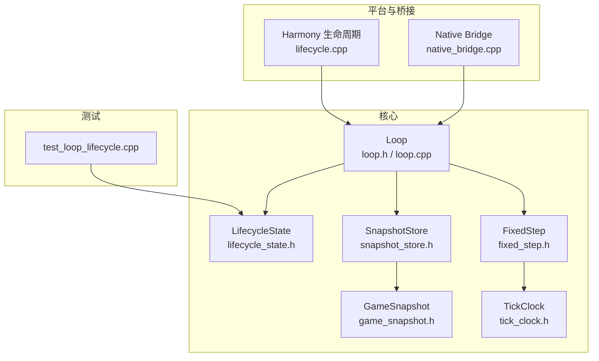
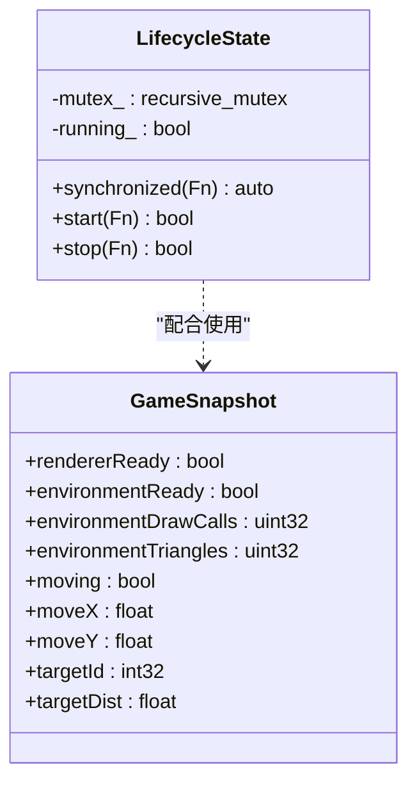
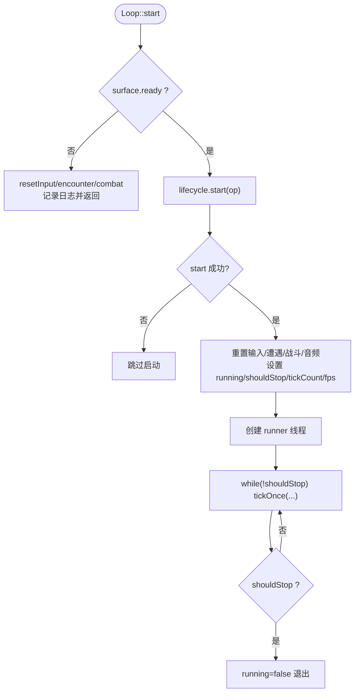
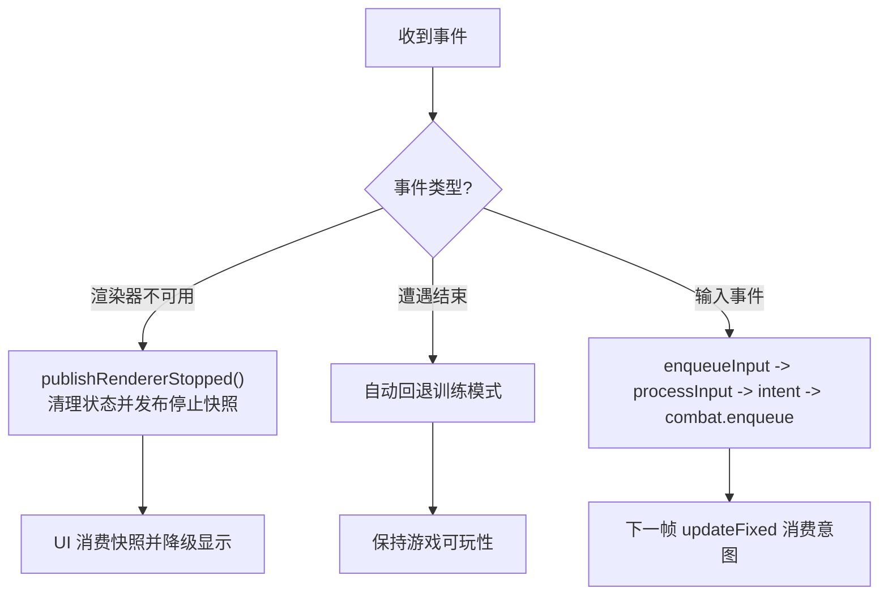
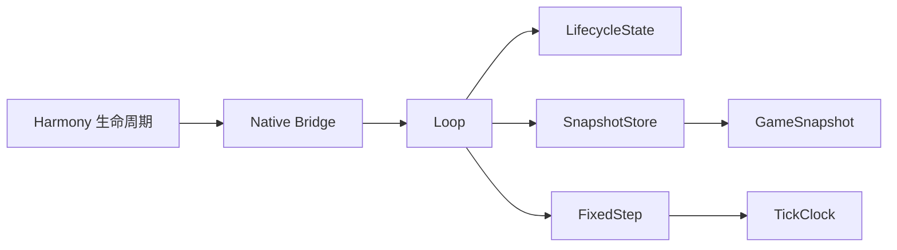

# 生命周期管理

<cite>
**本文引用的文件**   
- [lifecycle_state.h](file://native/engine/core/lifecycle_state.h)
- [loop.h](file://native/engine/core/loop.h)
- [loop.cpp](file://native/engine/core/loop.cpp)
- [snapshot_store.h](file://native/engine/core/snapshot_store.h)
- [game_snapshot.h](file://native/engine/core/game_snapshot.h)
- [fixed_step.h](file://native/engine/core/fixed_step.h)
- [tick_clock.h](file://native/engine/core/tick_clock.h)
- [lifecycle.cpp](file://native/platform/harmony/lifecycle.cpp)
- [native_bridge.cpp](file://entry/src/main/cpp/native_bridge.cpp)
- [test_loop_lifecycle.cpp](file://tests/test_loop_lifecycle.cpp)
</cite>

## 目录
1. [简介](#简介)
2. [项目结构](#项目结构)
3. [核心组件](#核心组件)
4. [架构总览](#架构总览)
5. [详细组件分析](#详细组件分析)
6. [依赖关系分析](#依赖关系分析)
7. [性能考量](#性能考量)
8. [故障排查指南](#故障排查指南)
9. [结论](#结论)
10. [附录](#附录)

## 简介
本文件面向 my-world 游戏引擎的生命周期管理系统，围绕 LifecycleState 类与 Loop 的 withLifecycle() 机制展开，系统阐述状态定义、状态转换、同步访问控制、事件处理与错误恢复策略。文档同时覆盖生命周期管理与内存/资源管理的集成方式，并提供从初学者到高级开发者的分层说明与扩展建议。

## 项目结构
生命周期相关代码主要分布在以下位置：
- 核心状态机与循环：native/engine/core（lifecycle_state.h, loop.h, loop.cpp）
- 快照与固定步长：native/engine/core（snapshot_store.h, game_snapshot.h, fixed_step.h, tick_clock.h）
- 平台桥接与回调：native/platform/harmony（lifecycle.cpp）、entry/src/main/cpp（native_bridge.cpp）
- 测试用例：tests/test_loop_lifecycle.cpp



**图表来源**
- [lifecycle_state.h:1-51](file://native/engine/core/lifecycle_state.h#L1-L51)
- [loop.h:26-104](file://native/engine/core/loop.h#L26-L104)
- [loop.cpp:131-203](file://native/engine/core/loop.cpp#L131-L203)
- [snapshot_store.h:1-21](file://native/engine/core/snapshot_store.h#L1-L21)
- [game_snapshot.h:1-74](file://native/engine/core/game_snapshot.h#L1-L74)
- [fixed_step.h:1-49](file://native/engine/core/fixed_step.h#L1-L49)
- [tick_clock.h:1-7](file://native/engine/core/tick_clock.h#L1-L7)
- [lifecycle.cpp:1-5](file://native/platform/harmony/lifecycle.cpp#L1-L5)
- [native_bridge.cpp:59-111](file://entry/src/main/cpp/native_bridge.cpp#L59-L111)
- [test_loop_lifecycle.cpp:1-80](file://tests/test_loop_lifecycle.cpp#L1-L80)

**章节来源**
- [lifecycle_state.h:1-51](file://native/engine/core/lifecycle_state.h#L1-L51)
- [loop.h:26-104](file://native/engine/core/loop.h#L26-L104)
- [loop.cpp:131-203](file://native/engine/core/loop.cpp#L131-L203)
- [snapshot_store.h:1-21](file://native/engine/core/snapshot_store.h#L1-L21)
- [game_snapshot.h:1-74](file://native/engine/core/game_snapshot.h#L1-L74)
- [fixed_step.h:1-49](file://native/engine/core/fixed_step.h#L1-L49)
- [tick_clock.h:1-7](file://native/engine/core/tick_clock.h#L1-L7)
- [lifecycle.cpp:1-5](file://native/platform/harmony/lifecycle.cpp#L1-L5)
- [native_bridge.cpp:59-111](file://entry/src/main/cpp/native_bridge.cpp#L59-L111)
- [test_loop_lifecycle.cpp:1-80](file://tests/test_loop_lifecycle.cpp#L1-L80)

## 核心组件
- LifecycleState：提供线程安全的“运行/停止”二元状态机，支持递归锁保护的可重入操作，以及 start()/stop() 原子切换。
- Loop：游戏主循环聚合体，封装渲染、输入、战斗、AI、VFX、音频等子系统；通过 withLifecycle() 统一进入受保护上下文执行关键操作。
- SnapshotStore + GameSnapshot：帧级快照发布/读取，供 UI/JS 层消费；在生命周期变化时进行一致性重置。
- FixedStep + TickClock：固定时间步长推进逻辑更新，保证确定性。
- Harmony 生命周期桥接：监听应用前后台，暂停/恢复 Loop，并在进入后台时保存状态。

**章节来源**
- [lifecycle_state.h:6-37](file://native/engine/core/lifecycle_state.h#L6-L37)
- [loop.h:26-104](file://native/engine/core/loop.h#L26-L104)
- [snapshot_store.h:5-21](file://native/engine/core/snapshot_store.h#L5-L21)
- [game_snapshot.h:7-74](file://native/engine/core/game_snapshot.h#L7-L74)
- [fixed_step.h:8-49](file://native/engine/core/fixed_step.h#L8-L49)
- [tick_clock.h:1-7](file://native/engine/core/tick_clock.h#L1-L7)
- [lifecycle.cpp:1-5](file://native/platform/harmony/lifecycle.cpp#L1-L5)

## 架构总览
下图展示生命周期在引擎中的整体交互：平台回调通过 Native Bridge 调用 Loop，所有涉及状态变更的操作均经 withLifecycle() 进入受保护区域；内部使用 LifecycleState.start()/stop() 确保互斥与幂等；快照通过 SnapshotStore 发布给上层。

```mermaid
sequenceDiagram
participant Platform as "平台(Harmony)"
participant Bridge as "Native Bridge"
participant Loop as "Loop"
participant LS as "LifecycleState"
participant Store as "SnapshotStore"
Platform->>Bridge : "OnSurfaceCreated/Changed/Destroyed"
Bridge->>Loop : "withLifecycle(operation)"
Loop->>LS : "start()/stop()"
alt 启动成功
Loop-->>Platform : "开始渲染/更新循环"
else 已运行或失败
Loop-->>Platform : "跳过/记录日志"
end
Loop->>Store : "publish(GameSnapshot)"
Store-->>Platform : "read() 获取快照"
```

**图表来源**
- [native_bridge.cpp:59-111](file://entry/src/main/cpp/native_bridge.cpp#L59-L111)
- [loop.cpp:131-203](file://native/engine/core/loop.cpp#L131-L203)
- [lifecycle_state.h:8-32](file://native/engine/core/lifecycle_state.h#L8-L32)
- [snapshot_store.h:7-15](file://native/engine/core/snapshot_store.h#L7-L15)

## 详细组件分析

### LifecycleState：状态机与同步访问控制
- 设计要点
  - 使用递归互斥量实现可重入的 synchronized()，允许嵌套调用安全执行。
  - start()/stop() 对 running_ 标志进行原子切换，并执行传入操作，返回是否成功。
  - 提供 RendererStoppedSnapshot() 辅助函数，用于渲染器停止时的快照清理。
- 复杂度与并发
  - 时间复杂度 O(1)，空间复杂度 O(1)。
  - 多线程安全：同一时刻仅一个操作持有锁，避免竞态。
- 典型用法
  - 在 Loop::start()/stop() 中包裹初始化/清理逻辑。
  - 在跨线程入口（如 N-API）中使用 withLifecycle() 进入受保护上下文。



**图表来源**
- [lifecycle_state.h:6-37](file://native/engine/core/lifecycle_state.h#L6-L37)
- [game_snapshot.h:7-74](file://native/engine/core/game_snapshot.h#L7-L74)

**章节来源**
- [lifecycle_state.h:6-37](file://native/engine/core/lifecycle_state.h#L6-L37)
- [lifecycle_state.h:39-51](file://native/engine/core/lifecycle_state.h#L39-L51)
- [test_loop_lifecycle.cpp:10-51](file://tests/test_loop_lifecycle.cpp#L10-L51)

### Loop：主循环与 withLifecycle() 模式
- 职责
  - 管理渲染表面、输入队列、相机、玩家控制器、战斗、遭遇战、演示导演、VFX、性能守卫、音频桥接等子系统。
  - 通过 withLifecycle() 将关键操作纳入生命周期保护，确保线程安全与状态一致性。
  - 使用 FixedStep 驱动确定性更新，发布 GameSnapshot 供上层消费。
- 生命周期流程
  - start()：校验 surface.ready，重置输入/战斗/音频，设置 running/shouldStop，创建主线程循环。
  - stop()：置 shouldStop，join 线程，重置各子系统并发布暂停快照。
  - tickOnce()：处理输入、固定步长更新、渲染、统计 FPS、发布快照。
  - publishRendererStopped()：渲染器不可用时清理状态并发布“停止”快照。
- withLifecycle() 语义
  - 作为统一入口，内部委托 LifecycleState.synchronized()，保证操作互斥且可重入。



**图表来源**
- [loop.cpp:131-174](file://native/engine/core/loop.cpp#L131-L174)

**章节来源**
- [loop.h:26-104](file://native/engine/core/loop.h#L26-L104)
- [loop.cpp:131-203](file://native/engine/core/loop.cpp#L131-L203)
- [loop.cpp:311-417](file://native/engine/core/loop.cpp#L311-L417)
- [loop.cpp:600-614](file://native/engine/core/loop.cpp#L600-L614)

### 快照与固定步长：数据流与一致性
- SnapshotStore：读写 GameSnapshot 加锁，保证发布/读取一致。
- GameSnapshot：包含渲染、环境、战斗、演示、性能等多维度状态字段。
- FixedStep：累积时间并分片推进逻辑更新，限制最大步数防止卡顿雪崩。
- TickClock：定义 Tick 与定点数类型，保证数值精度与一致性。

```mermaid
sequenceDiagram
participant Loop as "Loop"
participant FS as "FixedStep"
participant Update as "updateFixed(...)"
participant Store as "SnapshotStore"
participant UI as "UI/JS"
Loop->>FS : "advance(elapsedMs, callback)"
FS-->>Update : "多次调用 updateFixed(tick, dtMs)"
Update->>Store : "publish(updated snapshot)"
UI->>Store : "read()"
Store-->>UI : "返回快照副本"
```

**图表来源**
- [fixed_step.h:16-37](file://native/engine/core/fixed_step.h#L16-L37)
- [loop.cpp:329-331](file://native/engine/core/loop.cpp#L329-L331)
- [snapshot_store.h:7-15](file://native/engine/core/snapshot_store.h#L7-L15)
- [game_snapshot.h:7-74](file://native/engine/core/game_snapshot.h#L7-L74)

**章节来源**
- [snapshot_store.h:5-21](file://native/engine/core/snapshot_store.h#L5-L21)
- [game_snapshot.h:7-74](file://native/engine/core/game_snapshot.h#L7-L74)
- [fixed_step.h:8-49](file://native/engine/core/fixed_step.h#L8-L49)
- [tick_clock.h:1-7](file://native/engine/core/tick_clock.h#L1-L7)

### 平台生命周期与资源管理集成
- Harmony 生命周期回调：监听应用前后台，暂停/恢复 Loop，并在进入后台时保存状态（预留接口）。
- Native Bridge：在 OnSurfaceCreated/Changed/Destroyed 中调用 withLifecycle() 进行窗口初始化/调整/销毁，确保与主循环生命周期一致。
- 资源提交：模型与环境资源批量拷贝后，在 withLifecycle() 保护的上下文中一次性提交，避免中间态被消费。

```mermaid
sequenceDiagram
participant OS as "操作系统"
participant Harmony as "Harmony 生命周期"
participant Bridge as "Native Bridge"
participant Loop as "Loop"
participant LS as "LifecycleState"
OS->>Harmony : "应用前后台/窗口事件"
Harmony->>Bridge : "回调 OnSurface* / 前台请求"
Bridge->>Loop : "withLifecycle(operation)"
Loop->>LS : "start()/stop()"
Bridge->>Loop : "start()/stop() 根据前台状态"
Note over Bridge,Loop : "资源提交在 withLifecycle 内完成"
```

**图表来源**
- [lifecycle.cpp:1-5](file://native/platform/harmony/lifecycle.cpp#L1-L5)
- [native_bridge.cpp:59-111](file://entry/src/main/cpp/native_bridge.cpp#L59-L111)
- [native_bridge.cpp:151-210](file://entry/src/main/cpp/native_bridge.cpp#L151-L210)

**章节来源**
- [lifecycle.cpp:1-5](file://native/platform/harmony/lifecycle.cpp#L1-L5)
- [native_bridge.cpp:59-111](file://entry/src/main/cpp/native_bridge.cpp#L59-L111)
- [native_bridge.cpp:151-210](file://entry/src/main/cpp/native_bridge.cpp#L151-L210)

### 生命周期事件处理与错误恢复
- 事件来源
  - 渲染器就绪/不可用：tickOnce() 检测 surface.ready，不可用时调用 publishRendererStopped() 清理并发布停止快照。
  - 遭遇战/战斗状态：encounter/combat 状态变化影响快照字段，UI 据此更新目标与提示。
  - 输入事件：enqueueInput() 入队，processInput() 解析为意图并推入 combat。
- 错误恢复策略
  - start()/stop() 幂等：重复调用返回 false，避免重复启动/停止。
  - 渲染器不可用：强制停止遭遇/战斗，重置输入与动画，发布干净快照。
  - 前台/后台切换：仅在 foregroundRequested 为真时启动，避免后台误启动。



**图表来源**
- [loop.cpp:311-337](file://native/engine/core/loop.cpp#L311-L337)
- [loop.cpp:600-614](file://native/engine/core/loop.cpp#L600-L614)
- [loop.cpp:240-292](file://native/engine/core/loop.cpp#L240-L292)

**章节来源**
- [loop.cpp:311-337](file://native/engine/core/loop.cpp#L311-L337)
- [loop.cpp:600-614](file://native/engine/core/loop.cpp#L600-L614)
- [loop.cpp:240-292](file://native/engine/core/loop.cpp#L240-L292)

### 面向对象生命周期基础概念（初学者）
- 什么是生命周期：对象从创建到销毁的过程，包括初始化、运行、暂停、销毁等阶段。
- 为什么需要生命周期：统一管理资源分配/释放、状态切换、线程安全与错误恢复。
- 如何正确使用：
  - 在构造/初始化阶段准备资源。
  - 在运行阶段执行核心逻辑。
  - 在暂停/销毁阶段释放资源并清理状态。
  - 使用 withLifecycle() 确保跨线程操作的原子性与一致性。

[本节为概念性说明，不直接分析具体文件]

### 自定义状态机与扩展点（高级开发者）
- 扩展点
  - 在 LifecycleState::start()/stop() 的 operation 中注入自定义初始化/清理逻辑。
  - 在 Loop::updateFixed() 中插入新的子系统更新钩子。
  - 在 SnapshotStore.publish() 前后添加监控或审计逻辑。
- 自定义状态机
  - 基于 LifecycleState 的 running_ 标志扩展多状态枚举，结合 withLifecycle() 实现更复杂的状态转换图。
  - 使用 FixedStep 的回调机制，按 tick 粒度触发状态迁移。
- 最佳实践
  - 所有跨线程访问必须经 withLifecycle()。
  - 资源提交采用“先拷贝再提交”的批处理方式，避免中间态。
  - 快照字段需遵循“只读消费”原则，避免反向修改逻辑状态。

**章节来源**
- [lifecycle_state.h:8-32](file://native/engine/core/lifecycle_state.h#L8-L32)
- [loop.cpp:419-598](file://native/engine/core/loop.cpp#L419-L598)
- [snapshot_store.h:7-15](file://native/engine/core/snapshot_store.h#L7-L15)

## 依赖关系分析
- 耦合与内聚
  - Loop 高内聚地聚合多个子系统，通过 withLifecycle() 降低对外部线程的耦合。
  - LifecycleState 低耦合，仅提供最小化的同步与状态切换能力。
- 外部依赖
  - N-API（native_bridge.cpp）与平台生命周期（Harmony）通过回调与 Loop 交互。
  - 渲染与输入子系统通过 Surface/InputQueue 等接口与 Loop 解耦。
- 潜在循环依赖
  - 当前无循环依赖；SnapshotStore 仅被 Loop 写入，UI/JS 层读取，单向数据流。



**图表来源**
- [native_bridge.cpp:59-111](file://entry/src/main/cpp/native_bridge.cpp#L59-L111)
- [loop.cpp:131-203](file://native/engine/core/loop.cpp#L131-L203)
- [lifecycle_state.h:6-37](file://native/engine/core/lifecycle_state.h#L6-L37)
- [snapshot_store.h:5-21](file://native/engine/core/snapshot_store.h#L5-L21)
- [fixed_step.h:8-49](file://native/engine/core/fixed_step.h#L8-L49)
- [tick_clock.h:1-7](file://native/engine/core/tick_clock.h#L1-L7)

**章节来源**
- [native_bridge.cpp:59-111](file://entry/src/main/cpp/native_bridge.cpp#L59-L111)
- [loop.cpp:131-203](file://native/engine/core/loop.cpp#L131-L203)
- [lifecycle_state.h:6-37](file://native/engine/core/lifecycle_state.h#L6-L37)
- [snapshot_store.h:5-21](file://native/engine/core/snapshot_store.h#L5-L21)
- [fixed_step.h:8-49](file://native/engine/core/fixed_step.h#L8-L49)
- [tick_clock.h:1-7](file://native/engine/core/tick_clock.h#L1-L7)

## 性能考量
- 固定步长：FixedStep 限制每帧最大更新次数，避免卡顿雪崩。
- 快照发布：SnapshotStore 使用简单互斥，读写开销小，适合高频发布。
- 渲染路径：仅在 OHOS_PLATFORM 下执行渲染与交换缓冲，减少跨平台开销。
- 性能采样：PerformanceGuard 采样 FPS 与性能等级，动态调整渲染质量。

[本节为通用指导，不直接分析具体文件]

## 故障排查指南
- 常见问题
  - 重复启动/停止：检查 start()/stop() 返回值，确认 running_ 状态。
  - 渲染器不可用：查看 surface.ready 与 publishRendererStopped() 调用路径。
  - 前台/后台切换异常：确认 g_foregroundRequested 与 NativeStartIfForeground 行为。
  - 资源泄漏：确保 in withLifecycle() 中完成资源拷贝与提交，避免中间态。
- 调试技巧
  - 使用 LOGI/LOGE 输出关键路径与状态。
  - 通过 snapshots.read() 观察快照字段变化。
  - 使用 test_loop_lifecycle.cpp 验证并发与幂等性。

**章节来源**
- [loop.cpp:131-203](file://native/engine/core/loop.cpp#L131-L203)
- [loop.cpp:311-337](file://native/engine/core/loop.cpp#L311-L337)
- [native_bridge.cpp:144-149](file://entry/src/main/cpp/native_bridge.cpp#L144-L149)
- [test_loop_lifecycle.cpp:10-51](file://tests/test_loop_lifecycle.cpp#L10-L51)

## 结论
my-world 的生命周期管理以 LifecycleState 为核心，结合 Loop 的 withLifecycle() 机制，实现了线程安全、幂等、可扩展的状态切换与资源管理。通过 SnapshotStore 与 FixedStep，引擎保证了数据一致性与确定性更新。平台生命周期与资源提交的集成确保了在不同场景下的稳定运行。对于初学者，理解生命周期阶段与 withLifecycle() 的使用是关键；对于高级开发者，可通过扩展点定制状态机与更新钩子，满足复杂需求。

[本节为总结性内容，不直接分析具体文件]

## 附录
- 使用示例（路径引用）
  - 在 N-API 中通过 withLifecycle() 启动/停止循环：[native_bridge.cpp:59-111](file://entry/src/main/cpp/native_bridge.cpp#L59-L111)
  - 在资源提交时使用 withLifecycle() 保证原子性：[native_bridge.cpp:151-210](file://entry/src/main/cpp/native_bridge.cpp#L151-L210)
  - 在测试中验证 LifecycleState 的并发与幂等性：[test_loop_lifecycle.cpp:10-51](file://tests/test_loop_lifecycle.cpp#L10-L51)

[本节为补充信息，不直接分析具体文件]