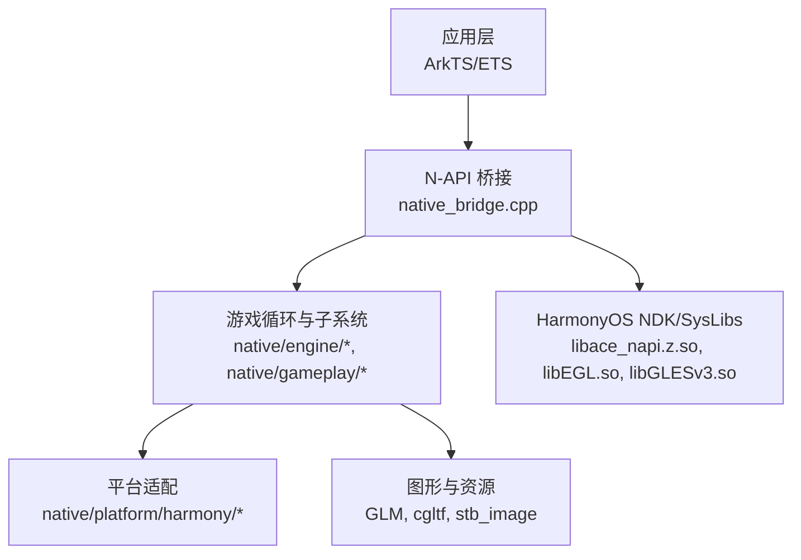
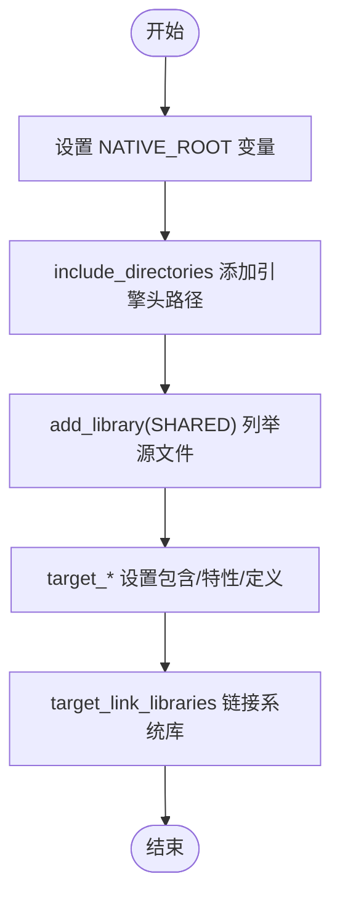
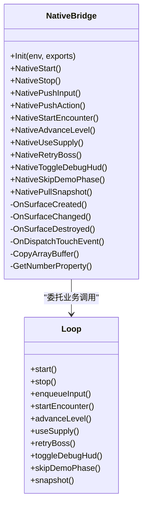
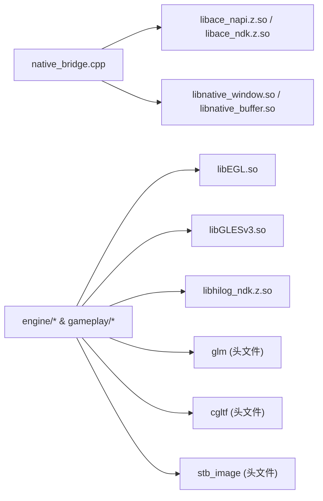

# CMake 编译配置

<cite>
**本文引用的文件**   
- [entry/src/main/cpp/CMakeLists.txt](file://entry/src/main/cpp/CMakeLists.txt)
- [entry/build-profile.json5](file://entry/build-profile.json5)
- [build-profile.json5](file://build-profile.json5)
- [entry/oh-package.json5](file://entry/oh-package.json5)
- [entry/src/main/cpp/types/libnative_game/oh-package.json5](file://entry/src/main/cpp/types/libnative_game/oh-package.json5)
- [entry/src/main/cpp/native_bridge.cpp](file://entry/src/main/cpp/native_bridge.cpp)
- [native/third_party/cgltf/cgltf.h](file://native/third_party/cgltf/cgltf.h)
</cite>

## 目录
1. [简介](#简介)
2. [项目结构](#项目结构)
3. [核心组件](#核心组件)
4. [架构总览](#架构总览)
5. [详细组件分析](#详细组件分析)
6. [依赖分析](#依赖分析)
7. [性能考虑](#性能考虑)
8. [故障排查指南](#故障排查指南)
9. [结论](#结论)
10. [附录](#附录)

## 简介
本文件为 my-world 项目的 CMake 编译系统提供完整技术文档，重点围绕 entry/src/main/cpp/CMakeLists.txt 的构建脚本结构、源文件组织、依赖管理与链接配置；原生代码的编译选项、优化设置与调试配置；跨平台 ABI 兼容处理；第三方库集成方式与头文件路径配置；并提供常用编译命令与错误排查方法、性能优化建议与增量编译配置。

## 项目结构
my-world 采用 HarmonyOS 工程结构，C++ 源码位于 native/ 目录，N-API 桥接入口在 entry/src/main/cpp/native_bridge.cpp，CMake 构建脚本位于 entry/src/main/cpp/CMakeLists.txt。HarmonyOS 构建系统通过 build-profile.json5 和模块级 build-profile.json5 指定外部 CMake 脚本路径、ABI 过滤与编译器选项。



图表来源 
- [entry/src/main/cpp/native_bridge.cpp](file://entry/src/main/cpp/native_bridge.cpp)
- [entry/src/main/cpp/CMakeLists.txt](file://entry/src/main/cpp/CMakeLists.txt)

章节来源
- [entry/src/main/cpp/CMakeLists.txt:1-135](file://entry/src/main/cpp/CMakeLists.txt#L1-L135)
- [entry/build-profile.json5:1-17](file://entry/build-profile.json5#L1-L17)
- [build-profile.json5:1-69](file://build-profile.json5#L1-L69)

## 核心组件
- CMake 目标：共享库 native_game（SHARED），由 N-API 模块导出给 ArkTS 调用。
- 包含路径：统一指向 native/ 根及子模块目录，确保引擎各子系统可被正确引用。
- 编译特性与定义：启用 C++17，定义 OHOS_PLATFORM 以区分平台分支。
- 链接库：N-API、窗口缓冲、EGL/GLES、日志等系统库。

章节来源
- [entry/src/main/cpp/CMakeLists.txt:26-135](file://entry/src/main/cpp/CMakeLists.txt#L26-L135)

## 架构总览
下图展示从 ArkTS 到原生库的调用链路与关键依赖关系。

```mermaid
sequenceDiagram
participant Ark as "ArkTS/ETS"
participant Bridge as "N-API 桥接<br/>native_bridge.cpp"
participant Loop as "Loop/Engine<br/>native/engine/core"
participant Render as "渲染子系统<br/>engine/render"
participant Sys as "系统库<br/>EGL/GLES/NAPI"
Ark->>Bridge : 调用 nativeStart/pushInput/startEncounter...
Bridge->>Loop : 封装参数并调用 Loop API
Loop->>Render : 更新场景/提交绘制
Render-->>Sys : 调用 EGL/GLES 接口
Sys-->>Bridge : 生命周期回调(OnSurfaceCreated/Changed/Destroyed)
Bridge-->>Ark : pullSnapshot 返回状态对象
```

图表来源 
- [entry/src/main/cpp/native_bridge.cpp](file://entry/src/main/cpp/native_bridge.cpp)
- [entry/src/main/cpp/CMakeLists.txt](file://entry/src/main/cpp/CMakeLists.txt)

## 详细组件分析

### CMakeLists.txt 构建脚本解析
- 最低版本与项目名称：cmake_minimum_required(VERSION 3.5)，project(native_game)。
- 包含路径：通过 include_directories 将 native/ 及其子模块加入搜索路径，避免相对路径混乱。
- 源文件组织：add_library 明确列出所有 .cpp/.h 文件，按模块分组注释便于维护。
- 目标属性：
  - target_include_directories：追加 native/.. 作为私有包含路径。
  - target_compile_features：启用 cxx_std_17。
  - target_compile_definitions：定义 OHOS_PLATFORM。
- 链接配置：target_link_libraries 链接 N-API、窗口、EGL/GLES、日志等系统库。



图表来源 
- [entry/src/main/cpp/CMakeLists.txt:1-135](file://entry/src/main/cpp/CMakeLists.txt#L1-L135)

章节来源
- [entry/src/main/cpp/CMakeLists.txt:1-135](file://entry/src/main/cpp/CMakeLists.txt#L1-L135)

### 原生桥接与 N-API 绑定
- 入口函数 Init 使用 napi_define_properties 注册多个导出函数，如 nativeStart、pushInput、startEncounter、pullSnapshot 等。
- 生命周期回调 OnSurfaceCreated/Changed/Destroyed 与 DispatchTouchEvent 负责 Surface 初始化、尺寸变化与触摸事件转发。
- 数据拷贝与校验：CopyArrayBuffer 用于安全复制 ArrayBuffer，GetNumberProperty 用于数值字段校验。
- 快照输出：NativePullSnapshot 将内部 GameSnapshot 转换为 JS 对象，供 UI 消费。



图表来源 
- [entry/src/main/cpp/native_bridge.cpp](file://entry/src/main/cpp/native_bridge.cpp)

章节来源
- [entry/src/main/cpp/native_bridge.cpp:1-577](file://entry/src/main/cpp/native_bridge.cpp#L1-L577)

### 第三方库集成：cgltf
- 位置：native/third_party/cgltf/cgltf.h，单头实现，遵循“仅在一个源文件中定义 CGLTF_IMPLEMENTATION”的使用约定。
- 用途：解析 glTF/GLB 模型数据，配合渲染管线加载网格、纹理与动画。
- 集成要点：头文件路径需纳入 include_directories；若需要实现，需在对应源文件中定义宏后包含该头。

章节来源
- [native/third_party/cgltf/cgltf.h:1-200](file://native/third_party/cgltf/cgltf.h#L1-L200)

### HarmonyOS 构建系统与 ABI 过滤
- 模块级 build-profile.json5：指定 externalNativeOptions.path 指向 CMakeLists.txt，abiFilters 限定 arm64-v8a 与 x86_64，cppFlags 留空。
- 应用级 build-profile.json5：声明 nativeCompiler 为 BiSheng，debug/release 模式分别设置 debuggable 与外部 CMake 选项。
- oh-package.json5：声明对 libnative_game.so 的依赖，类型定义位于 types/libnative_game/Index.d.ts。

章节来源
- [entry/build-profile.json5:1-17](file://entry/build-profile.json5#L1-L17)
- [build-profile.json5:1-69](file://build-profile.json5#L1-L69)
- [entry/oh-package.json5:1-12](file://entry/oh-package.json5#L1-L12)
- [entry/src/main/cpp/types/libnative_game/oh-package.json5:1-7](file://entry/src/main/cpp/types/libnative_game/oh-package.json5#L1-L7)

## 依赖分析
- 直接依赖：
  - N-API 与 XComponent：libace_napi.z.so、libace_ndk.z.so、libnative_window.so、libnative_buffer.so
  - 图形：libEGL.so、libGLESv3.so
  - 日志：libhilog_ndk.z.so
- 间接依赖：
  - GLM：数学库，头文件位于 engine/math/glm
  - cgltf：glTF 解析器，头文件位于 third_party/cgltf
  - stb_image：图像解码，头文件位于 engine/render/stb_image.h



图表来源 
- [entry/src/main/cpp/CMakeLists.txt:126-134](file://entry/src/main/cpp/CMakeLists.txt#L126-L134)
- [entry/src/main/cpp/native_bridge.cpp](file://entry/src/main/cpp/native_bridge.cpp)

章节来源
- [entry/src/main/cpp/CMakeLists.txt:126-134](file://entry/src/main/cpp/CMakeLists.txt#L126-L134)

## 性能考虑
- 编译优化：
  - 建议在 release 模式下开启优化开关（例如 -O2/-O3）与 LTO（视工具链支持而定）。
  - 针对 ARM64 可使用 NEON/SIMD 相关编译选项提升向量计算性能。
- 增量编译：
  - CMake 默认支持增量编译，修改单个源文件仅重编译该文件及依赖树。
  - 合理拆分头文件与减少不必要的 include 可降低重编译开销。
- 运行时优化：
  - 控制 draw call 与三角面数量，利用 asset_profile 进行资源裁剪。
  - 合理使用 VFX 开关与性能等级，降低峰值负载。

[本节为通用指导，不直接分析具体文件]

## 故障排查指南
- “all specified target directories are invalid”
  - 原因：include_directories 或 target_include_directories 中路径不存在或拼写错误。
  - 解决：确认 NATIVE_ROOT 与子模块路径有效，检查 CMake 生成目录与源目录一致性。
- 链接失败（未找到符号）
  - 原因：缺少系统库或 N-API 导出未正确注册。
  - 解决：核对 target_link_libraries 列表，确认 Init 中 napi_define_properties 已注册所需函数。
- ABI 不匹配
  - 原因：abiFilters 与实际设备架构不一致。
  - 解决：在 build-profile.json5 中调整 abiFilters，确保包含 arm64-v8a 与 x86_64。
- 头文件找不到
  - 原因：第三方库头路径未加入 include_directories。
  - 解决：将 third_party 与 math/render 等路径加入 include_directories。
- 运行时崩溃（Surface 初始化失败）
  - 原因：surface_init/surface_resize 失败导致渲染不可用。
  - 解决：检查 OnSurfaceCreated/Changed 回调中的错误分支，确保窗口句柄非空且生命周期顺序正确。

章节来源
- [entry/src/main/cpp/CMakeLists.txt:8-23](file://entry/src/main/cpp/CMakeLists.txt#L8-L23)
- [entry/src/main/cpp/CMakeLists.txt:120-134](file://entry/src/main/cpp/CMakeLists.txt#L120-L134)
- [entry/build-profile.json5:4-9](file://entry/build-profile.json5#L4-L9)
- [build-profile.json5:30-52](file://build-profile.json5#L30-L52)
- [entry/src/main/cpp/native_bridge.cpp:59-111](file://entry/src/main/cpp/native_bridge.cpp#L59-L111)

## 结论
本项目通过清晰的 CMake 脚本与 HarmonyOS 构建系统集成，实现了稳定的 N-API 桥接与多模块原生代码组织。合理的包含路径、明确的源文件分组与系统库链接策略保障了跨平台与 ABI 兼容性。结合 cgltf/GLM 等第三方库的头文件集成，以及严格的 ABI 过滤与构建模式管理，可在开发与发布阶段获得一致的构建体验。后续可通过优化编译选项与资源管线进一步提升性能。

[本节为总结性内容，不直接分析具体文件]

## 附录

### 常用编译命令
- 使用 DevEco Studio 构建：
  - 选择目标产品与 ABI（arm64-v8a/x86_64），执行 Build/Rebuild。
- 命令行（示例）：
  - 清理：rm -rf build && cmake -S . -B build
  - 构建：cmake --build build --config Release
  - 指定 ABI：在 build-profile.json5 中配置 abiFilters 后重新构建

[本节为通用指导，不直接分析具体文件]

### 增量编译与缓存
- CMake 缓存：首次生成后，后续修改仅触发增量编译。
- Ninja 后端：如需更快构建，可在 CMake 配置时指定 -G Ninja（若工具链支持）。

[本节为通用指导，不直接分析具体文件]