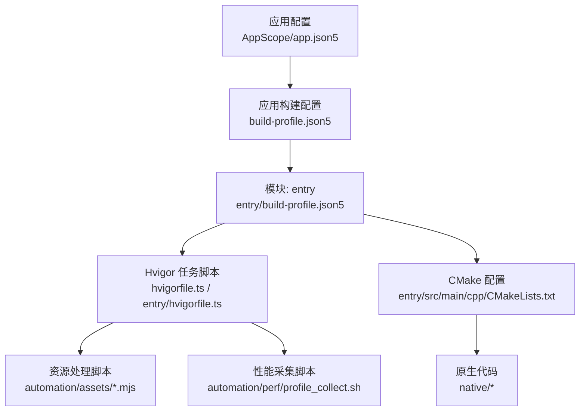
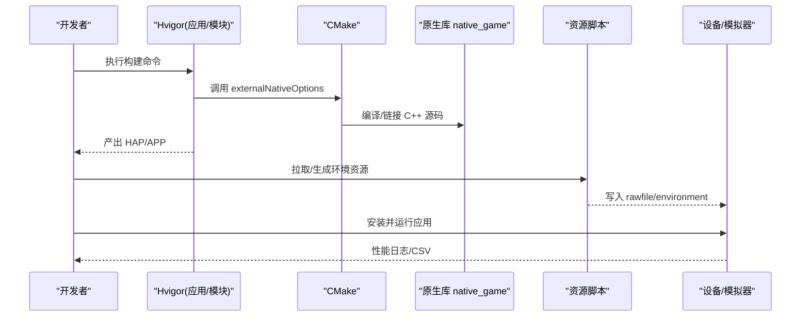
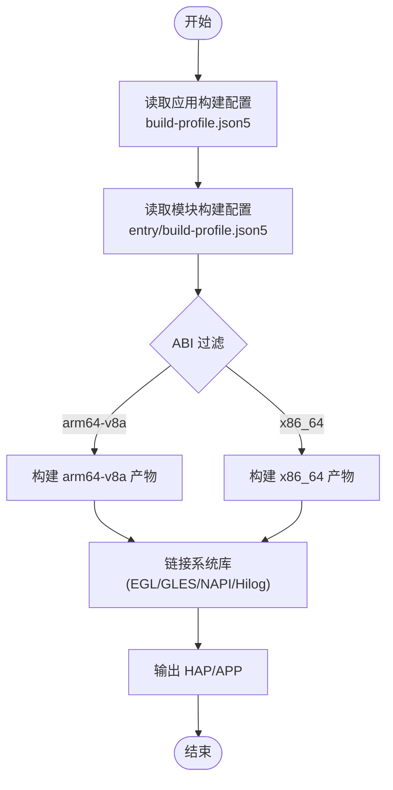
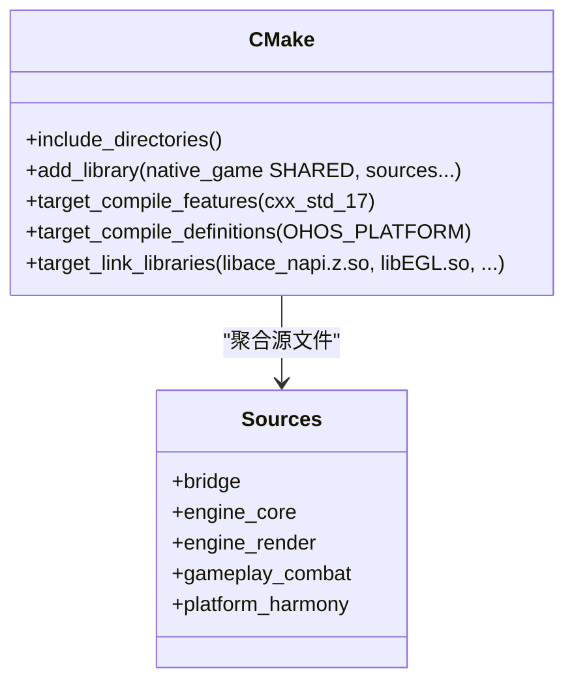
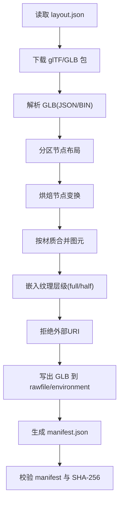
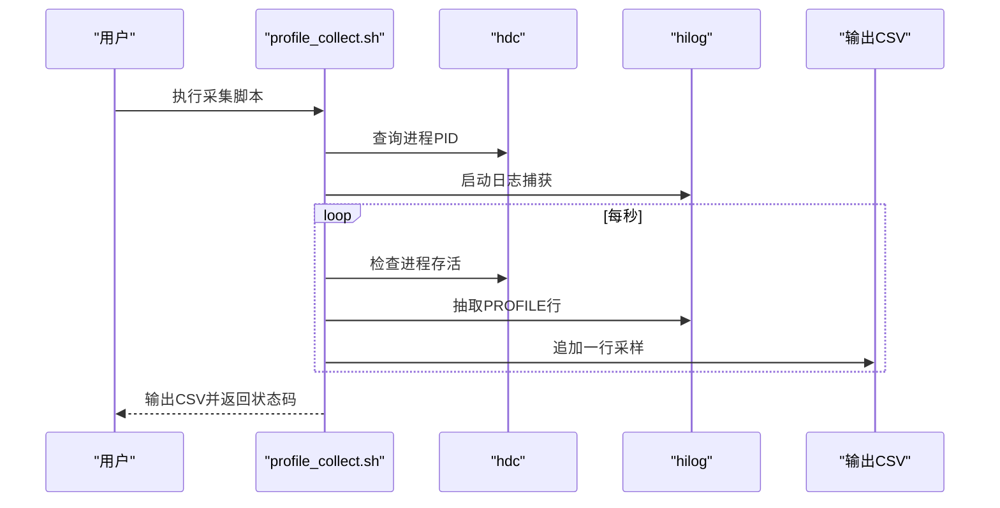
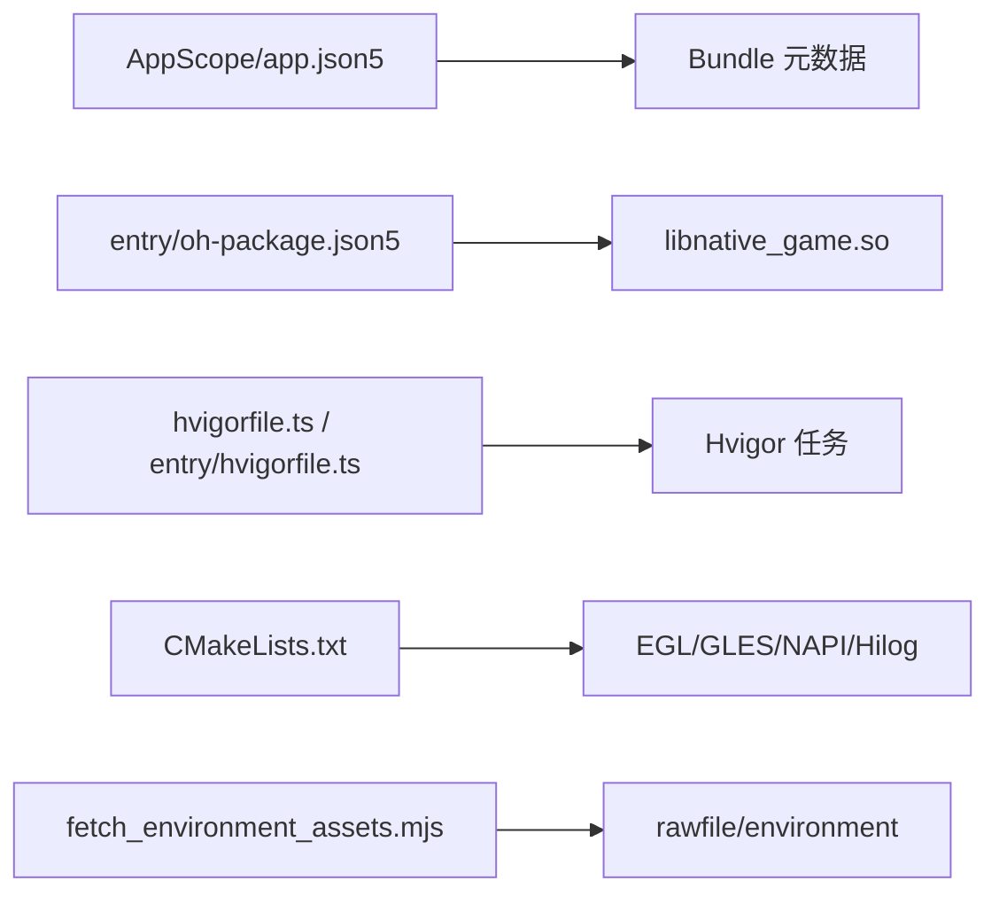

# 构建与部署

<cite>
**本文引用的文件**   
- [build-profile.json5](file://build-profile.json5)
- [hvigorfile.ts](file://hvigorfile.ts)
- [entry/build-profile.json5](file://entry/build-profile.json5)
- [entry/hvigorfile.ts](file://entry/hvigorfile.ts)
- [entry/src/main/cpp/CMakeLists.txt](file://entry/src/main/cpp/CMakeLists.txt)
- [hvigor/hvigor-config.json5](file://hvigor/hvigor-config.json5)
- [entry/oh-package.json5](file://entry/oh-package.json5)
- [AppScope/app.json5](file://AppScope/app.json5)
- [automation/assets/fetch_environment_assets.mjs](file://automation/assets/fetch_environment_assets.mjs)
- [automation/assets/validate_environment_assets.mjs](file://automation/assets/validate_environment_assets.mjs)
- [automation/hvigor/check_rules.js](file://automation/hvigor/check_rules.js)
- [automation/perf/profile_collect.sh](file://automation/perf/profile_collect.sh)
</cite>

## 目录
1. [简介](#简介)
2. [项目结构](#项目结构)
3. [核心组件](#核心组件)
4. [架构总览](#架构总览)
5. [详细组件分析](#详细组件分析)
6. [依赖分析](#依赖分析)
7. [性能考虑](#性能考虑)
8. [故障排除指南](#故障排除指南)
9. [结论](#结论)
10. [附录](#附录)

## 简介
本技术文档面向 my-world 项目的构建与部署体系，覆盖 HarmonyOS 应用构建配置、CMake 编译设置、Hvigor 任务脚本与环境资源处理流程。文档同时给出环境搭建、依赖管理、打包发布、自动化脚本使用、资源校验与环境准备的具体步骤；解释多平台构建与交叉编译策略；并提供增量编译、缓存优化、性能调优与常见问题排查建议。

## 项目结构
my-world 采用模块化工程组织：
- 顶层 build-profile.json5 定义应用签名、产品、构建模式（debug/release）、外部原生选项（CMake）及模块映射。
- entry 模块包含 ETS 入口、NAPI 桥接、C++ 源码与 CMake 配置，以及模块级构建配置 hvigorfile.ts 与 build-profile.json5。
- native 目录为游戏引擎与玩法逻辑的 C++ 实现，被 CMake 统一纳入链接。
- automation 目录提供资源拉取、校验、性能采集等自动化脚本。
- AppScope 与 hvigor 目录分别维护应用包元数据与 Hvigor 全局配置。

图表来源
- [AppScope/app.json5:1-13](file://AppScope/app.json5#L1-L13)
- [build-profile.json5:1-69](file://build-profile.json5#L1-L69)
- [entry/build-profile.json5:1-17](file://entry/build-profile.json5#L1-L17)
- [hvigorfile.ts:1-7](file://hvigorfile.ts#L1-L7)
- [entry/hvigorfile.ts:1-7](file://entry/hvigorfile.ts#L1-L7)
- [entry/src/main/cpp/CMakeLists.txt:1-135](file://entry/src/main/cpp/CMakeLists.txt#L1-L135)
- [automation/assets/fetch_environment_assets.mjs:1-812](file://automation/assets/fetch_environment_assets.mjs#L1-L812)
- [automation/perf/profile_collect.sh:1-97](file://automation/perf/profile_collect.sh#L1-L97)

章节来源
- [build-profile.json5:1-69](file://build-profile.json5#L1-L69)
- [entry/build-profile.json5:1-17](file://entry/build-profile.json5#L1-L17)
- [hvigorfile.ts:1-7](file://hvigorfile.ts#L1-L7)
- [entry/hvigorfile.ts:1-7](file://entry/hvigorfile.ts#L1-L7)
- [entry/src/main/cpp/CMakeLists.txt:1-135](file://entry/src/main/cpp/CMakeLists.txt#L1-L135)
- [AppScope/app.json5:1-13](file://AppScope/app.json5#L1-L13)

## 核心组件
- 应用与模块构建配置
  - 应用层：签名配置、产品目标、SDK 版本、构建模式（debuggable、externalNativeOptions）。
  - 模块层：stageMode API、外部原生选项（CMake 路径、ABI 过滤、cppFlags）、targets。
- Hvigor 任务系统
  - 应用与模块均通过 hvigorfile.ts 引入官方 ohos 插件任务集（appTasks/hapTasks），无自定义插件扩展。
- CMake 编译
  - 指定 include 路径、源文件集合、C++ 标准、宏定义、链接库（EGL/GLES/ACE NAPI/Hilog 等）。
- 资源处理与验证
  - 拉取并生成环境 GLB 资源、嵌入纹理层级、输出 manifest 与 rawfile 资源。
  - 校验 manifest 合法性、SHA-256 一致性、来源可追溯性。
- 性能采集
  - 基于 hdc + hilog 抓取运行期指标，输出 CSV 并进行阈值判定。

章节来源
- [build-profile.json5:18-52](file://build-profile.json5#L18-L52)
- [entry/build-profile.json5:1-17](file://entry/build-profile.json5#L1-L17)
- [hvigorfile.ts:1-7](file://hvigorfile.ts#L1-L7)
- [entry/hvigorfile.ts:1-7](file://entry/hvigorfile.ts#L1-L7)
- [entry/src/main/cpp/CMakeLists.txt:1-135](file://entry/src/main/cpp/CMakeLists.txt#L1-L135)
- [automation/assets/fetch_environment_assets.mjs:1-812](file://automation/assets/fetch_environment_assets.mjs#L1-L812)
- [automation/assets/validate_environment_assets.mjs:1-80](file://automation/assets/validate_environment_assets.mjs#L1-L80)
- [automation/perf/profile_collect.sh:1-97](file://automation/perf/profile_collect.sh#L1-L97)

## 架构总览
下图展示从 Hvigor 到 CMake 再到运行时资源处理的端到端链路。

图表来源
- [hvigorfile.ts:1-7](file://hvigorfile.ts#L1-L7)
- [entry/hvigorfile.ts:1-7](file://entry/hvigorfile.ts#L1-L7)
- [entry/build-profile.json5:1-17](file://entry/build-profile.json5#L1-L17)
- [entry/src/main/cpp/CMakeLists.txt:1-135](file://entry/src/main/cpp/CMakeLists.txt#L1-L135)
- [automation/assets/fetch_environment_assets.mjs:1-812](file://automation/assets/fetch_environment_assets.mjs#L1-L812)
- [automation/perf/profile_collect.sh:1-97](file://automation/perf/profile_collect.sh#L1-L97)

## 详细组件分析

### 构建配置（应用与模块）
- 应用级 build-profile.json5
  - signingConfigs：调试签名信息（证书、密钥别名、密码、算法、p12/p7b 路径）。
  - products：产品名称、签名配置、兼容/目标 SDK、运行时 OS、构建选项（nativeCompiler 指定 BiSheng）。
  - buildModeSet：debug/release 两种模式，debug 开启 debuggable 并配置 externalNativeOptions（CMake 路径、ABI 过滤 arm64-v8a/x86_64、cppFlags）。
  - modules：声明 entry 模块及其 target 与 product 映射。
- 模块级 entry/build-profile.json5
  - apiType 为 stageMode。
  - externalNativeOptions：指向 entry/src/main/cpp/CMakeLists.txt，ABI 过滤与 cppFlags。
  - targets：默认 target default。

图表来源
- [build-profile.json5:18-52](file://build-profile.json5#L18-L52)
- [entry/build-profile.json5:1-17](file://entry/build-profile.json5#L1-L17)

章节来源
- [build-profile.json5:1-69](file://build-profile.json5#L1-L69)
- [entry/build-profile.json5:1-17](file://entry/build-profile.json5#L1-L17)

### CMake 编译设置
- 头文件路径：将 native 根目录及各子模块（engine/core、input、math、render、presentation、resource、gameplay/*、platform/harmony）加入 include。
- 源文件：聚合 bridge、engine、gameplay、platform 等关键 C++ 源文件。
- 编译特性：启用 cxx_std_17，定义 OHOS_PLATFORM。
- 链接库：libace_napi.z.so、libace_ndk.z.so、libnative_window.so、libnative_buffer.so、libEGL.so、libGLESv3.so、libhilog_ndk.z.so。

图表来源
- [entry/src/main/cpp/CMakeLists.txt:1-135](file://entry/src/main/cpp/CMakeLists.txt#L1-L135)

章节来源
- [entry/src/main/cpp/CMakeLists.txt:1-135](file://entry/src/main/cpp/CMakeLists.txt#L1-L135)

### Hvigor 任务脚本
- 应用 hvigorfile.ts：导入 appTasks，作为应用构建任务集。
- 模块 hvigorfile.ts：导入 hapTasks，作为 HAP 模块任务集。
- 两者均未注册自定义插件，保持最小化配置。

章节来源
- [hvigorfile.ts:1-7](file://hvigorfile.ts#L1-L7)
- [entry/hvigorfile.ts:1-7](file://entry/hvigorfile.ts#L1-L7)
- [hvigor/hvigor-config.json5:1-4](file://hvigor/hvigor-config.json5#L1-L4)

### 资源处理流程（环境与模型）
- fetch_environment_assets.mjs
  - 从 Poly Haven 获取 glTF/GLB 索引，选择 2K 下载项。
  - 解析 GLB（JSON+BIN 分块），分区节点布局（outerRing/centerRift/backdrop/decoration）。
  - 烘焙节点变换矩阵，合并同材质图元，嵌入双级纹理（full/half），拒绝外部 URI。
  - 输出 GLB 至 entry/src/main/resources/rawfile/environment，并生成 assets/environment/manifest.json（含来源与派生资源 SHA-256）。
- validate_environment_assets.mjs
  - 校验 manifest 许可证与 URL、sourceFiles 排序与完整性、SHA-256 一致性、派生资源哈希匹配。

图表来源
- [automation/assets/fetch_environment_assets.mjs:1-812](file://automation/assets/fetch_environment_assets.mjs#L1-L812)
- [automation/assets/validate_environment_assets.mjs:1-80](file://automation/assets/validate_environment_assets.mjs#L1-L80)

章节来源
- [automation/assets/fetch_environment_assets.mjs:1-812](file://automation/assets/fetch_environment_assets.mjs#L1-L812)
- [automation/assets/validate_environment_assets.mjs:1-80](file://automation/assets/validate_environment_assets.mjs#L1-L80)

### 性能采集与质量门禁
- profile_collect.sh
  - 参数：HDC_BIN、BUNDLE_NAME、PHASE(normal/boss)、DURATION_SECONDS、OUTPUT_CSV。
  - 行为：启动 hilog 捕获日志，轮询进程存活，提取 PROFILE 字段（fps、perf_level、environment_ready/draw_calls/triangles/texture_tier、encounter_mode），输出 CSV。
  - 门禁：检测致命渲染错误关键字；统计 FPS 低于阈值次数（normal≥30，boss≥24），连续超限时失败。

图表来源
- [automation/perf/profile_collect.sh:1-97](file://automation/perf/profile_collect.sh#L1-L97)

章节来源
- [automation/perf/profile_collect.sh:1-97](file://automation/perf/profile_collect.sh#L1-L97)

### 命名原创性检查（占位）
- check_rules.js：当前仅打印提示，用于后续对比命名/视觉/系统清单的评审记录。

章节来源
- [automation/hvigor/check_rules.js:1-3](file://automation/hvigor/check_rules.js#L1-L3)

## 依赖分析
- 应用包元数据
  - AppScope/app.json5：bundleName、vendor、versionCode/Name、图标与标签、min/target API。
- 模块依赖
  - entry/oh-package.json5：声明 libnative_game.so 本地依赖指向 types/libnative_game。
- 构建依赖
  - Hvigor：@ohos/hvigor-ohos-plugin（系统任务集）。
  - CMake：系统库 EGL/GLES/ACE NAPI/Hilog。
  - 资源脚本：Node.js 运行时、sips（macOS 图像工具）。

图表来源
- [AppScope/app.json5:1-13](file://AppScope/app.json5#L1-L13)
- [entry/oh-package.json5:1-12](file://entry/oh-package.json5#L1-L12)
- [hvigorfile.ts:1-7](file://hvigorfile.ts#L1-L7)
- [entry/hvigorfile.ts:1-7](file://entry/hvigorfile.ts#L1-L7)
- [entry/src/main/cpp/CMakeLists.txt:126-134](file://entry/src/main/cpp/CMakeLists.txt#L126-L134)
- [automation/assets/fetch_environment_assets.mjs:747-802](file://automation/assets/fetch_environment_assets.mjs#L747-L802)

章节来源
- [AppScope/app.json5:1-13](file://AppScope/app.json5#L1-L13)
- [entry/oh-package.json5:1-12](file://entry/oh-package.json5#L1-L12)
- [entry/src/main/cpp/CMakeLists.txt:126-134](file://entry/src/main/cpp/CMakeLists.txt#L126-L134)

## 性能考虑
- 增量编译与缓存
  - Hvigor 默认支持增量构建与缓存；确保未修改模块不触发全量重编译。
  - CMake 可通过 Ninja 后端提升并行度（由构建系统自动选择）。
- ABI 与产物体积
  - 当前 ABI 过滤 arm64-v8a 与 x86_64，发布时可按需裁剪以减小包体。
- 资源优化
  - 双级纹理（full/half）降低内存占用与带宽；合并同材质图元减少绘制批次。
- 性能监控
  - 使用 profile_collect.sh 持续采集 FPS、Draw Calls、Triangles、Texture Tier 等指标，设定阈值门禁。

[本节为通用指导，无需引用具体文件]

## 故障排除指南
- 构建阶段
  - 签名错误：检查 build-profile.json5 中 signingConfigs 的路径与密码是否有效。
  - CMake 找不到头文件或库：确认 include_directories 与 target_link_libraries 路径正确。
  - ABI 不匹配：确保设备/模拟器 ABI 与 abiFilters 一致。
- 资源阶段
  - sips 不可用：确保 macOS 上 /usr/bin/sips 可用；或替换为其他图像工具链。
  - manifest 校验失败：检查 sourceFiles 排序、URL 与 SHA-256 一致性。
- 运行阶段
  - 进程不存在：确认 BUNDLE_NAME 与设备已安装对应应用。
  - 致命渲染错误：hilog 中出现 SIGSEGV/EGL error 等关键字时，优先定位渲染初始化与缓冲分配问题。
  - FPS 过低：根据 CSV 分析 Draw Calls/Triangles/Texture Tier，优化着色器与几何复杂度。

章节来源
- [build-profile.json5:3-16](file://build-profile.json5#L3-L16)
- [entry/src/main/cpp/CMakeLists.txt:8-23](file://entry/src/main/cpp/CMakeLists.txt#L8-L23)
- [automation/assets/validate_environment_assets.mjs:1-80](file://automation/assets/validate_environment_assets.mjs#L1-L80)
- [automation/perf/profile_collect.sh:18-53](file://automation/perf/profile_collect.sh#L18-L53)

## 结论
my-world 的构建与部署体系围绕 Hvigor 与 CMake 协同工作，结合 Node.js 资源脚本完成环境资源的拉取、加工与校验，并通过 hdc/hilog 进行运行期性能采集与门禁。该体系具备清晰的模块化配置、稳定的跨 ABI 构建能力与完善的资源可追溯性，适合在开发与 CI 环境中稳定复用。

[本节为总结性内容，无需引用具体文件]

## 附录

### 构建环境搭建
- 必需工具
  - DevEco Studio（HarmonyOS 开发套件）
  - Node.js（运行 .mjs 脚本）
  - macOS 上的 sips（系统自带）
  - hdc（HarmonyOS 设备连接工具）
- 环境变量
  - HDC_BIN：hdc 可执行路径（默认 DevEco SDK 内）
  - BUNDLE_NAME：com.ethelandev.myworld
  - PHASE：normal 或 boss
  - DURATION_SECONDS：采集时长（秒）
  - OUTPUT_CSV：输出 CSV 路径

### 常用构建与发布命令
- 清理与构建
  - 清理：hvigor clean
  - Debug 构建：hvigor assembleDebug
  - Release 构建：hvigor assembleRelease
- 安装与运行
  - 安装到设备：hvigor install
  - 直接运行：hvigor run
- 资源处理
  - 拉取并生成环境资源：node automation/assets/fetch_environment_assets.mjs
  - 校验资源清单与哈希：node automation/assets/validate_environment_assets.mjs
- 性能采集
  - 采集并输出 CSV：bash automation/perf/profile_collect.sh

### 多平台构建与交叉编译
- ABI 过滤
  - 当前配置 arm64-v8a 与 x86_64，可在 build-profile.json5 与 entry/build-profile.json5 中调整。
- 编译器
  - 应用级 buildOption.nativeCompiler 设置为 BiSheng，适用于 HarmonyOS 原生编译。
- 交叉编译
  - 通过 CMake 与系统库链接实现跨 ABI 构建；确保目标设备 ABI 与构建产物一致。

### 构建优化与缓存策略
- 启用 Hvigor 缓存与增量构建，避免重复编译未变更模块。
- 合理拆分模块，减少不必要的依赖传播。
- 控制资源大小：压缩纹理、合并图元、按需加载。
- 限制并发与线程数，平衡构建速度与资源占用。

### 部署步骤
- 本地调试
  - 构建 → 安装 → 运行 → 采集性能日志 → 分析 CSV。
- CI/CD
  - 拉取代码 → 安装依赖 → 构建 → 资源校验 → 打包 → 上传产物 → 生成报告。

章节来源
- [build-profile.json5:25-27](file://build-profile.json5#L25-L27)
- [entry/build-profile.json5:4-9](file://entry/build-profile.json5#L4-L9)
- [automation/perf/profile_collect.sh:1-22](file://automation/perf/profile_collect.sh#L1-L22)
- [automation/assets/fetch_environment_assets.mjs:747-802](file://automation/assets/fetch_environment_assets.mjs#L747-L802)
- [automation/assets/validate_environment_assets.mjs:1-80](file://automation/assets/validate_environment_assets.mjs#L1-L80)