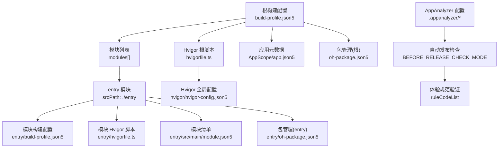
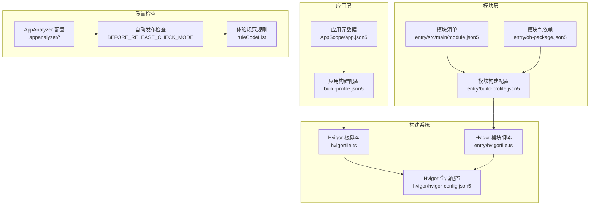
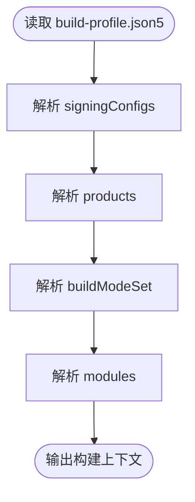
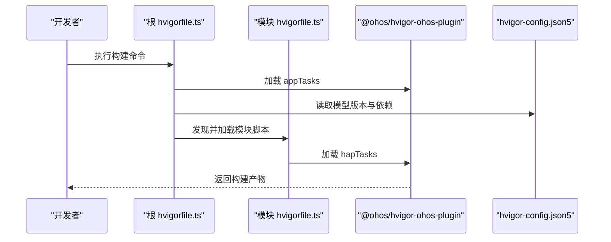
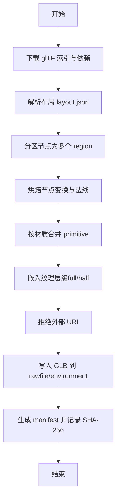
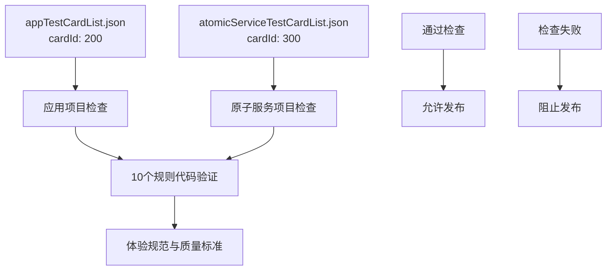
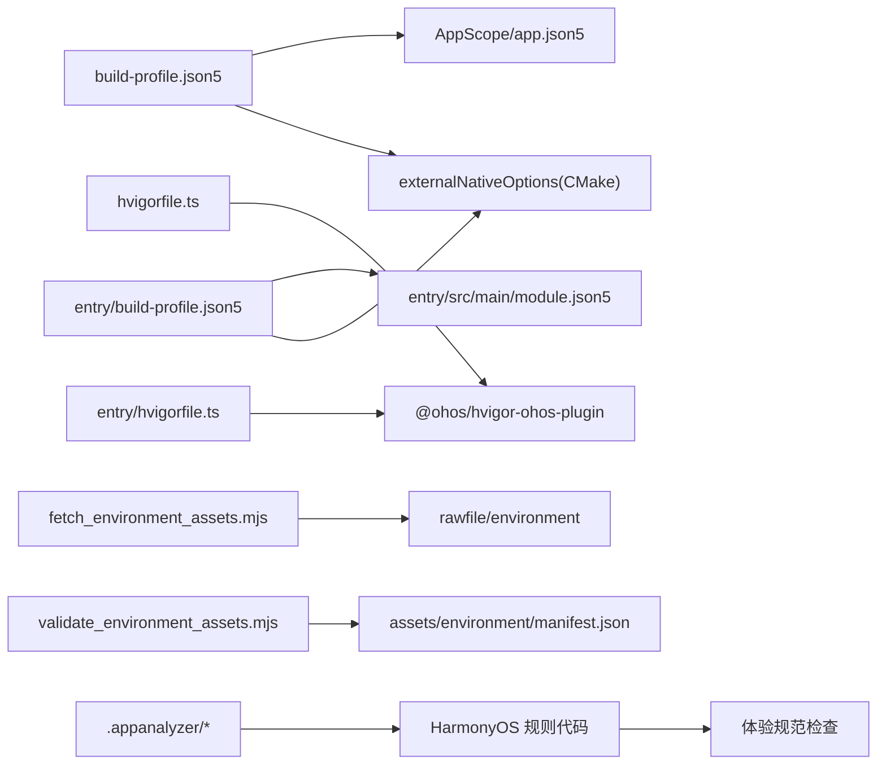

# 构建配置

<cite>
**本文引用的文件**   
- [build-profile.json5](file://build-profile.json5)
- [hvigorfile.ts](file://hvigorfile.ts)
- [entry/build-profile.json5](file://entry/build-profile.json5)
- [entry/hvigorfile.ts](file://entry/hvigorfile.ts)
- [hvigor/hvigor-config.json5](file://hvigor/hvigor-config.json5)
- [AppScope/app.json5](file://AppScope/app.json5)
- [entry/src/main/module.json5](file://entry/src/main/module.json5)
- [oh-package.json5](file://oh-package.json5)
- [entry/oh-package.json5](file://entry/oh-package.json5)
- [automation/assets/fetch_environment_assets.mjs](file://automation/assets/fetch_environment_assets.mjs)
- [automation/assets/validate_environment_assets.mjs](file://automation/assets/validate_environment_assets.mjs)
- [.appanalyzer/appanalyzerCardConfig/appTestCardList.json](file://.appanalyzer/appanalyzerCardConfig/appTestCardList.json)
- [.appanalyzer/appanalyzerCardConfig/atomicServiceTestCardList.json](file://.appanalyzer/appanalyzerCardConfig/atomicServiceTestCardList.json)
</cite>

## 更新摘要
**所做更改**
- 新增 AppAnalyzer 自动发布检查配置系统章节
- 更新构建流程架构以包含自动化质量检查
- 添加新的验证和检查步骤说明
- 扩展故障排查指南以涵盖分析器配置问题

## 目录
1. [简介](#简介)
2. [项目结构](#项目结构)
3. [核心组件](#核心组件)
4. [架构总览](#架构总览)
5. [详细组件分析](#详细组件分析)
6. [依赖关系分析](#依赖关系分析)
7. [性能考量](#性能考量)
8. [故障排查指南](#故障排查指南)
9. [结论](#结论)
10. [附录](#附录)

## 简介
本文件面向 my-world 项目的构建配置系统，围绕以下目标展开：
- 深入解释根级 build-profile.json5 的配置结构，包括签名配置、产品配置、构建模式设置与模块定义。
- 说明 Hvigor 构建脚本的作用与自定义任务扩展点。
- 记录 HarmonyOS 应用的打包配置、ABI 过滤与编译器选项。
- 解释多环境构建配置与条件编译设置（基于构建模式）。
- **新增**：介绍 AppAnalyzer 自动发布检查配置系统，包括应用和原子服务的质量标准验证。
- 提供具体配置示例与最佳实践。
- 给出构建配置的验证方法与常见配置错误的解决方案。

## 项目结构
my-world 的构建相关配置分布在根目录与 entry 模块中，同时通过 hvigor 插件体系组织构建流程。**新增** AppAnalyzer 配置用于自动化发布前的体验规范检查。关键文件如下：
- 根级应用构建配置：build-profile.json5
- 根级 Hvigor 入口：hvigorfile.ts
- 模块级构建配置：entry/build-profile.json5
- 模块级 Hvigor 入口：entry/hvigorfile.ts
- Hvigor 全局配置：hvigor/hvigor-config.json5
- 应用元信息：AppScope/app.json5
- 模块描述：entry/src/main/module.json5
- 包管理：oh-package.json5 与 entry/oh-package.json5
- 资源自动化脚本：automation/assets/*.mjs
- **新增**：AppAnalyzer 配置：.appanalyzer/appanalyzerCardConfig/*.json

**图表来源**
- [build-profile.json5:1-68](file://build-profile.json5#L1-L68)
- [hvigorfile.ts:1-7](file://hvigorfile.ts#L1-L7)
- [entry/build-profile.json5:1-17](file://entry/build-profile.json5#L1-L17)
- [entry/hvigorfile.ts:1-7](file://entry/hvigorfile.ts#L1-L7)
- [hvigor/hvigor-config.json5:1-4](file://hvigor/hvigor-config.json5#L1-L4)
- [AppScope/app.json5:1-13](file://AppScope/app.json5#L1-L13)
- [entry/src/main/module.json5:1-43](file://entry/src/main/module.json5#L1-L43)
- [oh-package.json5:1-10](file://oh-package.json5#L1-L10)
- [entry/oh-package.json5:1-12](file://entry/oh-package.json5#L1-L12)
- [.appanalyzer/appanalyzerCardConfig/appTestCardList.json:1-30](file://.appanalyzer/appanalyzerCardConfig/appTestCardList.json#L1-L30)
- [.appanalyzer/appanalyzerCardConfig/atomicServiceTestCardList.json:1-30](file://.appanalyzer/appanalyzerCardConfig/atomicServiceTestCardList.json#L1-L30)

**章节来源**
- [build-profile.json5:1-68](file://build-profile.json5#L1-L68)
- [hvigorfile.ts:1-7](file://hvigorfile.ts#L1-L7)
- [entry/build-profile.json5:1-17](file://entry/build-profile.json5#L1-L17)
- [entry/hvigorfile.ts:1-7](file://entry/hvigorfile.ts#L1-L7)
- [hvigor/hvigor-config.json5:1-4](file://hvigor/hvigor-config.json5#L1-L4)
- [AppScope/app.json5:1-13](file://AppScope/app.json5#L1-L13)
- [entry/src/main/module.json5:1-43](file://entry/src/main/module.json5#L1-L43)
- [oh-package.json5:1-10](file://oh-package.json5#L1-L10)
- [entry/oh-package.json5:1-12](file://entry/oh-package.json5#L1-L12)
- [.appanalyzer/appanalyzerCardConfig/appTestCardList.json:1-30](file://.appanalyzer/appanalyzerCardConfig/appTestCardList.json#L1-L30)
- [.appanalyzer/appanalyzerCardConfig/atomicServiceTestCardList.json:1-30](file://.appanalyzer/appanalyzerCardConfig/atomicServiceTestCardList.json#L1-L30)

## 核心组件
- 应用级构建配置（build-profile.json5）
  - signingConfigs：签名配置集合，包含证书路径、密钥别名、密码、算法等。
  - products：产品定义，绑定签名配置、SDK 版本、运行时 OS、原生编译器选择等。
  - buildModeSet：构建模式集合（如 debug/release），可分别设置调试开关、外部原生构建参数（CMake 路径、ABI 过滤、cppFlags 等）。
  - modules：模块声明，指定模块名称、源码路径及目标（targets）与应用产品的映射。
- 模块级构建配置（entry/build-profile.json5）
  - apiType：阶段模式（stageMode）。
  - buildOption.externalNativeOptions：CMake 路径、参数、ABI 过滤、C++ 标志。
  - targets：模块目标（default）。
- Hvigor 脚本
  - 根 hvigorfile.ts：引入 @ohos/hvigor-ohos-plugin 的 appTasks，作为应用构建系统。
  - 模块 hvigorfile.ts：引入 hapTasks，作为 HAP 模块构建系统。
  - hvigor/hvigor-config.json5：模型版本与依赖声明。
- 应用与模块元数据
  - AppScope/app.json5：bundleName、版本号、图标、标签、API 级别等。
  - entry/src/main/module.json5：模块类型、入口 Ability、设备类型、权限等。
- 包管理
  - oh-package.json5：项目级包名、版本、描述等。
  - entry/oh-package.json5：模块依赖（例如 libnative_game.so 的类型声明）。
- **新增**：AppAnalyzer 自动发布检查配置
  - appTestCardList.json：应用项目（cardId: 200）的体验规范检查配置。
  - atomicServiceTestCardList.json：原子服务项目（cardId: 300）的体验规范检查配置。
  - 两者均包含 10 个规则代码（0132, 0133, 0134, 0135, 0601, 0604, 0602, 0502, 0512, 0515）用于经验指南和质量标准验证。

**章节来源**
- [build-profile.json5:1-68](file://build-profile.json5#L1-L68)
- [entry/build-profile.json5:1-17](file://entry/build-profile.json5#L1-L17)
- [hvigorfile.ts:1-7](file://hvigorfile.ts#L1-L7)
- [entry/hvigorfile.ts:1-7](file://entry/hvigorfile.ts#L1-L7)
- [hvigor/hvigor-config.json5:1-4](file://hvigor/hvigor-config.json5#L1-L4)
- [AppScope/app.json5:1-13](file://AppScope/app.json5#L1-L13)
- [entry/src/main/module.json5:1-43](file://entry/src/main/module.json5#L1-L43)
- [oh-package.json5:1-10](file://oh-package.json5#L1-L10)
- [entry/oh-package.json5:1-12](file://entry/oh-package.json5#L1-L12)
- [.appanalyzer/appanalyzerCardConfig/appTestCardList.json:1-30](file://.appanalyzer/appanalyzerCardConfig/appTestCardList.json#L1-L30)
- [.appanalyzer/appanalyzerCardConfig/atomicServiceTestCardList.json:1-30](file://.appanalyzer/appanalyzerCardConfig/atomicServiceTestCardList.json#L1-L30)

## 架构总览
下图展示了构建配置与 Hvigor 插件体系的交互关系，以及模块与应用的装配方式。**新增** AppAnalyzer 自动发布检查流程。

**图表来源**
- [build-profile.json5:1-68](file://build-profile.json5#L1-L68)
- [hvigorfile.ts:1-7](file://hvigorfile.ts#L1-L7)
- [entry/build-profile.json5:1-17](file://entry/build-profile.json5#L1-L17)
- [entry/hvigorfile.ts:1-7](file://entry/hvigorfile.ts#L1-L7)
- [hvigor/hvigor-config.json5:1-4](file://hvigor/hvigor-config.json5#L1-L4)
- [AppScope/app.json5:1-13](file://AppScope/app.json5#L1-L13)
- [entry/src/main/module.json5:1-43](file://entry/src/main/module.json5#L1-L43)
- [entry/oh-package.json5:1-12](file://entry/oh-package.json5#L1-L12)
- [.appanalyzer/appanalyzerCardConfig/appTestCardList.json:1-30](file://.appanalyzer/appanalyzerCardConfig/appTestCardList.json#L1-L30)
- [.appanalyzer/appanalyzerCardConfig/atomicServiceTestCardList.json:1-30](file://.appanalyzer/appanalyzerCardConfig/atomicServiceTestCardList.json#L1-L30)

## 详细组件分析

### 应用级构建配置（build-profile.json5）
- 签名配置（signingConfigs）
  - name：签名配置标识（如 default）。
  - type：签名类型（HarmonyOS）。
  - material：包含证书路径、密钥别名、密码、配置文件、签名算法、密钥库路径与密码等。
- 产品配置（products）
  - name：产品标识（如 default）。
  - signingConfig：引用签名配置名称。
  - compatibleSdkVersion/targetSdkVersion：兼容与目标 SDK 版本。
  - runtimeOS：运行时操作系统（HarmonyOS）。
  - buildOption.nativeCompiler：原生编译器选择（BiSheng）。
- 构建模式（buildModeSet）
  - debug：开启调试、指定 externalNativeOptions（CMake 路径、ABI 过滤 arm64-v8a/x86_64、cppFlags）。
  - release：关闭调试。
- 模块定义（modules）
  - name：模块名（entry）。
  - srcPath：模块源码路径（./entry）。
  - targets：目标（default），applyToProducts 指定应用于哪些产品。

**图表来源**
- [build-profile.json5:1-68](file://build-profile.json5#L1-L68)

**章节来源**
- [build-profile.json5:1-68](file://build-profile.json5#L1-L68)

### 模块级构建配置（entry/build-profile.json5）
- apiType：stageMode（阶段模式）。
- buildOption.externalNativeOptions：
  - path：CMakeLists.txt 路径（./src/main/cpp/CMakeLists.txt）。
  - arguments：传递给 CMake 的参数（空）。
  - abiFilters：ABI 过滤（arm64-v8a, x86_64）。
  - cppFlags：C++ 编译标志（空）。
- targets：默认目标（default）。

**章节来源**
- [entry/build-profile.json5:1-17](file://entry/build-profile.json5#L1-L17)

### Hvigor 构建脚本与自定义任务
- 根 hvigorfile.ts
  - 引入 @ohos/hvigor-ohos-plugin 的 appTasks，作为应用构建系统。
  - plugins 数组为空，表示未启用额外插件。
- 模块 hvigorfile.ts
  - 引入 hapTasks，作为 HAP 模块构建系统。
  - plugins 数组为空。
- hvigor/hvigor-config.json5
  - modelVersion：模型版本（6.1.0）。
  - dependencies：依赖声明（当前为空）。

**图表来源**
- [hvigorfile.ts:1-7](file://hvigorfile.ts#L1-L7)
- [entry/hvigorfile.ts:1-7](file://entry/hvigorfile.ts#L1-L7)
- [hvigor/hvigor-config.json5:1-4](file://hvigor/hvigor-config.json5#L1-L4)

**章节来源**
- [hvigorfile.ts:1-7](file://hvigorfile.ts#L1-L7)
- [entry/hvigorfile.ts:1-7](file://entry/hvigorfile.ts#L1-L7)
- [hvigor/hvigor-config.json5:1-4](file://hvigor/hvigor-config.json5#L1-L4)

### 应用与模块元数据
- AppScope/app.json5
  - bundleName：com.ethelandev.myworld
  - vendor：ethelandev
  - versionCode/versionName：1000000 / 1.0.0
  - icon/label：资源引用
  - minAPIVersion/targetAPIVersion：23
- entry/src/main/module.json5
  - module.name/type：entry/entry
  - mainElement：EntryAbility
  - deviceTypes：phone/tablet
  - pages/abilities/requestPermissions：页面、能力与权限声明

**章节来源**
- [AppScope/app.json5:1-13](file://AppScope/app.json5#L1-L13)
- [entry/src/main/module.json5:1-43](file://entry/src/main/module.json5#L1-L43)

### 包管理与原生依赖
- oh-package.json5：项目级包名、版本、描述等。
- entry/oh-package.json5：模块依赖声明，包含 libnative_game.so 的类型声明（types/libnative_game）。

**章节来源**
- [oh-package.json5:1-10](file://oh-package.json5#L1-L10)
- [entry/oh-package.json5:1-12](file://entry/oh-package.json5#L1-L12)

### 资源自动化与校验（可选构建步骤）
- fetch_environment_assets.mjs：从 Poly Haven 下载 glTF 资源，进行节点分区、变换烘焙、材质合并、纹理嵌入、外部 URI 清理，最终生成 GLB 并写入 entry/src/main/resources/rawfile/environment。
- validate_environment_assets.mjs：校验 manifest 的许可证、SHA-256 一致性、源文件覆盖与排序、派生资产哈希等。

**图表来源**
- [automation/assets/fetch_environment_assets.mjs:1-812](file://automation/assets/fetch_environment_assets.mjs#L1-L812)
- [automation/assets/validate_environment_assets.mjs:1-80](file://automation/assets/validate_environment_assets.mjs#L1-L80)

**章节来源**
- [automation/assets/fetch_environment_assets.mjs:1-812](file://automation/assets/fetch_environment_assets.mjs#L1-L812)
- [automation/assets/validate_environment_assets.mjs:1-80](file://automation/assets/validate_environment_assets.mjs#L1-L80)

### **新增**：AppAnalyzer 自动发布检查配置
AppAnalyzer 配置系统用于在发布前自动执行体验规范和质量标准检查。

#### 应用项目配置（appTestCardList.json）
- cardId：200（应用项目专用标识）
- projectType："app"
- analyzerMode："BEFORE_RELEASE_CHECK_MODE"
- autoCompile/autoTest：true（自动编译和测试）
- ruleCodeList：包含 10 个规则代码用于体验规范验证

#### 原子服务项目配置（atomicServiceTestCardList.json）
- cardId：300（原子服务项目专用标识）
- projectType："service"
- analyzerMode："BEFORE_RELEASE_CHECK_MODE"
- autoCompile/autoTest：true（自动编译和测试）
- ruleCodeList：包含 10 个规则代码用于体验规范验证

#### 规则代码说明
两个配置文件都包含相同的 10 个规则代码：
- 0132, 0133, 0134, 0135：基础体验规范
- 0601, 0604, 0602：性能与稳定性检查
- 0502, 0512, 0515：安全与兼容性验证

**图表来源**
- [.appanalyzer/appanalyzerCardConfig/appTestCardList.json:1-30](file://.appanalyzer/appanalyzerCardConfig/appTestCardList.json#L1-L30)
- [.appanalyzer/appanalyzerCardConfig/atomicServiceTestCardList.json:1-30](file://.appanalyzer/appanalyzerCardConfig/atomicServiceTestCardList.json#L1-L30)

**章节来源**
- [.appanalyzer/appanalyzerCardConfig/appTestCardList.json:1-30](file://.appanalyzer/appanalyzerCardConfig/appTestCardList.json#L1-L30)
- [.appanalyzer/appanalyzerCardConfig/atomicServiceTestCardList.json:1-30](file://.appanalyzer/appanalyzerCardConfig/atomicServiceTestCardList.json#L1-L30)

## 依赖关系分析
- 构建配置依赖
  - build-profile.json5 依赖 AppScope/app.json5 的应用元数据（bundle、版本、API 级别）。
  - entry/build-profile.json5 依赖 entry/src/main/module.json5 的模块描述。
  - hvigorfile.ts 与 entry/hvigorfile.ts 依赖 @ohos/hvigor-ohos-plugin 提供的 appTasks/hapTasks。
- 原生构建依赖
  - externalNativeOptions.path 指向 CMakeLists.txt，abiFilters 控制生成的 ABI 变体。
  - nativeCompiler 指定 BiSheng 编译器。
- 资源与脚本依赖
  - 资源自动化脚本依赖网络访问与本地文件系统，生成 GLB 并更新 manifest。
- **新增**：AppAnalyzer 依赖
  - AppAnalyzer 配置独立于主构建流程，但在发布前检查阶段被调用。
  - 规则代码由 HarmonyOS 平台提供，无需项目特定实现。

**图表来源**
- [build-profile.json5:1-68](file://build-profile.json5#L1-L68)
- [entry/build-profile.json5:1-17](file://entry/build-profile.json5#L1-L17)
- [hvigorfile.ts:1-7](file://hvigorfile.ts#L1-L7)
- [entry/hvigorfile.ts:1-7](file://entry/hvigorfile.ts#L1-L7)
- [automation/assets/fetch_environment_assets.mjs:1-812](file://automation/assets/fetch_environment_assets.mjs#L1-L812)
- [automation/assets/validate_environment_assets.mjs:1-80](file://automation/assets/validate_environment_assets.mjs#L1-L80)
- [.appanalyzer/appanalyzerCardConfig/appTestCardList.json:1-30](file://.appanalyzer/appanalyzerCardConfig/appTestCardList.json#L1-L30)
- [.appanalyzer/appanalyzerCardConfig/atomicServiceTestCardList.json:1-30](file://.appanalyzer/appanalyzerCardConfig/atomicServiceTestCardList.json#L1-L30)

**章节来源**
- [build-profile.json5:1-68](file://build-profile.json5#L1-L68)
- [entry/build-profile.json5:1-17](file://entry/build-profile.json5#L1-L17)
- [hvigorfile.ts:1-7](file://hvigorfile.ts#L1-L7)
- [entry/hvigorfile.ts:1-7](file://entry/hvigorfile.ts#L1-L7)
- [automation/assets/fetch_environment_assets.mjs:1-812](file://automation/assets/fetch_environment_assets.mjs#L1-L812)
- [automation/assets/validate_environment_assets.mjs:1-80](file://automation/assets/validate_environment_assets.mjs#L1-L80)
- [.appanalyzer/appanalyzerCardConfig/appTestCardList.json:1-30](file://.appanalyzer/appanalyzerCardConfig/appTestCardList.json#L1-L30)
- [.appanalyzer/appanalyzerCardConfig/atomicServiceTestCardList.json:1-30](file://.appanalyzer/appanalyzerCardConfig/atomicServiceTestCardList.json#L1-L30)

## 性能考量
- ABI 过滤
  - 仅构建 arm64-v8a 与 x86_64，减少二进制体积与构建时间。
- 编译器选择
  - 使用 BiSheng 编译器提升原生代码编译效率。
- 资源处理
  - 将纹理层级（full/half）嵌入 GLB，减少运行时加载开销；合并同材质 primitive 降低绘制调用次数。
- 构建模式
  - debug 模式开启调试符号便于定位问题；release 模式关闭调试以提升运行性能。
- **新增**：AppAnalyzer 优化
  - 自动编译和测试功能可减少手动检查时间。
  - 规则代码批量验证提高检查效率。
  - BEFORE_RELEASE_CHECK_MODE 确保只在发布前执行，不影响日常开发。

## 故障排查指南
- 签名配置错误
  - 检查 signingConfigs.material 中的 certpath、storeFile、profile、keyAlias、密码与签名算法是否匹配且路径正确。
- ABI 过滤不生效
  - 确认 buildModeSet.debug.externalNativeOptions.abiFilters 与 entry/build-profile.json5 的 abiFilters 一致。
- CMake 路径或参数错误
  - 核对 externalNativeOptions.path 指向正确的 CMakeLists.txt，arguments 与 cppFlags 无误。
- Hvigor 插件未加载
  - 确保 hvigorfile.ts 与 entry/hvigorfile.ts 正确引入 appTasks/hapTasks，plugins 数组无冲突。
- 资源校验失败
  - 运行 validate_environment_assets.mjs 检查 manifest 许可证、SHA-256 一致性、源文件覆盖与排序。
- 包依赖缺失
  - 检查 entry/oh-package.json5 中 libnative_game.so 的类型声明是否存在。
- **新增**：AppAnalyzer 配置问题
  - 验证 .appanalyzer/appanalyzerCardConfig/*.json 文件格式是否正确。
  - 确认 cardId 与项目类型匹配（200 对应 app，300 对应 service）。
  - 检查 ruleCodeList 中的规则代码是否为有效的 HarmonyOS 平台规则。
  - 确保 analyzerMode 设置为 "BEFORE_RELEASE_CHECK_MODE"。

**章节来源**
- [build-profile.json5:1-68](file://build-profile.json5#L1-L68)
- [entry/build-profile.json5:1-17](file://entry/build-profile.json5#L1-L17)
- [hvigorfile.ts:1-7](file://hvigorfile.ts#L1-L7)
- [entry/hvigorfile.ts:1-7](file://entry/hvigorfile.ts#L1-L7)
- [automation/assets/validate_environment_assets.mjs:1-80](file://automation/assets/validate_environment_assets.mjs#L1-L80)
- [entry/oh-package.json5:1-12](file://entry/oh-package.json5#L1-L12)
- [.appanalyzer/appanalyzerCardConfig/appTestCardList.json:1-30](file://.appanalyzer/appanalyzerCardConfig/appTestCardList.json#L1-L30)
- [.appanalyzer/appanalyzerCardConfig/atomicServiceTestCardList.json:1-30](file://.appanalyzer/appanalyzerCardConfig/atomicServiceTestCardList.json#L1-L30)

## 结论
my-world 的构建配置以 build-profile.json5 为核心，结合 Hvigor 插件体系与模块级配置，实现了清晰的签名、产品、构建模式与模块定义。**新增的 AppAnalyzer 自动发布检查系统**进一步增强了质量保证能力，通过标准化的体验规范检查确保应用符合上架要求。通过 ABI 过滤与编译器优化，配合资源自动化与校验脚本，确保了构建效率与产物质量。建议在生产环境中严格管理签名配置、统一 ABI 策略，并将资源校验与 AppAnalyzer 检查纳入 CI 流程。

## 附录
- 多环境构建与条件编译
  - 通过 buildModeSet 区分 debug/release，可在不同模式下设置不同的 externalNativeOptions 与调试开关。
  - 如需更多环境（如 staging、qa），可在 buildModeSet 中新增模式并配置相应参数。
- 最佳实践
  - 将敏感签名信息放入安全存储，避免硬编码在仓库中。
  - 保持 ABI 过滤与平台目标一致，避免不必要的二进制膨胀。
  - 使用 Hvigor 插件扩展构建流程时，优先复用官方 appTasks/hapTasks。
  - 对资源流水线增加校验与哈希比对，确保可追溯性与一致性。
  - **新增**：定期更新 AppAnalyzer 规则代码以适配最新的 HarmonyOS 平台要求。
  - **新增**：在 CI/CD 流程中集成 AppAnalyzer 检查，确保每次构建都经过体验规范验证。