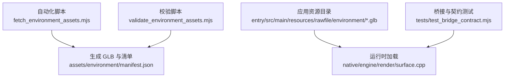
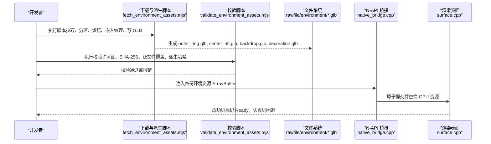
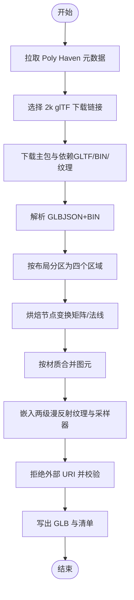
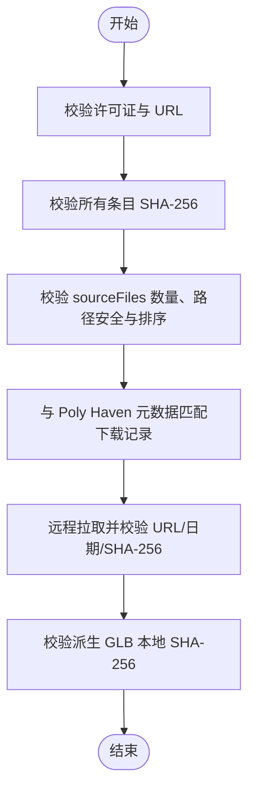
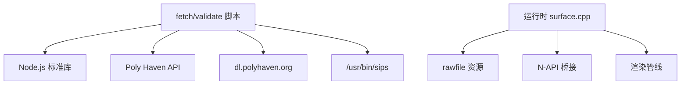

# 资源处理流程

<cite>
**本文引用的文件**   
- [fetch_environment_assets.mjs](file://automation/assets/fetch_environment_assets.mjs)
- [validate_environment_assets.mjs](file://automation/assets/validate_environment_assets.mjs)
- [manifest.json（环境）](file://assets/environment/manifest.json)
- [LICENSES.md（环境）](file://assets/environment/LICENSES.md)
- [surface.cpp](file://native/engine/render/surface.cpp)
- [test_bridge_contract.mjs](file://tests/test_bridge_contract.mjs)
</cite>

## 目录
1. [简介](#简介)
2. [项目结构](#项目结构)
3. [核心组件](#核心组件)
4. [架构总览](#架构总览)
5. [详细组件分析](#详细组件分析)
6. [依赖关系分析](#依赖关系分析)
7. [性能考量](#性能考量)
8. [故障排查指南](#故障排查指南)
9. [结论](#结论)
10. [附录](#附录)

## 简介
本文件系统化记录 my-world 项目的“资源处理系统”，重点围绕自动化资源下载与验证、资源清单格式与版本管理、环境资源的组织与管理策略，以及从脚本到运行时的完整流水线。读者将了解：
- 如何运行自动化脚本完成 Poly Haven 资产下载、GLB 派生与纹理嵌入；
- 如何通过校验脚本确保来源与派生资产的完整性与一致性；
- 资源清单 manifest.json 的字段含义、版本与来源证据机制；
- 运行时如何加载并替换环境资源批次，以及失败回退策略；
- 命令行工具与批处理方法的使用建议；
- 压缩与优化策略（如 GLB 内嵌、纹理层级、几何合并等）。

## 项目结构
资源处理相关的关键位置如下：
- 自动化脚本：automation/assets 下的 fetch 与 validate 脚本
- 资源清单与许可说明：assets/environment 下的 manifest.json 与 LICENSES.md
- 运行时加载：native/engine/render/surface.cpp 中的环境资源初始化逻辑
- 桥接与测试：tests/test_bridge_contract.mjs 中对资源注入与加载的契约断言

图表来源
- [fetch_environment_assets.mjs:717-800](file://automation/assets/fetch_environment_assets.mjs#L717-L800)
- [validate_environment_assets.mjs:1-80](file://automation/assets/validate_environment_assets.mjs#L1-L80)
- [manifest.json（环境）:1-163](file://assets/environment/manifest.json#L1-L163)
- [surface.cpp:511-533](file://native/engine/render/surface.cpp#L511-L533)
- [test_bridge_contract.mjs:396-414](file://tests/test_bridge_contract.mjs#L396-L414)

章节来源
- [fetch_environment_assets.mjs:717-800](file://automation/assets/fetch_environment_assets.mjs#L717-L800)
- [validate_environment_assets.mjs:1-80](file://automation/assets/validate_environment_assets.mjs#L1-L80)
- [manifest.json（环境）:1-163](file://assets/environment/manifest.json#L1-L163)
- [surface.cpp:511-533](file://native/engine/render/surface.cpp#L511-L533)
- [test_bridge_contract.mjs:396-414](file://tests/test_bridge_contract.mjs#L396-L414)

## 核心组件
- 自动化下载与派生脚本（fetch）
  - 负责从 Poly Haven 获取元数据与下载包，解析 glTF/GLB，按布局分区为四个区域，烘焙节点变换、合并材质图元、嵌入两级漫反射纹理，输出 GLB 与清单。
- 资源校验脚本（validate）
  - 校验清单许可证、SHA-256、源文件覆盖范围、URL 合法性、下载时间与哈希一致性，并验证派生 GLB 的哈希。
- 资源清单（manifest.json）
  - 记录许可证、来源资产与派生资产，包含每个文件的 URL、下载时间、SHA-256 与路径排序约束，保证可追溯与可复现。
- 运行时加载与回退
  - 在渲染表面中按批次名称读取 rawfile 中的 GLB，原子替换 GPU 资源，失败时保持程序化回退。

章节来源
- [fetch_environment_assets.mjs:40-100](file://automation/assets/fetch_environment_assets.mjs#L40-L100)
- [fetch_environment_assets.mjs:125-180](file://automation/assets/fetch_environment_assets.mjs#L125-L180)
- [fetch_environment_assets.mjs:189-235](file://automation/assets/fetch_environment_assets.mjs#L189-L235)
- [fetch_environment_assets.mjs:469-514](file://automation/assets/fetch_environment_assets.mjs#L469-L514)
- [fetch_environment_assets.mjs:516-571](file://automation/assets/fetch_environment_assets.mjs#L516-L571)
- [fetch_environment_assets.mjs:584-629](file://automation/assets/fetch_environment_assets.mjs#L584-L629)
- [fetch_environment_assets.mjs:646-677](file://automation/assets/fetch_environment_assets.mjs#L646-L677)
- [fetch_environment_assets.mjs:679-694](file://automation/assets/fetch_environment_assets.mjs#L679-L694)
- [validate_environment_assets.mjs:1-80](file://automation/assets/validate_environment_assets.mjs#L1-L80)
- [manifest.json（环境）:1-163](file://assets/environment/manifest.json#L1-L163)
- [surface.cpp:511-533](file://native/engine/render/surface.cpp#L511-L533)

## 架构总览
下图展示从脚本到运行时的端到端流程：脚本拉取与派生资源，写入清单与 GLB；运行时通过 N-API 桥接收 ArrayBuffer 并原子提交给渲染管线。

图表来源
- [fetch_environment_assets.mjs:717-800](file://automation/assets/fetch_environment_assets.mjs#L717-L800)
- [validate_environment_assets.mjs:1-80](file://automation/assets/validate_environment_assets.mjs#L1-L80)
- [surface.cpp:511-533](file://native/engine/render/surface.cpp#L511-L533)
- [test_bridge_contract.mjs:396-414](file://tests/test_bridge_contract.mjs#L396-L414)

## 详细组件分析

### 自动化下载与派生脚本（fetch）
- 功能要点
  - 拉取 Poly Haven 元数据并选择 2k glTF 下载链接；
  - 下载主包与依赖（包括 BIN、纹理），统一规范化路径；
  - 解析 GLB（魔数、版本、分块），提取 JSON 与二进制；
  - 根据 layout.json 将节点分区为 outerRing/centerRift/backdrop/decoration；
  - 烘焙节点变换（矩阵计算、法线变换）、合并同材质图元；
  - 嵌入两级漫反射纹理（full/half），设置采样器与材质 extras；
  - 拒绝外部 URI，确保完全内嵌；
  - 输出 GLB 与清单（含来源与派生 SHA-256、下载时间、sourceFiles 列表）。
- 关键实现片段路径
  - 选择下载链接与依赖解析：[chooseGltfDownload:46-69](file://automation/assets/fetch_environment_assets.mjs#L46-L69)、[downloadPackage:652-677](file://automation/assets/fetch_environment_assets.mjs#L652-L677)
  - GLB 读写与校验：[readGlb:125-155](file://automation/assets/fetch_environment_assets.mjs#L125-L155)、[writeGlb:157-180](file://automation/assets/fetch_environment_assets.mjs#L157-L180)
  - 节点分区与布局校验：[partitionNodes:189-235](file://automation/assets/fetch_environment_assets.mjs#L189-L235)
  - 变换烘焙与法线变换：[bakeNodeTransforms:469-514](file://automation/assets/fetch_environment_assets.mjs#L469-L514)
  - 材质合并与图元重建：[mergePrimitivesByMaterial:516-571](file://automation/assets/fetch_environment_assets.mjs#L516-L571)
  - 纹理嵌入与材质 extras：[embedTextureLevels:584-629](file://automation/assets/fetch_environment_assets.mjs#L584-L629)
  - 清单生成与源文件证据：[sourceFilesFor:679-694](file://automation/assets/fetch_environment_assets.mjs#L679-L694)、主流程输出：[main:717-800](file://automation/assets/fetch_environment_assets.mjs#L717-L800)

图表来源
- [fetch_environment_assets.mjs:46-69](file://automation/assets/fetch_environment_assets.mjs#L46-L69)
- [fetch_environment_assets.mjs:125-180](file://automation/assets/fetch_environment_assets.mjs#L125-L180)
- [fetch_environment_assets.mjs:189-235](file://automation/assets/fetch_environment_assets.mjs#L189-L235)
- [fetch_environment_assets.mjs:469-514](file://automation/assets/fetch_environment_assets.mjs#L469-L514)
- [fetch_environment_assets.mjs:516-571](file://automation/assets/fetch_environment_assets.mjs#L516-L571)
- [fetch_environment_assets.mjs:584-629](file://automation/assets/fetch_environment_assets.mjs#L584-L629)
- [fetch_environment_assets.mjs:717-800](file://automation/assets/fetch_environment_assets.mjs#L717-L800)

章节来源
- [fetch_environment_assets.mjs:46-69](file://automation/assets/fetch_environment_assets.mjs#L46-L69)
- [fetch_environment_assets.mjs:125-180](file://automation/assets/fetch_environment_assets.mjs#L125-L180)
- [fetch_environment_assets.mjs:189-235](file://automation/assets/fetch_environment_assets.mjs#L189-L235)
- [fetch_environment_assets.mjs:469-514](file://automation/assets/fetch_environment_assets.mjs#L469-L514)
- [fetch_environment_assets.mjs:516-571](file://automation/assets/fetch_environment_assets.mjs#L516-L571)
- [fetch_environment_assets.mjs:584-629](file://automation/assets/fetch_environment_assets.mjs#L584-L629)
- [fetch_environment_assets.mjs:646-677](file://automation/assets/fetch_environment_assets.mjs#L646-L677)
- [fetch_environment_assets.mjs:679-694](file://automation/assets/fetch_environment_assets.mjs#L679-L694)
- [fetch_environment_assets.mjs:717-800](file://automation/assets/fetch_environment_assets.mjs#L717-L800)

### 资源校验脚本（validate）
- 功能要点
  - 强制许可证为 CC0-1.0 且 licenseUrl 指向 Poly Haven；
  - 校验所有条目 sha256 为 64 位十六进制；
  - 校验 sourceAssets.sourceFiles 至少两个文件（主 glTF + 依赖），路径去重、安全、按字典序排序；
  - 对比 sourceFiles 与 Poly Haven 元数据中的 download 记录，确保覆盖所选包；
  - 远程拉取每个 sourceFile 并校验 URL、下载日期格式与 SHA-256 一致性；
  - 校验派生 GLB 本地文件 SHA-256 与清单一致。
- 关键实现片段路径
  - 许可证与哈希校验：[入口校验:1-13](file://automation/assets/validate_environment_assets.mjs#L1-L13)
  - sourceFiles 结构与排序校验：[路径与排序检查:24-36](file://automation/assets/validate_environment_assets.mjs#L24-L36)
  - 元数据匹配与远程校验：[元数据查找与远程校验:37-68](file://automation/assets/validate_environment_assets.mjs#L37-L68)
  - 派生资产哈希校验：[派生 GLB 校验:75-79](file://automation/assets/validate_environment_assets.mjs#L75-L79)

图表来源
- [validate_environment_assets.mjs:1-80](file://automation/assets/validate_environment_assets.mjs#L1-L80)

章节来源
- [validate_environment_assets.mjs:1-80](file://automation/assets/validate_environment_assets.mjs#L1-L80)

### 资源清单文件格式与版本管理
- 清单结构
  - derivedAssets：派生 GLB 列表，包含 id、path、sha256、sourceDependencies（来源资产 id 列表）；
  - license/licenseUrl：许可证标识与来源页；
  - sourceAssets：来源资产列表，包含 id、name、author、pageUrl、downloadUrl、downloadedAt、sha256、sourceFiles（每个文件的 path/url/downloadeAt/sha256）。
- 版本与可追溯性
  - downloadedAt 使用 ISO 日期前缀（YYYY-MM-DD），便于审计；
  - 所有文件均记录 SHA-256，支持离线校验与增量更新；
  - sourceFiles 必须按路径字典序排序，避免歧义。
- 关键片段路径
  - 派生资产与来源资产定义：[derivedAssets/sourceAssets:1-163](file://assets/environment/manifest.json#L1-L163)

章节来源
- [manifest.json（环境）:1-163](file://assets/environment/manifest.json#L1-L163)

### 环境资源的组织结构与管理策略
- 目录与命名
  - 输出目录：entry/src/main/resources/rawfile/environment/
  - 文件名约定：outer_ring.glb、center_rift.glb、backdrop.glb、decoration.glb
- 运行时加载策略
  - 通过固定名称数组映射索引到文件名；
  - 使用互斥锁保护资源替换，原子 take(bytes) 后销毁旧模型并尝试初始化；
  - 成功则状态置为 Ready，失败则记录错误并保持程序化回退。
- 关键片段路径
  - 名称映射与批量初始化：[environmentAssetName / tryInitializePendingEnvironmentAssets:505-533](file://native/engine/render/surface.cpp#L505-L533)

章节来源
- [surface.cpp:505-533](file://native/engine/render/surface.cpp#L505-L533)

### 资源处理的命令行工具与批处理方法
- 命令建议
  - 下载与派生：node automation/assets/fetch_environment_assets.mjs
  - 校验清单与来源：node automation/assets/validate_environment_assets.mjs
- 批处理建议
  - 先执行 fetch，再执行 validate；
  - 成功后将生成的 GLB 纳入构建产物；
  - 在 CI 中集成校验步骤，阻断不合规变更。

章节来源
- [fetch_environment_assets.mjs:717-800](file://automation/assets/fetch_environment_assets.mjs#L717-L800)
- [validate_environment_assets.mjs:1-80](file://automation/assets/validate_environment_assets.mjs#L1-L80)

### 资源更新流程与故障恢复机制
- 更新流程
  - 修改 layout.json 或切换 Poly Haven 资源版本；
  - 重新执行 fetch 生成新的 GLB 与清单；
  - 执行 validate 确保一致性；
  - 通过桥接接口注入新资源，运行时原子替换。
- 故障恢复
  - 若 GLB 初始化失败，运行时保留程序化回退（procedural fallback）；
  - 日志记录失败原因，便于定位问题。
- 关键片段路径
  - 运行时失败回退与日志：[tryInitializePendingEnvironmentAssets:511-533](file://native/engine/render/surface.cpp#L511-L533)

章节来源
- [surface.cpp:511-533](file://native/engine/render/surface.cpp#L511-L533)

### 资源压缩与优化策略
- GLB 内嵌与无外部 URI
  - 所有缓冲与图像均内嵌至 BIN 与 bufferViews，拒绝外部 URI；
- 纹理层级
  - 嵌入 full/half 两级漫反射纹理，材质 extras 标注层级索引，便于运行时按需采样；
- 几何优化
  - 烘焙节点变换，消除层级矩阵开销；
  - 按材质合并图元，减少绘制调用；
- 关键片段路径
  - 纹理嵌入与材质 extras：[embedTextureLevels:584-629](file://automation/assets/fetch_environment_assets.mjs#L584-L629)
  - 几何合并与重建：[mergePrimitivesByMaterial:516-571](file://automation/assets/fetch_environment_assets.mjs#L516-L571)
  - 变换烘焙：[bakeNodeTransforms:469-514](file://automation/assets/fetch_environment_assets.mjs#L469-L514)

章节来源
- [fetch_environment_assets.mjs:469-514](file://automation/assets/fetch_environment_assets.mjs#L469-L514)
- [fetch_environment_assets.mjs:516-571](file://automation/assets/fetch_environment_assets.mjs#L516-L571)
- [fetch_environment_assets.mjs:584-629](file://automation/assets/fetch_environment_assets.mjs#L584-L629)

## 依赖关系分析
- 脚本依赖
  - Node.js 标准库（crypto、fs/promises、child_process、os、path、url、util）；
  - 外部服务：Poly Haven API 与 dl.polyhaven.org 资源；
  - 系统工具：/usr/bin/sips（用于生成 1K 纹理）。
- 运行时依赖
  - HarmonyOS rawfile 资源访问；
  - N-API 桥接与生命周期管理；
  - 渲染管线对 GLB 的解析与 GPU 资源创建。

图表来源
- [fetch_environment_assets.mjs:1-15](file://automation/assets/fetch_environment_assets.mjs#L1-L15)
- [fetch_environment_assets.mjs:706-715](file://automation/assets/fetch_environment_assets.mjs#L706-L715)
- [surface.cpp:505-533](file://native/engine/render/surface.cpp#L505-L533)
- [test_bridge_contract.mjs:396-414](file://tests/test_bridge_contract.mjs#L396-L414)

章节来源
- [fetch_environment_assets.mjs:1-15](file://automation/assets/fetch_environment_assets.mjs#L1-L15)
- [fetch_environment_assets.mjs:706-715](file://automation/assets/fetch_environment_assets.mjs#L706-L715)
- [surface.cpp:505-533](file://native/engine/render/surface.cpp#L505-L533)
- [test_bridge_contract.mjs:396-414](file://tests/test_bridge_contract.mjs#L396-L414)

## 性能考量
- 并行下载与处理
  - 脚本并行拉取多个 Poly Haven 包，缩短等待时间；
- 内存与 I/O
  - 使用 Buffer 与 DataView 高效读写 GLB 二进制；
  - 临时目录隔离中间产物，避免污染工作区；
- 渲染阶段
  - 原子替换与锁保护降低竞争；
  - 失败快速回退，避免阻塞主循环。

章节来源
- [fetch_environment_assets.mjs:646-677](file://automation/assets/fetch_environment_assets.mjs#L646-L677)
- [surface.cpp:511-533](file://native/engine/render/surface.cpp#L511-L533)

## 故障排查指南
- 常见错误与定位
  - GLB 魔数或版本不匹配：检查 readGlb 抛出的错误信息；
  - 外部 URI 未清理：检查 rejectExternalUris 的断言；
  - 源文件缺失或不匹配：检查 validate 的 sourceFiles 与元数据比对；
  - 运行时初始化失败：查看 surface.cpp 的错误日志与回退状态。
- 调试建议
  - 打印 intermediate JSON/BIN 以确认解析正确；
  - 校验 sourceFiles 排序与去重；
  - 在 CI 中固化 validate 步骤，尽早发现问题。

章节来源
- [fetch_environment_assets.mjs:125-180](file://automation/assets/fetch_environment_assets.mjs#L125-L180)
- [validate_environment_assets.mjs:1-80](file://automation/assets/validate_environment_assets.mjs#L1-L80)
- [surface.cpp:511-533](file://native/engine/render/surface.cpp#L511-L533)

## 结论
my-world 的资源处理系统通过“脚本驱动 + 清单约束 + 运行时原子替换”的闭环，实现了可追溯、可校验、高性能的环境资源流水线。脚本负责拉取、派生与优化，清单提供版本与来源证据，运行时保障稳定加载与回退。遵循本文档的流程与规范，可有效提升资源管理的可靠性与可维护性。

## 附录
- 许可说明参考：assets/environment/LICENSES.md
- 桥接契约测试参考：tests/test_bridge_contract.mjs（环境资源注入与加载断言）

章节来源
- [LICENSES.md（环境）:1-27](file://assets/environment/LICENSES.md#L1-L27)
- [test_bridge_contract.mjs:396-414](file://tests/test_bridge_contract.mjs#L396-L414)