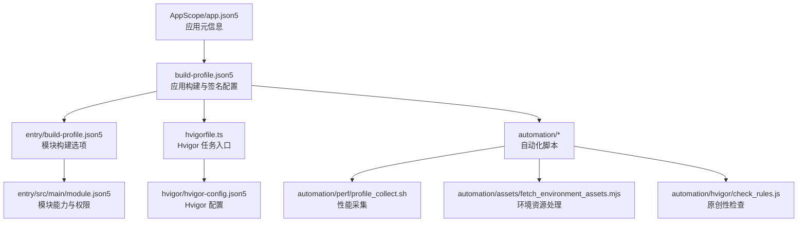
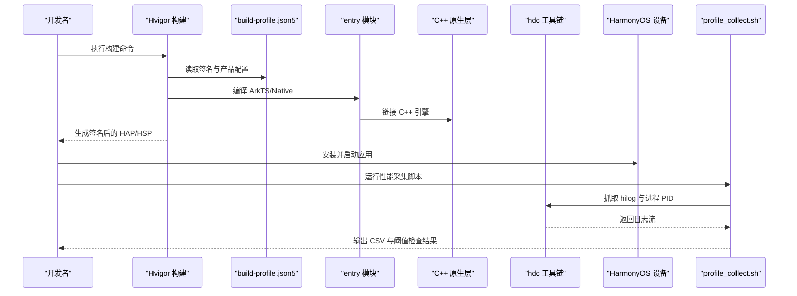
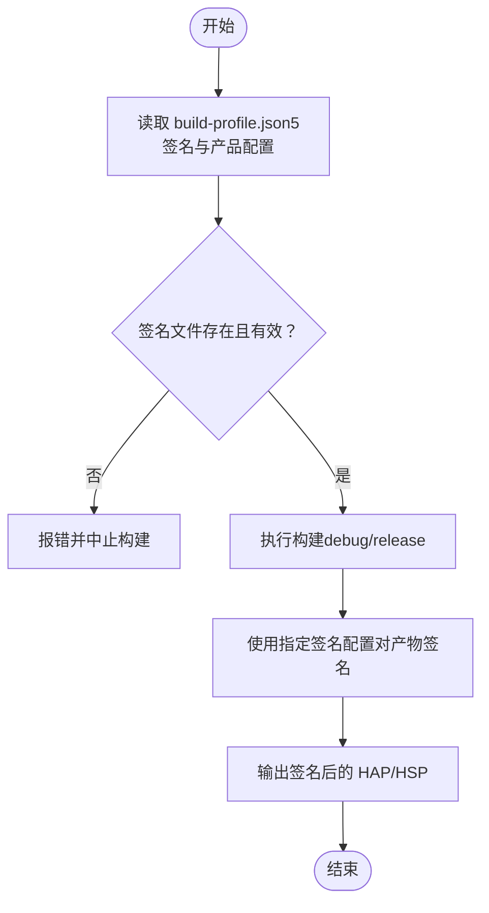
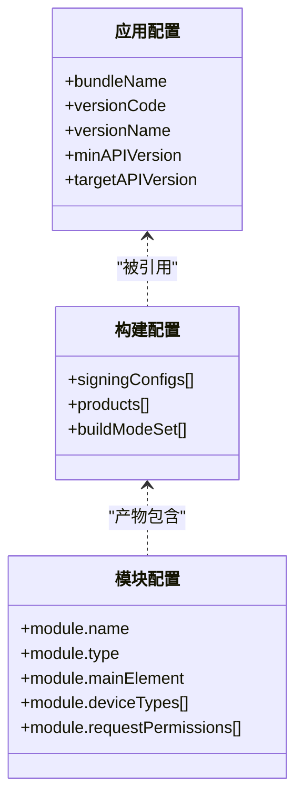
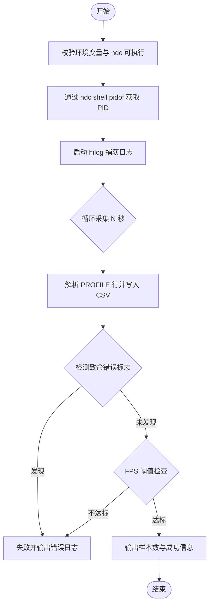
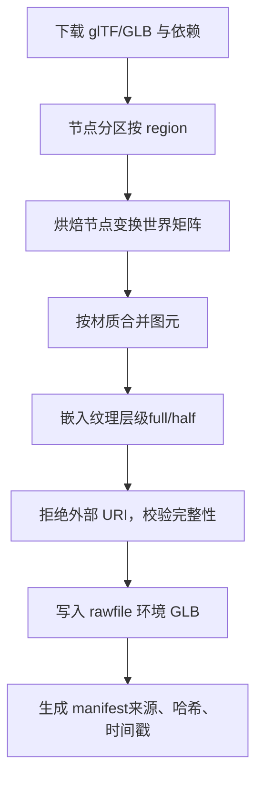
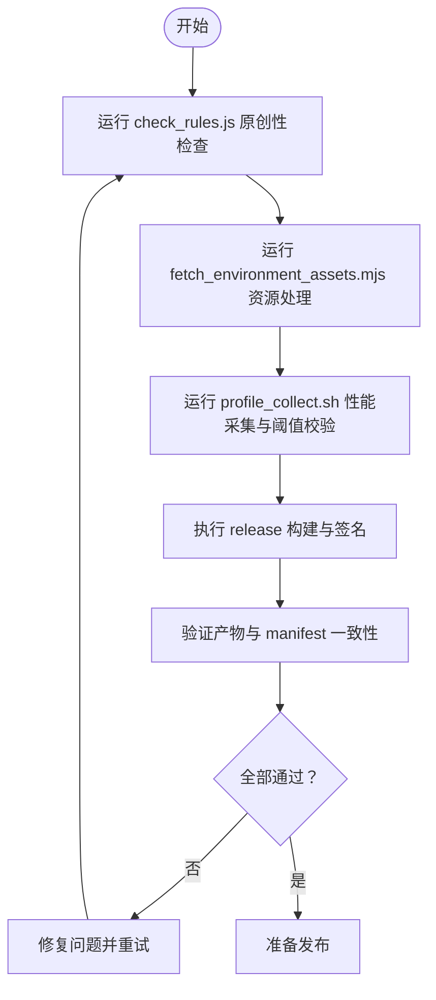
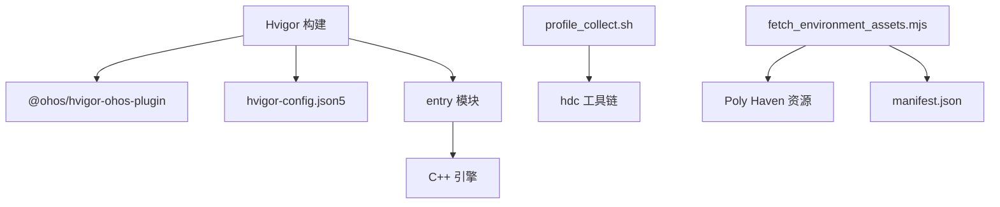

# 部署指南

<cite>
**本文引用的文件**
- [build-profile.json5](file://build-profile.json5)
- [AppScope/app.json5](file://AppScope/app.json5)
- [entry/build-profile.json5](file://entry/build-profile.json5)
- [entry/src/main/module.json5](file://entry/src/main/module.json5)
- [hvigorfile.ts](file://hvigorfile.ts)
- [hvigor/hvigor-config.json5](file://hvigor/hvigor-config.json5)
- [automation/perf/profile_collect.sh](file://automation/perf/profile_collect.sh)
- [automation/assets/fetch_environment_assets.mjs](file://automation/assets/fetch_environment_assets.mjs)
- [automation/hvigor/check_rules.js](file://automation/hvigor/check_rules.js)
- [oh-package.json5](file://oh-package.json5)
</cite>

## 目录
1. [简介](#简介)
2. [项目结构](#项目结构)
3. [核心组件](#核心组件)
4. [架构总览](#架构总览)
5. [详细组件分析](#详细组件分析)
6. [依赖分析](#依赖分析)
7. [性能考虑](#性能考虑)
8. [故障排除指南](#故障排除指南)
9. [结论](#结论)
10. [附录](#附录)

## 简介
本指南面向 my-world（HarmonyOS Open-World RPG）项目的部署与发布，覆盖以下内容：
- 应用签名生成与管理方法
- 不同环境（开发/测试/生产）的构建与配置差异
- 性能监控脚本的使用与数据收集流程
- 发布前检查清单与验证流程
- 设备连接配置与远程调试设置
- 部署故障排除与日志分析方法
- 生产环境最佳实践与安全配置建议

## 项目结构
my-world 采用 HarmonyOS 工程结构，关键目录与职责如下：
- AppScope：应用级元信息（包名、版本、图标等）
- entry：主模块（ArkTS 入口、N-API 桥接、C++ 原生代码、资源）
- native：游戏引擎 C++ 实现（渲染、输入、AI、资源加载等）
- automation：自动化脚本（环境资源拉取与校验、性能采集、规则检查）
- config：配置与 Schema（开发期配置、JSON Schema）
- hvigor：构建系统配置与插件入口

**图表来源**
- [AppScope/app.json5:1-13](file://AppScope/app.json5#L1-L13)
- [build-profile.json5:1-69](file://build-profile.json5#L1-L69)
- [entry/build-profile.json5:1-17](file://entry/build-profile.json5#L1-L17)
- [entry/src/main/module.json5:1-43](file://entry/src/main/module.json5#L1-L43)
- [hvigorfile.ts:1-7](file://hvigorfile.ts#L1-L7)
- [hvigor/hvigor-config.json5:1-4](file://hvigor/hvigor-config.json5#L1-L4)
- [automation/perf/profile_collect.sh:1-97](file://automation/perf/profile_collect.sh#L1-L97)
- [automation/assets/fetch_environment_assets.mjs:1-812](file://automation/assets/fetch_environment_assets.mjs#L1-L812)
- [automation/hvigor/check_rules.js:1-3](file://automation/hvigor/check_rules.js#L1-L3)

**章节来源**
- [AppScope/app.json5:1-13](file://AppScope/app.json5#L1-L13)
- [build-profile.json5:1-69](file://build-profile.json5#L1-L69)
- [entry/build-profile.json5:1-17](file://entry/build-profile.json5#L1-L17)
- [entry/src/main/module.json5:1-43](file://entry/src/main/module.json5#L1-L43)
- [hvigorfile.ts:1-7](file://hvigorfile.ts#L1-L7)
- [hvigor/hvigor-config.json5:1-4](file://hvigor/hvigor-config.json5#L1-L4)

## 核心组件
- 应用元信息与版本控制：位于 AppScope/app.json5，定义 bundleName、versionCode、versionName、min/target API 等。
- 构建与签名：build-profile.json5 定义 signingConfigs、products、buildModeSet（debug/release），以及外部 Native 编译选项。
- 模块能力与权限：entry/src/main/module.json5 声明 module 类型、abilities、pages、请求权限等。
- Hvigor 构建系统：hvigorfile.ts 与 hvigor/hvigor-config.json5 提供构建任务与插件扩展点。
- 自动化脚本：
  - 性能采集：automation/perf/profile_collect.sh 通过 hdc 抓取 hilog 并解析 PROFILE 输出，生成 CSV 并进行阈值校验。
  - 环境资源：automation/assets/fetch_environment_assets.mjs 从 Poly Haven 下载 glTF/GLB，进行节点分区、变换烘焙、材质合并、纹理嵌入与校验，最终写入 rawfile 并生成 manifest。
  - 原创性检查：automation/hvigor/check_rules.js 扫描命名与参考作品重叠项。

**章节来源**
- [AppScope/app.json5:1-13](file://AppScope/app.json5#L1-L13)
- [build-profile.json5:1-69](file://build-profile.json5#L1-L69)
- [entry/src/main/module.json5:1-43](file://entry/src/main/module.json5#L1-L43)
- [hvigorfile.ts:1-7](file://hvigorfile.ts#L1-L7)
- [hvigor/hvigor-config.json5:1-4](file://hvigor/hvigor-config.json5#L1-L4)
- [automation/perf/profile_collect.sh:1-97](file://automation/perf/profile_collect.sh#L1-L97)
- [automation/assets/fetch_environment_assets.mjs:1-812](file://automation/assets/fetch_environment_assets.mjs#L1-L812)
- [automation/hvigor/check_rules.js:1-3](file://automation/hvigor/check_rules.js#L1-L3)

## 架构总览
下图展示从构建到运行、再到性能采集的整体流程，包括签名、Native 编译、资源预处理与运行时日志采集。

**图表来源**
- [build-profile.json5:1-69](file://build-profile.json5#L1-L69)
- [entry/build-profile.json5:1-17](file://entry/build-profile.json5#L1-L17)
- [automation/perf/profile_collect.sh:1-97](file://automation/perf/profile_collect.sh#L1-L97)

## 详细组件分析

### 应用签名生成与管理
- 签名配置位置：build-profile.json5 的 app.signingConfigs 数组定义了签名别名、证书路径、密钥库、算法等。
- 产品绑定：app.products[].signingConfig 将签名配置应用到具体产品（如 default）。
- 构建模式：buildModeSet 中 debug/release 分别对应可调试与发布模式；release 默认关闭 debuggable。
- 安全建议：
  - 生产签名应使用独立证书与密钥库，避免硬编码敏感信息到仓库。
  - 在 CI/CD 中通过环境变量注入 storePassword/keyPassword/certpath/profile/storeFile。
  - 对签名文件进行访问控制与审计。

**图表来源**
- [build-profile.json5:1-69](file://build-profile.json5#L1-L69)

**章节来源**
- [build-profile.json5:1-69](file://build-profile.json5#L1-L69)

### 不同环境的部署步骤与配置差异
- 开发环境（debug）：
  - 启用 debuggable，允许附加调试器与日志输出。
  - ABI 过滤包含 arm64-v8a 与 x86_64，便于本地模拟器与真机调试。
- 发布环境（release）：
  - 关闭 debuggable，优化构建产物。
  - 建议使用专用签名与最小化依赖。
- 模块与权限：
  - entry/src/main/module.json5 声明 abilities、pages、请求权限（如 INTERNET）。
  - AppScope/app.json5 定义 bundleName、版本与目标 API。

**图表来源**
- [AppScope/app.json5:1-13](file://AppScope/app.json5#L1-L13)
- [build-profile.json5:1-69](file://build-profile.json5#L1-L69)
- [entry/src/main/module.json5:1-43](file://entry/src/main/module.json5#L1-L43)

**章节来源**
- [AppScope/app.json5:1-13](file://AppScope/app.json5#L1-L13)
- [build-profile.json5:1-69](file://build-profile.json5#L1-L69)
- [entry/src/main/module.json5:1-43](file://entry/src/main/module.json5#L1-L43)

### 性能监控脚本使用与数据收集
- 脚本功能：
  - 通过 hdc 获取应用 PID，持续抓取 hilog 日志。
  - 解析 PROFILE 行，提取 fps、perf_level、environment_ready、draw_calls、triangles、texture_tier、encounter_mode 等指标。
  - 输出 CSV 文件，并进行 FPS 阈值校验（normal/boss 阶段阈值不同）。
- 使用方法：
  - 设置环境变量：HDC_BIN、BUNDLE_NAME、PHASE、DURATION_SECONDS、OUTPUT_CSV。
  - 确保 hdc 可执行且设备已连接。
  - 运行脚本后检查退出码与输出 CSV。

**图表来源**
- [automation/perf/profile_collect.sh:1-97](file://automation/perf/profile_collect.sh#L1-L97)

**章节来源**
- [automation/perf/profile_collect.sh:1-97](file://automation/perf/profile_collect.sh#L1-L97)

### 环境资源处理流水线
- 资源来源：从 Poly Haven 下载 glTF/GLB 资产与依赖。
- 处理步骤：
  - 节点分区（outerRing/centerRift/backdrop/decoration）。
  - 烘焙节点变换、合并同材质图元、嵌入双分辨率纹理（2k/1k）。
  - 拒绝外部 URI，确保资源内嵌。
  - 输出 GLB 至 entry/src/main/resources/rawfile/environment，并生成 manifest 记录来源与哈希。

**图表来源**
- [automation/assets/fetch_environment_assets.mjs:1-812](file://automation/assets/fetch_environment_assets.mjs#L1-L812)

**章节来源**
- [automation/assets/fetch_environment_assets.mjs:1-812](file://automation/assets/fetch_environment_assets.mjs#L1-L812)

### 发布前检查清单与验证流程
- 原创性检查：automation/hvigor/check_rules.js 扫描 config/ 与 assets/ 名称，标记与参考作品专有称呼重叠条目。
- 资源校验：fetch_environment_assets.mjs 在生成 manifest 时计算 sha256，确保资源一致性。
- 性能基线：profile_collect.sh 在 normal/boss 阶段进行 FPS 阈值校验，防止性能回归。
- 构建与签名：确认 release 构建关闭 debuggable，使用生产签名。

**图表来源**
- [automation/hvigor/check_rules.js:1-3](file://automation/hvigor/check_rules.js#L1-L3)
- [automation/assets/fetch_environment_assets.mjs:1-812](file://automation/assets/fetch_environment_assets.mjs#L1-L812)
- [automation/perf/profile_collect.sh:1-97](file://automation/perf/profile_collect.sh#L1-L97)
- [build-profile.json5:1-69](file://build-profile.json5#L1-L69)

**章节来源**
- [automation/hvigor/check_rules.js:1-3](file://automation/hvigor/check_rules.js#L1-L3)
- [automation/assets/fetch_environment_assets.mjs:1-812](file://automation/assets/fetch_environment_assets.mjs#L1-L812)
- [automation/perf/profile_collect.sh:1-97](file://automation/perf/profile_collect.sh#L1-L97)
- [build-profile.json5:1-69](file://build-profile.json5#L1-L69)

### 设备连接配置与远程调试设置
- 设备连接：确保 hdc 可执行且设备已连接（可通过 DevEco Studio 或命令行验证）。
- 远程调试：
  - debug 模式下启用 debuggable，允许附加调试器。
  - 使用 hdc 查看进程与日志，结合 hilog 定位问题。
- 权限与能力：entry/src/main/module.json5 中声明的能力与权限需与实际运行环境匹配。

**章节来源**
- [entry/src/main/module.json5:1-43](file://entry/src/main/module.json5#L1-L43)
- [build-profile.json5:1-69](file://build-profile.json5#L1-L69)

### 部署故障排除与日志分析方法
- 常见问题：
  - hdc 不可执行或未找到：检查 HDC_BIN 环境变量与路径。
  - 应用 PID 不存在：确认应用已启动且 BUNDLE_NAME 正确。
  - 致命渲染错误：脚本会检测 SIGSEGV/cppcrash/EGL 错误并中断。
  - 性能不达标：检查 FPS 阈值与 PHASE 设置。
- 日志分析：
  - 使用 hilog 抓取日志，关注 PROFILE 行与错误关键字。
  - 检查 CSV 输出中的 fps、perf_level、environment_ready、draw_calls、triangles 等字段趋势。

**章节来源**
- [automation/perf/profile_collect.sh:1-97](file://automation/perf/profile_collect.sh#L1-L97)

### 生产环境最佳实践与安全配置
- 签名管理：
  - 使用独立生产证书与密钥库，禁止硬编码密码。
  - 在 CI/CD 中通过安全变量注入签名参数。
- 构建优化：
  - release 模式关闭 debuggable，减少体积与风险。
  - 仅保留必要 ABI 与依赖。
- 资源安全：
  - 确保所有资源内嵌，无外部 URI 引用。
  - 使用 manifest 记录来源与哈希，便于审计与回滚。
- 权限最小化：
  - 仅在 module.json5 中声明必要权限（如 INTERNET）。

**章节来源**
- [build-profile.json5:1-69](file://build-profile.json5#L1-L69)
- [entry/src/main/module.json5:1-43](file://entry/src/main/module.json5#L1-L43)
- [automation/assets/fetch_environment_assets.mjs:1-812](file://automation/assets/fetch_environment_assets.mjs#L1-L812)

## 依赖分析
- 构建依赖：
  - Hvigor 插件与配置文件（hvigorfile.ts、hvigor-config.json5）。
  - 外部工具：hdc（用于性能采集）、sips（用于纹理缩放）。
- 资源依赖：
  - Poly Haven 资产（glTF/GLB）与依赖文件。
  - 生成的 manifest 记录来源与哈希。
- 运行时依赖：
  - HarmonyOS 运行时与 N-API 桥接。
  - 模块声明的权限与能力。

**图表来源**
- [hvigorfile.ts:1-7](file://hvigorfile.ts#L1-L7)
- [hvigor/hvigor-config.json5:1-4](file://hvigor/hvigor-config.json5#L1-L4)
- [automation/perf/profile_collect.sh:1-97](file://automation/perf/profile_collect.sh#L1-L97)
- [automation/assets/fetch_environment_assets.mjs:1-812](file://automation/assets/fetch_environment_assets.mjs#L1-L812)

**章节来源**
- [hvigorfile.ts:1-7](file://hvigorfile.ts#L1-L7)
- [hvigor/hvigor-config.json5:1-4](file://hvigor/hvigor-config.json5#L1-L4)
- [automation/perf/profile_collect.sh:1-97](file://automation/perf/profile_collect.sh#L1-L97)
- [automation/assets/fetch_environment_assets.mjs:1-812](file://automation/assets/fetch_environment_assets.mjs#L1-L812)

## 性能考虑
- 构建阶段：
  - 使用 BiSheng 编译器优化 Native 代码。
  - 合理设置 ABI 过滤以减少产物体积。
- 运行阶段：
  - 通过 profile_collect.sh 监控 FPS、绘制调用、三角形数量等关键指标。
  - 针对 boss 阶段降低 FPS 阈值以保障体验。
- 资源阶段：
  - 合并同材质图元，减少批次。
  - 嵌入双分辨率纹理，根据设备能力选择合适级别。

[本节为通用指导，无需特定文件来源]

## 故障排除指南
- 构建失败：
  - 检查 build-profile.json5 签名路径与密码是否正确。
  - 确认 entry/build-profile.json5 的 CMakeLists.txt 路径与 ABI 过滤。
- 性能采集失败：
  - 验证 hdc 可执行与设备连接状态。
  - 检查 BUNDLE_NAME 与应用是否正在运行。
  - 查看 hilog 输出是否存在致命错误标志。
- 资源处理失败：
  - 确认网络可达与 Poly Haven 资源可用。
  - 检查 layout.json 与 diffuse 依赖路径是否符合规范。

**章节来源**
- [build-profile.json5:1-69](file://build-profile.json5#L1-L69)
- [entry/build-profile.json5:1-17](file://entry/build-profile.json5#L1-L17)
- [automation/perf/profile_collect.sh:1-97](file://automation/perf/profile_collect.sh#L1-L97)
- [automation/assets/fetch_environment_assets.mjs:1-812](file://automation/assets/fetch_environment_assets.mjs#L1-L812)

## 结论
本指南系统化梳理了 my-world 项目的部署流程，涵盖签名管理、多环境构建、性能监控、资源处理与安全检查。通过自动化脚本与标准化配置，可有效提升部署效率与质量稳定性。建议在生产环境中严格遵循安全最佳实践，并结合 CI/CD 实现自动化验证与发布。

[本节为总结内容，无需特定文件来源]

## 附录
- 常用命令与环境变量：
  - 构建：hvigor 构建命令（由 hvigorfile.ts 驱动）
  - 性能采集：设置 HDC_BIN、BUNDLE_NAME、PHASE、DURATION_SECONDS、OUTPUT_CSV 后运行 profile_collect.sh
  - 资源处理：运行 fetch_environment_assets.mjs 生成环境与 manifest
- 参考文件：
  - oh-package.json5：项目元信息（名称、版本、描述等）

**章节来源**
- [oh-package.json5:1-10](file://oh-package.json5#L1-L10)