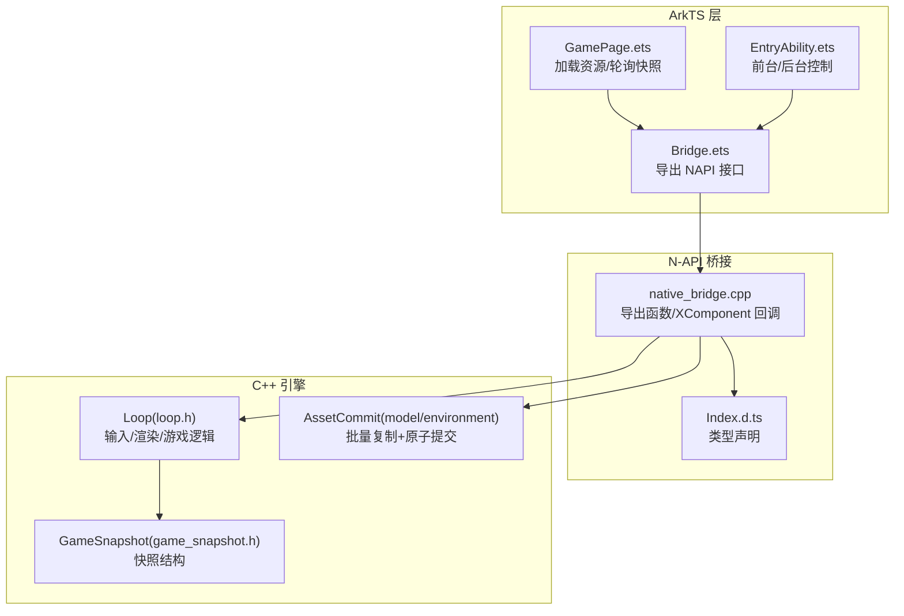
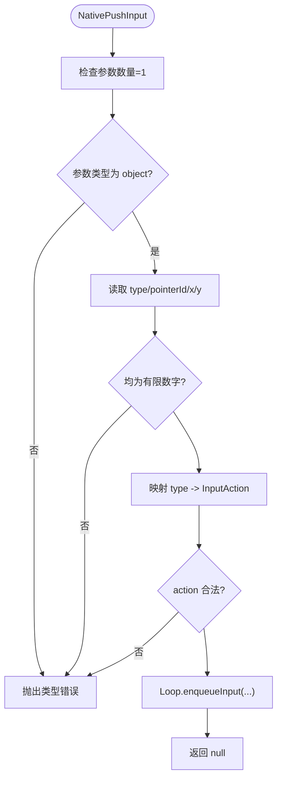
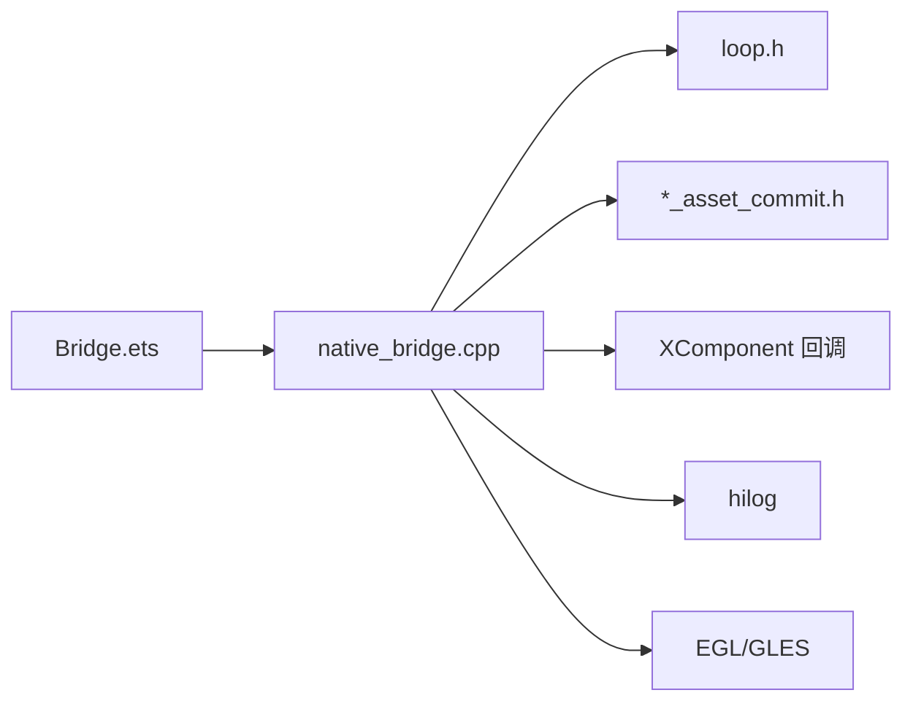

# NAPI 桥接机制

<cite>
**本文引用的文件**   
- [Bridge.ets](file://entry/src/main/ets/napi/Bridge.ets)
- [native_bridge.cpp](file://entry/src/main/cpp/native_bridge.cpp)
- [Index.d.ts](file://entry/src/main/cpp/types/libnative_game/Index.d.ts)
- [loop.h](file://native/engine/core/loop.h)
- [game_snapshot.h](file://native/engine/core/game_snapshot.h)
- [CMakeLists.txt](file://entry/src/main/cpp/CMakeLists.txt)
- [model_asset_commit.h](file://native/platform/harmony/model_asset_commit.h)
- [environment_asset_commit.h](file://native/platform/harmony/environment_asset_commit.h)
- [GamePage.ets](file://entry/src/main/ets/pages/GamePage.ets)
- [EntryAbility.ets](file://entry/src/main/ets/EntryAbility.ets)
- [input_event.h](file://native/engine/input/input_event.h)
- [test_bridge_contract.mjs](file://tests/test_bridge_contract.mjs)
</cite>

## 目录
1. [简介](#简介)
2. [项目结构](#项目结构)
3. [核心组件](#核心组件)
4. [架构总览](#架构总览)
5. [详细组件分析](#详细组件分析)
6. [依赖关系分析](#依赖关系分析)
7. [性能考量](#性能考量)
8. [故障排查指南](#故障排查指南)
9. [结论](#结论)
10. [附录：NAPI API 参考与使用示例](#附录napi-api-参考与使用示例)

## 简介
本文件系统化梳理 my-world 在 HarmonyOS 平台上的 ArkTS 与 C++ 引擎之间的 NAPI 桥接机制。重点覆盖以下方面：
- ArkTS 侧 Bridge.ets 暴露的 JavaScript 接口与 native_bridge.cpp 中 C++ 实现的对应关系
- 数据类型映射（数值、布尔、字符串、ArrayBuffer、对象字段）
- 内存管理策略（ArrayBuffer 零拷贝读取、批量提交、生命周期锁）
- 错误处理与类型校验（参数数量、类型、范围、非有限数拒绝）
- 数据序列化/反序列化流程（pullSnapshot 构建对象、pushInput/pushAction 解析对象）
- 异步调用模式（当前为同步 NAPI 调用；页面层通过定时器轮询快照，未使用 Promise/回调）
- 调试技巧与性能分析方法

## 项目结构
NAPI 桥接相关的关键位置与职责：
- entry/src/main/ets/napi/Bridge.ets：ArkTS 侧对外导出的 NAPI 函数封装与 Snapshot/InputEvent 类型定义
- entry/src/main/cpp/native_bridge.cpp：N-API 模块实现，注册导出函数、绑定 XComponent 事件、调用 Loop
- entry/src/main/cpp/types/libnative_game/Index.d.ts：TypeScript 声明，保证 ArkTS 与 C++ 契约一致
- native/engine/core/loop.h：游戏主循环与子系统聚合，提供输入入队、状态快照等能力
- native/engine/core/game_snapshot.h：快照数据结构定义
- native/platform/harmony/*_asset_commit.h：资源批量复制与原子提交的模板工具
- entry/src/main/ets/pages/GamePage.ets：页面加载资源、启动/停止原生循环、轮询快照并驱动 UI
- entry/src/main/ets/EntryAbility.ets：应用前台/后台时控制原生循环启停
- entry/src/main/cpp/CMakeLists.txt：C++ 库构建配置，链接 N-API、XComponent、EGL/GLES 等



**图表来源** 
- [Bridge.ets:1-94](file://entry/src/main/ets/napi/Bridge.ets#L1-L94)
- [native_bridge.cpp:518-561](file://entry/src/main/cpp/native_bridge.cpp#L518-L561)
- [loop.h:26-104](file://native/engine/core/loop.h#L26-L104)
- [game_snapshot.h:7-74](file://native/engine/core/game_snapshot.h#L7-L74)
- [model_asset_commit.h:15-29](file://native/platform/harmony/model_asset_commit.h#L15-L29)
- [environment_asset_commit.h:18-35](file://native/platform/harmony/environment_asset_commit.h#L18-L35)

**章节来源**
- [Bridge.ets:1-94](file://entry/src/main/ets/napi/Bridge.ets#L1-L94)
- [native_bridge.cpp:518-561](file://entry/src/main/cpp/native_bridge.cpp#L518-L561)
- [CMakeLists.txt:1-135](file://entry/src/main/cpp/CMakeLists.txt#L1-L135)

## 核心组件
- ArkTS 接口层（Bridge.ets）
  - 导出 nativeStart/nativeStop/nativeStartIfForeground
  - 导出资源设置：nativeSetModelAssets、nativeSetEnvironmentAssets
  - 导出输入与玩法控制：pushInput、pushAction、startEncounter、advanceLevel、useSupply、retryBoss、toggleDebugHud、skipDemoPhase
  - 导出快照拉取：pullSnapshot
  - 定义 InputEvent 与 Snapshot 接口，约束字段与类型
- N-API 实现层（native_bridge.cpp）
  - 将 ArkTS 调用映射到 C++ 方法，严格校验参数类型与取值范围
  - 通过 Loop::enqueueInput 入队输入，通过 Loop::snapshot 获取快照
  - 通过 CopyAndCommit* 模板进行资源批量复制与生命周期安全提交
  - 绑定 XComponent 生命周期与触摸事件回调
- 引擎核心（loop.h, game_snapshot.h）
  - Loop 聚合输入队列、相机、战斗、AI、VFX、音频等子系统
  - GameSnapshot 作为跨语言的数据契约，包含大量运行时状态字段

**章节来源**
- [Bridge.ets:77-94](file://entry/src/main/ets/napi/Bridge.ets#L77-L94)
- [native_bridge.cpp:130-516](file://entry/src/main/cpp/native_bridge.cpp#L130-L516)
- [loop.h:26-104](file://native/engine/core/loop.h#L26-L104)
- [game_snapshot.h:7-74](file://native/engine/core/game_snapshot.h#L7-L74)

## 架构总览
下图展示从 ArkTS 到 C++ 引擎的双向通信路径：ArkTS 调用 N-API 函数，C++ 侧完成参数校验后进入 Loop 执行具体逻辑；Loop 定期产出快照，ArkTS 定时拉取并更新 UI。

```mermaid
sequenceDiagram
participant ArkTS as "ArkTS (Bridge.ets)"
participant NAPI as "N-API (native_bridge.cpp)"
participant Loop as "Loop (loop.h)"
participant Snap as "GameSnapshot (game_snapshot.h)"
ArkTS->>NAPI : pushInput(event)/pushAction(type)
NAPI->>NAPI : 参数校验/类型转换
NAPI->>Loop : enqueueInput(action, pointerId, x, y)
Note over NAPI,Loop : 输入入队，序列号递增
ArkTS->>NAPI : pullSnapshot()
NAPI->>Loop : snapshot()
Loop-->>NAPI : GameSnapshot
NAPI->>NAPI : 构造 JS 对象(字段映射)
NAPI-->>ArkTS : Snapshot 对象
```

**图表来源** 
- [native_bridge.cpp:212-275](file://entry/src/main/cpp/native_bridge.cpp#L212-L275)
- [native_bridge.cpp:360-516](file://entry/src/main/cpp/native_bridge.cpp#L360-L516)
- [loop.h:88-98](file://native/engine/core/loop.h#L88-L98)
- [game_snapshot.h:7-74](file://native/engine/core/game_snapshot.h#L7-L74)

## 详细组件分析

### ArkTS 接口层（Bridge.ets）
- 职责
  - 统一导入 libnative_game.so 提供的 N-API 函数
  - 定义 InputEvent/Snapshot 接口，确保 ArkTS 侧类型安全
  - 将 ArkTS 调用透明转发至 native_* 函数
- 关键点
  - 所有导出函数均为同步调用，无 Promise/回调包装
  - Snapshot 字段与 C++ 侧一一对应，便于 UI 直接消费

**章节来源**
- [Bridge.ets:3-75](file://entry/src/main/ets/napi/Bridge.ets#L3-L75)
- [Bridge.ets:77-94](file://entry/src/main/ets/napi/Bridge.ets#L77-L94)

### N-API 实现层（native_bridge.cpp）
- 职责
  - 导出全部 native_* 函数供 ArkTS 调用
  - 对每个入口进行严格的参数数量、类型、范围检查
  - 将 ArkTS 输入转换为 Engine InputAction，并通过 Loop 入队
  - 将 GameSnapshot 字段映射为 JS 对象属性返回
  - 绑定 XComponent 生命周期与触摸事件分发
- 关键实现要点
  - CopyArrayBuffer：验证 ArrayBuffer 并复制到 std::vector<uint8_t>
  - GetNumberProperty：安全读取数字属性，支持可选/必填与有限性检查
  - CopyAndCommitModelAssets/CopyAndCommitEnvironmentAssets：先复制全部资源，再在生命周期锁内原子提交
  - OnSurfaceCreated/Changed/Destroyed：初始化/调整 Surface，必要时失效渲染器快照
  - OnDispatchTouchEvent：读取 OH_NativeXComponent_TouchEvent，仅转发顶层变化指针字段



**图表来源** 
- [native_bridge.cpp:212-250](file://entry/src/main/cpp/native_bridge.cpp#L212-L250)

**章节来源**
- [native_bridge.cpp:25-57](file://entry/src/main/cpp/native_bridge.cpp#L25-L57)
- [native_bridge.cpp:130-149](file://entry/src/main/cpp/native_bridge.cpp#L130-L149)
- [native_bridge.cpp:151-210](file://entry/src/main/cpp/native_bridge.cpp#L151-L210)
- [native_bridge.cpp:212-275](file://entry/src/main/cpp/native_bridge.cpp#L212-L275)
- [native_bridge.cpp:360-516](file://entry/src/main/cpp/native_bridge.cpp#L360-L516)
- [native_bridge.cpp:518-561](file://entry/src/main/cpp/native_bridge.cpp#L518-L561)

### 引擎核心（loop.h, game_snapshot.h）
- Loop
  - 维护输入队列、触摸路由、虚拟摇杆、相机、玩家控制器、软目标选择、战斗控制器、遭遇控制器、演示导演、VFX、性能守卫、音频桥等
  - 提供 start/stop/tickOnce/updateFixed/processInput/resetInput 等方法
  - 提供 withLifecycle 生命周期同步原语，确保线程安全
  - 提供 enqueueInput/snapshot 等桥接能力
- GameSnapshot
  - 定义快照字段集合，涵盖角色、目标、战斗、环境、表现、调试等信息

**章节来源**
- [loop.h:26-104](file://native/engine/core/loop.h#L26-L104)
- [game_snapshot.h:7-74](file://native/engine/core/game_snapshot.h#L7-L74)

### 资源提交（model/environment asset commit）
- 设计原则
  - 全有或全无：三份/四份资源均复制成功后才进入生命周期锁并提交
  - 避免部分提交导致的状态不一致
- 模板化实现
  - CopyAndCommitModelAssets：按 Player/Enemy/Boss 槽位复制并原子提交
  - CopyAndCommitEnvironmentAssets：按 OuterRing/CenterRift/Backdrop/Decoration 槽位复制并原子提交

**章节来源**
- [model_asset_commit.h:15-29](file://native/platform/harmony/model_asset_commit.h#L15-L29)
- [environment_asset_commit.h:18-35](file://native/platform/harmony/environment_asset_commit.h#L18-L35)

### 页面与能力集成（GamePage.ets, EntryAbility.ets）
- GamePage
  - 使用 XComponent 挂载 native_game 库
  - 异步加载模型与环境资源，失败回退到程序化生成
  - 每 100ms 轮询 pullSnapshot，更新 @State 驱动 UI
  - 页面销毁时清理定时器并调用 nativeStop
- EntryAbility
  - onForeground/onBackground 分别调用 nativeStart/nativeStop，控制原生循环

**章节来源**
- [GamePage.ets:103-152](file://entry/src/main/ets/pages/GamePage.ets#L103-L152)
- [GamePage.ets:219-303](file://entry/src/main/ets/pages/GamePage.ets#L219-L303)
- [EntryAbility.ets:29-37](file://entry/src/main/ets/EntryAbility.ets#L29-L37)

## 依赖关系分析
- ArkTS 依赖 N-API 模块（libnative_game.so），通过 Bridge.ets 统一访问
- native_bridge.cpp 依赖 engine core、input、render、platform/harmony 等子系统
- CMakeLists.txt 明确列出编译源与链接库（ace_napi.z、native_window、EGL/GLES、hilog）



**图表来源** 
- [CMakeLists.txt:126-134](file://entry/src/main/cpp/CMakeLists.txt#L126-L134)
- [native_bridge.cpp:518-561](file://entry/src/main/cpp/native_bridge.cpp#L518-L561)

**章节来源**
- [CMakeLists.txt:1-135](file://entry/src/main/cpp/CMakeLists.txt#L1-L135)

## 性能考量
- 输入路径
  - 参数校验与类型转换在 N-API 层完成，避免无效调用进入引擎
  - 输入入队使用互斥锁保护，序列号自增，避免重复计数
- 快照路径
  - 每次 pullSnapshot 创建新 JS 对象并填充字段，字段较多但为轻量数值/布尔/字符串
  - 页面层以固定间隔轮询，建议根据设备性能调优间隔
- 资源提交
  - 先复制全部资源，再在生命周期锁内原子提交，减少中间态
  - ArrayBuffer 读取采用 napi_get_arraybuffer_info，避免额外拷贝
- 渲染路径
  - Surface 初始化/调整失败会失效渲染器快照，防止异常状态传播

[本节为通用指导，不直接分析具体文件]

## 故障排查指南
- 常见错误与定位
  - 参数数量/类型不符：N-API 层会抛出类型错误，检查 ArkTS 调用是否传入正确结构与类型
  - 非有限数值：GetNumberProperty 与 isfinite 检查会拒绝 NaN/Infinity
  - 资源加载失败：页面层会打印错误日志并回退到程序化资源
  - Surface 初始化失败：OnSurfaceChanged/OnSurfaceDestroyed 会记录日志并失效渲染器快照
- 调试建议
  - 使用 hilog 输出关键路径日志（已内置 LOGI/LOGE）
  - 在页面层捕获 pullSnapshot 异常并记录堆栈
  - 使用测试用例 test_bridge_contract.mjs 验证契约一致性

**章节来源**
- [native_bridge.cpp:25-57](file://entry/src/main/cpp/native_bridge.cpp#L25-L57)
- [native_bridge.cpp:59-111](file://entry/src/main/cpp/native_bridge.cpp#L59-L111)
- [GamePage.ets:103-152](file://entry/src/main/ets/pages/GamePage.ets#L103-L152)
- [test_bridge_contract.mjs:1-221](file://tests/test_bridge_contract.mjs#L1-L221)

## 结论
my-world 的 NAPI 桥接采用“强契约 + 强校验”的设计：ArkTS 侧通过 Bridge.ets 暴露稳定接口，C++ 侧在 native_bridge.cpp 中进行严格类型与范围校验，再通过 Loop 与子系统协作完成业务逻辑。资源提交采用“全有或全无”的原子策略，确保状态一致性。当前异步交互以同步 NAPI 调用配合页面轮询为主，后续可按需引入 Promise/回调以提升灵活性。整体架构清晰、边界明确，便于扩展与维护。

[本节为总结性内容，不直接分析具体文件]

## 附录：NAPI API 参考与使用示例

### ArkTS 接口清单（Bridge.ets）
- nativeStart(): void
- nativeStop(): void
- nativeStartIfForeground(): void
- nativeSetModelAssets(player: ArrayBuffer, enemy: ArrayBuffer, boss: ArrayBuffer): boolean
- nativeSetEnvironmentAssets(outer: ArrayBuffer, center: ArrayBuffer, backdrop: ArrayBuffer, decoration: ArrayBuffer): boolean
- pushInput(e: InputEvent): void
- pushAction(type: number): void
- startEncounter(mode: number): boolean
- advanceLevel(): boolean
- useSupply(): boolean
- retryBoss(): boolean
- toggleDebugHud(): void
- skipDemoPhase(phase: number): void
- pullSnapshot(): Snapshot

**章节来源**
- [Bridge.ets:77-94](file://entry/src/main/ets/napi/Bridge.ets#L77-L94)

### TypeScript 声明（Index.d.ts）
- 与 Bridge.ets 导出一一对应，包括 pullSnapshot 返回的对象字段定义

**章节来源**
- [Index.d.ts:1-81](file://entry/src/main/cpp/types/libnative_game/Index.d.ts#L1-L81)

### 输入事件与动作映射（input_event.h）
- InputAction 枚举：PointerDown/PointerMove/PointerUp/PointerCancel/Attack/Dodge/Radiance/Current/Corruption/Ultimate
- InputEvent 结构：action、pointerId、x、y、sequence

**章节来源**
- [input_event.h:4-24](file://native/engine/input/input_event.h#L4-L24)

### 使用示例（概念性说明）
- 启动/停止原生循环
  - 在 EntryAbility 的 onForeground/onBackground 中调用 nativeStart/nativeStop
- 加载资源
  - 使用 resourceManager 读取 GLB 二进制，转为 ArrayBuffer 后调用 nativeSetModelAssets/nativeSetEnvironmentAssets
- 输入上报
  - 将触摸事件封装为 {type, pointerId, x, y} 后调用 pushInput
  - 将按钮动作映射为 0..5 的整数后调用 pushAction
- 拉取快照
  - 定时调用 pullSnapshot，将结果映射到 @State 字段驱动 UI

[本节为概念性说明，不直接分析具体文件]