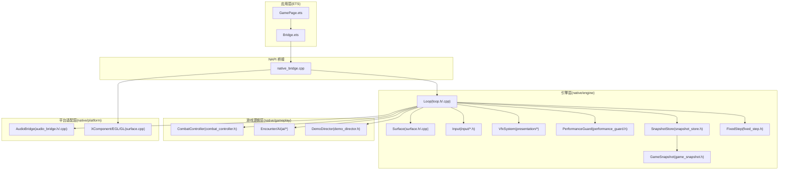
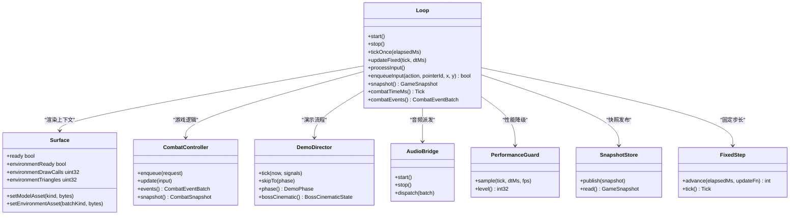
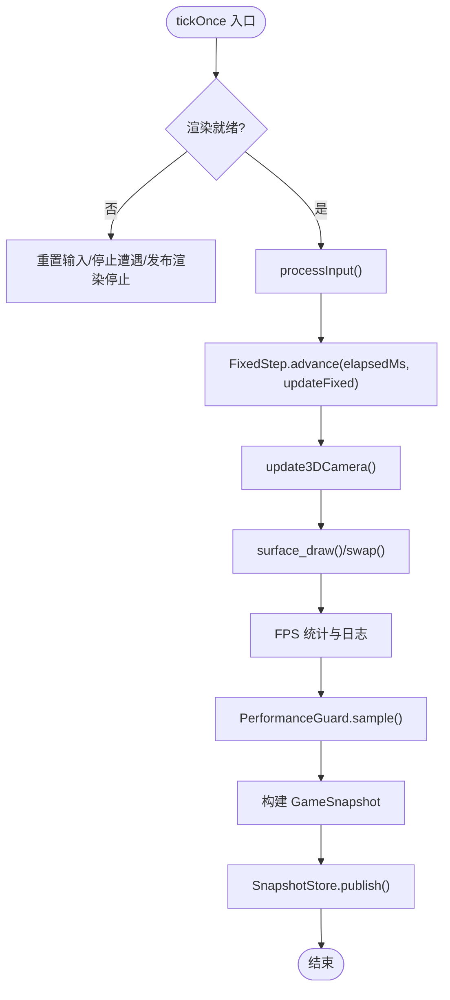
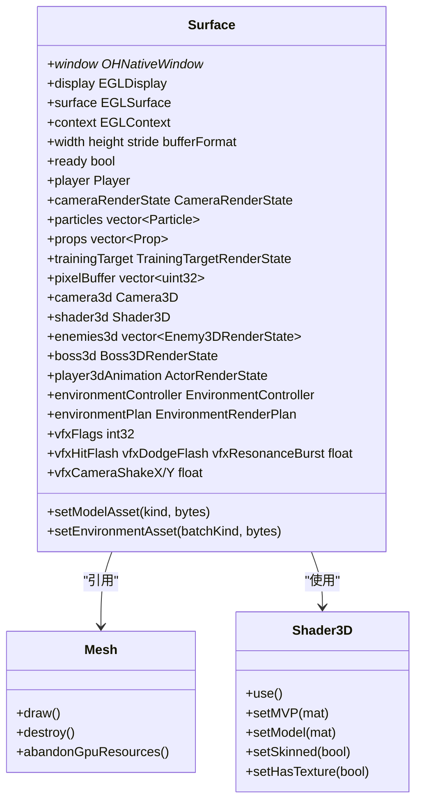
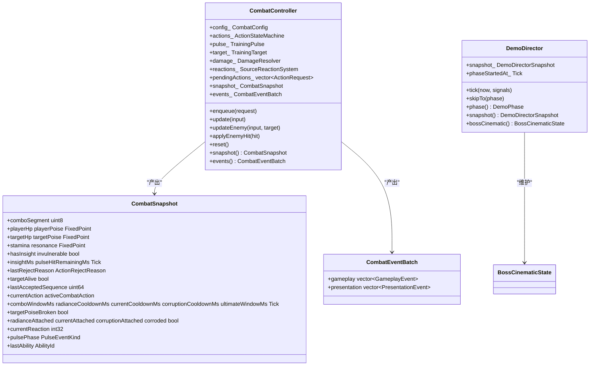
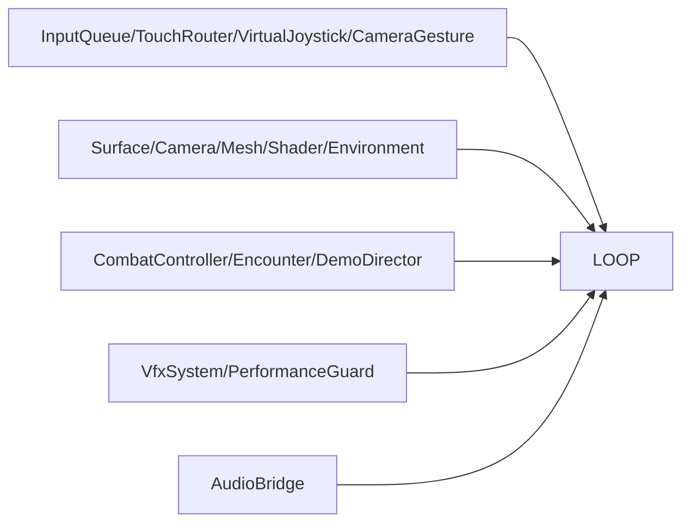

# 分层架构设计

<cite>
**本文引用的文件**   
- [native_bridge.cpp](file://entry/src/main/cpp/native_bridge.cpp)
- [Bridge.ets](file://entry/src/main/ets/napi/Bridge.ets)
- [GamePage.ets](file://entry/src/main/ets/pages/GamePage.ets)
- [loop.h](file://native/engine/core/loop.h)
- [loop.cpp](file://native/engine/core/loop.cpp)
- [game_snapshot.h](file://native/engine/core/game_snapshot.h)
- [snapshot_store.h](file://native/engine/core/snapshot_store.h)
- [fixed_step.h](file://native/engine/core/fixed_step.h)
- [input_event.h](file://native/engine/input/input_event.h)
- [surface.h](file://native/engine/render/surface.h)
- [surface.cpp](file://native/engine/render/surface.cpp)
- [audio_bridge.h](file://native/platform/harmony/audio_bridge.h)
- [audio_bridge.cpp](file://native/platform/harmony/audio_bridge.cpp)
- [performance_guard.h](file://native/engine/presentation/performance_guard.h)
- [demo_director.h](file://native/gameplay/flow/demo_director.h)
- [combat_controller.h](file://native/gameplay/combat/combat_controller.h)
</cite>

## 目录
1. [引言](#引言)
2. [项目结构](#项目结构)
3. [核心组件](#核心组件)
4. [架构总览](#架构总览)
5. [详细组件分析](#详细组件分析)
6. [依赖关系分析](#依赖关系分析)
7. [性能考量](#性能考量)
8. [故障排查指南](#故障排查指南)
9. [结论](#结论)
10. [附录](#附录)

## 引言
本文件为 my-world 的分层架构设计文档，围绕三层架构进行系统化说明：
- 引擎层（native/engine）：负责固定时间步长循环、输入处理、渲染与资源管理、VFX/音频桥接等。
- 游戏逻辑层（native/gameplay）：实现战斗、AI、目标选择、演示流程等核心玩法。
- 平台适配层（native/platform）：封装 HarmonyOS 的 XComponent、EGL/GL、音频输出等系统能力。

重点阐述各层职责边界、接口契约、NAPI 桥接的数据同步与事件传递机制，以及该分层如何支撑模块化与可测试性。同时给出层间依赖图、关键调用序列图与流程图，并总结错误处理、日志与性能监控在各层的落地方式。

## 项目结构
- entry/src/main/cpp/native_bridge.cpp：NAPI 模块入口，注册原生方法，绑定 XComponent 生命周期回调，统一输入与资产注入。
- entry/src/main/ets/napi/Bridge.ets：ETS 侧 NAPI 类型定义与函数导出，供页面调用。
- entry/src/main/ets/pages/GamePage.ets：UI 页面，加载模型与环境资源，轮询快照驱动 UI 更新。
- native/engine/core：Loop 主循环、固定步长、快照存储、生命周期状态等。
- native/engine/render：Surface/EGL/GL 渲染管线、相机、网格、着色器、环境批处理。
- native/engine/input：输入队列、触摸路由、虚拟摇杆、相机手势、玩家意图。
- native/gameplay：战斗控制器、AI、目标选择、演示导演等。
- native/platform/harmony：HarmonyOS 平台桥接（音频、栅栏等待、生命周期）。



**图表来源** 
- [native_bridge.cpp:518-561](file://entry/src/main/cpp/native_bridge.cpp#L518-L561)
- [Bridge.ets:77-94](file://entry/src/main/ets/napi/Bridge.ets#L77-L94)
- [GamePage.ets:154-166](file://entry/src/main/ets/pages/GamePage.ets#L154-L166)
- [loop.h:26-104](file://native/engine/core/loop.h#L26-L104)
- [surface.h:98-252](file://native/engine/render/surface.h#L98-L252)
- [audio_bridge.h:7-27](file://native/platform/harmony/audio_bridge.h#L7-L27)

**章节来源**
- [native_bridge.cpp:518-561](file://entry/src/main/cpp/native_bridge.cpp#L518-L561)
- [Bridge.ets:77-94](file://entry/src/main/ets/napi/Bridge.ets#L77-L94)
- [GamePage.ets:154-166](file://entry/src/main/ets/pages/GamePage.ets#L154-L166)
- [loop.h:26-104](file://native/engine/core/loop.h#L26-L104)
- [surface.h:98-252](file://native/engine/render/surface.h#L98-L252)
- [audio_bridge.h:7-27](file://native/platform/harmony/audio_bridge.h#L7-L27)

## 核心组件
- Loop：引擎主循环，协调输入、固定步长更新、渲染、VFX、音频、性能降级与快照发布。
- Surface：渲染上下文与资源管理，包含 EGL/GL 生命周期、3D 相机、模型/环境批处理、VFX 标记。
- CombatController：战斗逻辑核心，维护状态机、伤害计算、源反应系统、训练脉冲与事件批次。
- DemoDirector：演示阶段控制，驱动引导、探索、遭遇、共鸣、Boss 过场与收尾。
- AudioBridge：音频桥接，按战斗事件派发占位音效，不支持时静默降级。
- PerformanceGuard：基于滑动窗口的 FPS 采样与降级等级输出。
- SnapshotStore：线程安全的快照读写，供 NAPI 拉取。
- FixedStep：固定时间步长推进，保证确定性更新。
- GameSnapshot：跨层数据契约，描述帧级状态。

**章节来源**
- [loop.h:26-104](file://native/engine/core/loop.h#L26-L104)
- [loop.cpp:131-174](file://native/engine/core/loop.cpp#L131-L174)
- [surface.h:98-252](file://native/engine/render/surface.h#L98-L252)
- [combat_controller.h:64-113](file://native/gameplay/combat/combat_controller.h#L64-L113)
- [demo_director.h:54-71](file://native/gameplay/flow/demo_director.h#L54-L71)
- [audio_bridge.h:7-27](file://native/platform/harmony/audio_bridge.h#L7-L27)
- [performance_guard.h:21-45](file://native/engine/presentation/performance_guard.h#L21-L45)
- [snapshot_store.h:5-21](file://native/engine/core/snapshot_store.h#L5-L21)
- [fixed_step.h:8-49](file://native/engine/core/fixed_step.h#L8-L49)
- [game_snapshot.h:7-74](file://native/engine/core/game_snapshot.h#L7-L74)

## 架构总览
三层职责边界与依赖关系如下：
- 平台适配层（platform）：对上层暴露稳定的抽象（如 AudioBridge），屏蔽系统差异；在 OHOS_PLATFORM 下启用功能，否则降级。
- 引擎层（engine）：以 Loop 为核心，组合输入、渲染、VFX、音频、性能监控与快照发布；不直接依赖 ETS，仅通过 NAPI 暴露接口。
- 游戏逻辑层（gameplay）：纯 C++ 实现，无平台耦合，便于单元测试与回放验证。



**图表来源** 
- [loop.h:26-104](file://native/engine/core/loop.h#L26-L104)
- [surface.h:98-252](file://native/engine/render/surface.h#L98-L252)
- [combat_controller.h:64-113](file://native/gameplay/combat/combat_controller.h#L64-L113)
- [demo_director.h:54-71](file://native/gameplay/flow/demo_director.h#L54-L71)
- [audio_bridge.h:7-27](file://native/platform/harmony/audio_bridge.h#L7-L27)
- [performance_guard.h:21-45](file://native/engine/presentation/performance_guard.h#L21-L45)
- [snapshot_store.h:5-21](file://native/engine/core/snapshot_store.h#L5-L21)
- [fixed_step.h:8-49](file://native/engine/core/fixed_step.h#L8-L49)

## 详细组件分析

### NAPI 桥接与层间通信
- ETS 侧通过 Bridge.ets 导入 libnative_game.so 导出的方法，提供强类型 Snapshot 接口。
- native_bridge.cpp 注册所有 NAPI 方法，包括启动/停止、输入推送、资产设置、关卡推进、调试 HUD、演示跳过与快照拉取。
- XComponent 生命周期回调（创建/改变/销毁）与触摸事件分发到 Loop，确保渲染与输入与平台同步。
- 数据同步采用“快照拉取”模式：每帧由 Loop 生成 GameSnapshot，NAPI 将其转换为 JS 对象供 ETS 读取。

```mermaid
sequenceDiagram
participant ETS as "GamePage.ets"
participant BR as "Bridge.ets"
participant NB as "native_bridge.cpp"
participant LOOP as "Loop"
participant SS as "SnapshotStore"
participant SURF as "Surface"
ETS->>BR : pullSnapshot()
BR->>NB : pullSnapshot()
NB->>LOOP : snapshot()
LOOP->>SS : read()
SS-->>LOOP : GameSnapshot
LOOP-->>NB : GameSnapshot
NB-->>BR : JS Snapshot 对象
BR-->>ETS : Snapshot
Note over ETS,SURF : ETS 使用 Snapshot 驱动 UI 更新
```

**图表来源** 
- [Bridge.ets:93-94](file://entry/src/main/ets/napi/Bridge.ets#L93-L94)
- [native_bridge.cpp:360-516](file://entry/src/main/cpp/native_bridge.cpp#L360-L516)
- [loop.h:97-98](file://native/engine/core/loop.h#L97-L98)
- [snapshot_store.h:12-15](file://native/engine/core/snapshot_store.h#L12-L15)

**章节来源**
- [native_bridge.cpp:518-561](file://entry/src/main/cpp/native_bridge.cpp#L518-L561)
- [Bridge.ets:77-94](file://entry/src/main/ets/napi/Bridge.ets#L77-L94)
- [GamePage.ets:219-293](file://entry/src/main/ets/pages/GamePage.ets#L219-L293)

### 引擎层：Loop 主循环与固定步长
- start/stop：管理线程、生命周期、音频桥、重置状态与快照发布。
- tickOnce：处理输入、固定步长更新、3D 相机更新、渲染绘制与交换、FPS 统计与性能采样、快照构建与发布。
- updateFixed：相机更新、玩家移动、粒子发射、目标选择、战斗入队与更新、演示信号、VFX 消费与更新、音频派发、动画与 3D 状态投影、最终快照发布。
- FixedStep：确保确定性更新，限制最大步进数避免卡顿补偿。



**图表来源** 
- [loop.cpp:311-417](file://native/engine/core/loop.cpp#L311-L417)
- [fixed_step.h:16-37](file://native/engine/core/fixed_step.h#L16-L37)

**章节来源**
- [loop.cpp:131-174](file://native/engine/core/loop.cpp#L131-L174)
- [loop.cpp:311-417](file://native/engine/core/loop.cpp#L311-L417)
- [loop.cpp:419-598](file://native/engine/core/loop.cpp#L419-L598)
- [fixed_step.h:8-49](file://native/engine/core/fixed_step.h#L8-L49)

### 渲染层：Surface 与 3D 管线
- Surface 持有 EGL/GL 上下文、窗口缓冲、相机、网格、着色器、环境与模型批处理状态。
- setModelAsset/setEnvironmentAsset：异步接收字节流，标记脏状态，在 GL 上下文中解析与替换。
- surface_draw：评估环境计划、绘制地面/角色/敌人/首领、VFX 标记、性能指标写入。
- 3D 相机：根据 2D 玩家位置与视角参数更新透视矩阵。



**图表来源** 
- [surface.h:98-252](file://native/engine/render/surface.h#L98-L252)
- [mesh.cpp:183-226](file://native/engine/render/mesh.cpp#L183-L226)

**章节来源**
- [surface.h:98-252](file://native/engine/render/surface.h#L98-L252)
- [surface.cpp:618-637](file://native/engine/render/surface.cpp#L618-L637)
- [surface.cpp:1035-1078](file://native/engine/render/surface.cpp#L1035-L1078)

### 游戏逻辑层：战斗与演示
- CombatController：维护 ActionStateMachine、DamageResolver、SourceReactionSystem、TrainingPulse，输出 CombatSnapshot 与 CombatEventBatch。
- DemoDirector：根据信号推进演示阶段，维护 BossCinematicState，支持跳过阶段。



**图表来源** 
- [combat_controller.h:64-113](file://native/gameplay/combat/combat_controller.h#L64-L113)
- [combat_controller.h:20-55](file://native/gameplay/combat/combat_controller.h#L20-L55)
- [demo_director.h:54-71](file://native/gameplay/flow/demo_director.h#L54-L71)

**章节来源**
- [combat_controller.h:64-113](file://native/gameplay/combat/combat_controller.h#L64-L113)
- [combat_controller.h:20-55](file://native/gameplay/combat/combat_controller.h#L20-L55)
- [demo_director.h:54-71](file://native/gameplay/flow/demo_director.h#L54-L71)

### 平台适配层：音频桥与生命周期
- AudioBridge：在 OHOS_PLATFORM 下初始化/释放音频渲染器，按 CombatEventBatch 派发占位音效；非平台路径静默降级。
- native_bridge.cpp：XComponent 回调注册，将 OnSurfaceCreated/Changed/Destroyed 与触摸事件转发至 Loop，确保平台与引擎同步。

```mermaid
sequenceDiagram
participant NB as "native_bridge.cpp"
participant LOOP as "Loop"
participant AB as "AudioBridge"
NB->>LOOP : withLifecycle(start/stop)
LOOP->>AB : start()/stop()
LOOP->>AB : dispatch(CombatEventBatch)
AB-->>LOOP : 无返回(静默或播放)
```

**图表来源** 
- [native_bridge.cpp:552-558](file://entry/src/main/cpp/native_bridge.cpp#L552-L558)
- [audio_bridge.h:15-22](file://native/platform/harmony/audio_bridge.h#L15-L22)
- [audio_bridge.cpp:7-24](file://native/platform/harmony/audio_bridge.cpp#L7-L24)

**章节来源**
- [native_bridge.cpp:59-111](file://entry/src/main/cpp/native_bridge.cpp#L59-L111)
- [audio_bridge.cpp:26-45](file://native/platform/harmony/audio_bridge.cpp#L26-L45)

## 依赖关系分析
- 引擎层依赖：
  - 输入子系统（input_queue、touch_router、virtual_joystick、camera_gesture、player_intent）
  - 渲染子系统（surface、camera、mesh、shader、environment）
  - 游戏逻辑（combat_controller、encounter_controller、demo_director）
  - 表现层（vfx_system、performance_guard）
  - 平台桥（audio_bridge）
- 游戏逻辑层：
  - 无平台依赖，纯 C++，便于单测与回放。
- 平台适配层：
  - 仅在 OHOS_PLATFORM 分支生效，其他平台回退为 no-op。



**图表来源** 
- [loop.h:26-104](file://native/engine/core/loop.h#L26-L104)

**章节来源**
- [loop.h:26-104](file://native/engine/core/loop.h#L26-L104)

## 性能考量
- FixedStep 限制最大步进数，防止卡顿补偿导致雪崩。
- PerformanceGuard 基于 2 秒滑动窗口记录 FPS 样本，输出降级等级（Full/Light/Medium/Heavy/Critical），用于纹理质量与渲染策略调整。
- Surface 中 environmentPerfLevel 与 textureTier 动态切换，降低三角面与纹理开销。
- 日志输出 FPS、环境渲染指标与遭遇模式，便于定位瓶颈。

**章节来源**
- [fixed_step.h:16-37](file://native/engine/core/fixed_step.h#L16-L37)
- [performance_guard.h:21-45](file://native/engine/presentation/performance_guard.h#L21-L45)
- [surface.cpp:628-637](file://native/engine/render/surface.cpp#L628-L637)
- [loop.cpp:346-353](file://native/engine/core/loop.cpp#L346-L353)

## 故障排查指南
- 渲染不可用：
  - 检查 surface_init/surface_resize 返回值与 OnSurfaceCreated/Changed 回调是否触发。
  - 若 EGL/GL 不可用，GamePage 显示提示信息并安全停止 Native。
- 输入无效：
  - 确认 pushInput/pushAction 参数校验与枚举映射正确。
  - 检查 TouchRole 分配与摇杆/相机手势状态。
- 资产加载失败：
  - nativeSetModelAssets/nativeSetEnvironmentAssets 返回 false 时回退到程序化几何体。
- 音频无声：
  - AudioBridge 在非 OHOS_PLATFORM 或初始化失败时静默降级。
- 快照不一致：
  - 检查 SnapshotStore 并发访问与 publish/read 顺序。

**章节来源**
- [native_bridge.cpp:67-103](file://entry/src/main/cpp/native_bridge.cpp#L67-L103)
- [GamePage.ets:168-181](file://entry/src/main/ets/pages/GamePage.ets#L168-L181)
- [native_bridge.cpp:212-250](file://entry/src/main/cpp/native_bridge.cpp#L212-L250)
- [native_bridge.cpp:151-210](file://entry/src/main/cpp/native_bridge.cpp#L151-L210)
- [audio_bridge.cpp:7-24](file://native/platform/harmony/audio_bridge.cpp#L7-L24)
- [snapshot_store.h:5-21](file://native/engine/core/snapshot_store.h#L5-L21)

## 结论
my-world 的分层架构清晰分离了平台能力、引擎循环与游戏逻辑，借助 NAPI 桥接与快照拉取实现稳定高效的跨语言通信。固定步长与性能降级保障稳定性与可预测性，纯 C++ 的游戏逻辑提升可测试性与可移植性。未来可在保持契约不变的前提下扩展新平台、新渲染后端与新玩法模块。

## 附录
- 层间调用示例（路径参考）：
  - ETS 调用 NAPI：[Bridge.ets:77-94](file://entry/src/main/ets/napi/Bridge.ets#L77-L94)
  - NAPI 注册与回调：[native_bridge.cpp:518-561](file://entry/src/main/cpp/native_bridge.cpp#L518-L561)
  - 输入入队：[loop.h:88-95](file://native/engine/core/loop.h#L88-L95)
  - 快照发布与拉取：[loop.cpp:356-417](file://native/engine/core/loop.cpp#L356-L417), [snapshot_store.h:7-15](file://native/engine/core/snapshot_store.h#L7-L15)
  - 资产注入：[native_bridge.cpp:151-210](file://entry/src/main/cpp/native_bridge.cpp#L151-L210)
  - 音频派发：[loop.cpp:516-516](file://native/engine/core/loop.cpp#L516-L516), [audio_bridge.cpp:26-45](file://native/platform/harmony/audio_bridge.cpp#L26-L45)