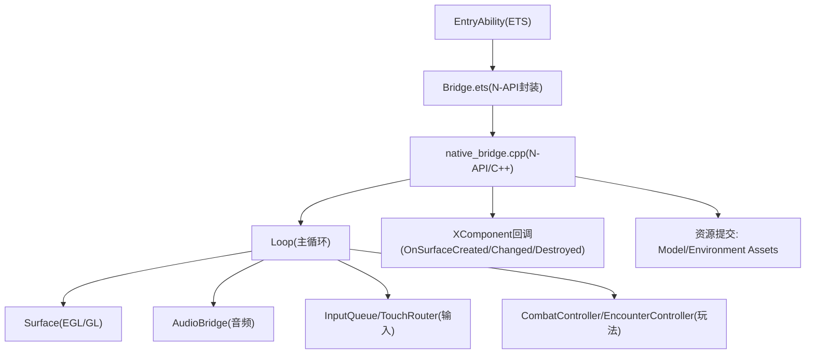
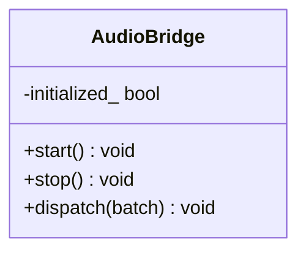
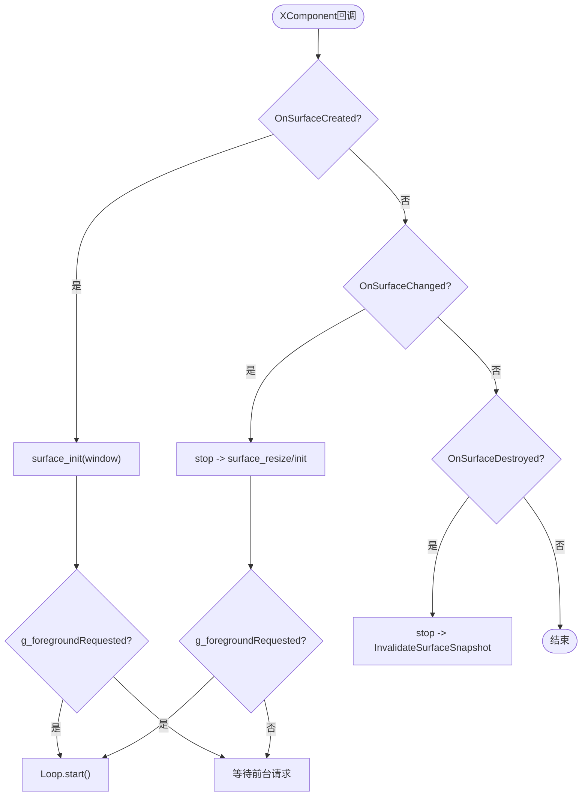
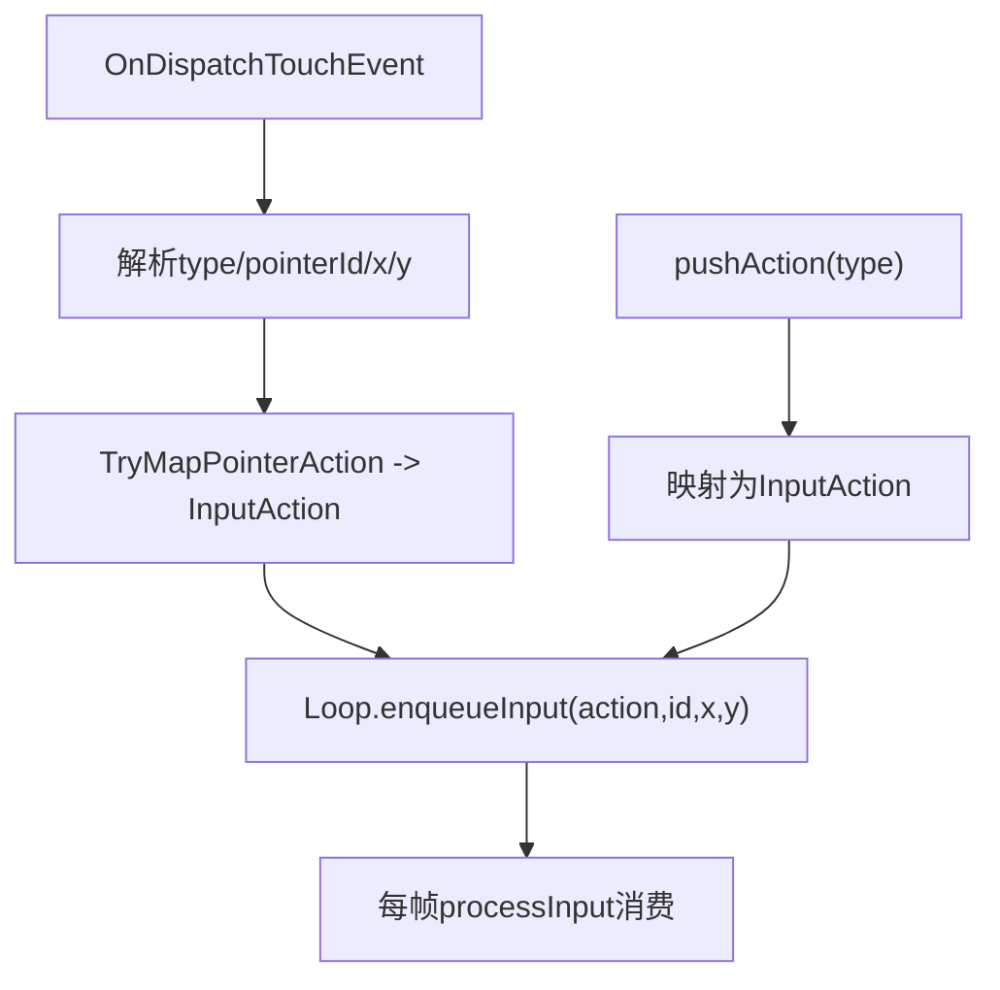
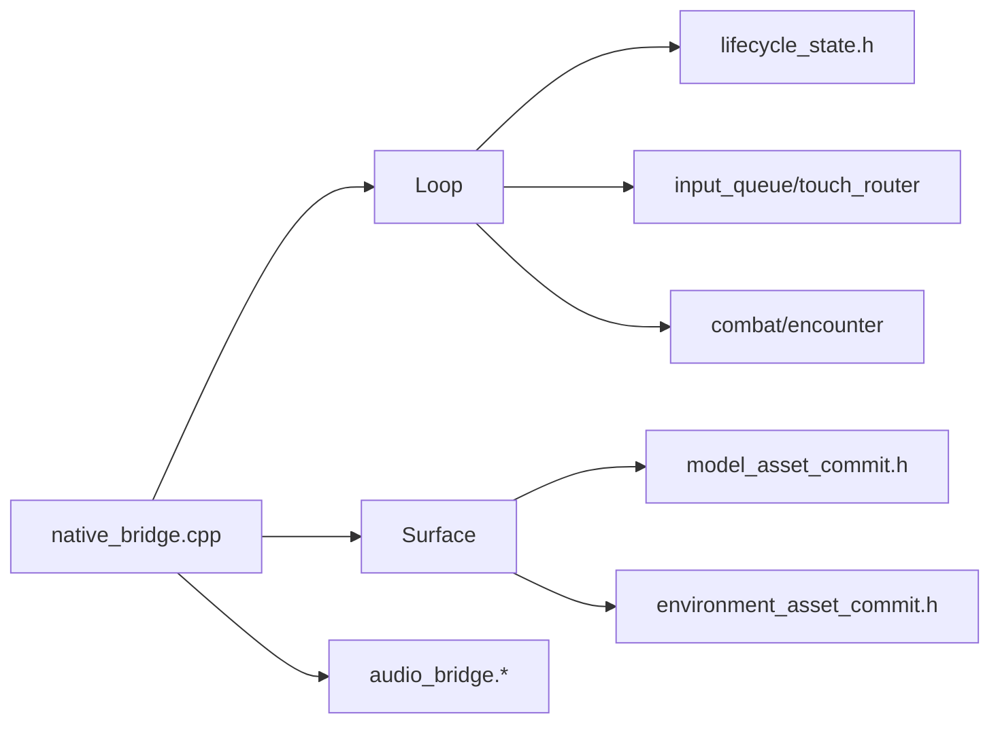

# 平台适配层设计

<cite>
**本文引用的文件**   
- [native/platform/harmony/audio_bridge.h](file://native/platform/harmony/audio_bridge.h)
- [native/platform/harmony/audio_bridge.cpp](file://native/platform/harmony/audio_bridge.cpp)
- [native/platform/harmony/audio.cpp](file://native/platform/harmony/audio.cpp)
- [native/platform/harmony/lifecycle.cpp](file://native/platform/harmony/lifecycle.cpp)
- [native/platform/harmony/environment_asset_commit.h](file://native/platform/harmony/environment_asset_commit.h)
- [native/platform/harmony/model_asset_commit.h](file://native/platform/harmony/model_asset_commit.h)
- [native/platform/harmony/fence_wait.h](file://native/platform/harmony/fence_wait.h)
- [native/platform/harmony/fence_wait.cpp](file://native/platform/harmony/fence_wait.cpp)
- [entry/src/main/cpp/native_bridge.cpp](file://entry/src/main/cpp/native_bridge.cpp)
- [entry/src/main/ets/napi/Bridge.ets](file://entry/src/main/ets/napi/Bridge.ets)
- [native/engine/core/loop.h](file://native/engine/core/loop.h)
- [native/engine/core/lifecycle_state.h](file://native/engine/core/lifecycle_state.h)
- [native/engine/render/surface.h](file://native/engine/render/surface.h)
- [tests/test_audio_bridge.cpp](file://tests/test_audio_bridge.cpp)
</cite>

## 目录
1. [简介](#简介)
2. [项目结构](#项目结构)
3. [核心组件](#核心组件)
4. [架构总览](#架构总览)
5. [详细组件分析](#详细组件分析)
6. [依赖关系分析](#依赖关系分析)
7. [性能考量](#性能考量)
8. [故障排查指南](#故障排查指南)
9. [结论](#结论)
10. [附录](#附录)

## 简介
本文件为 my-world 的 HarmonyOS 平台适配层提供系统化、可操作的架构文档。重点覆盖 native/platform/harmony 目录的职责与实现：HarmonyOS 平台特定的功能封装与 API 适配，包括音频系统集成（AudioBridge）、生命周期管理、环境/模型资源提交机制、与 HarmonyOS SDK 的集成方式与权限管理，以及跨平台兼容性、性能优化与调试支持等关键技术点。

## 项目结构
- 入口与桥接
  - entry/src/main/cpp/native_bridge.cpp：N-API 导出、XComponent 回调注册、Surface 生命周期处理、输入事件转发、资源批量提交、游戏循环控制。
  - entry/src/main/ets/napi/Bridge.ets：ETS 侧 N-API 调用封装，暴露统一 JS/TS 接口给上层 UI。
- 引擎核心
  - native/engine/core/loop.h：主循环、子系统装配、输入队列、战斗/演示控制器、VFX、性能保护、音频桥、快照存储、生命周期同步。
  - native/engine/core/lifecycle_state.h：线程安全的生命周期状态机，提供 withLifecycle 同步执行能力。
  - native/engine/render/surface.h：EGL/GL 窗口与缓冲管理、3D 渲染状态、模型与环境资产缓存与替换、环境批处理状态。
- Harmony 平台适配
  - native/platform/harmony/audio_bridge.{h,cpp}：音频播放控制、音效派发、设备不支持时静默降级。
  - native/platform/harmony/lifecycle.cpp：应用前后台监听与 Loop 启停、后台保存。
  - native/platform/harmony/environment_asset_commit.h / model_asset_commit.h：环境/模型资源“复制-生命周期锁-提交”的原子化模板。
  - native/platform/harmony/fence_wait.{h,cpp}：Fence 等待与句柄关闭，用于异步资源就绪。



**图表来源** 
- [entry/src/main/cpp/native_bridge.cpp:518-561](file://entry/src/main/cpp/native_bridge.cpp#L518-L561)
- [entry/src/main/ets/napi/Bridge.ets:77-94](file://entry/src/main/ets/napi/Bridge.ets#L77-L94)
- [native/engine/core/loop.h:26-54](file://native/engine/core/loop.h#L26-L54)
- [native/engine/render/surface.h:98-160](file://native/engine/render/surface.h#L98-L160)

**章节来源**
- [entry/src/main/cpp/native_bridge.cpp:1-120](file://entry/src/main/cpp/native_bridge.cpp#L1-L120)
- [entry/src/main/ets/napi/Bridge.ets:1-94](file://entry/src/main/ets/napi/Bridge.ets#L1-L94)
- [native/engine/core/loop.h:1-104](file://native/engine/core/loop.h#L1-L104)
- [native/engine/render/surface.h:1-252](file://native/engine/render/surface.h#L1-L252)

## 核心组件
- AudioBridge：负责在 HarmonyOS 上初始化音频渲染器、按帧派发战斗/表现事件到占位音效；在不支持 OHAudioRenderer 的设备上静默降级为无音。
- 生命周期管理：通过 XComponent 回调与系统应用状态联动，保证 Surface 创建/变更/销毁时的正确启停与保存。
- 资源提交机制：使用 CopyAndCommitModelAssets/CopyAndCommitEnvironmentAssets 模板，确保三份/四份数据全部复制成功后，进入生命周期锁并原子替换。
- 输入与事件：将触摸事件与动作指令转换为 InputAction，入队后由 Loop 消费。
- 快照与调试：pullSnapshot 暴露大量运行时指标，便于 UI 与调试。

**章节来源**
- [native/platform/harmony/audio_bridge.h:1-27](file://native/platform/harmony/audio_bridge.h#L1-L27)
- [native/platform/harmony/audio_bridge.cpp:1-46](file://native/platform/harmony/audio_bridge.cpp#L1-L46)
- [native/platform/harmony/environment_asset_commit.h:1-36](file://native/platform/harmony/environment_asset_commit.h#L1-L36)
- [native/platform/harmony/model_asset_commit.h:1-30](file://native/platform/harmony/model_asset_commit.h#L1-L30)
- [entry/src/main/cpp/native_bridge.cpp:151-210](file://entry/src/main/cpp/native_bridge.cpp#L151-L210)
- [entry/src/main/cpp/native_bridge.cpp:212-275](file://entry/src/main/cpp/native_bridge.cpp#L212-L275)
- [entry/src/main/cpp/native_bridge.cpp:360-516](file://entry/src/main/cpp/native_bridge.cpp#L360-L516)

## 架构总览
下图展示从 ETS 到原生 C++ 的调用链，以及平台适配层如何桥接 HarmonyOS SDK、渲染与游戏循环。

```mermaid
sequenceDiagram
participant UI as "UI(ETS)"
participant Bridge as "Bridge.ets"
participant Native as "native_bridge.cpp"
participant Loop as "Loop"
participant Surface as "Surface(EGL/GL)"
participant Audio as "AudioBridge"
UI->>Bridge : 调用 nativeStart()/pushInput()/startEncounter()
Bridge->>Native : N-API 调用
Native->>Loop : start()/enqueueInput()/startEncounter()
Loop->>Surface : surface_init()/surface_resize()/draw()/swap()
Loop->>Audio : dispatch(CombatEventBatch)
Note over Loop,Audio : 若设备不支持音频则静默降级
Native-->>Bridge : 返回布尔/对象快照
Bridge-->>UI : 更新UI/渲染
```

**图表来源** 
- [entry/src/main/ets/napi/Bridge.ets:77-94](file://entry/src/main/ets/napi/Bridge.ets#L77-L94)
- [entry/src/main/cpp/native_bridge.cpp:130-149](file://entry/src/main/cpp/native_bridge.cpp#L130-L149)
- [entry/src/main/cpp/native_bridge.cpp:212-275](file://entry/src/main/cpp/native_bridge.cpp#L212-L275)
- [entry/src/main/cpp/native_bridge.cpp:277-298](file://entry/src/main/cpp/native_bridge.cpp#L277-L298)
- [native/engine/core/loop.h:69-103](file://native/engine/core/loop.h#L69-L103)
- [native/engine/render/surface.h:247-252](file://native/engine/render/surface.h#L247-L252)
- [native/platform/harmony/audio_bridge.cpp:26-45](file://native/platform/harmony/audio_bridge.cpp#L26-L45)

## 详细组件分析

### AudioBridge 音频系统集成
- 职责
  - start/stop：初始化或释放音频渲染器；在不支持的平台路径下标记未初始化，后续操作退化为空操作。
  - dispatch：根据 CombatEventBatch 中的 Gameplay/Presentation 事件类型映射到占位音效（程序化 PCM 合成），避免携带音频资源。
- 关键行为
  - 非 OHOS_PLATFORM 分支直接不初始化，保证跨平台编译可用。
  - 测试用例覆盖空批次、含事件批次、多次派发与 start/stop 顺序，确保无崩溃。
- 扩展建议
  - 接入 OHAudioRenderer 时，按 16-bit PCM 44100Hz 配置流式写入。
  - 增加音量管理与音效效果（混响、延迟）可通过同一通道注入参数。



**图表来源** 
- [native/platform/harmony/audio_bridge.h:7-26](file://native/platform/harmony/audio_bridge.h#L7-L26)
- [native/platform/harmony/audio_bridge.cpp:7-24](file://native/platform/harmony/audio_bridge.cpp#L7-L24)
- [native/platform/harmony/audio_bridge.cpp:26-45](file://native/platform/harmony/audio_bridge.cpp#L26-L45)

**章节来源**
- [native/platform/harmony/audio_bridge.h:1-27](file://native/platform/harmony/audio_bridge.h#L1-L27)
- [native/platform/harmony/audio_bridge.cpp:1-46](file://native/platform/harmony/audio_bridge.cpp#L1-L46)
- [tests/test_audio_bridge.cpp:1-55](file://tests/test_audio_bridge.cpp#L1-L55)

### 生命周期管理与平台特定实现
- XComponent 回调
  - OnSurfaceCreated：首次创建时初始化 Surface，必要时停止旧循环并发布渲染器停止信号。
  - OnSurfaceChanged：尺寸变化时 stop -> init/resize -> 前台时 restart。
  - OnSurfaceDestroyed：stop 并清理 Surface。
- 前台/后台策略
  - g_foregroundRequested 标志位协调 nativeStart/nativeStop 与页面加载时序。
  - lifecycle.cpp 预留了应用前后台监听、暂停时 Loop::stop、恢复时 Loop::start、后台 Save::write 的钩子。
- 生命周期同步
  - Loop::withLifecycle 基于 LifecycleState 的递归互斥锁，保证所有涉及窗口/渲染的操作串行化。



**图表来源** 
- [entry/src/main/cpp/native_bridge.cpp:59-111](file://entry/src/main/cpp/native_bridge.cpp#L59-L111)
- [entry/src/main/cpp/native_bridge.cpp:130-149](file://entry/src/main/cpp/native_bridge.cpp#L130-L149)
- [native/engine/core/lifecycle_state.h:8-37](file://native/engine/core/lifecycle_state.h#L8-L37)

**章节来源**
- [entry/src/main/cpp/native_bridge.cpp:59-111](file://entry/src/main/cpp/native_bridge.cpp#L59-L111)
- [entry/src/main/cpp/native_bridge.cpp:130-149](file://entry/src/main/cpp/native_bridge.cpp#L130-L149)
- [native/platform/harmony/lifecycle.cpp:1-5](file://native/platform/harmony/lifecycle.cpp#L1-L5)
- [native/engine/core/lifecycle_state.h:1-51](file://native/engine/core/lifecycle_state.h#L1-L51)

### 环境资源与模型资源的提交机制
- 模板抽象
  - CopyAndCommitModelAssets：复制 Player/Enemy/Boss 三块字节数组，成功后进入 withLifecycle 并原子替换。
  - CopyAndCommitEnvironmentAssets：复制 OuterRing/CenterRift/Backdrop/Decoration 四块字节数组，成功后进入 withLifecycle 并原子替换。
- 桥接实现
  - nativeSetModelAssets / nativeSetEnvironmentAssets：解析 N-API ArrayBuffer，调用模板函数完成复制-锁定-提交。
- 渲染层缓存
  - Surface 中 PendingModelAsset 与 environmentAssets 暂存 CPU 数据，当前 GL context 下解析/上传/替换，避免跨线程访问。

```mermaid
sequenceDiagram
participant ETS as "Bridge.ets"
participant NAPI as "native_bridge.cpp"
participant Tpl as "CopyAndCommit*"
participant Loop as "Loop.withLifecycle"
participant Surf as "Surface"
ETS->>NAPI : nativeSetModelAssets(player, enemy, boss)
NAPI->>Tpl : CopyArrayBuffer x3
Tpl->>Loop : withLifecycle(commit)
Loop->>Surf : setModelAsset(kind, bytes)
Note over Surf : 仅保存CPU数据并标记脏
Surf-->>NAPI : 提交成功
NAPI-->>ETS : true/false
```

**图表来源** 
- [native/platform/harmony/model_asset_commit.h:15-29](file://native/platform/harmony/model_asset_commit.h#L15-L29)
- [native/platform/harmony/environment_asset_commit.h:18-35](file://native/platform/harmony/environment_asset_commit.h#L18-L35)
- [entry/src/main/cpp/native_bridge.cpp:151-210](file://entry/src/main/cpp/native_bridge.cpp#L151-L210)
- [native/engine/render/surface.h:217-239](file://native/engine/render/surface.h#L217-L239)

**章节来源**
- [native/platform/harmony/model_asset_commit.h:1-30](file://native/platform/harmony/model_asset_commit.h#L1-L30)
- [native/platform/harmony/environment_asset_commit.h:1-36](file://native/platform/harmony/environment_asset_commit.h#L1-L36)
- [entry/src/main/cpp/native_bridge.cpp:151-210](file://entry/src/main/cpp/native_bridge.cpp#L151-L210)
- [native/engine/render/surface.h:217-239](file://native/engine/render/surface.h#L217-L239)

### 输入系统与事件分发
- 触摸事件：OnDispatchTouchEvent 获取坐标与指针ID，转换为 InputAction 并通过 ForwardChangedPointer 入队。
- 动作指令：pushAction 将数字类型映射为 Attack/Dodge/Radiance/Current/Corruption/Ultimate，入队时 pointerId=-1。
- 输入队列：Loop.enqueueInput 维护序列号与计数，供每帧 processInput 消费。



**图表来源** 
- [entry/src/main/cpp/native_bridge.cpp:113-128](file://entry/src/main/cpp/native_bridge.cpp#L113-L128)
- [entry/src/main/cpp/native_bridge.cpp:252-275](file://entry/src/main/cpp/native_bridge.cpp#L252-L275)
- [native/engine/core/loop.h:88-95](file://native/engine/core/loop.h#L88-L95)

**章节来源**
- [entry/src/main/cpp/native_bridge.cpp:113-128](file://entry/src/main/cpp/native_bridge.cpp#L113-L128)
- [entry/src/main/cpp/native_bridge.cpp:252-275](file://entry/src/main/cpp/native_bridge.cpp#L252-L275)
- [native/engine/core/loop.h:88-95](file://native/engine/core/loop.h#L88-L95)

### 与 HarmonyOS SDK 的集成与权限管理
- XComponent 集成：native_bridge.cpp 注册 OnSurfaceCreated/Changed/Destroyed、DispatchTouchEvent 回调，绑定 OH_NativeXComponent。
- EGL/GL 窗口：surface_init/resize/draw/swap 封装 OHNativeWindow/OH_NativeBuffer 与 EGL 上下文。
- 权限说明：当前代码未显式申请媒体/音频相关权限；如需启用真实音频输出，需在 module.json5 中声明必要权限并在运行时按需申请。

**章节来源**
- [entry/src/main/cpp/native_bridge.cpp:518-561](file://entry/src/main/cpp/native_bridge.cpp#L518-L561)
- [native/engine/render/surface.h:1-20](file://native/engine/render/surface.h#L1-L20)

### Fence 等待与异步资源就绪
- waitAndCloseFence：对非负 fd 进行 poll 等待，兼容 EINTR/EAGAIN，结束后始终 close(fd)，返回是否就绪。
- 用途：在图形/音频管线中等待生产者 fence 信号，确保资源安全切换。

**章节来源**
- [native/platform/harmony/fence_wait.h:1-5](file://native/platform/harmony/fence_wait.h#L1-L5)
- [native/platform/harmony/fence_wait.cpp:1-23](file://native/platform/harmony/fence_wait.cpp#L1-L23)

## 依赖关系分析
- 模块耦合
  - native_bridge.cpp 依赖 Loop、Surface、model/environment asset commit 模板与 N-API/XComponent。
  - Loop 聚合 AudioBridge、InputQueue、Camera、Combat/Encounter、VFX、PerformanceGuard、SnapshotStore、LifecycleState。
  - Surface 持有 3D 渲染状态与资产缓存，受 modelAssetMutex 保护。
- 外部依赖
  - N-API、OH_NativeXComponent、EGL/GLES3、poll/close。
- 潜在环依赖
  - 渲染层与逻辑层通过 Snapshot/RenderState 单向传递，头文件依赖方向清晰。



**图表来源** 
- [entry/src/main/cpp/native_bridge.cpp:1-15](file://entry/src/main/cpp/native_bridge.cpp#L1-L15)
- [native/engine/core/loop.h:1-25](file://native/engine/core/loop.h#L1-L25)
- [native/engine/render/surface.h:1-41](file://native/engine/render/surface.h#L1-L41)
- [native/platform/harmony/model_asset_commit.h:1-14](file://native/platform/harmony/model_asset_commit.h#L1-L14)
- [native/platform/harmony/environment_asset_commit.h:1-16](file://native/platform/harmony/environment_asset_commit.h#L1-L16)

**章节来源**
- [entry/src/main/cpp/native_bridge.cpp:1-120](file://entry/src/main/cpp/native_bridge.cpp#L1-L120)
- [native/engine/core/loop.h:1-54](file://native/engine/core/loop.h#L1-L54)
- [native/engine/render/surface.h:1-100](file://native/engine/render/surface.h#L1-L100)

## 性能考量
- 渲染路径
  - Surface 仅在 GL context 下解析/上传模型与环境资产，避免跨线程开销。
  - 环境批处理状态 EnvironmentBatchStatus 控制回退绘制，减少无效 draw call。
- 输入与事件
  - 输入事件批量入队，帧内集中处理，降低锁竞争。
- 音频
  - 当前为占位音效，未来接入 OHAudioRenderer 时应采用环形缓冲与低延迟配置。
- 生命周期
  - withLifecycle 串行化窗口/渲染操作，避免竞态导致的重绘/崩溃。

[本节为通用指导，不直接分析具体文件]

## 故障排查指南
- 音频无输出
  - 检查 initialized_ 是否为真；确认 OHOS_PLATFORM 分支已实现 OHAudioRenderer 初始化。
  - 参考测试用例验证 dispatch 不会崩溃。
- 黑屏/无渲染
  - 检查 OnSurfaceCreated/Changed 是否成功 surface_init/resize；查看 InvalidateSurfaceSnapshot 是否被触发。
  - 确认 g_foregroundRequested 与 nativeStart/nativeStop 的调用时机。
- 资源未更新
  - 确认 CopyAndCommit* 模板返回 true；检查 Surface 中对应 slot 的状态是否为 Ready。
- 输入无效
  - 校验 pushInput/pushAction 的参数范围与类型；查看 inputEventCount_ 增长情况。

**章节来源**
- [native/platform/harmony/audio_bridge.cpp:7-24](file://native/platform/harmony/audio_bridge.cpp#L7-L24)
- [tests/test_audio_bridge.cpp:1-55](file://tests/test_audio_bridge.cpp#L1-L55)
- [entry/src/main/cpp/native_bridge.cpp:59-111](file://entry/src/main/cpp/native_bridge.cpp#L59-L111)
- [entry/src/main/cpp/native_bridge.cpp:151-210](file://entry/src/main/cpp/native_bridge.cpp#L151-L210)
- [entry/src/main/cpp/native_bridge.cpp:212-275](file://entry/src/main/cpp/native_bridge.cpp#L212-L275)

## 结论
本适配层以清晰的边界与模板化抽象实现了 HarmonyOS 平台的音频、生命周期、资源提交与输入事件桥接。通过 withLifecycle 保障并发安全，通过 CopyAndCommit* 模板确保资源更新的原子性，结合 Surface 的 GPU 上下文约束，形成稳定高效的运行路径。后续可在不破坏现有契约的前提下扩展音频效果、权限管理与性能监控。

[本节为总结性内容，不直接分析具体文件]

## 附录
- 关键 API 对照（ETS → N-API → C++）
  - nativeStart/nativeStop/nativeStartIfForeground：启动/停止/条件启动游戏循环。
  - nativeSetModelAssets/nativeSetEnvironmentAssets：批量设置模型与环境资源。
  - pushInput/pushAction：输入与动作事件入队。
  - startEncounter/advanceLevel/useSupply/retryBoss/toggleDebugHud/skipDemoPhase：玩法控制与调试。
  - pullSnapshot：拉取运行时快照。

**章节来源**
- [entry/src/main/ets/napi/Bridge.ets:77-94](file://entry/src/main/ets/napi/Bridge.ets#L77-L94)
- [entry/src/main/cpp/native_bridge.cpp:130-149](file://entry/src/main/cpp/native_bridge.cpp#L130-L149)
- [entry/src/main/cpp/native_bridge.cpp:151-210](file://entry/src/main/cpp/native_bridge.cpp#L151-L210)
- [entry/src/main/cpp/native_bridge.cpp:212-275](file://entry/src/main/cpp/native_bridge.cpp#L212-L275)
- [entry/src/main/cpp/native_bridge.cpp:277-358](file://entry/src/main/cpp/native_bridge.cpp#L277-L358)
- [entry/src/main/cpp/native_bridge.cpp:360-516](file://entry/src/main/cpp/native_bridge.cpp#L360-L516)