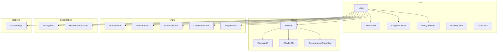
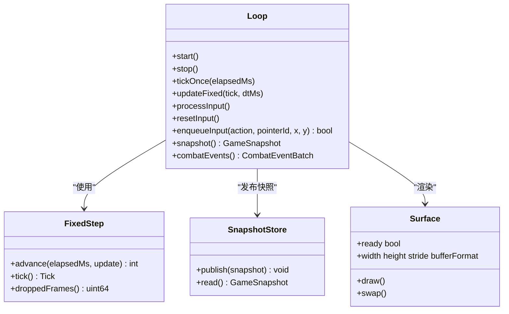
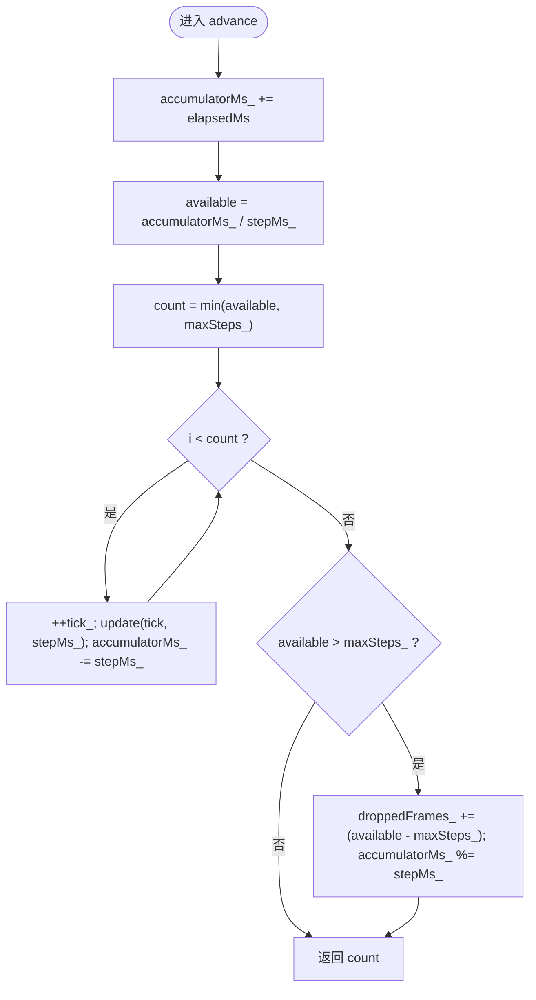
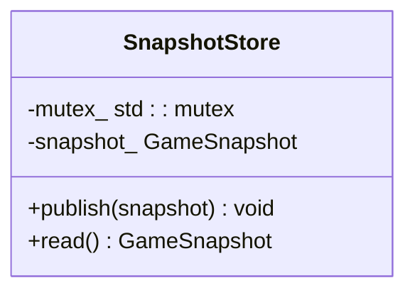
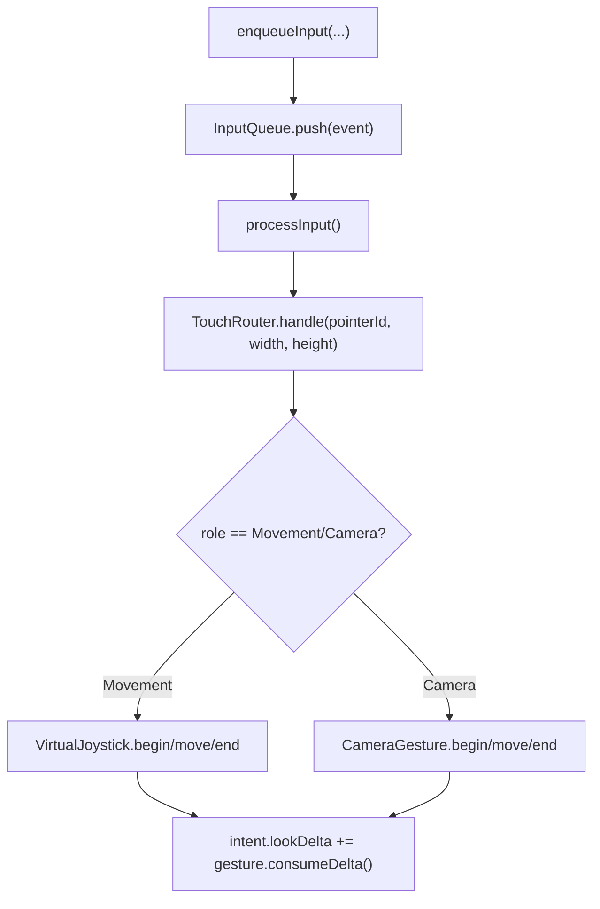
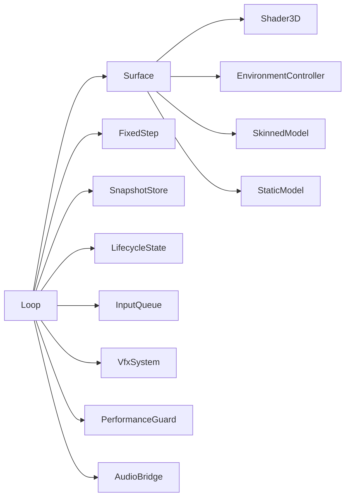

# 引擎层设计

<cite>
**本文引用的文件**   
- [loop.h](file://native/engine/core/loop.h)
- [loop.cpp](file://native/engine/core/loop.cpp)
- [surface.h](file://native/engine/render/surface.h)
- [surface.cpp](file://native/engine/render/surface.cpp)
- [fixed_step.h](file://native/engine/core/fixed_step.h)
- [snapshot_store.h](file://native/engine/core/snapshot_store.h)
- [tick_clock.h](file://native/engine/core/tick_clock.h)
- [lifecycle_state.h](file://native/engine/core/lifecycle_state.h)
- [event_queue.h](file://native/engine/core/event_queue.h)
- [input_queue.h](file://native/engine/input/input_queue.h)
- [test_loop_integration.cpp](file://tests/test_loop_integration.cpp)
- [test_fixed_step.cpp](file://tests/test_fixed_step.cpp)
- [test_snapshot_store.cpp](file://tests/test_snapshot_store.cpp)
</cite>

## 目录
1. [简介](#简介)
2. [项目结构](#项目结构)
3. [核心组件](#核心组件)
4. [架构总览](#架构总览)
5. [详细组件分析](#详细组件分析)
6. [依赖关系分析](#依赖关系分析)
7. [性能考量](#性能考量)
8. [故障排查指南](#故障排查指南)
9. [结论](#结论)
10. [附录：关键流程示例路径](#附录关键流程示例路径)

## 简介
本文件为 my-world 的引擎层（native/engine）提供系统化、可追溯的架构文档。重点覆盖以下职责与机制：
- 游戏循环管理：Loop 类作为协调器，负责固定时间步长推进、帧率控制、生命周期管理与子系统调度。
- 渲染上下文控制：Surface 类封装 OpenGL ES/EGL 窗口创建、渲染缓冲与图形状态维护，并提供 2D/3D 渲染管线入口。
- 输入处理基础设施：InputQueue、TouchRouter、VirtualJoystick、CameraGesture 等构成统一的输入抽象与路由。
- 资源管理：模型与环境的异步加载、GPU 资源替换、回退几何与性能分级。
- 物理更新与状态同步：FixedStep 固定步长算法保证确定性；SnapshotStore 提供线程安全的快照发布/读取。

## 项目结构
native/engine 目录按职责分层组织：
- core：引擎核心（循环、固定步长、生命周期、事件队列、快照存储）
- render：渲染与图形上下文（Surface、相机、着色器、网格、材质、环境控制器）
- input：输入系统（事件队列、触摸路由、虚拟摇杆、相机手势、玩家意图）
- presentation：表现层（VFX、性能守卫、视觉令牌）
- platform/harmony：平台桥接（音频、生命周期、栅栏等待）
- gameplay：玩法逻辑（AI、战斗、实体、流程导演）



图表来源
- [loop.h:26-67](file://native/engine/core/loop.h#L26-L67)
- [surface.h:98-182](file://native/engine/render/surface.h#L98-L182)

章节来源
- [loop.h:26-67](file://native/engine/core/loop.h#L26-L67)
- [surface.h:98-182](file://native/engine/render/surface.h#L98-L182)

## 核心组件
- Loop：引擎协调器，组合 Surface、输入、相机、战斗、遭遇战、演示导演、VFX、性能守卫、音频桥接，驱动主循环并输出 GameSnapshot。
- FixedStep：固定时间步长推进器，确保物理/逻辑以恒定 dt 步进，支持最大步数限制与掉帧统计。
- SnapshotStore：线程安全的状态快照容器，publish/read 互斥保护。
- LifecycleState：递归锁保护的运行态开关，避免重复 start/stop。
- InputQueue：线程安全的事件队列，记录丢包计数。
- Surface：EGL/GL 上下文、窗口、缓冲、2D/3D 绘制、模型与环境资源管理、VFX 标志位传递。

章节来源
- [loop.h:26-67](file://native/engine/core/loop.h#L26-L67)
- [fixed_step.h:8-48](file://native/engine/core/fixed_step.h#L8-L48)
- [snapshot_store.h:5-21](file://native/engine/core/snapshot_store.h#L5-L21)
- [lifecycle_state.h:6-37](file://native/engine/core/lifecycle_state.h#L6-L37)
- [input_queue.h:8-46](file://native/engine/input/input_queue.h#L8-L46)
- [surface.h:98-182](file://native/engine/render/surface.h#L98-L182)

## 架构总览
下图展示引擎主循环与渲染管线的交互关系，以及数据流向。

```mermaid
sequenceDiagram
participant App as "应用/平台"
participant Loop as "Loop"
participant FS as "FixedStep"
participant Input as "InputQueue/TouchRouter/VirtualJoystick/CameraGesture"
participant Combat as "CombatController/EncounterController"
participant VFX as "VfxSystem/AudioBridge"
participant Render as "Surface(surface_draw/surface_swap)"
participant Store as "SnapshotStore"
App->>Loop : start()
Loop->>Loop : lifecycle.start()
Loop->>Loop : runner 线程启动
loop 每帧
Loop->>Loop : tickOnce(elapsedMs)
Loop->>Input : processInput()
Loop->>FS : advance(elapsedMs, updateFixed)
FS-->>Loop : 调用 updateFixed(tick, dtMs)
Loop->>Combat : encounter.update()/combat.enqueue()
Loop->>VFX : consume/events/update/dispatch
Loop->>Render : surface_draw()/surface_swap()
Loop->>Store : publish(GameSnapshot)
end
App->>Loop : stop()
Loop->>Loop : lifecycle.stop()/join thread
```

图表来源
- [loop.cpp:131-174](file://native/engine/core/loop.cpp#L131-L174)
- [loop.cpp:311-417](file://native/engine/core/loop.cpp#L311-L417)
- [loop.cpp:419-598](file://native/engine/core/loop.cpp#L419-L598)
- [surface.cpp:606-718](file://native/engine/render/surface.cpp#L606-L718)

## 详细组件分析

### Loop 类：引擎协调器与主循环
- 职责
  - 初始化各子系统（Surface、Input、Camera、Combat、Encounter、DemoDirector、VFX、PerformanceGuard、AudioBridge）。
  - 启动独立线程执行主循环，使用 FixedStep 推进逻辑，调用 Surface 进行绘制与交换缓冲。
  - 将运行时状态汇总为 GameSnapshot 并通过 SnapshotStore 发布。
- 固定时间步长与帧率控制
  - FixedStep(stepMs=16, maxSteps=4) 保证每帧最多 4 次步进，防止卡顿累积。
  - 主循环 sleep 约 16ms 目标 ~60fps，tickOnce 内累计 elapsedMs 并交给 FixedStep 推进。
- 生命周期管理
  - 通过 LifecycleState 的 synchronized/start/stop 保证并发安全，避免重复启动或非法停止。
- 输入处理
  - enqueueInput 入队，processInput 解析 TouchRole，驱动 VirtualJoystick 与 CameraGesture，生成 PlayerIntent。
- 渲染与状态同步
  - 在 OHOS_PLATFORM 下调用 surface_draw/surface_swap，更新 3D 相机与环境性能等级。
  - 合并 combat/encounter/vfx/audio 事件，排序后发布到 SnapshotStore。
- 关键方法
  - start/stop：生命周期与线程管理。
  - tickOnce：单帧调度，包含输入、固定步长推进、渲染、快照发布。
  - updateFixed：具体逻辑更新（相机、玩家移动、粒子、软锁定、战斗、演示、VFX、音频、动画状态）。



图表来源
- [loop.h:26-103](file://native/engine/core/loop.h#L26-L103)
- [fixed_step.h:8-48](file://native/engine/core/fixed_step.h#L8-L48)
- [snapshot_store.h:5-21](file://native/engine/core/snapshot_store.h#L5-L21)
- [surface.h:98-182](file://native/engine/render/surface.h#L98-L182)

章节来源
- [loop.h:26-103](file://native/engine/core/loop.h#L26-L103)
- [loop.cpp:131-174](file://native/engine/core/loop.cpp#L131-L174)
- [loop.cpp:311-417](file://native/engine/core/loop.cpp#L311-L417)
- [loop.cpp:419-598](file://native/engine/core/loop.cpp#L419-L598)

### FixedStep：固定时间步长算法
- 设计要点
  - 累加器 accumulatorMs_ 累积时间，按 stepMs_ 计算可用步数，上限 maxSteps_。
  - 若可用步数超过上限，记录 droppedFrames_ 并取模保留余量，避免溢出。
  - 每次步进递增 tick_，回调中传入 tick 与固定 dtMs。
- 复杂度
  - 每帧 O(k)，k=min(available, maxSteps_)，常数级开销。
- 健壮性
  - 对负值/零步长/极大值边界有断言与保护，测试覆盖溢出与丢弃统计。



图表来源
- [fixed_step.h:16-37](file://native/engine/core/fixed_step.h#L16-L37)

章节来源
- [fixed_step.h:8-48](file://native/engine/core/fixed_step.h#L8-L48)
- [test_fixed_step.cpp:26-68](file://tests/test_fixed_step.cpp#L26-L68)

### SnapshotStore：状态同步策略
- 设计要点
  - 读写均持互斥锁，保证多线程访问一致性。
  - publish 原子替换 snapshot_，read 返回副本。
- 使用场景
  - Loop 每帧 publish GameSnapshot，UI/调试/录制等消费者 read。



图表来源
- [snapshot_store.h:5-21](file://native/engine/core/snapshot_store.h#L5-L21)

章节来源
- [snapshot_store.h:5-21](file://native/engine/core/snapshot_store.h#L5-L21)
- [test_snapshot_store.cpp:1-53](file://tests/test_snapshot_store.cpp#L1-L53)

### Surface：OpenGL ES 渲染上下文与管线
- 职责
  - EGL 显示/表面/上下文创建与管理，GL 程序编译链接，属性位置缓存。
  - 2D 绘制（天空渐变、网格、粒子、玩家、训练假人、VFX 叠加）。
  - 3D 阶段（M3-1）：Camera3D 投影/视图矩阵、地面/环境批渲染、角色/敌人/首领蒙皮或回退 Mesh、Boss 电影化几何。
  - 资源管理：PendingModelAsset 异步字节流，current GL context 下解析/上传/替换/销毁；EnvironmentController 评估性能等级与纹理层级。
- 关键流程
  - surface_init：创建 EGL/GL 程序与属性位置。
  - surface_resize：窗口尺寸变化时更新缓冲/像素格式。
  - surface_draw：2D 阶段 + 3D 阶段（深度测试、剔除、环境批、Actor 绘制、Boss 电影化）。
  - surface_swap：交换前后缓冲。
  - surface_destroy：释放资源。
- 性能与降级
  - 当 GL 不可用时回退软件光栅化（Canvas），用于模拟器调试。
  - 环境资源未就绪时使用 fallback 几何（柱子/墙体/裂隙平面）。
  - 纹理层级根据 PerformanceGuard.level() 动态切换。

```mermaid
sequenceDiagram
participant Loop as "Loop"
participant Surface as "Surface"
participant GL as "OpenGL ES"
participant Env as "EnvironmentController"
Loop->>Surface : surface_draw()
Surface->>Surface : tryInitializePendingModelAssets()
Surface->>Surface : tryInitializePendingEnvironmentAssets()
Surface->>GL : glClear(GL_DEPTH_BUFFER_BIT)/enable depth test
Surface->>Env : evaluate(playerPos, perfLevel) -> plan
Surface->>GL : draw ground/environment models/fallbacks
Surface->>GL : draw actors (player/enemy/boss) with skinning or fallback
Surface->>GL : draw boss cinematic geometry
Surface->>GL : disable cull/depth
Loop->>Surface : surface_swap()
```

图表来源
- [surface.cpp:606-718](file://native/engine/render/surface.cpp#L606-L718)
- [surface.cpp:499-533](file://native/engine/render/surface.cpp#L499-L533)
- [surface.cpp:721-800](file://native/engine/render/surface.cpp#L721-L800)

章节来源
- [surface.h:98-182](file://native/engine/render/surface.h#L98-L182)
- [surface.cpp:22-139](file://native/engine/render/surface.cpp#L22-L139)
- [surface.cpp:606-718](file://native/engine/render/surface.cpp#L606-L718)
- [surface.cpp:721-800](file://native/engine/render/surface.cpp#L721-L800)

### 输入处理基础设施
- InputQueue：线程安全队列，push/pop/clear，记录 dropped_ 计数。
- TouchRouter：指针到角色的映射，区分 Movement/Camera 角色。
- VirtualJoystick：基于指针移动生成 move 向量。
- CameraGesture：基于指针移动生成 lookDelta。
- PlayerIntent：聚合 move、lookDelta、actions 供 updateFixed 消费。



图表来源
- [loop.h:88-95](file://native/engine/core/loop.h#L88-L95)
- [loop.cpp:240-292](file://native/engine/core/loop.cpp#L240-L292)
- [input_queue.h:8-46](file://native/engine/input/input_queue.h#L8-L46)

章节来源
- [loop.h:88-95](file://native/engine/core/loop.h#L88-L95)
- [loop.cpp:240-292](file://native/engine/core/loop.cpp#L240-L292)
- [input_queue.h:8-46](file://native/engine/input/input_queue.h#L8-L46)

## 依赖关系分析
- Loop 强耦合于 Surface、FixedStep、SnapshotStore、LifecycleState、InputQueue、VfxSystem、PerformanceGuard、AudioBridge、Combat/Encounter/DemoDirector。
- Surface 依赖 GL/EGL、GLM、Mesh/Shader3D/SkinnedModel/StaticModel、EnvironmentController、AssetProfile。
- FixedStep 依赖 TickClock 类型定义。
- SnapshotStore/LifecycleState/InputQueue/EventQueue 提供基础并发原语。



图表来源
- [loop.h:26-67](file://native/engine/core/loop.h#L26-L67)
- [surface.h:98-182](file://native/engine/render/surface.h#L98-L182)

章节来源
- [loop.h:26-67](file://native/engine/core/loop.h#L26-L67)
- [surface.h:98-182](file://native/engine/render/surface.h#L98-L182)

## 性能考量
- 固定步长上限：maxSteps_=4 防止卡顿雪崩，同时 droppedFrames_ 可用于诊断。
- FPS 统计：每秒重置计数器，输出 fps、perf_level、environmentReady、drawCalls、triangles、encounterMode。
- 资源异步加载：PendingModelAsset 仅在 current GL context 下解析/替换，避免跨线程 GPU 调用。
- 环境性能分级：PerformanceGuard.level() 影响 textureTier 与是否绘制 backdrop/decoration。
- 回退几何：当外部资产未就绪时，使用 fallbackPillar/Wall/RiftPlane 保障渲染连续性。
- 软件光栅化：无 GL 时回退 Canvas，便于模拟器调试。

章节来源
- [loop.cpp:340-354](file://native/engine/core/loop.cpp#L340-L354)
- [surface.cpp:606-718](file://native/engine/render/surface.cpp#L606-L718)
- [surface.cpp:721-800](file://native/engine/render/surface.cpp#L721-L800)

## 故障排查指南
- 渲染未就绪
  - 检查 surface.ready 与 environmentReady；若 false，确认 EGL/GL 初始化成功与资产加载状态。
- 输入丢失
  - 查看 InputQueue.droppedCount()；增大容量或优化消费频率。
- 卡顿与掉帧
  - 观察 FixedStep.droppedFrames() 与 FPS；降低每帧任务或提高 maxSteps_ 上限需谨慎。
- 崩溃与异常
  - GL 着色器编译失败会打印日志；检查 shader 版本兼容性与错误信息。
  - 生命周期重复 start/stop 会被拒绝，需检查调用时序。

章节来源
- [loop.cpp:311-354](file://native/engine/core/loop.cpp#L311-L354)
- [surface.cpp:22-139](file://native/engine/render/surface.cpp#L22-L139)
- [lifecycle_state.h:14-32](file://native/engine/core/lifecycle_state.h#L14-L32)

## 结论
my-world 引擎层以 Loop 为核心协调器，结合 FixedStep 的确定性步进、SnapshotStore 的线程安全状态分发、Surface 的完整渲染上下文管理，构建了稳定高效的 2D/3D 混合渲染与输入处理体系。通过性能分级与资源异步加载，系统在移动端具备良好鲁棒性与可扩展性。

## 附录：关键流程示例路径
- 引擎初始化与主循环启动
  - [loop.cpp:131-174](file://native/engine/core/loop.cpp#L131-L174)
- 单帧调度与固定步长推进
  - [loop.cpp:311-417](file://native/engine/core/loop.cpp#L311-L417)
- 逻辑更新与状态发布
  - [loop.cpp:419-598](file://native/engine/core/loop.cpp#L419-L598)
- 3D 渲染阶段与环境批渲染
  - [surface.cpp:606-718](file://native/engine/render/surface.cpp#L606-L718)
- 资源异步加载与替换
  - [surface.cpp:499-533](file://native/engine/render/surface.cpp#L499-L533)
- 软件光栅化回退
  - [surface.cpp:721-800](file://native/engine/render/surface.cpp#L721-L800)
- 固定步长算法验证
  - [test_fixed_step.cpp:26-68](file://tests/test_fixed_step.cpp#L26-L68)
- 快照并发读写验证
  - [test_snapshot_store.cpp:1-53](file://tests/test_snapshot_store.cpp#L1-L53)
- 集成测试（输入/相机/战斗/目标选择）
  - [test_loop_integration.cpp:1-200](file://tests/test_loop_integration.cpp#L1-L200)