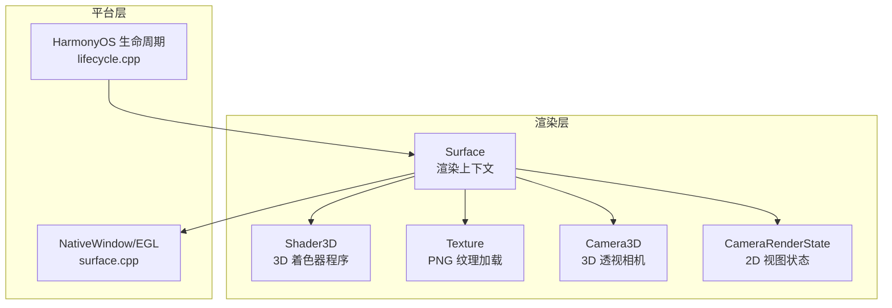
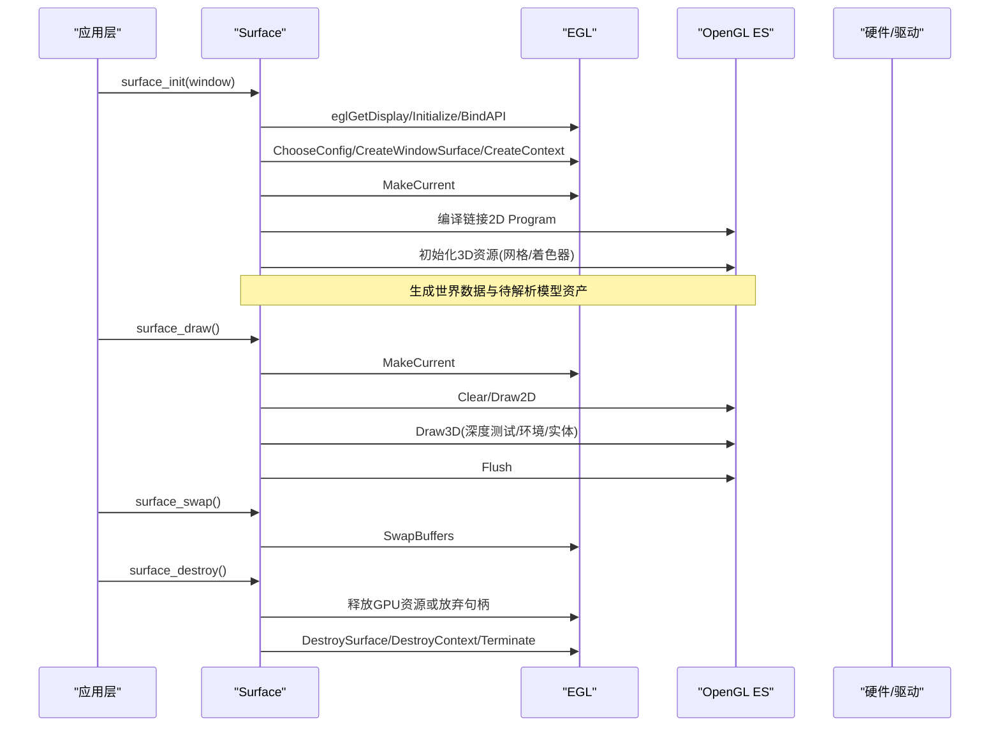
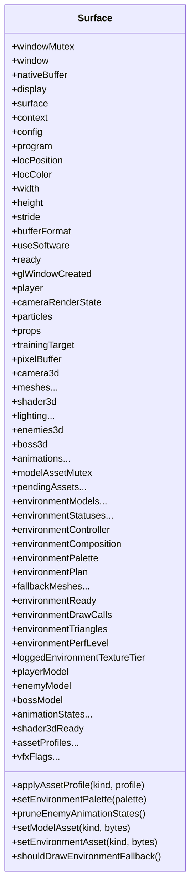
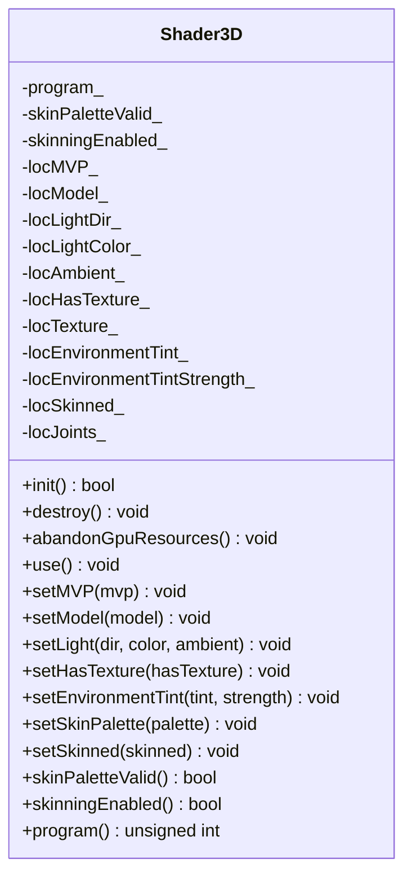
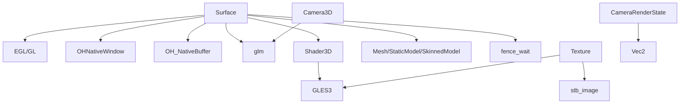

# 渲染上下文管理

<cite>
**本文引用的文件**   
- [surface.h](file://native/engine/render/surface.h)
- [surface.cpp](file://native/engine/render/surface.cpp)
- [shader_3d.h](file://native/engine/render/shader_3d.h)
- [shader_3d.cpp](file://native/engine/render/shader_3d.cpp)
- [texture.h](file://native/engine/render/texture.h)
- [texture.cpp](file://native/engine/render/texture.cpp)
- [camera3d.h](file://native/engine/render/camera3d.h)
- [camera3d.cpp](file://native/engine/render/camera3d.cpp)
- [camera_render_state.h](file://native/engine/render/camera_render_state.h)
- [render_lifecycle.h](file://native/engine/render/render_lifecycle.h)
- [lifecycle.cpp](file://native/platform/harmony/lifecycle.cpp)
</cite>

## 目录
1. [简介](#简介)
2. [项目结构](#项目结构)
3. [核心组件](#核心组件)
4. [架构总览](#架构总览)
5. [详细组件分析](#详细组件分析)
6. [依赖关系分析](#依赖关系分析)
7. [性能考量](#性能考量)
8. [故障排查指南](#故障排查指南)
9. [结论](#结论)
10. [附录：关键流程与示例路径](#附录关键流程与示例路径)

## 简介
本技术文档聚焦 my-world 的渲染上下文管理系统，围绕 Surface 类的 OpenGL ES 渲染上下文管理展开，涵盖窗口创建、渲染缓冲管理与图形状态维护。同时记录 HarmonyOS 平台特定的生命周期集成（窗口事件处理与渲染线程同步），并详细说明渲染上下文的初始化流程（EGL 配置、着色器编译与纹理加载）、渲染管道的关键步骤（视口设置、深度测试与混合模式配置）。文档还包含内存管理、错误处理与性能优化等关键技术点，并提供具体代码片段路径以便快速定位实现。

## 项目结构
my-world 的渲染子系统位于 native/engine/render 目录，Surface 作为渲染上下文的核心，负责 EGL/GL 生命周期、2D/3D 绘制管线、资源管理与平台桥接。3D 着色器由 Shader3D 封装，纹理加载通过 texture.h/.cpp 提供，相机系统分为 2D CameraRenderState 与 3D Camera3D。HarmonyOS 平台的生命周期回调在 platform/harmony/lifecycle.cpp 中预留接口。

图表来源
- [surface.cpp:1207-1306](file://native/engine/render/surface.cpp#L1207-L1306)
- [shader_3d.cpp:73-160](file://native/engine/render/shader_3d.cpp#L73-L160)
- [texture.cpp:15-45](file://native/engine/render/texture.cpp#L15-L45)
- [camera3d.cpp:8-31](file://native/engine/render/camera3d.cpp#L8-L31)
- [camera_render_state.h:7-61](file://native/engine/render/camera_render_state.h#L7-L61)
- [lifecycle.cpp:1-5](file://native/platform/harmony/lifecycle.cpp#L1-L5)

章节来源
- [surface.h:98-245](file://native/engine/render/surface.h#L98-L245)
- [surface.cpp:1207-1482](file://native/engine/render/surface.cpp#L1207-L1482)
- [shader_3d.h:18-82](file://native/engine/render/shader_3d.h#L18-L82)
- [shader_3d.cpp:73-305](file://native/engine/render/shader_3d.cpp#L73-L305)
- [texture.h:1-11](file://native/engine/render/texture.h#L1-L11)
- [texture.cpp:1-46](file://native/engine/render/texture.cpp#L1-L46)
- [camera3d.h:1-37](file://native/engine/render/camera3d.h#L1-L37)
- [camera3d.cpp:1-32](file://native/engine/render/camera3d.cpp#L1-L32)
- [camera_render_state.h:1-61](file://native/engine/render/camera_render_state.h#L1-L61)
- [render_lifecycle.h:1-84](file://native/engine/render/render_lifecycle.h#L1-L84)
- [lifecycle.cpp:1-5](file://native/platform/harmony/lifecycle.cpp#L1-L5)

## 核心组件
- Surface：封装 EGLDisplay/Surface/Context、窗口句柄、2D/3D 资源、渲染状态与生命周期方法（init/resize/draw/swap/destroy）。
- Shader3D：封装 3D 顶点/片段着色器的编译、链接与 uniform 设置（MVP、光照、纹理开关、骨骼调色板）。
- Texture：基于 stb_image 加载 PNG 并上传为 GL 纹理对象。
- Camera3D：第三人称透视相机，计算 view/projection 矩阵。
- CameraRenderState：2D 渲染视图变换与 billboard 半径计算。
- render_lifecycle.h：定义 Surface 销毁顺序与无 GL 调用的资源放弃策略。

章节来源
- [surface.h:98-245](file://native/engine/render/surface.h#L98-L245)
- [shader_3d.h:18-82](file://native/engine/render/shader_3d.h#L18-L82)
- [texture.h:1-11](file://native/engine/render/texture.h#L1-L11)
- [camera3d.h:1-37](file://native/engine/render/camera3d.h#L1-L37)
- [camera_render_state.h:1-61](file://native/engine/render/camera_render_state.h#L1-L61)
- [render_lifecycle.h:1-84](file://native/engine/render/render_lifecycle.h#L1-L84)

## 架构总览
Surface 作为渲染上下文入口，协调 EGL/GL 生命周期、2D/3D 渲染阶段与平台窗口事件。初始化时创建 EGL Display/Config/Surface/Context，编译并链接 2D Program，生成世界数据与 3D 资源；绘制时先进行 2D 绘制，再进入 3D 阶段（深度测试、环境模型、角色/敌人/首领渲染），最后交换缓冲区。销毁时按严格顺序释放 GPU 资源或走失败路径放弃句柄跟踪，最终释放 EGL 对象与窗口引用。

图表来源
- [surface.cpp:1207-1306](file://native/engine/render/surface.cpp#L1207-L1306)
- [surface.cpp:1382-1419](file://native/engine/render/surface.cpp#L1382-L1419)
- [surface.cpp:1421-1482](file://native/engine/render/surface.cpp#L1421-L1482)

章节来源
- [surface.cpp:1207-1482](file://native/engine/render/surface.cpp#L1207-L1482)

## 详细组件分析

### Surface 类与渲染上下文管理
- 字段与职责
  - EGL/GLES 句柄：display、surface、context、config、program、属性位置 locPosition/locColor。
  - 窗口与缓冲：window、nativeBuffer、width/height/stride/bufferFormat。
  - 渲染状态：useSoftware、ready、glWindowCreated、cameraRenderState、particles、props、trainingTarget。
  - 3D 渲染层：camera3d、meshes、shader3d、lighting、environmentController/composition/palette、fallback meshes、skinned models、animation states、vfx flags。
- 生命周期方法
  - surface_init：保留窗口、获取尺寸、尝试 EGL/GL 初始化、创建 2D Program、生成世界、初始化 3D 资源。
  - surface_resize：校验窗口一致性、更新尺寸。
  - surface_draw：MakeCurrent、清屏、2D 绘制、3D 阶段、VFX 叠加、Flush。
  - surface_swap：SwapBuffers。
  - surface_destroy：按顺序释放 GPU 资源或放弃句柄、清理模型资产、释放窗口引用。

图表来源
- [surface.h:98-245](file://native/engine/render/surface.h#L98-L245)

章节来源
- [surface.h:98-245](file://native/engine/render/surface.h#L98-L245)
- [surface.cpp:1308-1482](file://native/engine/render/surface.cpp#L1308-L1482)

### 3D 着色器程序 Shader3D
- 功能
  - init：编译顶点/片段着色器（GLES3 #version 300 es），链接 Program，缓存 uniform 位置。
  - destroy：删除 Program 并重置状态。
  - abandonGpuResources：仅清除 CPU 侧句柄跟踪，不发出 GL 调用。
  - use/setMVP/setModel/setLight/setHasTexture/setEnvironmentTint/setSkinPalette/setSkinned：设置 uniform 与状态。
- 关键点
  - 使用 layout(location) 显式绑定属性槽位，静态 Mesh 仅绑定 0–2。
  - 支持蒙皮绘制，通过 uJoints[64] 上传骨骼调色板，限制最大关节数。
  - 非 OHOS_PLATFORM 下为空操作，便于跨平台编译与测试。

图表来源
- [shader_3d.h:18-82](file://native/engine/render/shader_3d.h#L18-L82)
- [shader_3d.cpp:73-305](file://native/engine/render/shader_3d.cpp#L73-L305)

章节来源
- [shader_3d.h:18-82](file://native/engine/render/shader_3d.h#L18-L82)
- [shader_3d.cpp:73-305](file://native/engine/render/shader_3d.cpp#L73-L305)

### 纹理加载 Texture
- 功能
  - loadTexture：使用 stb_image 加载 PNG，统一输出 RGBA，上传为 GL 纹理对象，生成 mipmap，设置采样参数。
- 关键点
  - 非 OHOS_PLATFORM 返回 0，便于单元测试与跨平台编译。
  - 成功返回纹理句柄，失败返回 0。

章节来源
- [texture.h:1-11](file://native/engine/render/texture.h#L1-L11)
- [texture.cpp:1-46](file://native/engine/render/texture.cpp#L1-L46)

### 相机系统 Camera3D 与 CameraRenderState
- Camera3D
  - follow：根据目标位置、偏航角、俯仰角与距离计算相机位置。
  - viewMatrix/projectionMatrix/viewProjection：计算视图与投影矩阵。
- CameraRenderState
  - worldToView/worldVectorToView/worldSizeToView：2D 视图变换。
  - billboardNdcRadii：屏幕朝向 billboard 的 NDC 半径计算。

章节来源
- [camera3d.h:1-37](file://native/engine/render/camera3d.h#L1-L37)
- [camera3d.cpp:1-32](file://native/engine/render/camera3d.cpp#L1-L32)
- [camera_render_state.h:1-61](file://native/engine/render/camera_render_state.h#L1-L61)

### 生命周期与资源管理
- render_lifecycle.h
  - PendingModelAsset：延迟标记脏字节，供 current context 消费。
  - SurfaceGlResource：定义 GPU 资源类型与销毁顺序。
  - ExecuteSurfaceDestroy：安全销毁流程，makeCurrent 成功则逐项释放，失败则放弃 GPU 资源并依赖 eglDestroyContext 回收。
- lifecycle.cpp
  - 预留 HarmonyOS 应用前后台回调接口，暂停/恢复 Loop，后台保存状态。

章节来源
- [render_lifecycle.h:1-84](file://native/engine/render/render_lifecycle.h#L1-L84)
- [lifecycle.cpp:1-5](file://native/platform/harmony/lifecycle.cpp#L1-L5)

## 依赖关系分析
- Surface 依赖 EGL/GL 接口、OHNativeWindow/OH_NativeBuffer、glm 数学库、渲染组件（Mesh、Shader3D、StaticModel、SkinnedModel）与平台 fence_wait。
- Shader3D 依赖 GLES3 头与日志接口。
- Texture 依赖 stb_image 与 GLES3。
- Camera3D 依赖 glm 矩阵变换。
- CameraRenderState 依赖 Vec2 与三角函数。

图表来源
- [surface.cpp:1207-1482](file://native/engine/render/surface.cpp#L1207-L1482)
- [shader_3d.cpp:1-305](file://native/engine/render/shader_3d.cpp#L1-L305)
- [texture.cpp:1-46](file://native/engine/render/texture.cpp#L1-L46)
- [camera3d.cpp:1-32](file://native/engine/render/camera3d.cpp#L1-L32)
- [camera_render_state.h:1-61](file://native/engine/render/camera_render_state.h#L1-L61)

章节来源
- [surface.cpp:1207-1482](file://native/engine/render/surface.cpp#L1207-L1482)
- [shader_3d.cpp:1-305](file://native/engine/render/shader_3d.cpp#L1-L305)
- [texture.cpp:1-46](file://native/engine/render/texture.cpp#L1-L46)
- [camera3d.cpp:1-32](file://native/engine/render/camera3d.cpp#L1-L32)
- [camera_render_state.h:1-61](file://native/engine/render/camera_render_state.h#L1-L61)

## 性能考量
- 视口与深度测试
  - 3D 阶段开启深度测试与背面剔除，减少不必要的片元处理。
  - 2D 阶段关闭深度测试，避免影响下一帧 2D 绘制。
- 混合模式
  - VFX 叠加启用 alpha 混合，使用 SRC_ALPHA 与 ONE_MINUS_SRC_ALPHA。
- 资源复用
  - 单位网格与 model 矩阵缩放定位，避免重复几何体生成。
  - 纹理 mipmap 与线性过滤提升采样质量与性能。
- 异步与同步
  - NativeWindow buffer 请求与 fence 等待确保帧同步，避免过早提交。
- 降级路径
  - 软件光栅化回退用于模拟器或无 GLES 环境，但默认禁用以避免崩溃。

章节来源
- [surface.cpp:1382-1419](file://native/engine/render/surface.cpp#L1382-L1419)
- [surface.cpp:962-1033](file://native/engine/render/surface.cpp#L962-L1033)
- [texture.cpp:15-45](file://native/engine/render/texture.cpp#L15-L45)

## 故障排查指南
- EGL 初始化失败
  - 检查 eglGetDisplay/Initialize/BindAPI/ChooseConfig/CreateWindowSurface/CreateContext/MakeCurrent 返回值与日志。
  - 若失败，确认设备是否支持 OpenGL ES3，以及窗口句柄有效性。
- 着色器编译/链接失败
  - 查看 shader compile/link 信息日志，确认源码版本与语法兼容。
  - 2D Program 创建失败会直接导致渲染不可用。
- 纹理加载失败
  - 确认路径存在且 stb_image 能正确解码，返回句柄为 0 表示失败。
- 资源销毁异常
  - 若 eglMakeCurrent 失败，走 abandonGpuResources 路径，避免跨 context 删除。
  - 确保销毁顺序符合 kSurfaceGlDestroyOrder。
- 窗口事件与尺寸变化
  - surface_resize 需校验窗口一致性与 ready 状态，否则拒绝更新。

章节来源
- [surface.cpp:1207-1306](file://native/engine/render/surface.cpp#L1207-L1306)
- [surface.cpp:1382-1419](file://native/engine/render/surface.cpp#L1382-L1419)
- [surface.cpp:1421-1482](file://native/engine/render/surface.cpp#L1421-L1482)
- [texture.cpp:15-45](file://native/engine/render/texture.cpp#L15-L45)
- [render_lifecycle.h:46-84](file://native/engine/render/render_lifecycle.h#L46-L84)

## 结论
Surface 类作为 my-world 的渲染上下文核心，完整封装了 EGL/GL 生命周期、2D/3D 渲染管线与平台窗口交互。通过严格的资源管理策略与错误处理机制，确保了在不同平台与设备上的稳定性与可移植性。结合 Shader3D、Texture、Camera3D 与 CameraRenderState，形成了清晰可扩展的渲染架构。未来可在现有基础上进一步优化资源加载流水线、增加更多渲染特性与性能监控能力。

## 附录：关键流程与示例路径
- 渲染上下文创建
  - 参考路径：[surface_init:1308-1353](file://native/engine/render/surface.cpp#L1308-L1353)、[tryInitGL:1207-1306](file://native/engine/render/surface.cpp#L1207-L1306)、[createProgram:91-139](file://native/engine/render/surface.cpp#L91-L139)、[init3DResources:1082-1113](file://native/engine/render/surface.cpp#L1082-L1113)
- 渲染管道关键步骤
  - 参考路径：[surface_draw:1382-1419](file://native/engine/render/surface.cpp#L1382-L1419)、[draw3DPhase:606-719](file://native/engine/render/surface.cpp#L606-L719)、[drawVfxOverlayGL:291-307](file://native/engine/render/surface.cpp#L291-L307)
- 纹理加载
  - 参考路径：[loadTexture:15-45](file://native/engine/render/texture.cpp#L15-L45)
- 相机矩阵计算
  - 参考路径：[Camera3D::follow:8-18](file://native/engine/render/camera3d.cpp#L8-L18)、[Camera3D::viewMatrix:20-22](file://native/engine/render/camera3d.cpp#L20-L22)、[Camera3D::projectionMatrix:24-27](file://native/engine/render/camera3d.cpp#L24-L27)
- 资源销毁与清理
  - 参考路径：[surface_destroy:1421-1482](file://native/engine/render/surface.cpp#L1421-L1482)、[ExecuteSurfaceDestroy:66-84](file://native/engine/render/render_lifecycle.h#L66-L84)、[destroy3DResource:1116-1158](file://native/engine/render/surface.cpp#L1116-L1158)、[abandon3DResources:1163-1190](file://native/engine/render/surface.cpp#L1163-L1190)