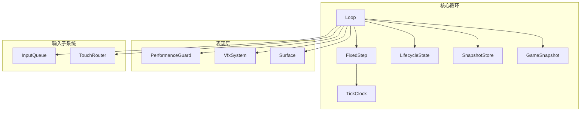
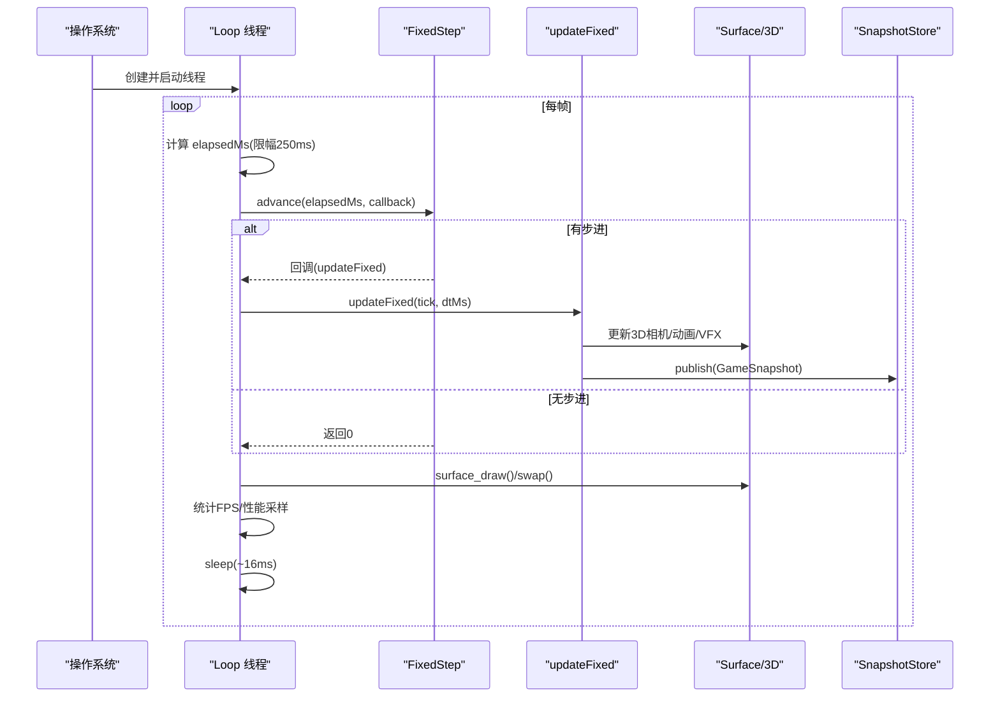
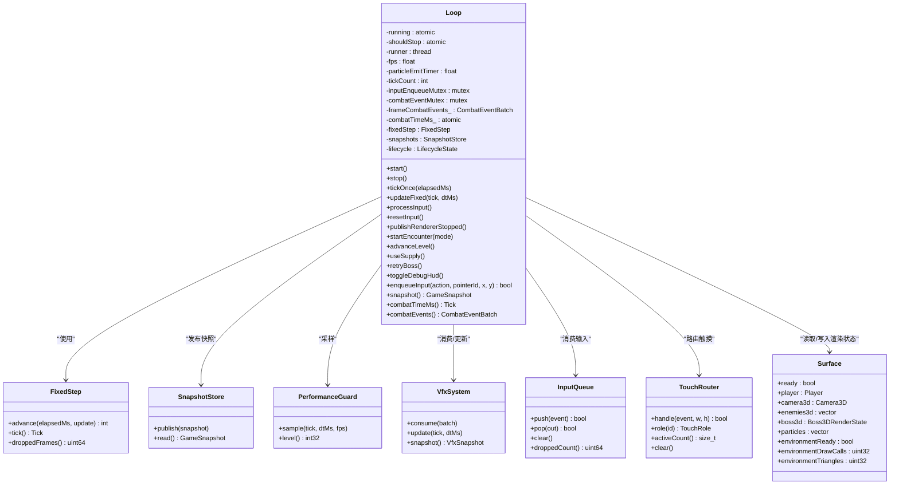
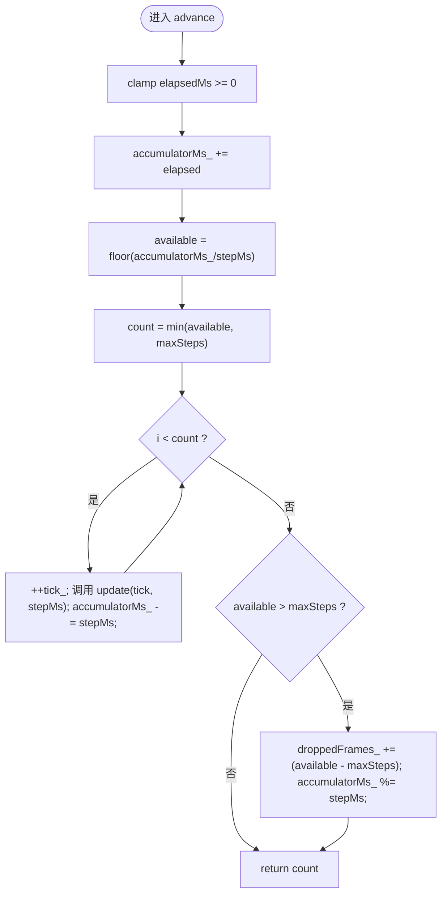
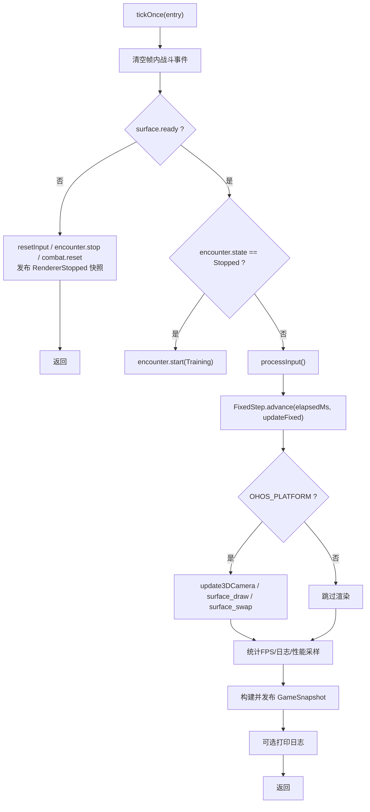
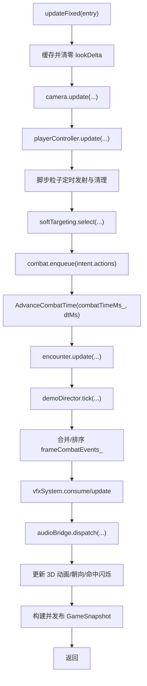
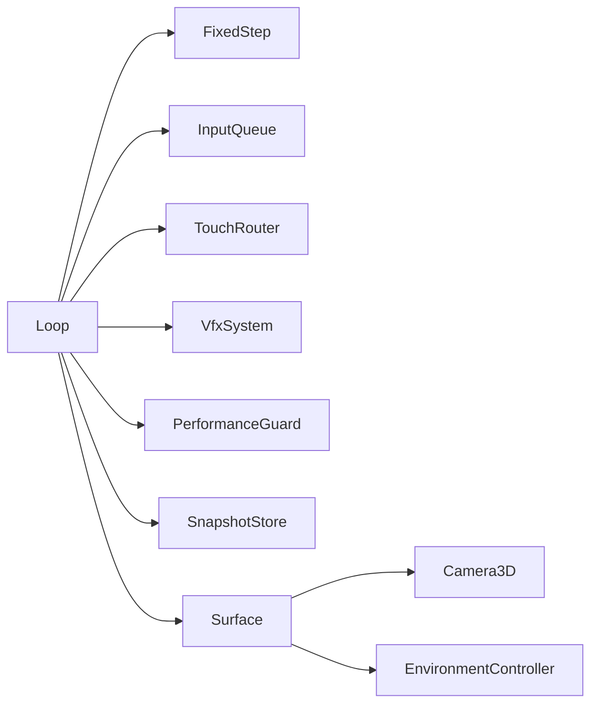

# 游戏循环系统

<cite>
**本文引用的文件**   
- [loop.h](file://native/engine/core/loop.h)
- [loop.cpp](file://native/engine/core/loop.cpp)
- [fixed_step.h](file://native/engine/core/fixed_step.h)
- [tick_clock.h](file://native/engine/core/tick_clock.h)
- [lifecycle_state.h](file://native/engine/core/lifecycle_state.h)
- [snapshot_store.h](file://native/engine/core/snapshot_store.h)
- [game_snapshot.h](file://native/engine/core/game_snapshot.h)
- [performance_guard.h](file://native/engine/presentation/performance_guard.h)
- [vfx_system.h](file://native/engine/presentation/vfx_system.h)
- [input_queue.h](file://native/engine/input/input_queue.h)
- [touch_router.h](file://native/engine/input/touch_router.h)
- [surface.h](file://native/engine/render/surface.h)
- [test_fixed_step.cpp](file://tests/test_fixed_step.cpp)
- [test_loop_lifecycle.cpp](file://tests/test_loop_lifecycle.cpp)
</cite>

## 目录
1. [简介](#简介)
2. [项目结构](#项目结构)
3. [核心组件](#核心组件)
4. [架构总览](#架构总览)
5. [详细组件分析](#详细组件分析)
6. [依赖关系分析](#依赖关系分析)
7. [性能考量](#性能考量)
8. [故障排查指南](#故障排查指南)
9. [结论](#结论)
10. [附录](#附录)

## 简介
本技术文档聚焦 my-world 引擎中的“游戏循环系统”，围绕 Loop 类作为引擎核心协调器，系统性阐述以下主题：
- 主循环线程管理、固定时间步长算法与帧率控制策略
- FixedStep 系统的物理更新逻辑（时间累积、步进计算、精度保证）
- tickOnce 方法的执行流程（输入处理、游戏逻辑更新、渲染调用、性能监控）
- 多线程环境下的线程安全机制（互斥锁、原子操作）
- 游戏循环初始化、启动与停止的示例性说明
- 性能优化技巧（FPS 监控、粒子系统定时器、调试 HUD）

## 项目结构
游戏循环相关代码主要位于 native/engine/core 及其相邻模块：
- core: Loop、FixedStep、TickClock、LifecycleState、SnapshotStore、GameSnapshot
- presentation: PerformanceGuard、VfxSystem
- input: InputQueue、TouchRouter
- render: Surface（含 3D 渲染状态）
- tests: 针对 FixedStep 与 LifecycleState 的单元测试

图表来源
- [loop.h:26-103](file://native/engine/core/loop.h#L26-L103)
- [fixed_step.h:8-48](file://native/engine/core/fixed_step.h#L8-L48)
- [lifecycle_state.h:6-37](file://native/engine/core/lifecycle_state.h#L6-L37)
- [snapshot_store.h:5-21](file://native/engine/core/snapshot_store.h#L5-L21)
- [game_snapshot.h:7-77](file://native/engine/core/game_snapshot.h#L7-L77)
- [tick_clock.h:1-7](file://native/engine/core/tick_clock.h#L1-L7)
- [performance_guard.h:21-45](file://native/engine/presentation/performance_guard.h#L21-L45)
- [vfx_system.h:58-70](file://native/engine/presentation/vfx_system.h#L58-L70)
- [input_queue.h:8-47](file://native/engine/input/input_queue.h#L8-L47)
- [touch_router.h:15-59](file://native/engine/input/touch_router.h#L15-L59)
- [surface.h:98-245](file://native/engine/render/surface.h#L98-L245)

章节来源
- [loop.h:26-103](file://native/engine/core/loop.h#L26-L103)
- [loop.cpp:134-177](file://native/engine/core/loop.cpp#L134-L177)

## 核心组件
- Loop：引擎主循环协调器，负责线程生命周期、输入处理、固定步长推进、渲染与快照发布。
- FixedStep：固定时间步长推进器，维护时间累加器与最大步进上限，确保确定性更新。
- LifecycleState：带递归锁的生命周期状态机，提供 start/stop 同步入口。
- SnapshotStore：线程安全的 GameSnapshot 读写存储。
- PerformanceGuard：基于滑动窗口的 FPS 采样与降级等级评估。
- VfxSystem：根据战斗事件批产生视觉特效快照。
- InputQueue/TrouchRouter：输入队列与触摸路由，解耦输入事件分发。
- Surface：渲染表面与 3D 渲染状态载体。

章节来源
- [loop.h:26-103](file://native/engine/core/loop.h#L26-L103)
- [fixed_step.h:8-48](file://native/engine/core/fixed_step.h#L8-L48)
- [lifecycle_state.h:6-37](file://native/engine/core/lifecycle_state.h#L6-L37)
- [snapshot_store.h:5-21](file://native/engine/core/snapshot_store.h#L5-L21)
- [performance_guard.h:21-45](file://native/engine/presentation/performance_guard.h#L21-L45)
- [vfx_system.h:58-70](file://native/engine/presentation/vfx_system.h#L58-L70)
- [input_queue.h:8-47](file://native/engine/input/input_queue.h#L8-L47)
- [touch_router.h:15-59](file://native/engine/input/touch_router.h#L15-L59)
- [surface.h:98-245](file://native/engine/render/surface.h#L98-L245)

## 架构总览
Loop 在独立线程中运行，以约 60fps 的频率驱动 tickOnce；每次 tickOnce 内部通过 FixedStep 将累计时间拆分为多个固定 dtMs 步，依次调用 updateFixed 完成相机、玩家、目标选择、战斗/AI、演示导演、VFX、音频与快照发布，并在 OHOS 平台进行 3D 相机更新与渲染交换。

图表来源
- [loop.cpp:134-177](file://native/engine/core/loop.cpp#L134-L177)
- [loop.cpp:314-420](file://native/engine/core/loop.cpp#L314-L420)
- [fixed_step.h:16-37](file://native/engine/core/fixed_step.h#L16-L37)
- [surface.h:247-252](file://native/engine/render/surface.h#L247-L252)

## 详细组件分析

### Loop 类：引擎核心协调器
- 职责
  - 线程管理：start/stop 通过 LifecycleState 保护，避免重复启动/停止；使用 std::thread 运行主循环。
  - 输入处理：processInput 从 InputQueue 消费事件，映射到 CombatAction 或交由 TouchRouter/Joystick/CameraGesture 处理。
  - 固定步长推进：FixedStep.advance 按 stepMs=16ms、maxSteps=4 拆分时间，调用 updateFixed。
  - 渲染与快照：OHOS 平台更新 3D 相机、绘制与交换缓冲；收集各子系统状态并发布 GameSnapshot。
  - 性能监控：每秒统计 FPS，记录环境渲染指标，调用 PerformanceGuard.sample。
  - 调试 HUD：toggleDebugHud 切换 debugHud_ 标志，影响快照输出。
- 关键成员
  - fixedStep{16, 4}：固定步长 16ms，最多 4 步/帧，防止卡顿补偿过大。
  - combatTimeMs_：原子 Tick，用于战斗时间推进，避免竞态。
  - frameCombatEvents_：帧内战斗事件批，经互斥保护后交给 VfxSystem/AudioBridge。
  - running/shouldStop：原子布尔，控制主循环退出。
  - fps/tickCount/lastFpsTime：FPS 统计。
  - particleEmitTimer：脚步粒子发射定时器。
  - inputEnqueueMutex/combatEventMutex：分别保护输入入队与战斗事件批。

图表来源
- [loop.h:26-103](file://native/engine/core/loop.h#L26-L103)
- [fixed_step.h:8-48](file://native/engine/core/fixed_step.h#L8-L48)
- [snapshot_store.h:5-21](file://native/engine/core/snapshot_store.h#L5-L21)
- [performance_guard.h:21-45](file://native/engine/presentation/performance_guard.h#L21-L45)
- [vfx_system.h:58-70](file://native/engine/presentation/vfx_system.h#L58-L70)
- [input_queue.h:8-47](file://native/engine/input/input_queue.h#L8-L47)
- [touch_router.h:15-59](file://native/engine/input/touch_router.h#L15-L59)
- [surface.h:98-245](file://native/engine/render/surface.h#L98-L245)

章节来源
- [loop.h:26-103](file://native/engine/core/loop.h#L26-L103)
- [loop.cpp:134-177](file://native/engine/core/loop.cpp#L134-L177)
- [loop.cpp:314-420](file://native/engine/core/loop.cpp#L314-L420)
- [loop.cpp:422-601](file://native/engine/core/loop.cpp#L422-L601)

### FixedStep：固定时间步长算法
- 设计要点
  - 固定步长 stepMs=16ms，最大步进 maxSteps=4，避免长时间卡顿导致一次性追赶过多步。
  - 使用 accumulatorMs_ 累积时间，每次 advance 计算可执行步数 count=min(available, maxSteps)。
  - 当 available > maxSteps 时，记录 droppedFrames_ 并回滚 accumulatorMs_ 至模 stepMs，保证长期精度。
  - 对负/零输入做防御：负 elapsed 直接返回 0；构造时断言 stepMs>0、maxSteps>=0。
- 复杂度
  - 时间复杂度 O(count)，count<=maxSteps，常数级。
  - 空间复杂度 O(1)。

图表来源
- [fixed_step.h:16-37](file://native/engine/core/fixed_step.h#L16-L37)

章节来源
- [fixed_step.h:8-48](file://native/engine/core/fixed_step.h#L8-L48)
- [test_fixed_step.cpp:26-67](file://tests/test_fixed_step.cpp#L26-L67)

### tickOnce 执行流程
- 步骤概览
  1) 清空帧内战斗事件批（互斥保护）。
  2) 若渲染未就绪：重置输入、停止遭遇战、重置战斗、发布 RendererStopped 快照。
  3) 若遭遇战已停止：自动重启为 Training。
  4) processInput：消费输入队列，映射战斗动作，更新摇杆与摄像机手势。
  5) FixedStep.advance：按固定步长推进 updateFixed。
  6) OHOS 平台：更新 3D 相机、设置环境性能级别、绘制与交换缓冲。
  7) FPS 统计与日志：每秒刷新 fps，记录环境渲染指标。
  8) 构建并发布 GameSnapshot：包含玩家位置、相机角度、战斗状态、遭遇战状态、VFX、性能等级等。
  9) 定期打印 tickOnce 日志。

图表来源
- [loop.cpp:314-420](file://native/engine/core/loop.cpp#L314-L420)

章节来源
- [loop.cpp:314-420](file://native/engine/core/loop.cpp#L314-L420)

### updateFixed：固定步长内的游戏逻辑更新
- 顺序与职责
  - 相机更新：优先更新 ThirdPersonCamera，保证移动方向与画面一致。
  - 玩家控制器：根据摇杆输入与 yaw 更新 player 位置与移动状态。
  - 粒子系统：仅在移动且摇杆有效时按 0.05s 间隔发射脚步粒子，清理过期粒子。
  - 目标选择：基于当前玩家位置与相机朝向，从候选列表中选择 softTargeting。
  - 战斗队列：将 intent.actions 入队，推进 combatTimeMs_（防溢出），调用 encounter.update。
  - 演示导演：根据战斗时间与遭遇战状态生成 DemoSignals，驱动 demoDirector.tick。
  - 事件合并与排序：合并本帧 gameplay/presentation 事件，按 tick/source/target/sequence 稳定排序。
  - VFX/Audio：消费事件批，更新 VfxSystem，派发 AudioBridge。
  - 动画与 3D 状态：根据战斗快照与命中事件更新玩家/训练目标/Boss 的 3D 动画与朝向。
  - 快照发布：合并 encounter/combat/vfx/perf/demo 等信息，发布 GameSnapshot。

图表来源
- [loop.cpp:422-601](file://native/engine/core/loop.cpp#L422-L601)

章节来源
- [loop.cpp:422-601](file://native/engine/core/loop.cpp#L422-L601)

### 多线程与线程安全
- 主循环线程
  - runner 由 start 创建，stop 中 shouldStop=true 并 join 等待结束。
  - running/shouldStop 为原子变量，避免数据竞争。
- 输入入队
  - enqueueInput 使用 inputEnqueueMutex 保护 InputQueue 的 push 与序列号递增。
- 战斗事件批
  - frameCombatEvents_ 使用 combatEventMutex 保护，确保消费与合并的原子性。
- 快照读写
  - SnapshotStore 内部互斥保护 read/publish。
- 生命周期
  - LifecycleState 使用递归互斥锁，保证 start/stop 与 synchronized 操作的串行化。

章节来源
- [loop.cpp:134-177](file://native/engine/core/loop.cpp#L134-L177)
- [loop.cpp:179-206](file://native/engine/core/loop.cpp#L179-L206)
- [loop.h:88-102](file://native/engine/core/loop.h#L88-L102)
- [snapshot_store.h:5-21](file://native/engine/core/snapshot_store.h#L5-L21)
- [lifecycle_state.h:6-37](file://native/engine/core/lifecycle_state.h#L6-L37)

### 帧率控制与性能监控
- 帧率控制
  - 主循环每帧 sleep_for(16ms) 近似 60fps；elapsedMs 限制为 250ms，防止极端卡顿导致步进爆炸。
- FPS 统计
  - 每秒统计 tickCount 与 elapsed，计算 fps，并记录环境渲染指标。
- 性能降级
  - PerformanceGuard 维护 2 秒滑动窗口，根据平均 FPS 输出 PerfLevel（Full/Light/Medium/Heavy/Critical）。
  - 将 level 写入 surface.environmentPerfLevel 与 snapshot.perfLevel，供 UI/渲染降级使用。

章节来源
- [loop.cpp:134-177](file://native/engine/core/loop.cpp#L134-L177)
- [loop.cpp:342-357](file://native/engine/core/loop.cpp#L342-L357)
- [performance_guard.h:21-45](file://native/engine/presentation/performance_guard.h#L21-L45)

### 粒子系统与调试 HUD
- 粒子系统
  - 仅当 player.moving 且摇杆输入非空时，按 0.05s 间隔发射脚步粒子；每帧衰减 life 并移除过期粒子。
- 调试 HUD
  - toggleDebugHud 切换 debugHud_，影响 snapshot.debugHud 与 showDebugHud，便于运行时诊断。

章节来源
- [loop.cpp:434-451](file://native/engine/core/loop.cpp#L434-L451)
- [loop.cpp:397-414](file://native/engine/core/loop.cpp#L397-L414)

## 依赖关系分析
- Loop 依赖
  - FixedStep：时间推进
  - InputQueue/TouhRouter：输入处理
  - VfxSystem/AudioBridge：表现层事件消费
  - PerformanceGuard：性能采样
  - SnapshotStore：快照发布
  - Surface：渲染状态与 3D 相机
- 单向依赖
  - 渲染层只读消费 2D 逻辑写入的位置与存活状态，不反向修改游戏逻辑（见 Enemy3DRenderState/Boss3DRenderState 设计）。

图表来源
- [loop.h:26-103](file://native/engine/core/loop.h#L26-L103)
- [surface.h:98-245](file://native/engine/render/surface.h#L98-L245)

章节来源
- [loop.h:26-103](file://native/engine/core/loop.h#L26-L103)
- [surface.h:98-245](file://native/engine/render/surface.h#L98-L245)

## 性能考量
- 固定步长上限
  - maxSteps=4 限制单帧最大步进，避免卡顿补偿导致的抖动与不可预测行为。
- 时间累积精度
  - accumulatorMs_ 使用 uint64 并取模，防止溢出；droppedFrames_ 记录丢失帧数用于诊断。
- FPS 采样窗口
  - 2 秒滑动窗口平滑波动，降低瞬时抖动对降级决策的影响。
- 渲染降级
  - 通过 environmentPerfLevel 与 texture tier 动态调整资源质量，维持目标帧率。
- 输入队列容量
  - InputQueue 默认容量 256，溢出时丢弃并计数，避免阻塞主循环。

[本节为通用指导，无需特定文件引用]

## 故障排查指南
- 常见问题
  - 渲染未就绪：检查 surface.ready 与 GL/EGL 初始化；确认 surface_init/surface_resize 成功。
  - 遭遇战未启动：若 encounter.snapshot().state==Stopped，tickOnce 会自动重启 Training；否则检查 startEncounter 调用。
  - 输入丢失：查看 InputQueue.droppedCount 与 inputEventCount_，必要时增大容量或优化消费频率。
  - 卡顿补偿过大：观察 droppedFrames_ 与 FPS，适当调小 maxSteps 或优化 updateFixed 耗时。
  - 崩溃于构造：FixedStep(stepMs=0 或 maxSteps<0) 会触发断言；确保参数合法。
- 定位手段
  - 启用 LOGI 日志，关注 PROFILE fps 与环境渲染指标。
  - 使用 test_fixed_step.cpp 与 test_loop_lifecycle.cpp 验证基础行为。

章节来源
- [loop.cpp:314-357](file://native/engine/core/loop.cpp#L314-L357)
- [test_fixed_step.cpp:26-67](file://tests/test_fixed_step.cpp#L26-L67)
- [test_loop_lifecycle.cpp:9-80](file://tests/test_loop_lifecycle.cpp#L9-L80)

## 结论
Loop 作为引擎核心协调器，通过 FixedStep 实现确定性物理更新，结合严格的线程安全与性能监控，保证了稳定的帧率与可预测的游戏逻辑推进。配合 VfxSystem、AudioBridge、Surface 与 InputQueue，形成完整的游戏循环闭环。通过合理的固定步长上限、滑动窗口 FPS 采样与渲染降级策略，系统在移动端平台上具备良好鲁棒性与可扩展性。

[本节为总结性内容，无需特定文件引用]

## 附录

### 游戏循环初始化、启动与停止（示例性说明）
- 初始化
  - 构造 Loop：设置初始玩家位置、启动 Training 遭遇战、初始化各子系统。
- 启动
  - 调用 Loop::start：通过 LifecycleState.start 保护，重置输入与遭遇战、启动音频桥、创建 runner 线程，进入主循环。
- 停止
  - 调用 Loop::stop：设置 shouldStop=true，join 线程，重置输入与遭遇战、战斗状态，发布暂停快照。

章节来源
- [loop.h:27-33](file://native/engine/core/loop.h#L27-L33)
- [loop.cpp:134-177](file://native/engine/core/loop.cpp#L134-L177)
- [loop.cpp:179-206](file://native/engine/core/loop.cpp#L179-L206)