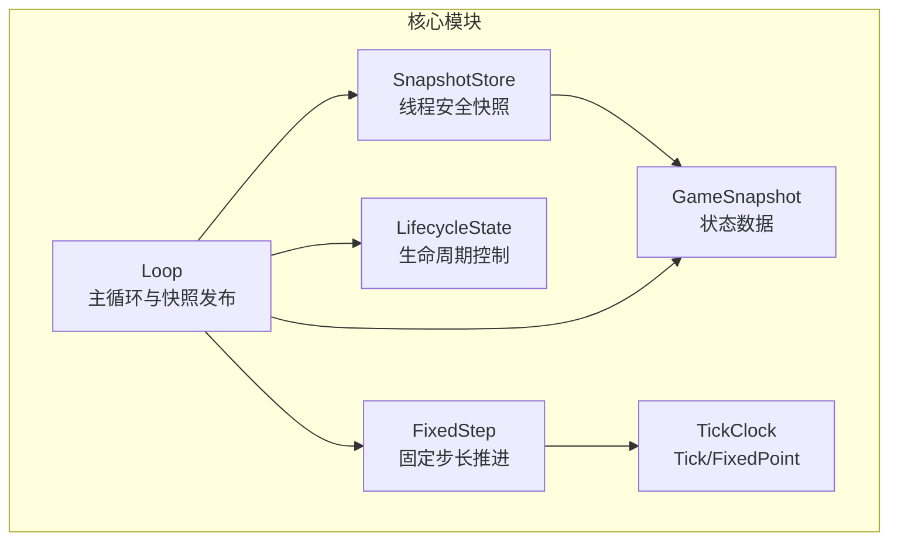
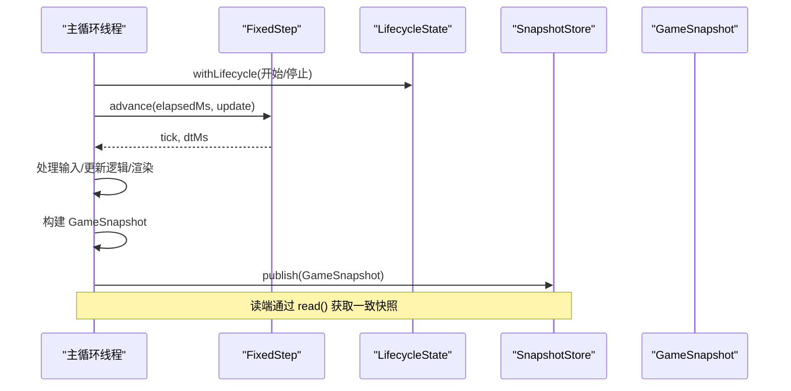
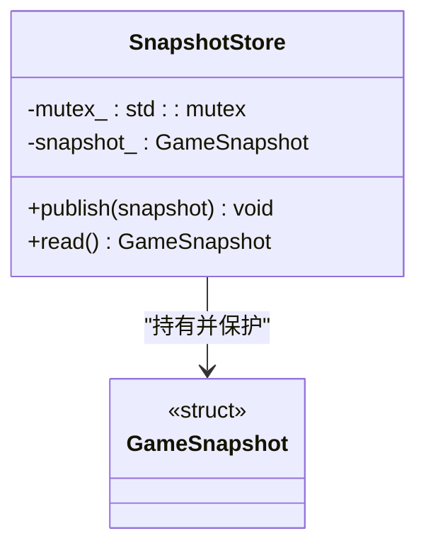
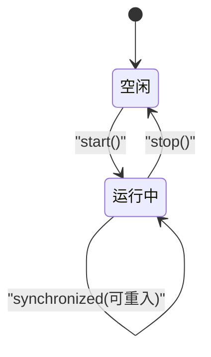
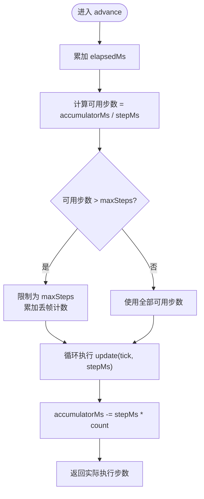
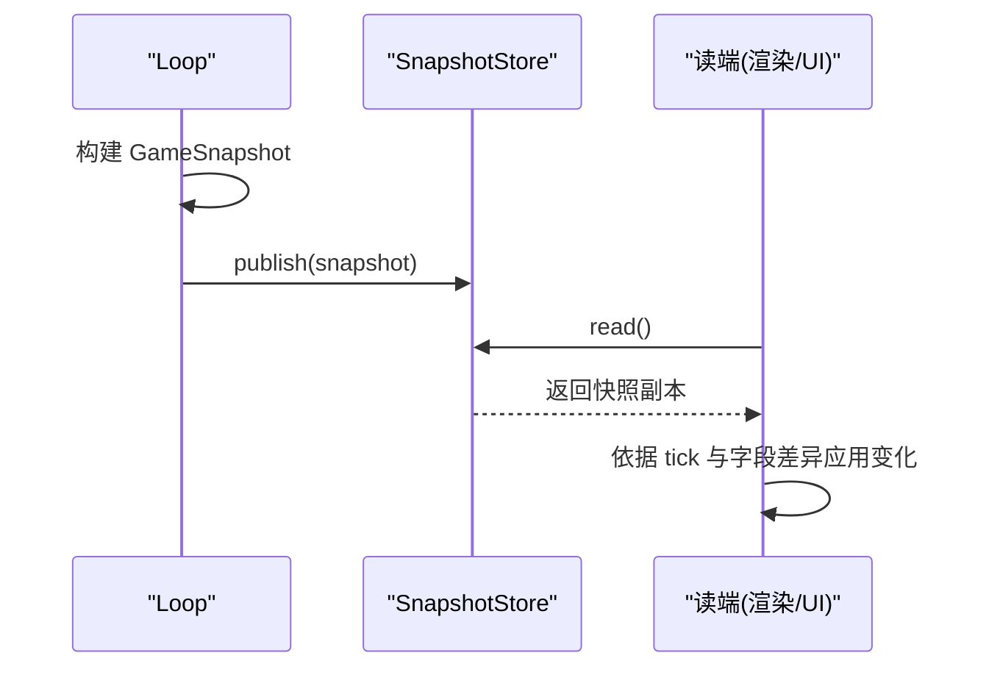
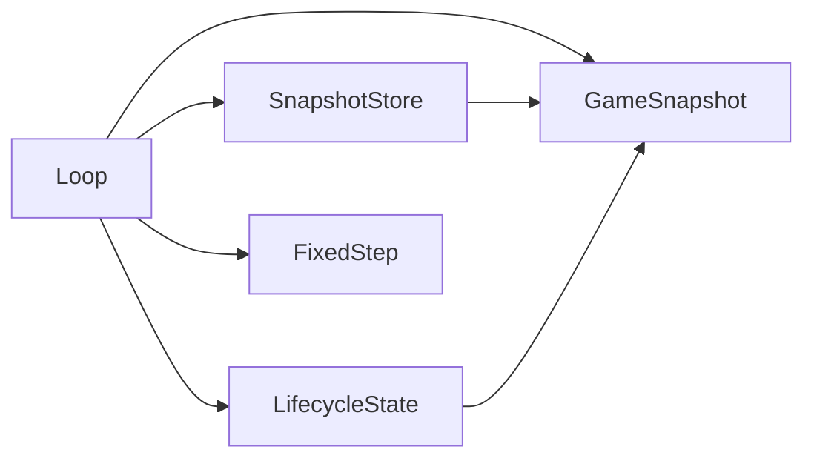

# 状态同步机制

<cite>
**本文引用的文件**   
- [snapshot_store.h](file://native/engine/core/snapshot_store.h)
- [game_snapshot.h](file://native/engine/core/game_snapshot.h)
- [lifecycle_state.h](file://native/engine/core/lifecycle_state.h)
- [tick_clock.h](file://native/engine/core/tick_clock.h)
- [fixed_step.h](file://native/engine/core/fixed_step.h)
- [loop.h](file://native/engine/core/loop.h)
- [loop.cpp](file://native/engine/core/loop.cpp)
- [test_snapshot_store.cpp](file://tests/test_snapshot_store.cpp)
- [test_loop_lifecycle.cpp](file://tests/test_loop_lifecycle.cpp)
</cite>

## 目录
1. [简介](#简介)
2. [项目结构](#项目结构)
3. [核心组件](#核心组件)
4. [架构总览](#架构总览)
5. [详细组件分析](#详细组件分析)
6. [依赖关系分析](#依赖关系分析)
7. [性能考虑](#性能考虑)
8. [故障排查指南](#故障排查指南)
9. [结论](#结论)
10. [附录](#附录)

## 简介
本技术文档聚焦 my-world 的状态同步机制，围绕 SnapshotStore 的快照存储与恢复、GameSnapshot 数据结构设计、LifecycleState 生命周期管理，以及多线程环境下的并发策略进行系统化说明。文档同时给出关键流程的时序图与流程图，帮助读者理解快照创建、比较与应用的全过程，并覆盖并发访问、数据完整性与性能优化等关键技术点。

## 项目结构
与状态同步相关的核心代码位于 native/engine/core 目录下，主要包括：
- 快照存储：SnapshotStore（线程安全的单份快照发布/读取）
- 快照数据：GameSnapshot（游戏世界状态的扁平化视图）
- 生命周期：LifecycleState（递归锁保护的启动/停止与同步执行）
- 时钟与步进：Tick/FixedPoint、FixedStep（固定时间步长推进）
- 主循环：Loop（整合输入、更新、渲染与快照发布）



图表来源
- [snapshot_store.h:1-21](file://native/engine/core/snapshot_store.h#L1-L21)
- [game_snapshot.h:1-77](file://native/engine/core/game_snapshot.h#L1-L77)
- [lifecycle_state.h:1-51](file://native/engine/core/lifecycle_state.h#L1-L51)
- [tick_clock.h:1-7](file://native/engine/core/tick_clock.h#L1-L7)
- [fixed_step.h:1-49](file://native/engine/core/fixed_step.h#L1-L49)
- [loop.h:1-104](file://native/engine/core/loop.h#L1-L104)
- [loop.cpp:1-617](file://native/engine/core/loop.cpp#L1-L617)

章节来源
- [snapshot_store.h:1-21](file://native/engine/core/snapshot_store.h#L1-L21)
- [game_snapshot.h:1-77](file://native/engine/core/game_snapshot.h#L1-L77)
- [lifecycle_state.h:1-51](file://native/engine/core/lifecycle_state.h#L1-L51)
- [tick_clock.h:1-7](file://native/engine/core/tick_clock.h#L1-L7)
- [fixed_step.h:1-49](file://native/engine/core/fixed_step.h#L1-L49)
- [loop.h:1-104](file://native/engine/core/loop.h#L1-L104)
- [loop.cpp:1-617](file://native/engine/core/loop.cpp#L1-L617)

## 核心组件
- SnapshotStore：提供 publish/read 接口，内部以互斥量保护 GameSnapshot 的读写，保证多生产者/多消费者场景下的一致性。
- GameSnapshot：扁平化的游戏状态聚合，包含玩家状态、战斗信息、环境指标、相机与表现层标志等。
- LifecycleState：通过递归互斥量实现 synchronized/start/stop 语义，确保生命周期操作串行化且可重入。
- Tick/FixedPoint：Tick 为 int64 时间戳；FixedPoint 为定点数（1.0 == 1<<16），用于高精度数值表达。
- FixedStep：基于累积毫秒的固定步长推进器，限制每帧最大步数，避免掉帧雪崩。
- Loop：整合输入处理、固定步更新、渲染与快照构建，最终将完整快照发布到 SnapshotStore。

章节来源
- [snapshot_store.h:1-21](file://native/engine/core/snapshot_store.h#L1-L21)
- [game_snapshot.h:1-77](file://native/engine/core/game_snapshot.h#L1-L77)
- [lifecycle_state.h:1-51](file://native/engine/core/lifecycle_state.h#L1-L51)
- [tick_clock.h:1-7](file://native/engine/core/tick_clock.h#L1-L7)
- [fixed_step.h:1-49](file://native/engine/core/fixed_step.h#L1-L49)
- [loop.h:1-104](file://native/engine/core/loop.h#L1-L104)
- [loop.cpp:1-617](file://native/engine/core/loop.cpp#L1-L617)

## 架构总览
下图展示主循环如何采集各子系统状态，组装成 GameSnapshot，并通过 SnapshotStore 发布，供渲染或外部系统消费。



图表来源
- [loop.cpp:314-420](file://native/engine/core/loop.cpp#L314-L420)
- [loop.cpp:422-601](file://native/engine/core/loop.cpp#L422-L601)
- [snapshot_store.h:1-21](file://native/engine/core/snapshot_store.h#L1-L21)
- [fixed_step.h:1-49](file://native/engine/core/fixed_step.h#L1-L49)
- [lifecycle_state.h:1-51](file://native/engine/core/lifecycle_state.h#L1-L51)

章节来源
- [loop.cpp:314-420](file://native/engine/core/loop.cpp#L314-L420)
- [loop.cpp:422-601](file://native/engine/core/loop.cpp#L422-L601)
- [snapshot_store.h:1-21](file://native/engine/core/snapshot_store.h#L1-L21)
- [fixed_step.h:1-49](file://native/engine/core/fixed_step.h#L1-L49)
- [lifecycle_state.h:1-51](file://native/engine/core/lifecycle_state.h#L1-L51)

## 详细组件分析

### SnapshotStore：快照存储与恢复
- 设计要点
  - 使用 std::mutex 保护 snapshot_ 的读写，publish 写时加锁，read 读时加锁，保证每次 read 返回一致的快照副本。
  - 无版本字段：一致性由 tick 字段在应用层保证，读端可通过 tick 单调性判断是否获得新快照。
- 并发模型
  - 单写多读：通常由 Loop 线程写入，其他线程（如 UI/网络）读取。
  - 原子性与内存屏障：测试用例中使用 atomic 与 memory_order 协调读写线程，确保可见性与顺序。
- 序列化与恢复
  - 当前实现未内置二进制序列化；恢复通常通过读取最近快照并在应用层回放增量事件完成。
  - 如需持久化，可在 publish 前对 GameSnapshot 进行 JSON/二进制编码，并在加载后重建状态。



图表来源
- [snapshot_store.h:1-21](file://native/engine/core/snapshot_store.h#L1-L21)
- [game_snapshot.h:1-77](file://native/engine/core/game_snapshot.h#L1-L77)

章节来源
- [snapshot_store.h:1-21](file://native/engine/core/snapshot_store.h#L1-L21)
- [test_snapshot_store.cpp:1-53](file://tests/test_snapshot_store.cpp#L1-L53)

### GameSnapshot：数据结构设计
- 组织方式
  - 玩家状态：位置、移动方向、FPS、目标 ID、距离、相机角度等。
  - 战斗信息：血量、韧性、耐力、共鸣、技能冷却窗口、连击段、反应状态等。
  - 环境数据：层级阶段、门状态、补给状态、Boss 血量/韧性/阶段/机制/施法剩余、性能等级、VFX 标志、摄像机抖动等。
  - 调试与统计：debugHud、showDebugHud、inputEventCount、环境绘制调用与三角面数。
- 数据类型
  - Tick：int64 时间戳，用于步进与排序。
  - FixedPoint：定点数（1.0 == 1<<16），用于高精度数值（如 HP/Poise）。
- 扩展性
  - 扁平结构便于快速序列化与跨线程传输；新增字段需保持向后兼容。

```mermaid
erDiagram
GAME_SNAPSHOT {
int64 tick
int64 hp
int64 poise
float playerX
float playerY
float fps
bool moving
int32 targetId
int32 bossPhase
bool rendererReady
float moveX
float moveY
float cameraYaw
float cameraPitch
float targetDist
uint8 comboSegment
int64 targetHp
int64 targetPoise
int64 stamina
int64 resonance
bool hasInsight
bool invulnerable
int64 insightMs
int64 pulseHitRemainingMs
int32 lastRejectReason
uint8 currentAction
int64 comboWindowMs
int64 radianceCooldownMs
int64 currentCooldownMs
int64 corruptionCooldownMs
int64 radianceCooldownTotalMs
int64 currentCooldownTotalMs
int64 corruptionCooldownTotalMs
int64 ultimateWindowMs
bool targetPoiseBroken
bool radianceAttached
bool currentAttached
bool corruptionAttached
bool corroded
int32 currentReaction
uint8 pulsePhase
int32 levelStage
int32 gateState
int32 supplyState
int64 bossHp
int64 bossPoise
int32 bossMechanic
int64 bossCastMs
int32 perfLevel
int32 vfxFlags
float cameraShakeX
float cameraShakeY
float bossHpRatio
float bossCastRatio
bool debugHud
bool environmentReady
uint32 environmentDrawCalls
uint32 environmentTriangles
string objectiveLabel
array<uint8,3> resonanceSlots
bool showDebugHud
int32 inputEventCount
float bossCinematicProgress
uint8 bossShardCount
uint8 bossSourceColor
bool bossRingBroken
}
```

图表来源
- [game_snapshot.h:1-77](file://native/engine/core/game_snapshot.h#L1-L77)
- [tick_clock.h:1-7](file://native/engine/core/tick_clock.h#L1-L7)

章节来源
- [game_snapshot.h:1-77](file://native/engine/core/game_snapshot.h#L1-L77)
- [tick_clock.h:1-7](file://native/engine/core/tick_clock.h#L1-L7)

### LifecycleState：生命周期状态管理
- 能力
  - synchronized：以递归互斥量保护任意操作，支持嵌套调用。
  - start/stop：原子地切换 running_ 状态，确保只允许一次启动/停止。
  - RendererStoppedSnapshot：当渲染器停止时，清理运动、目标与渲染相关字段，保证状态一致性。
- 使用模式
  - Loop 通过 withLifecycle 包裹关键路径，保证资源初始化/释放的顺序与互斥。
  - 测试验证了并发安全性与递归调用正确性。



图表来源
- [lifecycle_state.h:1-51](file://native/engine/core/lifecycle_state.h#L1-L51)
- [test_loop_lifecycle.cpp:1-80](file://tests/test_loop_lifecycle.cpp#L1-L80)

章节来源
- [lifecycle_state.h:1-51](file://native/engine/core/lifecycle_state.h#L1-L51)
- [test_loop_lifecycle.cpp:1-80](file://tests/test_loop_lifecycle.cpp#L1-L80)

### 固定步长与时钟：FixedStep 与 Tick/FixedPoint
- FixedStep
  - 维护 accumulatorMs 与 tick_，按 stepMs 推进，限制每帧最大步数，防止卡顿。
  - droppedFrames_ 记录丢帧计数，可用于诊断。
- Tick/FixedPoint
  - Tick 作为全局时间基准，用于快照排序与回放。
  - FixedPoint 提供高精度数值，避免浮点误差累积。



图表来源
- [fixed_step.h:1-49](file://native/engine/core/fixed_step.h#L1-L49)
- [tick_clock.h:1-7](file://native/engine/core/tick_clock.h#L1-L7)

章节来源
- [fixed_step.h:1-49](file://native/engine/core/fixed_step.h#L1-L49)
- [tick_clock.h:1-7](file://native/engine/core/tick_clock.h#L1-L7)

### 主循环中的快照创建、比较与应用
- 快照创建
  - Loop::tickOnce/updateFixed 中从 Surface、Encounter、Combat、VFX、PerformanceGuard 等子系统收集状态，填充 GameSnapshot。
  - 最后通过 snapshots.publish(snapshot) 发布。
- 快照比较
  - 读端可通过 snapshot.tick 判断是否为新快照；结合业务逻辑做增量应用。
- 快照应用
  - 渲染/UI 层读取快照后，根据字段驱动动画、UI 与特效；必要时回写 Surface 的 3D 状态。



图表来源
- [loop.cpp:359-415](file://native/engine/core/loop.cpp#L359-L415)
- [loop.cpp:535-601](file://native/engine/core/loop.cpp#L535-L601)
- [snapshot_store.h:1-21](file://native/engine/core/snapshot_store.h#L1-L21)

章节来源
- [loop.cpp:359-415](file://native/engine/core/loop.cpp#L359-L415)
- [loop.cpp:535-601](file://native/engine/core/loop.cpp#L535-L601)
- [snapshot_store.h:1-21](file://native/engine/core/snapshot_store.h#L1-L21)

## 依赖关系分析
- 组件耦合
  - Loop 强依赖 SnapshotStore、LifecycleState、FixedStep、GameSnapshot。
  - SnapshotStore 仅依赖 GameSnapshot 与标准库互斥量。
  - LifecycleState 依赖递归互斥量与 GameSnapshot（用于停止态清理函数）。
- 外部依赖
  - 标准库线程与原子类型用于并发控制。
  - GLM/渲染子系统通过 Surface/VfxSystem 间接影响快照字段。



图表来源
- [loop.h:1-104](file://native/engine/core/loop.h#L1-L104)
- [loop.cpp:1-617](file://native/engine/core/loop.cpp#L1-L617)
- [snapshot_store.h:1-21](file://native/engine/core/snapshot_store.h#L1-L21)
- [lifecycle_state.h:1-51](file://native/engine/core/lifecycle_state.h#L1-L51)
- [fixed_step.h:1-49](file://native/engine/core/fixed_step.h#L1-L49)
- [game_snapshot.h:1-77](file://native/engine/core/game_snapshot.h#L1-L77)

章节来源
- [loop.h:1-104](file://native/engine/core/loop.h#L1-L104)
- [loop.cpp:1-617](file://native/engine/core/loop.cpp#L1-L617)
- [snapshot_store.h:1-21](file://native/engine/core/snapshot_store.h#L1-L21)
- [lifecycle_state.h:1-51](file://native/engine/core/lifecycle_state.h#L1-L51)
- [fixed_step.h:1-49](file://native/engine/core/fixed_step.h#L1-L49)
- [game_snapshot.h:1-77](file://native/engine/core/game_snapshot.h#L1-L77)

## 性能考虑
- 快照大小与拷贝成本
  - GameSnapshot 较大，频繁拷贝可能带来开销。建议读端缓存上次快照，仅在 tick 变化时深比较关键字段。
- 锁粒度
  - SnapshotStore 使用粗粒度互斥量，简单可靠。若读远多于写，可考虑读写锁或双缓冲（A/B 指针交换）降低竞争。
- 固定步长
  - FixedStep 限制最大步数，避免极端掉帧导致 CPU 飙升。合理设置 stepMs 与 maxSteps。
- 序列化
  - 如需网络同步或持久化，优先选择紧凑二进制格式，并对热点字段进行差分压缩。
- 内存屏障与原子
  - 读端可使用原子变量标记“有新快照”，配合 SnapshotStore::read 保证可见性。

[本节为通用指导，不直接分析具体文件]

## 故障排查指南
- 常见问题
  - 读端看到乱序或旧快照：检查 tick 单调性，确认读端未跳过中间快照；必要时引入序列号或版本号。
  - 渲染异常：确认 RendererStoppedSnapshot 是否正确清理 moving/targetId/moveX/Y/targetDist/rendererReady/environmentReady 等字段。
  - 卡顿与掉帧：观察 FixedStep::droppedFrames，调整 stepMs/maxSteps；检查主循环耗时。
- 定位手段
  - 日志：Loop 中已输出 FPS、环境就绪、绘制调用与三角面数等指标。
  - 单元测试：test_snapshot_store 与 test_loop_lifecycle 覆盖了并发与生命周期行为。

章节来源
- [lifecycle_state.h:39-51](file://native/engine/core/lifecycle_state.h#L39-L51)
- [loop.cpp:345-357](file://native/engine/core/loop.cpp#L345-L357)
- [test_snapshot_store.cpp:1-53](file://tests/test_snapshot_store.cpp#L1-L53)
- [test_loop_lifecycle.cpp:1-80](file://tests/test_loop_lifecycle.cpp#L1-L80)

## 结论
my-world 的状态同步机制以 SnapshotStore 为核心，结合 GameSnapshot 的扁平化设计与 LifecycleState 的生命周期控制，实现了简洁可靠的跨线程状态共享。FixedStep 与 Tick/FixedPoint 保证了时间推进的一致性与精度。通过合理的锁策略、原子操作与内存屏障，系统在并发环境下具备良好的一致性与稳定性。未来可进一步优化快照拷贝与序列化效率，提升大规模同步场景的性能。

[本节为总结性内容，不直接分析具体文件]

## 附录
- 代码示例路径（不含具体代码内容）
  - 快照创建与发布：[loop.cpp:359-415](file://native/engine/core/loop.cpp#L359-L415)、[loop.cpp:535-601](file://native/engine/core/loop.cpp#L535-L601)
  - 快照读取与断言：[test_snapshot_store.cpp:1-53](file://tests/test_snapshot_store.cpp#L1-L53)
  - 生命周期同步与停止态清理：[lifecycle_state.h:1-51](file://native/engine/core/lifecycle_state.h#L1-L51)、[test_loop_lifecycle.cpp:1-80](file://tests/test_loop_lifecycle.cpp#L1-L80)
  - 固定步长推进：[fixed_step.h:1-49](file://native/engine/core/fixed_step.h#L1-L49)

[本节为参考索引，不直接分析具体文件]