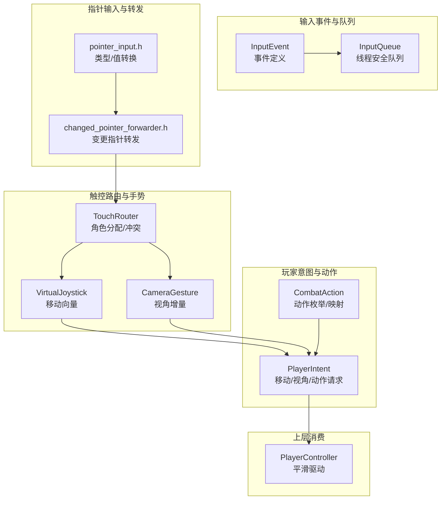
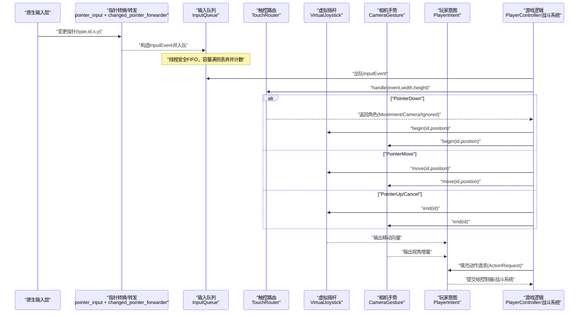
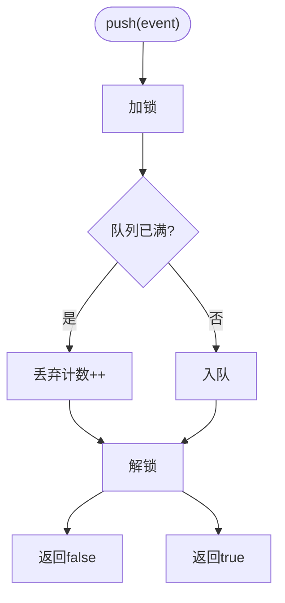
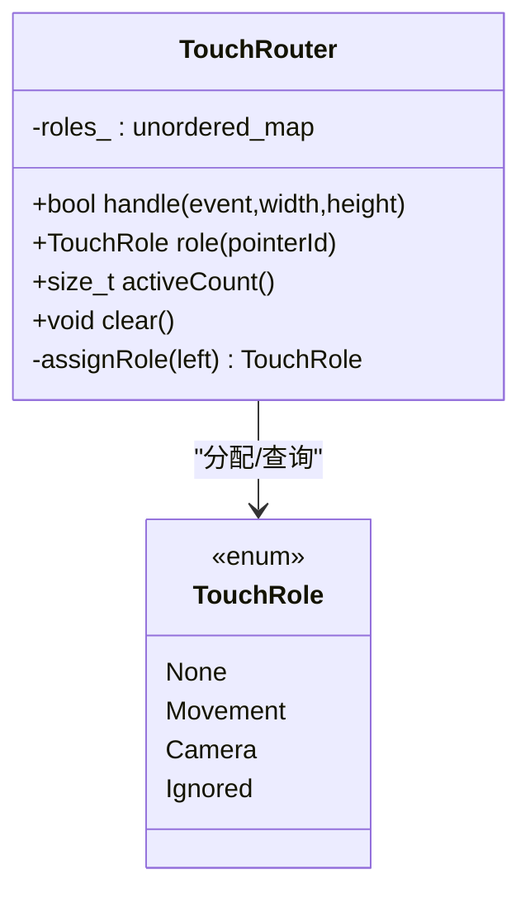
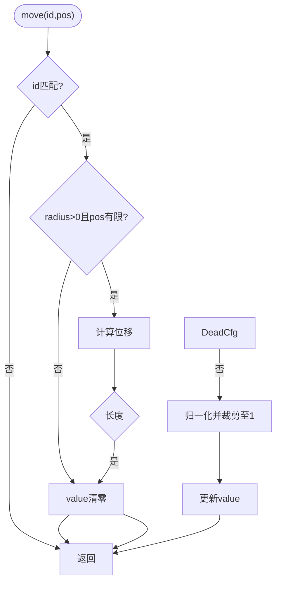
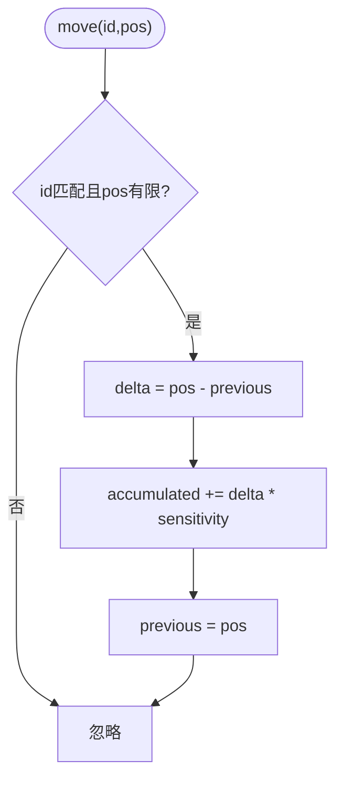
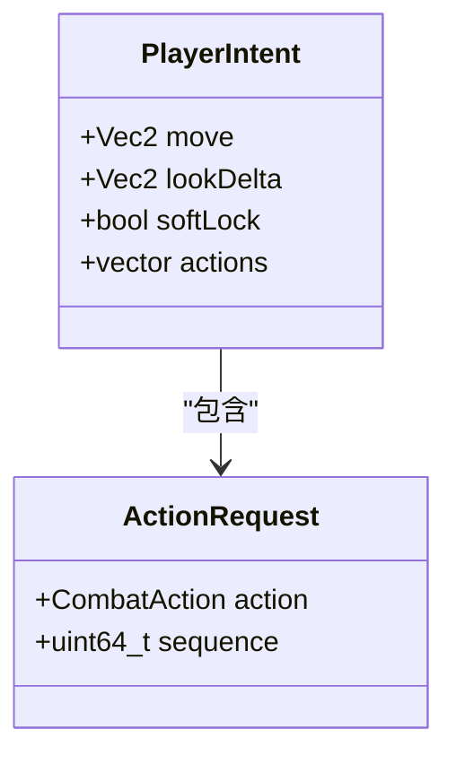
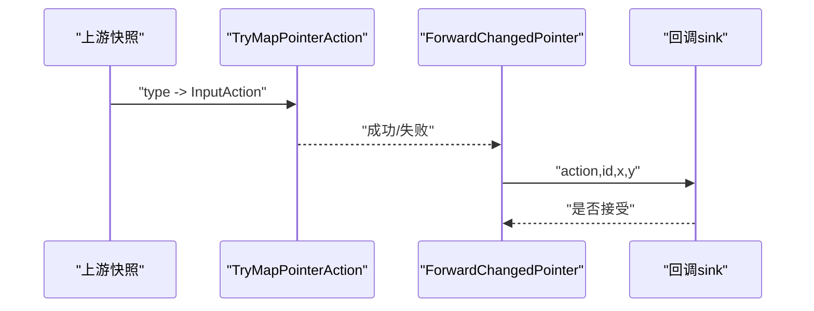
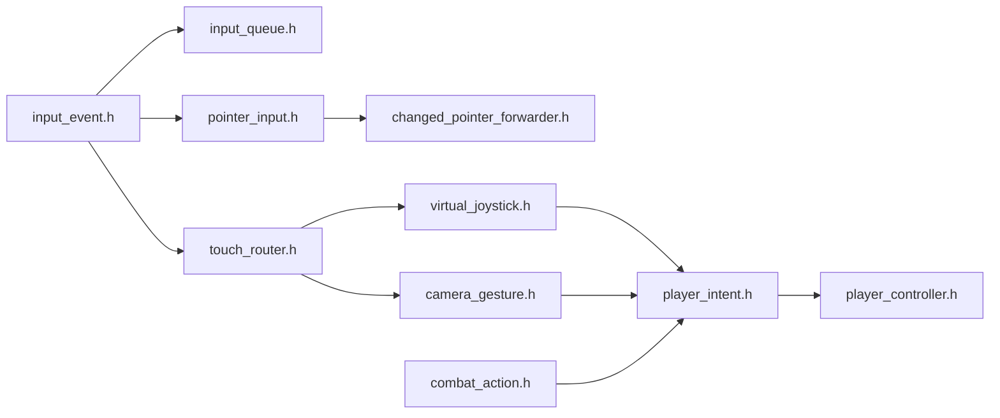

# 输入处理基础设施

<cite>
**本文引用的文件**   
- [input_event.h](file://native/engine/input/input_event.h)
- [input_queue.h](file://native/engine/input/input_queue.h)
- [touch_router.h](file://native/engine/input/touch_router.h)
- [player_intent.h](file://native/engine/input/player_intent.h)
- [pointer_input.h](file://native/engine/input/pointer_input.h)
- [changed_pointer_forwarder.h](file://native/engine/input/changed_pointer_forwarder.h)
- [camera_gesture.h](file://native/engine/input/camera_gesture.h)
- [virtual_joystick.h](file://native/engine/input/virtual_joystick.h)
- [combat_action.h](file://native/engine/combat/combat_action.h)
- [player_controller.h](file://native/gameplay/player/player_controller.h)
- [test_input_queue.cpp](file://tests/test_input_queue.cpp)
- [test_pointer_input.cpp](file://tests/test_pointer_input.cpp)
- [test_touch_controls.cpp](file://tests/test_touch_controls.cpp)
- [test_changed_pointer_forwarding.cpp](file://tests/test_changed_pointer_forwarding.cpp)
</cite>

## 目录
1. [简介](#简介)
2. [项目结构](#项目结构)
3. [核心组件](#核心组件)
4. [架构总览](#架构总览)
5. [详细组件分析](#详细组件分析)
6. [依赖关系分析](#依赖关系分析)
7. [性能考量](#性能考量)
8. [故障排查指南](#故障排查指南)
9. [结论](#结论)
10. [附录](#附录)

## 简介
本技术文档聚焦 my-world 的输入处理基础设施，系统性解析从原生输入到游戏逻辑的完整链路。重点覆盖：
- InputQueue 的事件队列管理（缓冲、丢弃策略、线程安全）
- TouchRouter 的多点触控路由与冲突解决
- PlayerIntent 的玩家意图抽象层（动作映射、参数解析、状态跟踪）
- 指针输入转换与事件转发（pointer_input、changed_pointer_forwarder）
- 虚拟摇杆与相机手势的集成
- 输入延迟优化、多点触控支持与跨平台兼容性要点

## 项目结构
输入子系统位于 native/engine/input 目录，围绕“事件定义—队列—路由—手势/摇杆—玩家意图—战斗动作”的分层组织。测试用例位于 tests 目录，覆盖并发队列、指针映射、触控路由与组合流程。

图表来源
- [input_event.h:1-24](file://native/engine/input/input_event.h#L1-L24)
- [input_queue.h:1-47](file://native/engine/input/input_queue.h#L1-L47)
- [pointer_input.h:1-36](file://native/engine/input/pointer_input.h#L1-L36)
- [changed_pointer_forwarder.h:1-12](file://native/engine/input/changed_pointer_forwarder.h#L1-L12)
- [touch_router.h:1-59](file://native/engine/input/touch_router.h#L1-L59)
- [virtual_joystick.h:1-62](file://native/engine/input/virtual_joystick.h#L1-L62)
- [camera_gesture.h:1-54](file://native/engine/input/camera_gesture.h#L1-L54)
- [player_intent.h:1-13](file://native/engine/input/player_intent.h#L1-L13)
- [combat_action.h:1-67](file://native/engine/combat/combat_action.h#L1-L67)
- [player_controller.h:1-36](file://native/gameplay/player/player_controller.h#L1-L36)

章节来源
- [input_event.h:1-24](file://native/engine/input/input_event.h#L1-L24)
- [input_queue.h:1-47](file://native/engine/input/input_queue.h#L1-L47)
- [pointer_input.h:1-36](file://native/engine/input/pointer_input.h#L1-L36)
- [changed_pointer_forwarder.h:1-12](file://native/engine/input/changed_pointer_forwarder.h#L1-L12)
- [touch_router.h:1-59](file://native/engine/input/touch_router.h#L1-L59)
- [virtual_joystick.h:1-62](file://native/engine/input/virtual_joystick.h#L1-L62)
- [camera_gesture.h:1-54](file://native/engine/input/camera_gesture.h#L1-L54)
- [player_intent.h:1-13](file://native/engine/input/player_intent.h#L1-L13)
- [combat_action.h:1-67](file://native/engine/combat/combat_action.h#L1-L67)
- [player_controller.h:1-36](file://native/gameplay/player/player_controller.h#L1-L36)

## 核心组件
- InputEvent：统一描述指针与技能类输入，包含动作类型、指针ID、坐标与序列号。
- InputQueue：线程安全的固定容量 FIFO 队列，支持 push/pop/clear 与丢弃计数。
- TouchRouter：基于屏幕半区的多点触控角色分配（移动/相机），并处理冲突与非法输入。
- VirtualJoystick：将触摸位移转换为归一化移动向量，含死区与半径配置。
- CameraGesture：累积手指滑动产生的视角增量，提供按帧消费接口。
- PlayerIntent：聚合移动向量、视角增量、软锁定标志与动作请求列表。
- CombatAction：战斗动作枚举及与 InputAction 的映射。
- pointer_input / changed_pointer_forwarder：平台无关的类型/值校验与变更指针事件转发。

章节来源
- [input_event.h:1-24](file://native/engine/input/input_event.h#L1-L24)
- [input_queue.h:1-47](file://native/engine/input/input_queue.h#L1-L47)
- [touch_router.h:1-59](file://native/engine/input/touch_router.h#L1-L59)
- [virtual_joystick.h:1-62](file://native/engine/input/virtual_joystick.h#L1-L62)
- [camera_gesture.h:1-54](file://native/engine/input/camera_gesture.h#L1-L54)
- [player_intent.h:1-13](file://native/engine/input/player_intent.h#L1-L13)
- [combat_action.h:1-67](file://native/engine/combat/combat_action.h#L1-L67)
- [pointer_input.h:1-36](file://native/engine/input/pointer_input.h#L1-L36)
- [changed_pointer_forwarder.h:1-12](file://native/engine/input/changed_pointer_forwarder.h#L1-L12)

## 架构总览
下图展示从原生输入到游戏逻辑的端到端流程：原生变更指针事件经类型/值校验后转为标准 InputEvent，进入 InputQueue；消费侧通过 TouchRouter 进行角色分配，再驱动 VirtualJoystick 与 CameraGesture，最终合成 PlayerIntent 并交由 PlayerController 等上层系统消费。

图表来源
- [pointer_input.h:1-36](file://native/engine/input/pointer_input.h#L1-L36)
- [changed_pointer_forwarder.h:1-12](file://native/engine/input/changed_pointer_forwarder.h#L1-L12)
- [input_queue.h:1-47](file://native/engine/input/input_queue.h#L1-L47)
- [touch_router.h:1-59](file://native/engine/input/touch_router.h#L1-L59)
- [virtual_joystick.h:1-62](file://native/engine/input/virtual_joystick.h#L1-L62)
- [camera_gesture.h:1-54](file://native/engine/input/camera_gesture.h#L1-L54)
- [player_intent.h:1-13](file://native/engine/input/player_intent.h#L1-L13)
- [combat_action.h:1-67](file://native/engine/combat/combat_action.h#L1-L67)
- [player_controller.h:1-36](file://native/gameplay/player/player_controller.h#L1-L36)

## 详细组件分析

### InputQueue：事件缓冲与优先级/时间戳
- 设计要点
  - 固定容量 FIFO，push 时若满则丢弃并递增 dropped_ 计数。
  - pop 按先进先出顺序返回事件，适合保持时序一致性。
  - 使用互斥锁保证多线程安全，producer/consumer 可并行工作。
- 时间戳与优先级
  - 未实现内部排序，依赖外部为 InputEvent.sequence 赋予单调递增的时间戳，消费侧按 sequence 顺序处理即可保证时序。
  - 如需优先级，可在入队前对事件分类或采用多队列+合并策略。
- 复杂度
  - push/pop/clear 均为 O(1)，droppedCount 为 O(1)。
- 错误与边界
  - 容量溢出时返回 false 并记录丢弃数；clear 可立即释放内存。

图表来源
- [input_queue.h:1-47](file://native/engine/input/input_queue.h#L1-L47)

章节来源
- [input_queue.h:1-47](file://native/engine/input/input_queue.h#L1-L47)
- [test_input_queue.cpp:1-50](file://tests/test_input_queue.cpp#L1-L50)

### TouchRouter：多点触控路由与冲突解决
- 角色分配策略
  - PointerDown：根据 x < width*0.5 判断左/右半屏，分别期望 Movement/Camera 角色。
  - 冲突处理：若目标角色已被占用，则新指针被标记为 Ignored。
  - Move/Up/Cancel：仅对已分配角色的指针生效，否则忽略。
- 数据与复杂度
  - 维护 pointerId -> TouchRole 的哈希表，activeCount 为 O(1)，role 查询 O(1)。
- 健壮性
  - 对 width/height/event.x/event.y 的非有限值进行防御性检查，避免异常传播。

图表来源
- [touch_router.h:1-59](file://native/engine/input/touch_router.h#L1-L59)

章节来源
- [touch_router.h:1-59](file://native/engine/input/touch_router.h#L1-L59)
- [test_touch_controls.cpp:1-111](file://tests/test_touch_controls.cpp#L1-L111)

### VirtualJoystick：移动向量生成
- 行为
  - begin 记录原点与初始值；move 计算位移，应用死区与半径限制，输出归一化向量。
  - end/clear 重置状态。
- 配置
  - deadZone 控制无效区域比例；radius 控制最大有效半径。
- 数值稳定性
  - 对非有限值与非法配置进行保护，确保输出 finite。

图表来源
- [virtual_joystick.h:1-62](file://native/engine/input/virtual_joystick.h#L1-L62)

章节来源
- [virtual_joystick.h:1-62](file://native/engine/input/virtual_joystick.h#L1-L62)
- [test_touch_controls.cpp:1-111](file://tests/test_touch_controls.cpp#L1-L111)

### CameraGesture：视角增量累积
- 行为
  - begin/move/end 管理单指滑动生命周期；move 累加带灵敏度的 delta。
  - consumeDelta 每帧消费一次累积值并清空，保证帧级解耦。
- 配置
  - sensitivityX/Y 控制灵敏度，默认较小以避免抖动。

图表来源
- [camera_gesture.h:1-54](file://native/engine/input/camera_gesture.h#L1-L54)

章节来源
- [camera_gesture.h:1-54](file://native/engine/input/camera_gesture.h#L1-L54)
- [test_touch_controls.cpp:1-111](file://tests/test_touch_controls.cpp#L1-L111)

### PlayerIntent：玩家意图抽象层
- 字段
  - move：来自虚拟摇杆的移动向量。
  - lookDelta：来自相机手势的视角增量。
  - softLock：软锁定开关，影响后续瞄准/锁定逻辑。
  - actions：由按键/手势触发的 ActionRequest 列表。
- 作用
  - 将底层输入抽象为高层语义，便于控制器与战斗系统消费。

图表来源
- [player_intent.h:1-13](file://native/engine/input/player_intent.h#L1-L13)
- [combat_action.h:1-67](file://native/engine/combat/combat_action.h#L1-L67)

章节来源
- [player_intent.h:1-13](file://native/engine/input/player_intent.h#L1-L13)
- [combat_action.h:1-67](file://native/engine/combat/combat_action.h#L1-L67)

### 指针输入转换与事件转发
- TryMapPointerAction：将平台 type 映射为标准 InputAction。
- TryConvertInt32/TryConvertFloat：严格校验数值范围与精度，拒绝非有限值。
- ForwardChangedPointer：封装 type/id/x/y 到 sink(action,id,x,y) 的统一调用。

图表来源
- [pointer_input.h:1-36](file://native/engine/input/pointer_input.h#L1-L36)
- [changed_pointer_forwarder.h:1-12](file://native/engine/input/changed_pointer_forwarder.h#L1-L12)

章节来源
- [pointer_input.h:1-36](file://native/engine/input/pointer_input.h#L1-L36)
- [changed_pointer_forwarder.h:1-12](file://native/engine/input/changed_pointer_forwarder.h#L1-L12)
- [test_pointer_input.cpp:1-34](file://tests/test_pointer_input.cpp#L1-L34)
- [test_changed_pointer_forwarding.cpp:1-92](file://tests/test_changed_pointer_forwarding.cpp#L1-L92)

### 端到端处理流程示例（代码片段路径）
- 事件注册与入队：[test_input_queue.cpp:8-11](file://tests/test_input_queue.cpp#L8-L11)
- 事件出队与序列校验：[test_input_queue.cpp:14-18](file://tests/test_input_queue.cpp#L14-L18)
- 指针映射与值转换：[test_pointer_input.cpp:14-21](file://tests/test_pointer_input.cpp#L14-L21)
- 变更指针转发与路由：[test_changed_pointer_forwarding.cpp:55-67](file://tests/test_changed_pointer_forwarding.cpp#L55-L67)
- 触控路由与角色判定：[test_touch_controls.cpp:17-38](file://tests/test_touch_controls.cpp#L17-L38)
- 摇杆与相机手势联动：[test_touch_controls.cpp:63-101](file://tests/test_touch_controls.cpp#L63-L101)
- 玩家意图构建与动作映射：[test_pointer_input.cpp:8-12](file://tests/test_pointer_input.cpp#L8-L12)

## 依赖关系分析
- 低耦合分层
  - input_event.h 作为基础类型被多处引用。
  - pointer_input.h 与 changed_pointer_forwarder.h 负责平台适配与校验，不依赖上层业务。
  - touch_router.h 仅依赖事件与数学库，职责单一。
  - virtual_joystick.h 与 camera_gesture.h 独立维护各自状态，通过 PlayerIntent 聚合。
- 可能的循环依赖
  - player_intent.h 引用 combat_action.h 以承载动作请求，属于单向依赖，无循环。
- 外部依赖
  - 使用 std::queue/std::mutex/unordered_map 等标准库容器。
  - 数学运算依赖 Vec2（位于 engine/math）。

图表来源
- [input_event.h:1-24](file://native/engine/input/input_event.h#L1-L24)
- [input_queue.h:1-47](file://native/engine/input/input_queue.h#L1-L47)
- [pointer_input.h:1-36](file://native/engine/input/pointer_input.h#L1-L36)
- [changed_pointer_forwarder.h:1-12](file://native/engine/input/changed_pointer_forwarder.h#L1-L12)
- [touch_router.h:1-59](file://native/engine/input/touch_router.h#L1-L59)
- [virtual_joystick.h:1-62](file://native/engine/input/virtual_joystick.h#L1-L62)
- [camera_gesture.h:1-54](file://native/engine/input/camera_gesture.h#L1-L54)
- [player_intent.h:1-13](file://native/engine/input/player_intent.h#L1-L13)
- [combat_action.h:1-67](file://native/engine/combat/combat_action.h#L1-L67)
- [player_controller.h:1-36](file://native/gameplay/player/player_controller.h#L1-L36)

章节来源
- [input_event.h:1-24](file://native/engine/input/input_event.h#L1-L24)
- [input_queue.h:1-47](file://native/engine/input/input_queue.h#L1-L47)
- [pointer_input.h:1-36](file://native/engine/input/pointer_input.h#L1-L36)
- [changed_pointer_forwarder.h:1-12](file://native/engine/input/changed_pointer_forwarder.h#L1-L12)
- [touch_router.h:1-59](file://native/engine/input/touch_router.h#L1-L59)
- [virtual_joystick.h:1-62](file://native/engine/input/virtual_joystick.h#L1-L62)
- [camera_gesture.h:1-54](file://native/engine/input/camera_gesture.h#L1-L54)
- [player_intent.h:1-13](file://native/engine/input/player_intent.h#L1-L13)
- [combat_action.h:1-67](file://native/engine/combat/combat_action.h#L1-L67)
- [player_controller.h:1-36](file://native/gameplay/player/player_controller.h#L1-L36)

## 性能考量
- 输入延迟优化
  - 生产者-消费者分离：原生层快速入队，渲染/逻辑帧内批量出队，减少阻塞。
  - 帧级消费：CameraGesture.consumeDelta 与 PlayerIntent 在每帧消费一次，避免重复计算。
  - 合理容量：InputQueue 容量需覆盖峰值突发，结合 droppedCount 监控丢包率。
- 多点触控支持
  - TouchRouter 使用哈希表维护角色，O(1) 查询/插入，适合高并发触点。
  - 冲突策略简单明确（左移右看，重复角色忽略），降低决策开销。
- 跨平台兼容性
  - pointer_input.h 的严格类型/值转换屏蔽平台差异与异常值。
  - changed_pointer_forwarder.h 统一回调接口，便于在不同平台桥接层复用。
- 内存与CPU
  - 所有组件均无动态分配热点（除 queue 内部存储），关键路径无分支爆炸。
  - 建议开启编译器优化，并对高频路径做微基准测试。

## 故障排查指南
- 输入丢失
  - 检查 InputQueue.droppedCount 是否增长，必要时增大容量或提升消费频率。
  - 参考：[test_input_queue.cpp:10-11](file://tests/test_input_queue.cpp#L10-L11)
- 触控无响应
  - 确认 TouchRouter.handle 返回值与 activeCount；检查 width/height/event 是否为有限值。
  - 参考：[test_touch_controls.cpp:17-22](file://tests/test_touch_controls.cpp#L17-L22)
- 摇杆/相机无输出
  - 检查 begin/move/end 的 pointerId 是否一致；确认 deadZone/radius/sensitivity 配置。
  - 参考：[test_touch_controls.cpp:63-101](file://tests/test_touch_controls.cpp#L63-L101)
- 动作未触发
  - 确认 ActionRequest.sequence 与 InputEvent.sequence 对应关系；检查 TryMapCombatAction 映射。
  - 参考：[test_pointer_input.cpp:8-12](file://tests/test_pointer_input.cpp#L8-L12)
- 平台桥接异常
  - 使用 ForwardChangedPointer 的返回值判断是否成功映射；打印 type 与 action 对照。
  - 参考：[test_changed_pointer_forwarding.cpp:55-67](file://tests/test_changed_pointer_forwarding.cpp#L55-L67)

章节来源
- [test_input_queue.cpp:1-50](file://tests/test_input_queue.cpp#L1-L50)
- [test_touch_controls.cpp:1-111](file://tests/test_touch_controls.cpp#L1-L111)
- [test_pointer_input.cpp:1-34](file://tests/test_pointer_input.cpp#L1-L34)
- [test_changed_pointer_forwarding.cpp:1-92](file://tests/test_changed_pointer_forwarding.cpp#L1-L92)

## 结论
my-world 的输入处理基础设施以清晰的分层与严格的类型/值校验为基础，实现了线程安全的事件缓冲、稳定的多点触控路由与直观的意图抽象。通过 InputQueue 的时序保障、TouchRouter 的角色分配、VirtualJoystick/CameraGesture 的解耦输出，以及 PlayerIntent 的高层聚合，系统能够在移动端与跨平台环境下提供低延迟、可扩展且健壮的输入体验。建议在工程实践中持续监控队列丢弃率与触控冲突率，并根据设备特性调优灵敏度与死区参数。

## 附录
- 术语
  - 指针：触控/鼠标事件的标识单位。
  - 角色：Movement（移动）、Camera（相机）、Ignored（忽略）、None（无）。
  - 意图：PlayerIntent 聚合的移动、视角与动作请求。
- 扩展建议
  - 为 InputQueue 增加优先级队列或多队列合并能力。
  - 为 TouchRouter 增加可配置的区域划分与权重策略。
  - 为 PlayerIntent 增加输入预测与插值模块以降低感知延迟。