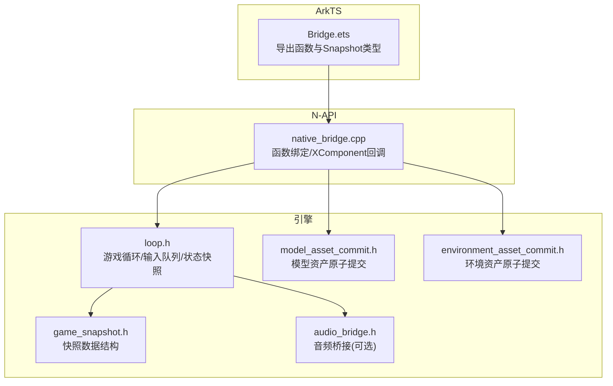
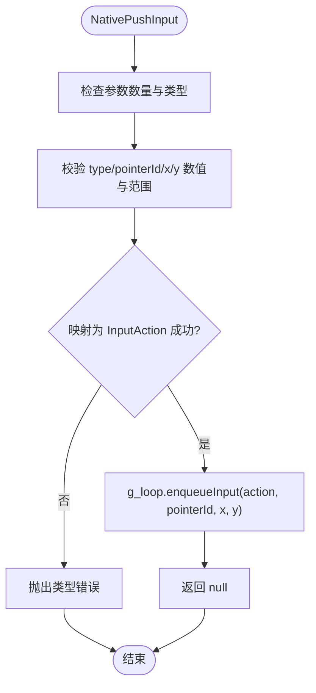
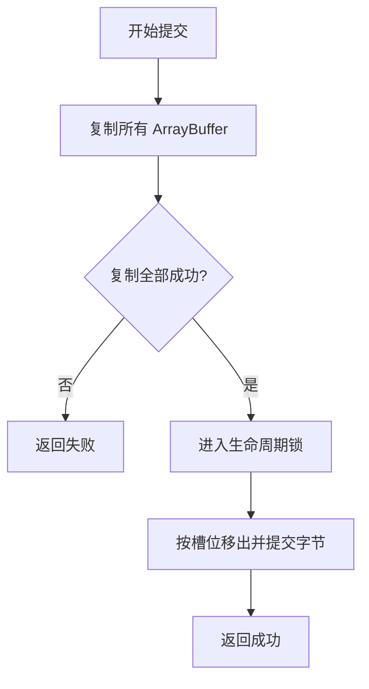
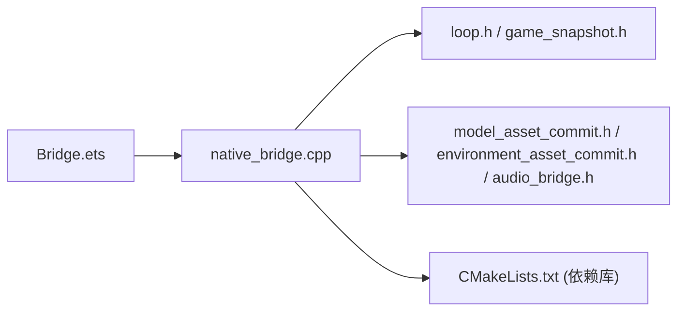

# 桥接层设计

<cite>
**本文引用的文件**   
- [Bridge.ets](file://entry/src/main/ets/napi/Bridge.ets)
- [native_bridge.cpp](file://entry/src/main/cpp/native_bridge.cpp)
- [Index.d.ts](file://entry/src/main/cpp/types/libnative_game/Index.d.ts)
- [CMakeLists.txt](file://entry/src/main/cpp/CMakeLists.txt)
- [loop.h](file://native/engine/core/loop.h)
- [game_snapshot.h](file://native/engine/core/game_snapshot.h)
- [model_asset_commit.h](file://native/platform/harmony/model_asset_commit.h)
- [environment_asset_commit.h](file://native/platform/harmony/environment_asset_commit.h)
- [audio_bridge.h](file://native/platform/harmony/audio_bridge.h)
- [test_bridge_contract.mjs](file://tests/test_bridge_contract.mjs)
</cite>

## 目录
1. [简介](#简介)
2. [项目结构](#项目结构)
3. [核心组件](#核心组件)
4. [架构总览](#架构总览)
5. [详细组件分析](#详细组件分析)
6. [依赖关系分析](#依赖关系分析)
7. [性能与内存管理](#性能与内存管理)
8. [故障排查指南](#故障排查指南)
9. [结论](#结论)
10. [附录：调用示例与最佳实践](#附录调用示例与最佳实践)

## 简介
本文件为 my-world 项目的 NAPI 桥接层提供系统化、可追溯的架构文档。重点覆盖以下方面：
- JavaScript（ArkTS）与 C++（N-API）之间的通信协议、数据类型映射与序列化策略
- Bridge.ets 中的接口定义、参数校验与错误处理约定
- native_bridge.cpp 中的绑定实现、类型转换、回调注册与异步生命周期
- TypeScript 类型声明 Index.d.ts 的自动生成与维护机制
- 数据序列化和反序列化策略（对象字段映射、数组与字符串处理）
- 性能优化、内存泄漏防护与调试支持

## 项目结构
桥接层由三层构成：
- ArkTS 侧：Bridge.ets 暴露给 UI 层的函数与 Snapshot 类型
- N-API 侧：native_bridge.cpp 将 ArkTS 调用转发到引擎 Loop，并注册 XComponent 回调
- 引擎侧：Loop、GameSnapshot、平台资产提交辅助等模块提供运行时能力



**图示来源** 
- [Bridge.ets:1-94](file://entry/src/main/ets/napi/Bridge.ets#L1-L94)
- [native_bridge.cpp:1-577](file://entry/src/main/cpp/native_bridge.cpp#L1-L577)
- [loop.h:1-104](file://native/engine/core/loop.h#L1-L104)
- [game_snapshot.h:1-74](file://native/engine/core/game_snapshot.h#L1-L74)
- [model_asset_commit.h:1-30](file://native/platform/harmony/model_asset_commit.h#L1-L30)
- [environment_asset_commit.h:1-36](file://native/platform/harmony/environment_asset_commit.h#L1-L36)
- [audio_bridge.h:1-27](file://native/platform/harmony/audio_bridge.h#L1-L27)

**章节来源**
- [Bridge.ets:1-94](file://entry/src/main/ets/napi/Bridge.ets#L1-L94)
- [native_bridge.cpp:1-577](file://entry/src/main/cpp/native_bridge.cpp#L1-L577)
- [CMakeLists.txt:1-135](file://entry/src/main/cpp/CMakeLists.txt#L1-L135)

## 核心组件
- ArkTS 接口层（Bridge.ets）
  - 定义 InputEvent 与 Snapshot 接口
  - 导出 nativeStart/nativeStop/nativeStartIfForeground 等控制函数
  - 导出 pushInput/pushAction/startEncounter/advanceLevel/useSupply/retryBoss/toggleDebugHud/skipDemoPhase/pullSnapshot 等交互与查询接口
- N-API 绑定层（native_bridge.cpp）
  - 将 ArkTS 调用解析为 C++ 类型，进行严格参数校验
  - 通过 g_loop 访问引擎实例，执行输入入队、关卡推进、遭遇战启动等操作
  - 注册 XComponent 生命周期回调（OnSurfaceCreated/Changed/Destroyed）与触摸事件分发
  - 实现 pullSnapshot，将 GameSnapshot 转换为 JS 对象返回
- 引擎核心（loop.h, game_snapshot.h）
  - Loop 维护渲染表面、输入队列、相机、战斗控制器、遭遇控制器、演示导演、VFX、性能守卫、音频桥接等
  - GameSnapshot 作为跨语言的数据契约，包含玩家、目标、战斗、表现与调试信息

**章节来源**
- [Bridge.ets:1-94](file://entry/src/main/ets/napi/Bridge.ets#L1-L94)
- [native_bridge.cpp:1-577](file://entry/src/main/cpp/native_bridge.cpp#L1-L577)
- [loop.h:1-104](file://native/engine/core/loop.h#L1-L104)
- [game_snapshot.h:1-74](file://native/engine/core/game_snapshot.h#L1-L74)

## 架构总览
下图展示从 ArkTS 到 C++ 再到引擎的关键调用路径，包括输入、资源注入与快照拉取。

```mermaid
sequenceDiagram
participant UI as "ArkTS UI"
participant Bridge as "Bridge.ets"
participant NAPI as "native_bridge.cpp"
participant Loop as "Loop(engine)"
participant Snap as "GameSnapshot"
UI->>Bridge : 调用 pushInput/pushAction/startEncounter...
Bridge->>NAPI : 通过 libnative_game.so 调用对应函数
NAPI->>NAPI : 参数校验与类型转换
NAPI->>Loop : enqueueInput/startEncounter/advanceLevel...
Loop-->>Loop : 更新内部状态/队列
UI->>Bridge : 调用 pullSnapshot()
Bridge->>NAPI : NativePullSnapshot
NAPI->>Loop : snapshot()
Loop-->>NAPI : GameSnapshot
NAPI-->>UI : 构造JS对象返回
```

**图示来源** 
- [Bridge.ets:77-94](file://entry/src/main/ets/napi/Bridge.ets#L77-L94)
- [native_bridge.cpp:212-358](file://entry/src/main/cpp/native_bridge.cpp#L212-L358)
- [native_bridge.cpp:360-516](file://entry/src/main/cpp/native_bridge.cpp#L360-L516)
- [loop.h:88-98](file://native/engine/core/loop.h#L88-L98)
- [game_snapshot.h:7-73](file://native/engine/core/game_snapshot.h#L7-L73)

## 详细组件分析

### ArkTS 接口层（Bridge.ets）
- 输入事件接口 InputEvent
  - 字段：type、pointerId、x、y
  - 用途：向原生层推送原始触摸坐标与指针动作
- 快照接口 Snapshot
  - 字段涵盖 tick、hp/poise/stamina/resonance、位置与相机角度、战斗阶段、渲染就绪标志、性能级别、调试 HUD、Boss 相关状态等
  - 用于 UI 每帧轮询渲染最新状态
- 导出函数
  - 生命周期：nativeStart、nativeStop、nativeStartIfForeground
  - 资源注入：nativeSetModelAssets、nativeSetEnvironmentAssets
  - 输入与动作：pushInput、pushAction
  - 流程控制：startEncounter、advanceLevel、useSupply、retryBoss、skipDemoPhase
  - 调试：toggleDebugHud
  - 数据读取：pullSnapshot

**章节来源**
- [Bridge.ets:1-94](file://entry/src/main/ets/napi/Bridge.ets#L1-L94)

### N-API 绑定层（native_bridge.cpp）
- 参数校验与类型转换
  - 使用 napi_* API 检查参数数量、类型与数值范围
  - 对数字进行有限性检查与整型转换，避免溢出与非整数误用
  - 统一抛出类型错误，便于上层捕获
- 输入与动作
  - pushInput：校验对象字段 type/pointerId/x/y，映射为 InputAction 后入队
  - pushAction：校验 action 类型 0..5，映射为攻击/闪避/辉印/脉流/蚀质/终结，入队
- 资源注入
  - nativeSetModelAssets：复制三个 ArrayBuffer，通过 CopyAndCommitModelAssets 原子提交至 Surface
  - nativeSetEnvironmentAssets：复制四个 ArrayBuffer，通过 CopyAndCommitEnvironmentAssets 原子提交
- 生命周期与渲染
  - OnSurfaceCreated/Changed/Destroyed：初始化或调整 surface，必要时停止/重启循环
  - DispatchTouchEvent：通过 OH_NativeXComponent_GetTouchEvent 获取触摸事件，转发到 ForwardChangedPointer 并入队
- 快照拉取
  - NativePullSnapshot：从 Loop.snapshot() 获取 GameSnapshot，逐项创建 JS 值并设置属性，返回对象



**图示来源** 
- [native_bridge.cpp:212-250](file://entry/src/main/cpp/native_bridge.cpp#L212-L250)

**章节来源**
- [native_bridge.cpp:1-577](file://entry/src/main/cpp/native_bridge.cpp#L1-L577)

### 引擎核心（loop.h, game_snapshot.h）
- Loop
  - 维护 surface、input、camera、combat、encounter、demoDirector、vfxSystem、performanceGuard、audioBridge
  - 提供 start/stop/tickOnce/updateFixed/processInput/resetInput 等方法
  - withLifecycle 保证在生命周期锁内执行关键操作
  - enqueueInput 线程安全地入队输入事件
  - snapshot 读取当前快照
- GameSnapshot
  - 定义所有跨语言共享的状态字段，确保 ArkTS 与 C++ 一致

```mermaid
classDiagram
class Loop {
+surface
+input
+touchRouter
+joystick
+cameraGesture
+intent
+playerController
+camera
+softTargeting
+combat
+encounter
+demoDirector
+vfxSystem
+performanceGuard
+audioBridge
+debugHud_
+fixedStep
+snapshots
+lifecycle
+running
+shouldStop
+runner
+fps
+tickCount
+lastFpsTime
+start()
+stop()
+tickOnce(elapsedMs)
+updateFixed(tick, dtMs)
+processInput()
+resetInput()
+enqueueInput(action, pointerId, x, y) bool
+snapshot() GameSnapshot
+withLifecycle(operation)
}
class GameSnapshot {
+tick
+hp
+poise
+playerX
+playerY
+fps
+moving
+targetId
+bossPhase
+encounterMode
+encounterState
+rendererReady
+moveX
+moveY
+cameraYaw
+cameraPitch
+targetDist
+comboSegment
+targetHp
+targetPoise
+stamina
+resonance
+hasInsight
+invulnerable
+insightMs
+pulseHitRemainingMs
+lastRejectReason
+currentAction
+comboWindowMs
+radianceCooldownMs
+currentCooldownMs
+corruptionCooldownMs
+ultimateWindowMs
+targetPoiseBroken
+radianceAttached
+currentAttached
+corruptionAttached
+corroded
+currentReaction
+pulsePhase
+levelStage
+gateState
+supplyState
+bossHp
+bossPoise
+bossMechanic
+bossCastMs
+perfLevel
+vfxFlags
+cameraShakeX
+cameraShakeY
+bossHpRatio
+bossCastRatio
+debugHud
+environmentReady
+environmentDrawCalls
+environmentTriangles
+objectiveLabel
+resonanceSlots
+showDebugHud
+inputEventCount
+bossCinematicProgress
+bossShardCount
+bossSourceColor
+bossRingBroken
}
Loop --> GameSnapshot : "snapshot()"
```



**图示来源** 
- [loop.h:26-104](file://native/engine/core/loop.h#L26-L104)
- [game_snapshot.h:7-73](file://native/engine/core/game_snapshot.h#L7-L73)

**章节来源**
- [loop.h:1-104](file://native/engine/core/loop.h#L1-L104)
- [game_snapshot.h:1-74](file://native/engine/core/game_snapshot.h#L1-L74)

### 平台资产提交（model_asset_commit.h, environment_asset_commit.h）
- 模型资产提交
  - CopyAndCommitModelAssets：先复制三份 ArrayBuffer，再在生命周期锁中一次性提交 Player/Enemy/Boss
- 环境资产提交
  - CopyAndCommitEnvironmentAssets：先复制四份 ArrayBuffer，再在生命周期锁中按槽位提交 OuterRing/CenterRift/Backdrop/Decoration



**图示来源** 
- [model_asset_commit.h:15-29](file://native/platform/harmony/model_asset_commit.h#L15-L29)
- [environment_asset_commit.h:18-35](file://native/platform/harmony/environment_asset_commit.h#L18-L35)

**章节来源**
- [model_asset_commit.h:1-30](file://native/platform/harmony/model_asset_commit.h#L1-L30)
- [environment_asset_commit.h:1-36](file://native/platform/harmony/environment_asset_commit.h#L1-L36)

### 音频桥接（audio_bridge.h）
- AudioBridge 根据战斗事件批次派发音效；在不支持 OHAudioRenderer 的设备上退化为静默无操作
- 与 Loop 集成，在 start/stop 时启停音频渲染

**章节来源**
- [audio_bridge.h:1-27](file://native/platform/harmony/audio_bridge.h#L1-L27)

## 依赖关系分析
- ArkTS 通过 import native from 'libnative_game.so' 调用 N-API 导出的函数
- native_bridge.cpp 通过 CMakeLists.txt 链接 ACE NAPI、窗口系统、EGL/GLES、日志库等
- native_bridge.cpp 依赖 engine/core/loop.h 提供的 Loop 实例，以及 platform/harmony 下的资产提交与音频桥接



**图示来源** 
- [Bridge.ets:1](file://entry/src/main/ets/napi/Bridge.ets#L1)
- [native_bridge.cpp:1-12](file://entry/src/main/cpp/native_bridge.cpp#L1-L12)
- [CMakeLists.txt:126-134](file://entry/src/main/cpp/CMakeLists.txt#L126-L134)

**章节来源**
- [CMakeLists.txt:1-135](file://entry/src/main/cpp/CMakeLists.txt#L1-L135)

## 性能与内存管理
- 输入入队
  - 使用互斥锁保护 inputSequence 与 inputEventCount_，避免竞争条件
  - 限制最大时间步长（tickOnce 中 min(elapsedMs, 250)），防止卡顿放大
- 资源注入
  - 使用 CopyArrayBuffer 将 JS ArrayBuffer 复制到 std::vector<uint8_t>，避免跨边界引用悬空
  - 通过 CopyAndCommit* 模板在生命周期锁内原子提交，减少中间态不一致
- 快照构建
  - 逐字段 napi_create_* 与 napi_set_named_property，避免 JSON 序列化开销
  - 固定字段顺序，确保 TS 类型与 JS 对象一致
- 生命周期
  - g_foregroundRequested 原子变量协调前台请求与 XComponent 回调，避免后台启动渲染
  - OnSurfaceChanged/Destroyed 中及时 stop 与 InvalidateSurfaceSnapshot，释放资源

[本节为通用指导，不直接分析具体文件]

## 故障排查指南
- 参数校验失败
  - 现象：N-API 抛出类型错误
  - 排查：检查 ArkTS 传入参数的类型、范围与必填字段
  - 参考：pushInput/pushAction/startEncounter/skipDemoPhase 的参数校验逻辑
- 触摸事件未生效
  - 现象：输入未入队或无效
  - 排查：确认 XComponent 回调已注册且 OH_NativeXComponent_GetTouchEvent 成功；检查 ForwardChangedPointer 映射
- 资源注入失败
  - 现象：nativeSetModelAssets/nativeSetEnvironmentAssets 返回 false
  - 排查：确认 ArrayBuffer 非空且长度正确；检查 CopyAndCommit* 是否进入生命周期锁
- 渲染未启动
  - 现象：surface.ready 为 false 导致 start 跳过
  - 排查：确认 OnSurfaceCreated/Changed 成功初始化 surface；检查 foregroundRequested 状态

**章节来源**
- [native_bridge.cpp:212-358](file://entry/src/main/cpp/native_bridge.cpp#L212-L358)
- [native_bridge.cpp:59-111](file://entry/src/main/cpp/native_bridge.cpp#L59-L111)
- [test_bridge_contract.mjs:202-232](file://tests/test_bridge_contract.mjs#L202-L232)

## 结论
本桥接层以严格的类型校验与原子化的资源提交为核心，结合 XComponent 生命周期管理与稳定的快照契约，实现了 ArkTS 与 C++ 之间高效、可靠的通信。通过统一的输入入队、资源注入与快照拉取机制，既保证了性能，也降低了跨语言调用的复杂度与出错概率。

[本节为总结，不直接分析具体文件]

## 附录：调用示例与最佳实践
- 输入事件推送
  - 在 UI 层构造 InputEvent（type/pointerId/x/y），调用 Bridge.pushInput(e)
  - 注意：type 必须为 0..3 的指针动作，pointerId 为整数，x/y 为有限浮点
- 动作触发
  - 调用 Bridge.pushAction(type)，type 为 0..5 的动作索引
- 资源加载与注入
  - 并发读取 models/*.glb 与 environment/*.glb 为 ArrayBuffer
  - 调用 nativeSetModelAssets(player, enemy, boss) 与 nativeSetEnvironmentAssets(outer, center, backdrop, decoration)
  - 成功后调用 nativeStartIfForeground() 仅在前景状态下启动渲染
- 快照轮询
  - 每帧调用 Bridge.pullSnapshot()，读取 Snapshot 字段更新 UI
  - 关注 rendererReady、environmentReady、perfLevel、debugHud 等标志位
- 错误处理
  - 对 pushInput/pushAction/startEncounter/skipDemoPhase 的返回值与异常进行捕获
  - 记录失败原因与上下文，便于定位问题

[本节为通用指导，不直接分析具体文件]