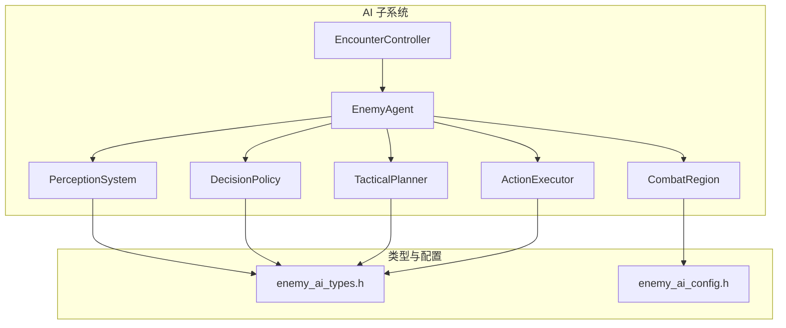
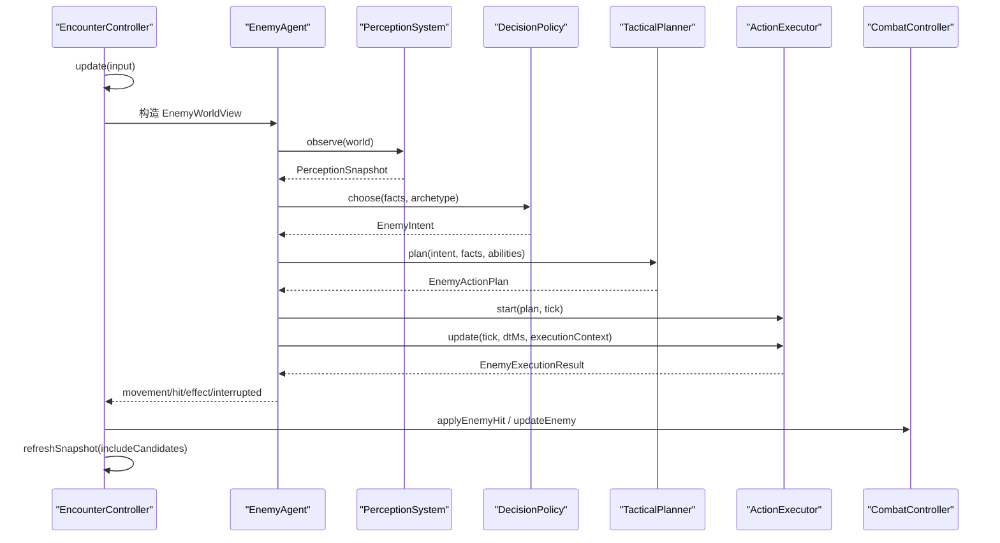
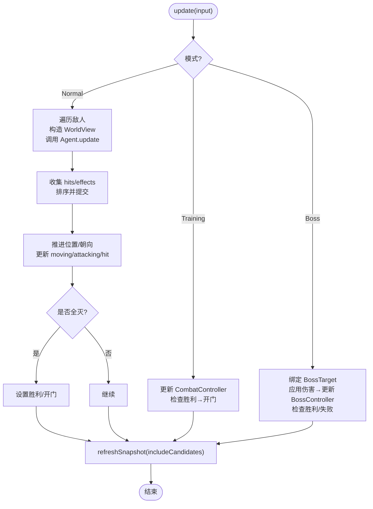
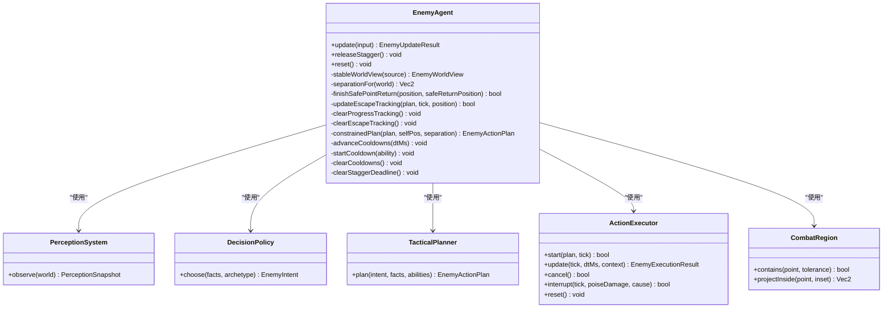
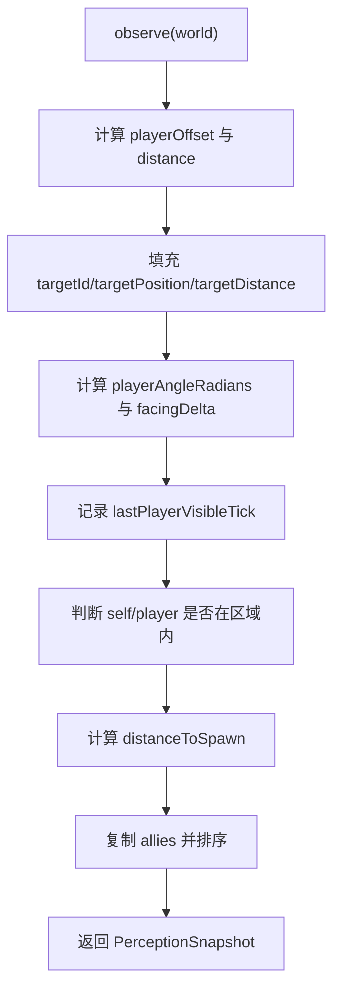
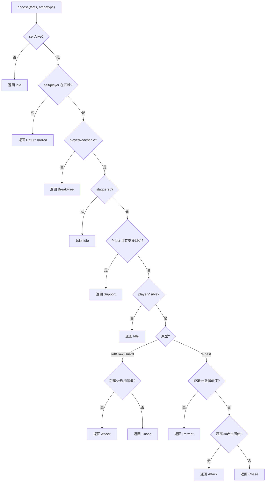
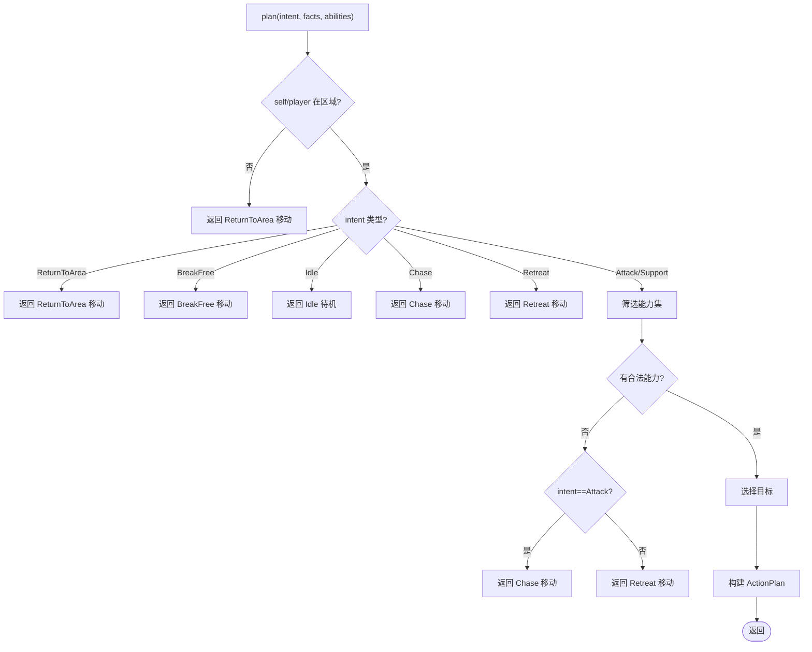
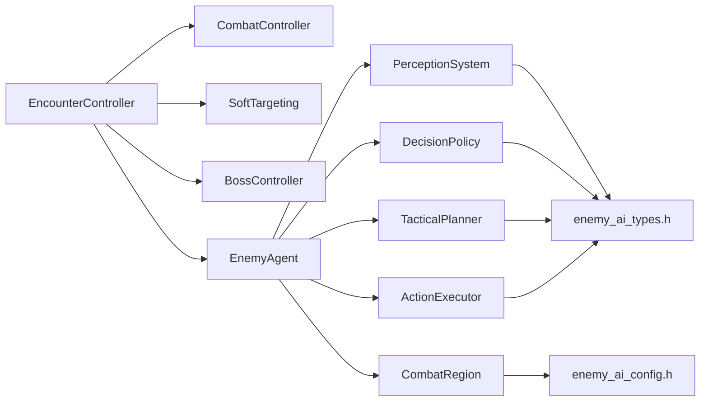

# AI 行为系统

<cite>
**本文引用的文件**   
- [encounter_controller.h](file://native/gameplay/ai/encounter_controller.h)
- [encounter_controller.cpp](file://native/gameplay/ai/encounter_controller.cpp)
- [enemy_agent.h](file://native/gameplay/ai/enemy_agent.h)
- [enemy_agent.cpp](file://native/gameplay/ai/enemy_agent.cpp)
- [perception_system.h](file://native/gameplay/ai/perception_system.h)
- [perception_system.cpp](file://native/gameplay/ai/perception_system.cpp)
- [tactical_planner.h](file://native/gameplay/ai/tactical_planner.h)
- [tactical_planner.cpp](file://native/gameplay/ai/tactical_planner.cpp)
- [decision_policy.h](file://native/gameplay/ai/decision_policy.h)
- [decision_policy.cpp](file://native/gameplay/ai/decision_policy.cpp)
- [action_executor.h](file://native/gameplay/ai/action_executor.h)
- [combat_region.h](file://native/gameplay/ai/combat_region.h)
- [enemy_ai_types.h](file://native/gameplay/ai/enemy_ai_types.h)
- [enemy_ai_config.h](file://native/gameplay/ai/enemy_ai_config.h)
- [2026-07-17-enemy-ai-design.md](file://docs/superpowers/specs/2026-07-17-enemy-ai-design.md)
</cite>

## 目录
1. [简介](#简介)
2. [项目结构](#项目结构)
3. [核心组件](#核心组件)
4. [架构总览](#架构总览)
5. [详细组件分析](#详细组件分析)
6. [依赖关系分析](#依赖关系分析)
7. [性能考虑](#性能考虑)
8. [故障排查指南](#故障排查指南)
9. [结论](#结论)
10. [附录](#附录)

## 简介
本技术文档面向 my-world 的 AI 行为系统，聚焦以下目标：
- 遭遇战管理：EncounterController 的敌人生成策略、战斗区域管理与关卡进度控制。
- 个体 AI：EnemyAgent 的决策树实现、行为状态管理与目标选择算法。
- 感知系统：PerceptionSystem 的视野检测、声音感知与环境信息收集。
- 战术规划：TacticalPlanner 的路径规划、阵型调整与协同攻击策略。
- 实战示例：敌人 AI 决策过程、感知更新机制与战术执行逻辑的代码级说明。
- 优化与调试：AI 性能优化、行为调优与调试可视化工具的关键实现要点。

## 项目结构
AI 子系统位于 native/gameplay/ai 目录，围绕“分层 AI 框架＋可插拔策略”的组织方式构建，核心文件包括：
- 遭遇控制器：encounter_controller.{h,cpp}
- 个体 AI：enemy_agent.{h,cpp}
- 感知系统：perception_system.{h,cpp}
- 决策策略：decision_policy.{h,cpp}
- 战术规划：tactical_planner.{h,cpp}
- 动作执行：action_executor.h（声明）
- 区域约束：combat_region.h
- 类型与配置：enemy_ai_types.h、enemy_ai_config.h

**图表来源** 
- [encounter_controller.h:108-151](file://native/gameplay/ai/encounter_controller.h#L108-L151)
- [enemy_agent.h:55-107](file://native/gameplay/ai/enemy_agent.h#L55-L107)
- [perception_system.h:41-45](file://native/gameplay/ai/perception_system.h#L41-L45)
- [decision_policy.h:5-9](file://native/gameplay/ai/decision_policy.h#L5-L9)
- [tactical_planner.h:7-12](file://native/gameplay/ai/tactical_planner.h#L7-L12)
- [action_executor.h:33-67](file://native/gameplay/ai/action_executor.h#L33-L67)
- [combat_region.h:8-26](file://native/gameplay/ai/combat_region.h#L8-L26)
- [enemy_ai_types.h:12-160](file://native/gameplay/ai/enemy_ai_types.h#L12-L160)
- [enemy_ai_config.h:16-124](file://native/gameplay/ai/enemy_ai_config.h#L16-L124)

**章节来源**
- [encounter_controller.h:108-151](file://native/gameplay/ai/encounter_controller.h#L108-L151)
- [enemy_agent.h:55-107](file://native/gameplay/ai/enemy_agent.h#L55-L107)
- [perception_system.h:41-45](file://native/gameplay/ai/perception_system.h#L41-L45)
- [decision_policy.h:5-9](file://native/gameplay/ai/decision_policy.h#L5-L9)
- [tactical_planner.h:7-12](file://native/gameplay/ai/tactical_planner.h#L7-L12)
- [action_executor.h:33-67](file://native/gameplay/ai/action_executor.h#L33-L67)
- [combat_region.h:8-26](file://native/gameplay/ai/combat_region.h#L8-L26)
- [enemy_ai_types.h:12-160](file://native/gameplay/ai/enemy_ai_types.h#L12-L160)
- [enemy_ai_config.h:16-124](file://native/gameplay/ai/enemy_ai_config.h#L16-L124)

## 核心组件
- EncounterController：负责遭遇模式切换、敌人生成、区域与关卡流程控制、事件聚合与快照刷新。
- EnemyAgent：单个敌人的完整 AI 生命周期，组合感知、策略、战术与执行器，输出移动、攻击与效果请求。
- PerceptionSystem：将世界视图转换为不可变的感知快照，包含玩家可见性、距离角度、区域内外、友军摘要等。
- DecisionPolicy：基于感知与原型返回高层意图（Idle/Chase/Attack/Retreat/Support/ReturnToArea/BreakFree）。
- TacticalPlanner：将意图解析为具体能力、目标与期望位置，处理冷却、范围、目标策略与降级。
- ActionExecutor：推进动作时间线（移动、前摇、判定帧、恢复），处理取消、打断与硬直，产出命中与效果。
- CombatRegion：区域包含判断、投影与稳定分离计算，确保边界与避免重叠。

**章节来源**
- [encounter_controller.h:108-151](file://native/gameplay/ai/encounter_controller.h#L108-L151)
- [encounter_controller.cpp:187-273](file://native/gameplay/ai/encounter_controller.cpp#L187-L273)
- [enemy_agent.h:55-107](file://native/gameplay/ai/enemy_agent.h#L55-L107)
- [perception_system.h:41-45](file://native/gameplay/ai/perception_system.h#L41-L45)
- [decision_policy.h:5-9](file://native/gameplay/ai/decision_policy.h#L5-L9)
- [tactical_planner.h:7-12](file://native/gameplay/ai/tactical_planner.h#L7-L12)
- [action_executor.h:33-67](file://native/gameplay/ai/action_executor.h#L33-L67)
- [combat_region.h:8-26](file://native/gameplay/ai/combat_region.h#L8-L26)

## 架构总览
AI 管线遵循固定 tick 单向数据流：EncounterController → PerceptionSystem → DecisionPolicy → TacticalPlanner → ActionExecutor → 战斗结算 → 快照发布。每个 tick 严格顺序推进，保证确定性与可测试性。

**图表来源** 
- [encounter_controller.cpp:296-492](file://native/gameplay/ai/encounter_controller.cpp#L296-L492)
- [enemy_agent.cpp:271-373](file://native/gameplay/ai/enemy_agent.cpp#L271-L373)
- [perception_system.cpp:32-74](file://native/gameplay/ai/perception_system.cpp#L32-L74)
- [decision_policy.cpp:25-48](file://native/gameplay/ai/decision_policy.cpp#L25-L48)
- [tactical_planner.cpp:124-199](file://native/gameplay/ai/tactical_planner.cpp#L124-L199)
- [action_executor.h:33-67](file://native/gameplay/ai/action_executor.h#L33-L67)

## 详细组件分析

### EncounterController 遭遇战管理
- 模式与配置：支持 Training/Beast/Mixed/Guard/LevelFlow/Boss；通过 forMode 生成默认敌人配置与区域。
- 启动与校验：validConfig 检查最大敌人数量、区域合法性、ID 唯一性与数值有效性；start 原子创建并初始化。
- 每帧更新：
  - 训练模式：直接驱动 CombatController，胜利时打开门。
  - Boss 模式：绑定 BossTarget，应用伤害到 BossController，根据最终能力触发阶段。
  - 普通模式：为每个敌人构造 EnemyWorldView，调用 EnemyAgent.update，汇总 hit/effect，排序后提交至 CombatController。
- 关卡推进：advanceLevel 按 Stage 序列切换模式，Supply 阶段提供补给，Boss 阶段独立运行。
- 快照刷新：refreshSnapshot 聚合敌人状态、软锁定候选与 Boss 信息。

**图表来源** 
- [encounter_controller.cpp:296-492](file://native/gameplay/ai/encounter_controller.cpp#L296-L492)
- [encounter_controller.cpp:550-596](file://native/gameplay/ai/encounter_controller.cpp#L550-L596)
- [encounter_controller.cpp:598-607](file://native/gameplay/ai/encounter_controller.cpp#L598-L607)
- [encounter_controller.cpp:609-628](file://native/gameplay/ai/encounter_controller.cpp#L609-L628)

**章节来源**
- [encounter_controller.h:42-101](file://native/gameplay/ai/encounter_controller.h#L42-L101)
- [encounter_controller.cpp:134-164](file://native/gameplay/ai/encounter_controller.cpp#L134-L164)
- [encounter_controller.cpp:192-220](file://native/gameplay/ai/encounter_controller.cpp#L192-L220)
- [encounter_controller.cpp:222-273](file://native/gameplay/ai/encounter_controller.cpp#L222-L273)
- [encounter_controller.cpp:296-492](file://native/gameplay/ai/encounter_controller.cpp#L296-L492)
- [encounter_controller.cpp:550-596](file://native/gameplay/ai/encounter_controller.cpp#L550-L596)
- [encounter_controller.cpp:598-607](file://native/gameplay/ai/encounter_controller.cpp#L598-L607)
- [encounter_controller.cpp:609-628](file://native/gameplay/ai/encounter_controller.cpp#L609-L628)

### EnemyAgent 个体 AI 行为
- 输入与结果：update 接收 EnemyWorldView、dtMs、ExecutionContext 与可选中断，输出 Intent、Plan、Phase、Movement、Hit/Effect 与脱困状态。
- 感知与记忆：调用 PerceptionSystem.observe 生成不可变快照，缓存 perceptionMemory_ 用于稳定性。
- 破韧与硬直：staggerLatched_ 标记受击硬直，支持延迟释放与重置；interrupt 支持韧性伤害打断。
- 脱困与回归：updateEscapeTracking 跟踪目标接近度，连续无进展则进入 ReturningToSafePoint；finishSafePointReturn 到达安全点取消计划。
- 分离与约束：separationFor 计算友军分离向量；constrainedPlan 投影到区域内并叠加分离，确保不越界与不重叠。
- 冷却管理：advanceCooldowns/startCooldown/clearCooldowns 维护 AbilityState 的剩余冷却。

**图表来源** 
- [enemy_agent.h:55-107](file://native/gameplay/ai/enemy_agent.h#L55-L107)
- [perception_system.h:41-45](file://native/gameplay/ai/perception_system.h#L41-L45)
- [decision_policy.h:5-9](file://native/gameplay/ai/decision_policy.h#L5-L9)
- [tactical_planner.h:7-12](file://native/gameplay/ai/tactical_planner.h#L7-L12)
- [action_executor.h:33-67](file://native/gameplay/ai/action_executor.h#L33-L67)
- [combat_region.h:8-26](file://native/gameplay/ai/combat_region.h#L8-L26)

**章节来源**
- [enemy_agent.cpp:271-373](file://native/gameplay/ai/enemy_agent.cpp#L271-L373)
- [enemy_agent.cpp:132-145](file://native/gameplay/ai/enemy_agent.cpp#L132-L145)
- [enemy_agent.cpp:147-157](file://native/gameplay/ai/enemy_agent.cpp#L147-L157)
- [enemy_agent.cpp:159-212](file://native/gameplay/ai/enemy_agent.cpp#L159-L212)
- [enemy_agent.cpp:230-242](file://native/gameplay/ai/enemy_agent.cpp#L230-L242)
- [enemy_agent.cpp:244-264](file://native/gameplay/ai/enemy_agent.cpp#L244-L264)

### PerceptionSystem 感知系统
- 输入：EnemyWorldView（tick、自身与玩家位置/朝向、区域、可达性、韧性、动作阶段、友军列表）。
- 输出：PerceptionSnapshot（tick、self/target 位置/距离/可见性、角度差、lastVisibleTick、威胁值、区域内外、安全返回点、spawn 距离、最近受击、韧性/硬直、动作阶段、友军摘要）。
- 特性：只收集事实，不做策略判断；友军摘要按 ID 稳定排序；角度归一化与距离计算保证确定性。

**图表来源** 
- [perception_system.cpp:32-74](file://native/gameplay/ai/perception_system.cpp#L32-L74)

**章节来源**
- [perception_system.h:7-39](file://native/gameplay/ai/perception_system.h#L7-L39)
- [perception_system.cpp:32-74](file://native/gameplay/ai/perception_system.cpp#L32-L74)

### DecisionPolicy 决策策略
- 规则优先级：存活→区域内外→可达性→破韧→支援需求→可见性→原型特定阈值。
- 原型行为：
  - RiftClaw/Guard：近战阈值内 Attack，否则 Chase。
  - Priest：近距 Retreat，中距 Attack，远距 Chase；若存在低护盾友军在支援范围内，优先 Support。
- 输出：EnemyIntent（Idle/Chase/Attack/Retreat/ReturnToArea/BreakFree/Support）。

**图表来源** 
- [decision_policy.cpp:25-48](file://native/gameplay/ai/decision_policy.cpp#L25-L48)

**章节来源**
- [decision_policy.h:5-9](file://native/gameplay/ai/decision_policy.h#L5-L9)
- [decision_policy.cpp:25-48](file://native/gameplay/ai/decision_policy.cpp#L25-L48)

### TacticalPlanner 战术规划
- 输入：EnemyIntent、PerceptionSnapshot、abilities（含冷却）。
- 输出：EnemyActionPlan（state、intent、phase、ability、targetId、desiredPosition、movement、fallbackReason）。
- 关键逻辑：
  - 区域外或玩家不在区域：ReturnToArea。
  - 非攻击/支援意图：Chase/Retreat/Idle/BreakFree 对应移动或待机。
  - 能力筛选：按 category、cooldown、range、targetPolicy 过滤，选择最佳 ability（权重优先，余量次之，ID 稳定）。
  - 无合法能力：Attack→Chase 或 Idle（无目标），其他→Retreat。
  - 目标选择：Self/CurrentTarget/NearestHostile/LowestHealthHostile/LowestShieldAlly。

**图表来源** 
- [tactical_planner.cpp:124-199](file://native/gameplay/ai/tactical_planner.cpp#L124-L199)

**章节来源**
- [tactical_planner.h:7-12](file://native/gameplay/ai/tactical_planner.h#L7-L12)
- [tactical_planner.cpp:124-199](file://native/gameplay/ai/tactical_planner.cpp#L124-L199)

### ActionExecutor 动作执行
- 职责：推进移动、转向、前摇、有效帧、恢复期；处理取消、打断与硬直；产出 HitRequest 与 CombatEffectRequest。
- 事务性：每个动作最多一次命中，大步 tick 不重复命中；sequence/transactionId 保证确定性。
- 中断策略：依据 cancelPolicy 允许 WindupOnly/WindupAndActive 中断；PoiseBreak 强制中止并进入恢复。

**章节来源**
- [action_executor.h:8-31](file://native/gameplay/ai/action_executor.h#L8-L31)
- [action_executor.h:33-67](file://native/gameplay/ai/action_executor.h#L33-L67)

### CombatRegion 区域约束
- 功能：contains(point, tolerance)、projectInside(point, inset)、stableSeparation(selfId, selfPos, otherId, otherPos, minDist)。
- 作用：确保敌人移动与目标选择不越界，避免重叠卡死，提供稳定分离方向。

**章节来源**
- [combat_region.h:8-26](file://native/gameplay/ai/combat_region.h#L8-L26)

## 依赖关系分析
- EncounterController 依赖 CombatController、SoftTargeting、BossController、EnemyAgent、EnemyArchetypes。
- EnemyAgent 组合 PerceptionSystem、DecisionPolicy、TacticalPlanner、ActionExecutor、CombatRegion。
- PerceptionSystem、DecisionPolicy、TacticalPlanner、ActionExecutor 均依赖 enemy_ai_types.h 与 enemy_ai_config.h 提供的强类型契约。

**图表来源** 
- [encounter_controller.h:1-7](file://native/gameplay/ai/encounter_controller.h#L1-L7)
- [enemy_agent.h:1-9](file://native/gameplay/ai/enemy_agent.h#L1-L9)
- [perception_system.h:1-4](file://native/gameplay/ai/perception_system.h#L1-L4)
- [decision_policy.h:1-4](file://native/gameplay/ai/decision_policy.h#L1-L4)
- [tactical_planner.h:1-4](file://native/gameplay/ai/tactical_planner.h#L1-L4)
- [action_executor.h:1-4](file://native/gameplay/ai/action_executor.h#L1-L4)
- [combat_region.h:1-4](file://native/gameplay/ai/combat_region.h#L1-L4)

**章节来源**
- [encounter_controller.h:1-7](file://native/gameplay/ai/encounter_controller.h#L1-L7)
- [enemy_agent.h:1-9](file://native/gameplay/ai/enemy_agent.h#L1-L9)
- [perception_system.h:1-4](file://native/gameplay/ai/perception_system.h#L1-L4)
- [decision_policy.h:1-4](file://native/gameplay/ai/decision_policy.h#L1-L4)
- [tactical_planner.h:1-4](file://native/gameplay/ai/tactical_planner.h#L1-L4)
- [action_executor.h:1-4](file://native/gameplay/ai/action_executor.h#L1-L4)
- [combat_region.h:1-4](file://native/gameplay/ai/combat_region.h#L1-L4)

## 性能考虑
- 确定性优先：所有计算基于固定 tick 与强类型配置，避免随机与墙钟依赖，便于单元测试与回放。
- 批量处理：EncounterController 对 hits/effects 排序后统一提交，减少多次调用开销。
- 最小化分配：PerceptionSnapshot 与 AllyPerception 预分配容量，减少动态分配。
- 冷却与状态缓存：EnemyAgent 缓存 lastPlan_ 与 perceptionMemory_，降低重复计算。
- 区域投影与分离：CombatRegion 提供 O(1) 投影与稳定分离，避免复杂路径搜索。

[本节为通用指导，无需源码引用]

## 故障排查指南
- 非法配置拒绝启动：validConfig/validated 会拒绝负时长、非正范围、未知标签与冲突的目标策略，需检查配置文件。
- 目标失效处理：目标在决策后死亡时取消计划，不转移命中；检查软锁定候选与目标存活状态。
- 脱困与回归：连续若干周期未接近目标将进入 ReturningToSafePoint；检查 minimumProgress/noProgressDecisionLimit 与 safePointTolerance。
- 打断与硬直：PoiseBreak/PoiseDamage 触发中断；确认 cancelPolicy 与 interruptThreshold 配置。
- 快照一致性：停止/复位后不得残留动作、读条、冷却、硬直或感知记忆；验证 reset/stop 调用时机。

**章节来源**
- [encounter_controller.cpp:192-220](file://native/gameplay/ai/encounter_controller.cpp#L192-L220)
- [enemy_agent.cpp:159-212](file://native/gameplay/ai/enemy_agent.cpp#L159-L212)
- [action_executor.h:8-31](file://native/gameplay/ai/action_executor.h#L8-L31)

## 结论
my-world 的 AI 行为系统以分层架构与强类型契约为核心，实现了从感知、决策、战术到执行的完整闭环。EncounterController 统一管理遭遇与关卡流程，EnemyAgent 协调各子系统完成个体 AI 行为，PerceptionSystem/DecisionPolicy/TacticalPlanner/ActionExecutor 各司其职且边界清晰。该设计兼顾性能、确定性与可扩展性，为后续首领、新敌人类型与更复杂策略预留了稳定接口。

[本节为总结，无需源码引用]

## 附录
- 设计规格参考：详见 docs/superpowers/specs/2026-07-17-enemy-ai-design.md，涵盖分层 AI 框架、三类灰盒敌人、区域约束、脱困、快照与验收标准。

**章节来源**
- [2026-07-17-enemy-ai-design.md:1-317](file://docs/superpowers/specs/2026-07-17-enemy-ai-design.md#L1-L317)