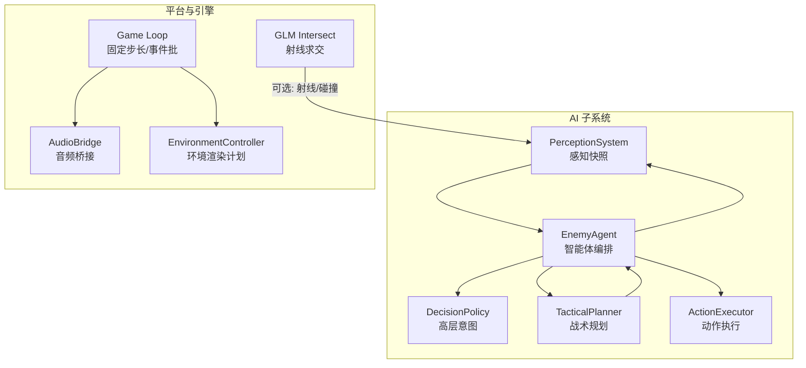
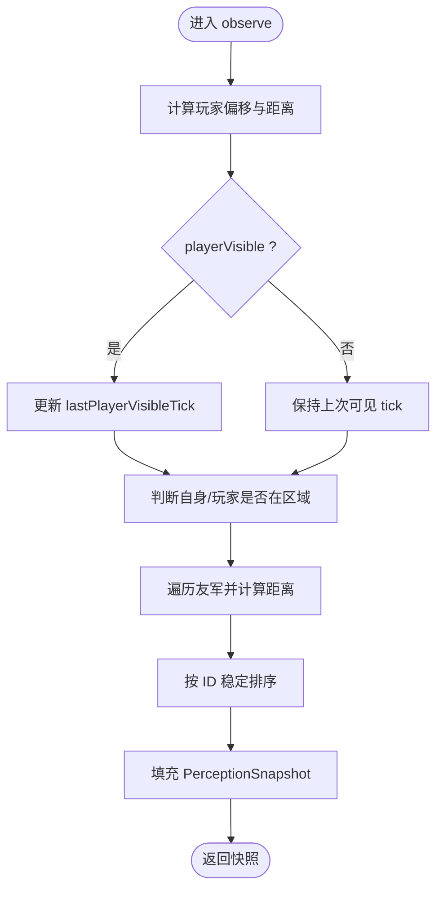
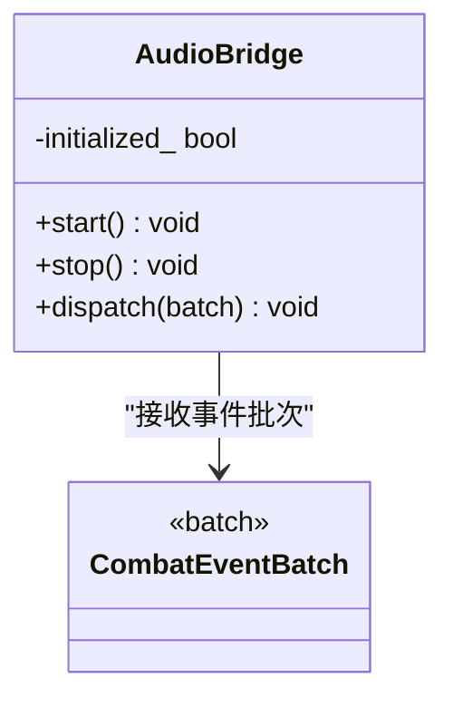
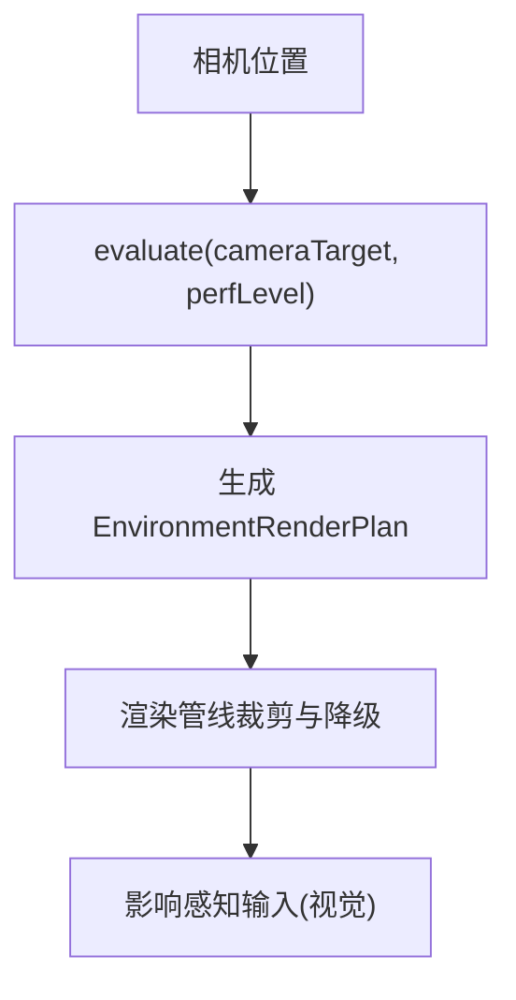
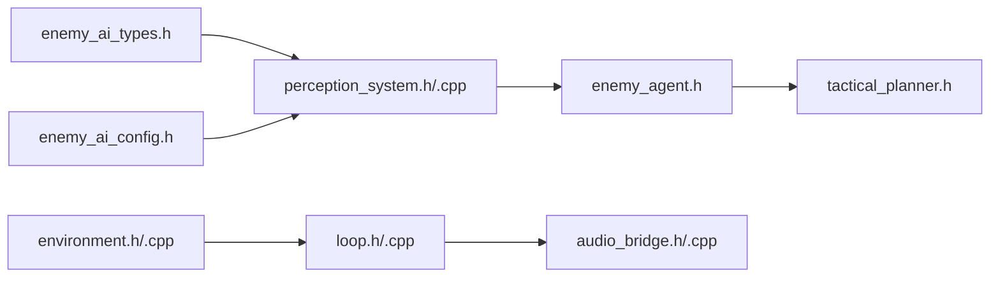

# 感知系统

<cite>
**本文引用的文件**   
- [perception_system.h](file://native/gameplay/ai/perception_system.h)
- [perception_system.cpp](file://native/gameplay/ai/perception_system.cpp)
- [enemy_ai_types.h](file://native/gameplay/ai/enemy_ai_types.h)
- [enemy_ai_config.h](file://native/gameplay/ai/enemy_ai_config.h)
- [enemy_agent.h](file://native/gameplay/ai/enemy_agent.h)
- [tactical_planner.h](file://native/gameplay/ai/tactical_planner.h)
- [test_enemy_perception.cpp](file://tests/test_enemy_perception.cpp)
- [audio_bridge.h](file://native/platform/harmony/audio_bridge.h)
- [audio_bridge.cpp](file://native/platform/harmony/audio_bridge.cpp)
- [environment.h](file://native/engine/render/environment.h)
- [environment.cpp](file://native/engine/render/environment.cpp)
- [loop.h](file://native/engine/core/loop.h)
- [loop.cpp](file://native/engine/core/loop.cpp)
- [intersect.inl](file://native/engine/math/glm/gtx/intersect.inl)
</cite>

## 目录
1. [简介](#简介)
2. [项目结构](#项目结构)
3. [核心组件](#核心组件)
4. [架构总览](#架构总览)
5. [详细组件分析](#详细组件分析)
6. [依赖关系分析](#依赖关系分析)
7. [性能考量](#性能考量)
8. [故障排查指南](#故障排查指南)
9. [结论](#结论)
10. [附录](#附录)

## 简介
本技术文档围绕 PerceptionSystem 感知系统展开，聚焦多模态感知架构的设计与实现：视觉感知、听觉感知与环境感知的职责边界、数据流与更新策略。当前仓库中已实现的感知模块以“事实收集”为核心，提供敌人视角下的玩家可见性、威胁度、可达性与友军摘要等结构化快照；同时为后续扩展（声音源定位、音量衰减、干扰排除、地形分析与路径可行性评估）预留了清晰的接口与数据结构空间。本文还给出射线投射与碰撞检测的可用工具、音频桥接的占位实现、环境渲染计划对感知输入的影响，以及调试与性能优化的实践建议。

## 项目结构
感知系统位于 AI 子系统内，与战斗、目标选择、战术规划、执行器共同构成敌方智能闭环。关键文件分布如下：
- 感知层：perception_system.h/.cpp，负责从 EnemyWorldView 构造 PerceptionSnapshot。
- 类型与配置：enemy_ai_types.h、enemy_ai_config.h，定义感知快照、区域配置与能力校验。
- 智能体编排：enemy_agent.h，组合感知、决策、规划与执行。
- 战术规划：tactical_planner.h，将意图与感知事实转化为可执行动作计划。
- 测试用例：test_enemy_perception.cpp，验证感知快照的一致性与稳定性。
- 音频桥接：audio_bridge.h/.cpp，按事件派发占位音效，为听觉感知提供基础。
- 环境渲染：environment.h/.cpp，依据相机位置与性能等级生成渲染计划，间接影响感知输入。
- 循环与事件分发：loop.h/.cpp，驱动固定步长更新、事件批处理与音频派发。
- 几何工具：glm gtx intersect.inl，提供射线与平面/三角形相交计算。



图表来源
- [perception_system.h:1-45](file://native/gameplay/ai/perception_system.h#L1-L45)
- [perception_system.cpp:1-75](file://native/gameplay/ai/perception_system.cpp#L1-L75)
- [enemy_agent.h:1-107](file://native/gameplay/ai/enemy_agent.h#L1-L107)
- [tactical_planner.h:1-12](file://native/gameplay/ai/tactical_planner.h#L1-L12)
- [audio_bridge.h:1-27](file://native/platform/harmony/audio_bridge.h#L1-L27)
- [environment.h:1-46](file://native/engine/render/environment.h#L1-L46)
- [loop.h:35-81](file://native/engine/core/loop.h#L35-L81)
- [intersect.inl:1-44](file://native/engine/math/glm/gtx/intersect.inl#L1-L44)

章节来源
- [perception_system.h:1-45](file://native/gameplay/ai/perception_system.h#L1-L45)
- [perception_system.cpp:1-75](file://native/gameplay/ai/perception_system.cpp#L1-L75)
- [enemy_ai_types.h:113-159](file://native/gameplay/ai/enemy_ai_types.h#L113-L159)
- [enemy_ai_config.h:11-44](file://native/gameplay/ai/enemy_ai_config.h#L11-L44)
- [enemy_agent.h:1-107](file://native/gameplay/ai/enemy_agent.h#L1-L107)
- [tactical_planner.h:1-12](file://native/gameplay/ai/tactical_planner.h#L1-L12)
- [audio_bridge.h:1-27](file://native/platform/harmony/audio_bridge.h#L1-L27)
- [environment.h:1-46](file://native/engine/render/environment.h#L1-L46)
- [loop.h:35-81](file://native/engine/core/loop.h#L35-L81)
- [intersect.inl:1-44](file://native/engine/math/glm/gtx/intersect.inl#L1-L44)

## 核心组件
- PerceptionSystem：纯函数式观察器，将 EnemyWorldView 投影为 PerceptionSnapshot，包含自身状态、玩家信息、区域关系、最近受击、韧性、硬直、动作阶段与友军摘要。
- PerceptionSnapshot：不可变的事实载体，不包含策略判断（如 canAttack），确保感知与决策解耦。
- EnemyWorldView：上层注入的世界视图，含玩家位置、可见性、威胁值、可达性、出生点与安全返回点、区域配置与友军列表。
- EnemyAgent：编排感知、决策、规划与执行，维护感知记忆与最后计划，控制冷却、分离与撤退逻辑。
- TacticalPlanner：基于意图与能力集合生成确定性动作计划，考虑距离、角度、冷却、目标规则与区域约束。
- AudioBridge：按 CombatEventBatch 派发占位音效，为未来听觉感知提供事件通道。
- EnvironmentController：根据相机位置与性能等级生成渲染计划，影响背景与装饰的绘制，间接影响感知输入。

章节来源
- [perception_system.h:1-45](file://native/gameplay/ai/perception_system.h#L1-L45)
- [perception_system.cpp:1-75](file://native/gameplay/ai/perception_system.cpp#L1-L75)
- [enemy_ai_types.h:113-159](file://native/gameplay/ai/enemy_ai_types.h#L113-L159)
- [enemy_agent.h:1-107](file://native/gameplay/ai/enemy_agent.h#L1-L107)
- [tactical_planner.h:1-12](file://native/gameplay/ai/tactical_planner.h#L1-L12)
- [audio_bridge.h:1-27](file://native/platform/harmony/audio_bridge.h#L1-L27)
- [environment.h:1-46](file://native/engine/render/environment.h#L1-L46)

## 架构总览
感知系统采用“事实收集 + 策略决策 + 战术规划 + 动作执行”的分层架构。PerceptionSystem 仅负责从世界视图提取事实，不引入策略分支；EnemyAgent 聚合感知、决策与规划，输出运动、目标候选与动作请求；TacticalPlanner 将意图映射到具体能力与目标；AudioBridge 在循环中将战斗事件转换为音效；EnvironmentController 根据相机与性能参数裁剪渲染内容。

```mermaid
sequenceDiagram
participant Loop as "游戏循环"
participant Agent as "EnemyAgent"
participant Perception as "PerceptionSystem"
participant Policy as "DecisionPolicy"
participant Planner as "TacticalPlanner"
participant Executor as "ActionExecutor"
participant Audio as "AudioBridge"
Loop->>Agent : update(EnemyUpdateInput)
Agent->>Perception : observe(world)
Perception-->>Agent : PerceptionSnapshot
Agent->>Policy : choose(intent, archetype)
Policy-->>Agent : EnemyIntent
Agent->>Planner : plan(intent, snapshot, abilities)
Planner-->>Agent : EnemyActionPlan
Agent->>Executor : execute(plan)
Executor-->>Agent : HitRequest/EffectRequest
Loop->>Audio : dispatch(CombatEventBatch)
```

图表来源
- [loop.h:35-81](file://native/engine/core/loop.h#L35-L81)
- [loop.cpp:514-587](file://native/engine/core/loop.cpp#L514-L587)
- [enemy_agent.h:1-107](file://native/gameplay/ai/enemy_agent.h#L1-L107)
- [perception_system.h:1-45](file://native/gameplay/ai/perception_system.h#L1-L45)
- [tactical_planner.h:1-12](file://native/gameplay/ai/tactical_planner.h#L1-L12)
- [audio_bridge.h:1-27](file://native/platform/harmony/audio_bridge.h#L1-L27)

## 详细组件分析

### 视觉感知：视野检测与可见性判断
- 输入：EnemyWorldView 中的 selfPosition、selfFacing、playerPosition、playerVisible、playerReachable、region、spawnPosition、safeReturnPosition、allies。
- 处理：
  - 计算玩家偏移与距离，记录玩家角度与朝向差。
  - 直接复用 playerVisible 作为可见性标志，并维护 lastPlayerVisibleTick。
  - 使用区域中心与半径判断自身与玩家是否在区域内。
  - 计算到出生点的距离，标记最近受击、韧性、硬直与动作阶段。
  - 汇总友军列表，计算各自到自身的距离并按 ID 稳定排序。
- 优化策略：
  - 避免重复计算：distanceToSpawn、insideRegion 等结果直接写入快照。
  - 排序保证确定性：友军列表按 ID 排序，便于断言与回放一致性。
  - 可扩展性：若需加入遮挡或视线检测，可在 observe 前插入射线投射步骤。



图表来源
- [perception_system.cpp:32-74](file://native/gameplay/ai/perception_system.cpp#L32-L74)
- [enemy_ai_types.h:113-159](file://native/gameplay/ai/enemy_ai_types.h#L113-L159)

章节来源
- [perception_system.cpp:1-75](file://native/gameplay/ai/perception_system.cpp#L1-L75)
- [enemy_ai_types.h:113-159](file://native/gameplay/ai/enemy_ai_types.h#L113-L159)
- [test_enemy_perception.cpp:57-108](file://tests/test_enemy_perception.cpp#L57-L108)

### 听觉感知：声音源定位、音量衰减与干扰排除
- 现状：AudioBridge 提供事件到占位音效的派发接口，尚未实现 OHAudioRenderer 的具体播放逻辑；当前为无操作降级。
- 设计要点：
  - 事件映射：Hit/Damage、Dodge、AuraApplied、Resonance、PhaseChanged、HitFlash、CameraShake、CastBarBroken 等事件对应不同合成波形。
  - 声源定位：未来可结合 3D 位置与方向向量进行声源定位与多普勒效果。
  - 音量衰减：按距离平方反比或指数衰减模型计算音量，支持障碍物遮挡衰减。
  - 干扰排除：通过频段滤波与优先级队列抑制噪声，保留关键事件音。
- 集成点：Game Loop 每帧将 CombatEventBatch 传入 AudioBridge.dispatch。



图表来源
- [audio_bridge.h:1-27](file://native/platform/harmony/audio_bridge.h#L1-L27)
- [audio_bridge.cpp:1-46](file://native/platform/harmony/audio_bridge.cpp#L1-L46)
- [loop.cpp:514-587](file://native/engine/core/loop.cpp#L514-L587)

章节来源
- [audio_bridge.h:1-27](file://native/platform/harmony/audio_bridge.h#L1-L27)
- [audio_bridge.cpp:1-46](file://native/platform/harmony/audio_bridge.cpp#L1-L46)
- [loop.cpp:514-587](file://native/engine/core/loop.cpp#L514-L587)

### 环境感知：地形分析、障碍物识别与路径可行性评估
- 现状：EnvironmentController 根据相机位置与性能等级生成渲染计划，决定是否绘制装饰、背景与纹理层级。
- 感知关联：
  - 渲染计划影响视觉反馈，间接改变感知输入（例如装饰不可见时减少视觉干扰）。
  - 未来可结合静态网格与碰撞体，进行地形高度采样、障碍识别与路径可行性评估。
- 工具支持：GLM gtx intersect.inl 提供射线与平面/三角形相交计算，可用于视线检测与碰撞探测。



图表来源
- [environment.h:1-46](file://native/engine/render/environment.h#L1-L46)
- [environment.cpp:1-31](file://native/engine/render/environment.cpp#L1-L31)
- [intersect.inl:1-44](file://native/engine/math/glm/gtx/intersect.inl#L1-L44)

章节来源
- [environment.h:1-46](file://native/engine/render/environment.h#L1-L46)
- [environment.cpp:1-31](file://native/engine/render/environment.cpp#L1-L31)
- [intersect.inl:1-44](file://native/engine/math/glm/gtx/intersect.inl#L1-L44)

### 感知数据缓存与更新策略
- 增量更新：PerceptionSystem::observe 每次基于最新 EnemyWorldView 构建新快照，天然支持增量更新。
- 批量处理：EnemyAgent 维护 perceptionMemory_ 与 lastPlan_，避免重复决策与执行抖动。
- 异步计算：AudioBridge.dispatch 在循环中异步派发事件，不影响主逻辑帧；未来可将复杂感知计算（如射线投射）放入后台线程。
- 稳定性：快照字段不含策略布尔，确保相同输入产生相同输出，便于回放与调试。

章节来源
- [perception_system.cpp:32-74](file://native/gameplay/ai/perception_system.cpp#L32-L74)
- [enemy_agent.h:83-106](file://native/gameplay/ai/enemy_agent.h#L83-L106)
- [audio_bridge.cpp:26-46](file://native/platform/harmony/audio_bridge.cpp#L26-L46)

### 代码示例：感知数据获取、过滤与处理流程
- 获取快照：调用 PerceptionSystem{}.observe(world) 得到 PerceptionSnapshot。
- 过滤条件：检查 targetVisible、playerReachable、selfInsideRegion/playerInsideRegion。
- 处理流程：EnemyAgent 将快照与能力集合交给 TacticalPlanner.plan，生成 EnemyActionPlan，再交由 ActionExecutor 执行。

章节来源
- [test_enemy_perception.cpp:76-100](file://tests/test_enemy_perception.cpp#L76-L100)
- [tactical_planner.h:1-12](file://native/gameplay/ai/tactical_planner.h#L1-L12)
- [enemy_agent.h:83-106](file://native/gameplay/ai/enemy_agent.h#L83-L106)

## 依赖关系分析
- PerceptionSystem 依赖 enemy_ai_types.h 中的 PerceptionSnapshot、AllyPerception、EnemyActionPhase 等类型，以及 enemy_ai_config.h 中的 CombatRegionConfig。
- EnemyAgent 组合 PerceptionSystem、DecisionPolicy、TacticalPlanner、ActionExecutor，形成完整 AI 流水线。
- Game Loop 驱动 AudioBridge 与 VfxSystem，并将战斗事件广播给各子系统。
- EnvironmentController 独立于感知层，但通过渲染计划影响视觉输入。



图表来源
- [enemy_ai_types.h:113-159](file://native/gameplay/ai/enemy_ai_types.h#L113-L159)
- [enemy_ai_config.h:11-44](file://native/gameplay/ai/enemy_ai_config.h#L11-L44)
- [perception_system.h:1-45](file://native/gameplay/ai/perception_system.h#L1-L45)
- [perception_system.cpp:1-75](file://native/gameplay/ai/perception_system.cpp#L1-L75)
- [enemy_agent.h:1-107](file://native/gameplay/ai/enemy_agent.h#L1-L107)
- [tactical_planner.h:1-12](file://native/gameplay/ai/tactical_planner.h#L1-L12)
- [loop.h:35-81](file://native/engine/core/loop.h#L35-L81)
- [audio_bridge.h:1-27](file://native/platform/harmony/audio_bridge.h#L1-L27)
- [environment.h:1-46](file://native/engine/render/environment.h#L1-L46)

章节来源
- [enemy_ai_types.h:113-159](file://native/gameplay/ai/enemy_ai_types.h#L113-L159)
- [enemy_ai_config.h:11-44](file://native/gameplay/ai/enemy_ai_config.h#L11-L44)
- [perception_system.h:1-45](file://native/gameplay/ai/perception_system.h#L1-L45)
- [perception_system.cpp:1-75](file://native/gameplay/ai/perception_system.cpp#L1-L75)
- [enemy_agent.h:1-107](file://native/gameplay/ai/enemy_agent.h#L1-L107)
- [tactical_planner.h:1-12](file://native/gameplay/ai/tactical_planner.h#L1-L12)
- [loop.h:35-81](file://native/engine/core/loop.h#L35-L81)
- [audio_bridge.h:1-27](file://native/platform/harmony/audio_bridge.h#L1-L27)
- [environment.h:1-46](file://native/engine/render/environment.h#L1-L46)

## 性能考量
- 计算复杂度：PerceptionSystem::observe 的时间复杂度为 O(N)，N 为友军数量；排序为 O(N log N)。
- 内存分配：快照中 allies 使用 reserve 预分配，减少动态扩容开销。
- 确定性：快照比较与排序保证回放一致，便于性能回归测试。
- 渲染降级：EnvironmentController 根据性能等级关闭装饰与背景，降低 GPU 压力。
- 音频派发：AudioBridge 在无支持平台退化为 no-op，避免阻塞主循环。

章节来源
- [perception_system.cpp:64-74](file://native/gameplay/ai/perception_system.cpp#L64-L74)
- [environment.cpp:13-30](file://native/engine/render/environment.cpp#L13-L30)
- [audio_bridge.cpp:26-46](file://native/platform/harmony/audio_bridge.cpp#L26-L46)

## 故障排查指南
- 快照不一致：检查 EnemyWorldView 输入是否稳定，确认 lastPlayerVisibleTick 更新逻辑。
- 友军排序异常：确认按 ID 稳定排序，避免迭代顺序依赖。
- 可见性误判：若引入遮挡，需在 observe 前增加射线投射与碰撞检测。
- 音频无声：确认 AudioBridge.initialized_ 状态与平台支持；检查 CombatEventBatch 是否正确传递。
- 渲染卡顿：调整 EnvironmentController.evaluate 的性能等级阈值，关闭高开销元素。

章节来源
- [test_enemy_perception.cpp:98-107](file://tests/test_enemy_perception.cpp#L98-L107)
- [audio_bridge.cpp:26-46](file://native/platform/harmony/audio_bridge.cpp#L26-L46)
- [environment.cpp:13-30](file://native/engine/render/environment.cpp#L13-L30)

## 结论
PerceptionSystem 当前实现了稳健的视觉事实收集，为 AI 决策与战术规划提供了可靠输入。通过分层架构与明确的数据契约，系统具备良好的可扩展性，能够平滑接入听觉与环境感知。未来工作应聚焦于射线投射与碰撞检测的集成、声音源定位与衰减模型的实现，以及更精细的路径可行性评估，以提升整体感知精度与性能表现。

## 附录
- 最佳实践：
  - 感知层只收集事实，不掺杂策略判断。
  - 使用确定性算法与稳定排序，确保回放一致性。
  - 通过性能等级与渲染计划平衡画面质量与帧率。
  - 音频系统优先保证无阻塞，必要时降级为静音。
- 调试工具：
  - 单元测试覆盖快照结构与排序逻辑。
  - 循环中打印 CombatEventBatch 与渲染计划，辅助定位问题。
  - 利用 GLM 几何工具进行离线射线与碰撞验证。