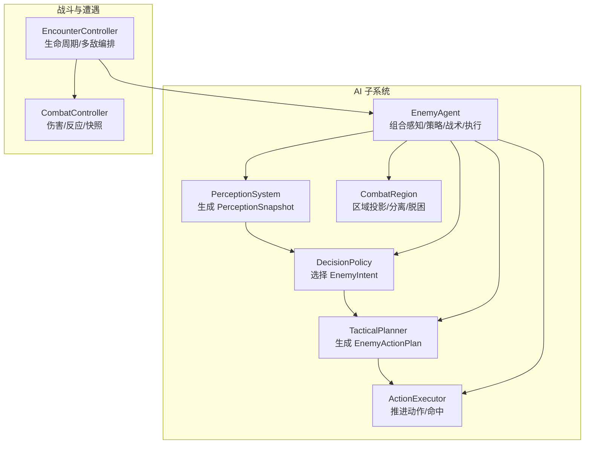
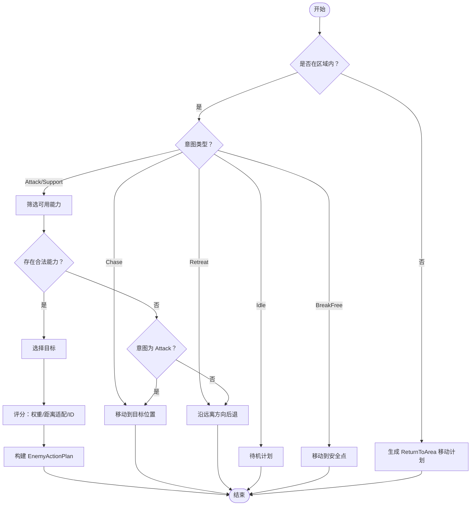
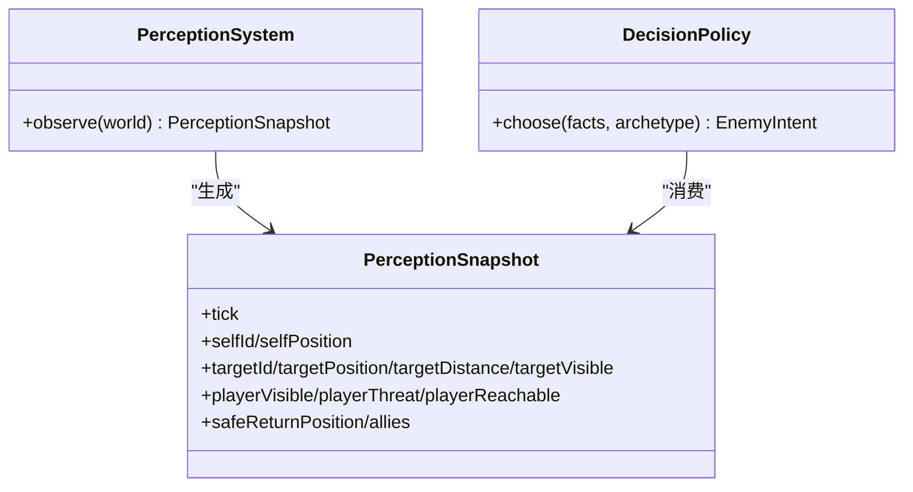
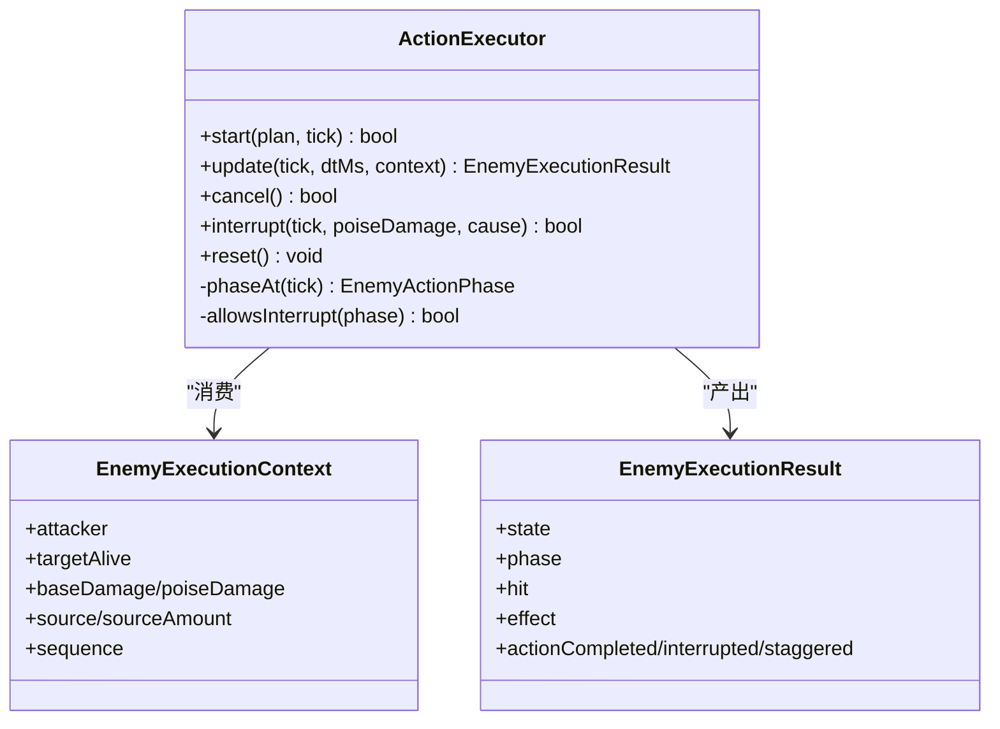
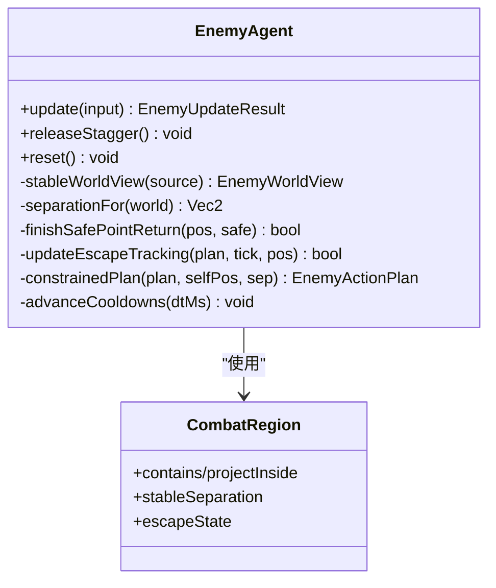
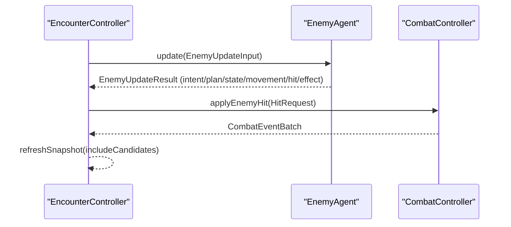
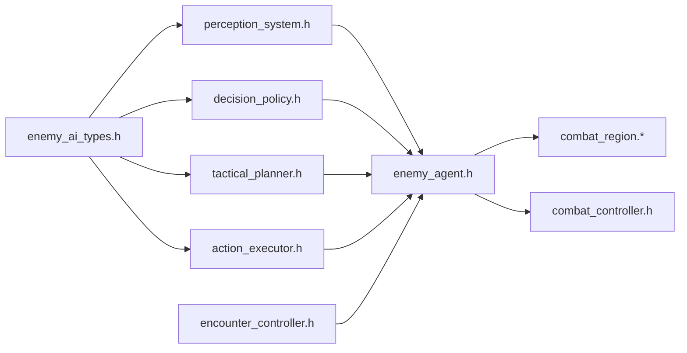

# 战术规划器

<cite>
**本文引用的文件**   
- [tactical_planner.h](file://native/gameplay/ai/tactical_planner.h)
- [tactical_planner.cpp](file://native/gameplay/ai/tactical_planner.cpp)
- [enemy_ai_types.h](file://native/gameplay/ai/enemy_ai_types.h)
- [decision_policy.h](file://native/gameplay/ai/decision_policy.h)
- [perception_system.h](file://native/gameplay/ai/perception_system.h)
- [action_executor.h](file://native/gameplay/ai/action_executor.h)
- [enemy_agent.h](file://native/gameplay/ai/enemy_agent.h)
- [encounter_controller.h](file://native/gameplay/ai/encounter_controller.h)
- [combat_controller.h](file://native/gameplay/combat/combat_controller.h)
- [test_tactical_planner.cpp](file://tests/test_tactical_planner.cpp)
- [2026-07-17-enemy-ai.md](file://docs/superpowers/plans/2026-07-17-enemy-ai.md)
- [2026-07-17-enemy-ai-design.md](file://docs/superpowers/specs/2026-07-17-enemy-ai-design.md)
</cite>

## 目录
1. [简介](#简介)
2. [项目结构](#项目结构)
3. [核心组件](#核心组件)
4. [架构总览](#架构总览)
5. [详细组件分析](#详细组件分析)
6. [依赖关系分析](#依赖关系分析)
7. [性能考量](#性能考量)
8. [故障排查指南](#故障排查指南)
9. [结论](#结论)
10. [附录](#附录)

## 简介
本技术文档围绕 TacticalPlanner 战术规划器，系统化阐述敌人 AI 的分层架构与确定性实现：战略层（意图决策）、战术层（能力选择与目标定位）、执行层（动作推进与命中事务）。重点说明路径与移动策略、动态避障与群体协调、阵型切换逻辑、协同攻击策略、战术决策引擎，以及复杂度控制、可预测性与玩家体验平衡的设计要点。文中所有分析与图示均基于仓库内实际代码与规范文档。

## 项目结构
TacticalPlanner 位于 native/gameplay/ai 模块，与感知系统、决策策略、动作执行器、区域约束和遭遇控制器共同构成完整的敌人 AI 管线。关键文件组织如下：
- 类型与契约：enemy_ai_types.h
- 感知事实：perception_system.h
- 高层意图决策：decision_policy.h
- 战术规划：tactical_planner.h/.cpp
- 动作执行：action_executor.h
- 单体集成：enemy_agent.h
- 遭遇编排：encounter_controller.h
- 战斗结算：combat_controller.h



**图表来源** 
- [perception_system.h:1-45](file://native/gameplay/ai/perception_system.h#L1-L45)
- [decision_policy.h:1-9](file://native/gameplay/ai/decision_policy.h#L1-L9)
- [tactical_planner.h:1-12](file://native/gameplay/ai/tactical_planner.h#L1-L12)
- [action_executor.h:1-67](file://native/gameplay/ai/action_executor.h#L1-L67)
- [enemy_agent.h:1-107](file://native/gameplay/ai/enemy_agent.h#L1-L107)
- [encounter_controller.h:1-151](file://native/gameplay/ai/encounter_controller.h#L1-L151)
- [combat_controller.h:1-117](file://native/gameplay/combat/combat_controller.h#L1-L117)

**章节来源**
- [2026-07-17-enemy-ai.md:26-41](file://docs/superpowers/plans/2026-07-17-enemy-ai.md#L26-L41)
- [2026-07-17-enemy-ai-design.md:44-62](file://docs/superpowers/specs/2026-07-17-enemy-ai-design.md#L44-L62)

## 核心组件
- 类型与数据契约：定义敌人原型、意图、状态、阶段、能力、目标策略、效果、计划与感知快照等强类型，确保跨层接口稳定。
- 感知系统：从世界视图生成不可变的 PerceptionSnapshot，包含位置、可见性、威胁、可达性、区域关系、友军摘要等。
- 决策策略：根据感知与当前状态选择高层意图（追击、攻击、支援、撤退、返回区域等）。
- 战术规划器：将意图解析为具体能力、目标与期望位置，输出 EnemyActionPlan；具备权重、范围适配与稳定性排序。
- 动作执行器：推进前摇、有效帧、恢复期，支持打断、破韧取消与单次命中事务。
- 敌人代理：组合感知、策略、战术与执行器，维护冷却、硬直、脱困与进度追踪。
- 遭遇控制器：统一遭遇生命周期、实体集合与事件批处理，驱动多敌战斗。
- 战斗控制器：玩家动作机、伤害结算、源附着与反应系统，产出快照与事件。

**章节来源**
- [enemy_ai_types.h:12-160](file://native/gameplay/ai/enemy_ai_types.h#L12-L160)
- [perception_system.h:1-45](file://native/gameplay/ai/perception_system.h#L1-L45)
- [decision_policy.h:1-9](file://native/gameplay/ai/decision_policy.h#L1-L9)
- [tactical_planner.h:1-12](file://native/gameplay/ai/tactical_planner.h#L1-L12)
- [action_executor.h:1-67](file://native/gameplay/ai/action_executor.h#L1-L67)
- [enemy_agent.h:1-107](file://native/gameplay/ai/enemy_agent.h#L1-L107)
- [encounter_controller.h:1-151](file://native/gameplay/ai/encounter_controller.h#L1-L151)
- [combat_controller.h:1-117](file://native/gameplay/combat/combat_controller.h#L1-L117)

## 架构总览
分层职责边界明确：
- 战略层（DecisionPolicy）：仅决定高层意图，不直接修改状态或产生伤害。
- 战术层（TacticalPlanner）：仅做能力筛选、目标选择与位置计算，不推进时间线。
- 执行层（ActionExecutor）：仅推进动作阶段、判定命中与恢复，不决定意图。
- 遭遇与战斗：EncounterController 编排多敌与生命周期；CombatController 负责玩家动作与伤害结算。

```mermaid
sequenceDiagram
participant Loop as "游戏循环"
participant EC as "EncounterController"
participant PS as "PerceptionSystem"
participant DP as "DecisionPolicy"
participant TP as "TacticalPlanner"
participant AE as "ActionExecutor"
participant CC as "CombatController"
Loop->>EC : update(input)
EC->>PS : observe(world) -> PerceptionSnapshot
EC->>DP : choose(facts, archetype) -> Intent
EC->>TP : plan(intent, facts, abilities) -> Plan
EC->>AE : start(plan, tick) / update(tick, dt, ctx)
AE-->>CC : HitRequest(若命中)
CC-->>EC : CombatEventBatch
EC-->>Loop : EncounterSnapshot + Events
```

**图表来源** 
- [2026-07-17-enemy-ai-design.md:44-52](file://docs/superpowers/specs/2026-07-17-enemy-ai-design.md#L44-L52)
- [encounter_controller.h:108-151](file://native/gameplay/ai/encounter_controller.h#L108-L151)
- [combat_controller.h:68-117](file://native/gameplay/combat/combat_controller.h#L68-L117)

## 详细组件分析

### 战术规划器（TacticalPlanner）
- 输入：EnemyIntent、PerceptionSnapshot、EnemyAbilityState 列表
- 输出：EnemyActionPlan（含意图、状态、能力、目标、期望位置、降级原因、移动向量）
- 核心逻辑：
  - 区域检查：不在区域内则强制 ReturnToArea
  - 意图分支：Chase/Retreat/Idle/BreakFree 直接生成移动或待机计划
  - 能力筛选：按类别（Attack/Support）、冷却、范围、目标策略过滤
  - 目标选择：CurrentTarget/NearestHostile/LowestHealthHostile/LowestShieldAlly/Self
  - 评分规则：合法性 > 权重 > 距离适配（余量最小）> 稳定 ID
  - 降级策略：无合法能力时 Attack→Chase，Support→Retreat，并标注降级原因



**图表来源** 
- [tactical_planner.cpp:124-199](file://native/gameplay/ai/tactical_planner.cpp#L124-L199)
- [enemy_ai_types.h:141-160](file://native/gameplay/ai/enemy_ai_types.h#L141-L160)

**章节来源**
- [tactical_planner.cpp:1-199](file://native/gameplay/ai/tactical_planner.cpp#L1-L199)
- [test_tactical_planner.cpp:72-205](file://tests/test_tactical_planner.cpp#L72-L205)

### 感知系统与决策策略
- 感知系统：从 EnemyWorldView 生成 PerceptionSnapshot，包含自身、玩家、目标、友军、区域、韧性、动作阶段等。
- 决策策略：依据感知与原型选择高层意图，优先级遵循“死亡不决策、区域外返回、不可达脱困、硬直保持、祭司支援优先、其余按距离与原型”。



**图表来源** 
- [perception_system.h:1-45](file://native/gameplay/ai/perception_system.h#L1-L45)
- [decision_policy.h:1-9](file://native/gameplay/ai/decision_policy.h#L1-L9)
- [enemy_ai_types.h:113-139](file://native/gameplay/ai/enemy_ai_types.h#L113-L139)

**章节来源**
- [perception_system.h:1-45](file://native/gameplay/ai/perception_system.h#L1-L45)
- [decision_policy.h:1-9](file://native/gameplay/ai/decision_policy.h#L1-L9)
- [2026-07-17-enemy-ai-design.md:103-150](file://docs/superpowers/specs/2026-07-17-enemy-ai-design.md#L103-L150)

### 动作执行器（ActionExecutor）
- 功能：启动计划、推进阶段（Windup/Active/Recovery）、判定命中、支持打断与破韧取消、恢复期保护。
- 关键特性：绝对时间推进、单次命中事务、交易 ID 防重复、阈值中断、硬直锁定。



**图表来源** 
- [action_executor.h:1-67](file://native/gameplay/ai/action_executor.h#L1-L67)

**章节来源**
- [action_executor.h:1-67](file://native/gameplay/ai/action_executor.h#L1-L67)
- [2026-07-17-enemy-ai.md:184-222](file://docs/superpowers/plans/2026-07-17-enemy-ai.md#L184-L222)

### 敌人代理（EnemyAgent）与区域约束
- 组合感知、策略、战术与执行器，维护冷却、硬直、脱困与进度追踪。
- 区域约束：投影、稳定分离、不可达判定与脱困状态管理。
- 行为调优：决策周期、最小进展、无进展限制、追击容差、安全点容差、分离距离。



**图表来源** 
- [enemy_agent.h:1-107](file://native/gameplay/ai/enemy_agent.h#L1-L107)

**章节来源**
- [enemy_agent.h:1-107](file://native/gameplay/ai/enemy_agent.h#L1-L107)
- [2026-07-17-enemy-ai.md:224-260](file://docs/superpowers/plans/2026-07-17-enemy-ai.md#L224-L260)

### 遭遇控制器与战斗控制器
- 遭遇控制器：统一管理模式、最大敌人数量、区域配置、敌人槽位、快照与事件批次，提供 start/reset/stop/update/advanceLevel/useSupply/retryBoss。
- 战斗控制器：玩家动作机、训练脉冲、目标绑定、伤害解析、源附着与反应系统，产出快照与事件。



**图表来源** 
- [encounter_controller.h:108-151](file://native/gameplay/ai/encounter_controller.h#L108-L151)
- [combat_controller.h:68-117](file://native/gameplay/combat/combat_controller.h#L68-L117)

**章节来源**
- [encounter_controller.h:1-151](file://native/gameplay/ai/encounter_controller.h#L1-L151)
- [combat_controller.h:1-117](file://native/gameplay/combat/combat_controller.h#L1-L117)

## 依赖关系分析
- 单向依赖：PerceptionSystem → DecisionPolicy → TacticalPlanner → ActionExecutor → CombatController
- 组合关系：EnemyAgent 组合上述组件，CombatRegion 提供区域约束
- 外部依赖：FixedPoint、Vec2、Tick、EntityId 等基础数学与时序类型



**图表来源** 
- [enemy_ai_types.h:12-160](file://native/gameplay/ai/enemy_ai_types.h#L12-L160)
- [perception_system.h:1-45](file://native/gameplay/ai/perception_system.h#L1-L45)
- [decision_policy.h:1-9](file://native/gameplay/ai/decision_policy.h#L1-L9)
- [tactical_planner.h:1-12](file://native/gameplay/ai/tactical_planner.h#L1-L12)
- [action_executor.h:1-67](file://native/gameplay/ai/action_executor.h#L1-L67)
- [enemy_agent.h:1-107](file://native/gameplay/ai/enemy_agent.h#L1-L107)
- [encounter_controller.h:1-151](file://native/gameplay/ai/encounter_controller.h#L1-L151)
- [combat_controller.h:1-117](file://native/gameplay/combat/combat_controller.h#L1-L117)

**章节来源**
- [2026-07-17-enemy-ai-design.md:44-72](file://docs/superpowers/specs/2026-07-17-enemy-ai-design.md#L44-L72)

## 性能考量
- 确定性：相同配置与输入序列产生相同结果，避免未播种随机数与容器迭代顺序依赖。
- 固定 Tick：所有时间推进基于固定 Tick，避免浮点漂移与帧率抖动。
- 轻量数据结构：使用 FixedPoint 与 Vec2，减少内存分配与拷贝。
- 局部更新：仅在必要时刷新快照与候选集，降低每帧开销。
- 算法复杂度：能力筛选 O(N)，目标选择 O(M)，整体线性于能力与友军数量。

[本节为通用指导，无需源码引用]

## 故障排查指南
- 常见失败场景：
  - 无合法能力：Attack 退化为 Chase，Support 退化为 Retreat，需检查冷却与范围。
  - 区域外：强制 ReturnToArea，检查出生点与区域半径。
  - 目标不可见：Chase 无法继续，检查可见性与遮挡。
  - 友军无效：Support 跳过死亡/区域外/有盾友军，检查 allies 列表。
- 调试建议：
  - 打印降级原因（fallbackReason）与意图变化
  - 校验 Perceptio nSnapshot 字段有效性（有限值、非负距离）
  - 验证 ActionExecutor 的命中事务 ID 与阶段截止 Tick

**章节来源**
- [tactical_planner.cpp:124-199](file://native/gameplay/ai/tactical_planner.cpp#L124-L199)
- [test_tactical_planner.cpp:112-170](file://tests/test_tactical_planner.cpp#L112-L170)

## 结论
TacticalPlanner 在分层架构中承担“意图到行动”的关键转换，通过确定性筛选与评分机制保证行为可预测与可测试。结合感知、决策、执行与区域约束，形成稳健的敌人 AI 管线。设计强调边界清晰、复杂度可控与玩家体验平衡，为后续扩展（如更复杂阵型与协同策略）奠定基础。

[本节为总结，无需源码引用]

## 附录
- 路径规划算法：当前实现以直线移动与区域约束为主，未引入 NavMesh 或 A* 寻路；如需扩展，可在 CombatRegion 基础上增加网格化与启发式搜索。
- 动态避障与群体协调：通过 stableSeparation 与 separationDistance 实现稳定分离，避免重叠与卡死。
- 阵型调整系统：当前以区域投影与分离为主，未实现包围/防御/进攻阵型的自动切换；可扩展为基于态势评估的阵型管理器。
- 协同攻击策略：多目标分配由 SoftTargeting 与目标策略（CurrentTarget/NearestHostile/LowestHealthHostile）实现；伤害最大化可通过能力权重与效果类型优化。
- 战术决策引擎：局势评估由 PerceptionSnapshot 提供，风险评估由 playerThreat 与可达性体现，最优策略由 DecisionPolicy 与 TacticalPlanner 联合确定。
- 代码示例路径：
  - 战术规划生成：[tactical_planner.cpp:124-199](file://native/gameplay/ai/tactical_planner.cpp#L124-L199)
  - 执行监控：[action_executor.h:1-67](file://native/gameplay/ai/action_executor.h#L1-L67)
  - 动态调整：[enemy_agent.h:1-107](file://native/gameplay/ai/enemy_agent.h#L1-L107)
  - 单元测试覆盖：[test_tactical_planner.cpp:72-205](file://tests/test_tactical_planner.cpp#L72-L205)

**章节来源**
- [2026-07-17-enemy-ai.md:26-41](file://docs/superpowers/plans/2026-07-17-enemy-ai.md#L26-L41)
- [2026-07-17-enemy-ai-design.md:163-195](file://docs/superpowers/specs/2026-07-17-enemy-ai-design.md#L163-L195)