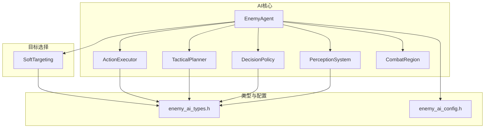
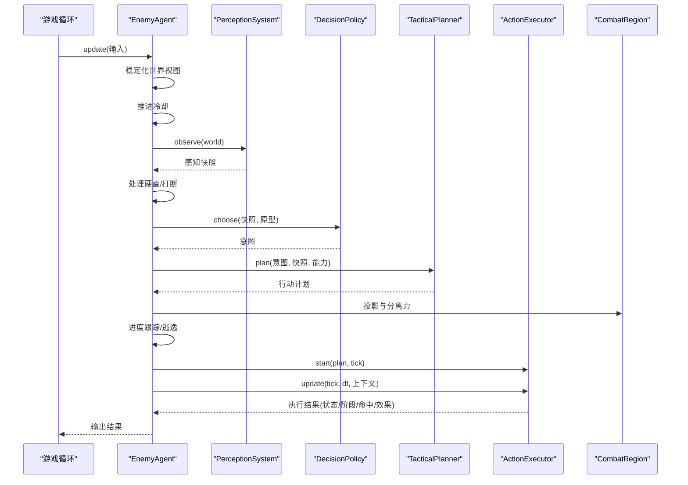
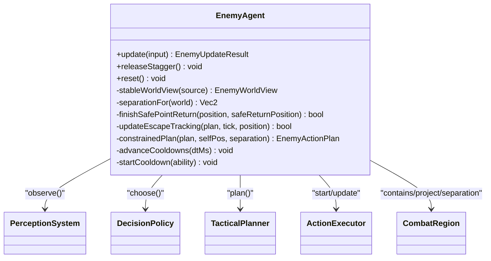
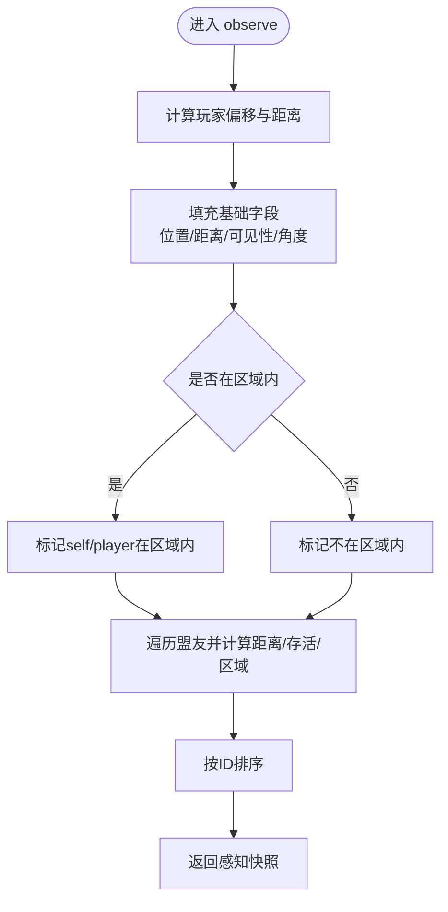
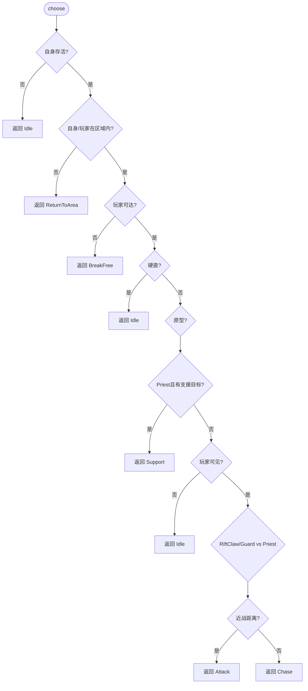
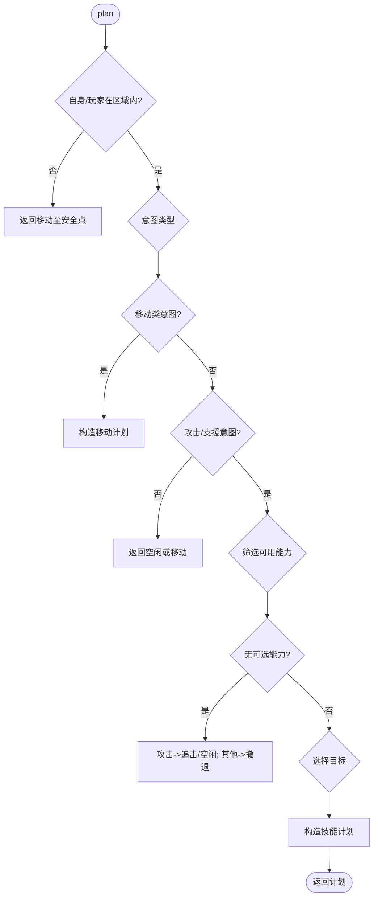
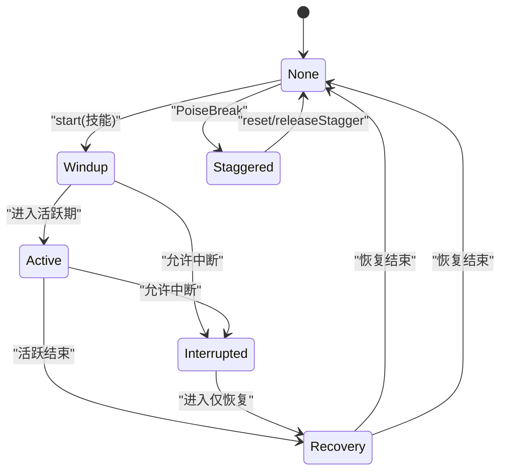
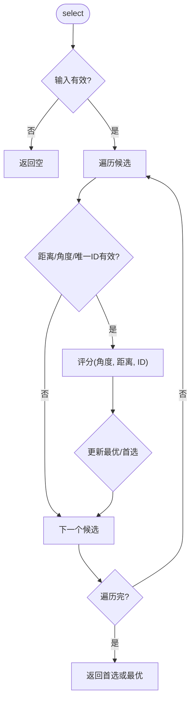
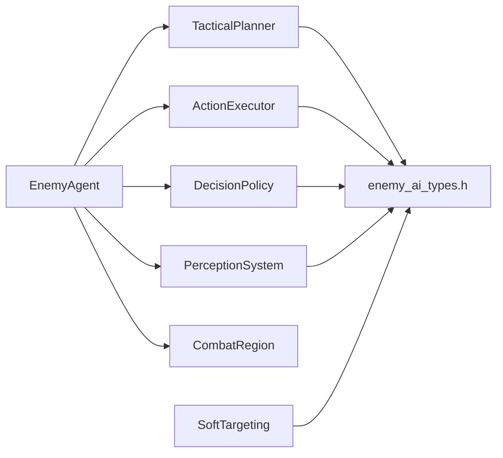

# 敌人代理

<cite>
**本文引用的文件**   
- [enemy_agent.h](file://native/gameplay/ai/enemy_agent.h)
- [enemy_agent.cpp](file://native/gameplay/ai/enemy_agent.cpp)
- [action_executor.h](file://native/gameplay/ai/action_executor.h)
- [action_executor.cpp](file://native/gameplay/ai/action_executor.cpp)
- [perception_system.h](file://native/gameplay/ai/perception_system.h)
- [perception_system.cpp](file://native/gameplay/ai/perception_system.cpp)
- [decision_policy.h](file://native/gameplay/ai/decision_policy.h)
- [decision_policy.cpp](file://native/gameplay/ai/decision_policy.cpp)
- [tactical_planner.h](file://native/gameplay/ai/tactical_planner.h)
- [tactical_planner.cpp](file://native/gameplay/ai/tactical_planner.cpp)
- [soft_targeting.h](file://native/gameplay/targeting/soft_targeting.h)
- [soft_targeting.cpp](file://native/gameplay/targeting/soft_targeting.cpp)
- [enemy_ai_types.h](file://native/gameplay/ai/enemy_ai_types.h)
- [enemy_ai_config.h](file://native/gameplay/ai/enemy_ai_config.h)
- [combat_region.h](file://native/gameplay/ai/combat_region.h)
- [test_enemy_agent.cpp](file://tests/test_enemy_agent.cpp)
</cite>

## 目录
1. [简介](#简介)
2. [项目结构](#项目结构)
3. [核心组件](#核心组件)
4. [架构总览](#架构总览)
5. [详细组件分析](#详细组件分析)
6. [依赖关系分析](#依赖关系分析)
7. [性能考虑](#性能考虑)
8. [故障排查指南](#故障排查指南)
9. [结论](#结论)
10. [附录](#附录)

## 简介
本文件为 EnemyAgent 敌人代理的全面技术文档，聚焦单个敌人的 AI 行为架构与实现。内容涵盖：
- 决策树（DecisionPolicy）与战术规划（TacticalPlanner）的协同机制
- 目标选择算法（SoftTargeting）的工作原理与优先级计算
- 敌人行为状态机设计（待机、巡逻、追击、攻击、受击、死亡等）及转换逻辑
- 感知系统（PerceptionSystem）集成（视野检测、声音感知、环境信息收集）
- 动作执行器（ActionExecutor）的执行流程（移动、攻击、闪避、特殊技能）
- 代码级示例路径、调试与可视化建议、性能优化与调参指南

## 项目结构
围绕敌人 AI 的核心模块位于 native/gameplay/ai 与 native/gameplay/targeting 下，关键文件包括：
- 敌人代理与协调：enemy_agent.*
- 感知系统：perception_system.*
- 决策策略：decision_policy.*
- 战术规划：tactical_planner.*
- 动作执行：action_executor.*
- 软目标选择：soft_targeting.*
- 类型与配置：enemy_ai_types.h, enemy_ai_config.h, combat_region.h

图表来源 
- [enemy_agent.h:1-107](file://native/gameplay/ai/enemy_agent.h#L1-L107)
- [perception_system.h:1-45](file://native/gameplay/ai/perception_system.h#L1-L45)
- [decision_policy.h:1-9](file://native/gameplay/ai/decision_policy.h#L1-L9)
- [tactical_planner.h:1-12](file://native/gameplay/ai/tactical_planner.h#L1-L12)
- [action_executor.h:1-67](file://native/gameplay/ai/action_executor.h#L1-L67)
- [soft_targeting.h:1-42](file://native/gameplay/targeting/soft_targeting.h#L1-L42)
- [enemy_ai_types.h:1-160](file://native/gameplay/ai/enemy_ai_types.h#L1-L160)
- [enemy_ai_config.h:1-124](file://native/gameplay/ai/enemy_ai_config.h#L1-L124)
- [combat_region.h:1-26](file://native/gameplay/ai/combat_region.h#L1-L26)

章节来源
- [enemy_agent.h:1-107](file://native/gameplay/ai/enemy_agent.h#L1-L107)
- [enemy_ai_types.h:1-160](file://native/gameplay/ai/enemy_ai_types.h#L1-L160)
- [enemy_ai_config.h:1-124](file://native/gameplay/ai/enemy_ai_config.h#L1-L124)

## 核心组件
- EnemyAgent：单敌 AI 主控制器，整合感知、决策、规划、执行与区域约束，输出意图、计划、运动向量、命中请求与战斗效果请求。
- PerceptionSystem：将世界视图转换为感知快照，包含玩家可见性、距离、角度、区域内外、盟友信息等。
- DecisionPolicy：基于感知快照与敌人原型（RiftClaw/Priest/Guard）决定高层意图（Idle/Chase/Attack/Retreat/ReturnToArea/BreakFree/Support）。
- TacticalPlanner：根据意图与能力集生成具体行动计划（移动或施放技能），处理目标选择与范围判定。
- ActionExecutor：管理技能生命周期（前摇/活跃/恢复）、中断与硬直（Stagger），并发出命中与效果请求。
- SoftTargeting：提供软目标选择，结合相机朝向与距离限制，支持首选目标优先。
- CombatRegion：区域边界与投影、分离力计算，保证敌人行为在合法区域内。

章节来源
- [enemy_agent.h:1-107](file://native/gameplay/ai/enemy_agent.h#L1-L107)
- [perception_system.h:1-45](file://native/gameplay/ai/perception_system.h#L1-L45)
- [decision_policy.h:1-9](file://native/gameplay/ai/decision_policy.h#L1-L9)
- [tactical_planner.h:1-12](file://native/gameplay/ai/tactical_planner.h#L1-L12)
- [action_executor.h:1-67](file://native/gameplay/ai/action_executor.h#L1-L67)
- [soft_targeting.h:1-42](file://native/gameplay/targeting/soft_targeting.h#L1-L42)
- [combat_region.h:1-26](file://native/gameplay/ai/combat_region.h#L1-L26)

## 架构总览
EnemyAgent 每帧调用 update，完成以下流水线：
- 稳定化世界视图（位置/朝向/区域/盟友去重排序）
- 更新冷却时间
- 感知观察并缓存快照
- 处理硬直（Stagger）与外部打断
- 决策策略选择意图
- 战术规划生成行动计划（移动或技能）
- 区域投影与分离力修正
- 进度跟踪与“卡住”逃逸（返回安全点）
- 启动执行器并更新执行结果
- 输出意图、计划、状态、阶段、移动向量、命中/效果请求、目标候选

图表来源 
- [enemy_agent.cpp:271-373](file://native/gameplay/ai/enemy_agent.cpp#L271-L373)
- [perception_system.cpp:32-74](file://native/gameplay/ai/perception_system.cpp#L32-L74)
- [decision_policy.cpp:25-47](file://native/gameplay/ai/decision_policy.cpp#L25-L47)
- [tactical_planner.cpp:124-198](file://native/gameplay/ai/tactical_planner.cpp#L124-L198)
- [action_executor.cpp:124-190](file://native/gameplay/ai/action_executor.cpp#L124-L190)

## 详细组件分析

### EnemyAgent 主控制器
职责与要点：
- 维护敌人原型、配置、调优参数、区域、能力冷却、感知记忆、最后计划、逃逸状态、进度跟踪与硬直锁存。
- update 中整合感知、决策、规划、执行，输出统一结果。
- 提供 releaseStagger/reset 以恢复状态。

关键数据结构：
- EnemyUpdateInput/Result：输入/输出封装，含意图、计划、状态、阶段、期望位置、移动/分离向量、命中/效果请求、是否被打断、目标候选、逃逸状态。
- EnemyAgentTuning：决策周期、最小进度阈值、无进展决策上限、追击容差、安全点容差、分离距离。
- EnemyEscapeState：None/Repositioning/ReturningToSafePoint。

核心流程片段路径：
- 稳定化世界视图与盟友去重排序：[enemy_agent.cpp:92-130](file://native/gameplay/ai/enemy_agent.cpp#L92-L130)
- 分离力计算：[enemy_agent.cpp:132-145](file://native/gameplay/ai/enemy_agent.cpp#L132-L145)
- 安全点到达判断与清理：[enemy_agent.cpp:147-157](file://native/gameplay/ai/enemy_agent.cpp#L147-L157)
- 进度跟踪与逃逸触发：[enemy_agent.cpp:159-212](file://native/gameplay/ai/enemy_agent.cpp#L159-L212)
- 区域投影与分离修正：[enemy_agent.cpp:230-242](file://native/gameplay/ai/enemy_agent.cpp#L230-L242)
- 冷却推进与能力冷却设置：[enemy_agent.cpp:244-264](file://native/gameplay/ai/enemy_agent.cpp#L244-L264)
- 主更新循环：[enemy_agent.cpp:271-373](file://native/gameplay/ai/enemy_agent.cpp#L271-L373)

图表来源 
- [enemy_agent.h:55-106](file://native/gameplay/ai/enemy_agent.h#L55-L106)
- [enemy_agent.cpp:271-373](file://native/gameplay/ai/enemy_agent.cpp#L271-L373)

章节来源
- [enemy_agent.h:1-107](file://native/gameplay/ai/enemy_agent.h#L1-L107)
- [enemy_agent.cpp:1-392](file://native/gameplay/ai/enemy_agent.cpp#L1-L392)

### 感知系统（PerceptionSystem）
职责与要点：
- 将 EnemyWorldView 转为 PerceptionSnapshot，计算玩家相对角度、可见性、区域内外、最近被击中标志、当前动作阶段、盟友列表（含距离与存活/区域状态）。
- 对盟友按 ID 排序，确保确定性。

关键数据：
- PerceptionSnapshot：tick、自身/目标位置与距离、可见性、角度、威胁、可达性、区域内外、安全返回点、到出生点距离、硬直/动作阶段、盟友列表。

关键流程片段路径：
- 观察与快照构建：[perception_system.cpp:32-74](file://native/gameplay/ai/perception_system.cpp#L32-L74)

图表来源 
- [perception_system.cpp:32-74](file://native/gameplay/ai/perception_system.cpp#L32-L74)

章节来源
- [perception_system.h:1-45](file://native/gameplay/ai/perception_system.h#L1-L45)
- [perception_system.cpp:1-75](file://native/gameplay/ai/perception_system.cpp#L1-L75)

### 决策策略（DecisionPolicy）
职责与要点：
- 基于感知快照与敌人原型选择高层意图。
- 规则示例：
  - 非存活或非区域则返回区域；不可达则尝试脱困；硬直则待机。
  - Priest 在支援范围内且友方护盾为空时选择支援。
  - RiftClaw/Guard 近战距离内攻击，否则追击。
  - Priest 近距撤退，中距攻击，远距追击。

关键流程片段路径：
- 意图选择逻辑：[decision_policy.cpp:25-47](file://native/gameplay/ai/decision_policy.cpp#L25-L47)

图表来源 
- [decision_policy.cpp:25-47](file://native/gameplay/ai/decision_policy.cpp#L25-L47)

章节来源
- [decision_policy.h:1-9](file://native/gameplay/ai/decision_policy.h#L1-L9)
- [decision_policy.cpp:1-48](file://native/gameplay/ai/decision_policy.cpp#L1-L48)

### 战术规划（TacticalPlanner）
职责与要点：
- 根据意图与能力集生成行动计划：
  - 非攻击/支援意图：移动（追击/撤退/返回区域/空闲/脱困）或空闲。
  - 攻击/支援意图：从可用能力中选择最佳技能（权重优先、剩余射程更短优先、ID 更小作为破平）。
  - 目标选择策略：当前目标、最近敌方、最低生命敌方、最低护盾友方、自身。
  - 若无可执行能力：攻击意图退化为追击或空闲；其他意图退化为撤退。

关键流程片段路径：
- 规划主逻辑：[tactical_planner.cpp:124-198](file://native/gameplay/ai/tactical_planner.cpp#L124-L198)
- 目标选择函数：[tactical_planner.cpp:54-77](file://native/gameplay/ai/tactical_planner.cpp#L54-L77)
- 移动/空闲计划构造：[tactical_planner.cpp:88-109](file://native/gameplay/ai/tactical_planner.cpp#L88-L109)

图表来源 
- [tactical_planner.cpp:124-198](file://native/gameplay/ai/tactical_planner.cpp#L124-L198)

章节来源
- [tactical_planner.h:1-12](file://native/gameplay/ai/tactical_planner.h#L1-L12)
- [tactical_planner.cpp:1-199](file://native/gameplay/ai/tactical_planner.cpp#L1-L199)

### 动作执行器（ActionExecutor）
职责与要点：
- 管理技能生命周期：前摇（Windup）、活跃（Active）、恢复（Recovery）。
- 支持中断策略：不可中断、仅前摇可中断、前摇+活跃可中断。
- 硬直（Stagger）处理：PoiseBreak 直接清空动作并进入硬直状态。
- 发出命中与效果请求：伤害/范围伤害/护盾等，附带交易号与序列号。

关键流程片段路径：
- 开始技能与阶段计算：[action_executor.cpp:39-81](file://native/gameplay/ai/action_executor.cpp#L39-L81)
- 中断与恢复：[action_executor.cpp:96-122](file://native/gameplay/ai/action_executor.cpp#L96-L122)
- 更新与请求发出：[action_executor.cpp:124-190](file://native/gameplay/ai/action_executor.cpp#L124-L190)

图表来源 
- [action_executor.cpp:39-190](file://native/gameplay/ai/action_executor.cpp#L39-L190)

章节来源
- [action_executor.h:1-67](file://native/gameplay/ai/action_executor.h#L1-L67)
- [action_executor.cpp:1-216](file://native/gameplay/ai/action_executor.cpp#L1-L216)

### 软目标选择（SoftTargeting）
职责与要点：
- 基于相机朝向与最大角度/距离过滤候选目标。
- 支持首选目标优先（preferredId），否则选择角度最小、距离次小、ID 最小的目标。
- 用于上层 UI/战斗系统辅助锁定目标。

关键流程片段路径：
- 选择逻辑：[soft_targeting.cpp:24-76](file://native/gameplay/targeting/soft_targeting.cpp#L24-L76)

图表来源 
- [soft_targeting.cpp:24-76](file://native/gameplay/targeting/soft_targeting.cpp#L24-L76)

章节来源
- [soft_targeting.h:1-42](file://native/gameplay/targeting/soft_targeting.h#L1-L42)
- [soft_targeting.cpp:1-77](file://native/gameplay/targeting/soft_targeting.cpp#L1-L77)

### 区域与分离（CombatRegion）
职责与要点：
- contains：判断点是否在圆形区域内（支持容差）。
- projectInside：将点投影回区域内。
- stableSeparation：计算与盟友的最小分离向量，避免拥挤。

关键接口路径：
- 区域接口：[combat_region.h:1-26](file://native/gameplay/ai/combat_region.h#L1-L26)

章节来源
- [combat_region.h:1-26](file://native/gameplay/ai/combat_region.h#L1-L26)

## 依赖关系分析
- EnemyAgent 强依赖 PerceptionSystem、DecisionPolicy、TacticalPlanner、ActionExecutor、CombatRegion。
- TacticalPlanner 依赖能力类型与目标策略枚举。
- ActionExecutor 依赖能力生命周期与中断策略。
- SoftTargeting 独立于 AI 管线，供上层选择目标使用。

图表来源 
- [enemy_agent.h:1-107](file://native/gameplay/ai/enemy_agent.h#L1-L107)
- [enemy_ai_types.h:1-160](file://native/gameplay/ai/enemy_ai_types.h#L1-L160)

章节来源
- [enemy_agent.h:1-107](file://native/gameplay/ai/enemy_agent.h#L1-L107)
- [enemy_ai_types.h:1-160](file://native/gameplay/ai/enemy_ai_types.h#L1-L160)

## 性能考虑
- 稳定性与确定性：
  - 世界视图稳定化时对盟友进行排序与去重，确保分离力与移动向量一致。
  - 使用有限浮点保护与饱和加法防止溢出。
- 决策频率控制：
  - decisionPeriodMs 控制进度采样与再决策间隔，避免频繁重算。
- 冷却与状态管理：
  - 能力冷却线性递减，避免每帧复杂计算。
- 区域投影与分离：
  - 仅在必要时进行投影与分离修正，减少几何计算开销。
- 目标选择：
  - SoftTargeting 通过角度与距离快速过滤，避免全量排序。

章节来源
- [enemy_agent.cpp:92-130](file://native/gameplay/ai/enemy_agent.cpp#L92-L130)
- [enemy_agent.cpp:244-264](file://native/gameplay/ai/enemy_agent.cpp#L244-L264)
- [soft_targeting.cpp:24-76](file://native/gameplay/targeting/soft_targeting.cpp#L24-L76)

## 故障排查指南
- 敌人死亡后无意图/命中/目标候选：
  - 检查 selfAlive 分支与 reset 调用。参考测试用例路径：[test_enemy_agent.cpp:177-200](file://tests/test_enemy_agent.cpp#L177-L200)
- 追击容差与区域投影：
  - 验证 playerPosition 超出半径时的意图切换与 desiredPosition 投影。参考测试用例路径：[test_enemy_agent.cpp:74-93](file://tests/test_enemy_agent.cpp#L74-L93)
- 卡住逃逸与安全点返回：
  - 确认 noProgressDecisions_ 达到阈值后进入 ReturningToSafePoint，并在到达安全点后清除。参考测试用例路径：[test_enemy_agent.cpp:95-123](file://tests/test_enemy_agent.cpp#L95-L123)
- 不可达时的确定性强制定位：
  - playerReachable=false 时应进入 Repositioning 并选择 BreakFree。参考测试用例路径：[test_enemy_agent.cpp:125-134](file://tests/test_enemy_agent.cpp#L125-L134)
- 盟友去重与分离稳定性：
  - 不同顺序输入应产生相同分离向量与移动向量。参考测试用例路径：[test_enemy_agent.cpp:136-175](file://tests/test_enemy_agent.cpp#L136-L175)

章节来源
- [test_enemy_agent.cpp:1-200](file://tests/test_enemy_agent.cpp#L1-L200)

## 结论
EnemyAgent 通过感知—决策—规划—执行的清晰分层，实现了稳定、可控且可扩展的敌人 AI。其关键优势在于：
- 明确的意图与状态机，便于调参与调试
- 区域与分离约束保障行为合法性与群体合理性
- 能力生命周期与中断策略增强战斗表现与平衡性
- 软目标选择提升交互体验与锁定准确性

## 附录

### 敌人行为状态机与转换逻辑
- Idle：待机，无移动或技能
- Evaluating：评估中（由上层驱动）
- Moving：移动至期望位置
- Acting：执行技能（前摇/活跃/恢复）
- Recovering：恢复中
- Staggered：硬直（被打破架势）
- Defeated：死亡

转换要点：
- 死亡：selfAlive=false -> Defeated
- 硬直：PoiseBreak -> Staggered；恢复后回到 Idle
- 移动：计划 state=Moving -> 到达后可能进入 Acting 或 Idle
- 技能：Acting -> Recovery -> Idle
- 逃逸：卡住 -> ReturningToSafePoint -> 到达安全点 -> Idle

章节来源
- [enemy_ai_types.h:28-36](file://native/gameplay/ai/enemy_ai_types.h#L28-L36)
- [enemy_agent.cpp:271-373](file://native/gameplay/ai/enemy_agent.cpp#L271-L373)

### 目标选择算法（SoftTargeting）工作原理
- 输入：玩家位置、相机偏航角、候选目标列表、可选首选 ID
- 过滤：距离不超过 maxDistance，角度不超过 maxAngle，ID 唯一且有效
- 评分：角度越小越优先，其次距离越小，最后 ID 较小
- 首选：若存在 preferredId 且满足条件，优先返回

章节来源
- [soft_targeting.h:1-42](file://native/gameplay/targeting/soft_targeting.h#L1-L42)
- [soft_targeting.cpp:24-76](file://native/gameplay/targeting/soft_targeting.cpp#L24-L76)

### 敌人动作执行器（ActionExecutor）执行流程
- start：校验能力与参数，设定各阶段时间点
- update：根据 tick 推进阶段，目标死亡时进入中断恢复，hitTick 时发出命中/效果请求
- interrupt：根据 cancelPolicy 与 poiseDamage 决定是否中断
- reset/cancel：清理状态与事务号

章节来源
- [action_executor.h:1-67](file://native/gameplay/ai/action_executor.h#L1-L67)
- [action_executor.cpp:39-190](file://native/gameplay/ai/action_executor.cpp#L39-L190)

### 调试与可视化建议
- 打印/绘制：
  - 意图与状态：记录 intent/state/phase 变化
  - 计划：desiredPosition/movement/fallbackReason
  - 执行：hit/effect 请求与 transactionId
  - 区域：绘制 CombatRegion 圆与 safeReturnPosition
  - 分离：可视化 separation 向量
- 日志关键字段：
  - tick、selfPosition、playerPosition、targetId、targetVisible、playerInsideRegion、abilities 冷却、escapeState、staggerLatched_

章节来源
- [enemy_agent.cpp:271-373](file://native/gameplay/ai/enemy_agent.cpp#L271-L373)
- [tactical_planner.cpp:124-198](file://native/gameplay/ai/tactical_planner.cpp#L124-L198)
- [action_executor.cpp:124-190](file://native/gameplay/ai/action_executor.cpp#L124-L190)

### 行为调优参数
- EnemyAgentTuning：
  - decisionPeriodMs：决策周期（毫秒）
  - minimumProgress：最小进步阈值
  - noProgressDecisionLimit：无进展决策上限
  - chaseTolerance：追击容差
  - safePointTolerance：安全点容差
  - separationDistance：分离距离
- SoftTargetingConfig：
  - maxDistance：最大选择距离
  - maxAngle：最大选择角度（弧度）

章节来源
- [enemy_agent.h:20-27](file://native/gameplay/ai/enemy_agent.h#L20-L27)
- [soft_targeting.h:25-28](file://native/gameplay/targeting/soft_targeting.h#L25-L28)