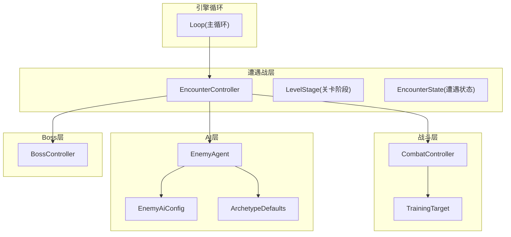
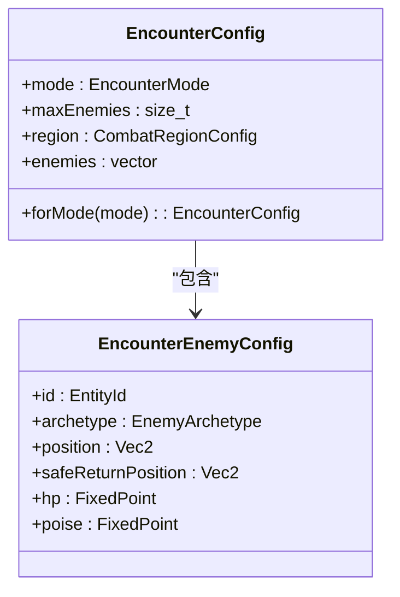
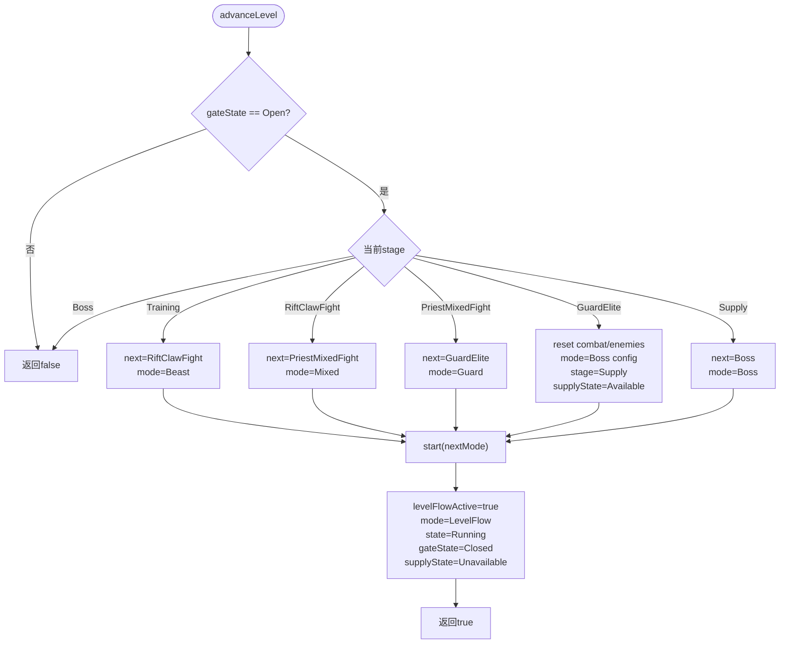
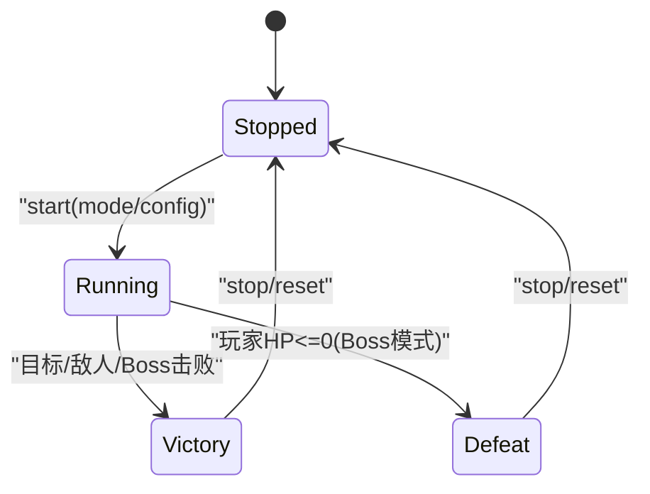
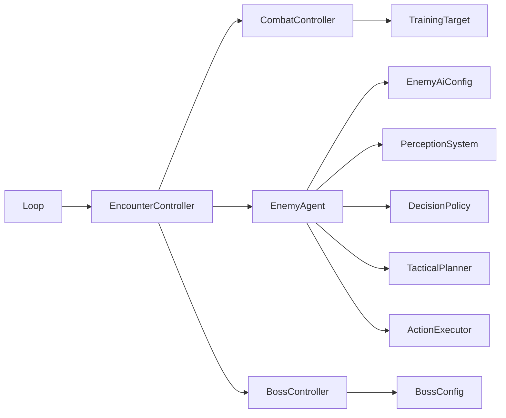

# 遭遇战控制器

<cite>
**本文引用的文件**   
- [encounter_controller.h](file://native/gameplay/ai/encounter_controller.h)
- [encounter_controller.cpp](file://native/gameplay/ai/encounter_controller.cpp)
- [enemy_ai_config.h](file://native/gameplay/ai/enemy_ai_config.h)
- [enemy_archetypes.h](file://native/gameplay/ai/enemy_archetypes.h)
- [enemy_agent.h](file://native/gameplay/ai/enemy_agent.h)
- [boss.h](file://native/gameplay/entities/boss.h)
- [training_target.h](file://native/gameplay/combat/training_target.h)
- [combat_controller.h](file://native/gameplay/combat/combat_controller.h)
- [loop.cpp](file://native/engine/core/loop.cpp)
- [test_encounter_controller.cpp](file://tests/test_encounter_controller.cpp)
- [test_level_flow.cpp](file://tests/test_level_flow.cpp)
- [test_boss_controller.cpp](file://tests/test_boss_controller.cpp)
</cite>

## 目录
1. [简介](#简介)
2. [项目结构](#项目结构)
3. [核心组件](#核心组件)
4. [架构总览](#架构总览)
5. [详细组件分析](#详细组件分析)
6. [依赖关系分析](#依赖关系分析)
7. [性能与内存管理](#性能与内存管理)
8. [故障排查指南](#故障排查指南)
9. [结论](#结论)
10. [附录：关键流程时序图](#附录关键流程时序图)

## 简介
本技术文档围绕 EncounterController（遭遇战控制器）展开，系统性阐述遭遇战的完整生命周期管理、关卡进度系统 LevelStage 的状态转换、敌人配置系统 EncounterConfig/EncounterEnemyConfig 的结构设计、以及遭遇战状态机 EncounterState 的实现。文档覆盖训练模式、野兽模式、混合模式、守卫模式和 Boss 模式的实现细节，并给出启动、更新循环、事件处理与快照同步机制的具体示例路径，同时包含性能优化、内存管理与调试工具集成的要点。

## 项目结构
遭遇战控制器位于 gameplay/ai 模块，与战斗控制器、AI 智能体、Boss 控制器等子系统协作，形成“输入帧 -> 遭遇战更新 -> 战斗/AI 子步 -> 事件与快照”的闭环。



图表来源
- [encounter_controller.h:1-151](file://native/gameplay/ai/encounter_controller.h#L1-L151)
- [encounter_controller.cpp:1-629](file://native/gameplay/ai/encounter_controller.cpp#L1-L629)
- [combat_controller.h:1-117](file://native/gameplay/combat/combat_controller.h#L1-L117)
- [enemy_agent.h:1-107](file://native/gameplay/ai/enemy_agent.h#L1-L107)
- [enemy_ai_config.h:1-124](file://native/gameplay/ai/enemy_ai_config.h#L1-L124)
- [enemy_archetypes.h:1-19](file://native/gameplay/ai/enemy_archetypes.h#L1-L19)
- [boss.h:1-94](file://native/gameplay/entities/boss.h#L1-L94)
- [loop.cpp:176-235](file://native/engine/core/loop.cpp#L176-L235)

章节来源
- [encounter_controller.h:1-151](file://native/gameplay/ai/encounter_controller.h#L1-L151)
- [encounter_controller.cpp:1-629](file://native/gameplay/ai/encounter_controller.cpp#L1-L629)

## 核心组件
- EncounterController：遭遇战主控器，负责模式切换、关卡推进、事件聚合、快照生成与状态机驱动。
- EncounterConfig / EncounterEnemyConfig：遭遇战配置与敌人生成配置，定义最大敌人数量、区域、敌人类型、初始位置与安全返回点。
- EnemyAgent：单个敌人的 AI 智能体，基于能力配置与战术规划进行移动、攻击与效果释放。
- CombatController：玩家战斗逻辑与目标交互，提供 TrainingTarget 作为训练目标或 Boss 代理目标。
- BossController：Boss 多阶段控制，含机制判定、节点破坏、最终锻造与重试。
- LevelStage / GateState / SupplyState：关卡阶段、门状态与补给状态，驱动遭遇战流程推进。
- EncounterSnapshot / EncounterEventBatch：每帧快照与事件批，供表现层与调试使用。

章节来源
- [encounter_controller.h:1-151](file://native/gameplay/ai/encounter_controller.h#L1-L151)
- [encounter_controller.cpp:1-629](file://native/gameplay/ai/encounter_controller.cpp#L1-L629)
- [enemy_agent.h:1-107](file://native/gameplay/ai/enemy_agent.h#L1-L107)
- [combat_controller.h:1-117](file://native/gameplay/combat/combat_controller.h#L1-L117)
- [boss.h:1-94](file://native/gameplay/entities/boss.h#L1-L94)

## 架构总览
遭遇战控制器在每一帧接收输入，根据当前模式执行不同分支：
- 训练模式：直接委托 CombatController 更新训练目标，并在胜利时打开门以推进关卡。
- Boss 模式：绑定 Boss 代理目标，将伤害映射到 BossController，并根据其阶段与机制决定胜负。
- 其他模式（野兽/混合/守卫）：为每个敌人创建 EnemySlot，调用 EnemyAgent.update 生成意图与动作，应用护盾与命中，更新位置与朝向，最后汇总事件与快照。

```mermaid
sequenceDiagram
participant Loop as "主循环"
participant EC as "EncounterController"
participant CC as "CombatController"
participant EA as "EnemyAgent"
participant BC as "BossController"
Loop->>EC : update(input)
alt 训练模式
EC->>CC : update(针对训练目标)
CC-->>EC : events + snapshot
EC->>EC : 检查目标死亡 -> 胜利/开门
else Boss 模式
EC->>CC : updateEnemy(绑定Boss代理目标)
CC-->>EC : events + snapshot
EC->>BC : applyDamage + update
BC-->>EC : boss.snapshot
EC->>EC : 玩家死亡/BOSS击败 -> 失败/胜利
else 其他模式
loop 遍历敌人
EC->>EA : update(world, dt, execution)
EA-->>EC : movement/hit/effect
EC->>CC : applyEnemyHit
end
EC->>EC : 所有敌人死亡 -> 胜利/开门
end
EC-->>Loop : snapshot + events
```

图表来源
- [encounter_controller.cpp:296-492](file://native/gameplay/ai/encounter_controller.cpp#L296-L492)
- [combat_controller.h:1-117](file://native/gameplay/combat/combat_controller.h#L1-L117)
- [enemy_agent.h:1-107](file://native/gameplay/ai/enemy_agent.h#L1-L107)
- [boss.h:1-94](file://native/gameplay/entities/boss.h#L1-L94)

## 详细组件分析

### 遭遇战模式与配置系统
- EncounterMode：Training、Beast、Mixed、Guard、LevelFlow、Boss。
- EncounterConfig::forMode(mode) 为每种模式预设敌人列表与区域；LevelFlow/Boss 模式不预设敌人，由流程控制动态切换。
- EncounterEnemyConfig：定义敌人 id、archetype、position、safeReturnPosition、hp/poise 初始值。
- 配置校验 validConfig：限制 maxEnemies、区域合法性、id 唯一性、archetype 有效性、位置与安全返回点有限、hp/poise 正数等。



图表来源
- [encounter_controller.h:42-58](file://native/gameplay/ai/encounter_controller.h#L42-L58)
- [encounter_controller.cpp:134-164](file://native/gameplay/ai/encounter_controller.cpp#L134-L164)
- [encounter_controller.cpp:192-220](file://native/gameplay/ai/encounter_controller.cpp#L192-L220)

章节来源
- [encounter_controller.h:42-58](file://native/gameplay/ai/encounter_controller.h#L42-L58)
- [encounter_controller.cpp:134-164](file://native/gameplay/ai/encounter_controller.cpp#L134-L164)
- [encounter_controller.cpp:192-220](file://native/gameplay/ai/encounter_controller.cpp#L192-L220)

### 敌人配置与生成策略
- 通过 aiConfig(archetype, region) 获取各原型默认配置（裂隙爪、祭司、守卫），并注入区域。
- EnemySlot 封装 enemy、target、agent 与动画状态（moving/attacking/hit/facing/phase）。
- 安全返回点 safeReturnPosition 用于敌人被击退后回归的安全位置。

章节来源
- [encounter_controller.cpp:58-74](file://native/gameplay/ai/encounter_controller.cpp#L58-L74)
- [encounter_controller.cpp:110-132](file://native/gameplay/ai/encounter_controller.cpp#L110-L132)
- [enemy_archetypes.h:1-19](file://native/gameplay/ai/enemy_archetypes.h#L1-L19)

### 关卡进度系统 LevelStage
- LevelStage：Training -> RiftClawFight -> PriestMixedFight -> GuardElite -> Supply -> Boss。
- advanceLevel() 仅在 gateState == Open 时推进；Supply 阶段重置 combat 与 enemies，设置 supplyState 为 Available。
- useSupply() 仅当处于 Supply 且 Available 时生效，恢复玩家生命并标记 Consumed。



图表来源
- [encounter_controller.cpp:550-596](file://native/gameplay/ai/encounter_controller.cpp#L550-L596)

章节来源
- [encounter_controller.cpp:550-596](file://native/gameplay/ai/encounter_controller.cpp#L550-L596)
- [test_level_flow.cpp:25-43](file://tests/test_level_flow.cpp#L25-L43)
- [test_level_flow.cpp:45-84](file://tests/test_level_flow.cpp#L45-L84)

### 遭遇战状态机 EncounterState
- 状态：Stopped、Running、Victory、Defeat。
- 启动 start(mode/config) 设置 state=Running，并初始化 mode、levelStage、gateState、supplyState。
- 停止 stop() 设置 state=Stopped，清空事件并刷新快照。
- 胜利条件：训练目标死亡（训练模式）、所有敌人死亡（非训练/Boss）、Boss 击败（Boss 模式）。
- 失败条件：玩家生命值 <= 0（Boss 模式）。



图表来源
- [encounter_controller.h:22-27](file://native/gameplay/ai/encounter_controller.h#L22-L27)
- [encounter_controller.cpp:222-273](file://native/gameplay/ai/encounter_controller.cpp#L222-L273)
- [encounter_controller.cpp:289-294](file://native/gameplay/ai/encounter_controller.cpp#L289-L294)
- [encounter_controller.cpp:308-314](file://native/gameplay/ai/encounter_controller.cpp#L308-L314)
- [encounter_controller.cpp:481-491](file://native/gameplay/ai/encounter_controller.cpp#L481-L491)
- [encounter_controller.cpp:346-353](file://native/gameplay/ai/encounter_controller.cpp#L346-L353)

章节来源
- [encounter_controller.h:22-27](file://native/gameplay/ai/encounter_controller.h#L22-L27)
- [encounter_controller.cpp:222-273](file://native/gameplay/ai/encounter_controller.cpp#L222-L273)
- [encounter_controller.cpp:289-294](file://native/gameplay/ai/encounter_controller.cpp#L289-L294)
- [encounter_controller.cpp:308-314](file://native/gameplay/ai/encounter_controller.cpp#L308-L314)
- [encounter_controller.cpp:481-491](file://native/gameplay/ai/encounter_controller.cpp#L481-L491)
- [encounter_controller.cpp:346-353](file://native/gameplay/ai/encounter_controller.cpp#L346-L353)

### Boss 模式与阶段机制
- Boss 阶段：RadianceLockdown -> CurrentStorm -> CorruptionCollapse。
- CurrentStorm 需要破坏两个节点后才允许受击；CorruptionCollapse 需要共鸣与终极技能才能成功完成机制。
- retryBoss() 在失败后可重试，恢复 Boss 初始状态与战斗快照。

章节来源
- [boss.h:8-31](file://native/gameplay/entities/boss.h#L8-L31)
- [boss.h:41-67](file://native/gameplay/entities/boss.h#L41-L67)
- [encounter_controller.cpp:317-356](file://native/gameplay/ai/encounter_controller.cpp#L317-L356)
- [encounter_controller.cpp:609-628](file://native/gameplay/ai/encounter_controller.cpp#L609-L628)
- [test_boss_controller.cpp:8-33](file://tests/test_boss_controller.cpp#L8-L33)
- [test_boss_controller.cpp:35-54](file://tests/test_boss_controller.cpp#L35-L54)
- [test_boss_controller.cpp:56-82](file://tests/test_boss_controller.cpp#L56-L82)
- [test_boss_controller.cpp:104-139](file://tests/test_boss_controller.cpp#L104-L139)

### 训练模式与目标代理
- 训练模式下，CombatController 直接更新 TrainingTarget，EncounterController 仅转发输入与事件。
- 目标死亡即胜利，若 levelFlowActive_ 则打开门以推进关卡。

章节来源
- [encounter_controller.cpp:303-315](file://native/gameplay/ai/encounter_controller.cpp#L303-L315)
- [training_target.h:1-44](file://native/gameplay/combat/training_target.h#L1-L44)
- [combat_controller.h:1-117](file://native/gameplay/combat/combat_controller.h#L1-L117)

### 敌人 AI 与更新循环
- 每帧对每个 EnemySlot：
  - 更新 TrainingTarget（若存活）并同步 hp/poise。
  - 选择目标（input.targetId 对应存活敌人）。
  - 调用 CombatController.updateEnemy 绑定目标与伤害上下文。
  - 收集 hit/effect，排序后应用护盾与伤害。
  - 计算移动与朝向，更新 position/facing/moving/attacking/hit。
  - 若全部敌人死亡，进入胜利并可能开门。

章节来源
- [encounter_controller.cpp:358-492](file://native/gameplay/ai/encounter_controller.cpp#L358-L492)
- [enemy_agent.h:33-53](file://native/gameplay/ai/enemy_agent.h#L33-L53)

### 事件与快照同步
- EncounterEventBatch：聚合 CombatEventBatch 与 CombatEffectRequest。
- refreshSnapshot(includeCandidates)：
  - 训练模式：添加训练目标候选。
  - Boss 模式：填充 boss 快照与 Boss 候选。
  - 其他模式：填充敌人快照（包括光环、腐蚀、动画事实）与候选列表。
- 快照相等比较包含动画事实（moving/attacking/hit）与状态字段。

章节来源
- [encounter_controller.h:88-101](file://native/gameplay/ai/encounter_controller.h#L88-L101)
- [encounter_controller.cpp:494-548](file://native/gameplay/ai/encounter_controller.cpp#L494-L548)
- [encounter_controller.cpp:166-185](file://native/gameplay/ai/encounter_controller.cpp#L166-L185)

## 依赖关系分析
- EncounterController 依赖 CombatController、EnemyAgent、BossController、TrainingTarget。
- EnemyAgent 依赖 EnemyAiConfig、PerceptionSystem、DecisionPolicy、TacticalPlanner、ActionExecutor。
- BossController 依赖 BossConfig、TickClock。
- 主循环 Loop 通过 startEncounter/advanceLevel/useSupply/retryBoss 暴露接口给上层。



图表来源
- [encounter_controller.h:1-151](file://native/gameplay/ai/encounter_controller.h#L1-L151)
- [enemy_agent.h:1-107](file://native/gameplay/ai/enemy_agent.h#L1-L107)
- [combat_controller.h:1-117](file://native/gameplay/combat/combat_controller.h#L1-L117)
- [boss.h:1-94](file://native/gameplay/entities/boss.h#L1-L94)
- [loop.cpp:176-235](file://native/engine/core/loop.cpp#L176-L235)

章节来源
- [encounter_controller.h:1-151](file://native/gameplay/ai/encounter_controller.h#L1-L151)
- [enemy_agent.h:1-107](file://native/gameplay/ai/enemy_agent.h#L1-L107)
- [combat_controller.h:1-117](file://native/gameplay/combat/combat_controller.h#L1-L117)
- [boss.h:1-94](file://native/gameplay/entities/boss.h#L1-L94)
- [loop.cpp:176-235](file://native/engine/core/loop.cpp#L176-L235)

## 性能与内存管理
- 固定步长与 Tick 管理：update 中维护 lastTick_ 与 nextSequence_，确保事件顺序稳定。
- 事件排序：effectLess/hitLess 保证按 tick/target/sequence/transactionId 排序，避免并发冲突。
- 移动步进限制：advancePosition 限制每毫秒移动距离，防止越界与抖动。
- 内存管理：
  - 使用 std::unique_ptr<EnemySlot> 管理敌人资源，start/reset/stop 明确释放。
  - 配置校验原子性：无效配置不会改变现有快照与状态。
- 调试与测试：
  - 快照相等比较包含动画事实，便于断言与回放。
  - 单元测试覆盖模式启动、死亡移除候选、停止无事件、训练脉冲语义、关卡推进与补给消耗、Boss 阶段与重试。

章节来源
- [encounter_controller.cpp:76-108](file://native/gameplay/ai/encounter_controller.cpp#L76-L108)
- [encounter_controller.cpp:192-220](file://native/gameplay/ai/encounter_controller.cpp#L192-L220)
- [encounter_controller.cpp:236-273](file://native/gameplay/ai/encounter_controller.cpp#L236-L273)
- [encounter_controller.cpp:275-294](file://native/gameplay/ai/encounter_controller.cpp#L275-L294)
- [test_encounter_controller.cpp:22-46](file://tests/test_encounter_controller.cpp#L22-L46)
- [test_encounter_controller.cpp:65-95](file://tests/test_encounter_controller.cpp#L65-L95)
- [test_encounter_controller.cpp:97-119](file://tests/test_encounter_controller.cpp#L97-L119)
- [test_encounter_controller.cpp:121-136](file://tests/test_encounter_controller.cpp#L121-L136)
- [test_encounter_controller.cpp:138-149](file://tests/test_encounter_controller.cpp#L138-L149)
- [test_encounter_controller.cpp:151-174](file://tests/test_encounter_controller.cpp#L151-L174)
- [test_encounter_controller.cpp:176-189](file://tests/test_encounter_controller.cpp#L176-L189)

## 故障排查指南
- 配置无效导致启动失败：检查 maxEnemies、region、id 唯一性、archetype、位置与安全返回点、hp/poise 正数。
- 关卡无法推进：确认 gateState 是否为 Open，仅在胜利后打开。
- 补给不可用：确认 stage 为 Supply 且 supplyState 为 Available，且未被重复消费。
- Boss 失败重试：仅在 Defeat 状态下可用，重试会恢复初始状态与快照。
- 事件丢失或顺序异常：检查 effectLess/hitLess 排序键是否一致，确保 tick/sequence/transactionId 正确递增。

章节来源
- [encounter_controller.cpp:192-220](file://native/gameplay/ai/encounter_controller.cpp#L192-L220)
- [encounter_controller.cpp:550-596](file://native/gameplay/ai/encounter_controller.cpp#L550-L596)
- [encounter_controller.cpp:598-607](file://native/gameplay/ai/encounter_controller.cpp#L598-L607)
- [encounter_controller.cpp:609-628](file://native/gameplay/ai/encounter_controller.cpp#L609-L628)
- [encounter_controller.cpp:92-108](file://native/gameplay/ai/encounter_controller.cpp#L92-L108)

## 结论
EncounterController 通过清晰的状态机与模块化设计，实现了从训练到 Boss 的完整遭遇战流程。其配置系统、AI 智能体、战斗控制器与 Boss 控制器协同工作，保证了高内聚低耦合与可扩展性。快照与事件机制为表现层与调试提供了稳定数据源。通过严格的配置校验、稳定的事件排序与明确的内存管理，系统在性能与稳定性方面具备良好保障。

## 附录：关键流程时序图

### 遭遇战启动与更新循环
```mermaid
sequenceDiagram
participant App as "应用"
participant Loop as "Loop"
participant EC as "EncounterController"
participant CC as "CombatController"
participant EA as "EnemyAgent"
participant BC as "BossController"
App->>Loop : startEncounter(mode)
Loop->>EC : start(mode/config)
EC-->>Loop : true/false
loop 每帧
Loop->>EC : update(input)
alt 训练模式
EC->>CC : update(...)
CC-->>EC : events/snapshot
EC->>EC : 目标死亡? -> 胜利/开门
else Boss 模式
EC->>CC : updateEnemy(binding)
CC-->>EC : events/snapshot
EC->>BC : applyDamage/update
BC-->>EC : boss.snapshot
EC->>EC : 玩家死亡/BOSS击败? -> 失败/胜利
else 其他模式
loop 敌人
EC->>EA : update(...)
EA-->>EC : movement/hit/effect
EC->>CC : applyEnemyHit
end
EC->>EC : 全灭? -> 胜利/开门
end
EC-->>Loop : snapshot/events
end
```

图表来源
- [loop.cpp:208-235](file://native/engine/core/loop.cpp#L208-L235)
- [encounter_controller.cpp:222-273](file://native/gameplay/ai/encounter_controller.cpp#L222-L273)
- [encounter_controller.cpp:296-492](file://native/gameplay/ai/encounter_controller.cpp#L296-L492)
- [combat_controller.h:1-117](file://native/gameplay/combat/combat_controller.h#L1-L117)
- [enemy_agent.h:1-107](file://native/gameplay/ai/enemy_agent.h#L1-L107)
- [boss.h:1-94](file://native/gameplay/entities/boss.h#L1-L94)