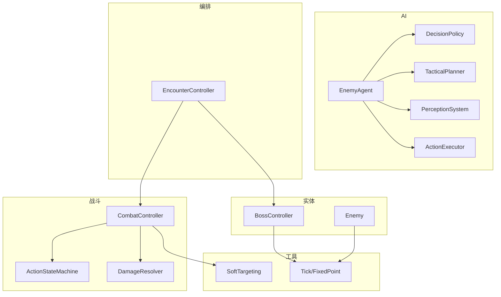
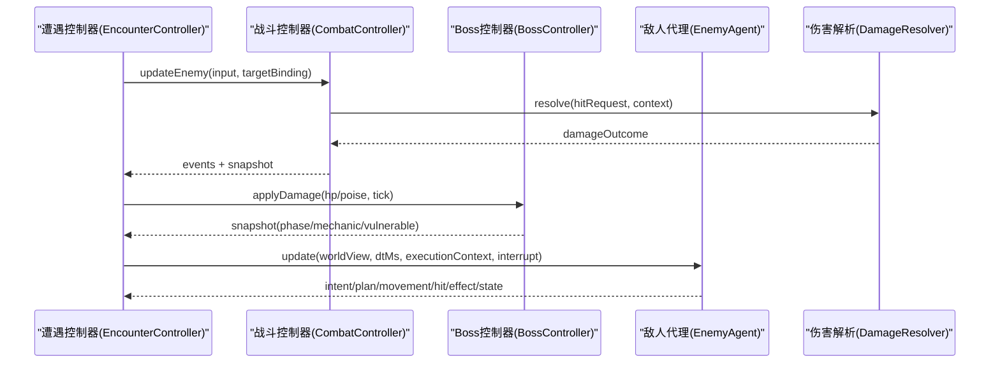
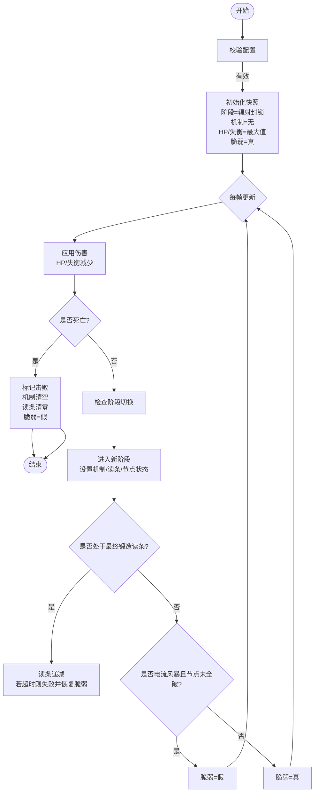
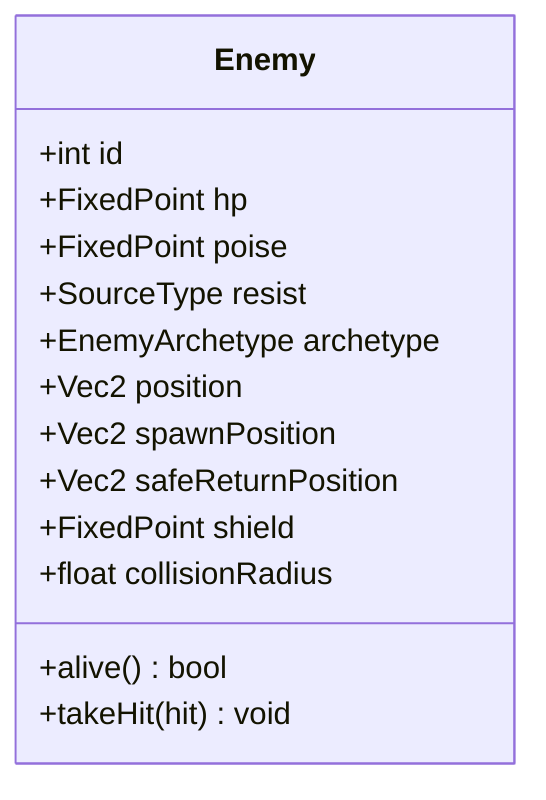
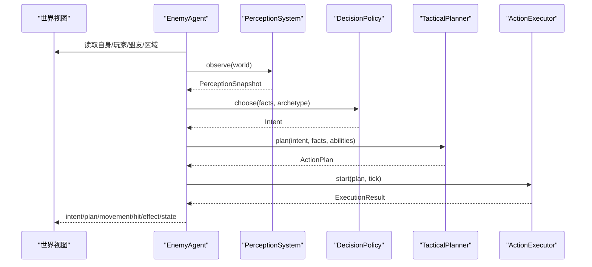
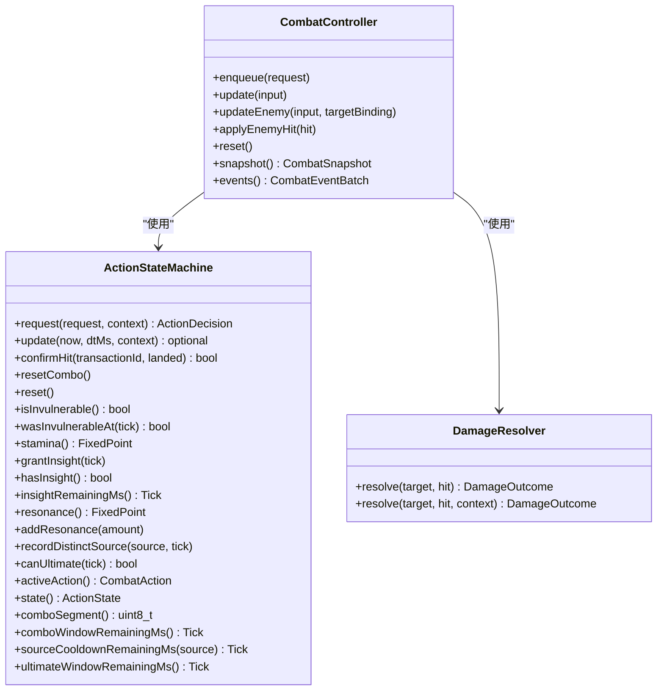
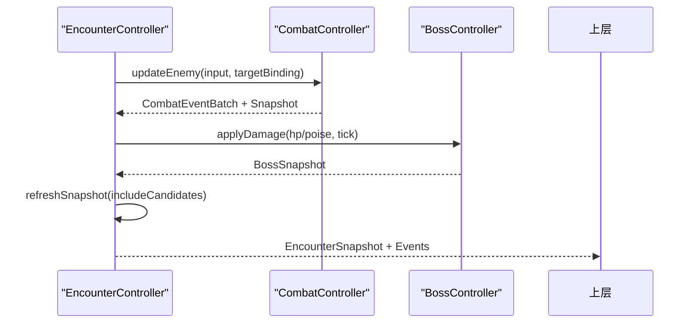
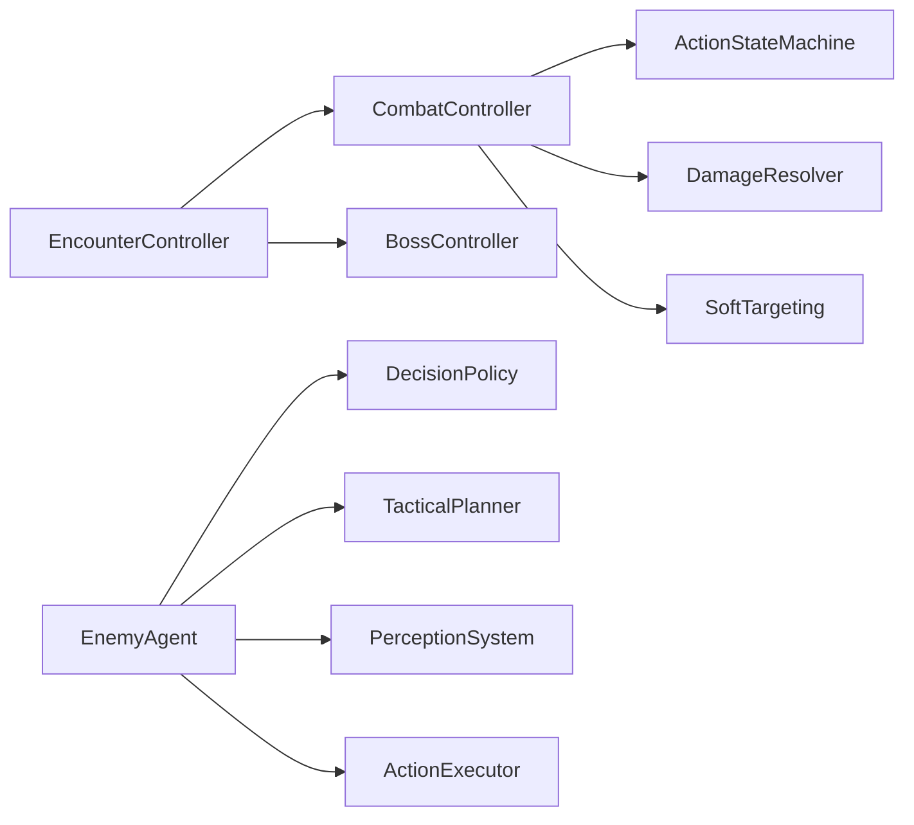

# 实体管理系统

<cite>
**本文引用的文件**   
- [boss.h](file://native/gameplay/entities/boss.h)
- [boss.cpp](file://native/gameplay/entities/boss.cpp)
- [enemy.h](file://native/gameplay/entities/enemy.h)
- [enemy_agent.h](file://native/gameplay/ai/enemy_agent.h)
- [enemy_agent.cpp](file://native/gameplay/ai/enemy_agent.cpp)
- [enemy_ai_types.h](file://native/gameplay/ai/enemy_ai_types.h)
- [enemy_archetypes.h](file://native/gameplay/ai/enemy_archetypes.h)
- [encounter_controller.h](file://native/gameplay/ai/encounter_controller.h)
- [combat_controller.h](file://native/gameplay/combat/combat_controller.h)
- [action_state_machine.h](file://native/gameplay/combat/action_state_machine.h)
- [damage_resolver.h](file://native/gameplay/combat/damage_resolver.h)
- [soft_targeting.h](file://native/gameplay/targeting/soft_targeting.h)
- [tick_clock.h](file://native/engine/core/tick_clock.h)
- [enemies.json](file://config/dev/enemies.json)
- [test_boss_controller.cpp](file://tests/test_boss_controller.cpp)
</cite>

## 目录
1. [简介](#简介)
2. [项目结构](#项目结构)
3. [核心组件](#核心组件)
4. [架构总览](#架构总览)
5. [详细组件分析](#详细组件分析)
6. [依赖关系分析](#依赖关系分析)
7. [性能考量](#性能考量)
8. [故障排查指南](#故障排查指南)
9. [结论](#结论)
10. [附录](#附录)

## 简介
本技术文档围绕 my-world 的实体管理系统，系统性阐述 Boss 实体的多阶段战斗、特殊技能与剧情触发机制；Enemy 基类的设计模式（通用属性、行为模板、生命周期）；实体继承体系与组件化设计；以及实体与战斗系统的集成方式（碰撞检测、伤害接收、死亡处理）。同时给出内存管理、批量操作与性能优化的实践建议，并通过测试用例展示 Boss 战斗流程、敌人行为配置与状态同步的关键路径。

## 项目结构
本项目将实体与 AI、战斗系统解耦为多个模块：
- 实体定义：BossController、Enemy
- AI 决策与执行：EnemyAgent、ActionExecutor、DecisionPolicy、TacticalPlanner、PerceptionSystem
- 战斗控制与伤害：CombatController、ActionStateMachine、DamageResolver
- 遭遇战编排：EncounterController
- 软目标选择：SoftTargeting
- 基础类型：Tick、FixedPoint

图表来源
- [encounter_controller.h:108-151](file://native/gameplay/ai/encounter_controller.h#L108-L151)
- [combat_controller.h:68-117](file://native/gameplay/combat/combat_controller.h#L68-L117)
- [action_state_machine.h:24-91](file://native/gameplay/combat/action_state_machine.h#L24-L91)
- [damage_resolver.h:28-38](file://native/gameplay/combat/damage_resolver.h#L28-L38)
- [enemy_agent.h:55-107](file://native/gameplay/ai/enemy_agent.h#L55-L107)
- [boss.h:69-94](file://native/gameplay/entities/boss.h#L69-L94)
- [enemy.h:5-24](file://native/gameplay/entities/enemy.h#L5-L24)
- [soft_targeting.h:30-42](file://native/gameplay/targeting/soft_targeting.h#L30-L42)
- [tick_clock.h:1-7](file://native/engine/core/tick_clock.h#L1-L7)

章节来源
- [encounter_controller.h:108-151](file://native/gameplay/ai/encounter_controller.h#L108-L151)
- [combat_controller.h:68-117](file://native/gameplay/combat/combat_controller.h#L68-L117)
- [action_state_machine.h:24-91](file://native/gameplay/combat/action_state_machine.h#L24-L91)
- [damage_resolver.h:28-38](file://native/gameplay/combat/damage_resolver.h#L28-L38)
- [enemy_agent.h:55-107](file://native/gameplay/ai/enemy_agent.h#L55-L107)
- [boss.h:69-94](file://native/gameplay/entities/boss.h#L69-L94)
- [enemy.h:5-24](file://native/gameplay/entities/enemy.h#L5-L24)
- [soft_targeting.h:30-42](file://native/gameplay/targeting/soft_targeting.h#L30-L42)
- [tick_clock.h:1-7](file://native/engine/core/tick_clock.h#L1-L7)

## 核心组件
- BossController：负责 Boss 的多阶段切换、机制倒计时、节点破坏与脆弱性判定，提供快照与重试能力。
- Enemy：通用敌人数据结构，包含生命值、失衡值、抗性、原型、位置、护盾与碰撞半径等，并提供受击简化逻辑。
- EnemyAgent：基于感知、策略、战术规划与动作执行的完整 AI 代理，支持冷却、硬直、区域约束与分离避让。
- CombatController：玩家侧战斗状态机、连段、资源管理与事件批处理，统一敌我交互接口。
- ActionStateMachine：动作请求受理、时间线推进、命中确认与无敌窗口管理。
- DamageResolver：方向性防御、护盾与韧性计算，输出伤害结果。
- EncounterController：遭遇战编排，整合普通敌人、Boss 与玩家战斗控制器，驱动关卡阶段与胜负。
- SoftTargeting：基于距离与角度的软目标选择，辅助 UI 与输入层。

章节来源
- [boss.h:69-94](file://native/gameplay/entities/boss.h#L69-L94)
- [enemy.h:5-24](file://native/gameplay/entities/enemy.h#L5-L24)
- [enemy_agent.h:55-107](file://native/gameplay/ai/enemy_agent.h#L55-L107)
- [combat_controller.h:68-117](file://native/gameplay/combat/combat_controller.h#L68-L117)
- [action_state_machine.h:24-91](file://native/gameplay/combat/action_state_machine.h#L24-L91)
- [damage_resolver.h:28-38](file://native/gameplay/combat/damage_resolver.h#L28-L38)
- [encounter_controller.h:108-151](file://native/gameplay/ai/encounter_controller.h#L108-L151)
- [soft_targeting.h:30-42](file://native/gameplay/targeting/soft_targeting.h#L30-L42)

## 架构总览
下图展示了从遭遇战编排到 Boss/AI/战斗控制的调用链与数据流。

图表来源
- [encounter_controller.h:108-151](file://native/gameplay/ai/encounter_controller.h#L108-L151)
- [combat_controller.h:68-117](file://native/gameplay/combat/combat_controller.h#L68-L117)
- [boss.h:69-94](file://native/gameplay/entities/boss.h#L69-L94)
- [enemy_agent.h:55-107](file://native/gameplay/ai/enemy_agent.h#L55-L107)
- [damage_resolver.h:28-38](file://native/gameplay/combat/damage_resolver.h#L28-L38)

## 详细组件分析

### Boss 控制器与多阶段战斗
- 阶段枚举与机制：包括“辐射封锁”“电流风暴”“腐蚀崩塌”，对应不同机制与可打断条件。
- 配置与校验：最大生命、失衡阈值、阶段阈值、最终锻造读条时长、节点数量等，启动前进行有效性检查。
- 阶段切换：HP 低于阈值时进入下一阶段，记录过渡次数与时间戳，重置节点状态或开启读条。
- 脆弱性判定：在“电流风暴”阶段需破坏全部节点才允许受到伤害；其他阶段默认脆弱。
- 读条机制：第三阶段“最终锻造”读条期间若未成功打断则失败并恢复脆弱性；若使用共鸣+终结技则成功打断并进入脆弱期。
- 重试：重置运行时状态至初始阶段与数值，便于重开挑战。

图表来源
- [boss.cpp:13-38](file://native/gameplay/entities/boss.cpp#L13-L38)
- [boss.cpp:40-59](file://native/gameplay/entities/boss.cpp#L40-L59)
- [boss.cpp:61-84](file://native/gameplay/entities/boss.cpp#L61-L84)
- [boss.cpp:99-129](file://native/gameplay/entities/boss.cpp#L99-L129)
- [boss.cpp:131-141](file://native/gameplay/entities/boss.cpp#L131-L141)

章节来源
- [boss.h:8-31](file://native/gameplay/entities/boss.h#L8-L31)
- [boss.h:41-67](file://native/gameplay/entities/boss.h#L41-L67)
- [boss.h:69-94](file://native/gameplay/entities/boss.h#L69-L94)
- [boss.cpp:1-146](file://native/gameplay/entities/boss.cpp#L1-L146)

### Enemy 基类与通用属性
- 字段说明：id、hp、poise、resist、archetype、position/spawn/safeReturn、shield、collisionRadius。
- 生命周期：alive() 判断存活；takeHit() 简化受击逻辑（扣血与失衡）。
- 扩展点：通过 archetype 区分不同敌人原型，配合 AI 配置表快速生成行为。

图表来源
- [enemy.h:5-24](file://native/gameplay/entities/enemy.h#L5-L24)

章节来源
- [enemy.h:5-24](file://native/gameplay/entities/enemy.h#L5-L24)

### 敌人 AI 代理（EnemyAgent）
- 输入与输出：EnemyUpdateInput 提供世界视图、dtMs、执行上下文与中断；返回 EnemyUpdateResult 包含意图、计划、移动、分离、命中、效果、状态与逃生状态。
- 感知与策略：PerceptionSystem 观察世界，DecisionPolicy 根据事实与原型选择意图，TacticalPlanner 生成行动计划，ActionExecutor 执行并产出命中/效果。
- 区域与约束：CombatRegion 保证目标位置投影到区域内；separationFor 计算与其他盟友的分离力，避免拥挤。
- 硬直与恢复：stagger 锁定时中断执行器，按配置恢复后重置执行器与最后计划。
- 进度跟踪与逃生：当目标不可达或长时间无进展时，进入“返回安全点”逃生状态，重新规划 BreakFree 意图。

图表来源
- [enemy_agent.h:33-53](file://native/gameplay/ai/enemy_agent.h#L33-L53)
- [enemy_agent.h:55-107](file://native/gameplay/ai/enemy_agent.h#L55-L107)
- [enemy_agent.cpp:271-373](file://native/gameplay/ai/enemy_agent.cpp#L271-L373)

章节来源
- [enemy_agent.h:14-53](file://native/gameplay/ai/enemy_agent.h#L14-L53)
- [enemy_agent.h:55-107](file://native/gameplay/ai/enemy_agent.h#L55-L107)
- [enemy_agent.cpp:1-392](file://native/gameplay/ai/enemy_agent.cpp#L1-L392)

### 战斗系统与伤害结算
- CombatController：维护玩家状态、目标绑定、事件批处理；update/updateEnemy/applyEnemyHit 统一入口。
- ActionStateMachine：动作请求受理、连段窗口、资源（耐力/洞察/共鸣）、冷却与无敌窗口管理。
- DamageResolver：结合攻击者/防守者位置与朝向，应用方向性防御、护盾与韧性，输出 DamageOutcome。

图表来源
- [combat_controller.h:68-117](file://native/gameplay/combat/combat_controller.h#L68-L117)
- [action_state_machine.h:24-91](file://native/gameplay/combat/action_state_machine.h#L24-L91)
- [damage_resolver.h:28-38](file://native/gameplay/combat/damage_resolver.h#L28-L38)

章节来源
- [combat_controller.h:12-54](file://native/gameplay/combat/combat_controller.h#L12-L54)
- [combat_controller.h:68-117](file://native/gameplay/combat/combat_controller.h#L68-L117)
- [action_state_machine.h:11-17](file://native/gameplay/combat/action_state_machine.h#L11-L17)
- [action_state_machine.h:24-91](file://native/gameplay/combat/action_state_machine.h#L24-L91)
- [damage_resolver.h:9-19](file://native/gameplay/combat/damage_resolver.h#L9-L19)
- [damage_resolver.h:28-38](file://native/gameplay/combat/damage_resolver.h#L28-L38)

### 遭遇战编排与 Boss 集成
- EncounterController：管理训练、野兽、混合、守卫、关卡流程与 Boss 模式；维护敌人槽位、候选目标、Boss 快照与事件批次。
- 与 CombatController 协作：统一应用敌人命中、刷新快照、推进关卡阶段、重试 Boss。
- 与 BossController 协作：在 Boss 模式下注入 Boss 目标与伤害，驱动阶段切换与机制判定。

图表来源
- [encounter_controller.h:108-151](file://native/gameplay/ai/encounter_controller.h#L108-L151)
- [combat_controller.h:68-117](file://native/gameplay/combat/combat_controller.h#L68-L117)
- [boss.h:69-94](file://native/gameplay/entities/boss.h#L69-L94)

章节来源
- [encounter_controller.h:42-58](file://native/gameplay/ai/encounter_controller.h#L42-L58)
- [encounter_controller.h:88-101](file://native/gameplay/ai/encounter_controller.h#L88-L101)
- [encounter_controller.h:108-151](file://native/gameplay/ai/encounter_controller.h#L108-L151)

### 软目标选择
- SoftTargeting：根据玩家位置、相机偏航角与候选目标集合，选择最佳目标（考虑距离与角度）。
- 与 AI/战斗系统集成：为敌人代理与 UI 提供目标候选，提升交互自然度。

章节来源
- [soft_targeting.h:9-24](file://native/gameplay/targeting/soft_targeting.h#L9-L24)
- [soft_targeting.h:30-42](file://native/gameplay/targeting/soft_targeting.h#L30-L42)

### 基础类型与时间
- Tick/FixedPoint：统一时间步长与定点数精度，确保跨平台一致性与确定性。

章节来源
- [tick_clock.h:1-7](file://native/engine/core/tick_clock.h#L1-L7)

## 依赖关系分析
- 低耦合高内聚：EncounterController 聚合 CombatController 与 BossController，屏蔽内部细节；EnemyAgent 通过 Perception/Policy/Planner/Executor 组合实现行为。
- 明确的数据契约：DamageOutcome、CombatSnapshot、EncounterSnapshot、BossSnapshot 作为各模块间稳定接口。
- 潜在循环依赖规避：AI 不直接依赖战斗控制器，仅通过执行上下文与事件输出；Boss 不依赖 AI，仅响应伤害与输入。

图表来源
- [encounter_controller.h:108-151](file://native/gameplay/ai/encounter_controller.h#L108-L151)
- [combat_controller.h:68-117](file://native/gameplay/combat/combat_controller.h#L68-L117)
- [action_state_machine.h:24-91](file://native/gameplay/combat/action_state_machine.h#L24-L91)
- [damage_resolver.h:28-38](file://native/gameplay/combat/damage_resolver.h#L28-L38)
- [enemy_agent.h:55-107](file://native/gameplay/ai/enemy_agent.h#L55-L107)
- [soft_targeting.h:30-42](file://native/gameplay/targeting/soft_targeting.h#L30-L42)

章节来源
- [encounter_controller.h:108-151](file://native/gameplay/ai/encounter_controller.h#L108-L151)
- [combat_controller.h:68-117](file://native/gameplay/combat/combat_controller.h#L68-L117)
- [enemy_agent.h:55-107](file://native/gameplay/ai/enemy_agent.h#L55-L107)

## 性能考量
- 固定步长与确定性：使用 Tick/FixedPoint 确保逻辑步进一致，降低浮点抖动带来的不确定性。
- 批量事件处理：CombatController 与 EncounterController 以事件批次输出，减少渲染与 UI 开销。
- 区域与分离优化：CombatRegion 与 separationFor 限制计算范围，避免全局扫描。
- 冷却与状态缓存：EnemyAgent 对能力冷却与感知记忆进行缓存，减少重复计算。
- 内存管理建议：
  - 使用对象池复用 EnemyAgent/ActionExecutor 实例，避免频繁分配。
  - 快照结构体尽量按访问顺序布局，提高缓存命中率。
  - 事件批次采用环形缓冲，避免扩容拷贝。
- 性能监控：结合 Presentation 层的 performance_guard 与采集脚本，定位热点函数与帧耗时。

[本节为通用指导，无需代码引用]

## 故障排查指南
- Boss 阶段未切换：检查 HP 阈值与 phaseTwo/three 触发标志；确认 applyDamage 调用路径与 tick 单调递增。
- 节点破坏无效：验证 breakCurrentNode 的索引与阶段是否为 CurrentStorm；确认 nodesBroken 计数与脆弱性刷新。
- 最终锻造读条失败：确认 update 中 resonanceAvailable 与 ultimateUsed 的组合条件；检查 castRemainingMs 递减逻辑。
- 敌人 AI 卡住：检查 stagger 锁与恢复时间；查看 escapeState 是否进入 ReturningToSafePoint；确认 region 投影与 separation 计算。
- 伤害结算异常：核对 DamageResolutionContext 的方向向量与最小点积阈值；确认护盾与韧性优先级。

章节来源
- [boss.cpp:61-84](file://native/gameplay/entities/boss.cpp#L61-L84)
- [boss.cpp:99-129](file://native/gameplay/entities/boss.cpp#L99-L129)
- [enemy_agent.cpp:271-373](file://native/gameplay/ai/enemy_agent.cpp#L271-L373)
- [damage_resolver.h:28-38](file://native/gameplay/combat/damage_resolver.h#L28-L38)

## 结论
my-world 的实体管理系统以清晰的职责划分与稳定的数据契约实现了可扩展的 Boss 与敌人体系。BossController 的多阶段与机制设计提供了丰富的战斗体验；EnemyAgent 的感知—策略—规划—执行链路保证了敌人的智能与可控性；CombatController 与 DamageResolver 确保了伤害结算的一致性与表现解耦。通过合理的内存与性能优化策略，系统可在移动端平台上稳定运行。

[本节为总结，无需代码引用]

## 附录
- Boss 战斗流程示例（基于测试）：
  - 启动 Boss 配置，应用伤害触发阶段切换，破坏节点后进入脆弱期，最终锻造读条期间使用共鸣+终结技打断，最终击败。
  - 参考路径：[test_boss_controller.cpp:1-150](file://tests/test_boss_controller.cpp#L1-L150)

- 敌人行为配置示例（开发期 JSON）：
  - enemies.json 定义了敌人 ID、生命值与抗性，用于快速装配敌人原型。
  - 参考路径：[enemies.json:1-2](file://config/dev/enemies.json#L1-L2)

- 关键代码片段路径（不含具体代码内容）：
  - Boss 阶段切换与脆弱性刷新：[boss.cpp:99-141](file://native/gameplay/entities/boss.cpp#L99-L141)
  - 敌人代理主循环与逃生逻辑：[enemy_agent.cpp:271-373](file://native/gameplay/ai/enemy_agent.cpp#L271-L373)
  - 战斗控制器更新与事件批处理：[combat_controller.h:68-117](file://native/gameplay/combat/combat_controller.h#L68-L117)
  - 伤害解析上下文与结果结构：[damage_resolver.h:21-38](file://native/gameplay/combat/damage_resolver.h#L21-L38)

章节来源
- [test_boss_controller.cpp:1-150](file://tests/test_boss_controller.cpp#L1-L150)
- [enemies.json:1-2](file://config/dev/enemies.json#L1-L2)
- [boss.cpp:99-141](file://native/gameplay/entities/boss.cpp#L99-L141)
- [enemy_agent.cpp:271-373](file://native/gameplay/ai/enemy_agent.cpp#L271-L373)
- [combat_controller.h:68-117](file://native/gameplay/combat/combat_controller.h#L68-L117)
- [damage_resolver.h:21-38](file://native/gameplay/combat/damage_resolver.h#L21-L38)