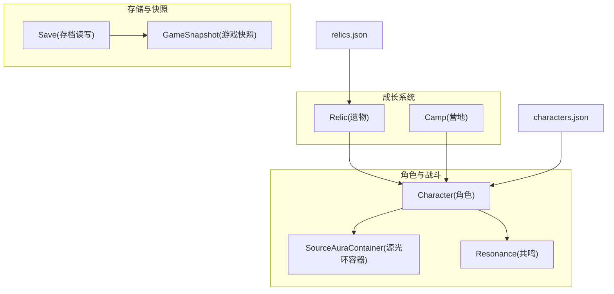
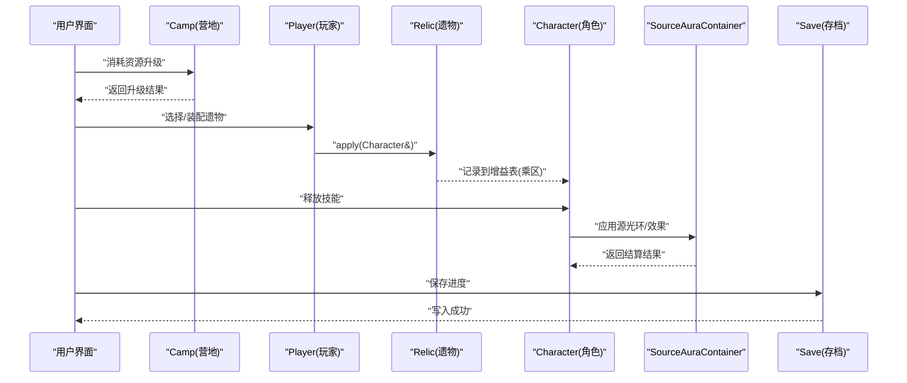
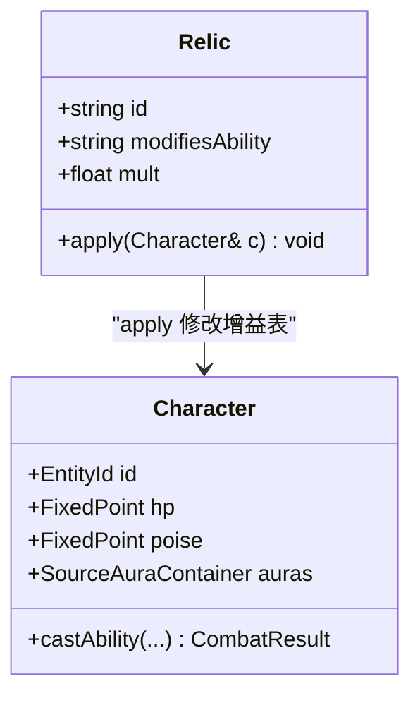
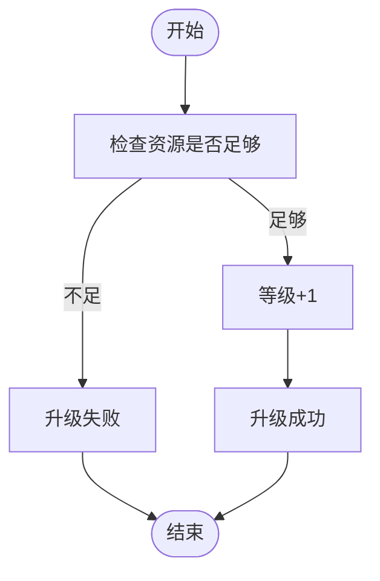
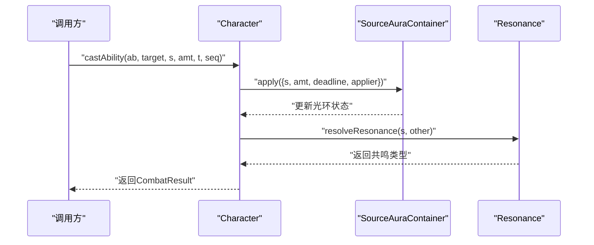
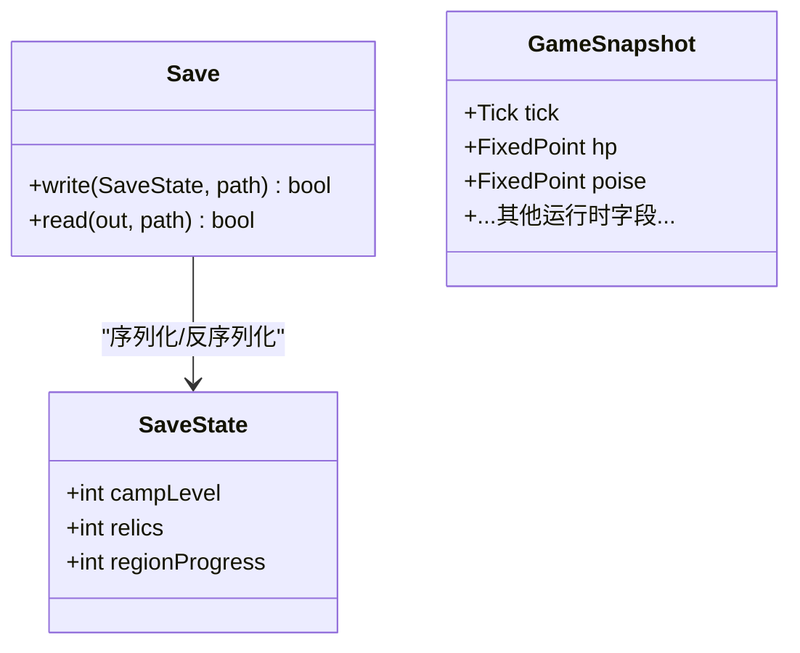
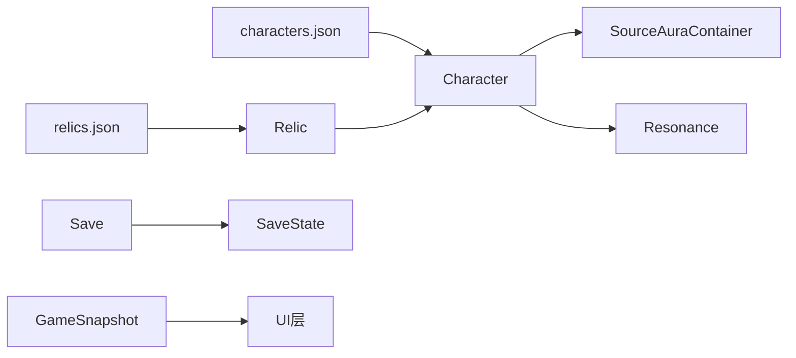

# 成长系统

<cite>
**本文引用的文件**   
- [relic.h](file://native/gameplay/growth/relic.h)
- [relic.cpp](file://native/gameplay/growth/relic.cpp)
- [camp.h](file://native/gameplay/growth/camp.h)
- [characters.json](file://config/dev/characters.json)
- [relics.json](file://config/dev/relics.json)
- [character.h](file://native/gameplay/player/character.h)
- [character.cpp](file://native/gameplay/player/character.cpp)
- [source_aura.h](file://native/gameplay/combat/source_aura.h)
- [resonance.h](file://native/gameplay/combat/resonance.h)
- [save.h](file://native/engine/resource/save.h)
- [save.cpp](file://native/engine/resource/save.cpp)
- [game_snapshot.h](file://native/engine/core/game_snapshot.h)
</cite>

## 目录
1. [简介](#简介)
2. [项目结构](#项目结构)
3. [核心组件](#核心组件)
4. [架构总览](#架构总览)
5. [详细组件分析](#详细组件分析)
6. [依赖关系分析](#依赖关系分析)
7. [性能考虑](#性能考虑)
8. [故障排查指南](#故障排查指南)
9. [结论](#结论)
10. [附录](#附录)

## 简介
本技术文档围绕 my-world 的成长系统展开，重点覆盖以下方面：
- Relic 遗物系统：属性加成、套装效果与随机生成机制的设计思路与实现要点。
- Camp 营地系统：角色培养、技能升级与资源管理的流程与数据结构。
- 成长数据持久化：存档格式、版本兼容与数据迁移策略。
- 与战斗系统的集成：属性计算、装备合成与效果叠加方式。
- 数值平衡、随机性控制与用户体验优化等关键设计考量。

## 项目结构
成长系统相关代码主要分布在 gameplay/growth 与 player、combat、engine/resource 等模块中；配置数据位于 config/dev 下。整体采用“轻量结构体 + 配置驱动”的 MVP 风格，便于快速迭代与扩展。

图表来源
- [relic.h:1-6](file://native/gameplay/growth/relic.h#L1-L6)
- [camp.h:1-3](file://native/gameplay/growth/camp.h#L1-L3)
- [character.h:1-6](file://native/gameplay/player/character.h#L1-L6)
- [source_aura.h:1-11](file://native/gameplay/combat/source_aura.h#L1-L11)
- [resonance.h:1-5](file://native/gameplay/combat/resonance.h#L1-L5)
- [save.h:1-5](file://native/engine/resource/save.h#L1-L5)
- [game_snapshot.h:1-77](file://native/engine/core/game_snapshot.h#L1-L77)
- [characters.json:1-2](file://config/dev/characters.json#L1-L2)
- [relics.json:1-2](file://config/dev/relics.json#L1-L2)

章节来源
- [relic.h:1-6](file://native/gameplay/growth/relic.h#L1-L6)
- [camp.h:1-3](file://native/gameplay/growth/camp.h#L1-L3)
- [character.h:1-6](file://native/gameplay/player/character.h#L1-L6)
- [save.h:1-5](file://native/engine/resource/save.h#L1-L5)
- [game_snapshot.h:1-77](file://native/engine/core/game_snapshot.h#L1-L77)
- [characters.json:1-2](file://config/dev/characters.json#L1-L2)
- [relics.json:1-2](file://config/dev/relics.json#L1-L2)

## 核心组件
- Relic（遗物）：以 id、modifiesAbility、mult 描述对某项能力的倍率加成，并提供 apply(Character&) 接口在运行时生效。
- Camp（营地）：维护等级与升级逻辑，基于资源（如 sourceTraces）进行升级判定。
- Character（角色）：持有 hp、poise、auras 等状态，提供 castAbility 能力释放入口，并与 SourceAuraContainer 协作。
- Save（存档）：读写 campLevel、relics、regionProgress 等关键进度字段，使用原子替换保证一致性。
- GameSnapshot（快照）：承载大量运行时状态，用于 UI 展示与调试。

章节来源
- [relic.h:1-6](file://native/gameplay/growth/relic.h#L1-L6)
- [relic.cpp:1-3](file://native/gameplay/growth/relic.cpp#L1-L3)
- [camp.h:1-3](file://native/gameplay/growth/camp.h#L1-L3)
- [character.h:1-6](file://native/gameplay/player/character.h#L1-L6)
- [character.cpp:1-6](file://native/gameplay/player/character.cpp#L1-L6)
- [save.h:1-5](file://native/engine/resource/save.h#L1-L5)
- [save.cpp:1-14](file://native/engine/resource/save.cpp#L1-L14)
- [game_snapshot.h:1-77](file://native/engine/core/game_snapshot.h#L1-L77)

## 架构总览
成长系统与战斗系统通过 Character 与 SourceAuraContainer 耦合：遗物在应用时向角色的增益表写入乘区，战斗结算时统一读取并计算最终伤害或效果。营地升级产出资源，驱动角色能力与遗物装配。

图表来源
- [camp.h:1-3](file://native/gameplay/growth/camp.h#L1-L3)
- [relic.h:1-6](file://native/gameplay/growth/relic.h#L1-L6)
- [relic.cpp:1-3](file://native/gameplay/growth/relic.cpp#L1-L3)
- [character.h:1-6](file://native/gameplay/player/character.h#L1-L6)
- [character.cpp:1-6](file://native/gameplay/player/character.cpp#L1-L6)
- [source_aura.h:1-11](file://native/gameplay/combat/source_aura.h#L1-L11)
- [save.h:1-5](file://native/engine/resource/save.h#L1-L5)
- [save.cpp:1-14](file://native/engine/resource/save.cpp#L1-L14)

## 详细组件分析

### Relic 遗物系统
- 数据结构：id、modifiesAbility、mult。
- 应用流程：Relic::apply 将乘区信息记录到 Character 的增益表，战斗结算时按 mult 叠加。
- 配置驱动：relics.json 定义可用遗物及其目标能力与倍率。
- 随机生成：可在加载关卡或掉落时从 relics.json 中按权重随机抽取，支持稀有度与词条组合。

图表来源
- [relic.h:1-6](file://native/gameplay/growth/relic.h#L1-L6)
- [character.h:1-6](file://native/gameplay/player/character.h#L1-L6)

章节来源
- [relic.h:1-6](file://native/gameplay/growth/relic.h#L1-L6)
- [relic.cpp:1-3](file://native/gameplay/growth/relic.cpp#L1-L3)
- [relics.json:1-2](file://config/dev/relics.json#L1-L2)

### Camp 营地系统
- 功能：维护营地等级与升级判定，依据输入资源（如 sourceTraces）决定是否升级。
- 资源管理：升级消耗阈值可配置，建议后续引入更细粒度的资源类型与消耗表。
- 与角色培养：升级后可解锁新能力槽位或提升基础属性，为后续装备合成与遗物装配提供基础。

图表来源
- [camp.h:1-3](file://native/gameplay/growth/camp.h#L1-L3)

章节来源
- [camp.h:1-3](file://native/gameplay/growth/camp.h#L1-L3)

### 角色与战斗集成
- Character::castAbility 将源类型与量值写入 SourceAuraContainer，并在结算时结合共鸣与反应系统产生最终效果。
- SourceAuraContainer 负责应用、衰减与消费各类源光环，确保多来源效果的顺序与生命周期可控。
- Resonance 系统根据源类型组合决定共鸣类型，影响伤害、破韧与附加状态。

图表来源
- [character.cpp:1-6](file://native/gameplay/player/character.cpp#L1-L6)
- [source_aura.h:1-11](file://native/gameplay/combat/source_aura.h#L1-L11)
- [resonance.h:1-5](file://native/gameplay/combat/resonance.h#L1-L5)

章节来源
- [character.h:1-6](file://native/gameplay/player/character.h#L1-L6)
- [character.cpp:1-6](file://native/gameplay/player/character.cpp#L1-L6)
- [source_aura.h:1-11](file://native/gameplay/combat/source_aura.h#L1-L11)
- [resonance.h:1-5](file://native/gameplay/combat/resonance.h#L1-L5)

### 数据持久化与存档
- SaveState 包含 campLevel、relics、regionProgress 等关键进度字段。
- Save 使用临时文件写入后原子替换，避免损坏存档。
- GameSnapshot 承载运行时状态，可用于 UI 展示与调试，但不直接等同于存档结构。

图表来源
- [save.h:1-5](file://native/engine/resource/save.h#L1-L5)
- [save.cpp:1-14](file://native/engine/resource/save.cpp#L1-L14)
- [game_snapshot.h:1-77](file://native/engine/core/game_snapshot.h#L1-L77)

章节来源
- [save.h:1-5](file://native/engine/resource/save.h#L1-L5)
- [save.cpp:1-14](file://native/engine/resource/save.cpp#L1-L14)
- [game_snapshot.h:1-77](file://native/engine/core/game_snapshot.h#L1-L77)

### 配置与数据绑定
- characters.json 定义角色初始属性（如 hp、poise）。
- relics.json 定义遗物词条与倍率，供随机生成与装配使用。
- 建议在 UI 层将上述配置映射为可读文本与可视化图标，增强体验。

章节来源
- [characters.json:1-2](file://config/dev/characters.json#L1-L2)
- [relics.json:1-2](file://config/dev/relics.json#L1-L2)

## 依赖关系分析
- Relic 依赖 Character 以注入增益；Character 依赖 SourceAuraContainer 与 Resonance 完成战斗结算。
- Save 独立于业务逻辑，仅负责持久化；GameSnapshot 作为运行时视图，与 UI 强耦合。
- 配置 JSON 被加载器解析后注入到对应系统，形成“配置驱动”的数据流。

图表来源
- [relics.json:1-2](file://config/dev/relics.json#L1-L2)
- [characters.json:1-2](file://config/dev/characters.json#L1-L2)
- [relic.h:1-6](file://native/gameplay/growth/relic.h#L1-L6)
- [character.h:1-6](file://native/gameplay/player/character.h#L1-L6)
- [source_aura.h:1-11](file://native/gameplay/combat/source_aura.h#L1-L11)
- [resonance.h:1-5](file://native/gameplay/combat/resonance.h#L1-L5)
- [save.h:1-5](file://native/engine/resource/save.h#L1-L5)
- [game_snapshot.h:1-77](file://native/engine/core/game_snapshot.h#L1-L77)

章节来源
- [relic.h:1-6](file://native/gameplay/growth/relic.h#L1-L6)
- [character.h:1-6](file://native/gameplay/player/character.h#L1-L6)
- [source_aura.h:1-11](file://native/gameplay/combat/source_aura.h#L1-L11)
- [resonance.h:1-5](file://native/gameplay/combat/resonance.h#L1-L5)
- [save.h:1-5](file://native/engine/resource/save.h#L1-L5)
- [game_snapshot.h:1-77](file://native/engine/core/game_snapshot.h#L1-L77)

## 性能考虑
- 遗物应用：建议将乘区合并与排序放在批量阶段执行，减少每帧重复计算。
- 源光环衰减：使用时间戳比较与惰性清理，避免全量遍历。
- 存档写入：保持原子替换策略，避免频繁 IO；必要时增加异步写入与队列。
- 快照传输：限制 GameSnapshot 字段数量与更新频率，降低 UI 渲染压力。

[本节为通用指导，不直接分析具体文件]

## 故障排查指南
- 遗物未生效：检查 Relic::apply 是否正确写入 Character 的增益表，确认 modifiableAbility 名称一致。
- 升级失败：核对 Camp::upgrade 的资源阈值与传入的 sourceTraces 是否符合预期。
- 存档损坏：确认 write 流程是否完成原子替换；读取失败时回退到默认值或提示恢复。
- 战斗异常：检查 SourceAuraContainer 的生命周期与衰减逻辑，确认 Resonance 返回值与期望一致。

章节来源
- [relic.cpp:1-3](file://native/gameplay/growth/relic.cpp#L1-L3)
- [camp.h:1-3](file://native/gameplay/growth/camp.h#L1-L3)
- [save.cpp:1-14](file://native/engine/resource/save.cpp#L1-L14)
- [source_aura.h:1-11](file://native/gameplay/combat/source_aura.h#L1-L11)
- [resonance.h:1-5](file://native/gameplay/combat/resonance.h#L1-L5)

## 结论
当前成长系统采用简洁的结构体与配置驱动模式，已具备遗物加成、营地升级与基础存档能力。后续可扩展方向包括：
- 完善 Relic 的套装效果与随机生成权重。
- 细化 Camp 的资源类型与升级树。
- 强化存档的版本兼容与迁移工具链。
- 深化与战斗系统的乘区与反应体系集成，提升数值深度与策略性。

[本节为总结性内容，不直接分析具体文件]

## 附录
- 代码示例路径（不含具体代码内容）：
  - 遗物属性计算：[relic.h:1-6](file://native/gameplay/growth/relic.h#L1-L6)、[relic.cpp:1-3](file://native/gameplay/growth/relic.cpp#L1-L3)
  - 角色升级流程：[camp.h:1-3](file://native/gameplay/growth/camp.h#L1-L3)
  - 养成界面数据绑定：[game_snapshot.h:1-77](file://native/engine/core/game_snapshot.h#L1-L77)
- 数值平衡建议：
  - 通过 relics.json 调整 mult 分布，避免极端收益。
  - 在 Camp 升级中引入软上限与边际递减，控制成长曲线。
- 随机性控制：
  - 使用伪随机种子与权重表，保证可复现与可控掉落。
- 用户体验优化：
  - 在 UI 中清晰展示遗物词条、套装激活状态与升级预览。
  - 提供一键装配与撤销操作，降低试错成本。

[本节为补充说明，不直接分析具体文件]