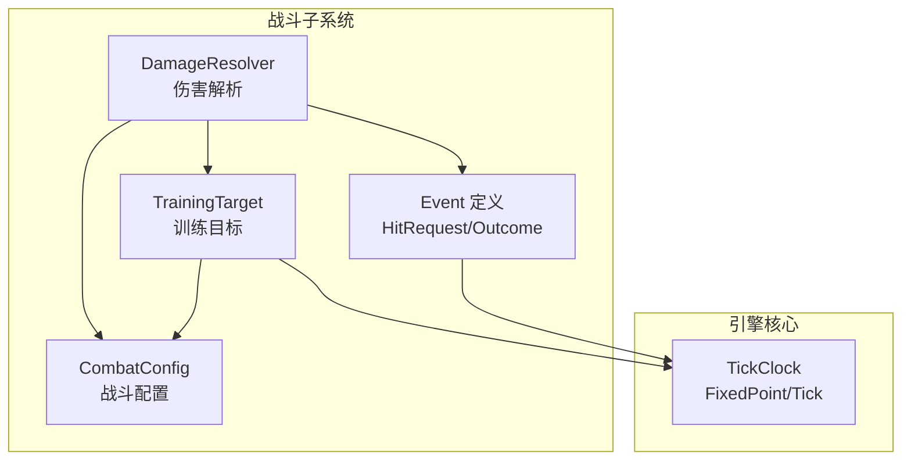
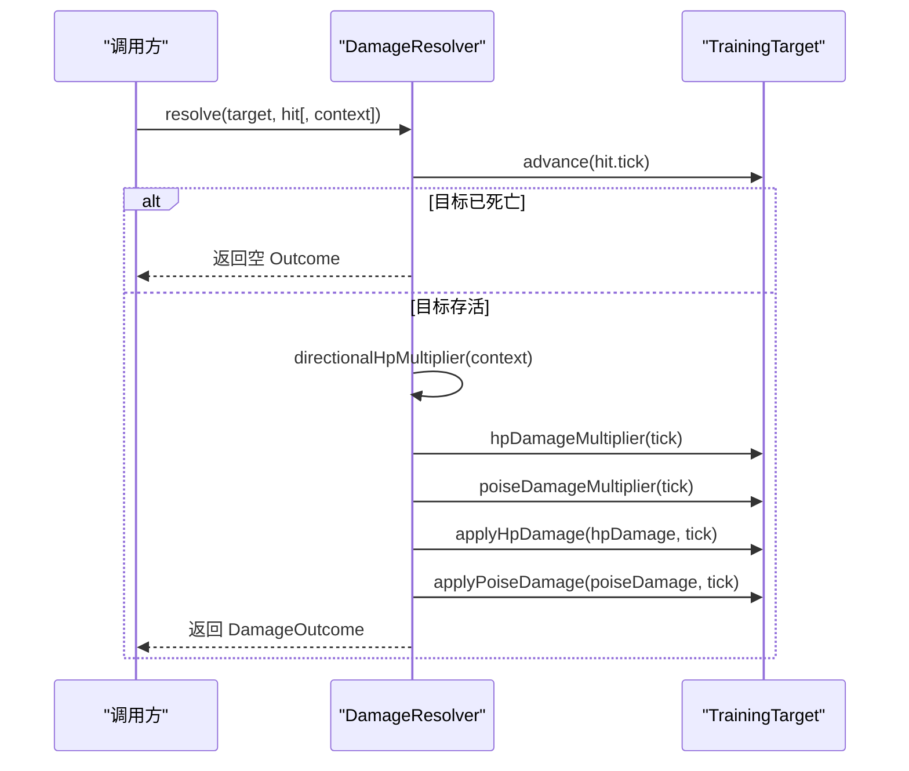
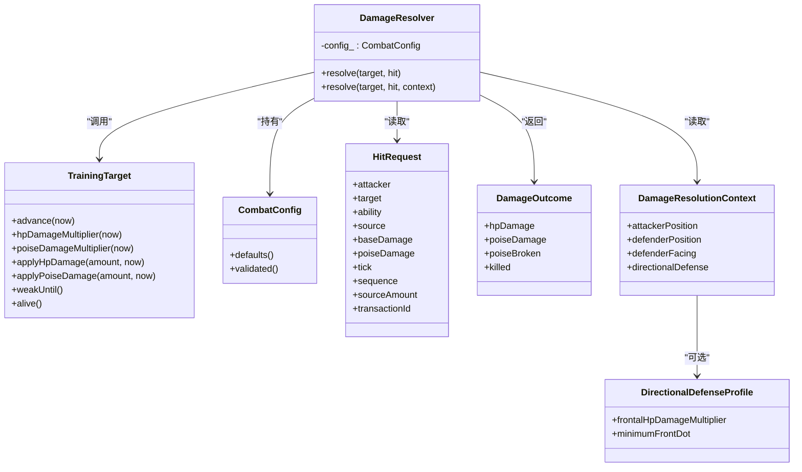

# 伤害解析系统

<cite>
**本文引用的文件**   
- [damage_resolver.h](file://native/gameplay/combat/damage_resolver.h)
- [damage_resolver.cpp](file://native/gameplay/combat/damage_resolver.cpp)
- [event.h](file://native/gameplay/combat/event.h)
- [training_target.h](file://native/gameplay/combat/training_target.h)
- [training_target.cpp](file://native/gameplay/combat/training_target.cpp)
- [combat_config.h](file://native/gameplay/combat/combat_config.h)
- [tick_clock.h](file://native/engine/core/tick_clock.h)
- [test_damage_resolver.cpp](file://tests/test_damage_resolver.cpp)
</cite>

## 目录
1. [简介](#简介)
2. [项目结构](#项目结构)
3. [核心组件](#核心组件)
4. [架构总览](#架构总览)
5. [详细组件分析](#详细组件分析)
6. [依赖关系分析](#依赖关系分析)
7. [性能与精度](#性能与精度)
8. [故障排查指南](#故障排查指南)
9. [结论](#结论)
10. [附录：数值平衡与示例](#附录数值平衡与示例)

## 简介
本技术文档围绕 DamageResolver 类及其相关数据结构，系统化阐述伤害计算系统的核心算法与流程。内容涵盖：
- HitRequest 伤害请求的数据结构与字段含义
- DamageOutcome 伤害结果的生成过程与语义
- 基础伤害、方向防御修正、目标抗性/状态修正的计算流程
- 护盾穿透与特殊效果触发（如破势、虚弱、停滞）的判定逻辑
- 精度控制、性能优化与调试方法

说明：当前仓库中未实现“物理/魔法/真实/元素”等类型化伤害分支；伤害计算以通用基础伤害与目标侧乘区为主。若需扩展多类型伤害，可在现有框架上按本节所述扩展点接入。

## 项目结构
DamageResolver 位于 native/gameplay/combat 模块，依赖 tick_clock 中的定点数与时间类型，以及 TrainingTarget、CombatConfig 和事件定义。测试用例位于 tests/test_damage_resolver.cpp，用于验证基本流程与关键边界行为。

图表来源
- [damage_resolver.h:28-37](file://native/gameplay/combat/damage_resolver.h#L28-L37)
- [training_target.h:6-43](file://native/gameplay/combat/training_target.h#L6-L43)
- [combat_config.h:9-56](file://native/gameplay/combat/combat_config.h#L9-L56)
- [event.h:16-27](file://native/gameplay/combat/event.h#L16-L27)
- [tick_clock.h:3-6](file://native/engine/core/tick_clock.h#L3-L6)

章节来源
- [damage_resolver.h:1-38](file://native/gameplay/combat/damage_resolver.h#L1-L38)
- [event.h:1-96](file://native/gameplay/combat/event.h#L1-L96)
- [training_target.h:1-44](file://native/gameplay/combat/training_target.h#L1-L44)
- [combat_config.h:1-153](file://native/gameplay/combat/combat_config.h#L1-L153)
- [tick_clock.h:1-7](file://native/engine/core/tick_clock.h#L1-L7)

## 核心组件
- DamageResolver：负责将一次攻击请求转化为对目标的实际伤害结果，包含方向防御修正与目标状态修正。
- TrainingTarget：承载目标的生命值、架势（Poise）、各种状态（虚弱、破势、停滞、腐蚀）及随时间推进的状态衰减。
- CombatConfig：集中管理战斗数值与时间窗口，提供默认值与校验逻辑。
- HitRequest / DamageOutcome：伤害输入与输出数据载体。
- TickClock：提供 FixedPoint 定点数与 Tick 时间单位，确保数值精度与确定性。

章节来源
- [damage_resolver.h:28-37](file://native/gameplay/combat/damage_resolver.h#L28-L37)
- [training_target.h:6-43](file://native/gameplay/combat/training_target.h#L6-L43)
- [combat_config.h:9-56](file://native/gameplay/combat/combat_config.h#L9-L56)
- [event.h:16-27](file://native/gameplay/combat/event.h#L16-L27)
- [tick_clock.h:3-6](file://native/engine/core/tick_clock.h#L3-L6)

## 架构总览
DamageResolver::resolve 的核心流程如下：
- 推进目标时间并检查存活
- 计算方向防御修正（正面命中时可能降低伤害）
- 应用目标 HP 与 Poise 的乘区修正（虚弱、破势、停滞等）
- 调用目标 applyHpDamage/applyPoiseDamage 扣减资源并触发状态变化
- 汇总 DamageOutcome（HP 伤害、Poise 伤害、是否破势、是否击杀）

图表来源
- [damage_resolver.cpp:40-64](file://native/gameplay/combat/damage_resolver.cpp#L40-L64)
- [training_target.cpp:15-32](file://native/gameplay/combat/training_target.cpp#L15-L32)
- [training_target.cpp:47-56](file://native/gameplay/combat/training_target.cpp#L47-L56)
- [training_target.cpp:58-74](file://native/gameplay/combat/training_target.cpp#L58-L74)

## 详细组件分析

### HitRequest 数据结构
- attacker/target：攻击者与目标实体 ID
- ability：技能标识
- source：可选的伤害来源类型（用于后续反应/共鸣扩展）
- baseDamage/poiseDamage：基础生命伤害与架势伤害
- tick：时间戳，用于状态推进与时效性判断
- sequence/transactionId：序列号与事务 ID，便于回放与一致性校验
- sourceAmount：源强度系数（当前默认 FP_ONE，预留扩展）

该结构为纯数据载体，不包含计算逻辑，便于在不同阶段传递与序列化。

章节来源
- [event.h:16-27](file://native/gameplay/combat/event.h#L16-L27)

### DamageOutcome 数据结构与生成
- hpDamage：实际扣除的生命值
- poiseDamage：实际扣除的架势值
- poiseBroken：本次是否导致破势（从有架势到零）
- killed：本次是否导致目标死亡

生成过程：
- 先推进目标时间，若目标已死亡则直接返回空结果
- 计算方向防御修正后的 defendedHpDamage
- 再乘以目标 HP/Poise 乘区得到最终伤害
- 调用目标 applyHpDamage/applyPoiseDamage 扣减并记录状态
- 根据前后状态设置 poiseBroken/killed

章节来源
- [damage_resolver.h:9-14](file://native/gameplay/combat/damage_resolver.h#L9-L14)
- [damage_resolver.cpp:44-64](file://native/gameplay/combat/damage_resolver.cpp#L44-L64)
- [training_target.cpp:58-74](file://native/gameplay/combat/training_target.cpp#L58-L74)

### 方向防御修正（DirectionalDefenseProfile）
- frontalHpDamageMultiplier：正面命中时的 HP 伤害倍率（通常小于等于 1）
- minimumFrontDot：判定“正面”的最小点积阈值
- 计算依据：攻击者相对位置与目标朝向的点积，超过阈值才生效
- 异常保护：非法参数或非有限值时回退为无修正（FP_ONE）

章节来源
- [damage_resolver.h:16-26](file://native/gameplay/combat/damage_resolver.h#L16-L26)
- [damage_resolver.cpp:10-35](file://native/gameplay/combat/damage_resolver.cpp#L10-L35)

### 目标乘区与状态（TrainingTarget）
- hpDamageMultiplier：综合虚弱与破势的 HP 伤害倍率
- poiseDamageMultiplier：停滞状态下的架势伤害倍率
- applyHpDamage：扣减生命值，并在归零时设置死亡重置时间
- applyPoiseDamage：扣减架势，归零时进入破势状态
- 状态推进：advance 会处理虚弱、破势、停滞、腐蚀等时效状态的衰减与恢复

章节来源
- [training_target.h:14-31](file://native/gameplay/combat/training_target.h#L14-L31)
- [training_target.cpp:47-56](file://native/gameplay/combat/training_target.cpp#L47-L56)
- [training_target.cpp:58-74](file://native/gameplay/combat/training_target.cpp#L58-L74)
- [training_target.cpp:15-32](file://native/gameplay/combat/training_target.cpp#L15-L32)

### 数值与精度（FixedPoint/Tick）
- FixedPoint：基于 int64_t 的定点数，1.0 对应 FP_ONE=1<<16
- fp()：double 转定点数的便捷函数
- multiply：使用 __int128 中间类型避免溢出，再除以 FP_ONE 还原精度
- Tick：int64_t 毫秒级时间戳，配合饱和加法防止溢出

章节来源
- [tick_clock.h:3-6](file://native/engine/core/tick_clock.h#L3-L6)
- [damage_resolver.cpp:6-8](file://native/gameplay/combat/damage_resolver.cpp#L6-L8)

### 战斗配置（CombatConfig）
- 训练目标初始 HP/Poise、死亡重置时间、破势持续时间与倍率
- 虚弱持续时间与倍率、停滞持续时间与架势倍率
- 其他战斗机制（耐力、闪避、洞察、源能力、共鸣、终极等）
- validated()：对所有字段进行合法性校验，非法值回退默认值

章节来源
- [combat_config.h:9-56](file://native/gameplay/combat/combat_config.h#L9-L56)
- [combat_config.h:58-134](file://native/gameplay/combat/combat_config.h#L58-L134)

### 伤害类型分类与扩展点
- 当前实现未区分物理/魔法/真实/元素等类型，所有伤害统一走 baseDamage 路径
- 扩展建议：在 HitRequest 中增加 damageType 字段，并在 DamageResolver 中按类型选择不同乘区或穿透规则；或在 TrainingTarget 中按类型维护抗性与弱点表

章节来源
- [event.h:16-27](file://native/gameplay/combat/event.h#L16-L27)
- [damage_resolver.cpp:44-64](file://native/gameplay/combat/damage_resolver.cpp#L44-L64)

## 依赖关系分析

图表来源
- [damage_resolver.h:21-37](file://native/gameplay/combat/damage_resolver.h#L21-L37)
- [training_target.h:6-43](file://native/gameplay/combat/training_target.h#L6-L43)
- [event.h:16-27](file://native/gameplay/combat/event.h#L16-L27)

## 性能与精度
- 定点数乘法：multiply 使用 __int128 中间类型，避免 64 位整数乘法溢出，再以 FP_ONE 归一化，保证高精度与可预测性
- 方向防御计算：仅涉及向量长度与点积，复杂度 O(1)，且含大量快速失败路径（非有限值、越界阈值）
- 状态推进：TrainingTarget::advance 线性处理若干时效状态，开销极低
- 内存与对象：DamageResolver 仅持有配置副本，无动态分配热点
- 建议：
  - 批量处理多次伤害时复用上下文以减少重复计算
  - 对高频路径保持无分支或分支预测友好的条件
  - 如需扩展多类型伤害，优先通过查表/枚举分支减少运行时开销

章节来源
- [damage_resolver.cpp:6-8](file://native/gameplay/combat/damage_resolver.cpp#L6-L8)
- [damage_resolver.cpp:10-35](file://native/gameplay/combat/damage_resolver.cpp#L10-L35)
- [training_target.cpp:15-32](file://native/gameplay/combat/training_target.cpp#L15-L32)

## 故障排查指南
- 结果为空：当目标已死亡时 resolve 返回空 Outcome，检查调用前是否已推进时间或目标状态
- 方向防御无效：确认 DirectionalDefenseProfile 的阈值与向量有限性；非法值会回退为无修正
- 乘区未生效：检查 TrainingTarget 的虚弱/破势/停滞状态是否在 tick 时刻有效
- 数值异常：核对 CombatConfig.validated() 是否回退默认值；检查输入是否为负或非有限
- 死亡后不复活：确认 deathResetAt 是否被正确设置与推进；dead.advance 应达到重置时间

章节来源
- [damage_resolver.cpp:44-64](file://native/gameplay/combat/damage_resolver.cpp#L44-L64)
- [training_target.cpp:15-32](file://native/gameplay/combat/training_target.cpp#L15-L32)
- [training_target.cpp:58-74](file://native/gameplay/combat/training_target.cpp#L58-L74)
- [combat_config.h:58-134](file://native/gameplay/combat/combat_config.h#L58-L134)

## 结论
DamageResolver 以简洁、确定性的方式实现了伤害计算主流程：基础伤害经方向防御与目标乘区修正后，由目标自身状态机完成资源扣减与状态切换。系统采用定点数保障精度，配置集中校验保障稳定性，测试覆盖关键路径。未来扩展多类型伤害与复杂乘区时，可在现有接口上平滑接入，无需改动核心流程。

## 附录：数值平衡与示例
- 基础流程示例（参考测试）：
  - 构造默认配置与目标，发起一次基础伤害请求，验证 HP 与 Poise 扣减与状态变化
  - 触发破势后，验证弱状态下 HP 伤害倍率提升
  - 验证死亡重置与状态恢复
- 关键配置项（默认值）：
  - 训练目标 HP/Poise、死亡重置时间、破势持续时间与倍率
  - 虚弱持续时间与倍率、停滞持续时间与架势倍率
- 调试建议：
  - 打印每次 resolve 的输入 HitRequest 与输出 DamageOutcome
  - 在 TrainingTarget::advance 处断点观察状态推进
  - 使用 fp() 与 FP_ONE 确保数值一致性与可重现性

章节来源
- [test_damage_resolver.cpp:1-57](file://tests/test_damage_resolver.cpp#L1-L57)
- [combat_config.h:9-56](file://native/gameplay/combat/combat_config.h#L9-L56)