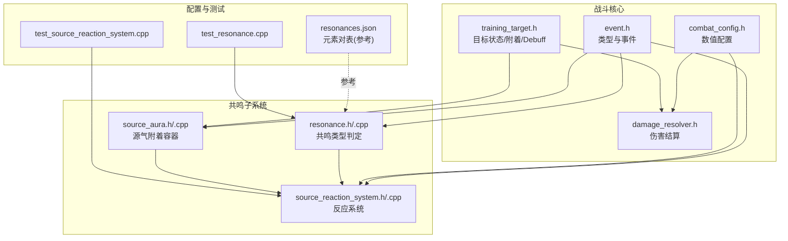
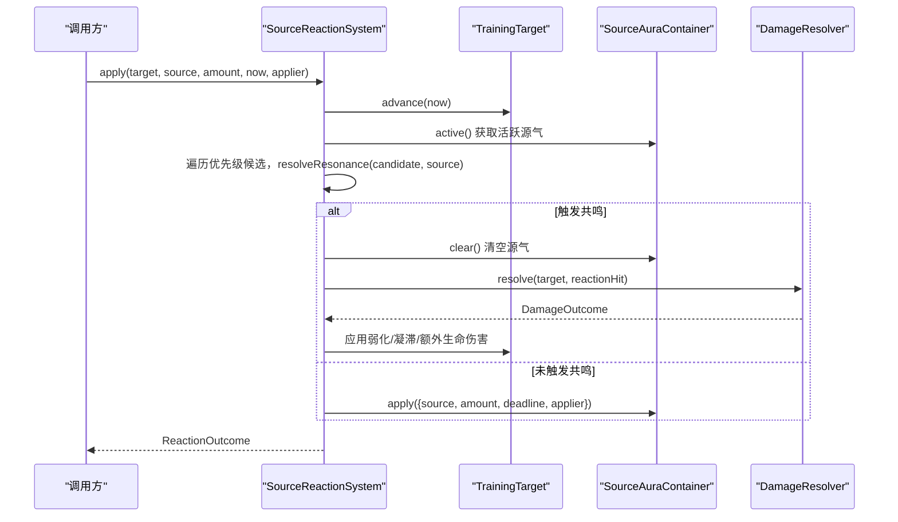
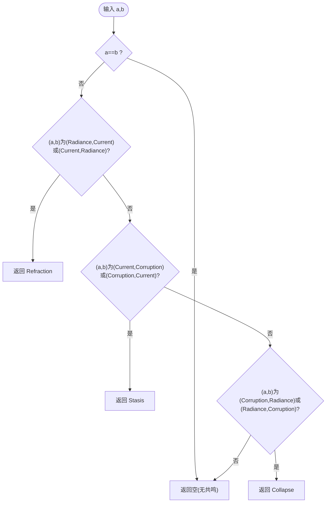
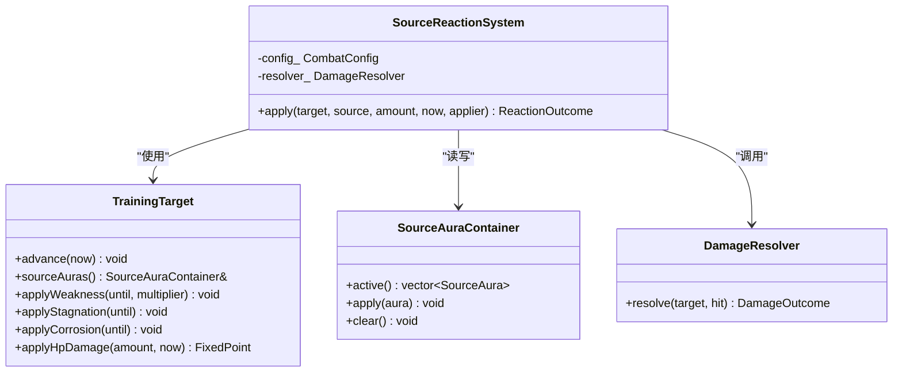
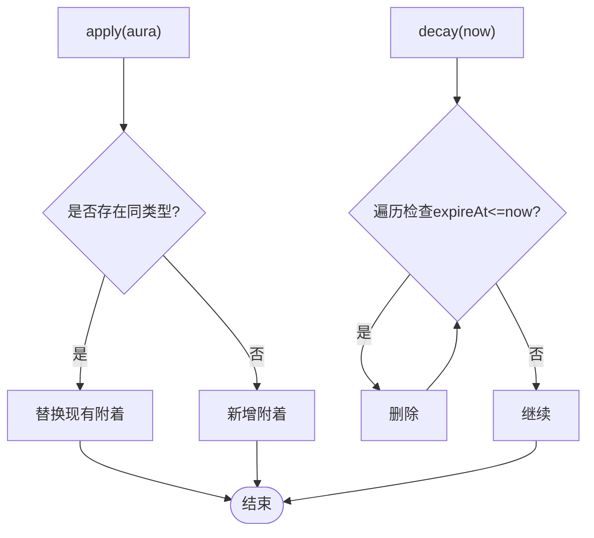
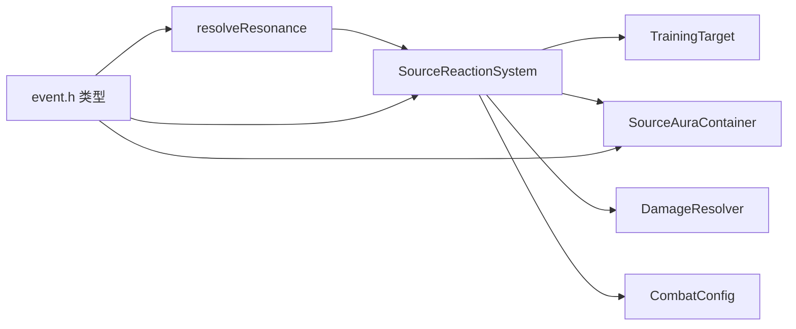

# 共鸣系统

<cite>
**本文引用的文件**   
- [resonance.h](file://native/gameplay/combat/resonance.h)
- [resonance.cpp](file://native/gameplay/combat/resonance.cpp)
- [source_reaction_system.h](file://native/gameplay/combat/source_reaction_system.h)
- [source_reaction_system.cpp](file://native/gameplay/combat/source_reaction_system.cpp)
- [source_aura.h](file://native/gameplay/combat/source_aura.h)
- [source_aura.cpp](file://native/gameplay/combat/source_aura.cpp)
- [event.h](file://native/gameplay/combat/event.h)
- [combat_config.h](file://native/gameplay/combat/combat_config.h)
- [training_target.h](file://native/gameplay/combat/training_target.h)
- [damage_resolver.h](file://native/gameplay/combat/damage_resolver.h)
- [test_resonance.cpp](file://tests/test_resonance.cpp)
- [test_source_reaction_system.cpp](file://tests/test_source_reaction_system.cpp)
- [resonances.json](file://config/dev/resonances.json)
</cite>

## 目录
1. [引言](#引言)
2. [项目结构](#项目结构)
3. [核心组件](#核心组件)
4. [架构总览](#架构总览)
5. [详细组件分析](#详细组件分析)
6. [依赖关系分析](#依赖关系分析)
7. [性能考量](#性能考量)
8. [故障排查指南](#故障排查指南)
9. [结论](#结论)
10. [附录](#附录)

## 引言
本技术文档围绕 Resonance 共鸣系统，系统性阐述元素共鸣机制的设计与实现。内容涵盖：
- 元素属性相克关系与共鸣类型定义
- SourceReactionSystem 的元素反应系统：触发条件、反应链计算、效果结算与持续时间管理
- 共鸣能量的积累与释放机制（槽位管理、阈值判定、爆发效果）
- 不同元素属性的相互作用规则与强度计算
- 代码级示例路径、扩展性设计、性能优化与平衡性调整建议

## 项目结构
共鸣系统位于 native/gameplay/combat 模块中，核心由“事件与类型定义”“共鸣判定”“源气附着容器”“反应系统”“目标状态与伤害结算”“配置”等部分组成。测试用例覆盖共鸣判定与反应系统的行为验证。

图表来源
- [event.h:1-96](file://native/gameplay/combat/event.h#L1-L96)
- [combat_config.h:1-153](file://native/gameplay/combat/combat_config.h#L1-L153)
- [training_target.h:1-44](file://native/gameplay/combat/training_target.h#L1-L44)
- [damage_resolver.h:1-38](file://native/gameplay/combat/damage_resolver.h#L1-L38)
- [resonance.h:1-5](file://native/gameplay/combat/resonance.h#L1-L5)
- [resonance.cpp:1-12](file://native/gameplay/combat/resonance.cpp#L1-L12)
- [source_aura.h:1-11](file://native/gameplay/combat/source_aura.h#L1-L11)
- [source_aura.cpp:1-26](file://native/gameplay/combat/source_aura.cpp#L1-L26)
- [source_reaction_system.h:1-28](file://native/gameplay/combat/source_reaction_system.h#L1-L28)
- [source_reaction_system.cpp:1-68](file://native/gameplay/combat/source_reaction_system.cpp#L1-L68)
- [resonances.json:1-5](file://config/dev/resonances.json#L1-L5)
- [test_resonance.cpp:1-13](file://tests/test_resonance.cpp#L1-L13)
- [test_source_reaction_system.cpp:1-118](file://tests/test_source_reaction_system.cpp#L1-L118)

章节来源
- [event.h:1-96](file://native/gameplay/combat/event.h#L1-L96)
- [combat_config.h:1-153](file://native/gameplay/combat/combat_config.h#L1-L153)
- [training_target.h:1-44](file://native/gameplay/combat/training_target.h#L1-L44)
- [damage_resolver.h:1-38](file://native/gameplay/combat/damage_resolver.h#L1-L38)
- [resonance.h:1-5](file://native/gameplay/combat/resonance.h#L1-L5)
- [resonance.cpp:1-12](file://native/gameplay/combat/resonance.cpp#L1-L12)
- [source_aura.h:1-11](file://native/gameplay/combat/source_aura.h#L1-L11)
- [source_aura.cpp:1-26](file://native/gameplay/combat/source_aura.cpp#L1-L26)
- [source_reaction_system.h:1-28](file://native/gameplay/combat/source_reaction_system.h#L1-L28)
- [source_reaction_system.cpp:1-68](file://native/gameplay/combat/source_reaction_system.cpp#L1-L68)
- [resonances.json:1-5](file://config/dev/resonances.json#L1-L5)
- [test_resonance.cpp:1-13](file://tests/test_resonance.cpp#L1-L13)
- [test_source_reaction_system.cpp:1-118](file://tests/test_source_reaction_system.cpp#L1-L118)

## 核心组件
- 事件与类型定义（event.h）
  - 定义三种源类型：Radiance（光）、Current（流）、Corruption（蚀）
  - 定义四种共鸣类型：Refraction（折光）、Stasis（凝滞）、Collapse（崩解）、Burst（共鸣爆发）
  - 定义 SourceAura（源气附着）与 HitRequest（命中请求）等关键数据结构
- 共鸣判定（resonance.h/.cpp）
  - resolveResonance(a, b) 根据两元素组合返回共鸣类型或无结果
- 源气附着容器（source_aura.h/.cpp）
  - 维护目标身上的源气附着，支持同类型覆盖、过期清理、按类型消费与清空
- 反应系统（source_reaction_system.h/.cpp）
  - 基于目标当前活跃源气与本次攻击源类型，判定是否触发共鸣；若触发则结算伤害、韧性、弱化、凝滞、崩解等效果，并刷新目标源气附着
- 目标状态（training_target.h）
  - 提供 HP、韧性、弱化、凝滞、腐蚀等状态管理与应用接口
- 伤害结算（damage_resolver.h）
  - 统一处理生命与韧性伤害、破韧判定、击杀判定等
- 配置（combat_config.h）
  - 集中管理共鸣相关数值：反应增益、折光伤害、弱化倍率、凝滞时长、崩解韧伤与额外生命伤害、源气持续时间等

章节来源
- [event.h:1-96](file://native/gameplay/combat/event.h#L1-L96)
- [resonance.h:1-5](file://native/gameplay/combat/resonance.h#L1-L5)
- [resonance.cpp:1-12](file://native/gameplay/combat/resonance.cpp#L1-L12)
- [source_aura.h:1-11](file://native/gameplay/combat/source_aura.h#L1-L11)
- [source_aura.cpp:1-26](file://native/gameplay/combat/source_aura.cpp#L1-L26)
- [source_reaction_system.h:1-28](file://native/gameplay/combat/source_reaction_system.h#L1-L28)
- [source_reaction_system.cpp:1-68](file://native/gameplay/combat/source_reaction_system.cpp#L1-L68)
- [training_target.h:1-44](file://native/gameplay/combat/training_target.h#L1-L44)
- [damage_resolver.h:1-38](file://native/gameplay/combat/damage_resolver.h#L1-L38)
- [combat_config.h:1-153](file://native/gameplay/combat/combat_config.h#L1-L153)

## 架构总览
SourceReactionSystem 是共鸣系统的核心调度器，协调“源气附着”“共鸣判定”“伤害结算”“目标状态更新”。其数据流如下：

图表来源
- [source_reaction_system.cpp:12-67](file://native/gameplay/combat/source_reaction_system.cpp#L12-L67)
- [resonance.cpp:2-11](file://native/gameplay/combat/resonance.cpp#L2-L11)
- [source_aura.cpp:4-13](file://native/gameplay/combat/source_aura.cpp#L4-L13)
- [damage_resolver.h:28-37](file://native/gameplay/combat/damage_resolver.h#L28-L37)

章节来源
- [source_reaction_system.cpp:12-67](file://native/gameplay/combat/source_reaction_system.cpp#L12-L67)
- [resonance.cpp:2-11](file://native/gameplay/combat/resonance.cpp#L2-L11)
- [source_aura.cpp:4-13](file://native/gameplay/combat/source_aura.cpp#L4-L13)
- [damage_resolver.h:28-37](file://native/gameplay/combat/damage_resolver.h#L28-L37)

## 详细组件分析

### 共鸣类型与元素相克
- 元素类型：Radiance、Current、Corruption
- 共鸣类型：Refraction、Stasis、Collapse、Burst
- 判定规则：
  - 相同元素不产生共鸣
  - Radiance + Current = Refraction（折光）
  - Current + Corruption = Stasis（凝滞）
  - Corruption + Radiance = Collapse（崩解）
- 配置文件 resonances.json 可作为外部化配置的参考（当前实现以硬编码为主）

图表来源
- [resonance.cpp:2-11](file://native/gameplay/combat/resonance.cpp#L2-L11)
- [resonances.json:1-5](file://config/dev/resonances.json#L1-L5)

章节来源
- [resonance.cpp:2-11](file://native/gameplay/combat/resonance.cpp#L2-L11)
- [resonances.json:1-5](file://config/dev/resonances.json#L1-L5)

### SourceReactionSystem 反应流程
- 输入：目标、源类型、源量、时间戳、施法者ID
- 步骤：
  1) 推进目标时间，读取活跃源气
  2) 按优先级 Radiance > Current > Corruption 扫描候选源气，与本次源类型进行共鸣判定
  3) 若触发共鸣：
     - 获得共鸣能量增益
     - 清空目标所有源气附着
     - 构造反应伤害请求，依据共鸣类型设置基础伤害/韧性伤害/特殊效果
     - 通过 DamageResolver 结算伤害与破韧
     - 针对特定共鸣追加效果（如折光后施加弱化、崩解破韧后追加生命伤害）
  4) 无论是否触发，均将本次源类型附着到目标（同类型覆盖），若为 Corruption 则附加腐蚀 Debuff
- 输出：ReactionOutcome（包含共鸣类型、生命/韧性伤害、破韧标志、共鸣能量增益）

图表来源
- [source_reaction_system.h:15-27](file://native/gameplay/combat/source_reaction_system.h#L15-L27)
- [source_reaction_system.cpp:9-67](file://native/gameplay/combat/source_reaction_system.cpp#L9-L67)
- [training_target.h:6-43](file://native/gameplay/combat/training_target.h#L6-L43)
- [source_aura.h:3-10](file://native/gameplay/combat/source_aura.h#L3-L10)
- [damage_resolver.h:28-37](file://native/gameplay/combat/damage_resolver.h#L28-L37)

章节来源
- [source_reaction_system.h:15-27](file://native/gameplay/combat/source_reaction_system.h#L15-L27)
- [source_reaction_system.cpp:9-67](file://native/gameplay/combat/source_reaction_system.cpp#L9-L67)
- [training_target.h:6-43](file://native/gameplay/combat/training_target.h#L6-L43)
- [source_aura.h:3-10](file://native/gameplay/combat/source_aura.h#L3-L10)
- [damage_resolver.h:28-37](file://native/gameplay/combat/damage_resolver.h#L28-L37)

### 源气附着容器（SourceAuraContainer）
- 功能：
  - 同类型覆盖：同一元素类型的附着会被新附着替换（含数量与到期时间）
  - 过期清理：按 expireAt 与当前时间比较移除过期附着
  - 按类型消费：用于消耗指定元素附着（例如在更高层逻辑中触发三源窗口）
  - 清空：用于共鸣触发时清除全部附着
- 复杂度：
  - apply：O(n) 线性查找
  - decay：O(n) 单次遍历删除
  - consume：O(n) 线性查找

图表来源
- [source_aura.cpp:4-13](file://native/gameplay/combat/source_aura.cpp#L4-L13)
- [source_aura.cpp:14-17](file://native/gameplay/combat/source_aura.cpp#L14-L17)
- [source_aura.cpp:18-25](file://native/gameplay/combat/source_aura.cpp#L18-L25)

章节来源
- [source_aura.cpp:4-13](file://native/gameplay/combat/source_aura.cpp#L4-L13)
- [source_aura.cpp:14-17](file://native/gameplay/combat/source_aura.cpp#L14-L17)
- [source_aura.cpp:18-25](file://native/gameplay/combat/source_aura.cpp#L18-L25)

### 目标状态与 Debuff 管理（TrainingTarget）
- 状态字段：HP、韧性、弱化截止时间、破韧截止时间、凝滞截止时间、腐蚀截止时间、死亡复位时间
- 关键方法：
  - applyWeakness：施加弱化（影响后续伤害倍率）
  - applyStagnation：施加凝滞（影响韧性伤害倍率）
  - applyCorrosion：叠加腐蚀（持续期间可能影响行为或受击表现）
  - hp/poise/alive：查询当前状态
  - advance/reset：推进时间与重置
- 与共鸣的关系：
  - 折光：施加弱化一段时间
  - 凝滞：延长凝滞，提升韧性伤害倍率
  - 崩解：造成大量韧性伤害，破韧后追加生命伤害

章节来源
- [training_target.h:6-43](file://native/gameplay/combat/training_target.h#L6-L43)

### 伤害结算（DamageResolver）
- 职责：
  - 将 HitRequest 转换为 DamageOutcome（生命伤害、韧性伤害、破韧标志、击杀标志）
  - 考虑方向防御、状态倍率（弱化、凝滞）等
- 与共鸣的集成：
  - 反应系统构造反应伤害请求，交由 DamageResolver 统一结算

章节来源
- [damage_resolver.h:1-38](file://native/gameplay/combat/damage_resolver.h#L1-L38)

### 配置与数值（CombatConfig）
- 共鸣相关关键参数：
  - refractionDamage：折光基础伤害
  - weakDurationMs / weakDamageMultiplier：弱化时长与伤害倍率
  - stagnationDurationMs / stagnationPoiseMultiplier：凝滞时长与韧性伤害倍率
  - disintegrationPoiseDamage / disintegrationBreakDamage：崩解韧伤与破韧追加生命伤害
  - sourceResonanceGain / reactionResonanceGain：源伤害与反应带来的共鸣能量增益
  - maxResonance / triSourceWindowMs / ultimateWindowMs / ultimateDamage / ultimatePoiseDamage：共鸣能量上限、三源窗口、终极窗口、终极伤害与韧性伤害
  - sourceAuraDurationMs：源气附着持续时间
- 校验：validated() 保证数值合法性，越界回退默认值

章节来源
- [combat_config.h:1-153](file://native/gameplay/combat/combat_config.h#L1-L153)

### 共鸣能量积累与释放（槽位、阈值、爆发）
- 能量来源：
  - 每次成功命中（确认）会记录“不同源类型”的时间点，累计至三源窗口内满足条件可获得共鸣能量
  - 反应触发也会增加共鸣能量（reactionResonanceGain）
- 槽位与窗口：
  - 三源窗口（triSourceWindowMs）：统计最近窗口内的不同源类型
  - 终极窗口（ultimateWindowMs）：满足条件后可释放终极技能
- 阈值判定：
  - 当共鸣能量达到 maxResonance 时可释放终极（可结合窗口激活状态）
- 释放效果：
  - 终极技能造成固定伤害与韧性伤害，并在 UI/表现层触发共鸣爆发事件
- 注意：
  - 窗口过期不会清零已累积的能量，但会影响“窗口激活”状态
  - 溢出保护：deadline 计算避免 Tick 溢出

章节来源
- [combat_config.h:1-153](file://native/gameplay/combat/combat_config.h#L1-L153)
- [event.h:1-96](file://native/gameplay/combat/event.h#L1-L96)

### 元素相互作用规则与强度计算
- 交互矩阵（基于 resolveResonance）：
  - Radiance + Current → Refraction（折光）：基础伤害 + 弱化
  - Current + Corruption → Stasis（凝滞）：延长凝滞，提升韧性伤害倍率
  - Corruption + Radiance → Collapse（崩解）：高韧伤，破韧追加生命伤害
- 强度计算：
  - 折光伤害来自配置 refractionDamage
  - 凝滞韧性伤害倍率来自 stagnationPoiseMultiplier
  - 崩解韧伤来自 disintegrationPoiseDamage，破韧追加生命伤害来自 disintegrationBreakDamage
  - 弱化倍率来自 weakDamageMultiplier

章节来源
- [resonance.cpp:2-11](file://native/gameplay/combat/resonance.cpp#L2-L11)
- [combat_config.h:1-153](file://native/gameplay/combat/combat_config.h#L1-L153)

### 代码示例路径（不含具体代码）
- 共鸣判定：[resonance.cpp:2-11](file://native/gameplay/combat/resonance.cpp#L2-L11)
- 反应系统主流程：[source_reaction_system.cpp:12-67](file://native/gameplay/combat/source_reaction_system.cpp#L12-L67)
- 源气附着覆盖与过期：[source_aura.cpp:4-17](file://native/gameplay/combat/source_aura.cpp#L4-L17)
- 目标状态应用（弱化/凝滞/腐蚀）：[training_target.h:27-31](file://native/gameplay/combat/training_target.h#L27-L31)
- 伤害结算接口：[damage_resolver.h:28-37](file://native/gameplay/combat/damage_resolver.h#L28-L37)
- 单元测试（共鸣判定）：[test_resonance.cpp:1-13](file://tests/test_resonance.cpp#L1-L13)
- 单元测试（反应系统）：[test_source_reaction_system.cpp:1-118](file://tests/test_source_reaction_system.cpp#L1-L118)

## 依赖关系分析
- 低耦合设计：
  - SourceReactionSystem 仅依赖 TrainingTarget、SourceAuraContainer、DamageResolver 与 CombatConfig
  - 共鸣判定函数独立于系统，便于扩展新的元素组合
- 可能的循环依赖：
  - 当前未见循环引用；TrainingTarget 与 SourceAuraContainer 单向依赖
- 外部依赖：
  - Tick/Clock 类型来自 engine/core/tick_clock.h（通过 event.h 引入）
  - 数值类型为 FixedPoint（通用数学类型）

图表来源
- [source_reaction_system.h:15-27](file://native/gameplay/combat/source_reaction_system.h#L15-L27)
- [resonance.h:1-5](file://native/gameplay/combat/resonance.h#L1-L5)
- [event.h:1-96](file://native/gameplay/combat/event.h#L1-L96)

章节来源
- [source_reaction_system.h:15-27](file://native/gameplay/combat/source_reaction_system.h#L15-L27)
- [resonance.h:1-5](file://native/gameplay/combat/resonance.h#L1-L5)
- [event.h:1-96](file://native/gameplay/combat/event.h#L1-L96)

## 性能考量
- 时间复杂度：
  - 反应判定：最多遍历 3 种候选 × 活跃附着列表（通常很小），整体 O(k)，k 为活跃附着数
  - 源气附着 apply/decay/consume：O(k)
- 内存占用：
  - 每个目标维护少量附着条目，开销极低
- 数值安全：
  - deadline 计算防止 Tick 溢出
- 可扩展性：
  - 如需新增元素类型或共鸣类型，优先扩展 resolveResonance 与配置项，保持系统主体不变
- 建议优化：
  - 若 k 增长，可将附着改为哈希映射（type→aura）以降低查找成本
  - 批量 decay 可采用惰性清理策略（仅在访问时清理）

## 故障排查指南
- 常见现象与定位：
  - 未触发共鸣：检查目标是否有对应候选源气附着，以及响应顺序是否符合优先级
  - 同源刷新无效：确认是否为同类型覆盖而非叠加
  - 凝滞/弱化未生效：检查持续时间与时间推进是否正确
  - 崩解未追加生命伤害：确认是否真正破韧
- 调试建议：
  - 打印 ReactionOutcome 各字段，核对配置值
  - 使用单元测试用例作为回归基线（test_resonance.cpp、test_source_reaction_system.cpp）
- 已知边界：
  - 死亡复位会清空未过期附着，复活后旧附着不参与反应

章节来源
- [test_source_reaction_system.cpp:1-118](file://tests/test_source_reaction_system.cpp#L1-L118)
- [source_reaction_system.cpp:12-67](file://native/gameplay/combat/source_reaction_system.cpp#L12-L67)

## 结论
共鸣系统以“源气附着 + 元素相克 + 反应结算”为核心，形成简洁而强大的战斗反馈闭环。通过清晰的职责划分与配置驱动，系统在扩展性与性能之间取得良好平衡。未来可在以下方面持续演进：
- 外部化共鸣规则（JSON/脚本）
- 更多元素类型与复合反应
- 更精细的表现事件与音效联动
- 更完善的资源与窗口管理机制（共鸣能量槽位、终极窗口）

## 附录
- 术语对照：
  - 折光（Refraction）：光+流，造成伤害并施加弱化
  - 凝滞（Stasis）：流+蚀，延长凝滞并提升韧性伤害倍率
  - 崩解（Collapse）：蚀+光，高韧伤，破韧追加生命伤害
  - 共鸣爆发（Burst）：能量满额后的终极释放
- 关键配置项速查：
  - refractionDamage、weakDurationMs、weakDamageMultiplier
  - stagnationDurationMs、stagnationPoiseMultiplier
  - disintegrationPoiseDamage、disintegrationBreakDamage
  - sourceResonanceGain、reactionResonanceGain、maxResonance
  - triSourceWindowMs、ultimateWindowMs、ultimateDamage、ultimatePoiseDamage
  - sourceAuraDurationMs