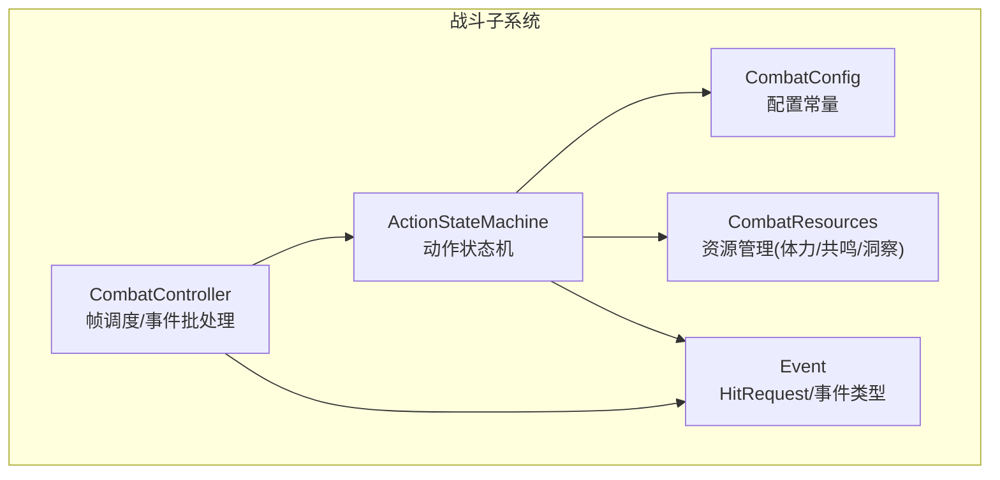
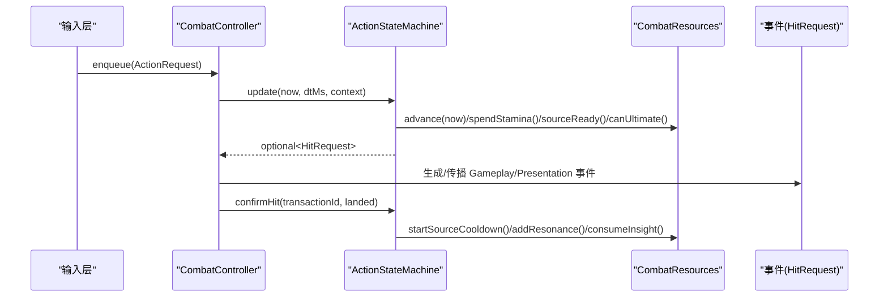
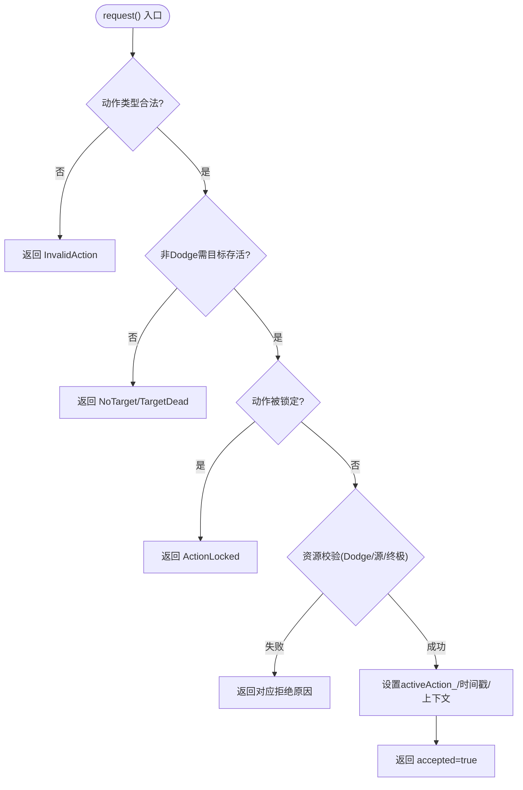
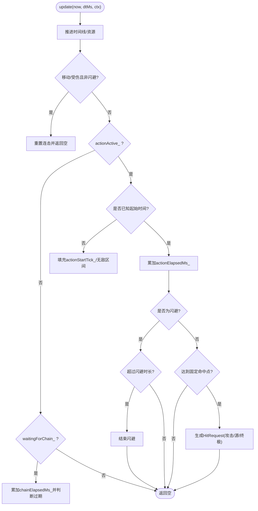
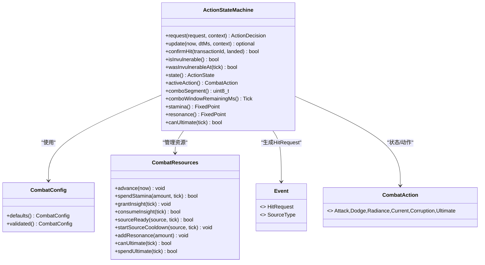

# 动作状态机

<cite>
**本文引用的文件**   
- [action_state_machine.h](file://native/gameplay/combat/action_state_machine.h)
- [action_state_machine.cpp](file://native/gameplay/combat/action_state_machine.cpp)
- [combat_action.h](file://native/gameplay/combat/combat_action.h)
- [combat_config.h](file://native/gameplay/combat/combat_config.h)
- [combat_resources.h](file://native/gameplay/combat/combat_resources.h)
- [event.h](file://native/gameplay/combat/event.h)
- [combat_controller.h](file://native/gameplay/combat/combat_controller.h)
- [combat_controller.cpp](file://native/gameplay/combat/combat_controller.cpp)
- [test_action_state_machine.cpp](file://tests/test_action_state_machine.cpp)
</cite>

## 目录
1. [简介](#简介)
2. [项目结构](#项目结构)
3. [核心组件](#核心组件)
4. [架构总览](#架构总览)
5. [详细组件分析](#详细组件分析)
6. [依赖关系分析](#依赖关系分析)
7. [性能考量](#性能考量)
8. [故障排查指南](#故障排查指南)
9. [结论](#结论)
10. [附录：代码示例路径](#附录代码示例路径)

## 简介
本技术文档围绕 ActionStateMachine 类展开，系统性阐述其在角色动作系统中的应用。内容涵盖：
- 有限状态机的状态定义、转换条件与动画同步机制
- ActionRequest 请求处理流程（验证、优先级排序、执行队列）
- 各动作状态（Idle、Attack、Dodge、Skill/Source、Ultimate）的行为与转换规则
- 动作拒绝机制 ActionRejectReason（时机检查、资源验证、冲突处理）
- 扩展性设计、动画融合与输入缓冲等高级特性

该状态机负责将上层输入转化为可执行的战斗事件（HitRequest），并通过事务确认机制与伤害解析、反应系统等下游模块协作，确保时序一致性与确定性。

## 项目结构
ActionStateMachine 位于 native/gameplay/combat 目录下，与 CombatConfig、CombatResources、Event 等模块紧密耦合；在运行时由 CombatController 编排帧更新、输入入队与事件输出。

图表来源
- [action_state_machine.h:1-91](file://native/gameplay/combat/action_state_machine.h#L1-L91)
- [combat_config.h:1-153](file://native/gameplay/combat/combat_config.h#L1-L153)
- [combat_resources.h:1-52](file://native/gameplay/combat/combat_resources.h#L1-L52)
- [event.h:1-96](file://native/gameplay/combat/event.h#L1-L96)
- [combat_controller.h:1-117](file://native/gameplay/combat/combat_controller.h#L1-L117)

章节来源
- [action_state_machine.h:1-91](file://native/gameplay/combat/action_state_machine.h#L1-L91)
- [combat_controller.h:1-117](file://native/gameplay/combat/combat_controller.h#L1-L117)

## 核心组件
- ActionStateMachine：状态机核心，维护当前动作、连击段、时间线、无敌区间、待确认命中事务等。
- CombatAction / ActionState / ActionRejectReason：动作类型、状态枚举与拒绝原因。
- ActionRequest / HitRequest：输入请求与命中请求数据结构。
- CombatConfig：所有数值与窗口参数（连击窗口、闪避时长、源技能冷却、终极窗口等）。
- CombatResources：体力恢复、洞察增益、源技能冷却、共鸣积累与终极窗口管理。
- Event：通用事件与结果结构（HitRequest、GameplayEvent、PresentationEvent 等）。
- CombatController：帧循环中入队请求、排序、调用状态机、生成并排序事件。

章节来源
- [combat_action.h:1-67](file://native/gameplay/combat/combat_action.h#L1-L67)
- [event.h:1-96](file://native/gameplay/combat/event.h#L1-L96)
- [combat_config.h:1-153](file://native/gameplay/combat/combat_config.h#L1-L153)
- [combat_resources.h:1-52](file://native/gameplay/combat/combat_resources.h#L1-L52)
- [combat_controller.h:1-117](file://native/gameplay/combat/combat_controller.h#L1-L117)

## 架构总览
ActionStateMachine 的运行时交互如下：

图表来源
- [combat_controller.cpp:30-151](file://native/gameplay/combat/combat_controller.cpp#L30-L151)
- [action_state_machine.cpp:108-241](file://native/gameplay/combat/action_state_machine.cpp#L108-L241)
- [combat_resources.h:1-52](file://native/gameplay/combat/combat_resources.h#L1-L52)

## 详细组件分析

### 状态机与状态定义
- 动作类型 CombatAction：Attack、Dodge、Radiance、Current、Corruption、Ultimate。
- 状态 ActionState：Idle、Attack1~Attack4、Dodging、CastingSource、CastingUltimate。
- 拒绝原因 ActionRejectReason：None、NoTarget、TargetDead、Cooldown、InsufficientStamina、InsufficientResonance、ActionLocked、InvalidAction。

状态机内部通过 activeAction_、waitingForChain_、actionActive_、actionElapsedMs_、chainElapsedMs_、dodgeInvulnerableFrom_/Until_ 等字段驱动状态转换。state() 方法根据这些字段映射到对外可见的 ActionState。

章节来源
- [combat_action.h:1-67](file://native/gameplay/combat/combat_action.h#L1-L67)
- [action_state_machine.h:24-91](file://native/gameplay/combat/action_state_machine.h#L24-L91)
- [action_state_machine.cpp:309-320](file://native/gameplay/combat/action_state_machine.cpp#L309-L320)

### 请求处理流程（ActionRequest）
- 输入校验：仅允许 Attack/Dodge/源技能/Ultimate；非 Dodge 需要目标存在且存活。
- 冲突锁定：若 actionActive_ 或 pendingHit_ 存在，返回 ActionLocked。
- 资源校验：
  - Dodge：检查体力是否足够，不足则 InsufficientStamina。
  - 源技能：检查冷却是否就绪，否则 Cooldown。
  - Ultimate：检查共鸣窗口是否可用，否则 InsufficientResonance。
- 接受后设置：记录 activeAction_、actionStartTick_、actionElapsedMs_、actionContext_、actionSequence_，并根据动作类型进入不同分支。

图表来源
- [action_state_machine.cpp:29-106](file://native/gameplay/combat/action_state_machine.cpp#L29-L106)

章节来源
- [action_state_machine.cpp:29-106](file://native/gameplay/combat/action_state_machine.cpp#L29-L106)

### 更新与命中生成（update）
- 推进时间线：lastUpdateTick_ = now，hasTimeline_ = true，resources_.advance(now)。
- 移动/受伤打断：若非闪避状态，重置连击并返回空。
- 动作进行中：
  - 补全起始时间（若无时间线），计算 elapsed。
  - 闪避：超过 dodgeDurationMs 结束动作，期间不产生命中。
  - 攻击/源/终极：达到 kAttackHitMs（固定命中点）后生成 HitRequest，包含 ability、damage、poiseDamage、hit tick、sequence、transactionId 等。
  - 连击：等待链窗口内再次 Attack 会递增 comboIndex_，按配置表产出不同段伤害。
- 连击窗口：waitingForChain_ 时累计 chainElapsedMs_，超窗则 resetCombo()。

图表来源
- [action_state_machine.cpp:108-220](file://native/gameplay/combat/action_state_machine.cpp#L108-L220)

章节来源
- [action_state_machine.cpp:108-220](file://native/gameplay/combat/action_state_machine.cpp#L108-L220)

### 命中确认与资源结算（confirmHit）
- 事务匹配：pendingHit_ 的 transactionId 必须一致。
- 未命中：直接返回。
- 命中：
  - 源技能：消耗洞察（若已应用）、启动冷却、增加共鸣、记录不同源。
  - 终极：花费终极（spendUltimate）。
- 攻击连击：无需额外结算。

章节来源
- [action_state_machine.cpp:222-241](file://native/gameplay/combat/action_state_machine.cpp#L222-L241)

### 无敌与历史查询
- isInvulnerable()：当前处于闪避且未到无敌结束时间。
- wasInvulnerableAt(tick)：基于绝对时间区间 dodgeInvulnerableFrom_/Until_ 判定历史时刻是否无敌。

章节来源
- [action_state_machine.cpp:276-284](file://native/gameplay/combat/action_state_machine.cpp#L276-L284)

### 连击与窗口
- 连击段：comboIndex_ 从 1 开始递增，最多 4 段。
- 窗口：config_.comboWindowMs 默认 480ms，超时自动 resetCombo()。
- 移动/受伤：立即中断连击。

章节来源
- [action_state_machine.cpp:92-106](file://native/gameplay/combat/action_state_machine.cpp#L92-L106)
- [combat_config.h:9-22](file://native/gameplay/combat/combat_config.h#L9-L22)

### 动画同步与表现
- state() 提供对外状态（Idle/Attack1~4/Dodging/CastingSource/CastingUltimate），供表现层播放对应动画。
- activeAction() 暴露具体 CombatAction，便于更细粒度的动画选择。
- 连击段 comboSegment() 与窗口剩余 comboWindowRemainingMs() 可用于 UI 提示。

章节来源
- [action_state_machine.cpp:309-326](file://native/gameplay/combat/action_state_machine.cpp#L309-L326)

### 输入缓冲与优先级排序
- 帧级入队：CombatController::enqueue() 将 ActionRequest 加入 pendingActions_。
- 排序策略：按 sequence 稳定排序，保证先到的请求优先处理。
- 帧内处理顺序：先推进资源时间线，再逐条 request()，最后 update() 生成命中。

章节来源
- [combat_controller.cpp:15-74](file://native/gameplay/combat/combat_controller.cpp#L15-L74)

### 与 CombatController 的协作
- 帧更新：updateAgainst() 构造 ActionContext，调用 actions_.update() 推进状态机。
- 精确闪避：训练脉冲场景下，若精准闪避命中时间点，grantInsight() 给予洞察增益。
- 事件生成：根据 HitRequest 与 DamageResolver/ReactionSystem 的结果生成 Gameplay/Presentation 事件，并按 tick/source/target/sequence 排序。

章节来源
- [combat_controller.cpp:43-151](file://native/gameplay/combat/combat_controller.cpp#L43-L151)

## 依赖关系分析
ActionStateMachine 依赖以下模块：
- CombatConfig：数值与窗口参数
- CombatResources：体力/洞察/源冷却/共鸣/终极窗口
- Event：HitRequest 等数据结构
- CombatAction：动作与状态枚举

图表来源
- [action_state_machine.h:24-91](file://native/gameplay/combat/action_state_machine.h#L24-L91)
- [combat_config.h:1-153](file://native/gameplay/combat/combat_config.h#L1-L153)
- [combat_resources.h:1-52](file://native/gameplay/combat/combat_resources.h#L1-L52)
- [event.h:1-96](file://native/gameplay/combat/event.h#L1-L96)
- [combat_action.h:1-67](file://native/gameplay/combat/combat_action.h#L1-L67)

章节来源
- [action_state_machine.h:24-91](file://native/gameplay/combat/action_state_machine.h#L24-L91)

## 性能考量
- 固定命中点：攻击命中统一为 kAttackHitMs=160ms，避免每帧复杂计算，提升确定性。
- 饱和加法：tick 计算使用 saturatingAdd/hitTickFrom，防止溢出。
- 轻量状态：状态机字段均为基本类型与可选值，内存占用小，更新开销低。
- 批量事件：CombatController 对事件进行稳定排序，减少渲染抖动。

[本节为通用指导，不直接分析具体文件]

## 故障排查指南
常见拒绝原因与定位要点：
- InvalidAction：传入的动作不在允许集合（非 Attack/Dodge/源/Ultimate）。
- NoTarget/TargetDead：非闪避动作要求目标存在且存活。
- ActionLocked：已有动作进行中或有待确认命中事务。
- InsufficientStamina：闪避体力不足。
- Cooldown：源技能冷却未结束。
- InsufficientResonance：终极共鸣不足或窗口未开启。

调试建议：
- 打印 lastRejectReason_ 与 snapshot.lastRejectReason。
- 检查 ActionContext 的 target/targetAlive/moving/damageTaken。
- 观察 comboWindowRemainingMs 与 sourceCooldownRemainingMs。
- 确认 confirmHit 的事务 ID 与 pendingHit_ 一致。

章节来源
- [combat_action.h:27-36](file://native/gameplay/combat/combat_action.h#L27-L36)
- [combat_controller.cpp:56-74](file://native/gameplay/combat/combat_controller.cpp#L56-L74)

## 结论
ActionStateMachine 以简洁的状态机模型实现了角色动作的核心逻辑，结合 CombatResources 的资源管理与 CombatController 的帧级编排，形成高确定性、可扩展的战斗系统。其设计兼顾了输入缓冲、连击窗口、无敌区间、事务化命中确认等关键特性，为动画同步与表现层提供了稳定的状态接口。

[本节为总结，不直接分析具体文件]

## 附录：代码示例路径
以下为常用操作的路径参考（不包含具体代码内容）：
- 添加动作请求与查询状态
  - 入队请求：[combat_controller.cpp:15-17](file://native/gameplay/combat/combat_controller.cpp#L15-L17)
  - 请求决策：[action_state_machine.cpp:29-106](file://native/gameplay/combat/action_state_machine.cpp#L29-L106)
  - 获取状态：[action_state_machine.cpp:309-320](file://native/gameplay/combat/action_state_machine.cpp#L309-L320)
- 连击与窗口
  - 连击段递增与窗口判断：[action_state_machine.cpp:92-106](file://native/gameplay/combat/action_state_machine.cpp#L92-L106)
  - 窗口剩余时间：[action_state_machine.cpp:322-326](file://native/gameplay/combat/action_state_machine.cpp#L322-L326)
- 闪避与无敌
  - 闪避资源校验与状态设置：[action_state_machine.cpp:49-78](file://native/gameplay/combat/action_state_machine.cpp#L49-L78)
  - 无敌区间与历史查询：[action_state_machine.cpp:276-284](file://native/gameplay/combat/action_state_machine.cpp#L276-L284)
- 源技能与终极
  - 源技能冷却与伤害生成：[action_state_machine.cpp:151-177](file://native/gameplay/combat/action_state_machine.cpp#L151-L177)
  - 终极窗口与伤害生成：[action_state_machine.cpp:178-194](file://native/gameplay/combat/action_state_machine.cpp#L178-L194)
- 命中确认与资源结算
  - 事务确认与冷却/共鸣结算：[action_state_machine.cpp:222-241](file://native/gameplay/combat/action_state_machine.cpp#L222-L241)
- 测试用例参考
  - 连击与窗口边界：[test_action_state_machine.cpp:27-84](file://tests/test_action_state_machine.cpp#L27-L84)
  - 闪避与无敌区间：[test_action_state_machine.cpp:156-207](file://tests/test_action_state_machine.cpp#L156-L207)
  - 拒绝原因与状态一致性：[test_action_state_machine.cpp:86-102](file://tests/test_action_state_machine.cpp#L86-L102)

章节来源
- [combat_controller.cpp:15-17](file://native/gameplay/combat/combat_controller.cpp#L15-L17)
- [action_state_machine.cpp:29-106](file://native/gameplay/combat/action_state_machine.cpp#L29-L106)
- [action_state_machine.cpp:309-326](file://native/gameplay/combat/action_state_machine.cpp#L309-L326)
- [action_state_machine.cpp:151-194](file://native/gameplay/combat/action_state_machine.cpp#L151-L194)
- [action_state_machine.cpp:222-241](file://native/gameplay/combat/action_state_machine.cpp#L222-L241)
- [test_action_state_machine.cpp:27-207](file://tests/test_action_state_machine.cpp#L27-L207)