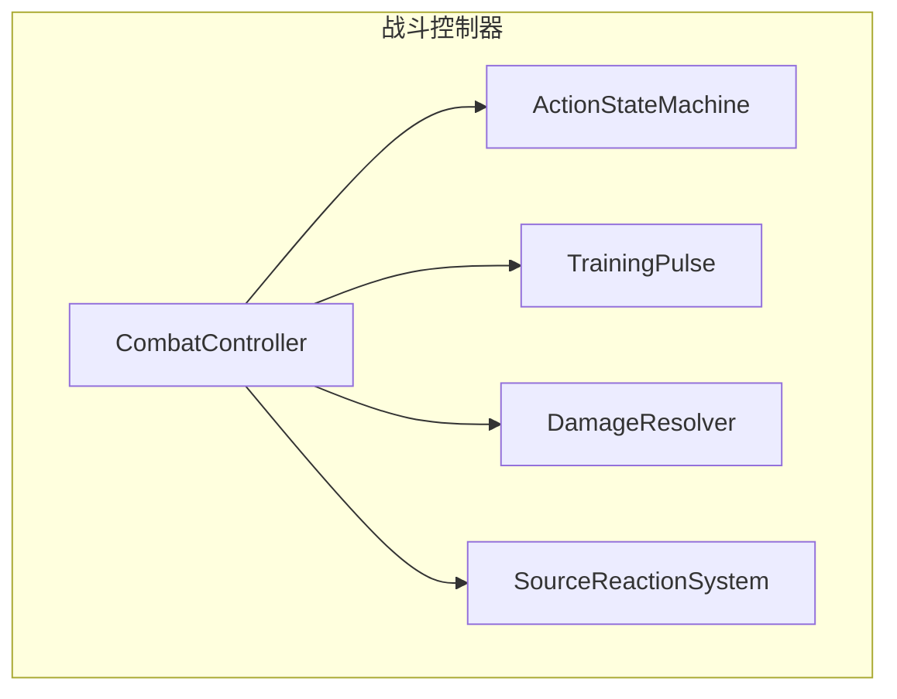
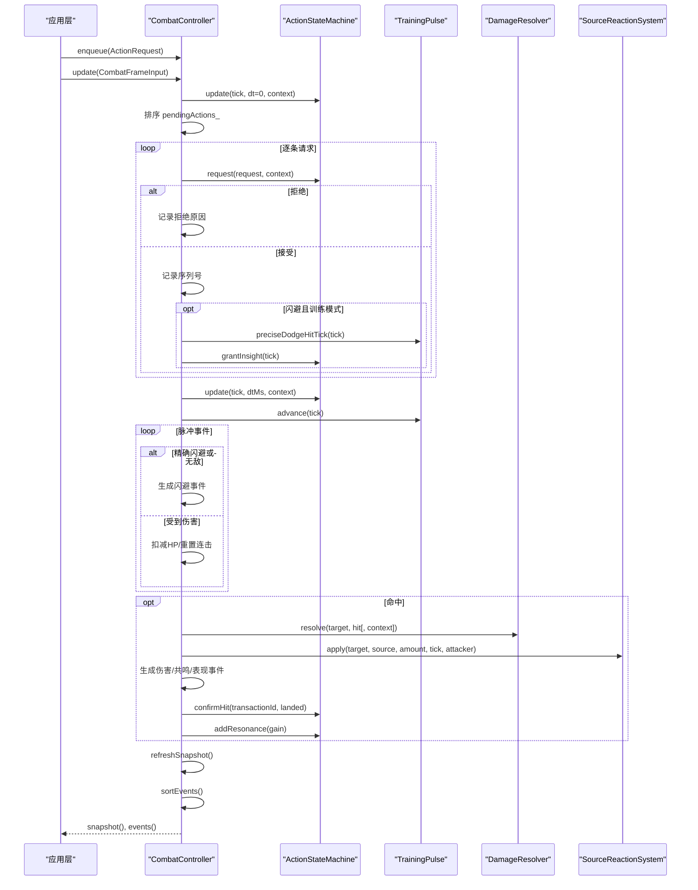
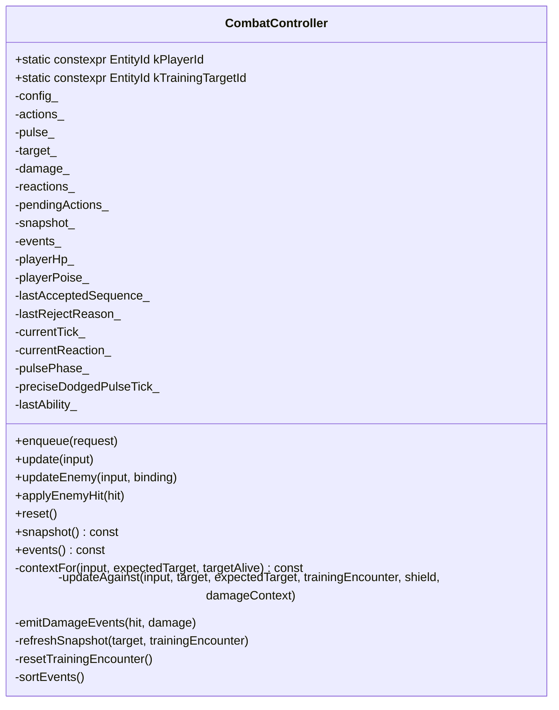
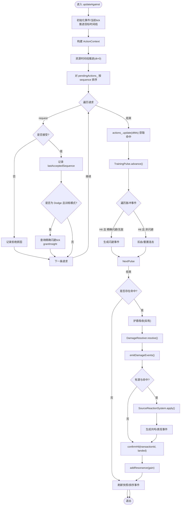
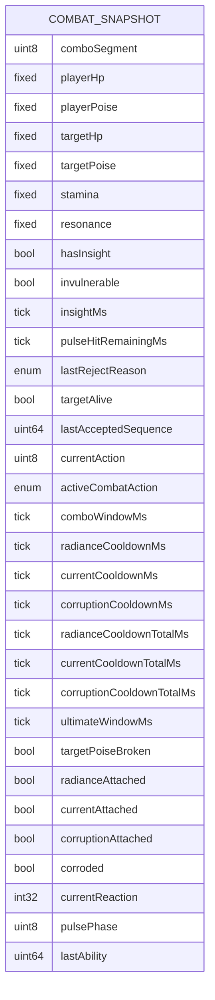
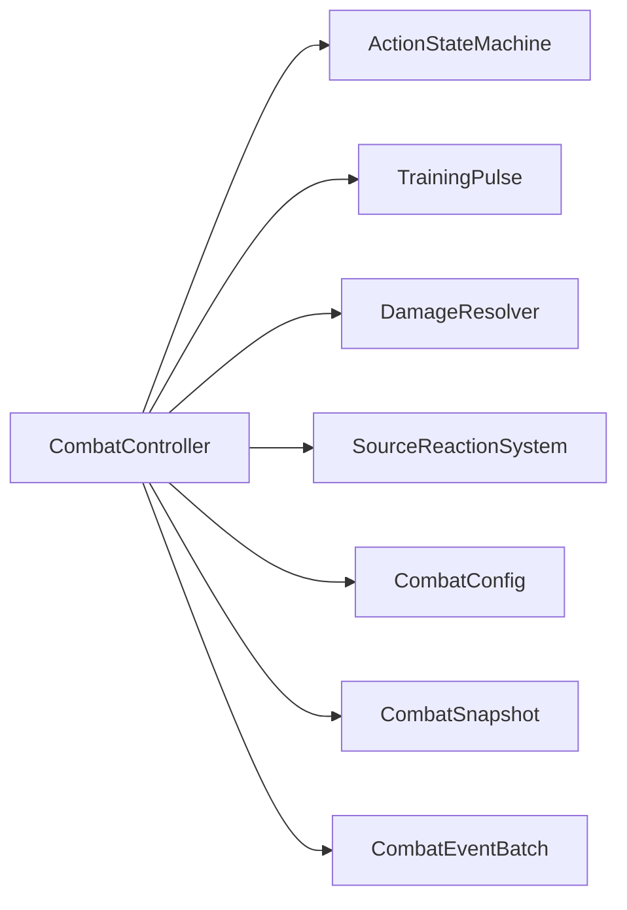

# 战斗控制器

<cite>
**本文引用的文件**   
- [combat_controller.h](file://native/gameplay/combat/combat_controller.h)
- [combat_controller.cpp](file://native/gameplay/combat/combat_controller.cpp)
- [action_state_machine.h](file://native/gameplay/combat/action_state_machine.h)
- [training_pulse.h](file://native/gameplay/combat/training_pulse.h)
- [damage_resolver.h](file://native/gameplay/combat/damage_resolver.h)
- [combat_config.h](file://native/gameplay/combat/combat_config.h)
- [test_combat_controller.cpp](file://tests/test_combat_controller.cpp)
</cite>

## 目录
1. [简介](#简介)
2. [项目结构](#项目结构)
3. [核心组件](#核心组件)
4. [架构总览](#架构总览)
5. [详细组件分析](#详细组件分析)
6. [依赖关系分析](#依赖关系分析)
7. [性能与内存优化](#性能与内存优化)
8. [故障排查指南](#故障排查指南)
9. [结论](#结论)
10. [附录：数据模型与事件](#附录数据模型与事件)

## 简介
本技术文档围绕 CombatController 类展开，系统阐述其在战斗流程编排、输入处理、状态管理与事件协调中的职责。重点解析 update() 与 updateEnemy() 的帧更新循环、战斗状态同步与敌人交互处理；说明 CombatFrameInput 数据结构的设计与使用；解释 CombatSnapshot 快照机制的实现原理（序列化、网络同步与一致性保证）；并通过测试用例展示战斗指令入队、执行与结果处理的完整流程。同时涵盖性能优化、内存管理与调试工具等关键技术点。

## 项目结构
CombatController 位于 gameplay/combat 模块，负责玩家侧战斗逻辑的核心编排，并与以下子系统协作：
- ActionStateMachine：动作状态机，管理连击、资源、冷却与无敌窗口等
- TrainingPulse：训练脉冲系统，生成周期性伤害/闪避判定事件
- DamageResolver：伤害计算与护盾/朝向等上下文处理
- SourceReactionSystem：源属性附着与反应系统（在控制器中参与事件输出）
- CombatConfig：战斗配置校验与默认值回退

图表来源
- [combat_controller.h:68-116](file://native/gameplay/combat/combat_controller.h#L68-L116)
- [combat_controller.cpp:43-151](file://native/gameplay/combat/combat_controller.cpp#L43-L151)

章节来源
- [combat_controller.h:1-117](file://native/gameplay/combat/combat_controller.h#L1-L117)
- [combat_controller.cpp:1-309](file://native/gameplay/combat/combat_controller.cpp#L1-L309)

## 核心组件
- CombatController：战斗主控制器，负责帧更新、指令队列处理、事件收集与快照刷新
- CombatFrameInput：每帧输入描述，包含 tick、dtMs、移动状态、目标信息与存活状态
- CombatSnapshot：战斗快照，用于 UI/网络同步，包含角色/目标状态、冷却、反应、能力等信息
- ActionStateMachine：动作状态机，维护连击段、资源、冷却、无敌窗口与命中事务
- TrainingPulse：训练脉冲，按周期产生警告/命中事件，支持精确闪避判定
- DamageResolver：伤害解析器，结合目标与方向上下文计算 HP/Poise 伤害与破防/击杀
- SourceReactionSystem：源属性附着与反应系统，产出共鸣事件与表现事件

章节来源
- [combat_controller.h:12-54](file://native/gameplay/combat/combat_controller.h#L12-L54)
- [action_state_machine.h:11-90](file://native/gameplay/combat/action_state_machine.h#L11-L90)
- [training_pulse.h:9-34](file://native/gameplay/combat/training_pulse.h#L9-L34)
- [damage_resolver.h:9-37](file://native/gameplay/combat/damage_resolver.h#L9-L37)

## 架构总览
CombatController 的帧更新流程如下：
- 构造时初始化各子系统并调用 reset()
- 每帧通过 update()/updateEnemy() 接收 CombatFrameInput
- 内部统一走 updateAgainst() 完成：
  - 推进时间线与资源
  - 排序并消费 pendingActions_ 队列，交由 ActionStateMachine.request() 决策
  - 对 Dodge 进行精确闪避判定并授予洞察
  - 推进 TrainingPulse，处理命中/闪避事件
  - 若存在命中，则通过 DamageResolver 计算伤害，应用护盾吸收，触发源附着与反应
  - 刷新 CombatSnapshot，并对 events_ 排序后暴露给上层

图表来源
- [combat_controller.cpp:30-151](file://native/gameplay/combat/combat_controller.cpp#L30-L151)
- [action_state_machine.h:24-90](file://native/gameplay/combat/action_state_machine.h#L24-L90)
- [training_pulse.h:17-34](file://native/gameplay/combat/training_pulse.h#L17-L34)
- [damage_resolver.h:28-37](file://native/gameplay/combat/damage_resolver.h#L28-L37)

## 详细组件分析

### CombatController 类职责与接口
- 职责
  - 帧更新编排：统一入口 update()/updateEnemy() -> updateAgainst()
  - 输入处理：enqueue() 将 ActionRequest 入队，按 sequence 稳定排序后处理
  - 状态管理：维护 playerHp_/playerPoise_、lastAcceptedSequence_、currentReaction_、pulsePhase_、preciseDodgedPulseTick_、lastAbility_ 等
  - 事件协调：收集 GameplayEvent 与 PresentationEvent，按 tick/source/target/sequence 排序
- 关键方法
  - enqueue(): 追加待执行动作
  - update(): 训练模式下的统一更新
  - updateEnemy(): 绑定外部目标（含护盾与伤害上下文）
  - applyEnemyHit(): 处理敌方对玩家的伤害（含无敌/闪避、死亡事件）
  - refreshSnapshot(): 生成 CombatSnapshot
  - reset()/resetTrainingEncounter(): 重置全局/训练遭遇状态

图表来源
- [combat_controller.h:68-116](file://native/gameplay/combat/combat_controller.h#L68-L116)

章节来源
- [combat_controller.h:68-116](file://native/gameplay/combat/combat_controller.h#L68-L116)
- [combat_controller.cpp:5-13](file://native/gameplay/combat/combat_controller.cpp#L5-L13)
- [combat_controller.cpp:15-17](file://native/gameplay/combat/combat_controller.cpp#L15-L17)
- [combat_controller.cpp:30-32](file://native/gameplay/combat/combat_controller.cpp#L30-L32)
- [combat_controller.cpp:34-41](file://native/gameplay/combat/combat_controller.cpp#L34-L41)
- [combat_controller.cpp:153-195](file://native/gameplay/combat/combat_controller.cpp#L153-L195)
- [combat_controller.cpp:266-282](file://native/gameplay/combat/combat_controller.cpp#L266-L282)
- [combat_controller.cpp:284-297](file://native/gameplay/combat/combat_controller.cpp#L284-L297)

### update() 与 updateEnemy() 实现逻辑
- update()
  - 直接委托 updateAgainst()，以内置 TrainingTarget 为对手，开启训练模式
- updateEnemy()
  - 根据 CombatTargetBinding 决定目标指针与期望 ID，传入外部护盾指针与伤害上下文
- updateAgainst() 核心步骤
  - 初始化事件缓冲、当前 tick、推进目标时间线
  - 构建 ActionContext（选择目标、移动状态、目标存活）
  - 先推进资源时间线（dt=0），再对 pendingActions_ 按 sequence 排序并逐一 request()
  - 对 Dodge 进行精确闪避判定，授予洞察
  - 推进 TrainingPulse，处理 Warning/Hit 事件，精确闪避/无敌时生成闪避事件
  - 若存在命中，优先扣除护盾，再调用 DamageResolver.resolve()，随后 SourceReactionSystem.apply()
  - 确认命中事务、增加共鸣、刷新快照、排序事件

图表来源
- [combat_controller.cpp:43-151](file://native/gameplay/combat/combat_controller.cpp#L43-L151)

章节来源
- [combat_controller.cpp:30-41](file://native/gameplay/combat/combat_controller.cpp#L30-L41)
- [combat_controller.cpp:43-151](file://native/gameplay/combat/combat_controller.cpp#L43-L151)

### CombatFrameInput 数据结构设计
- 字段
  - tick: 当前逻辑时间戳（毫秒）
  - dtMs: 自上一帧以来的毫秒增量
  - moving: 玩家是否处于移动状态
  - targetId: 选定的目标实体ID
  - targetAlive: 目标是否存活
- 用途
  - 驱动 ActionContext 的目标选择与移动状态
  - 控制 TrainingPulse 的时间推进与窗口判断
  - 作为 update()/updateEnemy() 的统一输入契约

章节来源
- [combat_controller.h:12-18](file://native/gameplay/combat/combat_controller.h#L12-L18)

### CombatSnapshot 快照机制
- 字段覆盖
  - 连击段、玩家/目标 HP/Poise、耐力、共鸣、洞察、无敌窗口、冷却（剩余与总量）、终极窗口、目标破防、源附着标记、腐蚀状态、当前反应类型、脉冲阶段、最近能力ID、最后接受的序列号、拒绝原因、目标存活
- 作用
  - 为 UI 提供渲染所需的状态
  - 为网络同步提供确定性快照
  - 通过 lastAcceptedSequence_ 保障客户端/服务端一致性（仅当序列号增长才视为有效变更）
- 生成时机
  - 每次 updateAgainst() 末尾调用 refreshSnapshot()

图表来源
- [combat_controller.h:20-54](file://native/gameplay/combat/combat_controller.h#L20-L54)

章节来源
- [combat_controller.h:20-54](file://native/gameplay/combat/combat_controller.h#L20-L54)
- [combat_controller.cpp:219-264](file://native/gameplay/combat/combat_controller.cpp#L219-L264)

### 战斗指令入队、执行与结果处理（示例路径）
- 入队
  - 调用 enqueue({CombatAction::Attack, sequence})
  - 参考测试用例：[test_combat_controller.cpp:9-10](file://tests/test_combat_controller.cpp#L9-L10)
- 执行
  - 调用 update({tick, dtMs, moving, targetId, targetAlive})
  - 内部排序 pendingActions_ 并依次 request()
  - 参考测试用例：[test_combat_controller.cpp:13-14](file://tests/test_combat_controller.cpp#L13-L14)
- 结果处理
  - 读取 snapshot().comboSegment / targetHp / resonance 等
  - 检查 events() 中的 GameplayEvent/PresentationEvent
  - 参考测试用例：[test_combat_controller.cpp:16-30](file://tests/test_combat_controller.cpp#L16-L30)

章节来源
- [combat_controller.cpp:15-17](file://native/gameplay/combat/combat_controller.cpp#L15-L17)
- [combat_controller.cpp:56-74](file://native/gameplay/combat/combat_controller.cpp#L56-L74)
- [test_combat_controller.cpp:9-30](file://tests/test_combat_controller.cpp#L9-L30)

### 敌人交互与 applyEnemyHit()
- 适用场景：外部系统向玩家发起攻击
- 处理要点
  - 校验攻击者/目标/伤害合法性与玩家存活
  - 若处于无敌窗口，生成闪避事件并提前返回
  - 否则扣减 HP/Poise，可能触发死亡事件
  - 刷新快照并排序事件

章节来源
- [combat_controller.cpp:153-195](file://native/gameplay/combat/combat_controller.cpp#L153-L195)

## 依赖关系分析
- 耦合关系
  - CombatController 强依赖 ActionStateMachine（动作/资源/冷却/无敌）
  - 依赖 TrainingPulse（训练脉冲事件流）
  - 依赖 DamageResolver（伤害计算）
  - 依赖 SourceReactionSystem（源附着与反应）
- 外部输入
  - CombatConfig：所有数值与窗口参数由配置提供，并在构造时 validated()
- 输出
  - CombatSnapshot：供 UI/网络消费
  - CombatEventBatch：GameplayEvent/PresentationEvent 两类事件

图表来源
- [combat_controller.h:98-116](file://native/gameplay/combat/combat_controller.h#L98-L116)
- [combat_controller.cpp:5-13](file://native/gameplay/combat/combat_controller.cpp#L5-L13)

章节来源
- [combat_controller.h:98-116](file://native/gameplay/combat/combat_controller.h#L98-L116)
- [combat_controller.cpp:5-13](file://native/gameplay/combat/combat_controller.cpp#L5-L13)

## 性能与内存优化
- 事件批量与排序
  - 每帧集中收集事件，最后一次性 stable_sort，避免频繁插入开销
  - 排序键：tick > source > target > sequence，确保时序稳定可重现
- 队列处理
  - pendingActions_ 每帧排序一次，按 sequence 顺序消费，减少分支抖动
- 资源推进
  - 资源时间线先以 dt=0 推进，避免无意义状态迁移
- 对象复用
  - 使用固定容量容器与局部变量，减少分配（如 std::vector 重复利用）
- 快照最小化
  - 仅在必要时刷新 snapshot_，避免冗余拷贝
- 建议
  - 对高频路径（updateAgainst）进行热点分析与内联优化
  - 使用小对象优化（SOA）存储事件，降低缓存未命中
  - 对网络同步采用差分快照（基于 lastAcceptedSequence_）

章节来源
- [combat_controller.cpp:56-74](file://native/gameplay/combat/combat_controller.cpp#L56-L74)
- [combat_controller.cpp:299-308](file://native/gameplay/combat/combat_controller.cpp#L299-L308)

## 故障排查指南
- 常见症状与定位
  - 连击不生效：检查 comboWindowMs 与连续成功命中的间隔；查看 snapshot().comboWindowRemainingMs
  - 技能被拒绝：检查 snapshot().lastRejectReason 与 ActionStateMachine 的上下文（目标存活/移动/无敌）
  - 脉冲伤害异常：核对 TrainingPulse 的周期与预警时间；观察 snapshot().pulseHitRemainingMs 与 phase
  - 护盾未生效：确认 updateEnemy() 传入的 shield 指针与 baseDamage 大小关系
  - 事件顺序错乱：确认 sortEvents() 的排序键与 sequence 唯一性
- 调试手段
  - 打印 snapshot() 关键字段（playerHp_, targetHp_, lastAcceptedSequence_, currentReaction_）
  - 统计 events() 中特定类型的数量（如 Resonance/Dodge/Death）
  - 使用测试用例断言验证边界条件（超时连击、无效目标、历史脉冲等）

章节来源
- [combat_controller.cpp:219-264](file://native/gameplay/combat/combat_controller.cpp#L219-L264)
- [combat_controller.cpp:299-308](file://native/gameplay/combat/combat_controller.cpp#L299-L308)
- [test_combat_controller.cpp:32-70](file://tests/test_combat_controller.cpp#L32-L70)

## 结论
CombatController 以简洁清晰的帧更新循环为核心，将输入、状态、事件与快照有机整合，形成高内聚的战斗控制中枢。通过 ActionStateMachine、TrainingPulse、DamageResolver 与 SourceReactionSystem 的协同，实现了从指令到表现的全链路闭环。其快照与事件机制为 UI 与网络同步提供了可靠基础，配合合理的性能优化策略，可在复杂战斗场景中保持稳定的帧率与确定性。

## 附录：数据模型与事件
- 关键数据结构
  - CombatFrameInput：帧输入（tick、dtMs、moving、targetId、targetAlive）
  - CombatSnapshot：战斗快照（详见上文 ER 图）
  - ActionContext：动作上下文（attacker、target、targetAlive、moving、damageTaken）
  - PulseEvent：脉冲事件（kind、tick）
  - DamageOutcome：伤害结果（hpDamage、poiseDamage、poiseBroken、killed）
- 事件类型
  - GameplayEvent：游戏逻辑事件（Damage、Hit、Dodge、PoiseBreak、Death、Resonance、AuraApplied 等）
  - PresentationEvent：表现事件（HitFlash、DodgeFlash、PoiseBreakBurst、ResonanceBurst 等）

章节来源
- [combat_controller.h:12-54](file://native/gameplay/combat/combat_controller.h#L12-L54)
- [action_state_machine.h:11-22](file://native/gameplay/combat/action_state_machine.h#L11-L22)
- [training_pulse.h:9-15](file://native/gameplay/combat/training_pulse.h#L9-L15)
- [damage_resolver.h:9-26](file://native/gameplay/combat/damage_resolver.h#L9-L26)