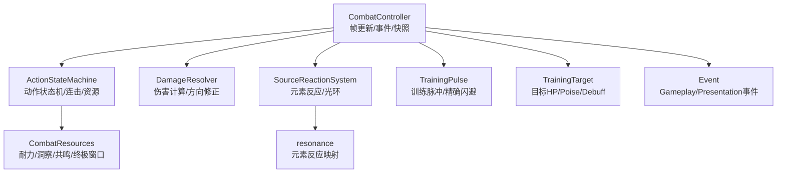
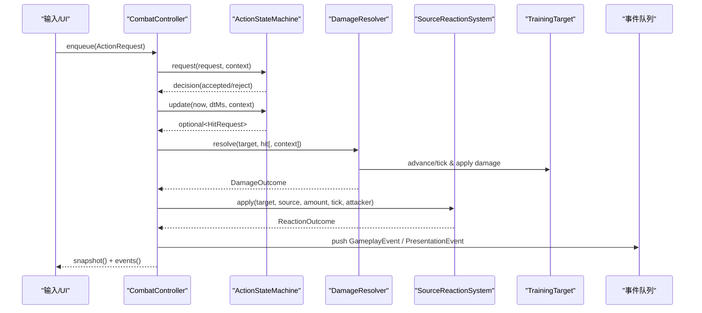
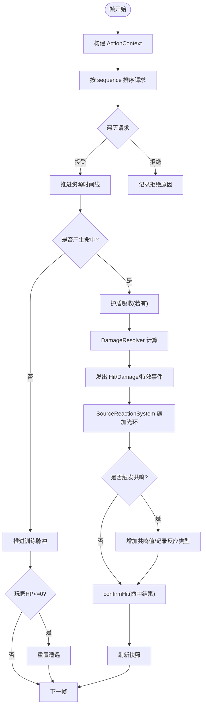
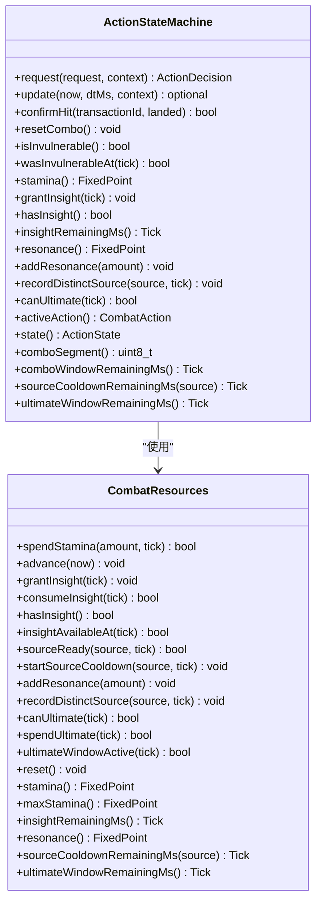
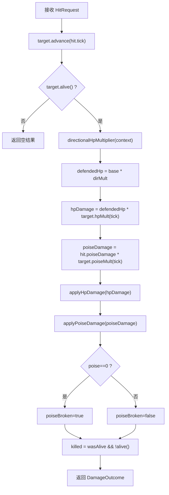
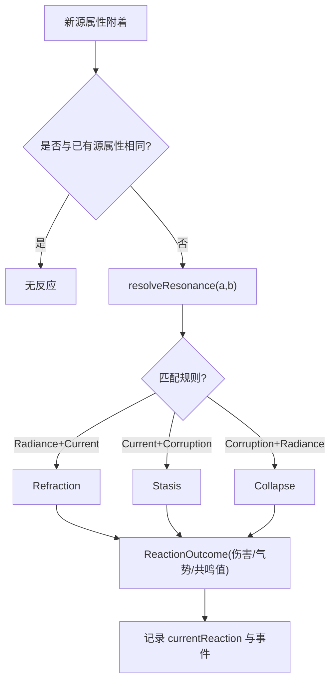
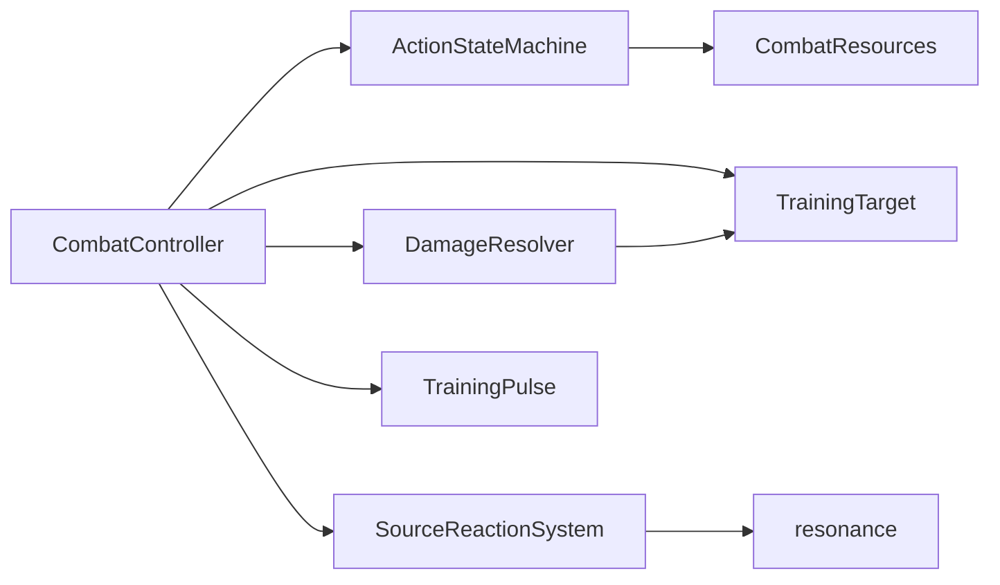

# 战斗系统

<cite>
**本文引用的文件**   
- [combat_controller.h](file://native/gameplay/combat/combat_controller.h)
- [combat_controller.cpp](file://native/gameplay/combat/combat_controller.cpp)
- [action_state_machine.h](file://native/gameplay/combat/action_state_machine.h)
- [action_state_machine.cpp](file://native/gameplay/combat/action_state_machine.cpp)
- [damage_resolver.h](file://native/gameplay/combat/damage_resolver.h)
- [damage_resolver.cpp](file://native/gameplay/combat/damage_resolver.cpp)
- [resonance.h](file://native/gameplay/combat/resonance.h)
- [resonance.cpp](file://native/gameplay/combat/resonance.cpp)
- [source_reaction_system.h](file://native/gameplay/combat/source_reaction_system.h)
- [combat_action.h](file://native/gameplay/combat/combat_action.h)
- [combat_config.h](file://native/gameplay/combat/combat_config.h)
- [event.h](file://native/gameplay/combat/event.h)
- [training_pulse.h](file://native/gameplay/combat/training_pulse.h)
- [training_target.h](file://native/gameplay/combat/training_target.h)
- [combat_resources.h](file://native/gameplay/combat/combat_resources.h)
</cite>

## 目录
1. [简介](#简介)
2. [项目结构](#项目结构)
3. [核心组件](#核心组件)
4. [架构总览](#架构总览)
5. [详细组件分析](#详细组件分析)
6. [依赖关系分析](#依赖关系分析)
7. [性能考虑](#性能考虑)
8. [故障排查指南](#故障排查指南)
9. [结论](#结论)
10. [附录](#附录)

## 简介
本技术文档围绕 my-world 的战斗系统，系统性阐述 CombatController 的核心编排逻辑、ActionStateMachine 的动作状态机与动画同步、DamageResolver 的伤害计算体系、以及 Resonance 共鸣系统的元素反应机制。文档同时覆盖训练脉冲（TrainingPulse）的精确闪避判定、事件系统与表现层解耦、以及面向网络同步与调试的关键设计点。读者无需深入源码即可理解战斗流程与控制流，并可通过“章节来源”快速定位到具体实现位置。

## 项目结构
战斗系统位于 native/gameplay/combat 目录下，采用分层与职责分离的设计：
- 控制器层：CombatController 负责帧级更新、事件排序与快照输出
- 动作层：ActionStateMachine 管理角色动作状态、连击窗口、资源与冷却
- 伤害层：DamageResolver 统一伤害计算与方向性防御修正
- 共鸣层：SourceReactionSystem + resonance 模块驱动元素反应与增益
- 辅助对象：TrainingTarget/TrainingPulse/CombatResources/Event 等支撑数据与工具

图表来源
- [combat_controller.h:68-116](file://native/gameplay/combat/combat_controller.h#L68-L116)
- [action_state_machine.h:24-90](file://native/gameplay/combat/action_state_machine.h#L24-L90)
- [damage_resolver.h:28-37](file://native/gameplay/combat/damage_resolver.h#L28-L37)
- [source_reaction_system.h:15-27](file://native/gameplay/combat/source_reaction_system.h#L15-L27)
- [resonance.h:1-5](file://native/gameplay/combat/resonance.h#L1-L5)
- [training_pulse.h:17-34](file://native/gameplay/combat/training_pulse.h#L17-L34)
- [training_target.h:6-43](file://native/gameplay/combat/training_target.h#L6-L43)
- [combat_resources.h:9-51](file://native/gameplay/combat/combat_resources.h#L9-L51)
- [event.h:1-96](file://native/gameplay/combat/event.h#L1-L96)

章节来源
- [combat_controller.h:1-116](file://native/gameplay/combat/combat_controller.h#L1-L116)
- [combat_controller.cpp:1-309](file://native/gameplay/combat/combat_controller.cpp#L1-L309)
- [action_state_machine.h:1-91](file://native/gameplay/combat/action_state_machine.h#L1-L91)
- [action_state_machine.cpp:1-327](file://native/gameplay/combat/action_state_machine.cpp#L1-L327)
- [damage_resolver.h:1-38](file://native/gameplay/combat/damage_resolver.h#L1-L38)
- [damage_resolver.cpp:1-65](file://native/gameplay/combat/damage_resolver.cpp#L1-L65)
- [resonance.h:1-5](file://native/gameplay/combat/resonance.h#L1-L5)
- [resonance.cpp:1-12](file://native/gameplay/combat/resonance.cpp#L1-L12)
- [source_reaction_system.h:1-28](file://native/gameplay/combat/source_reaction_system.h#L1-L28)
- [combat_action.h:1-67](file://native/gameplay/combat/combat_action.h#L1-L67)
- [combat_config.h:1-153](file://native/gameplay/combat/combat_config.h#L1-L153)
- [event.h:1-96](file://native/gameplay/combat/event.h#L1-L96)
- [training_pulse.h:1-35](file://native/gameplay/combat/training_pulse.h#L1-L35)
- [training_target.h:1-44](file://native/gameplay/combat/training_target.h#L1-L44)
- [combat_resources.h:1-52](file://native/gameplay/combat/combat_resources.h#L1-L52)

## 核心组件
- CombatController：帧输入聚合、动作请求入队、训练脉冲推进、命中与反应处理、事件排序与快照刷新
- ActionStateMachine：动作请求校验、状态切换、连击窗口、资源消耗与恢复、无敌帧与交易确认
- DamageResolver：基础伤害→方向修正→目标抗性→应用伤害→破势/击杀判定
- SourceReactionSystem + resonance：源属性附着、元素反应判定、反应伤害与共鸣值获取
- TrainingPulse：周期性警告/命中事件、精确闪避窗口判定
- TrainingTarget：目标状态（HP/Poise）、Debuff（弱化/凝滞/腐蚀）、伤害乘区
- CombatResources：耐力、洞察、源技能冷却、共鸣值、终极窗口
- Event：游戏内事件与表现事件的统一数据结构与类型枚举

章节来源
- [combat_controller.h:68-116](file://native/gameplay/combat/combat_controller.h#L68-L116)
- [combat_controller.cpp:30-151](file://native/gameplay/combat/combat_controller.cpp#L30-L151)
- [action_state_machine.h:24-90](file://native/gameplay/combat/action_state_machine.h#L24-L90)
- [action_state_machine.cpp:29-220](file://native/gameplay/combat/action_state_machine.cpp#L29-L220)
- [damage_resolver.h:28-37](file://native/gameplay/combat/damage_resolver.h#L28-L37)
- [damage_resolver.cpp:40-65](file://native/gameplay/combat/damage_resolver.cpp#L40-L65)
- [source_reaction_system.h:15-27](file://native/gameplay/combat/source_reaction_system.h#L15-L27)
- [resonance.cpp:1-12](file://native/gameplay/combat/resonance.cpp#L1-L12)
- [training_pulse.h:17-34](file://native/gameplay/combat/training_pulse.h#L17-L34)
- [training_target.h:6-43](file://native/gameplay/combat/training_target.h#L6-L43)
- [combat_resources.h:9-51](file://native/gameplay/combat/combat_resources.h#L9-L51)
- [event.h:42-96](file://native/gameplay/combat/event.h#L42-L96)

## 架构总览
CombatController 作为中枢，将输入转化为动作请求，交由 ActionStateMachine 决策与推进；命中时由 DamageResolver 计算结果，再由 SourceReactionSystem 触发元素反应；最终生成 GameplayEvent 与 PresentationEvent 供上层消费。

图表来源
- [combat_controller.cpp:30-151](file://native/gameplay/combat/combat_controller.cpp#L30-L151)
- [action_state_machine.cpp:108-220](file://native/gameplay/combat/action_state_machine.cpp#L108-L220)
- [damage_resolver.cpp:40-65](file://native/gameplay/combat/damage_resolver.cpp#L40-L65)
- [source_reaction_system.h:15-27](file://native/gameplay/combat/source_reaction_system.h#L15-L27)
- [event.h:42-96](file://native/gameplay/combat/event.h#L42-L96)

## 详细组件分析

### CombatController：战斗流程编排与事件处理
- 帧更新流程
  - 构造 ActionContext，按序列号稳定排序 pendingActions_
  - 先推进资源时间线（零时长不推进命中点），再逐个请求决策
  - 训练模式下处理 TrainingPulse 的 Warning/Hit 事件与精确闪避
  - 若产生 HitRequest，优先扣除护盾，再调用 DamageResolver 计算
  - 调用 SourceReactionSystem 施加光环与反应，记录当前反应类型
  - 根据命中结果回写 ActionStateMachine（confirmHit），并累积共鸣值
  - 刷新 CombatSnapshot，对两类事件分别排序后暴露给上层

- 关键数据结构
  - CombatFrameInput：tick、dtMs、移动、目标选择与存活
  - CombatSnapshot：组合段、HP/Poise、耐力、共鸣、冷却、状态标志
  - CombatEventBatch：gameplay/presentation 两类事件集合
  - CombatTargetBinding：敌人绑定（实体ID、指针、护盾、伤害上下文）

- 错误与边界处理
  - 无目标/目标死亡/冷却不足/资源不足/动作锁定等拒绝原因
  - 精确闪避与无敌帧避免误伤
  - 训练模式死亡重置 encounter

图表来源
- [combat_controller.cpp:43-151](file://native/gameplay/combat/combat_controller.cpp#L43-L151)
- [event.h:42-96](file://native/gameplay/combat/event.h#L42-L96)

章节来源
- [combat_controller.h:68-116](file://native/gameplay/combat/combat_controller.h#L68-L116)
- [combat_controller.cpp:30-151](file://native/gameplay/combat/combat_controller.cpp#L30-L151)

### ActionStateMachine：动作状态机与动画同步
- 状态与动作
  - 动作类型：普通攻击、闪避、三种源技能（Radiance/Current/Corruption）、终极
  - 状态：Idle、Attack1~4、Dodging、CastingSource、CastingUltimate
  - 连击窗口：comboWindowMs，超时或移动/受击则重置

- 请求决策
  - 合法性检查：目标存在/存活、非锁定中、冷却/资源充足
  - 闪避：消耗耐力，设置无敌区间
  - 源技能/终极：分配交易ID，进入施法计时
  - 普攻：进入连击计数，等待链式输入

- 时间推进与命中
  - 固定命中延迟 kAttackHitMs=160ms
  - 源技能/终极在命中时刻产出 HitRequest，附带 ability、source、amount、transactionId
  - confirmHit 回调：源技能启动冷却、记录不同源、消耗洞察；终极消耗终极值

- 无敌与闪避判定
  - isInvulnerable/wasInvulnerableAt 基于 dodgeInvulnerabilityMs 区间

图表来源
- [action_state_machine.h:24-90](file://native/gameplay/combat/action_state_machine.h#L24-L90)
- [combat_resources.h:9-51](file://native/gameplay/combat/combat_resources.h#L9-L51)

章节来源
- [action_state_machine.h:1-91](file://native/gameplay/combat/action_state_machine.h#L1-L91)
- [action_state_machine.cpp:29-220](file://native/gameplay/combat/action_state_machine.cpp#L29-L220)
- [combat_resources.h:1-52](file://native/gameplay/combat/combat_resources.h#L1-L52)

### DamageResolver：伤害计算系统
- 计算流程
  - 方向修正：根据攻击者相对朝向与最小点积阈值决定前向伤害倍率
  - 目标抗性：hpDamageMultiplier/poiseDamageMultiplier 随时间变化
  - 应用伤害：applyHpDamage/applyPoiseDamage，记录破势与击杀
- 输入参数
  - HitRequest：基础伤害、气势伤害、来源、量值、时间戳、事务ID
  - DamageResolutionContext：攻击者/防守者位置与朝向、可选方向防御配置

图表来源
- [damage_resolver.cpp:40-65](file://native/gameplay/combat/damage_resolver.cpp#L40-L65)
- [training_target.h:22-31](file://native/gameplay/combat/training_target.h#L22-L31)

章节来源
- [damage_resolver.h:1-38](file://native/gameplay/combat/damage_resolver.h#L1-L38)
- [damage_resolver.cpp:1-65](file://native/gameplay/combat/damage_resolver.cpp#L1-L65)
- [training_target.h:6-43](file://native/gameplay/combat/training_target.h#L6-L43)

### Resonance 共鸣系统：元素反应机制
- 元素类型：SourceType::Radiance/Current/Corruption
- 反应映射：
  - Radiance+Current → Refraction（折光）
  - Current+Corruption → Stasis（凝滞）
  - Corruption+Radiance → Collapse（崩解）
- 反应效果：通过 SourceReactionSystem.apply 返回 ReactionOutcome（伤害、气势、共鸣值、破势）
- 视觉反馈：PresentationEventType::ResonanceBurst

图表来源
- [resonance.cpp:1-12](file://native/gameplay/combat/resonance.cpp#L1-L12)
- [source_reaction_system.h:7-13](file://native/gameplay/combat/source_reaction_system.h#L7-L13)
- [event.h:5-14](file://native/gameplay/combat/event.h#L5-L14)

章节来源
- [resonance.h:1-5](file://native/gameplay/combat/resonance.h#L1-L5)
- [resonance.cpp:1-12](file://native/gameplay/combat/resonance.cpp#L1-L12)
- [source_reaction_system.h:1-28](file://native/gameplay/combat/source_reaction_system.h#L1-L28)

### 训练脉冲与精确闪避
- TrainingPulse 周期产生 Warning/Hit 事件
- 精确闪避窗口：在特定 tick 内闪避可触发 Insight 与免伤
- 控制器在收到 Hit 且为精确闪避时，跳过伤害并记录 Dodge 事件

章节来源
- [training_pulse.h:1-35](file://native/gameplay/combat/training_pulse.h#L1-L35)
- [combat_controller.cpp:76-104](file://native/gameplay/combat/combat_controller.cpp#L76-L104)

### 事件系统与表现层解耦
- GameplayEvent：Hit/Damage/Dodge/PoiseBreak/AuraApplied/Resonance/PhaseChanged/Death/EncounterReset
- PresentationEvent：HitFlash/CameraShake/DodgeFlash/CastBarBroken/PoiseBreakBurst/ResonanceBurst/PhaseTransition
- 控制器按 tick/source/target/sequence 稳定排序，确保表现层播放顺序一致

章节来源
- [event.h:42-96](file://native/gameplay/combat/event.h#L42-L96)
- [combat_controller.cpp:299-308](file://native/gameplay/combat/combat_controller.cpp#L299-L308)

## 依赖关系分析
- CombatController 依赖 ActionStateMachine、DamageResolver、SourceReactionSystem、TrainingPulse、TrainingTarget、Event
- ActionStateMachine 依赖 CombatResources、CombatConfig、Event
- DamageResolver 依赖 TrainingTarget、Vec2
- SourceReactionSystem 依赖 DamageResolver、resonance
- TrainingTarget 依赖 CombatConfig、SourceAuraContainer

图表来源
- [combat_controller.h:68-116](file://native/gameplay/combat/combat_controller.h#L68-L116)
- [action_state_machine.h:24-90](file://native/gameplay/combat/action_state_machine.h#L24-L90)
- [damage_resolver.h:28-37](file://native/gameplay/combat/damage_resolver.h#L28-L37)
- [source_reaction_system.h:15-27](file://native/gameplay/combat/source_reaction_system.h#L15-L27)
- [resonance.h:1-5](file://native/gameplay/combat/resonance.h#L1-L5)

章节来源
- [combat_controller.h:1-116](file://native/gameplay/combat/combat_controller.h#L1-L116)
- [action_state_machine.h:1-91](file://native/gameplay/combat/action_state_machine.h#L1-L91)
- [damage_resolver.h:1-38](file://native/gameplay/combat/damage_resolver.h#L1-L38)
- [source_reaction_system.h:1-28](file://native/gameplay/combat/source_reaction_system.h#L1-L28)
- [resonance.h:1-5](file://native/gameplay/combat/resonance.h#L1-L5)

## 性能考虑
- 固定步长与时间推进：ActionStateMachine.update 以 dtMs 推进，避免浮点漂移；hitTickFrom/saturatingAdd 防止溢出
- 事件排序稳定性：按 tick/source/target/sequence 稳定排序，减少重排开销
- 资源更新惰性：resources_.advance(now) 仅在需要时推进，零时长不推进命中点
- 命中批处理：pendingActions_ 批量排序与处理，减少频繁状态切换
- 内存与缓存友好：小结构体（HitRequest/GameplayEvent/PresentationEvent）紧凑布局，利于批量处理
- 网络同步建议：
  - 以 tick 与 sequence 作为确定性锚点，客户端仅回放事件
  - 将 CombatSnapshot 作为权威状态快照，定期广播
  - 对动作请求进行去抖与限流，避免抖动导致状态不一致

[本节为通用指导，不直接分析具体文件]

## 故障排查指南
- 常见拒绝原因
  - NoTarget/TargetDead：检查目标选择与存活状态
  - Cooldown：核对源技能冷却与 triSourceWindowMs
  - InsufficientStamina/InsufficientResonance：检查耐力与共鸣值
  - ActionLocked：确认上一动作未结束或未 confirmHit
- 命中未生效
  - 检查 transactionId 是否正确传递至 confirmHit
  - 确认 target.alive() 与方向修正条件
- 共鸣未触发
  - 确认源属性附着成功与 distinctSource 记录
  - 检查 resolveResonance 映射与 ReactionOutcome
- 训练脉冲误伤
  - 核对 preciseDodgeHitTick 与无敌区间
  - 观察 phase 与 hitRemainingMs

章节来源
- [combat_controller.cpp:15-151](file://native/gameplay/combat/combat_controller.cpp#L15-L151)
- [action_state_machine.cpp:29-220](file://native/gameplay/combat/action_state_machine.cpp#L29-L220)
- [damage_resolver.cpp:40-65](file://native/gameplay/combat/damage_resolver.cpp#L40-L65)
- [resonance.cpp:1-12](file://native/gameplay/combat/resonance.cpp#L1-L12)

## 结论
my-world 的战斗系统以 CombatController 为核心编排器，结合 ActionStateMachine 的状态机、DamageResolver 的伤害管线与 SourceReactionSystem 的元素反应，形成高内聚、低耦合的可扩展架构。通过事件系统与快照机制，实现了表现与逻辑解耦，便于网络同步与调试。建议在后续迭代中继续完善配置校验、性能剖析与自动化测试用例，以提升稳定性与可维护性。

[本节为总结性内容，不直接分析具体文件]

## 附录

### 代码示例路径（不含代码内容）
- 战斗指令执行（动作请求与决策）
  - [action_state_machine.cpp:29-106](file://native/gameplay/combat/action_state_machine.cpp#L29-L106)
  - [combat_controller.cpp:56-74](file://native/gameplay/combat/combat_controller.cpp#L56-L74)
- 伤害计算流程
  - [damage_resolver.cpp:40-65](file://native/gameplay/combat/damage_resolver.cpp#L40-L65)
  - [training_target.h:22-31](file://native/gameplay/combat/training_target.h#L22-L31)
- 共鸣触发逻辑
  - [resonance.cpp:1-12](file://native/gameplay/combat/resonance.cpp#L1-L12)
  - [source_reaction_system.h:15-27](file://native/gameplay/combat/source_reaction_system.h#L15-L27)
- 训练脉冲与精确闪避
  - [training_pulse.h:17-34](file://native/gameplay/combat/training_pulse.h#L17-L34)
  - [combat_controller.cpp:76-104](file://native/gameplay/combat/combat_controller.cpp#L76-L104)
- 事件排序与快照刷新
  - [combat_controller.cpp:219-308](file://native/gameplay/combat/combat_controller.cpp#L219-L308)
  - [event.h:42-96](file://native/gameplay/combat/event.h#L42-L96)