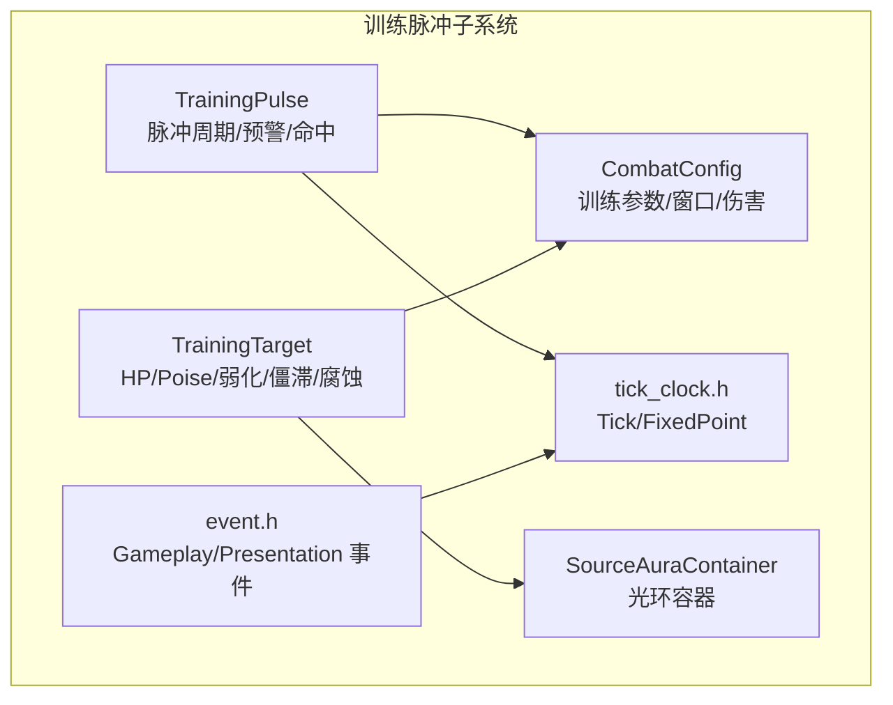
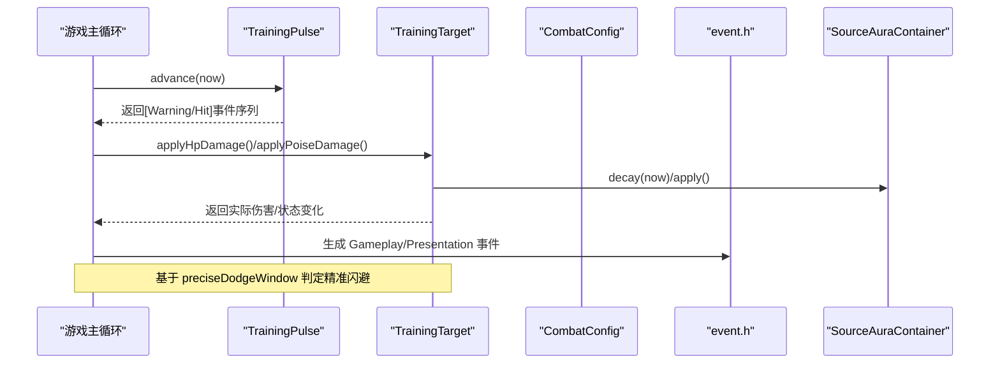
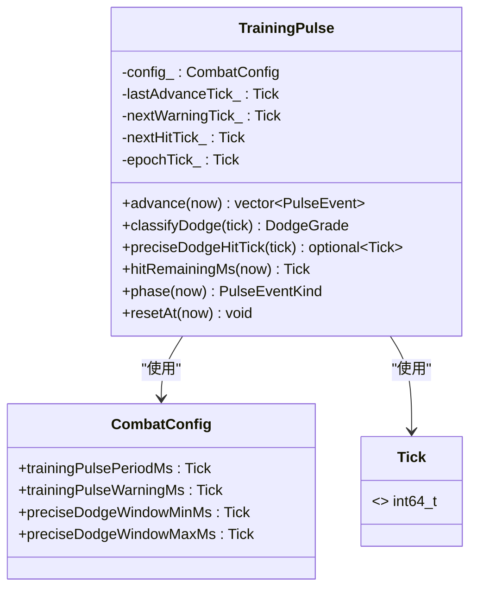
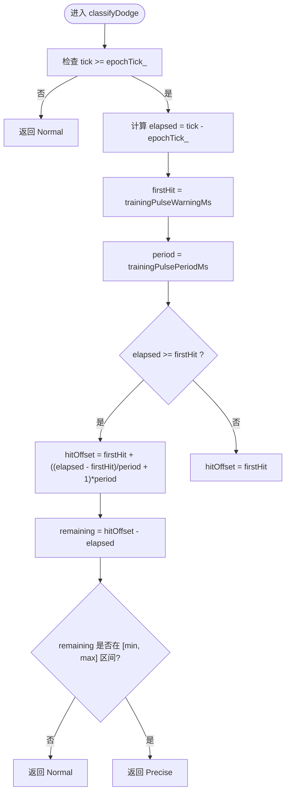
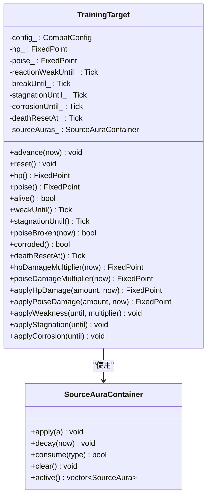
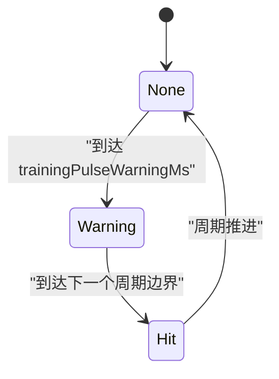
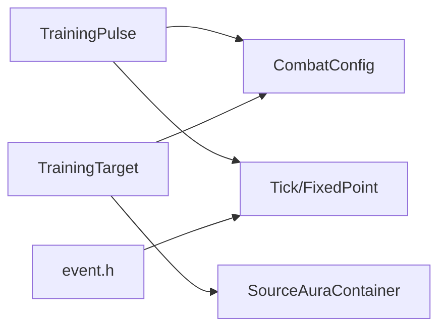

# 训练脉冲系统

<cite>
**本文引用的文件**   
- [training_pulse.h](file://native/gameplay/combat/training_pulse.h)
- [training_pulse.cpp](file://native/gameplay/combat/training_pulse.cpp)
- [training_target.h](file://native/gameplay/combat/training_target.h)
- [training_target.cpp](file://native/gameplay/combat/training_target.cpp)
- [combat_config.h](file://native/gameplay/combat/combat_config.h)
- [event.h](file://native/gameplay/combat/event.h)
- [tick_clock.h](file://native/engine/core/tick_clock.h)
- [source_aura.h](file://native/gameplay/combat/source_aura.h)
- [test_training_pulse.cpp](file://tests/test_training_pulse.cpp)
</cite>

## 目录
1. [引言](#引言)
2. [项目结构](#项目结构)
3. [核心组件](#核心组件)
4. [架构总览](#架构总览)
5. [详细组件分析](#详细组件分析)
6. [依赖关系分析](#依赖关系分析)
7. [性能考量](#性能考量)
8. [故障排查指南](#故障排查指南)
9. [结论](#结论)
10. [附录](#附录)

## 引言
本技术文档围绕 TrainingPulse 训练脉冲系统展开，重点解释精准闪避机制的实现原理（脉冲检测窗口、闪避判定逻辑与奖励计算）、TrainingTarget 训练目标的交互接口（受击反馈、护盾系统与练习模式支持）、PulseEventKind 脉冲事件类型及其触发条件与效果差异，以及训练模式的特殊逻辑（经验值获取、技能熟练度提升、练习数据记录）。同时提供端到端的代码级流程图与时序图，帮助读者快速理解从脉冲生成到闪避判定再到训练反馈的完整流程。

## 项目结构
训练脉冲系统位于 native/gameplay/combat 目录下，核心由以下模块组成：
- 脉冲时序与判定：TrainingPulse（头/源）
- 训练目标状态机：TrainingTarget（头/源）
- 配置与校验：CombatConfig
- 事件与资源：event.h、source_aura.h
- 基础时间类型：tick_clock.h
- 单元测试：test_training_pulse.cpp

图表来源
- [training_pulse.h:1-35](file://native/gameplay/combat/training_pulse.h#L1-L35)
- [training_target.h:1-44](file://native/gameplay/combat/training_target.h#L1-L44)
- [combat_config.h:1-153](file://native/gameplay/combat/combat_config.h#L1-L153)
- [event.h:1-96](file://native/gameplay/combat/event.h#L1-L96)
- [source_aura.h:1-11](file://native/gameplay/combat/source_aura.h#L1-L11)
- [tick_clock.h:1-7](file://native/engine/core/tick_clock.h#L1-L7)

章节来源
- [training_pulse.h:1-35](file://native/gameplay/combat/training_pulse.h#L1-L35)
- [training_target.h:1-44](file://native/gameplay/combat/training_target.h#L1-L44)
- [combat_config.h:1-153](file://native/gameplay/combat/combat_config.h#L1-L153)
- [event.h:1-96](file://native/gameplay/combat/event.h#L1-L96)
- [source_aura.h:1-11](file://native/gameplay/combat/source_aura.h#L1-L11)
- [tick_clock.h:1-7](file://native/engine/core/tick_clock.h#L1-L7)

## 核心组件
- TrainingPulse：负责脉冲周期的推进、预警与命中事件的生成、精准闪避判定窗口计算、剩余命中时间查询与阶段判断。
- TrainingTarget：维护训练目标的 HP、Poise、弱化/破势/僵滞/腐蚀等状态，提供应用伤害、状态更新与自动重置能力。
- CombatConfig：集中管理训练相关的所有数值与窗口参数，并提供安全校验与回退默认值。
- event.h：定义游戏内与表现层事件类型，用于将训练结果反馈给上层 UI/表现系统。
- source_aura.h：为训练目标提供光环（如易伤、僵滞）的叠加与衰减管理。
- tick_clock.h：定义 Tick 与定点数 FixedPoint，确保高精度时间运算与数值稳定性。

章节来源
- [training_pulse.h:1-35](file://native/gameplay/combat/training_pulse.h#L1-L35)
- [training_target.h:1-44](file://native/gameplay/combat/training_target.h#L1-L44)
- [combat_config.h:1-153](file://native/gameplay/combat/combat_config.h#L1-L153)
- [event.h:1-96](file://native/gameplay/combat/event.h#L1-L96)
- [source_aura.h:1-11](file://native/gameplay/combat/source_aura.h#L1-L11)
- [tick_clock.h:1-7](file://native/engine/core/tick_clock.h#L1-L7)

## 架构总览
下图展示了训练脉冲系统的整体交互：TrainingPulse 按周期产生 Warning/Hit 事件；TrainingTarget 接收伤害并管理状态；CombatConfig 提供参数与校验；event.h 承载结果事件；source_aura.h 管理光环；tick_clock.h 提供时间与定点数基础。

图表来源
- [training_pulse.cpp:12-32](file://native/gameplay/combat/training_pulse.cpp#L12-L32)
- [training_target.cpp:15-32](file://native/gameplay/combat/training_target.cpp#L15-L32)
- [combat_config.h:45-54](file://native/gameplay/combat/combat_config.h#L45-L54)
- [event.h:42-96](file://native/gameplay/combat/event.h#L42-L96)
- [source_aura.h:1-11](file://native/gameplay/combat/source_aura.h#L1-L11)

## 详细组件分析

### TrainingPulse 组件分析
TrainingPulse 实现脉冲周期推进、预警与命中事件生成、精准闪避判定窗口计算与阶段判断。关键方法包括：
- advance(now)：推进时间并产出 Warning/Hit 事件序列，避免重复推进与溢出。
- classifyDodge(tick)：根据 preciseDodgeHitTick 是否为空判定 Normal/Precise。
- preciseDodgeHitTick(tick)：计算当前 tick 是否处于精准闪避窗口，并返回对应命中 tick。
- hitRemainingMs(now)：距离下一次命中的剩余毫秒。
- phase(now)：返回当前阶段（None/Warning/Hit）。
- resetAt(now)：重置 epoch 与指针，保证长时间运行下的正确性。

图表来源
- [training_pulse.h:17-34](file://native/gameplay/combat/training_pulse.h#L17-L34)
- [training_pulse.cpp:12-82](file://native/gameplay/combat/training_pulse.cpp#L12-L82)
- [combat_config.h:45-54](file://native/gameplay/combat/combat_config.h#L45-L54)
- [tick_clock.h:1-7](file://native/engine/core/tick_clock.h#L1-L7)

章节来源
- [training_pulse.h:1-35](file://native/gameplay/combat/training_pulse.h#L1-L35)
- [training_pulse.cpp:1-82](file://native/gameplay/combat/training_pulse.cpp#L1-L82)

#### 精准闪避判定流程

图表来源
- [training_pulse.cpp:38-55](file://native/gameplay/combat/training_pulse.cpp#L38-L55)
- [combat_config.h:20-21](file://native/gameplay/combat/combat_config.h#L20-L21)

### TrainingTarget 组件分析
TrainingTarget 维护训练目标的状态与生命周期，支持：
- HP/Poise 管理与伤害应用
- 弱化（weakUntil）、破势（breakUntil）、僵滞（stagnationUntil）、腐蚀（corrosionUntil）等状态
- 死亡后自动重置（deathResetAt）
- 通过 SourceAuraContainer 管理光环（如易伤、僵滞）

图表来源
- [training_target.h:6-43](file://native/gameplay/combat/training_target.h#L6-L43)
- [training_target.cpp:11-88](file://native/gameplay/combat/training_target.cpp#L11-L88)
- [source_aura.h:1-11](file://native/gameplay/combat/source_aura.h#L1-L11)

章节来源
- [training_target.h:1-44](file://native/gameplay/combat/training_target.h#L1-L44)
- [training_target.cpp:1-88](file://native/gameplay/combat/training_target.cpp#L1-L88)

### 脉冲事件类型与触发条件
- PulseEventKind::None：非预警非命中阶段
- PulseEventKind::Warning：预警阶段，提示即将命中
- PulseEventKind::Hit：命中时刻，玩家可在此刻进行精准闪避判定

图表来源
- [training_pulse.h:9-15](file://native/gameplay/combat/training_pulse.h#L9-L15)
- [training_pulse.cpp:67-74](file://native/gameplay/combat/training_pulse.cpp#L67-L74)

章节来源
- [training_pulse.h:1-35](file://native/gameplay/combat/training_pulse.h#L1-L35)
- [training_pulse.cpp:67-74](file://native/gameplay/combat/training_pulse.cpp#L67-L74)

### 训练模式特殊逻辑
- 经验值获取：可通过 GameplayEvent 的 Damage/Hit 事件统计成功闪避或命中次数，结合 CombatConfig 的训练伤害参数计算经验增益。
- 技能熟练度提升：依据精准闪避（Precise）与普通闪避（Normal）的比例，动态调整后续难度（例如缩短 preciseDodgeWindow 或提高 trainingPulsePeriodMs）。
- 练习数据记录：利用 PresentationEvent 记录 UI 反馈（如精准闪避特效），并结合 Tick 序列回放训练过程。

章节来源
- [event.h:42-96](file://native/gameplay/combat/event.h#L42-L96)
- [combat_config.h:45-54](file://native/gameplay/combat/combat_config.h#L45-L54)

### 代码示例路径（不展示具体代码内容）
- 脉冲检测与事件生成：[training_pulse.cpp:12-32](file://native/gameplay/combat/training_pulse.cpp#L12-L32)
- 精准闪避判定与窗口计算：[training_pulse.cpp:38-55](file://native/gameplay/combat/training_pulse.cpp#L38-L55)
- 训练目标伤害应用与状态更新：[training_target.cpp:58-74](file://native/gameplay/combat/training_target.cpp#L58-L74)
- 配置参数与校验：[combat_config.h:45-54](file://native/gameplay/combat/combat_config.h#L45-L54)
- 单元测试验证时序与窗口：[test_training_pulse.cpp:7-78](file://tests/test_training_pulse.cpp#L7-L78)

## 依赖关系分析
TrainingPulse 依赖 CombatConfig 与 Tick 类型；TrainingTarget 依赖 CombatConfig 与 SourceAuraContainer；事件系统通过 event.h 暴露 Gameplay/Presentation 事件；所有时间相关计算均基于 tick_clock.h 的 Tick 与 FixedPoint。

图表来源
- [training_pulse.h:1-35](file://native/gameplay/combat/training_pulse.h#L1-L35)
- [training_target.h:1-44](file://native/gameplay/combat/training_target.h#L1-L44)
- [combat_config.h:1-153](file://native/gameplay/combat/combat_config.h#L1-L153)
- [source_aura.h:1-11](file://native/gameplay/combat/source_aura.h#L1-L11)
- [event.h:1-96](file://native/gameplay/combat/event.h#L1-L96)
- [tick_clock.h:1-7](file://native/engine/core/tick_clock.h#L1-L7)

章节来源
- [training_pulse.h:1-35](file://native/gameplay/combat/training_pulse.h#L1-L35)
- [training_target.h:1-44](file://native/gameplay/combat/training_target.h#L1-L44)
- [combat_config.h:1-153](file://native/gameplay/combat/combat_config.h#L1-L153)
- [source_aura.h:1-11](file://native/gameplay/combat/source_aura.h#L1-L11)
- [event.h:1-96](file://native/gameplay/combat/event.h#L1-L96)
- [tick_clock.h:1-7](file://native/engine/core/tick_clock.h#L1-L7)

## 性能考量
- 时间推进与事件生成：advance 使用 while 循环批量产出事件，避免每帧多次调用导致的重复处理；内部使用 advanceCursor 防止 Tick 溢出。
- 精准判定复杂度：preciseDodgeHitTick 采用 O(1) 数学计算，无额外分配，适合高频调用。
- 状态衰减：TrainingTarget.advance 中仅对必要状态进行衰减与清理，减少不必要的开销。
- 定点数运算：FixedPoint 使用整数定点表示，避免浮点误差累积，提升稳定性。

## 故障排查指南
- 事件未触发：检查 lastAdvanceTick_ 与 now 的关系，确保 advance 被单调递增地调用；确认 nextWarningTick_/nextHitTick_ 初始化是否正确。
- 精准闪避判定异常：核对 preciseDodgeWindowMinMs/MaxMs 配置是否合理；确认 epochTick_ 与 tick 的大小关系。
- 训练目标未重置：检查 deathResetAt_ 与 now 的比较逻辑；确认 alive() 与 reset() 的调用时机。
- 事件丢失：确认 GameplayEvent/PresentationEvent 的 sequence 与 tick 一致性；检查事件队列排序与去重。

章节来源
- [training_pulse.cpp:12-32](file://native/gameplay/combat/training_pulse.cpp#L12-L32)
- [training_target.cpp:15-32](file://native/gameplay/combat/training_target.cpp#L15-L32)
- [event.h:65-96](file://native/gameplay/combat/event.h#L65-L96)

## 结论
TrainingPulse 训练脉冲系统通过精确的时间推进与窗口判定，实现了高稳定性的精准闪避机制；TrainingTarget 提供了完善的训练目标状态管理与反馈接口；CombatConfig 确保了参数的健壮性与可配置性。结合 event.h 的事件体系与 source_aura.h 的光环管理，系统能够灵活支持练习模式、难度调节与进度追踪，满足高质量训练体验的需求。

## 附录
- 关键配置项说明（来自 CombatConfig）：
  - trainingPulsePeriodMs：脉冲周期（毫秒）
  - trainingPulseWarningMs：预警时长（毫秒）
  - preciseDodgeWindowMinMs/MaxMs：精准闪避窗口最小/最大（毫秒）
  - trainingTargetHp/Poise：训练目标初始 HP/Poise
  - trainingBreakDurationMs：破势持续时间（毫秒）
  - trainingDeathResetMs：死亡后重置延迟（毫秒）
  - trainingPulseDamage：脉冲伤害值

章节来源
- [combat_config.h:45-54](file://native/gameplay/combat/combat_config.h#L45-L54)